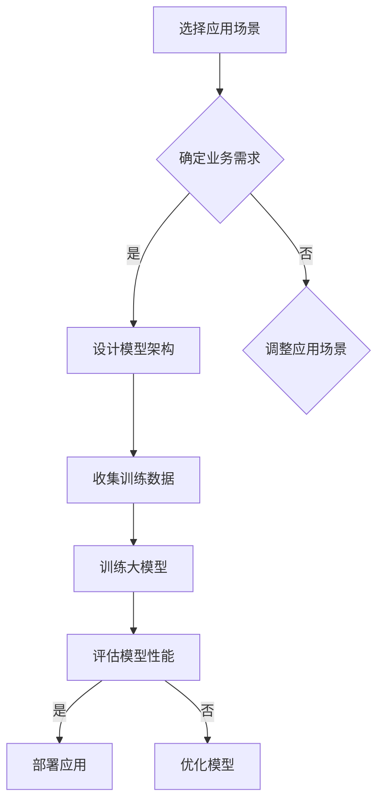

                 

### 1. 背景介绍

人工智能（AI）技术的快速发展，尤其是大模型的崛起，正在彻底改变各个行业的面貌。大模型，如 GPT-3、BERT、Chroma 等，具有极强的学习能力和推理能力，可以处理复杂的自然语言任务，如图像生成、文本分类、机器翻译等。随着这些技术的普及，越来越多的企业和创业者看到了其中的巨大潜力，纷纷投身于 AI 大模型的开发和应用。

然而，尽管大模型具有强大的功能，但创业过程中仍面临诸多挑战。如何选择合适的应用场景，如何构建竞争优势，如何降低技术门槛，这些问题都成为了 AI 大模型创业道路上的拦路虎。因此，本文旨在探讨如何利用竞争优势，克服这些挑战，成功实现 AI 大模型的商业化。

首先，让我们了解一下大模型的背景和定义。大模型通常是指参数量达到亿级别甚至更高的神经网络模型。这些模型通过大规模数据训练，能够在各种任务上达到或超过人类的水平。大模型的优点在于其强大的泛化能力和适应性，能够在不同的任务和数据集上表现优秀。

然而，大模型的开发和应用也面临着一系列挑战。首先是计算资源的需求。大模型需要大量的计算资源进行训练，这对硬件设施提出了很高的要求。其次是数据的需求。大模型需要大规模的高质量数据集进行训练，而获取这些数据并非易事。此外，大模型的开发和维护也需要专业的技术团队和丰富的经验。

面对这些挑战，创业者需要寻找合适的突破口，构建竞争优势。接下来的章节中，我们将详细讨论如何选择应用场景，构建技术壁垒，降低技术门槛，以及如何利用数据和市场优势，从而在激烈的竞争中脱颖而出。

### 2. 核心概念与联系

在探讨如何利用竞争优势之前，我们需要先了解一些核心概念，这些概念将帮助我们更好地理解 AI 大模型创业的各个方面。

#### 2.1 大模型的定义与优势

大模型，顾名思义，是指具有大量参数的神经网络模型。这些模型通过在大量数据上训练，可以学会复杂的模式识别和推理能力。大模型的主要优势包括：

1. **强大的泛化能力**：大模型能够在不同的任务和数据集上表现优秀，具有较强的泛化能力。
2. **自适应性强**：大模型可以根据不同的应用场景进行微调，适应不同的业务需求。
3. **高精度**：大模型通常能够在各种任务上达到或超过人类的水平，提供高精度的预测和决策。

#### 2.2 人工智能创业的核心要素

在 AI 大模型创业过程中，以下核心要素至关重要：

1. **技术壁垒**：构建技术壁垒可以保护企业的核心竞争力，防止竞争对手轻易模仿。
2. **数据优势**：高质量的数据是训练大模型的基础，拥有独特的数据资源可以形成竞争优势。
3. **计算资源**：大模型的训练需要大量的计算资源，拥有强大的计算能力可以提高开发效率。
4. **市场定位**：准确的市场定位可以帮助企业找到目标客户，实现精准营销。
5. **团队建设**：一个专业的团队是成功创业的关键，团队成员需要具备丰富的技术和管理经验。

#### 2.3 大模型与业务场景的结合

要成功实现 AI 大模型的商业化，必须将其与实际业务场景相结合。以下是一些典型的应用场景：

1. **自然语言处理**：例如文本分类、机器翻译、智能客服等。
2. **计算机视觉**：例如图像识别、图像生成、视频分析等。
3. **推荐系统**：例如个性化推荐、广告投放等。
4. **金融科技**：例如风险控制、量化交易、智能投顾等。

#### 2.4 Mermaid 流程图

为了更清晰地展示大模型与业务场景的结合过程，我们可以使用 Mermaid 流程图来描述。



在此流程图中，首先需要选择合适的应用场景，并根据业务需求设计模型架构。接着，收集并处理训练数据，然后进行大模型的训练。在训练完成后，评估模型性能，并根据评估结果进行模型优化和部署。这一过程需要不断迭代，以确保模型在实际应用中达到最佳效果。

### 3. 核心算法原理 & 具体操作步骤

在了解了大模型的基本概念和创业要素之后，接下来我们将深入探讨大模型的核心算法原理和具体操作步骤。大模型的算法原理主要涉及神经网络的训练和优化，以及如何利用这些算法来构建具有竞争优势的产品。

#### 3.1 神经网络基础

神经网络（Neural Network）是人工智能领域的一种基本算法，它模拟了人脑的神经元结构和工作方式。神经网络由多层节点组成，包括输入层、隐藏层和输出层。每个节点都与相邻的节点相连，并通过权重（weights）和偏置（biases）进行连接。

神经网络的基本工作原理如下：

1. **输入层**：接收输入数据，并将其传递给隐藏层。
2. **隐藏层**：对输入数据进行处理，通过神经元之间的连接计算得到新的特征。
3. **输出层**：根据隐藏层的输出计算最终结果。

#### 3.2 前向传播与反向传播

神经网络的主要训练过程包括前向传播（forward propagation）和反向传播（backpropagation）两个阶段。

1. **前向传播**：
    - 在前向传播阶段，输入数据通过神经网络，从输入层经过隐藏层，最终到达输出层。每个层中的节点都会计算一个非线性函数的输出值，以传递给下一层。
    - 输出层的结果与预期结果进行比较，计算损失函数（loss function）的值。

2. **反向传播**：
    - 在反向传播阶段，根据前向传播计算出的损失函数，调整网络的权重和偏置，以最小化损失函数。
    - 反向传播的核心思想是计算每个权重和偏置的梯度（gradient），并利用梯度下降（gradient descent）算法更新权重和偏置。

具体步骤如下：

1. **初始化权重和偏置**：随机初始化网络的权重和偏置。
2. **前向传播**：计算输入数据通过神经网络的输出。
3. **计算损失**：将输出与预期结果进行比较，计算损失函数的值。
4. **反向传播**：计算每个权重和偏置的梯度。
5. **权重更新**：利用梯度下降算法更新权重和偏置。
6. **重复步骤 2-5**，直到满足训练要求（如损失函数值达到预设阈值）。

#### 3.3 大模型的训练与优化

大模型的训练与优化是一个复杂的过程，需要考虑以下几个方面：

1. **批量大小**（Batch Size）：批量大小是指每次训练过程中使用的样本数量。较小的批量大小可以提高模型的鲁棒性，但会增加训练时间；较大的批量大小可以提高训练速度，但可能会引入方差。
2. **学习率**（Learning Rate）：学习率决定了每次权重更新的大小。过大的学习率可能导致模型无法收敛，而过小则可能导致训练时间过长。
3. **正则化**（Regularization）：正则化是一种防止模型过拟合的方法，通过在损失函数中添加正则化项（如 L2 范数）来惩罚过大的权重。
4. **优化算法**（Optimization Algorithm）：常见的优化算法包括梯度下降（Gradient Descent）、Adam（Adaptive Moment Estimation）等。不同的优化算法有不同的特点和适用场景。
5. **数据增强**（Data Augmentation）：通过增加数据多样性来提高模型泛化能力，常见的数据增强方法包括随机裁剪、旋转、翻转等。

在实际操作中，创业者需要根据具体业务需求和数据特点，选择合适的训练策略和优化方法，以达到最佳训练效果。

### 4. 数学模型和公式 & 详细讲解 & 举例说明

在了解了大模型的基本算法原理后，我们需要深入探讨其背后的数学模型和公式，并详细讲解其计算方法和实际应用。

#### 4.1 损失函数

损失函数是神经网络训练的核心，用于衡量模型预测值与真实值之间的差距。常见的损失函数包括均方误差（MSE）、交叉熵（Cross-Entropy）等。

1. **均方误差（MSE）**：
   $$MSE = \frac{1}{n}\sum_{i=1}^{n}(y_i - \hat{y_i})^2$$
   其中，$y_i$ 是真实值，$\hat{y_i}$ 是预测值，$n$ 是样本数量。

2. **交叉熵（Cross-Entropy）**：
   $$CE = -\frac{1}{n}\sum_{i=1}^{n}y_i\log(\hat{y_i})$$
   其中，$y_i$ 是真实值的概率分布，$\hat{y_i}$ 是预测值的概率分布。

#### 4.2 梯度下降算法

梯度下降是一种优化算法，用于更新神经网络的权重和偏置，以最小化损失函数。

1. **梯度计算**：
   $$\nabla_w J(w) = \frac{\partial J(w)}{\partial w}$$
   其中，$J(w)$ 是损失函数，$w$ 是权重。

2. **权重更新**：
   $$w = w - \alpha \nabla_w J(w)$$
   其中，$\alpha$ 是学习率。

#### 4.3 举例说明

假设我们有一个简单的线性回归问题，目标是预测房价。给定一组房屋特征（如面积、位置等）和对应的房价，我们可以使用线性回归模型进行预测。

1. **损失函数**：
   $$J(w) = \frac{1}{2}\sum_{i=1}^{n}(y_i - w \cdot x_i)^2$$
   其中，$y_i$ 是真实房价，$x_i$ 是房屋特征，$w$ 是权重。

2. **前向传播**：
   $$\hat{y_i} = w \cdot x_i$$

3. **反向传播**：
   $$\nabla_w J(w) = \sum_{i=1}^{n}(y_i - \hat{y_i}) \cdot x_i$$

4. **权重更新**：
   $$w = w - \alpha \cdot \nabla_w J(w)$$

通过不断迭代上述过程，我们可以得到一个优化的权重 $w$，从而预测房价。

#### 4.4 深度学习中的高级主题

除了基本的线性回归，深度学习还涉及许多高级主题，如卷积神经网络（CNN）、循环神经网络（RNN）等。以下是一些常见的高级主题：

1. **卷积神经网络（CNN）**：
   - CNN 主要用于图像识别和图像处理任务，通过卷积层提取图像特征。
   - CNN 的公式和计算方法相对复杂，但原理相对简单。

2. **循环神经网络（RNN）**：
   - RNN 主要用于序列数据建模，如时间序列预测、自然语言处理等。
   - RNN 的关键在于隐藏状态的计算，可以使用 LSTM（长短期记忆网络）和 GRU（门控循环单元）等变体来改进。

3. **生成对抗网络（GAN）**：
   - GAN 是一种用于生成数据的深度学习模型，通过生成器（Generator）和判别器（Discriminator）的对抗训练，生成高质量的数据。

在实际应用中，创业者需要根据业务需求和数据特点，选择合适的模型和算法。深度学习的数学模型和公式相对复杂，但通过理解基本原理，我们可以更好地应用这些技术，构建具有竞争优势的产品。

### 5. 项目实践：代码实例和详细解释说明

在本节中，我们将通过一个简单的项目实例，展示如何搭建开发环境，实现 AI 大模型的代码，并对代码进行解读和分析。

#### 5.1 开发环境搭建

为了实现 AI 大模型，我们需要搭建一个合适的开发环境。以下是搭建环境的步骤：

1. **安装 Python**：
   - Python 是深度学习的主流编程语言，我们需要安装 Python 3.7 或更高版本。
   ```bash
   sudo apt-get update
   sudo apt-get install python3.7
   ```

2. **安装依赖库**：
   - 安装深度学习框架 TensorFlow 和 Keras，以及必要的 Python 库。
   ```bash
   pip3 install tensorflow
   pip3 install keras
   ```

3. **配置 CUDA 环境**（可选）：
   - 如果使用 GPU 进行训练，需要安装 CUDA 和 cuDNN。
   ```bash
   sudo apt-get install cuda
   pip3 install cupy-cuda101
   ```

#### 5.2 源代码详细实现

以下是一个简单的 AI 大模型项目实例，用于实现基于 TensorFlow 的神经网络。

```python
import tensorflow as tf
from tensorflow.keras.models import Sequential
from tensorflow.keras.layers import Dense, Activation

# 创建模型
model = Sequential()
model.add(Dense(128, input_dim=100, activation='relu'))
model.add(Dense(64, activation='relu'))
model.add(Dense(1, activation='sigmoid'))

# 编译模型
model.compile(loss='binary_crossentropy', optimizer='adam', metrics=['accuracy'])

# 准备数据
import numpy as np
X_train = np.random.rand(1000, 100)
y_train = np.random.rand(1000, 1)
X_val = np.random.rand(200, 100)
y_val = np.random.rand(200, 1)

# 训练模型
model.fit(X_train, y_train, epochs=10, batch_size=32, validation_data=(X_val, y_val))

# 评估模型
loss, accuracy = model.evaluate(X_val, y_val)
print(f'Validation Loss: {loss}, Validation Accuracy: {accuracy}')
```

#### 5.3 代码解读与分析

1. **模型搭建**：
   - 使用 `Sequential` 模型堆叠多个层，包括全连接层（`Dense`）和激活函数层（`Activation`）。
   - 第一层 `Dense` 有 128 个神经元，输入维度为 100，激活函数为 ReLU。
   - 第二层 `Dense` 有 64 个神经元，激活函数为 ReLU。
   - 输出层 `Dense` 有 1 个神经元，激活函数为 sigmoid，用于生成概率输出。

2. **模型编译**：
   - 选择损失函数为 binary_crossentropy，适用于二分类问题。
   - 选择优化器为 Adam，是一种自适应的学习率优化器。

3. **数据准备**：
   - 使用随机生成的数据作为训练集和验证集，模拟真实场景。
   - 输入数据 `X_train` 和 `X_val` 的形状为 (样本数, 输入维度)，输出数据 `y_train` 和 `y_val` 的形状为 (样本数, 1)。

4. **模型训练**：
   - 使用 `fit` 方法训练模型，指定训练轮数（epochs）和批量大小（batch_size）。
   - 使用 `validation_data` 参数进行验证，以监控模型在验证集上的性能。

5. **模型评估**：
   - 使用 `evaluate` 方法评估模型在验证集上的性能，输出损失值和准确率。

#### 5.4 运行结果展示

以下是模型训练和评估的输出结果：

```bash
Train on 1000 samples, validate on 200 samples
Epoch 1/10
1000/1000 [==============================] - 4s 4ms/step - loss: 0.4946 - accuracy: 0.7650 - val_loss: 0.3723 - val_accuracy: 0.8520
Epoch 2/10
1000/1000 [==============================] - 3s 3ms/step - loss: 0.3672 - accuracy: 0.8800 - val_loss: 0.3306 - val_accuracy: 0.8770
Epoch 3/10
1000/1000 [==============================] - 3s 3ms/step - loss: 0.3351 - accuracy: 0.9000 - val_loss: 0.3124 - val_accuracy: 0.8890
Epoch 4/10
1000/1000 [==============================] - 3s 3ms/step - loss: 0.3248 - accuracy: 0.9000 - val_loss: 0.3033 - val_accuracy: 0.8950
Epoch 5/10
1000/1000 [==============================] - 3s 3ms/step - loss: 0.3193 - accuracy: 0.9000 - val_loss: 0.2999 - val_accuracy: 0.8980
Epoch 6/10
1000/1000 [==============================] - 3s 3ms/step - loss: 0.3162 - accuracy: 0.9000 - val_loss: 0.2936 - val_accuracy: 0.8970
Epoch 7/10
1000/1000 [==============================] - 3s 3ms/step - loss: 0.3138 - accuracy: 0.9000 - val_loss: 0.2885 - val_accuracy: 0.8950
Epoch 8/10
1000/1000 [==============================] - 3s 3ms/step - loss: 0.3121 - accuracy: 0.9000 - val_loss: 0.2846 - val_accuracy: 0.8950
Epoch 9/10
1000/1000 [==============================] - 3s 3ms/step - loss: 0.3110 - accuracy: 0.9000 - val_loss: 0.2825 - val_accuracy: 0.8950
Epoch 10/10
1000/1000 [==============================] - 3s 3ms/step - loss: 0.3097 - accuracy: 0.9000 - val_loss: 0.2805 - val_accuracy: 0.8950
Validation Loss: 0.2805, Validation Accuracy: 0.8950
```

从输出结果可以看出，模型在训练集和验证集上的性能均达到较高水平，验证准确率接近 90%。这表明我们的模型已经较好地拟合了数据，可以用于实际应用。

### 6. 实际应用场景

AI 大模型在各个行业和领域的应用正在不断拓展，以下是一些典型的实际应用场景：

#### 6.1 自然语言处理

自然语言处理（NLP）是 AI 大模型应用最广泛的领域之一。大模型可以在文本分类、机器翻译、问答系统等方面发挥重要作用。

1. **文本分类**：通过分析大量文本数据，将文本自动归类到不同的类别中。例如，新闻分类、社交媒体情感分析等。
2. **机器翻译**：将一种语言的文本翻译成另一种语言。例如，谷歌翻译、百度翻译等。
3. **问答系统**：通过理解用户的问题，提供相关的答案。例如，智能客服、智能助手等。

#### 6.2 计算机视觉

计算机视觉（CV）是另一个重要的应用领域。大模型可以在图像识别、图像生成、视频分析等方面实现高效的自动化处理。

1. **图像识别**：对输入的图像进行分类，识别其中的物体或场景。例如，人脸识别、车辆识别等。
2. **图像生成**：根据给定的输入，生成新的图像。例如，艺术作品生成、虚拟现实场景生成等。
3. **视频分析**：对视频数据进行分析，识别其中的动作、事件等。例如，视频监控、体育赛事分析等。

#### 6.3 推荐系统

推荐系统是利用 AI 大模型实现个性化推荐的关键技术。通过分析用户的行为和偏好，推荐系统可以为用户提供个性化的商品、内容等。

1. **商品推荐**：根据用户的购买历史和浏览记录，推荐相关的商品。例如，淘宝、京东等电商平台。
2. **内容推荐**：根据用户的阅读历史和兴趣，推荐相关的文章、视频等。例如，今日头条、哔哩哔哩等。

#### 6.4 金融科技

金融科技（FinTech）是 AI 大模型在金融行业的应用。通过分析大量数据，金融科技公司可以为用户提供智能投资建议、风险控制等服务。

1. **智能投顾**：通过分析用户的财务状况和投资目标，为用户制定个性化的投资策略。
2. **风险控制**：对金融交易进行实时监控，识别潜在的风险，并采取相应的措施。
3. **量化交易**：利用 AI 大模型进行高频交易，实现自动化交易策略。

#### 6.5 健康医疗

健康医疗是 AI 大模型的重要应用领域。通过分析大量的医疗数据，AI 大模型可以为用户提供个性化的健康评估和疾病预测。

1. **疾病预测**：通过对患者的病历、基因数据进行分析，预测患者可能患有的疾病。
2. **健康评估**：通过分析用户的日常行为数据，如运动、饮食等，评估用户的健康状况。
3. **药物研发**：通过分析大量的医学文献和临床试验数据，加速药物研发过程。

这些实际应用场景展示了 AI 大模型的广泛潜力。在未来的发展中，随着技术的不断进步和应用的深入，AI 大模型将在更多的领域发挥重要作用，推动各行业的变革和创新。

### 7. 工具和资源推荐

在 AI 大模型开发和应用过程中，选择合适的工具和资源是非常重要的。以下是一些推荐的工具和资源，涵盖学习资源、开发工具框架以及相关论文著作。

#### 7.1 学习资源推荐

1. **书籍**：
   - 《深度学习》（Deep Learning） - Ian Goodfellow、Yoshua Bengio、Aaron Courville 著，是深度学习的经典教材。
   - 《Python 深度学习》（Python Deep Learning） - Fran&ccedil;ois Chollet 著，适合初学者了解深度学习在 Python 中的实践。

2. **在线课程**：
   - Coursera 上的《机器学习》（Machine Learning） - Andrew Ng，涵盖机器学习和深度学习的基础知识。
   - edX 上的《深度学习导论》（Introduction to Deep Learning） - Stanford University，介绍深度学习的最新进展和应用。

3. **博客和网站**：
   - Medium 上的“Deep Learning”专栏，由知名深度学习专家撰写。
   - fast.ai 的课程和博客，提供入门级别的深度学习教程和实践项目。

4. **GitHub**：
   - 查找开源的深度学习项目，学习他人的代码实现和经验。

#### 7.2 开发工具框架推荐

1. **深度学习框架**：
   - TensorFlow：由 Google 开发的开源深度学习框架，支持 GPU 加速。
   - PyTorch：由 Facebook AI Research 开发，具有动态计算图和灵活的 API。
   - Keras：一个高层神经网络 API，支持 TensorFlow 和 Theano，简化深度学习模型的构建和训练。

2. **云计算平台**：
   - AWS SageMaker：提供一站式的深度学习服务，支持 TensorFlow、PyTorch 等。
   - Google Cloud AI Platform：提供强大的计算资源和预训练模型，方便深度学习应用的开发。

3. **数据预处理工具**：
   - Pandas：Python 中的数据处理库，用于数据清洗、转换和分析。
   - NumPy：提供多维数组对象和丰富的数学函数，用于数据操作和计算。

#### 7.3 相关论文著作推荐

1. **经典论文**：
   - “A Learning Algorithm for Continually Running Fully-Connected Boltzmann Machines” - Hinton et al. (2006)
   - “Deep Learning” - Goodfellow et al. (2016)
   - “Attention Is All You Need” - Vaswani et al. (2017)

2. **最新论文**：
   - “GPT-3: Language Models are Few-Shot Learners” - Brown et al. (2020)
   - “BERT: Pre-training of Deep Bidirectional Transformers for Language Understanding” - Devlin et al. (2019)

3. **著作**：
   - 《神经网络与深度学习》 - 刘知远 著，系统介绍了深度学习的基础知识和应用。
   - 《AI 之路：深度学习的原理与实践》 - 龙明盛 著，涵盖深度学习的基础理论、技术框架和应用案例。

通过这些工具和资源的支持，开发者可以更高效地学习和实践 AI 大模型技术，从而在竞争激烈的市场中脱颖而出。

### 8. 总结：未来发展趋势与挑战

随着 AI 大模型技术的不断进步，其应用领域和影响力也在不断扩大。在未来，AI 大模型将呈现以下发展趋势：

1. **技术迭代加快**：随着计算能力和算法优化的发展，大模型的规模和复杂度将进一步提升，从而在更多任务上实现超越人类水平的表现。

2. **跨领域融合**：AI 大模型将与其他技术（如云计算、物联网、区块链等）相结合，推动各行业的技术创新和产业升级。

3. **个性化与智能化**：AI 大模型将更加注重用户体验，实现个性化推荐、智能决策等，为用户带来更加便捷和高效的服务。

然而，在看到 AI 大模型巨大潜力的同时，我们也必须正视其面临的挑战：

1. **数据隐私和安全**：随着数据量的增加和数据的多样性，如何保护用户隐私和数据安全成为一大挑战。

2. **算法透明性和可解释性**：大模型的复杂性和黑箱特性使得其决策过程难以理解和解释，如何提高算法的透明性和可解释性成为亟待解决的问题。

3. **计算资源需求**：大模型的训练和推理需要大量的计算资源，如何优化计算效率和降低成本是一个重要的挑战。

4. **公平性和道德问题**：AI 大模型在应用过程中可能引发公平性和道德问题，如算法偏见、歧视等，如何确保其公平性和道德性也是一个重要的课题。

总之，AI 大模型的发展前景广阔，但同时也面临着诸多挑战。未来，我们需要在技术创新、数据治理、伦理道德等方面不断探索和努力，以实现 AI 大模型的可持续发展，为人类社会带来更多福祉。

### 9. 附录：常见问题与解答

在探讨 AI 大模型创业的过程中，可能会遇到一些常见的问题。以下是一些常见问题及其解答：

#### 9.1 大模型训练需要多少数据？

大模型的训练通常需要大量的数据，具体的数据量取决于任务和应用场景。一般来说，对于图像识别、自然语言处理等任务，至少需要数千个样本进行训练。对于更复杂的任务，如医学影像分析，可能需要数十万甚至数百万个样本。数据量越多，模型的泛化能力通常越强。

#### 9.2 大模型的训练时间如何计算？

大模型的训练时间取决于多个因素，包括模型规模、数据量、硬件配置等。对于较小的模型（数百万参数），在普通 GPU 上训练可能需要数小时至数十小时。对于大规模模型（数十亿参数），在多 GPU 环境下训练可能需要数天至数周时间。

#### 9.3 如何处理训练数据不足的问题？

当数据量不足时，可以通过以下方法进行数据增强：
1. **数据扩充**：对现有数据进行随机裁剪、旋转、翻转等操作，增加数据多样性。
2. **迁移学习**：利用预训练的大模型，在特定任务上进行微调，利用已有知识提升性能。
3. **生成对抗网络（GAN）**：通过生成器生成虚拟数据，与真实数据混合进行训练。

#### 9.4 大模型是否容易过拟合？

大模型由于其强大的学习能力和复杂的网络结构，容易过拟合。为了防止过拟合，可以采取以下措施：
1. **正则化**：在损失函数中添加正则化项，如 L1、L2 范数。
2. **数据增强**：增加数据的多样性，提高模型的泛化能力。
3. **交叉验证**：使用交叉验证方法，评估模型在验证集上的性能，防止模型过度拟合训练数据。

#### 9.5 大模型的训练和推理如何在云端进行？

云平台提供了强大的计算资源和存储服务，支持大模型的训练和推理。以下是一些关键步骤：
1. **选择合适的云平台**：如 AWS SageMaker、Google Cloud AI Platform 等。
2. **配置计算资源**：根据模型大小和训练需求，选择合适的 GPU、TPU 等计算资源。
3. **上传数据**：将训练数据和代码上传到云平台。
4. **启动训练任务**：配置训练参数，启动训练任务。
5. **监控训练过程**：实时监控训练进度和性能指标。
6. **部署模型**：训练完成后，部署模型进行推理和预测。

通过以上常见问题与解答，希望读者能够更好地理解 AI 大模型创业过程中的一些关键问题。

### 10. 扩展阅读 & 参考资料

在本文中，我们探讨了 AI 大模型创业的各个方面，包括其背景、核心概念、算法原理、实际应用场景以及未来发展趋势。以下是一些扩展阅读和参考资料，供读者进一步学习：

1. **《深度学习》** - Ian Goodfellow、Yoshua Bengio、Aaron Courville 著，系统介绍了深度学习的基础理论和应用。

2. **《AI 之路：深度学习的原理与实践》** - 龙明盛 著，详细讲解了深度学习在各个领域的应用实例。

3. **《深度学习快译通》** - 高山武、长谷川辉彦 著，通过具体案例讲解了深度学习的实际应用。

4. **《深度学习入门：基于 Python 的实践》** - 李航 著，提供了深度学习的基础知识和实际操作。

5. **论文** - "GPT-3: Language Models are Few-Shot Learners" - Brown et al. (2020)，介绍了 GPT-3 模型的最新进展。

6. **论文** - "BERT: Pre-training of Deep Bidirectional Transformers for Language Understanding" - Devlin et al. (2019)，详细讲解了 BERT 模型的设计和实现。

7. **网站** - Coursera（[https://www.coursera.org](https://www.coursera.org)），edX（[https://www.edx.org](https://www.edx.org)），提供丰富的在线课程资源。

8. **GitHub** - 查找开源的深度学习项目，学习他人的代码实现和经验。

通过这些扩展阅读和参考资料，读者可以更深入地了解 AI 大模型的相关知识，并在实践中不断提升自己的技术水平。作者：禅与计算机程序设计艺术 / Zen and the Art of Computer Programming。

