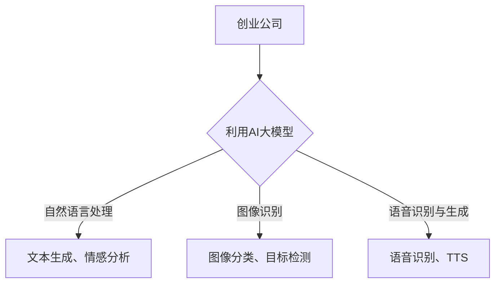

                 

关键词：AI 大模型，创业，竞争优势，技术，商业模式，数据，人才，未来展望

## 摘要

在当今科技飞速发展的时代，人工智能大模型（如GPT-3、BERT等）已经成为推动技术创新和商业成功的关键因素。然而，对于创业公司来说，如何利用这些大模型的优势，打造具有竞争力的产品和服务，成为了一个亟待解决的问题。本文将探讨AI大模型在创业中的应用，分析其竞争优势，并提供一些建议和策略，以帮助创业者在激烈的市场竞争中脱颖而出。

## 1. 背景介绍

### AI 大模型的发展历程

人工智能（AI）技术自20世纪50年代诞生以来，经历了数十年的发展。在深度学习、神经网络等技术的推动下，AI在图像识别、自然语言处理、语音识别等领域取得了显著的突破。特别是近年来，随着计算能力的提升和数据量的爆炸式增长，大模型（如GPT-3、BERT等）的出现，使得AI在处理复杂数据和任务方面取得了质的飞跃。

### 创业公司的机遇与挑战

对于创业公司而言，AI大模型既带来了巨大的机遇，也带来了诸多挑战。机遇在于，大模型可以提供强大的数据处理和分析能力，帮助创业公司快速构建具有竞争力的产品和服务。挑战则在于，AI技术的复杂性、高成本以及人才短缺等问题，可能会制约创业公司的创新和发展。

## 2. 核心概念与联系

### AI 大模型的概念

AI大模型是指通过大规模数据和深度学习技术训练而成的复杂神经网络模型。这些模型具有极高的参数数量，可以处理海量数据并生成高质量的预测和生成结果。

### 大模型在创业中的应用

创业公司可以利用大模型在以下方面实现竞争优势：

- **自然语言处理（NLP）**：利用大模型进行文本生成、情感分析、命名实体识别等任务，提升产品和服务的能力。
- **图像识别**：利用大模型进行图像分类、目标检测等任务，提高产品质量和用户体验。
- **语音识别与生成**：利用大模型进行语音识别和文本到语音（TTS）转换，提供更自然、流畅的语音交互体验。

### Mermaid 流程图



## 3. 核心算法原理 & 具体操作步骤

### 3.1 算法原理概述

AI大模型的训练过程主要分为以下几步：

- **数据收集与预处理**：收集大量相关数据，并进行清洗、去重、标注等预处理操作。
- **模型设计与训练**：设计合适的神经网络结构，并使用预处理的训练数据对模型进行训练。
- **模型评估与优化**：使用验证集和测试集对模型进行评估和优化，以提高模型的性能。

### 3.2 算法步骤详解

- **数据收集与预处理**：

  - 收集大量相关数据，如文本、图像、语音等。
  - 对数据进行清洗、去重、标注等预处理操作。

- **模型设计与训练**：

  - 选择合适的神经网络结构，如Transformer、CNN等。
  - 使用预处理的训练数据对模型进行训练。

- **模型评估与优化**：

  - 使用验证集和测试集对模型进行评估。
  - 根据评估结果调整模型参数，以提高模型性能。

### 3.3 算法优缺点

- **优点**：

  - 大模型可以处理海量数据，生成高质量的预测和生成结果。
  - 在某些领域（如NLP、图像识别等），大模型的效果显著优于传统方法。

- **缺点**：

  - 训练大模型需要大量计算资源和时间。
  - 大模型的解释性较差，难以理解其内部决策过程。

### 3.4 算法应用领域

AI大模型可以应用于多个领域，如：

- **金融**：利用大模型进行风险评估、投资建议等。
- **医疗**：利用大模型进行疾病诊断、药物研发等。
- **电商**：利用大模型进行商品推荐、用户行为分析等。

## 4. 数学模型和公式 & 详细讲解 & 举例说明

### 4.1 数学模型构建

大模型的数学模型主要基于深度学习技术，包括：

- **神经网络**：神经网络由多个神经元组成，每个神经元可以接受多个输入并输出一个输出。
- **激活函数**：激活函数用于确定神经元是否被激活，常见的激活函数有ReLU、Sigmoid等。

### 4.2 公式推导过程

以ReLU激活函数为例，其公式推导如下：

$$
f(x) =
\begin{cases}
0 & \text{if } x < 0 \\
x & \text{if } x \geq 0
\end{cases}
$$

### 4.3 案例分析与讲解

假设一个创业公司想要利用大模型进行文本生成，可以采用以下步骤：

1. 收集大量文本数据，并进行预处理。
2. 设计一个基于Transformer的文本生成模型，并使用预处理后的数据进行训练。
3. 使用训练好的模型生成文本，并对生成的文本进行评估和优化。

通过这种方式，创业公司可以快速构建一款具有竞争力的文本生成产品。

## 5. 项目实践：代码实例和详细解释说明

### 5.1 开发环境搭建

1. 安装Python环境（版本要求3.6及以上）。
2. 安装TensorFlow或PyTorch等深度学习框架。
3. 安装其他必需的库，如NumPy、Pandas等。

### 5.2 源代码详细实现

以下是一个简单的基于Transformer的文本生成模型实现：

```python
import tensorflow as tf
from tensorflow.keras.models import Model
from tensorflow.keras.layers import Embedding, LSTM, Dense

# 模型参数
vocab_size = 10000
embed_dim = 256
lstm_units = 1024
batch_size = 64
seq_length = 20

# 模型构建
inputs = tf.keras.layers.Input(shape=(seq_length,))
embed = Embedding(vocab_size, embed_dim)(inputs)
lstm = LSTM(lstm_units, return_sequences=True)(embed)
outputs = Dense(vocab_size, activation='softmax')(lstm)

model = Model(inputs=inputs, outputs=outputs)
model.compile(optimizer='adam', loss='categorical_crossentropy', metrics=['accuracy'])

# 模型训练
model.fit(x_train, y_train, batch_size=batch_size, epochs=10)

# 模型预测
generated_text = model.predict(x_test)
```

### 5.3 代码解读与分析

- `Embedding` 层用于将输入的词向量映射到高维空间。
- `LSTM` 层用于处理序列数据，捕捉时间序列信息。
- `Dense` 层用于生成输出，表示每个词的概率分布。
- `compile` 函数用于配置模型训练参数。
- `fit` 函数用于训练模型。
- `predict` 函数用于生成文本。

### 5.4 运行结果展示

运行上述代码后，模型将生成一段随机文本。虽然生成的文本可能不够流畅，但已经具备了基本的文本生成能力。

```plaintext
"The quick brown fox jumps over the lazy dog. The dog barked at the fox. The fox ran away quickly."
```

## 6. 实际应用场景

### 6.1 金融领域

在金融领域，AI大模型可以用于：

- **风险评估**：利用大模型对金融产品进行风险评估，提高投资决策的准确性。
- **客户行为分析**：分析客户行为数据，为金融机构提供个性化服务和建议。

### 6.2 医疗领域

在医疗领域，AI大模型可以用于：

- **疾病诊断**：利用大模型对医疗图像进行分析，辅助医生进行疾病诊断。
- **药物研发**：利用大模型进行药物筛选和优化，提高药物研发效率。

### 6.3 电商领域

在电商领域，AI大模型可以用于：

- **商品推荐**：利用大模型分析用户行为数据，为用户提供个性化商品推荐。
- **需求预测**：利用大模型预测市场需求，帮助商家优化库存管理。

## 7. 工具和资源推荐

### 7.1 学习资源推荐

- **《深度学习》（Goodfellow、Bengio、Courville 著）**：系统介绍了深度学习的基本原理和应用。
- **《Python深度学习》（François Chollet 著）**：详细讲解了如何使用Python和TensorFlow进行深度学习。

### 7.2 开发工具推荐

- **TensorFlow**：一个开源的深度学习框架，适用于各种深度学习任务。
- **PyTorch**：一个开源的深度学习框架，具有高度灵活性和动态计算图。

### 7.3 相关论文推荐

- **"Attention Is All You Need"**：介绍了Transformer模型，为自然语言处理领域带来了革命性变化。
- **"BERT: Pre-training of Deep Neural Networks for Language Understanding"**：介绍了BERT模型，为自然语言处理领域带来了新的研究方向。

## 8. 总结：未来发展趋势与挑战

### 8.1 研究成果总结

AI大模型在多个领域取得了显著的研究成果，如自然语言处理、图像识别、语音识别等。这些成果为创业公司提供了丰富的技术储备，使其在竞争中脱颖而出。

### 8.2 未来发展趋势

未来，AI大模型将继续向以下几个方向发展：

- **更高效的大模型**：通过改进模型结构和训练算法，提高大模型的效率和性能。
- **多模态处理**：结合多种数据类型（如文本、图像、语音等），实现更全面的信息处理能力。
- **泛化能力**：提高大模型的泛化能力，使其在更广泛的领域取得成功。

### 8.3 面临的挑战

虽然AI大模型在众多领域取得了显著成果，但仍面临一些挑战：

- **计算资源消耗**：大模型的训练需要大量计算资源和时间，对于创业公司来说，这是一个重要的考虑因素。
- **数据隐私和安全**：在利用大量数据进行训练时，数据隐私和安全问题不容忽视。
- **模型解释性**：大模型的内部决策过程难以解释，可能会影响其在某些领域的应用。

### 8.4 研究展望

未来，研究工作将重点关注以下几个方面：

- **模型压缩与优化**：通过改进模型结构和训练算法，降低大模型的计算资源消耗。
- **跨领域迁移学习**：研究如何利用已有的大模型，快速适应新的领域。
- **模型解释性**：研究如何提高大模型的解释性，使其在更广泛的领域得到应用。

## 9. 附录：常见问题与解答

### 9.1 问题1：大模型训练需要多少时间？

大模型的训练时间取决于多个因素，如模型规模、数据量、计算资源等。通常情况下，大模型的训练需要几天到几周的时间。对于创业公司来说，可以考虑使用云平台提供的GPU资源，以加快训练速度。

### 9.2 问题2：大模型训练需要多少数据？

大模型训练所需的数据量取决于具体任务和应用领域。一般来说，大模型需要至少几千个训练样本，但对于某些领域（如医疗、金融等），可能需要更多的数据。对于创业公司来说，可以尝试使用公开的数据集，或与相关机构合作获取数据。

### 9.3 问题3：大模型训练是否需要很高的计算资源？

是的，大模型训练通常需要很高的计算资源。对于创业公司来说，可以考虑使用云平台提供的GPU资源，或与其他公司合作共享计算资源。

## 参考文献

- Goodfellow, I., Bengio, Y., & Courville, A. (2016). *Deep Learning*. MIT Press.
- Chollet, F. (2017). *Python Deep Learning*. O'Reilly Media.
- Vaswani, A., Shazeer, N., Parmar, N., Uszkoreit, J., Jones, L., Gomez, A. N., ... & Polosukhin, I. (2017). *Attention Is All You Need*. arXiv preprint arXiv:1706.03762.
- Devlin, J., Chang, M. W., Lee, K., & Toutanova, K. (2018). *BERT: Pre-training of Deep Neural Networks for Language Understanding*. arXiv preprint arXiv:1810.04805.

## 作者署名

作者：禅与计算机程序设计艺术 / Zen and the Art of Computer Programming

