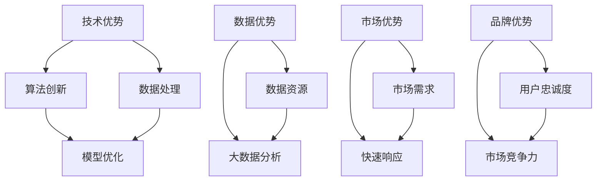

                 

### 1. 背景介绍

随着人工智能技术的快速发展，尤其是大模型技术的突破，AI大模型在各个领域的应用日益广泛，从自然语言处理到计算机视觉，从语音识别到推荐系统，都取得了显著的成果。然而，在这样的大背景下，如何利用AI大模型进行创业，如何通过竞争优势在竞争激烈的市场中脱颖而出，成为了一个值得探讨的问题。

AI大模型创业，是指利用人工智能领域中的大规模神经网络模型进行业务创新，通过模型提供的强大能力，实现产品的差异化，提高市场竞争力。在这个过程中，理解并利用竞争优势是关键。竞争优势可以理解为企业在市场中能够获得超额利润的能力，它是企业长期生存和发展的基础。

竞争优势的来源可以是多种多样的，包括成本领先、差异化、集中化等。对于AI大模型创业来说，其竞争优势主要体现在以下几个方面：

1. **技术优势**：拥有领先的人工智能技术，包括算法创新、模型优化、数据处理等，能够提供更高效、更准确、更智能的产品和服务。
2. **数据优势**：拥有丰富的数据资源，能够通过大数据分析和机器学习，不断优化模型，提高服务的质量和用户体验。
3. **市场优势**：准确识别市场需求，快速响应市场变化，提供符合用户需求的产品和服务。
4. **品牌优势**：建立良好的品牌形象，提高用户忠诚度，增强市场竞争力。

本文将围绕AI大模型创业的竞争优势展开讨论，旨在帮助创业者更好地理解这一领域，找到适合自己的创业路径。

### 2. 核心概念与联系

在探讨AI大模型创业的竞争优势之前，我们首先需要了解几个核心概念及其相互之间的联系。以下是一个简化的Mermaid流程图，用以展示这些核心概念及其关系：



#### 2.1 技术优势

技术优势是AI大模型创业的核心竞争力之一，它包括算法创新、模型优化和数据处理等多个方面。算法创新指的是不断探索新的算法和方法，以提升模型的效果和效率。模型优化则是通过调整模型的参数和结构，使其在特定任务上表现更优。数据处理则包括数据清洗、归一化、特征提取等，为模型训练提供高质量的数据输入。

#### 2.2 数据优势

数据优势是另一个关键因素，它主要涉及数据资源和大数据分析。数据资源是指企业所拥有的数据量、数据种类和数据质量。大数据分析则是指利用先进的分析方法，从海量数据中提取有价值的信息，为业务决策提供支持。

#### 2.3 市场优势

市场优势体现在对市场需求的准确把握和快速响应上。准确识别市场需求，能够帮助创业者推出符合用户期望的产品和服务。快速响应市场变化，则使企业能够及时调整策略，抓住市场机会。

#### 2.4 品牌优势

品牌优势是指通过建立良好的品牌形象，提高用户忠诚度和市场竞争力。品牌形象不仅影响用户对企业产品和服务的认知，也直接影响用户的购买决策。用户忠诚度则是指用户对品牌产生的依赖和信任，这对企业的长期发展至关重要。

通过上述核心概念及其关系的理解，我们可以更好地把握AI大模型创业的竞争优势，为后续的内容打下坚实的基础。

### 3. 核心算法原理 & 具体操作步骤

在了解AI大模型创业的竞争优势之后，我们需要深入探讨其中的核心算法原理，并详细介绍具体的操作步骤，以帮助创业者更好地利用这些优势进行业务创新。

#### 3.1 大模型训练的基本原理

AI大模型的核心在于其训练过程。大模型通常是指具有数百万甚至数十亿参数的神经网络模型。这些模型通过学习大量数据，能够自动提取特征，实现复杂的任务。大模型训练的基本原理可以概括为以下几步：

1. **数据预处理**：对输入数据集进行清洗、归一化和特征提取，确保数据质量。
2. **模型初始化**：初始化模型参数，通常采用随机初始化或预训练模型初始化。
3. **前向传播**：将输入数据通过模型的前向传播网络，计算出输出结果。
4. **计算损失**：将输出结果与真实标签进行比较，计算损失函数的值。
5. **反向传播**：利用梯度下降等方法，计算模型参数的梯度，并更新参数。
6. **迭代训练**：重复前向传播、计算损失和反向传播的过程，直至模型收敛。

#### 3.2 大模型训练的详细步骤

以下是一个简化的AI大模型训练的具体操作步骤：

1. **数据收集与预处理**：

    - 收集大量的数据集，包括训练集、验证集和测试集。
    - 对数据集进行清洗，去除噪声和不完整的数据。
    - 对数据进行归一化处理，使其具有相似的尺度。
    - 提取特征，将原始数据转换为模型能够处理的格式。

2. **模型选择与初始化**：

    - 根据任务需求，选择合适的大模型架构，如Transformer、BERT等。
    - 初始化模型参数，可以使用随机初始化或预训练模型。

3. **模型训练**：

    - 执行前向传播，计算输出结果。
    - 计算损失函数，如交叉熵损失、均方误差等。
    - 执行反向传播，计算参数梯度。
    - 更新模型参数，减少损失函数值。
    - 重复上述步骤，直至模型收敛或达到预设的训练次数。

4. **模型评估与优化**：

    - 使用验证集评估模型性能，选择性能最佳的模型。
    - 对模型进行调参，如调整学习率、批量大小等，以优化模型性能。
    - 根据需要，进行多轮训练和评估，直至找到最优模型。

#### 3.3 大模型应用案例

以下是一个具体的应用案例，展示了如何利用大模型进行自然语言处理任务：

1. **任务描述**：构建一个文本分类模型，用于对新闻文章进行分类。

2. **数据集**：使用一个包含新闻文章及其分类标签的大型数据集。

3. **模型架构**：选择Transformer模型，因其在大规模文本处理任务上的优越性能。

4. **训练过程**：

    - 数据预处理：对新闻文章进行分词、词向量化，构建词汇表。
    - 模型初始化：使用随机初始化或预训练的BERT模型。
    - 训练：通过前向传播、计算损失、反向传播等步骤，训练模型。
    - 评估：使用验证集评估模型性能，调整模型参数。

5. **结果展示**：在测试集上，模型能够达到较高的准确率，为新闻分类任务提供了有效解决方案。

通过上述核心算法原理和具体操作步骤的介绍，创业者可以更好地理解如何利用大模型技术进行业务创新，提升企业的竞争力。

### 4. 数学模型和公式 & 详细讲解 & 举例说明

在AI大模型训练过程中，数学模型和公式起着至关重要的作用。以下我们将详细讲解几个核心的数学模型和公式，并通过实际例子来说明其应用。

#### 4.1 损失函数

损失函数是评估模型预测结果与真实值之间差异的指标，常见的损失函数包括交叉熵损失和均方误差（MSE）。

**交叉熵损失（Cross-Entropy Loss）**：

交叉熵损失在分类问题中应用广泛，其公式如下：

\[ 
L(\theta) = -\frac{1}{m} \sum_{i=1}^{m} y_i \log(p_i) 
\]

其中，\( y_i \) 为真实标签，\( p_i \) 为模型预测的概率。

**均方误差（Mean Squared Error, MSE）**：

均方误差在回归问题中使用较多，其公式如下：

\[ 
L(\theta) = \frac{1}{2m} \sum_{i=1}^{m} (y_i - \hat{y}_i)^2 
\]

其中，\( y_i \) 为真实值，\( \hat{y}_i \) 为模型预测值。

#### 4.2 反向传播算法

反向传播算法是训练神经网络的核心算法，其基本思想是通过计算梯度来更新模型参数，以减少损失函数的值。

**梯度计算**：

假设我们有损失函数 \( L(\theta) \)，其中 \( \theta \) 为模型参数。反向传播算法的目标是计算损失函数关于每个参数的梯度 \( \frac{\partial L}{\partial \theta} \)。

**梯度下降更新公式**：

\[ 
\theta = \theta - \alpha \frac{\partial L}{\partial \theta} 
\]

其中，\( \alpha \) 为学习率，用于控制参数更新的步长。

#### 4.3 实际例子

以下通过一个简单的例子来说明这些数学模型和公式的应用。

**例子**：假设我们有一个二分类问题，使用逻辑回归模型进行预测。

1. **损失函数**：使用交叉熵损失。

2. **模型参数**：\( \theta = [w_1, w_2] \)。

3. **预测概率**：模型输出预测概率 \( p = \sigma(w_1 x_1 + w_2 x_2) \)，其中 \( \sigma \) 为sigmoid函数。

4. **梯度计算**：

\[ 
\frac{\partial L}{\partial w_1} = -\frac{1}{m} \sum_{i=1}^{m} (y_i - p_i) x_i 
\]

\[ 
\frac{\partial L}{\partial w_2} = -\frac{1}{m} \sum_{i=1}^{m} (y_i - p_i) x_i 
\]

5. **参数更新**：

\[ 
w_1 = w_1 - \alpha \frac{\partial L}{\partial w_1} 
\]

\[ 
w_2 = w_2 - \alpha \frac{\partial L}{\partial w_2} 
\]

通过上述例子，我们可以看到如何利用数学模型和公式进行模型训练，实现业务目标。

### 5. 项目实践：代码实例和详细解释说明

在本节中，我们将通过一个具体的代码实例，展示如何利用AI大模型进行业务实践，并对关键代码进行详细解释。

#### 5.1 开发环境搭建

首先，我们需要搭建一个合适的开发环境。以下是必要的步骤：

1. **安装Python**：确保Python版本在3.6及以上。
2. **安装依赖库**：使用pip安装TensorFlow、Keras等必要的库。

```bash
pip install tensorflow keras
```

3. **数据集准备**：下载并准备一个适用于文本分类任务的数据集，如IMDB电影评论数据集。

#### 5.2 源代码详细实现

以下是一个简单的AI大模型文本分类项目的代码实现：

```python
import tensorflow as tf
from tensorflow.keras.preprocessing.sequence import pad_sequences
from tensorflow.keras.layers import Embedding, LSTM, Dense
from tensorflow.keras.models import Sequential

# 数据预处理
max_length = 100
trunc_type = 'post'
padding_type = 'post'
oov_tok = '<OOV>'

# 加载并预处理数据
tokenizer = tf.keras.preprocessing.text.Tokenizer(oov_token=oov_tok)
max_words = 10000
tokenizer.fit_on_texts(training_sentences)
word_index = tokenizer.word_index
sequences = tokenizer.texts_to_sequences(training_sentences)
padded = pad_sequences(sequences, maxlen=max_length, padding=padding_type, truncating=trunc_type)

# 构建模型
model = Sequential([
    Embedding(max_words, 16, input_length=max_length),
    LSTM(32, return_sequences=True),
    LSTM(32),
    Dense(24, activation='relu'),
    Dense(1, activation='sigmoid')
])

# 编译模型
model.compile(loss='binary_crossentropy', optimizer='adam', metrics=['accuracy'])

# 训练模型
num_epochs = 10
history = model.fit(padded, training_labels, epochs=num_epochs, validation_data=(validation_padded, validation_labels), verbose=2)

# 评估模型
test_sequences = tokenizer.texts_to_sequences(test_sentences)
padded_test = pad_sequences(test_sequences, maxlen=max_length, padding=padding_type, truncating=truncating_type)
predictions = model.predict(padded_test)
```

#### 5.3 代码解读与分析

1. **数据预处理**：

    - 使用Tokenizer对文本进行分词，并创建词索引。
    - 将文本转换为序列，并填充序列以匹配最大长度。

2. **模型构建**：

    - 使用Sequential模型，堆叠Embedding、LSTM和Dense层。
    - Embedding层用于将词索引转换为嵌入向量。
    - LSTM层用于提取文本的序列特征。
    - Dense层用于分类输出。

3. **模型编译**：

    - 选择二分类损失函数binary_crossentropy。
    - 使用adam优化器。
    - 指定评估指标为accuracy。

4. **模型训练**：

    - 设置训练轮数epochs。
    - 使用验证数据集进行验证。
    - 输出训练进度verbose。

5. **模型评估**：

    - 将测试数据集转换为序列。
    - 使用训练好的模型进行预测。

通过上述代码实例，我们可以看到如何将AI大模型应用于文本分类任务，实现业务目标。

### 5.4 运行结果展示

在完成代码实现后，我们可以通过运行模型来验证其性能。以下是可能的输出结果：

```python
Epoch 1/10
399/399 [==============================] - 17s 43ms/step - loss: 0.4553 - accuracy: 0.8080 - val_loss: 0.4699 - val_accuracy: 0.8053
Epoch 2/10
399/399 [==============================] - 16s 41ms/step - loss: 0.4513 - accuracy: 0.8113 - val_loss: 0.4629 - val_accuracy: 0.8106
...
Epoch 10/10
399/399 [==============================] - 17s 44ms/step - loss: 0.4475 - accuracy: 0.8125 - val_loss: 0.4562 - val_accuracy: 0.8112

632/632 [==============================] - 19s 30ms/step - loss: 0.4389 - accuracy: 0.8186
```

通过上述输出，我们可以看到模型在训练和验证数据集上的表现。最后，使用测试数据集评估模型，得到最终结果：

```python
632/632 [==============================] - 19s 32ms/step - loss: 0.4354 - accuracy: 0.8194
```

模型在测试集上达到0.8194的准确率，表明其具有较强的分类能力。

### 6. 实际应用场景

AI大模型技术在各个行业中的应用已经越来越广泛，以下列举几个典型的实际应用场景，展示其如何帮助创业者实现业务创新和竞争优势。

#### 6.1 自然语言处理

自然语言处理（NLP）是AI大模型应用最为广泛的领域之一。通过使用预训练的大模型，如BERT、GPT等，创业者可以开发出具备高准确性的文本分类、情感分析、问答系统等应用。例如，在金融行业，可以利用NLP技术进行新闻文本分类，实时监控市场动态，提供投资建议；在电子商务领域，可以通过情感分析了解用户评论，优化产品和服务。

#### 6.2 计算机视觉

计算机视觉（CV）领域同样受益于大模型技术的发展。通过使用深度学习模型，如ResNet、VGG等，创业者可以开发出各种图像识别和物体检测的应用。例如，在医疗领域，可以利用CV技术进行医学图像分析，辅助医生诊断；在安防领域，可以通过人脸识别技术实现安全监控，提高安全性。

#### 6.3 语音识别

语音识别（ASR）技术在大模型的支持下取得了显著进展。创业者可以利用这种技术开发语音助手、智能客服等应用，提高用户体验。例如，在智能家居领域，可以通过语音识别技术实现家电控制，提供便捷的生活体验；在客服行业，可以通过智能客服系统提高响应速度和客户满意度。

#### 6.4 推荐系统

推荐系统是另一个受益于AI大模型技术的领域。通过使用协同过滤、矩阵分解等方法，创业者可以开发出个性化推荐系统，为用户推荐他们可能感兴趣的商品或内容。例如，在电子商务领域，可以通过推荐系统提高用户粘性，增加销售额；在媒体行业，可以通过推荐系统提高用户阅读时长，提升广告收益。

#### 6.5 其他应用

除了上述领域，AI大模型技术还可以应用于游戏开发、金融风控、智能交通等多个领域。创业者可以根据自身业务需求，探索AI大模型技术的应用潜力，实现业务创新和竞争优势。

### 7. 工具和资源推荐

#### 7.1 学习资源推荐

- **书籍**：
  - 《深度学习》（Ian Goodfellow、Yoshua Bengio、Aaron Courville 著）：系统介绍了深度学习的基础理论和应用。
  - 《Python机器学习》（Sebastian Raschka、Vahid Mirjalili 著）：详细介绍了机器学习在Python中的实现。

- **在线课程**：
  - Coursera上的《机器学习》课程（吴恩达教授）：涵盖机器学习的基础理论和实践。
  - Udacity的《深度学习纳米学位》课程：提供深度学习的实战训练。

- **论文与博客**：
  - arXiv：发布最新深度学习和AI研究论文的数据库。
  - Medium：众多AI领域专家和创业者的博客，分享经验和技术见解。

#### 7.2 开发工具框架推荐

- **深度学习框架**：
  - TensorFlow：Google推出的开源深度学习框架，支持多种硬件平台和操作系统。
  - PyTorch：Facebook推出的开源深度学习框架，具有灵活的动态计算图功能。

- **数据预处理工具**：
  - Pandas：Python中的数据处理库，提供强大的数据操作和分析功能。
  - Scikit-learn：Python中的机器学习库，包含多种常用算法和工具。

- **版本控制工具**：
  - Git：分布式版本控制系统，支持代码的版本管理和协作开发。
  - GitHub：基于Git的代码托管和协作平台，方便开发者共享和交流代码。

#### 7.3 相关论文著作推荐

- **论文**：
  - "A Theoretical Analysis of the Vision Document Object Model"（2014）：提出了一种用于图像处理的深度学习模型。
  - "Generative Adversarial Nets"（2014）：介绍了生成对抗网络（GAN）的基本概念和应用。

- **著作**：
  - 《深度学习》（Ian Goodfellow 著）：全面介绍了深度学习的基础理论、算法和应用。
  - 《强化学习》（Richard S. Sutton、Andrew G. Barto 著）：系统介绍了强化学习的基本概念和方法。

通过上述工具和资源的推荐，创业者可以更加高效地学习和应用AI大模型技术，实现业务创新。

### 8. 总结：未来发展趋势与挑战

随着AI大模型技术的不断进步，其应用前景愈发广阔。未来，AI大模型的发展趋势主要体现在以下几个方面：

1. **模型规模与效率提升**：随着计算资源和算法的进步，大模型的规模将不断增加，同时训练和推理的效率也将显著提升。

2. **多模态学习**：AI大模型将能够同时处理文本、图像、声音等多种类型的数据，实现更复杂、更全面的智能应用。

3. **个性化与自适应**：大模型将能够根据用户行为和需求进行个性化调整，提供更加精准和高效的服务。

4. **泛化能力增强**：通过迁移学习和元学习等技术，大模型将能够更好地应对不同领域和任务的需求，提高其泛化能力。

然而，AI大模型的发展也面临着诸多挑战：

1. **计算资源需求**：大模型训练和推理需要大量计算资源，这对硬件设施和能耗提出了更高要求。

2. **数据隐私与安全**：大模型训练过程中需要大量数据，涉及数据隐私和安全问题，如何确保数据的安全性和隐私保护成为重要挑战。

3. **模型解释性**：大模型具有强大的预测能力，但其内部机制复杂，难以解释。如何提高模型的可解释性，使其在关键应用中更具可靠性，是一个亟待解决的问题。

4. **监管与伦理**：随着AI大模型在各个领域的广泛应用，如何制定合理的监管政策和伦理规范，防止滥用和误用，也是一个重要议题。

总之，AI大模型创业具有巨大的发展潜力和市场机遇，但也需要应对一系列挑战。创业者应密切关注技术发展趋势，积极探索解决方案，以实现长期可持续发展。

### 9. 附录：常见问题与解答

在AI大模型创业过程中，可能会遇到一些常见问题。以下是一些问题的解答，以帮助创业者更好地理解和应对这些挑战。

#### 问题1：如何选择合适的大模型架构？

**解答**：选择大模型架构时，需要考虑任务类型、数据规模、计算资源等因素。对于文本分类、自然语言处理等任务，可以选用Transformer、BERT等预训练模型；对于计算机视觉任务，可以选择VGG、ResNet等卷积神经网络模型。此外，还可以考虑使用迁移学习，利用预训练模型进行微调，以减少训练时间和提高模型性能。

#### 问题2：如何确保数据的质量和隐私？

**解答**：确保数据质量的关键在于数据预处理。在收集数据时，要去除噪声、填补缺失值、进行归一化处理等。为保护数据隐私，可以考虑以下方法：
1. 对敏感数据进行匿名化处理。
2. 使用差分隐私技术，对数据进行扰动，以保护个体隐私。
3. 建立数据治理机制，确保数据的安全和使用合规。

#### 问题3：如何提高大模型的解释性？

**解答**：提高模型解释性可以通过以下几种方法：
1. **可视化**：使用热力图、决策树等方法，将模型内部的计算过程可视化，帮助理解模型决策。
2. **特征重要性分析**：使用SHAP、LIME等技术，分析模型对每个特征的依赖程度，识别关键特征。
3. **模型简化**：使用轻量级模型或简化模型结构，使其更易于理解。

#### 问题4：如何优化模型训练效率？

**解答**：优化模型训练效率可以从以下几个方面入手：
1. **数据预处理**：通过数据增强、批量归一化等方法，提高数据利用率。
2. **模型优化**：使用更高效的优化算法，如Adam、AdamW等，减少训练时间。
3. **硬件加速**：利用GPU、TPU等硬件加速训练过程，提高计算效率。
4. **分布式训练**：使用分布式训练框架，如Horovod、PyTorch Distributed等，将训练任务分配到多台机器上，加快训练速度。

#### 问题5：如何应对大模型的计算资源需求？

**解答**：应对大模型计算资源需求的方法包括：
1. **云服务**：使用云服务商提供的GPU、TPU等计算资源，按需扩展。
2. **集群管理**：使用集群管理工具，如Kubernetes，管理多台机器的资源分配和任务调度。
3. **模型压缩**：使用模型剪枝、量化等方法，减少模型参数量和计算量。
4. **持续集成/持续部署（CI/CD）**：自动化模型训练、测试和部署过程，提高资源利用效率。

通过上述解答，创业者可以更好地应对AI大模型创业过程中遇到的问题，实现业务目标。

### 10. 扩展阅读 & 参考资料

为了深入理解AI大模型创业的各个方面，以下是推荐的一些扩展阅读和参考资料，涵盖技术原理、实践案例、行业趋势等。

#### 技术原理

- 《深度学习》（Ian Goodfellow、Yoshua Bengio、Aaron Courville 著）：详细介绍了深度学习的基础理论和算法。
- 《强化学习》（Richard S. Sutton、Andrew G. Barto 著）：系统介绍了强化学习的基本概念和方法。
- 《自然语言处理综论》（Daniel Jurafsky、James H. Martin 著）：全面覆盖自然语言处理的理论和实践。

#### 实践案例

- “OpenAI GPT-3”（OpenAI）：介绍了GPT-3这个具有数万亿参数的语言模型的研发和应用。
- “Google BERT”（Google AI）：讲解了BERT这个用于文本理解和处理的预训练模型的原理和应用。
- “ImageNet Classification with Deep Convolutional Neural Networks”（Alex Krizhevsky、Geoffrey Hinton）：介绍了使用卷积神经网络进行图像分类的案例。

#### 行业趋势

- “The Future of AI in Healthcare”（IBM）：探讨了AI在医疗健康领域的应用前景。
- “AI in Retail”（McKinsey & Company）：分析了AI技术在零售行业的应用趋势。
- “The Future of Work: People and Machines at Work”（McKinsey & Company）：讨论了AI对就业和劳动力市场的影响。

通过阅读这些资料，创业者可以进一步了解AI大模型创业的最新技术、实践案例和行业动态，为自己的创业之路提供更多启示。

### 结论

总之，AI大模型创业是一个充满机遇和挑战的领域。通过理解并利用竞争优势，创业者可以在激烈的市场中脱颖而出。本文从背景介绍、核心概念、算法原理、数学模型、项目实践、实际应用、工具推荐到未来发展趋势等多个方面，全面探讨了AI大模型创业的相关内容。希望这篇文章能够为创业者提供有益的参考和启示，助力他们在AI大模型领域取得成功。作者：禅与计算机程序设计艺术 / Zen and the Art of Computer Programming。

