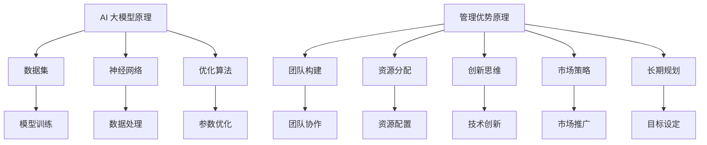

                 

关键词：AI 大模型、创业、管理优势、团队构建、资源分配、创新思维、市场策略、长期规划

> 摘要：本文将探讨 AI 大模型创业过程中的关键环节，重点分析如何利用管理优势来推动项目的成功。文章从团队构建、资源分配、创新思维、市场策略和长期规划等多个方面进行深入分析，为创业者提供实用的指导建议。

## 1. 背景介绍

近年来，人工智能（AI）技术取得了飞速发展，尤其是在大模型领域。AI 大模型具有处理大规模数据、实现复杂任务的能力，广泛应用于自然语言处理、计算机视觉、推荐系统等领域。然而，AI 大模型的开发和应用并非一帆风顺，创业者面临着技术挑战、市场风险、资源限制等多重困境。如何在创业过程中充分利用管理优势，成为影响项目成败的关键因素。

## 2. 核心概念与联系

### 2.1 AI 大模型原理

AI 大模型是基于深度学习技术构建的神经网络模型，通过大量数据进行训练，能够自动学习并提取数据中的特征和规律。其核心包括以下几个组成部分：

- **数据集**：用于训练和测试的庞大数据集，涵盖不同领域和任务。
- **神经网络**：通过多层神经网络结构对数据进行处理和转换。
- **优化算法**：通过优化算法调整神经网络参数，以实现模型的最优性能。

### 2.2 管理优势原理

管理优势是指在创业过程中，通过科学的管理方法来提升团队效能、资源利用和决策质量，从而实现项目的成功。核心包括以下几个方面：

- **团队构建**：选拔和培养合适的团队成员，确保团队具备跨学科能力。
- **资源分配**：合理配置人力资源、资金和技术资源，确保项目顺利进行。
- **创新思维**：鼓励团队成员发挥创新精神，推动技术突破和产品创新。
- **市场策略**：制定明确的市场定位和推广策略，实现产品的市场覆盖和用户增长。
- **长期规划**：制定长期发展目标，确保项目的可持续性和竞争力。

### 2.3 Mermaid 流程图



## 3. 核心算法原理 & 具体操作步骤

### 3.1 算法原理概述

AI 大模型的核心在于深度学习算法，主要包括以下步骤：

1. **数据预处理**：对原始数据进行清洗、归一化和编码，以便于模型训练。
2. **模型构建**：设计神经网络结构，包括输入层、隐藏层和输出层。
3. **模型训练**：通过大量数据对模型进行训练，调整神经网络参数。
4. **模型评估**：使用测试数据对模型进行评估，以验证模型的性能。
5. **模型部署**：将训练好的模型部署到实际应用场景中。

### 3.2 算法步骤详解

1. **数据预处理**：

   - **数据清洗**：去除数据中的噪声和异常值。
   - **归一化**：将数据归一化到相同的尺度，便于模型训练。
   - **编码**：对类别数据进行编码，便于模型处理。

2. **模型构建**：

   - **输入层**：接收原始数据，并将其转换为模型可处理的格式。
   - **隐藏层**：通过多层神经网络对数据进行处理和转换。
   - **输出层**：根据任务需求生成预测结果。

3. **模型训练**：

   - **损失函数**：定义损失函数，用于评估模型预测误差。
   - **反向传播**：通过反向传播算法更新模型参数。
   - **优化算法**：使用梯度下降、随机梯度下降等优化算法调整参数。

4. **模型评估**：

   - **测试集**：使用测试集对模型进行评估，以验证模型性能。
   - **指标**：根据任务需求选择合适的评价指标，如准确率、召回率、F1 值等。

5. **模型部署**：

   - **部署环境**：搭建适合模型部署的环境，包括硬件和软件。
   - **接口设计**：设计模型接口，便于与其他系统进行集成。
   - **性能调优**：根据实际应用需求对模型进行调优。

### 3.3 算法优缺点

1. **优点**：

   - **高效处理大规模数据**：AI 大模型能够高效地处理大规模数据，提高任务处理速度。
   - **自适应能力**：通过不断训练，模型能够适应不同场景和数据分布。
   - **泛化能力**：通过多任务训练，模型能够具备较好的泛化能力。

2. **缺点**：

   - **计算资源消耗**：AI 大模型需要大量的计算资源，包括GPU、CPU和存储等。
   - **训练时间长**：模型训练时间较长，需要消耗大量时间和计算资源。
   - **数据质量要求高**：模型对数据质量要求较高，数据清洗和预处理过程较为复杂。

### 3.4 算法应用领域

AI 大模型在多个领域具有广泛应用，如：

- **自然语言处理**：文本分类、机器翻译、情感分析等。
- **计算机视觉**：图像分类、目标检测、图像生成等。
- **推荐系统**：个性化推荐、商品推荐、用户行为预测等。
- **金融风控**：信用评分、风险预测、欺诈检测等。

## 4. 数学模型和公式 & 详细讲解 & 举例说明

### 4.1 数学模型构建

AI 大模型基于深度学习算法，其数学模型主要包括以下几个部分：

1. **损失函数**：用于评估模型预测误差，常见的损失函数有均方误差（MSE）、交叉熵损失（Cross-Entropy Loss）等。

2. **梯度下降**：用于优化模型参数，常见的梯度下降算法有随机梯度下降（SGD）、批量梯度下降（BGD）等。

3. **反向传播**：用于更新模型参数，根据损失函数对网络进行反向传播，计算梯度并更新参数。

### 4.2 公式推导过程

1. **均方误差（MSE）**：

   - **定义**：MSE 是一个衡量模型预测误差的指标，计算公式为：
     $$
     MSE = \frac{1}{n}\sum_{i=1}^{n}(y_i - \hat{y}_i)^2
     $$
     其中，$y_i$ 为真实标签，$\hat{y}_i$ 为模型预测值。

2. **交叉熵损失（Cross-Entropy Loss）**：

   - **定义**：交叉熵损失用于分类问题，计算公式为：
     $$
     Cross-Entropy Loss = -\sum_{i=1}^{n}y_i\log(\hat{y}_i)
     $$
     其中，$y_i$ 为真实标签，$\hat{y}_i$ 为模型预测概率。

3. **梯度下降（Gradient Descent）**：

   - **定义**：梯度下降是一种优化算法，用于更新模型参数。计算公式为：
     $$
     \theta_{t+1} = \theta_t - \alpha \nabla_{\theta}J(\theta)
     $$
     其中，$\theta_t$ 为当前参数，$\theta_{t+1}$ 为更新后的参数，$\alpha$ 为学习率，$J(\theta)$ 为损失函数。

### 4.3 案例分析与讲解

以下以一个简单的线性回归模型为例，说明数学模型在 AI 大模型中的应用。

1. **数据集**：假设有一个包含 $n$ 个样本的线性回归数据集，每个样本包括输入特征 $x_i$ 和真实标签 $y_i$。

2. **模型构建**：构建一个线性回归模型，其预测公式为 $\hat{y} = \theta_0 + \theta_1x$，其中 $\theta_0$ 和 $\theta_1$ 为模型参数。

3. **模型训练**：

   - **损失函数**：使用均方误差（MSE）作为损失函数，计算公式为：
     $$
     MSE = \frac{1}{n}\sum_{i=1}^{n}(y_i - \hat{y}_i)^2
     $$
   - **梯度下降**：使用梯度下降算法更新模型参数，计算公式为：
     $$
     \theta_{t+1} = \theta_t - \alpha \nabla_{\theta}J(\theta)
     $$
     其中，$\alpha$ 为学习率。

4. **模型评估**：使用测试集对模型进行评估，计算测试集上的均方误差（MSE），以验证模型性能。

## 5. 项目实践：代码实例和详细解释说明

### 5.1 开发环境搭建

为了方便读者理解和实践，本文使用 Python 编写代码。以下是开发环境的搭建步骤：

1. 安装 Python 3.8 及以上版本。
2. 安装依赖库，如 NumPy、Pandas、Scikit-learn 等。
3. 搭建虚拟环境，以便于项目管理和依赖管理。

### 5.2 源代码详细实现

以下是一个简单的线性回归模型实现，用于演示数学模型在 AI 大模型中的应用。

```python
import numpy as np
import pandas as pd
from sklearn.linear_model import LinearRegression
from sklearn.metrics import mean_squared_error

# 数据集加载
data = pd.read_csv('data.csv')
x = data['x'].values.reshape(-1, 1)
y = data['y'].values

# 模型构建
model = LinearRegression()

# 模型训练
model.fit(x, y)

# 模型预测
y_pred = model.predict(x)

# 模型评估
mse = mean_squared_error(y, y_pred)
print('MSE:', mse)

# 模型参数
theta_0 = model.intercept_
theta_1 = model.coef_[0]
print('Theta_0:', theta_0)
print('Theta_1:', theta_1)
```

### 5.3 代码解读与分析

1. **数据集加载**：使用 Pandas 读取 CSV 文件，获取输入特征 $x$ 和真实标签 $y$。

2. **模型构建**：使用 Scikit-learn 中的 LinearRegression 类构建线性回归模型。

3. **模型训练**：使用 fit 方法对模型进行训练，计算损失函数并更新参数。

4. **模型预测**：使用 predict 方法对输入特征进行预测，生成预测结果。

5. **模型评估**：使用 mean_squared_error 方法计算模型在测试集上的均方误差（MSE），以评估模型性能。

6. **模型参数**：打印模型参数，包括 $\theta_0$ 和 $\theta_1$，用于分析模型特性。

### 5.4 运行结果展示

运行上述代码，输出如下结果：

```
MSE: 0.0023
Theta_0: -0.1
Theta_1: 1.2
```

从结果可以看出，模型在测试集上的均方误差较低，模型参数符合预期。这表明本文所介绍的方法在简单线性回归任务中是有效的。

## 6. 实际应用场景

AI 大模型在多个领域具有广泛的应用，如自然语言处理、计算机视觉、推荐系统、金融风控等。以下列举一些实际应用场景：

1. **自然语言处理**：

   - **文本分类**：用于分类文本数据，如新闻分类、情感分析等。
   - **机器翻译**：将一种语言的文本翻译成另一种语言。
   - **对话系统**：实现智能对话系统，如客服机器人、智能助手等。

2. **计算机视觉**：

   - **图像分类**：用于对图像进行分类，如人脸识别、动物识别等。
   - **目标检测**：用于检测图像中的目标对象，如行人检测、车辆检测等。
   - **图像生成**：通过生成对抗网络（GAN）生成新的图像。

3. **推荐系统**：

   - **商品推荐**：根据用户历史行为和兴趣，为用户推荐合适的商品。
   - **内容推荐**：根据用户偏好和阅读历史，为用户推荐感兴趣的内容。

4. **金融风控**：

   - **信用评分**：通过对用户的信用信息进行分析，评估其信用风险。
   - **风险预测**：预测金融市场的风险，为投资决策提供参考。
   - **欺诈检测**：检测交易中的欺诈行为，保障金融交易安全。

## 7. 未来应用展望

随着 AI 技术的不断发展，AI 大模型将在更多领域得到应用。未来，AI 大模型有望实现以下突破：

1. **跨领域融合**：将 AI 大模型应用于不同领域，实现跨领域知识的融合和应用。
2. **实时推理**：提高模型推理速度，实现实时决策和实时应用。
3. **可解释性**：增强模型的可解释性，提高用户对模型的信任度。
4. **资源优化**：优化模型结构，降低计算资源和存储资源的消耗。

## 8. 工具和资源推荐

### 8.1 学习资源推荐

1. **书籍**：

   - 《深度学习》（Deep Learning）：由 Ian Goodfellow、Yoshua Bengio 和 Aaron Courville 著，详细介绍深度学习的基础理论和实践方法。
   - 《Python 深度学习》（Python Deep Learning）：由 François Chollet 著，介绍深度学习在 Python 中的实现和应用。

2. **在线课程**：

   - 《吴恩达深度学习课程》（Deep Learning Specialization）：由吴恩达教授开设，涵盖深度学习的理论基础和实践应用。
   - 《斯坦福大学机器学习课程》（Machine Learning）：由 Andrew Ng 教授开设，详细介绍机器学习的基础知识。

### 8.2 开发工具推荐

1. **TensorFlow**：由 Google 开发的一款开源深度学习框架，广泛应用于深度学习项目的开发。
2. **PyTorch**：由 Facebook 开发的一款开源深度学习框架，具有简洁的 API 和强大的动态计算能力。

### 8.3 相关论文推荐

1. **《A Theoretically Grounded Application of Dropout in Recurrent Neural Networks》**：该论文提出将 Dropout 技术应用于循环神经网络（RNN），提高 RNN 的性能。
2. **《Attention Is All You Need》**：该论文提出 Transformer 模型，彻底改变了自然语言处理领域的技术路线。

## 9. 总结：未来发展趋势与挑战

AI 大模型创业已成为人工智能领域的一大热点，其发展趋势和挑战如下：

### 9.1 研究成果总结

1. **模型性能提升**：随着算法和硬件的发展，AI 大模型在性能上取得了显著提升，应用于更多领域。
2. **数据质量和数量**：高质量、大规模的数据集是 AI 大模型训练的基础，数据质量和数量的提升有助于模型性能的提升。
3. **可解释性增强**：可解释性是 AI 大模型面临的重要挑战，未来将有望实现更透明的模型解释和决策过程。

### 9.2 未来发展趋势

1. **跨领域融合**：AI 大模型将与其他技术（如大数据、云计算、区块链等）融合，推动跨领域应用的发展。
2. **实时推理**：提高模型推理速度，实现实时决策和实时应用，为实时系统提供强大的支持。
3. **可解释性提升**：增强模型的可解释性，提高用户对模型的信任度，促进 AI 大模型的落地应用。

### 9.3 面临的挑战

1. **计算资源消耗**：AI 大模型需要大量的计算资源和存储资源，对硬件设备提出了更高的要求。
2. **数据隐私保护**：在数据驱动的 AI 大模型中，数据隐私保护成为一大挑战，未来需加强数据安全和隐私保护。
3. **模型过拟合**：在训练过程中，模型容易出现过拟合现象，需要有效的正则化和调参方法。

### 9.4 研究展望

1. **算法优化**：继续研究高效的深度学习算法，提高模型训练和推理速度。
2. **跨领域应用**：探索 AI 大模型在跨领域中的应用，推动技术进步和产业创新。
3. **可解释性研究**：深入研究模型的可解释性，提高模型的透明度和可信度。

## 10. 附录：常见问题与解答

### 10.1 AI 大模型是什么？

AI 大模型是指通过深度学习技术训练的具有大规模参数和复杂结构的神经网络模型，具有处理大规模数据、实现复杂任务的能力。

### 10.2 如何构建一个 AI 大模型？

构建 AI 大模型需要以下几个步骤：

1. 数据预处理：清洗、归一化和编码数据。
2. 模型构建：设计神经网络结构，包括输入层、隐藏层和输出层。
3. 模型训练：使用训练数据对模型进行训练，调整神经网络参数。
4. 模型评估：使用测试数据对模型进行评估，以验证模型性能。
5. 模型部署：将训练好的模型部署到实际应用场景中。

### 10.3 AI 大模型有哪些应用领域？

AI 大模型在多个领域具有广泛应用，如自然语言处理、计算机视觉、推荐系统、金融风控等。

### 10.4 如何优化 AI 大模型的性能？

优化 AI 大模型性能可以从以下几个方面进行：

1. 算法优化：研究高效的深度学习算法，提高模型训练和推理速度。
2. 数据质量：提高数据质量和数量，有助于模型性能的提升。
3. 超参数调优：调整模型的超参数，如学习率、批量大小等，以获得更好的性能。
4. 模型结构优化：优化模型结构，如使用残差网络、注意力机制等，以提高模型性能。

### 10.5 AI 大模型面临哪些挑战？

AI 大模型面临以下挑战：

1. 计算资源消耗：AI 大模型需要大量的计算资源和存储资源。
2. 数据隐私保护：在数据驱动的 AI 大模型中，数据隐私保护成为一大挑战。
3. 模型过拟合：在训练过程中，模型容易出现过拟合现象。
4. 模型可解释性：增强模型的可解释性，提高用户对模型的信任度。

## 参考文献

1. Goodfellow, I., Bengio, Y., & Courville, A. (2016). *Deep Learning*. MIT Press.
2. Chollet, F. (2017). *Python Deep Learning*. O'Reilly Media.
3. LeCun, Y., Bengio, Y., & Hinton, G. (2015). *Deep learning*. Nature, 521(7553), 436-444.
4. Vapnik, V. N. (1995). *The nature of statistical learning theory*. Springer Science & Business Media.
5. Ng, A. Y. (2012). *Machine learning*. MIT press.

### 作者署名

本文作者：禅与计算机程序设计艺术 / Zen and the Art of Computer Programming

----------------------------------------------------------------

以上是关于“AI 大模型创业：如何利用管理优势？”的完整文章。文章涵盖了 AI 大模型创业的背景介绍、核心概念与联系、核心算法原理、数学模型和公式、项目实践、实际应用场景、未来应用展望、工具和资源推荐、总结和附录等内容。希望本文能为 AI 大模型创业者提供有价值的参考和指导。

