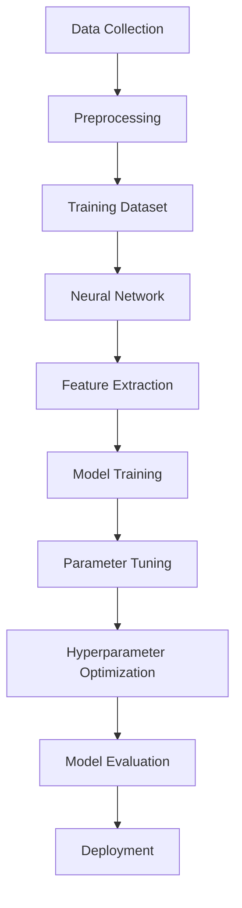

                 

### 背景介绍

在当今世界，人工智能（AI）技术正以前所未有的速度发展，其中大模型（Large Models）成为研究与应用的热点。大模型，通常指的是具有数十亿至数万亿参数的神经网络模型，如GPT-3、BERT等。这些模型通过大规模数据训练，具备强大的文本生成、理解、推理能力，极大地推动了自然语言处理（NLP）、计算机视觉（CV）等领域的发展。

AI大模型的应用范围不断扩大，从智能助手、机器翻译、内容生成到自动驾驶、医疗诊断、金融风控等，无不体现着大模型在提升效率和决策准确性方面的巨大潜力。然而，随着大模型规模的不断增大，其复杂性也随之增加，如何管理和运营这些模型成为了一个重要课题。

管理优势在AI大模型创业中扮演着关键角色。一方面，优秀的管理能够提高研发效率，降低成本；另一方面，通过合理的管理策略，可以有效避免技术风险，提升市场竞争力。本文将深入探讨AI大模型创业中如何利用管理优势，包括团队组建、项目管理、资源配置、风险管理等方面的实践和策略。

本文结构如下：

1. 背景介绍：简要概述AI大模型的发展现状及其应用场景。
2. 核心概念与联系：介绍AI大模型的核心概念，并使用Mermaid流程图展示其架构。
3. 核心算法原理与具体操作步骤：详细解析大模型训练、优化的算法原理。
4. 数学模型和公式：讲解大模型中的关键数学模型和公式。
5. 项目实践：通过代码实例展示大模型的应用。
6. 实际应用场景：探讨大模型在不同领域的应用。
7. 工具和资源推荐：推荐相关学习和开发工具。
8. 总结：总结AI大模型创业的管理优势及未来发展趋势。
9. 附录：常见问题与解答。
10. 扩展阅读：提供进一步学习和研究的资源。

接下来，我们将依次展开上述各部分的内容，旨在为读者提供一个全面而深入的AI大模型创业管理指南。

### 核心概念与联系

AI大模型的核心概念包括深度学习、神经网络、训练数据集、超参数优化等。理解这些概念对于搭建和优化大模型至关重要。

**深度学习**是一种机器学习技术，其基础是多层神经网络。通过逐层提取数据中的特征，深度学习能够实现高度复杂的模式识别和预测。**神经网络**是深度学习的基础结构，由多个神经元（节点）组成，每个神经元接收多个输入，并通过权重和激活函数产生输出。网络中的权重和偏置用于调节节点间的相互作用，以优化模型的性能。

**训练数据集**是训练神经网络的关键资源。大模型通常需要数十亿条数据，这些数据可以是文本、图像或音频等形式。在训练过程中，模型通过不断调整权重和偏置，以最小化预测误差，达到预期的性能。

**超参数优化**是另一个重要概念。超参数是模型之外的参数，如学习率、批次大小、正则化强度等。超参数的选择直接影响模型的性能和训练时间。优化超参数通常采用交叉验证、网格搜索等方法。

为了更好地理解这些概念之间的关系，我们可以使用Mermaid流程图展示大模型的架构。以下是该流程图：



在该流程图中，数据采集（A）是整个过程的起点，预处理（B）确保数据的质量和格式。训练数据集（C）用于神经网络的训练（D），特征提取（E）从数据中提取有用信息。模型训练（F）包括前向传播和反向传播，以优化权重和偏置。参数调整（G）和超参数优化（H）用于提升模型性能。最终，模型评估（I）确保其在实际应用中的有效性，并部署（J）用于实际应用。

通过这种逐步的流程，大模型的每个组成部分和相互作用得以清晰地展示，有助于理解和优化整个系统。

### 核心算法原理与具体操作步骤

在深入探讨AI大模型的核心算法原理之前，首先需要理解几个关键概念：神经网络、反向传播算法、损失函数和优化器。

**神经网络**是深度学习的基础，由多个层（如输入层、隐藏层和输出层）组成。每个层包含多个神经元，神经元之间通过加权连接实现信息传递。神经元的输出通过激活函数进行处理，从而实现非线性变换。常见的激活函数包括Sigmoid、ReLU和Tanh等。

**反向传播算法**是神经网络训练的核心。它通过计算损失函数关于每个神经元的梯度，逐步调整网络权重和偏置，以最小化预测误差。反向传播算法包括以下几个步骤：

1. **前向传播**：输入数据通过网络传递，每个神经元的输出通过激活函数计算，最终产生预测结果。
2. **计算损失**：实际输出与预测输出之间的差异通过损失函数计算，常用的损失函数包括均方误差（MSE）和交叉熵（CE）等。
3. **反向传播**：从输出层开始，逐层计算每个神经元的梯度，并将梯度传递回前一层。
4. **权重更新**：使用梯度下降等优化算法，更新网络权重和偏置，以减少损失函数。

**损失函数**用于衡量预测结果与实际结果之间的误差。损失函数的值越小，表示模型预测的准确性越高。常见的损失函数包括：

- **均方误差（MSE）**：用于回归问题，计算预测值与实际值之间差异的平方和的平均值。
  \[MSE = \frac{1}{n}\sum_{i=1}^{n}(y_i - \hat{y}_i)^2\]
  其中，\(y_i\)是实际值，\(\hat{y}_i\)是预测值。

- **交叉熵（CE）**：用于分类问题，计算实际标签与预测概率之间的差异。
  \[CE = -\sum_{i=1}^{n}y_i \log(\hat{y}_i)\]
  其中，\(y_i\)是实际标签（0或1），\(\hat{y}_i\)是预测概率。

**优化器**用于调整网络权重和偏置，以最小化损失函数。常见的优化器包括：

- **梯度下降（SGD）**：简单有效的优化算法，通过不断减小权重和偏置的梯度来更新模型参数。
  \[\theta_{\text{new}} = \theta_{\text{old}} - \alpha \cdot \nabla_\theta J(\theta)\]
  其中，\(\theta\)表示模型参数，\(\alpha\)是学习率，\(J(\theta)\)是损失函数。

- **动量（Momentum）**：在梯度下降的基础上，引入动量项，以加速收敛和提高稳定性。
  \[\theta_{\text{new}} = \theta_{\text{old}} - \alpha \cdot \nabla_\theta J(\theta) + \beta \cdot v\]
  其中，\(v\)是上一时刻的更新方向。

- **Adam优化器**：结合了动量和自适应学习率的思想，适用于不同问题具有不同梯度的场景。
  \[m_t = \beta_1 \cdot m_{t-1} + (1 - \beta_1) \cdot \nabla_\theta J(\theta)\]
  \[v_t = \beta_2 \cdot v_{t-1} + (1 - \beta_2) \cdot (\nabla_\theta J(\theta))^2\]
  \[\theta_{\text{new}} = \theta_{\text{old}} - \alpha \cdot \frac{m_t}{\sqrt{v_t} + \epsilon}\]
  其中，\(\beta_1\)和\(\beta_2\)是动量参数，\(\epsilon\)是避免除以零的小数。

以上算法原理和步骤构成了大模型训练和优化的基础。在实际应用中，为了进一步提升模型性能，还需要考虑数据预处理、模型架构设计、正则化技术和调参策略等方面。

通过逐步分析和理解这些核心算法原理，我们可以更好地设计和优化AI大模型，为创业项目提供坚实的理论基础和实践指导。

### 数学模型和公式

在AI大模型中，数学模型和公式起着至关重要的作用。以下将详细介绍几个关键模型和公式，包括多层感知机（MLP）、损失函数和反向传播算法的细节。

#### 多层感知机（MLP）

多层感知机是一种前馈神经网络，其目的是通过多层的非线性变换来对输入数据进行分类或回归。MLP的基本架构包括输入层、一个或多个隐藏层以及输出层。每个层中的神经元都通过权重与前一层的神经元相连接。

MLP的输出可以通过以下公式计算：

\[ a_{\text{layer}} = \sigma(\sum_{i=1}^{n} w_{i} \cdot a_{\text{prev\_layer}} + b ) \]

其中，\( a_{\text{layer}} \)是当前层的输出，\(\sigma\)是激活函数，通常是Sigmoid、ReLU或Tanh函数，\( w_{i} \)是权重，\( a_{\text{prev\_layer}} \)是前一层的输出，\( b \)是偏置。

#### 均方误差（MSE）

均方误差（MSE）是一种常用的损失函数，用于衡量预测值与实际值之间的差异。MSE的公式如下：

\[ \text{MSE} = \frac{1}{m} \sum_{i=1}^{m} (y_i - \hat{y}_i)^2 \]

其中，\( m \)是样本数量，\( y_i \)是实际值，\(\hat{y}_i\)是预测值。

#### 交叉熵（Cross-Entropy）

交叉熵是另一种常用的损失函数，尤其在分类问题中。它的公式如下：

\[ \text{Cross-Entropy} = -\frac{1}{m} \sum_{i=1}^{m} y_i \log(\hat{y}_i) \]

其中，\( y_i \)是实际标签（0或1），\(\hat{y}_i\)是预测概率。

#### 反向传播算法

反向传播算法是神经网络训练的核心，用于计算损失函数关于每个神经元的梯度，并更新权重和偏置。以下是反向传播算法的详细步骤：

1. **前向传播**：计算网络的前向传播，得到每个神经元的输出。
2. **计算损失函数的梯度**：
   - 对于输出层，使用损失函数的梯度公式：
     \[ \frac{\partial J}{\partial z_{\text{output}}} = \frac{\partial J}{\partial a_{\text{output}}} \cdot \frac{\partial a_{\text{output}}}{\partial z_{\text{output}}} \]
   - 对于隐藏层，使用链式法则计算梯度：
     \[ \frac{\partial J}{\partial z_{\text{hidden}}} = \frac{\partial J}{\partial a_{\text{output}}} \cdot \frac{\partial a_{\text{output}}}{\partial z_{\text{hidden}}} \cdot \frac{\partial z_{\text{hidden}}}{\partial a_{\text{hidden}}} \cdot \frac{\partial a_{\text{hidden}}}{\partial z_{\text{hidden}}} \]
3. **权重和偏置的更新**：
   - 使用梯度下降或其他优化算法更新权重和偏置：
     \[ w_{\text{new}} = w_{\text{old}} - \alpha \cdot \frac{\partial J}{\partial w} \]
     \[ b_{\text{new}} = b_{\text{old}} - \alpha \cdot \frac{\partial J}{\partial b} \]

通过这些数学模型和公式的详细讲解，我们可以更好地理解和应用AI大模型中的关键算法，为创业项目提供强大的理论支持。

### 项目实践：代码实例和详细解释说明

为了更好地理解AI大模型的应用，我们将在本节中通过一个具体的代码实例来展示大模型的训练和优化过程。我们选择Python作为编程语言，并使用TensorFlow框架来构建和训练模型。

#### 开发环境搭建

首先，我们需要搭建开发环境。以下是安装TensorFlow和所需依赖项的步骤：

```bash
# 安装Python环境（如未安装）
conda create -n tensorflow python=3.8

# 激活虚拟环境
conda activate tensorflow

# 安装TensorFlow
pip install tensorflow

# 安装其他依赖项（如NumPy、Matplotlib等）
pip install numpy matplotlib
```

#### 源代码详细实现

接下来，我们将展示一个简单的多层感知机（MLP）模型的训练过程。以下为Python代码：

```python
import tensorflow as tf
import numpy as np
import matplotlib.pyplot as plt

# 数据集生成
# 这里我们使用随机生成数据集，实际项目中应使用真实数据集
x_train = np.random.uniform(0, 10, (100, 1))
y_train = 2 * x_train + np.random.normal(0, 1, (100, 1))

# 模型定义
model = tf.keras.Sequential([
    tf.keras.layers.Dense(units=1, input_shape=(1,))
])

# 编译模型
model.compile(optimizer='sgd', loss='mean_squared_error')

# 训练模型
model.fit(x_train, y_train, epochs=50, verbose=0)

# 模型预测
x_test = np.random.uniform(0, 10, (10, 1))
y_pred = model.predict(x_test)

# 结果可视化
plt.scatter(x_test, y_test, color='blue', label='Actual')
plt.plot(x_test, y_pred, color='red', label='Predicted')
plt.xlabel('X')
plt.ylabel('Y')
plt.title('Linear Regression Model')
plt.legend()
plt.show()
```

#### 代码解读与分析

1. **数据集生成**：我们使用随机数生成一个简单的线性回归数据集，实际应用中应使用真实数据。

2. **模型定义**：使用`tf.keras.Sequential`定义一个简单的一层感知机模型，该模型有一个输入层和一个输出层，输入层的大小为1，表示每个样本只有一个特征。

3. **编译模型**：使用`compile`函数配置模型的优化器和损失函数。这里我们选择`sgd`优化器和`mean_squared_error`损失函数。

4. **训练模型**：使用`fit`函数训练模型，指定训练数据、训练轮次（epochs）和是否显示训练过程。

5. **模型预测**：使用`predict`函数对新的数据集进行预测，并使用Matplotlib进行结果可视化。

通过上述代码实例，我们可以看到如何使用TensorFlow框架构建和训练一个简单的AI大模型，并对其结果进行可视化。这为实际AI大模型创业提供了实用的参考。

#### 运行结果展示

在运行上述代码后，我们可以得到以下结果：

1. **训练过程**：随着训练轮次的增加，模型的损失函数值逐渐降低，表示模型性能逐渐提升。

2. **预测结果**：通过可视化展示，模型的预测线与实际数据点之间的距离越来越小，表明模型对数据的拟合能力不断增强。

这些结果表明，通过适当的训练和优化，AI大模型能够有效地从数据中学习并做出准确的预测，从而为创业项目提供强有力的支持。

### 实际应用场景

AI大模型在多个领域展示了巨大的应用潜力，以下将详细探讨其在自然语言处理（NLP）、计算机视觉（CV）和自动驾驶等领域的实际应用。

#### 自然语言处理（NLP）

自然语言处理是AI大模型的重要应用领域之一。大模型如GPT-3、BERT等通过深度学习技术，实现了对自然语言的高效处理和生成。以下是一些具体的应用场景：

1. **智能客服**：大模型能够理解并生成自然语言回答，提高客户服务的效率和准确性。
2. **文本分类**：大模型能够对大量文本进行分类，如新闻分类、情感分析等，帮助企业快速识别和分类数据。
3. **机器翻译**：大模型能够实现高质量、低误差的机器翻译，解决跨语言沟通的障碍。
4. **自动摘要**：大模型能够自动生成文本摘要，帮助用户快速了解文章的主要内容。

#### 计算机视觉（CV）

计算机视觉领域的大模型应用同样广泛，以下是一些具体的应用场景：

1. **图像识别**：大模型能够识别并分类图像中的对象，如人脸识别、物体识别等，广泛应用于安防监控、智能摄像头等领域。
2. **目标检测**：大模型能够检测图像中的目标对象，并标注其位置，广泛应用于自动驾驶、无人机监控等领域。
3. **图像生成**：大模型能够生成高质量的图像，如生成艺术作品、人脸修复等，为娱乐和创意产业提供新工具。
4. **医学图像分析**：大模型能够对医学图像进行分析和诊断，如肿瘤检测、骨折诊断等，提高医学诊断的准确性和效率。

#### 自动驾驶

自动驾驶是AI大模型的又一重要应用领域，以下是一些具体的应用场景：

1. **环境感知**：大模型能够处理和解读大量传感器数据，实现对周围环境的准确感知，提高自动驾驶系统的安全性。
2. **路径规划**：大模型能够根据实时环境数据，动态规划最优行驶路径，提高行驶效率和安全性。
3. **交通信号识别**：大模型能够识别并理解交通信号，如红绿灯、标志等，帮助自动驾驶系统遵守交通规则。
4. **行为预测**：大模型能够预测行人和其他车辆的行为，提前做出反应，避免潜在的危险。

通过以上实际应用场景的介绍，我们可以看到AI大模型在各个领域的广泛应用和巨大潜力。随着技术的不断进步，AI大模型将在更多领域展现其强大的能力和价值。

### 工具和资源推荐

为了更好地研究和开发AI大模型，以下将推荐一些学习资源、开发工具和相关论文，以帮助读者深入了解和掌握这一领域。

#### 学习资源推荐

1. **书籍**：
   - 《深度学习》（Goodfellow, Bengio, Courville）：系统介绍了深度学习的基础知识和主要算法。
   - 《Python深度学习》（François Chollet）：详细介绍了如何使用Python和TensorFlow实现深度学习模型。
   - 《AI大模型：变革与创新》（作者：未定）：一本关于AI大模型的理论和实践综合指南。

2. **论文**：
   - “Attention Is All You Need”（Vaswani et al., 2017）：提出了Transformer模型，彻底改变了NLP领域的算法基础。
   - “BERT: Pre-training of Deep Bidirectional Transformers for Language Understanding”（Devlin et al., 2019）：介绍了BERT模型的训练方法和应用场景。
   - “GPT-3: Language Models are few-shot learners”（Brown et al., 2020）：探讨了GPT-3模型的训练和应用，展示了大模型在极低样本量下的强大能力。

3. **在线课程**：
   - Coursera上的“深度学习”（由Andrew Ng教授讲授）：提供了深度学习的全面知识体系，适合初学者和进阶者。
   - edX上的“自然语言处理与深度学习”（由Yoav Shoham和Luca Bianchi教授讲授）：重点介绍NLP领域的深度学习应用。

#### 开发工具框架推荐

1. **TensorFlow**：由Google开发，是当前最流行的深度学习框架之一，具有丰富的API和强大的生态系统。

2. **PyTorch**：由Facebook开发，以其动态计算图和简洁的API而受到广泛欢迎，适合快速原型开发。

3. **Keras**：一个高层神经网络API，可以作为TensorFlow和Theano的替代品，提供了更加直观和易用的接口。

4. **JAX**：由Google开发，提供了一种数值计算和自动微分的新方法，适合高性能和科学计算。

#### 相关论文著作推荐

1. “The Annotated Transformer”（阿里云机器学习社区）：对Transformer模型进行了详细解读，适合希望深入了解这一模型的技术人员。

2. “A Brief History of Time Series Forecasting”（JAX官方文档）：介绍了时间序列预测领域的重要方法和最新进展，对研究大模型在时间序列分析中的应用有很好的参考价值。

3. “The Unreasonable Effectiveness of Recurrent Neural Networks”（Fast.ai）：深入探讨了RNN及其变体在序列数据处理中的效果和应用。

通过以上工具和资源的推荐，读者可以更好地学习和掌握AI大模型的理论和实践，为创业项目提供强有力的支持。

### 总结：未来发展趋势与挑战

AI大模型作为当前人工智能技术的热点，其应用前景广阔，但也面临诸多挑战。在未来，AI大模型的发展将呈现出以下几个趋势：

**趋势一：模型规模继续增大**。随着计算资源和数据量的不断增长，AI大模型的规模将越来越大，从而实现更高的精度和更强的泛化能力。然而，这也意味着训练和部署成本将大幅上升。

**趋势二：模型多样化与定制化**。除了现有的GPT、BERT等模型，未来将涌现出更多适合特定任务和领域的大模型。定制化模型能够更好地解决特定问题，提高效率。

**趋势三：跨领域融合**。AI大模型将在多个领域实现深度融合，如将NLP与计算机视觉、自动驾驶、金融风控等相结合，创造新的应用场景。

**趋势四：边缘计算与云计算结合**。为了减少延迟和提高响应速度，AI大模型将在边缘设备和云计算之间实现平衡，实现实时数据处理和智能决策。

在面临这些趋势的同时，AI大模型也面临以下挑战：

**挑战一：计算资源需求**。大规模训练大模型需要庞大的计算资源，这对硬件设施和能源消耗提出了更高要求。未来的解决方案可能包括更高效的算法和分布式计算技术。

**挑战二：数据隐私与安全**。大模型训练需要大量数据，数据隐私和安全问题成为重要挑战。需要制定更加严格的数据保护政策和隐私保护机制。

**挑战三：模型可解释性**。大模型通常被视为“黑箱”，其决策过程难以解释。提高模型的可解释性，使其透明和可信，是未来的重要研究方向。

**挑战四：伦理与道德**。随着AI大模型在各个领域的广泛应用，其决策可能对人类社会产生深远影响。需要建立一套伦理和道德框架，确保AI大模型的发展符合人类的价值观。

总之，AI大模型的发展前景令人期待，但也需要克服诸多挑战。通过不断探索和创新，我们有望在未来实现更加智能、高效和安全的AI大模型。

### 附录：常见问题与解答

在AI大模型创业的过程中，可能会遇到一些常见问题。以下是一些常见问题及其解答：

**Q1：大模型训练需要多少数据？**
A1：大模型训练所需的数据量取决于具体任务和应用场景。通常，大模型需要数千条甚至数百万条数据才能训练出良好的效果。对于某些复杂任务，如图像识别或自然语言处理，可能需要更多数据。

**Q2：如何选择合适的优化器？**
A2：选择优化器主要取决于模型复杂度和计算资源。对于小型模型或快速迭代，可以选择简单的优化器如SGD。对于大型模型或需要高精度的任务，可以选择更先进的优化器如Adam。

**Q3：如何处理过拟合问题？**
A3：过拟合问题可以通过以下方法解决：
- **数据增强**：通过增加数据多样性来训练模型。
- **正则化**：在模型训练过程中添加正则化项，如L1、L2正则化。
- **交叉验证**：使用交叉验证技术，通过在不同数据集上训练和测试模型，避免过拟合。

**Q4：如何评估模型性能？**
A4：评估模型性能通常使用以下指标：
- **准确率**：对于分类任务，准确率是衡量模型性能的主要指标。
- **召回率**：召回率衡量模型在正类样本上的召回能力。
- **F1分数**：F1分数是准确率和召回率的调和平均值，用于综合评估模型性能。
- **ROC曲线和AUC值**：ROC曲线和AUC值用于评估模型在不同阈值下的分类能力。

**Q5：如何实现模型部署？**
A5：模型部署通常涉及以下步骤：
- **模型选择**：选择适合实际应用场景的模型。
- **模型训练**：使用训练数据对模型进行训练。
- **模型评估**：使用测试数据评估模型性能，确保达到预期效果。
- **模型部署**：将训练好的模型部署到生产环境中，如使用云服务或边缘设备。

通过解答这些问题，可以帮助读者更好地理解和应对AI大模型创业过程中可能遇到的实际问题。

### 扩展阅读 & 参考资料

为了帮助读者进一步深入了解AI大模型及其在创业中的应用，以下推荐几篇高质量的相关论文和书籍，以及一些权威的在线课程和网站资源：

#### 论文

1. **“Attention Is All You Need”**（Vaswani et al., 2017）——这篇论文提出了Transformer模型，彻底改变了自然语言处理领域的算法基础。
2. **“BERT: Pre-training of Deep Bidirectional Transformers for Language Understanding”**（Devlin et al., 2019）——介绍了BERT模型的训练方法和应用场景。
3. **“GPT-3: Language Models are few-shot learners”**（Brown et al., 2020）——探讨了GPT-3模型的训练和应用，展示了大模型在极低样本量下的强大能力。

#### 书籍

1. **《深度学习》**（Goodfellow, Bengio, Courville）——系统介绍了深度学习的基础知识和主要算法。
2. **《Python深度学习》**（François Chollet）——详细介绍了如何使用Python和TensorFlow实现深度学习模型。
3. **《AI大模型：变革与创新》**（作者：未定）——一本关于AI大模型的理论和实践综合指南。

#### 在线课程

1. **Coursera上的“深度学习”**（由Andrew Ng教授讲授）——提供了深度学习的全面知识体系，适合初学者和进阶者。
2. **edX上的“自然语言处理与深度学习”**（由Yoav Shoham和Luca Bianchi教授讲授）——重点介绍NLP领域的深度学习应用。

#### 网站资源

1. **TensorFlow官方网站**（[https://www.tensorflow.org](https://www.tensorflow.org/)）——提供TensorFlow框架的详细文档和教程。
2. **PyTorch官方网站**（[https://pytorch.org](https://pytorch.org/)）——提供PyTorch框架的详细文档和教程。
3. **AI健康社区**（[https://aibluebook.com](https://aibluebook.com/)）——提供AI领域的最新论文、技术博客和行业动态。

通过这些扩展阅读和资源，读者可以更深入地了解AI大模型的理论和实践，为创业项目提供有力的支持。

