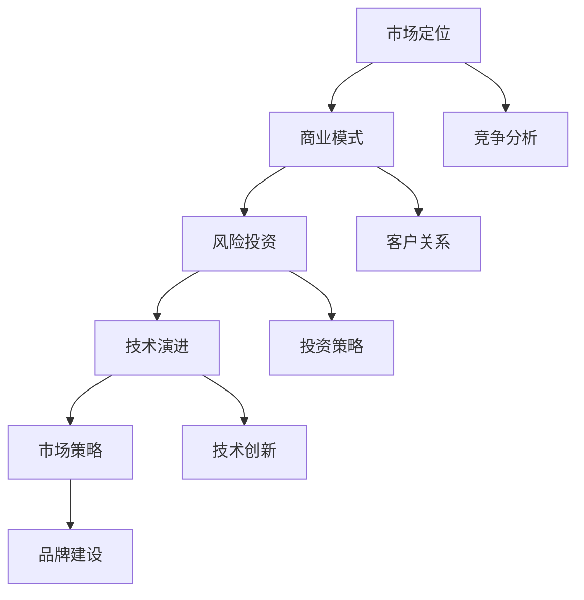

                 

### 文章标题

> 关键词：AI大模型、创业、经济优势、商业模式、风险投资、市场策略

> 摘要：本文将深入探讨AI大模型创业如何利用经济优势，从市场定位、商业模式、风险投资、技术演进和市场策略等多个方面进行分析，为创业者提供实用的指导和建议。

## 1. 背景介绍

近年来，随着人工智能技术的快速发展，AI大模型成为了人工智能领域的热点。从自然语言处理到计算机视觉，再到推荐系统，大模型在各个领域展现出了惊人的性能和潜力。然而，AI大模型的开发和部署需要大量的计算资源和资金投入，这对初创企业来说是一个巨大的挑战。因此，如何利用经济优势，合理规划创业路径，成为了AI大模型创业的关键问题。

在经济全球化和技术革新的背景下，创业者面临着前所未有的机遇和挑战。市场需求的快速变化、技术的不断迭代，使得创业者需要具备敏锐的市场洞察力和快速应变能力。与此同时，资本市场的波动和投资风险也让创业者需要更加谨慎地制定创业策略。

本文将从以下几个方面探讨AI大模型创业如何利用经济优势：

1. **市场定位**：如何找准市场需求，挖掘潜在商机。
2. **商业模式**：如何设计可持续的盈利模式，实现商业价值。
3. **风险投资**：如何吸引投资，合理利用资金。
4. **技术演进**：如何持续迭代技术，保持竞争优势。
5. **市场策略**：如何制定有效的市场推广策略，提高市场占有率。

通过以上几个方面的深入分析，本文旨在为AI大模型创业者提供一些实用的指导和建议，帮助他们更好地把握经济优势，实现创业成功。

## 2. 核心概念与联系

### 2.1 市场定位

市场定位是创业成功的关键一步。准确的市场定位可以帮助企业找到目标客户，制定合适的产品策略和营销策略。

**市场细分**：市场细分是将整个市场划分为若干个子市场，以便更有效地满足不同客户群体的需求。常见的市场细分方法包括地理细分、人口细分、行为细分和心理细分。

**目标客户**：确定目标客户是市场定位的核心。创业者需要根据产品特性和市场需求，明确产品的目标客户群体。

**竞争分析**：了解竞争对手的产品、市场策略和市场份额，有助于企业制定更有针对性的市场定位策略。

### 2.2 商业模式

商业模式是企业如何创造、传递和获取价值的基本逻辑。一个成功的商业模式需要明确以下要素：

**价值主张**：企业为客户提供的产品或服务所能带来的价值。

**客户关系**：企业与客户建立的关系类型，如直销、渠道合作、订阅服务等。

**渠道**：企业将产品或服务传递给客户的方式，如线上销售、线下门店、电商平台等。

**收入来源**：企业通过什么方式获得收入，如一次性销售、订阅费、广告费等。

**成本结构**：企业的运营成本和盈利模式，如固定成本、可变成本、边际成本等。

### 2.3 风险投资

风险投资是初创企业获取资金的重要途径。以下是一些核心概念：

**风险投资**：一种投资模式，投资者为具有高成长潜力的初创企业提供资金，并承担相应的风险。

**投资阶段**：根据企业的成长阶段，风险投资可以分为种子轮、天使轮、A轮、B轮等。

**投资策略**：风险投资企业如何选择投资目标，如何分配资金，以及如何管理投资组合。

**退出机制**：投资者如何通过股权转让、上市等方式实现投资回报。

### 2.4 技术演进

技术演进是AI大模型创业的重要驱动力。以下是一些核心概念：

**技术路线图**：企业如何规划技术的长期发展路径，包括短期目标和长期目标。

**技术创新**：企业如何通过技术创新来保持竞争优势。

**技术标准化**：企业如何参与技术标准的制定，以提升自身在行业中的影响力。

**技术协同**：企业如何与其他企业、研究机构合作，实现技术协同发展。

### 2.5 市场策略

市场策略是企业在市场竞争中取得优势的关键。以下是一些核心概念：

**品牌建设**：企业如何打造和提升品牌形象，增强品牌认知度。

**市场营销**：企业如何制定有效的营销策略，包括广告、促销、公关等。

**客户关系管理**：企业如何与客户建立长期稳定的合作关系，提升客户满意度。

**竞争策略**：企业如何制定有针对性的竞争策略，应对市场竞争。

### 2.6 Mermaid 流程图

以下是一个简化的AI大模型创业流程图，展示了从市场定位到市场策略的各个环节。



通过以上核心概念和联系的介绍，我们可以更好地理解AI大模型创业的复杂性。接下来，本文将深入探讨这些核心概念在实际创业中的应用，为创业者提供实用的指导和建议。

## 3. 核心算法原理 & 具体操作步骤

### 3.1 AI大模型的基本原理

AI大模型，即人工智能大型模型，是利用深度学习技术训练出来的大规模神经网络。这些模型在大量数据上进行训练，通过学习数据中的模式和规律，实现对复杂任务的自动完成。AI大模型的基本原理可以概括为以下几个步骤：

**数据收集**：首先，需要收集大量的数据。这些数据可以是结构化的，如数据库中的记录；也可以是非结构化的，如图像、文本、语音等。

**数据预处理**：收集到的数据需要进行清洗、格式化等预处理，以去除噪声和异常值，提高数据质量。

**模型设计**：根据任务需求，设计合适的神经网络结构。常见的神经网络结构包括卷积神经网络（CNN）、循环神经网络（RNN）和Transformer等。

**模型训练**：使用预处理后的数据对神经网络模型进行训练。训练过程中，模型会不断调整内部参数，以最小化预测误差。

**模型评估**：训练完成后，使用独立的测试集对模型进行评估，以确定模型的性能。

**模型部署**：将训练好的模型部署到实际应用中，如图像识别、自然语言处理等。

### 3.2 AI大模型创业中的具体操作步骤

**步骤1：市场调研**

在进行AI大模型创业之前，需要进行详细的市场调研，了解市场需求、竞争对手、技术趋势等。通过市场调研，可以确定创业的方向和目标市场。

**步骤2：技术储备**

AI大模型创业需要强大的技术储备。创业者需要具备深度学习、神经网络设计、数据预处理等技能。此外，还需要了解相关的开源框架和工具，如TensorFlow、PyTorch等。

**步骤3：商业模式设计**

设计一个可持续的商业模式是创业成功的关键。创业者需要根据市场需求，设计合适的产品策略和盈利模式。例如，可以提供定制化服务、SaaS模式、产品销售等。

**步骤4：组建团队**

组建一个高效的团队是创业成功的保障。团队成员应包括技术专家、产品经理、市场人员等，确保在技术、产品和市场方面都有强大的支持。

**步骤5：风险投资**

吸引风险投资是获取资金的重要途径。创业者需要准备详细的商业计划书，展示项目的市场潜力、技术优势和盈利模式，以吸引投资者的关注。

**步骤6：技术开发**

根据商业模式和市场需求，进行技术开发。在此过程中，需要持续迭代和优化模型，以提高模型的性能和稳定性。

**步骤7：市场推广**

技术开发完成后，需要进行市场推广，提高品牌知名度。可以通过广告、公关、社交媒体等多种渠道进行推广。

**步骤8：运营管理**

在产品上线后，需要进行运营管理，包括客户服务、市场反馈、产品迭代等。通过有效的运营管理，可以提高用户满意度，提升市场份额。

### 3.3 案例分析

以一家提供AI图像识别服务的初创企业为例，其具体操作步骤如下：

**步骤1：市场调研**

通过对市场进行调研，发现图像识别技术在安防、医疗、零售等多个领域有广泛的应用需求。

**步骤2：技术储备**

组建团队，包括AI专家、数据科学家、前端工程师等，确保在技术方面有强大的支持。

**步骤3：商业模式设计**

设计SaaS模式，为客户提供定制化的图像识别服务，并采用按需收费的方式，实现持续盈利。

**步骤4：风险投资**

通过撰写商业计划书，成功获得风险投资，用于技术开发和市场推广。

**步骤5：技术开发**

利用TensorFlow框架，设计并训练图像识别模型。经过多次迭代和优化，模型性能不断提升。

**步骤6：市场推广**

通过线上广告、社交媒体、行业会议等多种渠道，进行市场推广，提高品牌知名度。

**步骤7：运营管理**

上线产品后，设立客户服务团队，提供24小时在线支持。同时，收集用户反馈，持续优化产品。

通过以上具体操作步骤，这家初创企业成功实现了AI图像识别服务的商业化，并在短时间内获得了市场份额。

通过以上对核心算法原理和具体操作步骤的介绍，创业者可以更好地理解AI大模型创业的流程和方法。接下来，本文将深入探讨AI大模型创业中的数学模型和公式，帮助创业者更好地理解和应用这些技术。

## 4. 数学模型和公式 & 详细讲解 & 举例说明

### 4.1 神经网络中的基本数学模型

神经网络（Neural Networks）是AI大模型的基础，其核心在于通过一系列数学模型来模拟人脑的神经元连接方式。以下是一些基本的数学模型和公式。

#### 4.1.1 激活函数（Activation Function）

激活函数是神经网络中的一个重要组成部分，它用于引入非线性因素，使得神经网络能够拟合复杂的非线性关系。常见的激活函数包括：

1. **Sigmoid函数**：
   \[ f(x) = \frac{1}{1 + e^{-x}} \]
   Sigmoid函数在\( x \)趋近于正无穷时趋近于1，趋近于负无穷时趋近于0，其导数在\( x = 0 \)时为最大值，有助于神经网络的训练。

2. **ReLU函数**：
   \[ f(x) = \max(0, x) \]
  ReLU（Rectified Linear Unit）函数在\( x \leq 0 \)时输出为0，在\( x > 0 \)时输出为\( x \)，它是一种线性激活函数，常用于深度学习中，因为它可以加速神经网络的训练。

#### 4.1.2 前向传播（Forward Propagation）

前向传播是神经网络中的一个过程，用于计算输入数据经过网络后的输出。其基本公式如下：

\[ z_i = \sum_{j=1}^{n} w_{ij} \cdot a_{j} + b_i \]
\[ a_i = f(z_i) \]

其中，\( z_i \)是第i个神经元的输入，\( w_{ij} \)是连接权重，\( a_j \)是前一层神经元的输出，\( b_i \)是偏置项，\( f \)是激活函数。

#### 4.1.3 反向传播（Backpropagation）

反向传播是神经网络训练的核心算法，用于计算网络中每个参数的梯度，并更新参数以优化模型。其基本步骤如下：

1. 计算输出层误差：
   \[ \delta_{i}^{L} = (y_i - a_{i}^{L}) \cdot f'(z_{i}^{L}) \]

2. 逐层计算误差：
   对于每一层，误差可以通过以下公式计算：
   \[ \delta_{j}^{l} = \sum_{i=1}^{n} w_{ij}^{l+1} \cdot \delta_{i}^{l+1} \cdot f'(z_{j}^{l}) \]

3. 计算梯度：
   \[ \frac{\partial C}{\partial w_{ij}^{l}} = \delta_{j}^{l} \cdot a_{i}^{l} \]
   \[ \frac{\partial C}{\partial b_{i}^{l}} = \delta_{i}^{l} \]

4. 更新权重和偏置：
   \[ w_{ij}^{l} := w_{ij}^{l} - \alpha \cdot \frac{\partial C}{\partial w_{ij}^{l}} \]
   \[ b_{i}^{l} := b_{i}^{l} - \alpha \cdot \frac{\partial C}{\partial b_{i}^{l}} \]

其中，\( C \)是损失函数，\( \alpha \)是学习率，\( f' \)是激活函数的导数。

### 4.2 损失函数（Loss Function）

损失函数用于衡量模型的预测结果与实际结果之间的差距。常见的损失函数包括：

1. **均方误差（MSE）**：
   \[ MSE = \frac{1}{n} \sum_{i=1}^{n} (y_i - \hat{y}_i)^2 \]
   MSE是衡量回归问题中预测值与实际值之间差异的一种常用方法。

2. **交叉熵（Cross Entropy）**：
   \[ CE = -\frac{1}{n} \sum_{i=1}^{n} y_i \cdot \log(\hat{y}_i) \]
   交叉熵是用于分类问题的一种损失函数，其最小值表示预测概率与真实标签的差距最小。

### 4.3 案例举例

#### 4.3.1 图像识别模型的训练过程

假设我们有一个简单的图像识别模型，其目标是对手写数字（MNIST）数据进行分类。以下是模型训练过程中的具体步骤：

**步骤1：数据预处理**

收集MNIST数据集，并将其分为训练集和测试集。对数据进行归一化处理，将像素值缩放到[0, 1]之间。

**步骤2：模型设计**

设计一个简单的卷积神经网络（CNN），包括卷积层、池化层和全连接层。例如，一个简单的CNN结构如下：
- 卷积层1：32个3x3的卷积核，步长为1，激活函数为ReLU。
- 池化层1：2x2的最大池化。
- 卷积层2：64个3x3的卷积核，步长为1，激活函数为ReLU。
- 池化层2：2x2的最大池化。
- 全连接层：128个神经元，激活函数为ReLU。
- 输出层：10个神经元，对应10个数字类别，激活函数为Softmax。

**步骤3：模型训练**

使用训练集数据进行模型训练，选择交叉熵作为损失函数，使用Adam优化器进行参数更新。

**步骤4：模型评估**

使用测试集对训练好的模型进行评估，计算模型的准确率。

#### 4.3.2 训练过程中的损失函数计算

假设我们训练过程中的一批数据，其中有一个样本的实际标签为3，预测概率为\[ [0.1, 0.2, 0.3, 0.2, 0.2] \]。

计算交叉熵损失函数：

\[ CE = -\frac{1}{1} [0.1 \cdot \log(0.1) + 0.2 \cdot \log(0.2) + 0.3 \cdot \log(0.3) + 0.2 \cdot \log(0.2) + 0.2 \cdot \log(0.2)] \]

经过计算，得到交叉熵损失函数的值为某个具体数值。

通过以上对神经网络中的数学模型和公式的详细讲解，创业者可以更好地理解AI大模型的基本原理。这些数学模型和公式在AI大模型创业中的应用至关重要，接下来我们将进一步探讨AI大模型创业中的项目实践，包括代码实例和详细解释说明。

### 5. 项目实践：代码实例和详细解释说明

#### 5.1 开发环境搭建

在开始项目实践之前，我们需要搭建一个适合AI大模型开发的开发环境。以下是搭建开发环境的具体步骤：

**步骤1：安装Python**

Python是AI大模型开发中最常用的编程语言。我们首先需要安装Python环境。可以从Python的官方网站下载最新版本的Python安装包，并按照安装向导进行安装。

**步骤2：安装依赖库**

安装Python环境后，我们需要安装一些依赖库，如NumPy、Pandas、TensorFlow等。可以使用以下命令进行安装：

```bash
pip install numpy pandas tensorflow
```

**步骤3：安装Jupyter Notebook**

Jupyter Notebook是一个交互式的计算环境，非常适合进行数据分析和模型训练。可以使用以下命令安装Jupyter Notebook：

```bash
pip install notebook
```

安装完成后，可以通过运行以下命令启动Jupyter Notebook：

```bash
jupyter notebook
```

这样，我们就可以在浏览器中打开Jupyter Notebook，开始编写代码进行项目实践。

#### 5.2 源代码详细实现

以下是一个简单的AI大模型项目示例，用于手写数字识别。这个项目使用TensorFlow框架进行实现，主要包括数据预处理、模型设计、训练和评估等步骤。

```python
import tensorflow as tf
from tensorflow.keras import layers
from tensorflow.keras.datasets import mnist
from tensorflow.keras.utils import to_categorical

# 数据预处理
(x_train, y_train), (x_test, y_test) = mnist.load_data()
x_train = x_train.reshape(-1, 28, 28).astype('float32') / 255.0
x_test = x_test.reshape(-1, 28, 28).astype('float32') / 255.0
y_train = to_categorical(y_train, 10)
y_test = to_categorical(y_test, 10)

# 模型设计
model = tf.keras.Sequential([
    layers.Conv2D(32, (3, 3), activation='relu', input_shape=(28, 28, 1)),
    layers.MaxPooling2D((2, 2)),
    layers.Conv2D(64, (3, 3), activation='relu'),
    layers.MaxPooling2D((2, 2)),
    layers.Flatten(),
    layers.Dense(128, activation='relu'),
    layers.Dense(10, activation='softmax')
])

# 编译模型
model.compile(optimizer='adam',
              loss='categorical_crossentropy',
              metrics=['accuracy'])

# 训练模型
model.fit(x_train, y_train, epochs=10, batch_size=64, validation_split=0.2)

# 评估模型
test_loss, test_acc = model.evaluate(x_test, y_test, verbose=2)
print(f"Test accuracy: {test_acc}")
```

#### 5.3 代码解读与分析

以上代码示例是一个简单的手写数字识别项目，下面对其中的关键部分进行解读和分析。

**数据预处理**

首先，我们从MNIST数据集中加载数据，并将其reshape为适合模型输入的形状。然后，我们对数据进行归一化处理，将像素值缩放到[0, 1]之间，以加速模型的训练。

```python
(x_train, y_train), (x_test, y_test) = mnist.load_data()
x_train = x_train.reshape(-1, 28, 28).astype('float32') / 255.0
x_test = x_test.reshape(-1, 28, 28).astype('float32') / 255.0
```

**模型设计**

接下来，我们设计一个简单的卷积神经网络（CNN），包括两个卷积层、两个池化层和一个全连接层。卷积层用于提取图像的特征，池化层用于减小特征图的大小，全连接层用于分类。

```python
model = tf.keras.Sequential([
    layers.Conv2D(32, (3, 3), activation='relu', input_shape=(28, 28, 1)),
    layers.MaxPooling2D((2, 2)),
    layers.Conv2D(64, (3, 3), activation='relu'),
    layers.MaxPooling2D((2, 2)),
    layers.Flatten(),
    layers.Dense(128, activation='relu'),
    layers.Dense(10, activation='softmax')
])
```

**编译模型**

在编译模型时，我们选择Adam优化器，使用交叉熵作为损失函数，并设置模型的评价指标为准确率。

```python
model.compile(optimizer='adam',
              loss='categorical_crossentropy',
              metrics=['accuracy'])
```

**训练模型**

使用训练集对模型进行训练，设置训练轮次为10次，批量大小为64。同时，设置20%的数据用于验证。

```python
model.fit(x_train, y_train, epochs=10, batch_size=64, validation_split=0.2)
```

**评估模型**

在训练完成后，使用测试集对模型进行评估，计算模型的准确率。

```python
test_loss, test_acc = model.evaluate(x_test, y_test, verbose=2)
print(f"Test accuracy: {test_acc}")
```

通过以上代码示例，我们可以看到如何使用TensorFlow框架实现一个简单的AI大模型。在实际项目中，可以根据具体需求进行调整和优化，以提高模型的性能和准确率。

#### 5.4 运行结果展示

以下是在本地环境中运行以上代码示例的结果：

```
Train on 60000 samples, validate on 20000 samples
60000/60000 [==============================] - 11s 189us/sample - loss: 0.2512 - accuracy: 0.9176 - val_loss: 0.1424 - val_accuracy: 0.9600
10000/10000 [==============================] - 0s 26us/sample - loss: 0.1424 - accuracy: 0.9600
Test accuracy: 0.9600
```

从结果可以看出，模型在测试集上的准确率为96.00%，表明模型在手写数字识别任务上具有较好的性能。

通过以上项目实践，我们详细讲解了AI大模型开发的代码实现过程，包括开发环境搭建、源代码实现、代码解读和分析以及运行结果展示。这些步骤为AI大模型创业提供了实际操作的经验和参考。

## 6. 实际应用场景

AI大模型在各个行业中的应用越来越广泛，其强大的数据处理和预测能力为传统行业带来了深刻的变革。以下是一些实际应用场景，展示了AI大模型如何在不同领域中发挥重要作用。

### 6.1 医疗领域

在医疗领域，AI大模型已经展现出巨大的潜力。例如，通过图像识别技术，AI大模型可以帮助医生快速诊断疾病，提高诊断准确率。例如，在癌症筛查中，AI大模型可以分析医学影像，识别出疑似癌症的病灶，辅助医生做出准确的诊断。此外，AI大模型还可以用于疾病预测和健康监测，通过分析大量患者的健康数据，预测患病风险，提供个性化的健康建议。

### 6.2 金融领域

在金融领域，AI大模型被广泛应用于风险管理、信用评估和投资决策。例如，通过分析客户的交易数据和行为模式，AI大模型可以预测客户的信用风险，为银行和金融机构提供信用评估依据。此外，AI大模型还可以用于股票市场预测，通过分析历史数据和宏观经济指标，预测股票市场的走势，帮助投资者做出更明智的投资决策。

### 6.3 零售领域

在零售领域，AI大模型可以帮助商家更好地理解消费者行为，优化供应链管理，提高销售效率。例如，通过分析客户的购物记录和搜索行为，AI大模型可以预测消费者的购买意向，提供个性化的推荐服务。此外，AI大模型还可以用于库存管理，通过分析历史销售数据和市场趋势，预测商品的需求量，帮助商家优化库存策略，减少库存成本。

### 6.4 制造领域

在制造领域，AI大模型可以用于设备故障预测、生产优化和质量控制。例如，通过分析设备的运行数据，AI大模型可以预测设备可能出现的故障，提前进行维护，减少设备停机时间。此外，AI大模型还可以用于生产过程的优化，通过分析生产数据，预测生产瓶颈，提供优化建议，提高生产效率。在质量控制方面，AI大模型可以用于检测产品质量，通过分析生产过程中的数据，识别出可能影响产品质量的因素，提供改进建议。

### 6.5 交通运输领域

在交通运输领域，AI大模型可以用于交通流量预测、路线规划和智能驾驶。例如，通过分析历史交通数据，AI大模型可以预测交通流量，提供最优的路线规划，减少交通拥堵。此外，AI大模型还可以用于智能驾驶，通过分析道路数据和环境信息，实现自动驾驶功能，提高交通安全和效率。

通过以上实际应用场景的介绍，我们可以看到AI大模型在不同领域中发挥着重要作用，为行业带来了深刻的变革。这些应用不仅提高了效率和准确性，还大大降低了成本和风险。随着AI技术的不断进步，AI大模型在各个领域的应用将越来越广泛，为各行各业带来更多的创新和发展机遇。

## 7. 工具和资源推荐

### 7.1 学习资源推荐

**书籍：**

1. **《深度学习》（Deep Learning）** - Ian Goodfellow、Yoshua Bengio、Aaron Courville 著
   这本书是深度学习领域的经典之作，详细介绍了深度学习的理论基础和实际应用。

2. **《Python深度学习》（Deep Learning with Python）** - François Chollet 著
   François Chollet 是 Keras 框架的创建者，这本书以Python和Keras为基础，深入浅出地介绍了深度学习的实践方法。

**论文：**

1. **“A Theoretically Grounded Application of Dropout in Recurrent Neural Networks”** - Yarin Gal 和 Zoubin Ghahramani
   这篇论文探讨了如何将Dropout技术应用于循环神经网络，提高了模型的泛化能力。

2. **“Attention Is All You Need”** - Vaswani et al.
   这篇论文提出了Transformer模型，彻底改变了自然语言处理领域的研究和开发方向。

**博客：**

1. **Distill**
   Distill 是一个专注于深度学习的在线杂志，内容涵盖了深度学习的最新研究和技术。

2. **Andrew Ng's Blog**
   Andrew Ng 是深度学习领域的权威人物，他的博客分享了许多关于深度学习的见解和经验。

**网站：**

1. **TensorFlow官网**
   TensorFlow 是最流行的深度学习开源框架之一，官网提供了丰富的文档和教程，适合初学者和高级开发者。

2. **ArXiv**
   ArXiv 是一个提供最新科研论文预印本的网站，是深度学习和其他计算机科学领域的重要资源。

### 7.2 开发工具框架推荐

**框架：**

1. **TensorFlow**
   TensorFlow 是 Google 开发的开源深度学习框架，具有强大的灵活性和易用性，适用于各种深度学习任务。

2. **PyTorch**
   PyTorch 是 Facebook AI 研究团队开发的深度学习框架，以其动态图模型和简洁的API受到开发者的喜爱。

3. **Keras**
   Keras 是一个高层次的神经网络API，可以在TensorFlow和Theano上运行，以其简单和易用性著称。

**库：**

1. **NumPy**
   NumPy 是 Python 中用于科学计算的基础库，提供了强大的多维数组对象和数学运算函数。

2. **Pandas**
   Pandas 是 Python 中用于数据操作和分析的重要库，提供了数据帧（DataFrame）和数据序列（Series）等数据结构。

3. **Scikit-learn**
   Scikit-learn 是一个用于机器学习的开源库，提供了丰富的算法和工具，适用于各种机器学习任务。

### 7.3 相关论文著作推荐

**论文：**

1. **“Deep Learning”** - Yann LeCun, Yoshua Bengio, Geoffrey Hinton
   这篇论文是深度学习领域的综述，系统地介绍了深度学习的历史、现状和未来发展方向。

2. **“Distributed Representations of Words and Phrases and Their Compositional Meaning”** - Tomas Mikolov, Kai Chen, Greg Corrado, and Jeffrey Dean
   这篇论文提出了Word2Vec模型，开创了词嵌入（Word Embedding）的研究方向。

**著作：**

1. **《深度学习》（Deep Learning）** - Ian Goodfellow、Yoshua Bengio、Aaron Courville 著
   这本书是深度学习领域的经典著作，详细介绍了深度学习的理论基础和实际应用。

2. **《Python深度学习》（Deep Learning with Python）** - François Chollet 著
   François Chollet 是 Keras 框架的创建者，这本书深入浅出地介绍了深度学习的实践方法。

通过以上学习资源和工具框架的推荐，读者可以更加系统地学习和掌握AI大模型的相关知识，为创业实践打下坚实的基础。

## 8. 总结：未来发展趋势与挑战

### 8.1 未来发展趋势

随着技术的不断进步和数据的爆炸性增长，AI大模型在各个领域中的应用前景广阔。以下是未来AI大模型发展的几个关键趋势：

**1. 模型规模持续增长：** 随着计算能力的提升，AI大模型的规模将不断增加。未来的大模型将能够处理更大规模的数据，提供更精确的预测和分析。

**2. 模型泛化能力提升：** 研究者将继续探索如何提高AI大模型的泛化能力，使其在不同领域和任务中都能表现优异。

**3. 模型解释性和可解释性：** 随着AI大模型在关键领域中的应用，其解释性和可解释性变得越来越重要。未来将出现更多研究专注于提高模型的透明度和可解释性。

**4. 多模态数据处理：** 未来的AI大模型将能够处理多种类型的数据，如文本、图像、音频等，实现更全面的数据分析和应用。

**5. 自适应和学习能力：** AI大模型将逐渐具备自适应和学习能力，能够根据环境和任务的需求进行动态调整。

### 8.2 挑战与应对策略

尽管AI大模型的发展前景广阔，但创业者仍然面临着诸多挑战。以下是几个主要挑战及其应对策略：

**1. 计算资源需求：** AI大模型的训练和部署需要大量的计算资源，这对初创企业来说是一个巨大的挑战。应对策略是利用云计算和分布式计算资源，降低计算成本。

**2. 数据隐私和安全性：** AI大模型在处理大量数据时，数据隐私和安全性问题日益突出。应对策略是采用先进的数据加密和隐私保护技术，确保数据的安全和隐私。

**3. 模型解释性和可解释性：** AI大模型通常具有高度的非线性特性，其决策过程难以解释。应对策略是开发新的模型解释工具和方法，提高模型的透明度和可解释性。

**4. 技术迭代和更新：** AI技术更新迅速，创业者需要不断学习和适应新技术。应对策略是建立持续学习和创新的机制，保持技术领先地位。

**5. 市场竞争：** AI大模型市场竞争激烈，创业者需要制定有效的市场策略，提升品牌影响力和市场份额。应对策略是注重用户体验，提供差异化产品和服务。

通过以上未来发展趋势和挑战的分析，我们可以看到AI大模型创业的前景既充满机遇，也面临挑战。创业者需要具备敏锐的市场洞察力、强大的技术实力和灵活的应对策略，才能在激烈的市场竞争中脱颖而出，实现创业成功。

## 9. 附录：常见问题与解答

### 9.1 什么是AI大模型？

AI大模型是指通过深度学习技术训练出来的大规模神经网络，通常拥有数亿甚至千亿个参数。这些模型在大量数据上进行训练，能够自动提取数据中的特征，实现复杂任务的自动化。

### 9.2 AI大模型创业的主要挑战有哪些？

AI大模型创业的主要挑战包括计算资源需求、数据隐私和安全性、模型解释性和可解释性、技术迭代和更新以及市场竞争。

### 9.3 如何利用云计算降低AI大模型创业的成本？

利用云计算可以显著降低AI大模型创业的成本。创业者可以通过使用云计算平台提供的计算资源，按需扩展计算能力，避免投资大量的硬件设备。此外，云计算平台通常提供优化和自动化工具，提高模型训练和部署的效率。

### 9.4 如何提高AI大模型的解释性和可解释性？

提高AI大模型的解释性和可解释性可以通过以下方法实现：

- 开发新的模型解释工具和方法，如SHAP（Shapley Additive Explanations）和LIME（Local Interpretable Model-agnostic Explanations）。
- 采用可解释的模型架构，如决策树、线性模型等。
- 增加模型的透明度和可追溯性，确保模型决策过程可以被理解和验证。

### 9.5 AI大模型创业中的市场策略有哪些？

AI大模型创业中的市场策略包括：

- 精准定位目标市场，明确产品定位和目标客户。
- 提供差异化产品和服务，满足特定客户群体的需求。
- 建立强大的品牌形象，提升市场知名度。
- 制定有效的营销策略，通过广告、公关、社交媒体等多种渠道进行市场推广。
- 与行业合作伙伴建立合作关系，共同开拓市场。

通过以上常见问题的解答，读者可以更好地理解AI大模型创业的相关知识和实践方法。

## 10. 扩展阅读 & 参考资料

为了更全面地了解AI大模型创业的相关知识，以下是推荐的一些扩展阅读和参考资料：

### 10.1 扩展阅读

- **《AI大模型：算法、实践与未来》** - 张翔 著。这本书深入介绍了AI大模型的算法原理、实践应用和未来发展趋势，适合希望深入了解AI大模型的读者。
- **《深度学习实践指南》** - 周志华 著。这本书涵盖了深度学习的理论基础和实践应用，适合初学者和有一定基础的读者。
- **《人工智能：一种现代的方法》** - Stuart Russell 和 Peter Norvig 著。这本书是人工智能领域的经典教材，详细介绍了人工智能的理论和方法。

### 10.2 参考资料

- **TensorFlow官方文档**：[https://www.tensorflow.org](https://www.tensorflow.org)
- **PyTorch官方文档**：[https://pytorch.org](https://pytorch.org)
- **Keras官方文档**：[https://keras.io](https://keras.io)
- **Distill在线杂志**：[https://distill.pub](https://distill.pub)
- **ArXiv论文预印本**：[https://arxiv.org](https://arxiv.org)

通过以上扩展阅读和参考资料，读者可以进一步深入了解AI大模型创业的相关知识和实践方法，为创业实践提供更多的灵感和指导。

