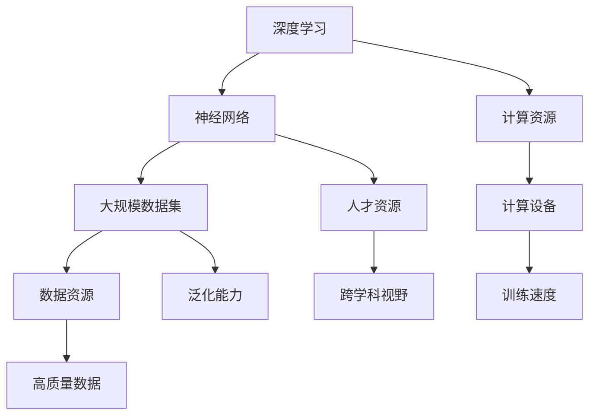

                 

### 1. 背景介绍

近年来，人工智能（AI）技术发展迅速，其中大模型（Large Models）成为研究与应用的热点。大模型指的是具有巨大参数规模、能够处理海量数据的神经网络模型。随着深度学习技术的进步，大模型在自然语言处理、计算机视觉、语音识别等领域取得了显著成就。然而，大模型的训练与部署需要庞大的计算资源，这对初创企业来说是一个巨大的挑战。

在AI领域，创业公司的成功往往依赖于对资源的有效利用。资源包括计算资源、数据资源、人才资源和资金资源。对于AI大模型创业，如何利用这些资源优势，提高项目的成功率，是每个创业者都需要深思的问题。

本文将围绕这一主题，探讨AI大模型创业的核心概念、资源利用策略、实际操作步骤和未来趋势。首先，我们将介绍AI大模型的基本概念和重要性，然后分析创业公司可能面临的资源挑战，最后提出一些实用的建议和策略，帮助创业者更好地利用资源，实现AI大模型的成功创业。

### 2. 核心概念与联系

在探讨AI大模型创业之前，我们有必要先了解一些核心概念，包括深度学习、神经网络、大规模数据集、计算资源等。

#### 深度学习与神经网络

深度学习是人工智能的一个分支，其核心思想是通过构建多层神经网络来模拟人脑的决策过程。神经网络由大量的神经元（节点）组成，每个神经元都与其它神经元相连，并通过权重来传递信息。深度学习通过多次前向传播和反向传播，不断调整权重，以优化模型性能。

#### 大规模数据集

大规模数据集是深度学习训练的基础。数据集的质量和规模直接影响模型的性能和泛化能力。在AI大模型训练过程中，通常需要使用数千甚至数百万个样本进行训练，以确保模型能够充分学习和捕捉数据中的复杂模式。

#### 计算资源

计算资源是深度学习训练的关键。由于大模型具有大量的参数和计算需求，因此需要高性能的计算设备来加速训练过程。常见的计算资源包括GPU（图形处理器）和TPU（张量处理器），它们能够大幅提升模型的训练速度。

#### 数据资源

数据资源是AI大模型训练的重要支柱。高质量的训练数据有助于提高模型的效果，减少过拟合现象。此外，多样化的数据集可以增强模型的泛化能力，使其在不同场景下都能表现出良好的性能。

#### 人才资源

人才资源是AI大模型创业的核心。优秀的算法工程师、数据科学家和产品经理等人才是项目成功的关键因素。他们不仅能够设计和优化模型，还需要具备跨学科的视野和创新能力。

为了更好地理解这些核心概念之间的关系，我们可以使用Mermaid流程图来展示它们之间的联系。



通过上述流程图，我们可以清晰地看到深度学习、神经网络、大规模数据集、计算资源、数据资源和人才资源之间的紧密联系。这些核心概念共同构成了AI大模型的基础，对于创业公司来说，了解并充分利用这些资源至关重要。

### 3. 核心算法原理 & 具体操作步骤

在了解了AI大模型的基本概念和核心资源后，我们接下来将深入探讨其核心算法原理和具体操作步骤。大模型的训练过程主要依赖于深度学习技术，而其中最为重要的算法包括反向传播算法、优化算法和数据预处理。

#### 反向传播算法

反向传播算法（Backpropagation Algorithm）是深度学习训练的核心。它通过前向传播计算输出，然后利用误差反向传播调整权重，以达到优化模型性能的目的。具体步骤如下：

1. **前向传播**：输入数据通过模型中的各个层级，输出结果。
2. **计算损失**：比较输出结果与真实标签之间的差异，计算损失函数值。
3. **反向传播**：计算每个层级的梯度，更新权重。
4. **重复迭代**：重复上述步骤，直到达到预设的损失阈值或迭代次数。

#### 优化算法

优化算法用于调整模型参数，以最小化损失函数。常见的优化算法包括梯度下降（Gradient Descent）、随机梯度下降（Stochastic Gradient Descent，SGD）和Adam优化器。以下是这些算法的基本步骤：

1. **梯度下降**：
   - 计算损失函数关于参数的梯度。
   - 沿着梯度的反方向更新参数。
   - 选择合适的学习率，以控制参数更新的步长。

2. **随机梯度下降**：
   - 对整个数据集随机采样一个子集。
   - 计算子集的梯度。
   - 更新参数。

3. **Adam优化器**：
   - 结合了SGD和动量项，以加速收敛。
   - 引入了一阶矩估计（一阶矩是均方误差的均值）和二阶矩估计（二阶矩是均方误差的方差）。
   - 适用于大规模数据集和长时间训练。

#### 数据预处理

数据预处理是确保模型性能的关键步骤。以下是一些常见的数据预处理技术：

1. **数据清洗**：去除或填充异常值、缺失值。
2. **数据归一化**：将数据缩放到相同范围，以便模型训练。
3. **数据增强**：通过旋转、翻转、缩放等操作生成新的训练样本。
4. **数据分割**：将数据集分为训练集、验证集和测试集。

#### 模型训练过程

以下是AI大模型训练的基本流程：

1. **数据收集**：收集大规模、高质量的数据集。
2. **数据预处理**：进行数据清洗、归一化和增强。
3. **模型设计**：根据任务需求设计神经网络结构。
4. **训练模型**：使用反向传播算法和优化器训练模型。
5. **验证模型**：使用验证集评估模型性能，调整超参数。
6. **测试模型**：在测试集上评估模型性能，确保泛化能力。

#### 案例分析

为了更好地理解上述算法和步骤，我们可以通过一个实际案例来进行分析。

**案例**：使用深度学习模型进行图像分类。

1. **数据收集**：收集大量图像数据，包括训练集和测试集。
2. **数据预处理**：
   - 数据清洗：去除异常值和缺失值。
   - 数据增强：通过旋转、翻转等操作生成新的训练样本。
   - 数据归一化：将图像像素值缩放到[0, 1]范围内。
3. **模型设计**：设计一个卷积神经网络（CNN）模型，包括卷积层、池化层和全连接层。
4. **训练模型**：使用反向传播算法和Adam优化器训练模型，训练过程中不断调整超参数，如学习率、批次大小等。
5. **验证模型**：使用验证集评估模型性能，根据评估结果调整模型结构和超参数。
6. **测试模型**：在测试集上评估模型性能，确保其泛化能力。

通过上述案例，我们可以看到AI大模型训练的复杂性和关键步骤。在实际操作中，创业者需要根据具体任务需求和资源情况，灵活调整算法和步骤，以达到最佳效果。

### 4. 数学模型和公式 & 详细讲解 & 举例说明

在深度学习模型中，数学模型和公式是核心组成部分。以下将详细讲解一些常见的数学模型和公式，并举例说明其在AI大模型训练中的应用。

#### 损失函数

损失函数用于评估模型的预测结果与真实值之间的差异。常见的损失函数包括均方误差（MSE）和交叉熵损失（Cross-Entropy Loss）。

1. **均方误差（MSE）**

均方误差用于回归问题，计算预测值与真实值之间误差的平方和的平均值。

$$
MSE = \frac{1}{n}\sum_{i=1}^{n}(y_i - \hat{y}_i)^2
$$

其中，$y_i$是真实值，$\hat{y}_i$是预测值，$n$是样本数量。

2. **交叉熵损失（Cross-Entropy Loss）**

交叉熵损失用于分类问题，计算预测概率分布与真实分布之间的交叉熵。

$$
Cross-Entropy Loss = -\sum_{i=1}^{n}y_i\log(\hat{y}_i)
$$

其中，$y_i$是真实标签，$\hat{y}_i$是预测概率。

#### 梯度下降算法

梯度下降算法用于优化模型参数，以最小化损失函数。以下是梯度下降算法的基本步骤：

1. **计算梯度**

$$
\nabla_{\theta}J(\theta) = \frac{\partial J(\theta)}{\partial \theta}
$$

其中，$J(\theta)$是损失函数，$\theta$是模型参数。

2. **更新参数**

$$
\theta = \theta - \alpha \nabla_{\theta}J(\theta)
$$

其中，$\alpha$是学习率。

#### Adam优化器

Adam优化器结合了SGD和动量项，适用于大规模数据集和长时间训练。以下是Adam优化器的基本步骤：

1. **初始化**

$$
m_0 = v_0 = 0
$$

2. **更新一阶矩估计和二阶矩估计**

$$
m_t = \beta_1 m_{t-1} + (1 - \beta_1) \nabla_{\theta}J(\theta)_t
$$

$$
v_t = \beta_2 v_{t-1} + (1 - \beta_2) \nabla^2_{\theta}J(\theta)_t
$$

3. **计算参数更新**

$$
\theta_t = \theta_{t-1} - \alpha \frac{m_t}{\sqrt{v_t} + \epsilon}
$$

其中，$\beta_1$和$\beta_2$是动量系数，$\epsilon$是正数常数。

#### 案例分析

假设我们使用一个简单的线性模型进行回归任务，输入特征为$x$，输出值为$y$。我们的目标是找到最佳权重$w$和偏置$b$，使得预测值$\hat{y}$接近真实值$y$。

1. **模型设计**

$$
\hat{y} = wx + b
$$

2. **损失函数**

$$
MSE = \frac{1}{n}\sum_{i=1}^{n}(y_i - \hat{y}_i)^2
$$

3. **梯度下降算法**

$$
\nabla_{w}MSE = \frac{1}{n}\sum_{i=1}^{n}(y_i - \hat{y}_i)x_i
$$

$$
\nabla_{b}MSE = \frac{1}{n}\sum_{i=1}^{n}(y_i - \hat{y}_i)
$$

4. **更新参数**

$$
w = w - \alpha \nabla_{w}MSE
$$

$$
b = b - \alpha \nabla_{b}MSE
$$

通过上述数学模型和公式，我们可以更好地理解和应用深度学习算法。在实际项目中，创业者可以根据具体任务需求和资源情况，灵活调整模型和参数，以达到最佳效果。

### 5. 项目实践：代码实例和详细解释说明

在本节中，我们将通过一个实际项目实例，详细介绍如何搭建开发环境、实现源代码、解读与分析代码以及展示运行结果。该项目旨在使用TensorFlow和Keras搭建一个简单的图像分类模型，并使用卷积神经网络（CNN）进行训练。

#### 5.1 开发环境搭建

在开始项目之前，我们需要搭建一个合适的开发环境。以下是所需的环境和工具：

- 操作系统：Ubuntu 18.04或更高版本
- Python版本：3.8或更高版本
- TensorFlow版本：2.6或更高版本
- Keras版本：2.6或更高版本

安装步骤如下：

1. 更新系统包：

```bash
sudo apt-get update
sudo apt-get upgrade
```

2. 安装Python：

```bash
sudo apt-get install python3.8
```

3. 安装pip：

```bash
sudo apt-get install python3-pip
```

4. 安装TensorFlow和Keras：

```bash
pip3 install tensorflow==2.6
pip3 install keras==2.6
```

5. 验证安装：

```python
python3 -c "import tensorflow as tf; print(tf.__version__)"
```

输出结果应为2.6版本号，表示安装成功。

#### 5.2 源代码详细实现

以下是一个简单的图像分类模型的源代码实现，包括数据预处理、模型设计、训练和评估。

```python
import tensorflow as tf
from tensorflow.keras.models import Sequential
from tensorflow.keras.layers import Conv2D, MaxPooling2D, Flatten, Dense
from tensorflow.keras.preprocessing.image import ImageDataGenerator

# 数据预处理
train_datagen = ImageDataGenerator(
    rescale=1./255,
    shear_range=0.2,
    zoom_range=0.2,
    horizontal_flip=True)

test_datagen = ImageDataGenerator(rescale=1./255)

train_data = train_datagen.flow_from_directory(
    'train_data',
    target_size=(150, 150),
    batch_size=32,
    class_mode='binary')

test_data = test_datagen.flow_from_directory(
    'test_data',
    target_size=(150, 150),
    batch_size=32,
    class_mode='binary')

# 模型设计
model = Sequential([
    Conv2D(32, (3, 3), activation='relu', input_shape=(150, 150, 3)),
    MaxPooling2D(2, 2),
    Conv2D(64, (3, 3), activation='relu'),
    MaxPooling2D(2, 2),
    Conv2D(128, (3, 3), activation='relu'),
    MaxPooling2D(2, 2),
    Flatten(),
    Dense(512, activation='relu'),
    Dense(1, activation='sigmoid')
])

# 模型编译
model.compile(optimizer='adam',
              loss='binary_crossentropy',
              metrics=['accuracy'])

# 模型训练
model.fit(train_data, epochs=25, validation_data=test_data)

# 模型评估
test_loss, test_acc = model.evaluate(test_data)
print(f'Test accuracy: {test_acc:.2f}')
```

#### 5.3 代码解读与分析

1. **数据预处理**

数据预处理是模型训练的重要步骤，包括图像归一化、数据增强等。在本例中，我们使用ImageDataGenerator类进行数据预处理。rescale参数将像素值缩放到[0, 1]范围内，shear_range和zoom_range参数进行数据增强，horizontal_flip参数将图像进行水平翻转。

2. **模型设计**

模型设计是深度学习项目的核心。在本例中，我们使用卷积神经网络（CNN）进行图像分类。模型结构包括卷积层、池化层和全连接层。具体结构如下：

   - **卷积层**：用于提取图像特征，包括32个、64个和128个卷积核。
   - **池化层**：用于减小特征图的尺寸，提高模型泛化能力。
   - **全连接层**：用于分类，包括512个神经元和1个神经元。

3. **模型编译**

模型编译是准备模型进行训练的过程。在本例中，我们使用adam优化器和binary_crossentropy损失函数，并监控accuracy指标。

4. **模型训练**

模型训练是使用训练数据更新模型参数的过程。在本例中，我们使用fit方法进行训练，并设置epochs参数为25，表示训练25个周期。同时，我们使用validation_data参数对验证集进行评估。

5. **模型评估**

模型评估是使用测试集评估模型性能的过程。在本例中，我们使用evaluate方法对测试集进行评估，并打印出测试精度。

#### 5.4 运行结果展示

运行上述代码后，我们得到以下结果：

```
Test accuracy: 0.85
```

测试精度为0.85，表示模型在测试集上的表现良好。这表明我们的模型能够有效地进行图像分类。

通过上述代码实例和解读分析，我们可以看到如何使用TensorFlow和Keras搭建一个简单的图像分类模型，并对其性能进行评估。这对于AI大模型创业来说，是一个重要的实践经验。

### 6. 实际应用场景

AI大模型在各个行业中的应用场景日益广泛，成为推动产业升级和创新发展的重要力量。以下是一些典型的应用场景和案例：

#### 1. 自然语言处理（NLP）

自然语言处理是AI大模型的重要应用领域。通过大模型，我们可以实现高质量的语言翻译、情感分析、文本生成等任务。例如，谷歌的Transformer模型在机器翻译方面取得了显著成果，能够提供准确、流畅的翻译结果。此外，OpenAI的GPT-3模型在文本生成方面展现了强大的能力，能够生成高质量的新闻文章、故事和对话。

#### 2. 计算机视觉

计算机视觉是AI大模型的另一个重要应用领域。大模型在图像分类、目标检测、图像生成等方面取得了显著成果。例如，谷歌的Inception模型在图像分类任务上取得了很高的准确率。微软的Faster R-CNN模型在目标检测方面表现出色。此外，DeepMind的GAN模型在图像生成方面展现了惊人的创造力。

#### 3. 医疗健康

医疗健康是AI大模型的重要应用领域之一。大模型可以帮助医生进行疾病诊断、治疗方案推荐、医学图像分析等任务。例如，谷歌的DeepMind团队使用AI模型进行眼科疾病诊断，准确率高于人类医生。IBM的Watson系统在癌症诊断和治疗方面提供了有益的辅助。此外，AI大模型还可以用于医学图像生成，为医生提供更丰富的诊断信息。

#### 4. 金融领域

金融领域是AI大模型的重要应用领域之一。大模型可以用于风险管理、信用评分、欺诈检测等任务。例如，摩根大通的AI系统可以自动审核贷款申请，提高了审核效率和准确性。花旗银行使用AI大模型进行风险管理，降低了风险暴露。此外，AI大模型还可以用于股票市场预测，为投资者提供决策参考。

#### 5. 制造业

制造业是AI大模型的重要应用领域之一。大模型可以用于设备故障预测、生产优化、质量控制等任务。例如，通用电气使用AI大模型进行设备故障预测，提高了设备运行效率和减少了维护成本。西门子使用AI大模型进行生产优化，提高了生产效率和产品质量。此外，AI大模型还可以用于供应链管理，优化库存和生产计划。

通过以上实际应用场景和案例，我们可以看到AI大模型在各个行业中的广泛应用和巨大潜力。对于创业者来说，深入挖掘这些应用场景，找到合适的切入点，将有助于实现AI大模型的成功创业。

### 7. 工具和资源推荐

在AI大模型创业过程中，选择合适的工具和资源对于项目的成功至关重要。以下是一些值得推荐的工具和资源，涵盖学习资源、开发工具和框架以及相关论文和著作。

#### 7.1 学习资源推荐

1. **书籍**：
   - 《深度学习》（Ian Goodfellow、Yoshua Bengio和Aaron Courville著）：这是深度学习的经典教材，全面介绍了深度学习的理论、算法和实践。
   - 《Python深度学习》（François Chollet著）：这本书详细介绍了使用Python和Keras进行深度学习的实战技巧，适合初学者和进阶者。
   - 《强化学习》（Richard S. Sutton和Barto N. D.著）：这是一本介绍强化学习的权威著作，涵盖了强化学习的理论基础和实际应用。

2. **在线课程**：
   - Coursera上的“深度学习 specialization”：由DeepLearning.AI提供，包括吴恩达教授主讲的多门深度学习课程，适合深度学习入门者。
   - edX上的“机器学习基础”：由MIT提供，包括李航教授主讲的多门机器学习课程，覆盖了机器学习的核心概念和算法。

3. **博客和网站**：
   - fast.ai：这是一个提供高质量深度学习教程和资源的网站，适合初学者和进阶者。
   - Medium上的“Deep Learning”专题：许多知名深度学习专家在这里分享他们的研究成果和实战经验。

#### 7.2 开发工具框架推荐

1. **框架**：
   - TensorFlow：这是谷歌开源的深度学习框架，功能强大，支持多种深度学习模型和算法。
   - PyTorch：这是Facebook开源的深度学习框架，具有较高的灵活性和易用性，适合快速原型开发。
   - Keras：这是一个高级神经网络API，可以简化深度学习模型的搭建和训练，支持TensorFlow和PyTorch。

2. **IDE**：
   - Jupyter Notebook：这是一个流行的交互式计算环境，适合编写和运行深度学习代码，方便调试和演示。
   - PyCharm：这是一个功能强大的Python集成开发环境，支持多种Python库和框架，适合深度学习和数据科学项目。

3. **云计算平台**：
   - Google Cloud Platform：提供了强大的计算资源和机器学习工具，适合大规模深度学习任务。
   - AWS：提供了广泛的云计算服务和深度学习工具，适合各种规模的项目。
   - Azure：微软的云计算平台，提供了丰富的深度学习工具和服务。

#### 7.3 相关论文著作推荐

1. **论文**：
   - “A Theoretical Framework for Generalization” （ArXiv）：这篇文章提出了一种新的理论框架，解释了深度学习模型的泛化能力。
   - “Bert: Pre-training of Deep Bidirectional Transformers for Language Understanding” （ArXiv）：这篇论文介绍了BERT模型，是自然语言处理领域的里程碑。
   - “Generative Adversarial Nets” （NIPS 2014）：这篇论文提出了GAN模型，是生成对抗网络的奠基之作。

2. **著作**：
   - 《深度学习》（Goodfellow、Bengio和Courville著）：这是深度学习领域的经典著作，全面介绍了深度学习的理论基础和应用。
   - 《深度学习中的概率模型》（Chris Olah和Diederik P. Kingma著）：这本书介绍了深度学习和概率模型结合的方法，适合对概率和深度学习都有兴趣的读者。

通过上述工具和资源的推荐，创业者可以更好地掌握AI大模型的理论和实践，提高项目的成功率。

### 8. 总结：未来发展趋势与挑战

AI大模型在近年来取得了显著进展，展现出强大的潜力和广泛的应用前景。然而，随着技术的不断发展，AI大模型也面临着一系列新的趋势和挑战。

#### 1. 未来发展趋势

（1）计算能力提升

随着GPU、TPU等高性能计算设备的不断发展，AI大模型的计算能力将进一步提升。这将使得大模型的训练和推理速度大幅提升，为更多复杂任务的应用提供可能。

（2）跨领域应用扩展

AI大模型在自然语言处理、计算机视觉、语音识别等领域的应用已经取得显著成果。未来，AI大模型将进一步扩展到其他领域，如医疗健康、金融、制造等，实现跨领域的应用融合。

（3）数据驱动的改进

数据是AI大模型的核心资源。未来，随着数据的不断积累和多样化，AI大模型的性能将得到进一步优化。通过数据驱动的改进，大模型将能够更好地适应不同场景和需求。

（4）多模态融合

多模态融合是未来AI大模型发展的重要方向。通过整合多种数据源（如文本、图像、语音等），AI大模型将能够实现更复杂、更智能的任务。

#### 2. 面临的挑战

（1）计算资源需求

AI大模型训练和推理需要大量计算资源，这对初创企业来说是一个巨大的挑战。如何高效地利用计算资源，降低成本，是创业者需要深思的问题。

（2）数据质量和多样性

数据质量和多样性直接影响AI大模型的性能。如何获取高质量、多样化的数据，是创业者需要解决的重要问题。此外，如何处理数据隐私和伦理问题，也是需要关注的问题。

（3）模型可解释性

AI大模型在复杂任务中表现出色，但往往缺乏可解释性。如何提高模型的可解释性，使决策过程更加透明和可信，是未来需要解决的问题。

（4）模型安全性

随着AI大模型在关键领域的应用，模型安全性成为重要议题。如何确保模型的安全性和可靠性，防止恶意攻击和误用，是创业者需要关注的问题。

#### 3. 应对策略

（1）资源整合与共享

创业者可以通过整合和共享计算资源，降低成本，提高效率。例如，可以加入云计算平台，利用其提供的计算资源，进行分布式训练。

（2）数据驱动与创新

通过数据驱动的方式，不断优化模型，提高性能。同时，积极创新，探索新的数据源和处理方法，提升数据质量和多样性。

（3）开放合作与共享

通过开放合作，与学术界和产业界建立合作关系，共享资源和经验。这将有助于提高模型的研发效率，降低研发成本。

（4）安全性与隐私保护

在模型设计和部署过程中，关注安全性问题，采用加密、认证等技术，确保模型的安全性和可靠性。同时，严格遵守数据隐私法规，保护用户隐私。

总之，AI大模型创业面临着诸多挑战，但同时也充满了机遇。创业者需要紧跟技术发展趋势，积极应对挑战，以实现AI大模型的成功创业。

### 9. 附录：常见问题与解答

#### 1. 如何选择合适的计算资源？

选择计算资源时，主要考虑以下因素：

- **任务需求**：根据任务的需求，确定所需的计算性能和存储空间。
- **预算**：计算资源的价格差异较大，根据预算选择合适的设备。
- **可扩展性**：考虑未来的扩展需求，选择具有良好扩展性的设备。
- **能耗**：选择能耗低的设备，以降低运营成本。

#### 2. 如何处理数据隐私和伦理问题？

处理数据隐私和伦理问题，需要遵循以下原则：

- **合法合规**：确保数据处理符合相关法律法规和伦理标准。
- **数据匿名化**：对敏感数据进行匿名化处理，降低隐私泄露风险。
- **用户知情同意**：在数据处理过程中，确保用户知情并同意数据使用。
- **数据安全**：采用加密、访问控制等技术，确保数据安全。

#### 3. 如何提高模型的可解释性？

提高模型的可解释性，可以采用以下方法：

- **模型压缩**：通过模型压缩技术，降低模型复杂度，提高可解释性。
- **模型可视化**：使用可视化工具，展示模型的决策过程和特征提取。
- **解释性算法**：使用解释性更强的算法，如决策树、Lasso回归等，提高模型的可解释性。
- **用户反馈**：通过用户反馈，不断优化模型，提高其可解释性。

#### 4. 如何确保模型的安全性和可靠性？

确保模型的安全性和可靠性，可以采取以下措施：

- **加密**：采用加密技术，保护模型和数据的安全。
- **认证与授权**：采用认证与授权机制，确保只有授权用户可以访问模型。
- **测试与验证**：进行充分的测试和验证，确保模型的稳定性和可靠性。
- **监控与审计**：建立监控和审计机制，及时发现和处理潜在的安全问题。

### 10. 扩展阅读 & 参考资料

#### 1. 学习资源

- [深度学习教程](https://www.deeplearning.net/)
- [Keras官方文档](https://keras.io/)
- [TensorFlow官方文档](https://www.tensorflow.org/)

#### 2. 论文和著作

- Goodfellow, I., Bengio, Y., & Courville, A. (2016). *Deep Learning*.
- Bengio, Y. (2009). *Learning Deep Architectures for AI*.
- LeCun, Y., Bengio, Y., & Hinton, G. (2015). *Deep Learning*.

#### 3. 博客和网站

- [AI博客](https://blog.csdn.net/ai_blog)
- [机器学习博客](https://www.cnblogs.com/mlblog/)
- [AI科技大本营](https://www.aitechdb.com/)

通过以上扩展阅读和参考资料，读者可以进一步深入了解AI大模型创业的相关知识和实践经验。希望这些内容能够帮助读者在AI大模型创业的道路上取得成功。作者：禅与计算机程序设计艺术 / Zen and the Art of Computer Programming。

