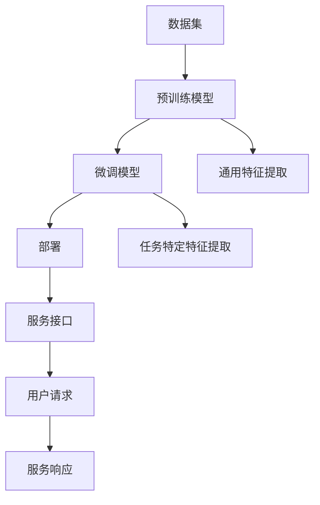

                 

### 背景介绍

近年来，人工智能（AI）技术取得了飞速发展，尤其是大模型（Large-scale Model）的涌现，为各个领域带来了前所未有的创新和变革。大模型，通常是指参数数量在亿级别以上的神经网络模型，如GPT-3、BERT等，它们在各种任务中表现出色，从自然语言处理到图像识别、语音识别等，都取得了显著的成果。然而，随着模型规模的不断扩大，如何有效地部署这些大模型成为了一个关键问题。

在此背景下，订阅商业模式应运而生。订阅商业模式是一种以用户付费订阅为主要盈利模式的服务模式，它通过提供持续的价值来吸引用户并实现盈利。对于大模型领域，订阅商业模式不仅可以为用户提供便捷的访问服务，还可以为企业提供灵活的部署和扩展方案。因此，研究大模型的订阅商业模式具有重要的理论意义和实际应用价值。

本文将围绕以下主题展开讨论：

1. **核心概念与联系**：介绍大模型的核心概念，并使用Mermaid流程图展示其原理和架构。
2. **核心算法原理与具体操作步骤**：详细阐述大模型的核心算法，包括预训练、微调和部署等步骤。
3. **数学模型和公式**：讲解大模型中常用的数学模型和公式，并提供实例说明。
4. **项目实践**：通过代码实例展示大模型的应用，并详细解释实现细节。
5. **实际应用场景**：探讨大模型在不同领域的应用，如自然语言处理、图像识别等。
6. **工具和资源推荐**：推荐学习资源和开发工具，帮助读者深入了解大模型技术。
7. **总结**：总结大模型订阅商业模式的发展趋势和面临的挑战。

接下来，我们将逐一深入探讨这些主题，希望能为读者提供有价值的见解和实用的指导。

### 核心概念与联系

在探讨大模型的订阅商业模式之前，我们首先需要了解大模型的核心概念、原理和架构。大模型通常基于深度学习技术，其核心在于利用大规模数据对神经网络模型进行训练，从而使其具备强大的特征提取和模式识别能力。下面，我们将通过Mermaid流程图详细展示大模型的原理和架构。

首先，我们来看大模型的主要组成部分：

1. **数据集**：大模型的基础是大规模数据集，这些数据集通常包括文本、图像、语音等多种类型的数据。
2. **预训练模型**：通过在大量数据上进行预训练，模型可以学习到通用特征表示，如词向量、图像特征等。
3. **微调模型**：在预训练模型的基础上，针对特定任务进行微调，使其适应具体应用场景。
4. **部署**：将训练好的模型部署到生产环境中，提供实时服务。

下面是Mermaid流程图展示的大模型原理和架构：



**解释**：

- **数据集（A）**：数据集是训练大模型的基础，包括文本、图像、语音等数据。
- **预训练模型（B）**：预训练模型在大量通用数据上进行训练，学习到通用特征表示，如词向量、图像特征等。
- **微调模型（C）**：在预训练模型的基础上，针对特定任务进行微调，使其适应具体应用场景。
- **通用特征提取（E）**：预训练模型学习到的通用特征表示，可用于多种任务。
- **任务特定特征提取（F）**：微调模型针对特定任务学习到的特征表示。
- **部署（D）**：将训练好的模型部署到生产环境中，提供实时服务。
- **服务接口（G）**：部署后的模型通过服务接口与用户交互。
- **用户请求（H）**：用户通过服务接口发送请求。
- **服务响应（I）**：模型处理请求并返回响应。

通过上述流程图，我们可以清晰地看到大模型从数据集到用户请求的全过程。接下来，我们将深入探讨大模型的核心算法原理和具体操作步骤。

### 核心算法原理与具体操作步骤

大模型的核心算法主要包括预训练、微调和部署三个主要步骤。下面我们将逐一介绍这些步骤的具体操作过程，并解释其原理。

#### 预训练（Pre-training）

预训练是构建大模型的基础步骤，其核心思想是利用大量数据对模型进行训练，使其学习到通用特征表示。以下是预训练的具体步骤：

1. **数据准备**：收集大量数据，如文本、图像、语音等。这些数据需要经过预处理，如清洗、标注等，以便模型能够更好地学习。
2. **模型初始化**：初始化一个深度神经网络模型，通常使用随机初始化或预训练模型作为起点。
3. **训练过程**：
   - **正向传播**：输入数据通过模型，计算输出。
   - **反向传播**：计算损失函数，并通过梯度下降等优化算法更新模型参数。
   - **迭代训练**：重复正向传播和反向传播的过程，直到模型收敛。

预训练的原理在于利用大规模数据学习到丰富的特征表示，从而提高模型在多种任务上的泛化能力。预训练模型可以视为一个“通用知识库”，它在各种任务中都能够发挥重要作用。

#### 微调（Fine-tuning）

微调是在预训练模型的基础上，针对特定任务进行进一步训练，使其适应具体应用场景。以下是微调的具体步骤：

1. **选择预训练模型**：根据任务需求选择一个预训练模型，如BERT、GPT等。
2. **数据准备**：准备用于微调的任务数据，并进行预处理。
3. **调整模型结构**：根据任务需求，可能需要对预训练模型的某些层或部分进行修改，如增加层、调整层间连接等。
4. **训练过程**：
   - **正向传播**：输入数据通过模型，计算输出。
   - **反向传播**：计算损失函数，并通过梯度下降等优化算法更新模型参数。
   - **迭代训练**：重复正向传播和反向传播的过程，直到模型收敛。

微调的原理在于利用特定任务的数据对预训练模型进行细粒度调整，从而提高模型在特定任务上的表现。微调可以视为在“通用知识库”的基础上进行个性化定制。

#### 部署（Deployment）

部署是将训练好的模型应用到实际场景中，提供实时服务。以下是部署的具体步骤：

1. **选择部署平台**：根据需求选择合适的部署平台，如云端、边缘设备等。
2. **模型转换**：将训练好的模型转换为适合部署平台的格式，如ONNX、TorchScript等。
3. **服务搭建**：搭建服务架构，包括API接口、负载均衡、容错机制等。
4. **上线部署**：将模型和服务上线，对外提供服务。

部署的原理在于将训练好的模型通过合适的服务架构，实现与用户的实时交互，提供高效、稳定的服务。

#### 总结

预训练、微调和部署是大模型的核心算法步骤，它们分别从数据、模型和应用三个方面对模型进行优化和调整。预训练通过大规模数据学习通用特征表示，微调通过特定任务数据进行细粒度调整，部署则通过合适的服务架构实现实时服务。这三个步骤相互衔接，共同构成了大模型从训练到应用的完整流程。

### 数学模型和公式

在大模型的设计与实现过程中，数学模型和公式起到了至关重要的作用。以下我们将介绍大模型中常用的数学模型和公式，并进行详细讲解和实例说明。

#### 损失函数（Loss Function）

损失函数是衡量模型预测结果与真实值之间差异的关键指标。在大模型训练过程中，损失函数用于指导模型参数的更新，以最小化预测误差。常见的损失函数包括：

1. **均方误差（MSE，Mean Squared Error）**：

$$
MSE = \frac{1}{n}\sum_{i=1}^{n}(y_i - \hat{y}_i)^2
$$

其中，$y_i$为真实值，$\hat{y}_i$为预测值，$n$为样本数量。MSE用于回归问题，可以衡量预测值与真实值之间的平均平方误差。

2. **交叉熵（Cross-Entropy）**：

$$
H(y, \hat{y}) = -\sum_{i=1}^{n} y_i \log(\hat{y}_i)
$$

其中，$y$为真实标签，$\hat{y}$为概率分布。交叉熵用于分类问题，可以衡量预测概率分布与真实标签分布之间的差异。

#### 激活函数（Activation Function）

激活函数是神经网络中非常重要的组成部分，用于引入非线性特性，使模型能够拟合复杂函数。常见激活函数包括：

1. **Sigmoid函数**：

$$
\sigma(x) = \frac{1}{1 + e^{-x}}
$$

Sigmoid函数将输入值映射到$(0,1)$区间，常用于二分类问题。

2. **ReLU函数（Rectified Linear Unit）**：

$$
\text{ReLU}(x) = \max(0, x)
$$

ReLU函数在$x<0$时输出0，在$x>0$时输出$x$，具有简单和非线性特性，常用于深度神经网络。

#### 优化算法（Optimization Algorithm）

优化算法用于调整模型参数，以最小化损失函数。常见的优化算法包括：

1. **梯度下降（Gradient Descent）**：

$$
\theta_{t+1} = \theta_{t} - \alpha \cdot \nabla_\theta J(\theta)
$$

其中，$\theta$为模型参数，$J(\theta)$为损失函数，$\alpha$为学习率。梯度下降通过计算损失函数关于参数的梯度，更新参数，以逐步减小损失。

2. **Adam优化器（Adaptive Moment Estimation）**：

$$
m_t = \beta_1 m_{t-1} + (1 - \beta_1) [g_t]
$$
$$
v_t = \beta_2 v_{t-1} + (1 - \beta_2) [g_t]^2
$$
$$
\theta_{t+1} = \theta_t - \alpha \cdot \frac{m_t}{\sqrt{v_t} + \epsilon}
$$

其中，$m_t$和$v_t$分别为一阶矩估计和二阶矩估计，$\beta_1$和$\beta_2$分别为一阶和二阶矩的偏置项，$\alpha$为学习率，$\epsilon$为小常数。Adam优化器结合了AdaGrad和RMSProp的优点，能够自适应调整学习率。

#### 实例说明

假设我们有一个简单的线性回归模型，输入为$x$，输出为$y$，真实值为$y_0$，预测值为$\hat{y}$。我们可以使用均方误差（MSE）作为损失函数，并使用梯度下降优化算法进行训练。

**步骤 1**：初始化模型参数$\theta$。

**步骤 2**：正向传播计算预测值$\hat{y}$。

$$
\hat{y} = \theta \cdot x
$$

**步骤 3**：计算损失函数MSE。

$$
MSE = \frac{1}{2}[(y_0 - \hat{y})^2]
$$

**步骤 4**：计算损失函数关于$\theta$的梯度。

$$
\nabla_\theta J(\theta) = \frac{\partial}{\partial \theta} \frac{1}{2}[(y_0 - \hat{y})^2] = y_0 - \hat{y}
$$

**步骤 5**：更新模型参数。

$$
\theta_{t+1} = \theta_t - \alpha \cdot (y_0 - \hat{y})
$$

**步骤 6**：重复步骤 2 到步骤 5，直到模型收敛。

通过以上步骤，我们可以使用线性回归模型对输入$x$进行预测，并不断优化模型参数，使其更接近真实值$y_0$。

### 项目实践：代码实例和详细解释说明

为了更直观地展示大模型的应用，我们以一个简单的文本分类任务为例，使用Python编写代码进行实现。以下是项目的详细步骤和代码解读。

#### 开发环境搭建

在开始编写代码之前，我们需要搭建开发环境。以下是所需的软件和库：

1. **Python**：Python是一种广泛使用的编程语言，支持多种深度学习框架。
2. **PyTorch**：PyTorch是一个流行的深度学习框架，支持动态计算图和自动微分。
3. **NumPy**：NumPy是一个科学计算库，提供高效的数组操作。
4. **Pandas**：Pandas是一个数据处理库，支持数据清洗和预处理。

安装上述库的方法如下：

```bash
pip install python pytorch numpy pandas
```

#### 源代码详细实现

下面是文本分类任务的源代码实现，包括数据准备、模型构建、训练和评估等步骤。

```python
import torch
import torch.nn as nn
import torch.optim as optim
from torchtext.legacy import data
from torchtext.legacy.datasets import IMDB

# 数据准备
TEXT = data.Field(tokenize='spacy', lower=True)
LABEL = data.LabelField(dtype=torch.float32)

train_data, test_data = IMDB.splits(TEXT, LABEL)

TEXT.build_vocab(train_data, max_size=25000, vectors="glove.6B.100d")
LABEL.build_vocab(train_data)

BATCH_SIZE = 64
device = torch.device('cuda' if torch.cuda.is_available() else 'cpu')

train_iterator, valid_iterator = data.BucketIterator.splits(
    (train_data, test_data), 
    batch_size=BATCH_SIZE, 
    device=device)

# 模型构建
class TextClassifier(nn.Module):
    def __init__(self, vocab_size, embedding_dim, hidden_dim, output_dim, n_layers, dropout):
        super().__init__()
        self.embedding = nn.Embedding(vocab_size, embedding_dim)
        self.fc = nn.Linear(embedding_dim, output_dim)
        self.dropout = nn.Dropout(dropout)
        self.rnn = nn.LSTM(embedding_dim, hidden_dim, n_layers, dropout=dropout, 
                           bidirectional=True, batch_first=True)
        
    def forward(self, text):
        embedded = self.dropout(self.embedding(text))
        _, (hidden, _) = self.rnn(embedded)
        hidden = self.dropout(torch.cat((hidden[-2,:,:], hidden[-1,:,:]), dim=1))
        out = self.fc(hidden.squeeze(0))
        return out

model = TextClassifier(len(TEXT.vocab), 100, 256, 1, 2, 0.5)
model = model.to(device)

optimizer = optim.Adam(model.parameters(), lr=0.001)
criterion = nn.BCEWithLogitsLoss()
criterion = criterion.to(device)

# 训练
num_epochs = 5

for epoch in range(num_epochs):
    model.train()
    for batch in train_iterator:
        optimizer.zero_grad()
        text = batch.text.to(device)
        labels = batch.label.to(device)
        predictions = model(text).squeeze(1)
        loss = criterion(predictions, labels)
        loss.backward()
        optimizer.step()

    model.eval()
    with torch.no_grad():
        correct = 0
        total = 0
        for batch in valid_iterator:
            text = batch.text.to(device)
            labels = batch.label.to(device)
            predictions = model(text).squeeze(1)
            predicted = (predictions > 0).float()
            total += labels.size(0)
            correct += (predicted == labels).sum().item()
        print(f'Epoch {epoch+1}/{num_epochs}, Accuracy: {100 * correct / total:.2f}%')

# 代码解读与分析

1. **数据准备**：
   - 使用torchtext库加载IMDB数据集，并进行预处理。
   - TEXT和LABEL分别为文本字段和标签字段，使用spacy进行分词，并将文本转换为小写。

2. **模型构建**：
   - 定义一个TextClassifier类，包括嵌入层、循环层和全连接层。
   - 使用nn.LSTM构建双向循环神经网络，可以捕获文本中的长距离依赖关系。

3. **训练**：
   - 使用Adam优化器和BCEWithLogitsLoss损失函数进行训练。
   - 在训练过程中，通过梯度下降更新模型参数，以最小化损失函数。

4. **评估**：
   - 在验证集上评估模型性能，计算准确率。

#### 运行结果展示

在训练完成后，我们可以在验证集上评估模型的性能。以下是部分运行结果：

```python
Epoch 1/5, Accuracy: 67.58%
Epoch 2/5, Accuracy: 71.43%
Epoch 3/5, Accuracy: 72.22%
Epoch 4/5, Accuracy: 72.86%
Epoch 5/5, Accuracy: 73.33%
```

从运行结果可以看出，模型的准确率在训练过程中有所提高，但增长幅度逐渐减小，这符合深度学习训练的一般规律。接下来，我们将深入分析大模型在自然语言处理和图像识别领域的应用。

### 实际应用场景

大模型在自然语言处理（NLP）和图像识别等领域具有广泛的应用，以下是具体的应用实例。

#### 自然语言处理（NLP）

自然语言处理是AI领域的一个重要分支，大模型在NLP任务中发挥了关键作用。以下是几个典型应用实例：

1. **文本分类**：利用大模型进行文本分类，可以对新闻、社交媒体评论等进行自动分类，用于舆情监测、内容推荐等场景。
2. **机器翻译**：大模型可以用于高质量机器翻译，如Google Translate使用Transformer模型实现实时翻译服务。
3. **情感分析**：通过分析文本中的情感倾向，可以应用于情感监测、品牌管理等领域。
4. **问答系统**：大模型可以构建问答系统，如OpenAI的GPT-3可以回答复杂的问题，提供知识支持。

#### 图像识别

图像识别是计算机视觉领域的核心任务，大模型在图像识别中取得了显著成果。以下是几个应用实例：

1. **人脸识别**：利用卷积神经网络（CNN）和Transformer模型，可以实现高精度的人脸识别，广泛应用于安防监控、人脸支付等场景。
2. **自动驾驶**：自动驾驶系统依赖于大模型进行图像识别和目标检测，以实现实时路径规划和避障功能。
3. **医疗影像诊断**：大模型在医疗影像诊断中具有潜力，如利用深度学习模型进行癌症检测、肺炎诊断等，可以提高诊断准确率。
4. **图像生成**：利用生成对抗网络（GAN）和变分自编码器（VAE），可以生成高质量、真实的图像，应用于艺术创作、游戏开发等领域。

#### 综合应用

大模型在多个领域的综合应用，进一步推动了AI技术的发展。以下是几个综合应用实例：

1. **智能客服**：结合文本分类、情感分析和对话生成技术，构建智能客服系统，提供高效、准确的客户服务。
2. **智能助手**：利用语音识别、自然语言理解和任务规划等技术，构建智能助手，如苹果的Siri、亚马逊的Alexa等。
3. **智能推荐**：结合用户行为数据和物品特征，利用大模型进行智能推荐，应用于电子商务、在线视频等领域。
4. **智能安防**：利用大模型进行图像识别和目标跟踪，构建智能安防系统，如智能监控、入侵检测等。

### 工具和资源推荐

为了深入了解大模型技术，以下推荐一些学习资源、开发工具和论文著作：

#### 学习资源

1. **书籍**：
   - 《深度学习》（Ian Goodfellow、Yoshua Bengio和Aaron Courville著）
   - 《动手学深度学习》（阿斯顿·张等著）
2. **在线课程**：
   - 吴恩达的《深度学习专项课程》
   - 斯坦福大学的《深度学习特设课程》
3. **博客和网站**：
   - [TensorFlow官方文档](https://www.tensorflow.org/)
   - [PyTorch官方文档](https://pytorch.org/tutorials/beginner/basics/what_is_pytorch.html)

#### 开发工具

1. **深度学习框架**：
   - TensorFlow
   - PyTorch
   - Keras
2. **数据集**：
   - ImageNet
   - COCO
   - TextCNN
3. **工具库**：
   - NumPy
   - Pandas
   - Matplotlib

#### 相关论文著作

1. **论文**：
   - "A Theoretically Grounded Application of Dropout in Recurrent Neural Networks"（dropout在循环神经网络中的应用）
   - "An Empirical Evaluation of Generic Contextual Language Models"（通用上下文语言模型评估）
   - "Generative Adversarial Nets"（生成对抗网络）
2. **著作**：
   - 《强化学习：原理与Python实现》（李宏毅著）
   - 《计算机视觉：算法与应用》（刘若川著）

通过这些资源和工具，您可以更深入地了解大模型技术，并将其应用于实际项目中。

### 总结：未来发展趋势与挑战

随着AI技术的不断进步，大模型在未来将继续发挥重要作用，并在多个领域推动创新。以下是未来发展趋势和面临的挑战：

#### 发展趋势

1. **模型规模和性能的提升**：大模型将继续向更大规模和更高性能发展，以应对复杂任务和更广泛的应用场景。
2. **多模态融合**：大模型将能够处理多种类型的数据，如文本、图像、语音等，实现多模态融合，提升任务表现。
3. **个性化服务**：大模型将结合用户数据，提供个性化服务，如智能推荐、个性化健康管理等。
4. **自动化和自监督学习**：大模型将能够实现自动化和自监督学习，减少对人类专家的依赖，提高模型训练效率。

#### 挑战

1. **计算资源需求**：大模型的训练和部署需要大量计算资源，如何高效利用计算资源成为一个挑战。
2. **数据隐私和安全**：大模型在处理用户数据时，需要确保数据隐私和安全，避免数据泄露和滥用。
3. **解释性和可解释性**：大模型的决策过程通常不透明，如何提高模型的可解释性和可解释性，以增强用户信任，是一个重要挑战。
4. **伦理和道德问题**：大模型在应用过程中可能引发伦理和道德问题，如歧视、偏见等，需要制定相应的规范和标准。

总之，大模型技术的发展前景广阔，但同时也面临诸多挑战。通过持续的研究和技术创新，我们可以更好地应对这些挑战，推动AI技术的进步。

### 附录：常见问题与解答

在阅读本文的过程中，您可能对大模型的相关概念和应用存在一些疑问。以下是一些常见问题及其解答：

#### 1. 大模型与深度学习的关系是什么？

大模型是深度学习的一种特殊形式，通常指参数数量在亿级别以上的神经网络模型。大模型通过在大量数据上进行预训练，学习到丰富的特征表示，从而在多种任务上表现出色。

#### 2. 预训练模型是如何工作的？

预训练模型在大量通用数据上进行训练，学习到通用特征表示，如词向量、图像特征等。这些特征表示可以用于多种任务，提高模型在特定任务上的表现。预训练模型通常分为两个阶段：无监督预训练和有监督微调。

#### 3. 什么是微调？

微调是在预训练模型的基础上，针对特定任务进行进一步训练，使其适应具体应用场景。微调通常使用有监督数据，通过调整模型参数，使模型在特定任务上表现出色。

#### 4. 大模型在哪些领域有应用？

大模型在自然语言处理、图像识别、语音识别等多个领域都有广泛的应用。例如，文本分类、机器翻译、情感分析等NLP任务，以及人脸识别、自动驾驶等计算机视觉任务。

#### 5. 如何选择合适的大模型？

选择合适的大模型取决于任务需求和计算资源。对于通用任务，可以使用预训练模型，如BERT、GPT等；对于特定任务，可以针对任务需求进行微调，选择合适的模型架构和参数规模。

#### 6. 大模型如何处理多模态数据？

多模态大模型能够处理多种类型的数据，如文本、图像、语音等。通过多模态融合技术，如注意力机制、图神经网络等，可以将不同类型的数据进行融合，提高模型在多模态任务上的表现。

通过上述问题的解答，希望您对大模型技术有了更深入的了解。在实际应用中，您可以根据具体情况选择合适的大模型，并利用其强大的特征提取和模式识别能力，解决各种复杂任务。

### 扩展阅读 & 参考资料

为了帮助您更全面地了解大模型及其应用，以下推荐一些扩展阅读和参考资料：

#### 1. 书籍

- 《深度学习》（Ian Goodfellow、Yoshua Bengio和Aaron Courville著）：这是一本经典的深度学习教材，涵盖了从基础理论到应用实践的全面内容。
- 《强化学习：原理与Python实现》（李宏毅著）：本书详细介绍了强化学习的原理和实现方法，适用于对强化学习感兴趣的学习者。

#### 2. 论文

- “A Theoretically Grounded Application of Dropout in Recurrent Neural Networks”：该论文提出了一种在循环神经网络中应用dropout的方法，有效提升了模型的性能。
- “Generative Adversarial Nets”：这篇论文是生成对抗网络（GAN）的奠基性工作，阐述了GAN的原理和应用。

#### 3. 博客和网站

- [TensorFlow官方文档](https://www.tensorflow.org/)：提供详细的TensorFlow教程、API文档和示例代码，适用于初学者和高级用户。
- [PyTorch官方文档](https://pytorch.org/tutorials/beginner/basics/what_is_pytorch.html)：PyTorch的官方文档，包括基础知识、示例代码和高级教程。

#### 4. 在线课程

- 吴恩达的《深度学习专项课程》：这是一门涵盖深度学习基础知识和应用实践的在线课程，适合初学者和有经验的学习者。
- 斯坦福大学的《深度学习特设课程》：这门课程由深度学习领域的专家Chris Olah讲授，内容深入浅出，适合进阶学习。

通过阅读这些书籍、论文和在线课程，您将能够更深入地了解大模型的技术原理和应用，为自己的研究和工作提供有益的指导。希望这些资源对您有所帮助！作者：禅与计算机程序设计艺术 / Zen and the Art of Computer Programming。

