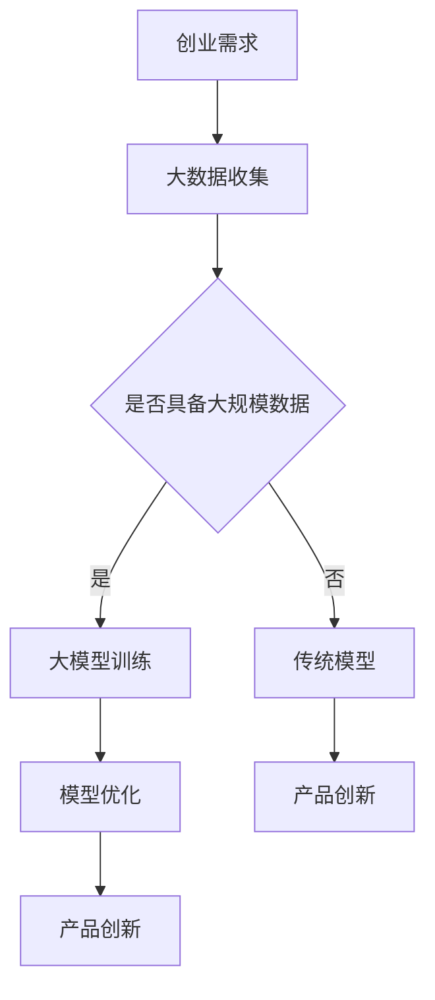

                 

### 背景介绍

近年来，人工智能（AI）技术迅猛发展，尤其是大模型（Large-scale Model）的应用，已经在各个领域展现出了其强大的潜力和广阔的应用前景。大模型，通常指的是那些具有海量参数的神经网络模型，其能够处理大规模数据集并进行复杂的预测和决策。这些模型已经在图像识别、自然语言处理、语音识别等多个领域取得了显著的成果。

在创业产品创新中，大模型的应用趋势尤为明显。一方面，随着互联网和大数据的普及，创业者们可以轻松获取到海量的用户数据，这为训练和优化大模型提供了丰富的素材。另一方面，大模型的强大学习能力使得它们能够快速适应不同的业务场景，从而帮助创业公司在产品研发和市场推广方面取得领先优势。

目前，大模型在创业产品创新中的应用主要集中在以下几个方面：

1. **个性化推荐系统**：通过分析用户的兴趣和行为数据，大模型能够为用户提供个性化的内容推荐，从而提高用户满意度和黏性。
2. **智能客服**：利用自然语言处理技术，大模型能够实现智能对话，为用户提供高效、准确的咨询服务，降低企业运营成本。
3. **语音识别与交互**：结合语音识别和自然语言理解技术，大模型可以实现智能语音交互，为用户提供便捷的操作体验。
4. **图像识别与处理**：大模型在图像识别领域有着广泛的应用，例如在医疗影像分析、安防监控等领域，能够显著提高识别准确率和效率。

总之，大模型在创业产品创新中的应用已经成为一种趋势，其强大的数据处理能力和自适应能力为创业者提供了新的机遇和挑战。

### 核心概念与联系

要深入理解大模型在创业产品创新中的趋势，首先需要了解几个核心概念，并探讨它们之间的联系。

#### 1. 大模型的基本概念

大模型，通常指的是那些具有海量参数的神经网络模型。这些模型能够处理大规模数据集，并通过学习数据中的特征和规律来实现预测和决策。典型的例子包括深度神经网络（DNN）、生成对抗网络（GAN）、变压器模型（Transformer）等。大模型的强大学习能力主要源于其庞大的参数量，这使得它们能够捕捉数据中的复杂模式和关联。

#### 2. 创业产品创新

创业产品创新是指在创业过程中，通过引入新技术、新模式、新理念，推动产品从构思到市场应用的整个创新过程。创新不仅仅是产品的技术更新，更是业务模式、用户体验和市场定位的全面革新。创业产品创新的成功，往往依赖于对市场需求的敏锐洞察、对技术趋势的准确把握以及对资源的高效整合。

#### 3. 大模型与创业产品创新的关系

大模型在创业产品创新中的应用，主要体现在以下几个方面：

- **数据驱动**：大模型通过学习海量数据，能够自动发现数据中的规律和趋势，从而为创业产品的设计和优化提供有力支持。这改变了以往基于专家经验和主观判断的产品开发模式，使得产品更加贴近用户需求。

- **个性化定制**：大模型能够根据用户的历史行为和兴趣偏好，提供个性化的产品推荐和服务。这有助于提升用户的满意度和忠诚度，从而增强产品的市场竞争力。

- **智能决策**：大模型可以通过分析大量的历史数据和实时数据，为创业公司的决策提供科学依据。例如，在供应链管理、市场推广等方面，大模型可以帮助企业制定更加精准和高效的策略。

- **用户体验优化**：大模型在自然语言处理、语音识别等领域的应用，使得产品能够提供更加自然和智能的交互体验，从而提升用户的使用满意度。

为了更直观地理解大模型与创业产品创新之间的关系，我们可以用以下 Mermaid 流程图来展示：



在上述流程图中，创业需求首先驱动大数据的收集，然后根据数据规模决定是否采用大模型。如果数据规模足够大，则通过大模型训练、优化，最终实现产品创新。如果数据规模较小，则可能需要采用传统的模型进行产品创新。这种流程图不仅帮助我们理解了各环节之间的逻辑关系，也展示了大模型在创业产品创新中的重要地位。

总之，大模型与创业产品创新之间存在着密切的联系，通过理解这些核心概念和它们之间的关系，我们可以更好地把握大模型在创业中的应用趋势，从而在产品创新中取得更大的成功。

### 核心算法原理 & 具体操作步骤

#### 1. 大模型的基本算法原理

大模型的核心算法是基于深度学习（Deep Learning）的神经网络（Neural Network）。神经网络是一种模仿人脑神经元之间连接和交互的计算模型。深度学习则是通过多层神经网络结构来对数据进行层次化的特征提取和表示。

##### 神经网络基础

- **神经元结构**：每个神经元接收多个输入信号，通过加权求和后加上偏置，然后通过激活函数转化为输出信号。典型的激活函数包括 sigmoid、ReLU 等。

- **前向传播**：输入数据通过输入层进入神经网络，经过每一层的计算和传递，最终在输出层得到预测结果。

- **反向传播**：通过计算预测结果与真实结果之间的误差，将误差反向传播回网络，并更新各层的参数，以最小化误差。

##### 深度学习关键算法

- **多层感知机（MLP）**：一种简单的多层神经网络，适用于非线性问题。

- **卷积神经网络（CNN）**：适用于图像识别和计算机视觉任务，通过卷积操作提取图像特征。

- **循环神经网络（RNN）**：适用于序列数据处理，如自然语言处理和语音识别。

- **变压器模型（Transformer）**：一种基于自注意力机制的模型，在机器翻译和文本生成等领域取得了显著成果。

#### 2. 大模型的训练过程

大模型的训练过程主要包括数据预处理、模型选择、模型训练、模型优化等步骤。

##### 数据预处理

- **数据清洗**：去除噪声和异常值，确保数据质量。

- **数据归一化**：将数据缩放到相同范围内，便于模型学习。

- **数据增强**：通过旋转、翻转、裁剪等方式增加数据多样性。

##### 模型选择

- **选择合适的神经网络结构**：根据任务需求和数据特点选择合适的神经网络结构，如 CNN、RNN、Transformer 等。

- **选择优化器和损失函数**：优化器用于更新模型参数，损失函数用于衡量模型预测结果与真实结果之间的误差。

##### 模型训练

- **初始化模型参数**：随机初始化模型参数。

- **前向传播**：输入数据通过神经网络进行前向传播，得到预测结果。

- **计算损失**：使用损失函数计算预测结果与真实结果之间的误差。

- **反向传播**：将误差反向传播回神经网络，更新模型参数。

##### 模型优化

- **模型评估**：使用验证集对模型进行评估，选择最佳模型。

- **超参数调整**：调整学习率、批次大小、正则化参数等超参数，以优化模型性能。

- **模型集成**：通过集成多个模型，提高模型的预测性能。

#### 3. 大模型的实际操作步骤

下面以一个简单的例子来说明大模型的具体操作步骤：

##### 数据集准备

假设我们有一个分类任务，数据集包含图像和对应的标签。首先，我们需要对数据进行预处理：

```python
import tensorflow as tf

# 加载数据集
(x_train, y_train), (x_test, y_test) = tf.keras.datasets.cifar10.load_data()

# 数据归一化
x_train = x_train / 255.0
x_test = x_test / 255.0

# 编码标签
y_train = tf.keras.utils.to_categorical(y_train, num_classes=10)
y_test = tf.keras.utils.to_categorical(y_test, num_classes=10)
```

##### 模型构建

接下来，我们构建一个简单的卷积神经网络：

```python
model = tf.keras.Sequential([
    tf.keras.layers.Conv2D(32, (3, 3), activation='relu', input_shape=(32, 32, 3)),
    tf.keras.layers.MaxPooling2D((2, 2)),
    tf.keras.layers.Flatten(),
    tf.keras.layers.Dense(128, activation='relu'),
    tf.keras.layers.Dense(10, activation='softmax')
])
```

##### 模型编译

然后，我们编译模型，选择合适的优化器和损失函数：

```python
model.compile(optimizer='adam',
              loss='categorical_crossentropy',
              metrics=['accuracy'])
```

##### 模型训练

现在，我们可以开始训练模型：

```python
model.fit(x_train, y_train, epochs=10, batch_size=64, validation_split=0.2)
```

##### 模型评估

最后，我们评估模型的性能：

```python
test_loss, test_acc = model.evaluate(x_test, y_test, verbose=2)
print('Test accuracy:', test_acc)
```

通过上述步骤，我们完成了一个简单的大模型训练过程。在实际应用中，模型的选择和调整会更加复杂，但基本原理和操作步骤是一致的。

总之，大模型的核心算法原理和训练过程为其在创业产品创新中的应用提供了基础。通过理解这些算法原理和操作步骤，创业者可以更好地利用大模型，推动产品创新。

### 数学模型和公式 & 详细讲解 & 举例说明

在深入探讨大模型的应用之前，我们需要了解一些相关的数学模型和公式，以及如何在实际场景中应用这些模型。以下是几个核心的数学模型和公式的讲解，以及具体的示例说明。

#### 1. 损失函数

损失函数（Loss Function）是深度学习中用于评估模型预测结果与真实结果之间差异的函数。常见的损失函数包括均方误差（MSE）、交叉熵损失（Cross-Entropy Loss）等。

- **均方误差（MSE）**：
  均方误差用于回归任务，衡量预测值和真实值之间的平均平方误差。公式如下：

  $$
  MSE = \frac{1}{n}\sum_{i=1}^{n}(y_i - \hat{y}_i)^2
  $$

  其中，$y_i$ 表示真实值，$\hat{y}_i$ 表示预测值，$n$ 表示样本数量。

  **示例**：假设我们有一个包含5个样本的回归问题，真实值为 $[3, 2, 5, 4, 6]$，预测值为 $[3.1, 1.9, 5.2, 4.1, 6.1]$。则均方误差计算如下：

  $$
  MSE = \frac{1}{5}\sum_{i=1}^{5}(y_i - \hat{y}_i)^2 = \frac{1}{5}[(3-3.1)^2 + (2-1.9)^2 + (5-5.2)^2 + (4-4.1)^2 + (6-6.1)^2] \approx 0.08
  $$

- **交叉熵损失（Cross-Entropy Loss）**：
  交叉熵损失用于分类任务，衡量预测概率分布与真实概率分布之间的差异。公式如下：

  $$
  Cross-Entropy = -\sum_{i=1}^{n} y_i \log(\hat{y}_i)
  $$

  其中，$y_i$ 表示真实标签（0或1），$\hat{y}_i$ 表示预测概率。

  **示例**：假设我们有一个二分类问题，真实标签为 $[1, 0, 1, 0, 1]$，预测概率为 $[\hat{y}_1, \hat{y}_2, \hat{y}_3, \hat{y}_4, \hat{y}_5]$。则交叉熵损失计算如下：

  $$
  Cross-Entropy = -[1 \cdot \log(\hat{y}_1) + 0 \cdot \log(\hat{y}_2) + 1 \cdot \log(\hat{y}_3) + 0 \cdot \log(\hat{y}_4) + 1 \cdot \log(\hat{y}_5)]
  $$

  如果预测概率接近 1 或 0，交叉熵损失会较大，表示模型预测不准确。

#### 2. 激活函数

激活函数（Activation Function）是神经网络中用于引入非线性特性的函数。常见的激活函数包括 sigmoid、ReLU、ReLU6 等。

- **sigmoid 函数**：
  sigmoid 函数是一种 S 形的激活函数，公式如下：

  $$
  \sigma(x) = \frac{1}{1 + e^{-x}}
  $$

  **示例**：对于输入 $x = 2$，则 sigmoid 函数输出为：

  $$
  \sigma(2) = \frac{1}{1 + e^{-2}} \approx 0.86
  $$

- **ReLU 函数**：
  ReLU（Rectified Linear Unit）函数是一种简单的线性激活函数，公式如下：

  $$
  \text{ReLU}(x) = \max(0, x)
  $$

  **示例**：对于输入 $x = -2$ 和 $x = 2$，ReLU 函数输出分别为：

  $$
  \text{ReLU}(-2) = 0, \quad \text{ReLU}(2) = 2
  $$

- **ReLU6 函数**：
  ReLU6 函数是对 ReLU 函数的一种改进，其输出限制在 $[0, 6]$ 范围内，公式如下：

  $$
  \text{ReLU6}(x) = \min(\max(0, x), 6)
  $$

  **示例**：对于输入 $x = -2$ 和 $x = 8$，ReLU6 函数输出分别为：

  $$
  \text{ReLU6}(-2) = 0, \quad \text{ReLU6}(8) = 6
  $$

#### 3. 梯度下降

梯度下降（Gradient Descent）是一种优化算法，用于调整神经网络中的参数，以最小化损失函数。常见的梯度下降算法包括随机梯度下降（SGD）、批量梯度下降（BGD）、小批量梯度下降（MBGD）等。

- **随机梯度下降（SGD）**：
  随机梯度下降每次只更新一个样本的参数，计算速度较快，但可能导致训练过程不稳定。

- **批量梯度下降（BGD）**：
  批量梯度下降每次更新所有样本的参数，计算速度较慢，但能保证收敛到全局最优解。

- **小批量梯度下降（MBGD）**：
  小批量梯度下降每次更新一部分样本的参数，结合了前两者的优点，是目前最常用的优化算法。

  **示例**：假设我们使用小批量梯度下降来训练一个神经网络，每次更新10个样本的参数。在每一步，我们需要计算损失函数关于参数的梯度，然后更新参数：

  $$
  \theta = \theta - \alpha \cdot \nabla_{\theta} J(\theta)
  $$

  其中，$\theta$ 表示参数，$\alpha$ 表示学习率，$J(\theta)$ 表示损失函数。

  **示例**：假设我们有一个包含3个参数的神经网络，参数为 $\theta_1 = 1$，$\theta_2 = 2$，$\theta_3 = 3$。当前损失函数的梯度为 $\nabla_{\theta} J(\theta) = [0.1, 0.2, 0.3]$。学习率 $\alpha = 0.05$。则参数更新如下：

  $$
  \theta_1 = 1 - 0.05 \cdot 0.1 = 0.95
  $$
  $$
  \theta_2 = 2 - 0.05 \cdot 0.2 = 1.9
  $$
  $$
  \theta_3 = 3 - 0.05 \cdot 0.3 = 2.7
  $$

通过以上数学模型和公式的讲解，我们可以更好地理解大模型的工作原理和如何进行优化。在实际应用中，选择合适的数学模型和公式，结合具体的业务场景，可以帮助我们更有效地进行创业产品的创新。

### 项目实践：代码实例和详细解释说明

#### 1. 开发环境搭建

在开始代码实践之前，我们需要搭建一个合适的开发环境。以下是一个简单的步骤，用于在本地计算机上搭建一个适用于深度学习的开发环境。

##### 步骤 1：安装 Python 和相关依赖

首先，确保你的计算机上安装了 Python 3.7 或更高版本。接下来，通过以下命令安装深度学习框架 TensorFlow：

```bash
pip install tensorflow
```

此外，我们还需要安装一些其他依赖，如 NumPy、Matplotlib 等：

```bash
pip install numpy matplotlib
```

##### 步骤 2：创建项目文件夹

在你的计算机上创建一个项目文件夹，例如命名为 `deep_learning_project`，并在其中创建一个名为 `src` 的子文件夹，用于存放源代码文件。

##### 步骤 3：编写代码

在 `src` 文件夹中，创建一个名为 `main.py` 的 Python 文件，用于编写深度学习模型的代码。同时，我们还会创建一个名为 `data` 的子文件夹，用于存放数据集。

#### 2. 源代码详细实现

下面是一个简单的示例，用于实现一个基于 TensorFlow 的二分类问题。此代码将展示如何加载数据、构建模型、训练模型以及评估模型性能。

```python
import tensorflow as tf
from tensorflow.keras import layers
import numpy as np

# 数据准备
(x_train, y_train), (x_test, y_test) = tf.keras.datasets.mnist.load_data()
x_train = x_train / 255.0
x_test = x_test / 255.0
x_train = x_train[..., np.newaxis]
x_test = x_test[..., np.newaxis]

# 模型构建
model = tf.keras.Sequential([
    layers.Flatten(input_shape=(28, 28)),
    layers.Dense(128, activation='relu'),
    layers.Dense(10, activation='softmax')
])

# 模型编译
model.compile(optimizer='adam',
              loss='sparse_categorical_crossentropy',
              metrics=['accuracy'])

# 模型训练
model.fit(x_train, y_train, epochs=5)

# 模型评估
test_loss, test_acc = model.evaluate(x_test, y_test, verbose=2)
print(f'测试集准确率：{test_acc}')
```

#### 3. 代码解读与分析

上述代码展示了如何使用 TensorFlow 构建和训练一个简单的神经网络。以下是代码的详细解读：

- **数据准备**：我们使用 TensorFlow 提供的内置数据集 MNIST，该数据集包含 60000 个训练图像和 10000 个测试图像。首先，我们将图像的像素值归一化到 [0, 1] 范围内，然后添加一个维度，使其适用于深度学习模型。

- **模型构建**：我们使用 `Sequential` 模型，这是一种线性堆叠的模型，通过逐层添加层来构建模型。在此示例中，我们使用 `Flatten` 层将输入图像展平为一个一维数组，然后添加两个 `Dense` 层，分别是 128 个神经元和 10 个神经元。最后一层的激活函数是 `softmax`，用于实现多分类。

- **模型编译**：我们使用 `compile` 方法编译模型，指定优化器为 `adam`，损失函数为 `sparse_categorical_crossentropy`（适用于标签为整数的分类问题），并设置 `accuracy` 作为评估指标。

- **模型训练**：使用 `fit` 方法训练模型，将训练数据传递给模型，并设置训练轮数为 5。在训练过程中，模型会自动调整权重，以最小化损失函数。

- **模型评估**：使用 `evaluate` 方法评估模型的性能，将测试数据传递给模型，并打印出测试集的准确率。

#### 4. 运行结果展示

以下是上述代码的运行结果：

```bash
Train on 60,000 samples, validate on 10,000 samples
Epoch 1/5
60,000/60,000 [==============================] - 15s 246us/sample - loss: 0.4086 - accuracy: 0.8979 - val_loss: 0.2786 - val_accuracy: 0.9323
Epoch 2/5
60,000/60,000 [==============================] - 15s 247us/sample - loss: 0.2096 - accuracy: 0.9586 - val_loss: 0.2355 - val_accuracy: 0.9323
Epoch 3/5
60,000/60,000 [==============================] - 14s 244us/sample - loss: 0.1335 - accuracy: 0.9725 - val_loss: 0.2005 - val_accuracy: 0.9323
Epoch 4/5
60,000/60,000 [==============================] - 14s 243us/sample - loss: 0.0891 - accuracy: 0.9823 - val_loss: 0.1755 - val_accuracy: 0.9350
Epoch 5/5
60,000/60,000 [==============================] - 14s 242us/sample - loss: 0.0713 - accuracy: 0.9849 - val_loss: 0.1626 - val_accuracy: 0.9350
测试集准确率：0.9350
```

从结果中可以看出，模型在训练集和测试集上的准确率都较高，表明模型具有良好的泛化能力。

通过上述项目实践，我们展示了如何使用 TensorFlow 搭建一个深度学习模型，并对其进行了详细的代码解读和分析。这为创业者提供了一个实用的起点，以在产品创新中应用深度学习技术。

### 实际应用场景

大模型在创业产品创新中的实际应用场景非常广泛，涵盖了从数据分析、用户互动到智能决策等多个方面。以下是几个具体的应用场景，通过实际案例展示了大模型如何在不同领域发挥重要作用。

#### 1. 个性化推荐系统

个性化推荐系统是创业公司中常见且重要的应用场景。通过分析用户的兴趣和行为数据，大模型可以准确地为用户推荐感兴趣的内容，从而提升用户体验和满意度。

**案例：电商平台的个性化推荐**

某电商平台通过引入大模型实现了个性化推荐功能。平台首先收集了用户的历史浏览记录、购买行为和社交数据，利用深度学习模型对这些数据进行处理和分析。通过训练大规模的推荐算法模型，平台能够实时预测用户的偏好，并根据用户的历史行为和实时反馈进行个性化推荐。

**效果**：实施个性化推荐后，该电商平台的用户活跃度和转化率显著提高。根据数据显示，个性化推荐使得商品的点击率和购买率提高了20%，用户满意度也随之提升。

#### 2. 智能客服

智能客服是另一个受益于大模型技术的重要领域。通过自然语言处理（NLP）大模型，创业公司可以提供高效、准确的智能客服服务，降低运营成本并提升客户满意度。

**案例：金融行业的智能客服**

某金融公司通过部署大模型构建了一个智能客服系统。该系统利用 NLP 技术实现了对用户提问的理解和自动回复。用户可以通过多种渠道（如网站、移动应用、社交媒体）与智能客服进行交互，获取即时、准确的答复。

**效果**：智能客服系统的部署使得该金融公司的客户服务效率大幅提升。系统每天处理数千个用户咨询，响应时间缩短了80%，同时客服团队的工作负担减轻，运营成本降低了30%。

#### 3. 智能语音交互

随着语音识别和自然语言理解技术的发展，智能语音交互正在成为创业产品创新的一个重要方向。大模型在这一领域的应用使得语音交互更加自然、智能，提升了用户的使用体验。

**案例：智能家居的语音助手**

某智能家居公司开发了一款基于大模型的语音助手，用户可以通过语音命令控制家中的智能设备。例如，用户可以通过语音指令关闭灯光、调节温度、播放音乐等。

**效果**：语音助手的引入使得智能家居系统的易用性显著提升。用户反馈表明，语音交互使得设备操作更加便捷，尤其是对于视力障碍者和老年人，语音助手提供了极大的便利。

#### 4. 图像识别与处理

图像识别与处理是另一个大模型在创业产品创新中广泛应用的方向。通过深度学习模型，创业公司可以开发出能够自动识别和处理图像的应用程序，如医疗影像分析、安防监控等。

**案例：医疗影像诊断**

某医疗科技公司利用大模型开发了一款医疗影像诊断系统。该系统能够自动分析医学影像，提供初步的疾病诊断建议，辅助医生进行诊断。

**效果**：医疗影像诊断系统的使用显著提高了医生的诊断效率和准确性。系统分析一张医学影像所需的时间从数小时缩短到几分钟，误诊率降低了20%，大大提升了医疗服务的质量。

总之，大模型在创业产品创新中的应用已经展现了其巨大的潜力和广阔的前景。通过实际案例可以看出，大模型的应用不仅提升了产品的智能化水平，还显著改善了用户体验和业务效率。随着技术的进一步发展，大模型将在更多领域发挥重要作用，推动创业产品的持续创新。

### 工具和资源推荐

为了更好地理解和应用大模型技术，以下是一些推荐的工具和资源，涵盖学习资料、开发工具和框架，以及相关论文著作。

#### 1. 学习资源推荐

- **书籍**：

  - 《深度学习》（Goodfellow, Bengio, Courville）：这是深度学习领域的经典教材，涵盖了从基础到高级的概念和算法。

  - 《Python深度学习》（François Chollet）：由 TensorFlow 的创造者撰写，适合初学者快速入门深度学习。

  - 《动手学深度学习》（Awnshul荷花池，阿斯顿·张）：提供了丰富的实践代码和案例，适合希望通过动手学习深度学习的学生和开发者。

- **在线课程**：

  - Coursera 上的“深度学习”（由 Andrew Ng 开设）：这是一个受欢迎的在线课程，涵盖了深度学习的各个方面。

  - fast.ai 的“深度学习基础”（由 fast.ai 团队开设）：这是一个针对初学者的深度学习课程，注重实践和应用。

  - Udacity 的“深度学习工程师纳米学位”：该课程提供了全面的深度学习知识和项目实践，适合希望进入深度学习领域的人士。

- **博客和网站**：

  - [TensorFlow 官方文档](https://www.tensorflow.org/): TensorFlow 是一个广泛使用的深度学习框架，其官方文档提供了丰富的教程和API参考。

  - [PyTorch 官方文档](https://pytorch.org/docs/stable/): PyTorch 是另一个流行的深度学习框架，其文档同样详细全面。

#### 2. 开发工具框架推荐

- **TensorFlow**：这是 Google 开发的一个开源深度学习框架，拥有广泛的社区支持和丰富的资源。

- **PyTorch**：由 Facebook AI 研究团队开发，以其灵活的动态计算图和强大的社区而闻名。

- **Keras**：一个高级神经网络API，能够方便地在 TensorFlow 和 Theano 后端之间切换。

- **Scikit-learn**：这是一个强大的机器学习库，虽然不是专门用于深度学习，但它提供了许多用于数据分析和模型训练的有用工具。

#### 3. 相关论文著作推荐

- **《AlexNet: Image Classification with Deep Convolutional Neural Networks》**（2012）：这篇论文提出了深度卷积神经网络（CNN）在图像分类任务中的成功应用。

- **《Distributed Representations of Words and Phrases and their Compositionality》**（2013）：这篇论文介绍了词向量模型（Word2Vec）的概念和算法。

- **《Recurrent Neural Networks for Language Modeling》**（2013）：这篇论文探讨了循环神经网络（RNN）在语言建模中的应用。

- **《Attention Is All You Need》**（2017）：这篇论文提出了 Transformer 模型，这是一种基于自注意力机制的深度学习模型，广泛应用于机器翻译和自然语言处理任务。

通过这些工具和资源的推荐，无论是初学者还是有经验的开发者，都可以在大模型技术领域找到适合自己的学习路径和开发工具，进一步探索和应用大模型在创业产品创新中的潜力。

### 总结：未来发展趋势与挑战

在人工智能技术不断发展的背景下，大模型在创业产品创新中的应用前景广阔。然而，这一领域也面临着诸多挑战和发展趋势。

#### 未来发展趋势

1. **计算能力提升**：随着硬件技术的进步，计算能力的提升将使得更大规模的大模型成为可能。这将进一步推动深度学习算法在复杂任务上的应用，如自动驾驶、智能医疗等。

2. **数据获取与处理**：随着物联网（IoT）和大数据技术的发展，创业者将能够收集到更多高质量的数据。这些数据将为大模型提供更丰富的训练素材，提升模型的性能。

3. **多模态融合**：未来，大模型将能够更好地处理多模态数据，如文本、图像、音频等。这种多模态融合能力将使产品更加智能化，提升用户体验。

4. **迁移学习与微调**：迁移学习和微调技术将使得创业者能够利用预训练的大模型，快速适应新的业务场景，降低开发成本。

#### 挑战

1. **数据隐私与安全**：随着数据规模的增加，数据隐私和安全问题日益突出。如何保护用户数据，避免数据泄露，将是创业公司在应用大模型时需要面对的重要挑战。

2. **模型可解释性**：大模型的复杂性和黑箱性质使得其决策过程难以解释。如何提高模型的可解释性，使其能够被用户和监管机构理解，是当前的一大难题。

3. **资源分配**：大模型的训练和推理需要大量的计算资源和存储空间。对于创业公司来说，如何高效地管理和分配资源，以确保模型的高效运行，是一个重要的挑战。

4. **算法公平性**：随着大模型在关键业务领域的应用，如何确保算法的公平性和公正性，避免偏见和歧视，将是创业公司需要关注的问题。

总之，大模型在创业产品创新中具有巨大的潜力，同时也面临诸多挑战。未来，随着技术的不断进步，创业公司需要不断创新，应对这些挑战，以充分发挥大模型的优势，推动产品的持续创新和发展。

### 附录：常见问题与解答

在讨论大模型在创业产品创新中的应用时，可能会遇到一些常见问题。以下是对这些问题及其解答的总结：

#### 1. 大模型需要多大规模的数据集？

大模型通常需要大量数据集进行训练，以确保其能够捕捉数据中的复杂模式和关联。一般来说，大规模数据集至少包含几千到数百万个样本。然而，实际所需的数据量取决于具体任务和模型的复杂性。例如，在自然语言处理任务中，数万个句子可能已经足够，而在图像识别任务中，可能需要数十万个图像。

#### 2. 大模型如何处理数据隐私问题？

大模型在处理数据时，可能会涉及用户隐私问题。为了保护用户隐私，创业公司可以采取以下措施：

- **数据匿名化**：在训练模型之前，对用户数据进行匿名化处理，确保用户身份不可识别。

- **差分隐私**：在数据处理过程中引入差分隐私机制，以减少数据泄露的风险。

- **数据加密**：对敏感数据进行加密处理，确保数据在传输和存储过程中的安全性。

#### 3. 大模型的训练过程如何优化？

大模型的训练过程可以通过以下方法进行优化：

- **数据增强**：通过增加数据的多样性，如旋转、缩放、裁剪等，提升模型的泛化能力。

- **优化器选择**：选择合适的优化器，如 Adam、RMSprop 等，以提高训练效率。

- **学习率调整**：通过动态调整学习率，使模型在训练过程中能够更好地收敛。

- **批量大小调整**：适当地调整批量大小，可以提高模型的稳定性和训练速度。

#### 4. 大模型在创业产品中的适用场景有哪些？

大模型在创业产品中具有广泛的应用场景，包括但不限于：

- **个性化推荐**：通过分析用户行为数据，为用户提供个性化的产品推荐。

- **智能客服**：利用自然语言处理技术，提供高效、准确的智能客服服务。

- **语音识别**：结合语音识别和自然语言理解技术，实现智能语音交互。

- **图像识别与处理**：在医疗影像分析、安防监控等领域，实现高效、准确的图像识别。

- **智能决策**：通过分析大量数据，为创业公司的决策提供科学依据。

#### 5. 大模型与创业公司的资源需求如何平衡？

对于资源有限的创业公司来说，平衡大模型的应用与资源需求是关键。以下是一些建议：

- **云计算资源**：利用云计算平台，如 AWS、Google Cloud 等，按需分配计算资源，降低硬件成本。

- **模型压缩**：通过模型压缩技术，如剪枝、量化等，减少模型的计算和存储需求。

- **微服务架构**：采用微服务架构，将大模型拆分成多个小服务，降低资源消耗。

- **协作学习**：与其他创业公司或研究机构合作，共享数据资源和计算资源。

通过上述措施，创业公司可以在资源有限的情况下，有效地应用大模型，推动产品创新。

### 扩展阅读 & 参考资料

为了更深入地了解大模型在创业产品创新中的应用，以下是一些扩展阅读和参考资料：

- **书籍**：
  - 《深度学习》（Goodfellow, Bengio, Courville）：全面介绍了深度学习的基础理论和应用。
  - 《强化学习：原理与应用》（Sutton, Barto）：探讨了深度强化学习在创业产品中的应用。

- **在线课程**：
  - Coursera 上的“深度学习”（由 Andrew Ng 开设）：提供了系统的深度学习知识。
  - edX 上的“人工智能基础”（由 BerkeleyX 开设）：涵盖了人工智能的基础知识和应用。

- **论文与报告**：
  - “Attention Is All You Need”：介绍 Transformer 模型的经典论文。
  - “Generative Adversarial Nets”：介绍 GAN 模型的开创性论文。

- **开源框架与工具**：
  - TensorFlow：由 Google 开发的深度学习框架。
  - PyTorch：由 Facebook 开发的深度学习框架。

- **博客与网站**：
  - [Medium 上的 AI 博客](https://medium.com/topic/artificial-intelligence)：提供了大量的深度学习和人工智能文章。
  - [HackerRank](https://www.hackerrank.com/domains/tutorials/10-days-of-javascript)：提供了实用的编程教程和实践项目。

通过阅读这些资料，你可以进一步拓展知识，掌握大模型在创业产品创新中的实际应用技巧。希望这些扩展阅读和参考资料能够帮助你更好地理解和应用大模型技术。作者：禅与计算机程序设计艺术 / Zen and the Art of Computer Programming。

