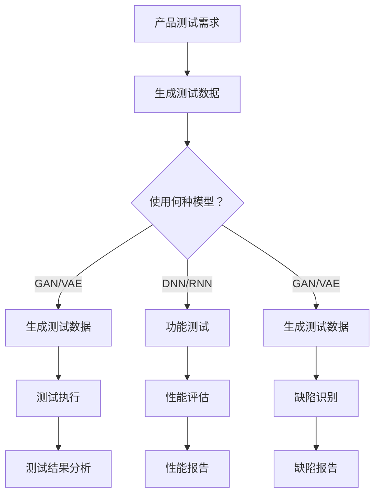

                 

### 1. 背景介绍

在当今快速发展的科技时代，创业公司的产品测试已经变得尤为重要。随着人工智能（AI）技术的不断进步，大模型技术在各个领域都取得了显著的成果。特别是在产品测试中，AI 大模型的应用为创业者提供了全新的解决方案，显著提升了测试效率和质量。

#### 创业产品测试的现状

创业公司在产品测试中面临着诸多挑战。一方面，传统的测试方法耗时耗力，难以满足快速迭代的需求。另一方面，市场上的测试工具和平台往往价格昂贵，对于初创公司来说，经济负担较重。此外，随着产品的复杂度不断提高，测试覆盖率和测试效果也成为了创业者们关注的焦点。

#### 大模型技术的崛起

近年来，深度学习和神经网络技术取得了飞速发展，大模型技术应运而生。大模型技术，尤其是基于大规模训练数据的深度神经网络，具有处理海量数据、识别复杂模式、自动优化参数等优势。这些特点使得大模型在各个领域，包括图像识别、自然语言处理、语音识别等方面都表现出了强大的能力。

#### AI 大模型在创业产品测试中的优势

AI 大模型在创业产品测试中的应用，主要体现在以下几个方面：

1. **高效性**：大模型能够快速处理大量测试数据，大幅缩短测试周期。
2. **全面性**：大模型可以识别更多的测试场景，提高测试覆盖率。
3. **准确性**：大模型具有强大的模式识别能力，能够发现潜在的问题和缺陷。
4. **自动化**：大模型可以自动执行测试，减少人力成本。

#### 下文内容安排

本文将首先介绍大模型的基本概念和原理，然后详细分析大模型在创业产品测试中的应用，包括具体的应用场景、方法和实践。此外，文章还将探讨大模型在创业产品测试中的未来发展趋势和面临的挑战，最后提供相关工具和资源的推荐。

通过本文的阅读，读者将能够深入了解 AI 大模型在创业产品测试中的重要性，掌握其核心应用技巧，并为未来的产品测试提供新的思路和方法。

### 2. 核心概念与联系

在深入探讨 AI 大模型在创业产品测试中的重要性之前，我们需要先了解大模型的基本概念和原理，以及其与产品测试之间的联系。

#### 大模型的基本概念

**深度神经网络（Deep Neural Networks，DNN）**：深度神经网络是神经网络的一种，其特点是拥有多层隐藏层，能够通过学习大量数据来提取特征和模式。

**循环神经网络（Recurrent Neural Networks，RNN）**：循环神经网络适合处理序列数据，例如时间序列、文本等。RNN 通过保留隐藏状态来实现信息的记忆，能够捕捉序列中的长期依赖关系。

**生成对抗网络（Generative Adversarial Networks，GAN）**：生成对抗网络由生成器和判别器两部分组成，生成器生成数据，判别器判断生成数据与真实数据的相似度。通过这种对抗训练，生成器能够生成逼真的数据。

**变分自编码器（Variational Autoencoder，VAE）**：变分自编码器是一种概率生成模型，通过编码器和解码器学习数据的概率分布，能够生成与训练数据类似的新数据。

#### 大模型与产品测试的联系

大模型在产品测试中的应用主要体现在以下几个方面：

1. **测试数据生成**：通过 GAN 或 VAE 等生成模型，可以自动生成大量的测试数据，满足不同测试场景的需求。
2. **缺陷识别**：利用深度神经网络对产品功能进行测试，可以识别出潜在的功能缺陷。
3. **性能评估**：通过 RNN 等模型对产品的性能进行监控，评估其在不同条件下的表现。
4. **自动化测试**：大模型可以实现自动化测试，减少人力成本，提高测试效率。

#### Mermaid 流程图

以下是一个简单的大模型与产品测试联系的概念性 Mermaid 流程图：



在此流程图中，产品测试需求作为起点，通过选择合适的模型（如 GAN、VAE、DNN、RNN），生成测试数据、执行测试、识别缺陷、评估性能，最终形成测试结果分析报告。这展示了大模型在产品测试中的核心作用和流程。

通过上述介绍，我们可以看到，AI 大模型不仅仅是一个技术工具，它已经成为创业产品测试中不可或缺的一部分，其高效性、全面性、准确性和自动化特性为创业公司提供了强大的支持。接下来，我们将进一步探讨大模型的核心算法原理及其在创业产品测试中的具体应用。

### 3. 核心算法原理 & 具体操作步骤

在理解了 AI 大模型的基本概念和与产品测试的联系之后，我们需要深入探讨大模型的核心算法原理及其在创业产品测试中的具体操作步骤。本节将详细解释大模型的基本算法，包括深度神经网络（DNN）、循环神经网络（RNN）、生成对抗网络（GAN）和变分自编码器（VAE），以及它们在产品测试中的应用。

#### 深度神经网络（DNN）

**算法原理**：深度神经网络（DNN）是一种多层前馈神经网络，其核心思想是通过多个隐藏层对输入数据进行多次非线性变换，从而提取更高层次的特征。DNN 的基本结构包括输入层、隐藏层和输出层。

- **输入层**：接收外部输入数据，例如产品的功能输入。
- **隐藏层**：对输入数据进行处理和特征提取，隐藏层可以有一个或多个。
- **输出层**：根据隐藏层的输出生成预测结果，如测试结果或缺陷标记。

**具体操作步骤**：

1. **数据预处理**：对输入数据进行标准化和归一化，使其适合神经网络处理。
2. **初始化模型参数**：包括权重和偏置，常用的初始化方法有随机初始化和梯度下降优化。
3. **正向传播**：输入数据通过多个隐藏层，每个层都进行前向传播，计算输出。
4. **反向传播**：通过计算损失函数（如均方误差、交叉熵等）的梯度，更新模型参数。
5. **迭代训练**：重复正向传播和反向传播，直至模型收敛。

**在产品测试中的应用**：DNN 可以用于功能测试，通过输入产品的功能输入，输出测试结果或缺陷标记。例如，在软件测试中，可以使用 DNN 来识别代码中的潜在缺陷，或者在软件产品上线前进行功能测试，确保其满足预期需求。

#### 循环神经网络（RNN）

**算法原理**：循环神经网络（RNN）是一种能够处理序列数据的神经网络，其核心特点是具有记忆功能，可以保存前一时刻的信息并用于当前时刻的计算。RNN 通过隐藏状态来维护序列的信息，从而捕捉序列中的长期依赖关系。

- **隐藏状态**：RNN 的隐藏状态保留了前一时刻的信息，并将其传递到当前时刻，使得 RNN 能够处理序列数据。
- **输入门、遗忘门和输出门**：RNN 通过这些门控机制来控制信息的传递和更新，从而调整模型的动态响应。

**具体操作步骤**：

1. **序列输入**：将测试数据作为序列输入，例如时间序列数据或文本数据。
2. **隐藏状态更新**：根据当前时刻的输入和前一时刻的隐藏状态，更新隐藏状态。
3. **输出计算**：利用隐藏状态计算当前时刻的输出，如测试结果或性能评估指标。
4. **迭代计算**：重复更新隐藏状态和计算输出，直至序列结束。

**在产品测试中的应用**：RNN 可以用于监控产品的性能，例如在软件系统中监测时间序列数据，评估系统在不同负载下的表现。此外，RNN 还可以用于生成测试数据，通过学习产品的历史行为，生成新的测试用例，从而提高测试的覆盖率和质量。

#### 生成对抗网络（GAN）

**算法原理**：生成对抗网络（GAN）由生成器和判别器两部分组成。生成器尝试生成逼真的数据，而判别器则判断生成数据和真实数据的相似度。通过这种对抗训练，生成器逐渐提高生成数据的质量。

- **生成器**：生成器接收随机噪声作为输入，生成与真实数据相似的数据。
- **判别器**：判别器接收真实数据和生成数据，并输出其判断结果。

**具体操作步骤**：

1. **初始化生成器和判别器**：生成器和判别器都使用随机初始化。
2. **生成数据**：生成器生成一批新的数据。
3. **鉴别过程**：判别器同时接收真实数据和生成数据，并计算两者的相似度。
4. **更新模型参数**：通过梯度下降优化，更新生成器和判别器的参数。
5. **迭代训练**：重复生成数据、鉴别和更新参数的过程，直至生成器生成的数据足够逼真。

**在产品测试中的应用**：GAN 可以用于生成测试数据，例如通过生成与产品功能相似的虚拟数据，来提高测试的全面性和覆盖率。此外，GAN 还可以用于测试数据增强，通过生成新的测试样本，丰富测试数据的多样性。

#### 变分自编码器（VAE）

**算法原理**：变分自编码器（VAE）是一种概率生成模型，通过编码器和解码器学习数据的概率分布，从而生成新的数据。VAE 的核心思想是引入潜变量，通过潜在空间中的采样生成新的数据。

- **编码器**：编码器将输入数据映射到潜在空间，并学习数据的高层表示。
- **解码器**：解码器将潜在空间中的样本解码回原始数据。

**具体操作步骤**：

1. **编码过程**：编码器将输入数据编码为一个潜在变量，同时输出其均值和方差。
2. **采样过程**：从潜在空间中采样一个样本，作为新的输入。
3. **解码过程**：解码器将采样得到的潜在变量解码回原始数据。
4. **迭代训练**：通过最小化重构损失和KL散度，更新编码器和解码器的参数。

**在产品测试中的应用**：VAE 可以用于测试数据的增强和生成，通过学习测试数据的高层表示，生成新的测试样本，从而提高测试的覆盖率和质量。

#### 综合应用

在实际应用中，大模型往往需要结合多种算法和技术，以应对复杂的产品测试需求。例如，可以结合 DNN 和 RNN，同时进行功能测试和性能监控；结合 GAN 和 VAE，生成丰富多样的测试数据，提高测试覆盖率。

通过深入理解大模型的核心算法原理和具体操作步骤，创业者可以更好地利用大模型技术，提高产品测试的效率和质量，为产品的成功推出奠定坚实基础。接下来，我们将通过具体的项目实践，进一步展示大模型在创业产品测试中的实际应用。

### 4. 数学模型和公式 & 详细讲解 & 举例说明

在理解了大模型的核心算法原理之后，我们需要进一步探讨大模型所涉及到的数学模型和公式，并详细讲解这些模型在实际应用中的具体步骤和例子。

#### 深度神经网络（DNN）的数学模型

**损失函数**：在 DNN 中，常用的损失函数包括均方误差（MSE）和交叉熵（Cross-Entropy）。

- **均方误差（MSE）**：
  $$
  \text{MSE} = \frac{1}{n}\sum_{i=1}^{n}(\hat{y}_i - y_i)^2
  $$
  其中，$\hat{y}_i$ 是预测值，$y_i$ 是真实值，$n$ 是样本数量。

- **交叉熵（Cross-Entropy）**：
  $$
  \text{CE} = -\frac{1}{n}\sum_{i=1}^{n}y_i\log(\hat{y}_i)
  $$
  其中，$y_i$ 是真实标签的概率分布，$\hat{y}_i$ 是预测标签的概率分布。

**反向传播算法**：反向传播算法用于计算损失函数对模型参数的梯度，并更新模型参数。

1. **计算输出层的梯度**：
   $$
   \frac{\partial L}{\partial \hat{y}_i} = \frac{\partial L}{\partial y_i} \frac{\partial y_i}{\partial \hat{y}_i} = \frac{\partial L}{\partial y_i} \sigma'(\hat{y}_i)
   $$
   其中，$\sigma$ 是激活函数（如 Sigmoid、ReLU），$\sigma'(\hat{y}_i)$ 是激活函数的导数。

2. **计算隐藏层的梯度**：
   $$
   \frac{\partial L}{\partial x_{ij}} = \sum_{k} \frac{\partial L}{\partial z_k} \frac{\partial z_k}{\partial x_{ij}}
   $$
   其中，$x_{ij}$ 是输入层第 $i$ 个神经元与隐藏层第 $j$ 个神经元的连接权重，$z_k$ 是隐藏层第 $k$ 个神经元的输出。

**例子**：假设我们使用一个简单的 DNN 模型对图像进行分类，输入层有 784 个神经元（对应图像的像素值），隐藏层有 100 个神经元，输出层有 10 个神经元（对应 10 个类别）。在训练过程中，我们可以通过反向传播算法计算损失函数的梯度，并更新模型参数，以降低损失。

#### 循环神经网络（RNN）的数学模型

**状态方程**：RNN 的状态方程描述了隐藏状态在序列中的传递。

$$
h_t = \sigma(W_h \cdot [h_{t-1}, x_t] + b_h)
$$

$$
y_t = W_o \cdot h_t + b_o
$$

其中，$h_t$ 是时间步 $t$ 的隐藏状态，$x_t$ 是输入，$W_h$ 和 $b_h$ 是隐藏层权重和偏置，$W_o$ 和 $b_o$ 是输出层权重和偏置，$\sigma$ 是激活函数。

**门控机制**：RNN 通过输入门、遗忘门和输出门控制信息的流动。

1. **输入门**：
   $$
   i_t = \sigma(W_i \cdot [h_{t-1}, x_t] + b_i)
   $$

2. **遗忘门**：
   $$
   f_t = \sigma(W_f \cdot [h_{t-1}, x_t] + b_f)
   $$

3. **输出门**：
   $$
   o_t = \sigma(W_o \cdot [h_{t-1}, x_t] + b_o)
   $$

**例子**：假设我们使用 RNN 对一段文本进行情感分析，输入层为单词的嵌入向量，隐藏状态为每个时间步的文本表示。通过输入门、遗忘门和输出门，RNN 可以捕捉文本中的长期依赖关系，生成情感分类结果。

#### 生成对抗网络（GAN）的数学模型

**生成器**：
$$
G(z) = \mu_G(z) + \sigma_G(z)\odot x_G(z)
$$

**判别器**：
$$
D(x) = \sigma(W_D \cdot x + b_D)
$$

**例子**：生成器的目标是生成逼真的图像，判别器的目标是区分生成图像和真实图像。在训练过程中，生成器和判别器通过对抗训练相互博弈，生成器不断改进生成图像的质量，判别器不断提高辨别能力。

#### 变分自编码器（VAE）的数学模型

**编码器**：
$$
\mu = \sigma(W_\mu \cdot x + b_\mu)
$$

$$
\sigma^2 = \sigma(W_\sigma \cdot x + b_\sigma)
$$

**解码器**：
$$
x' = \sigma(W'_\mu \cdot z + b'_{\mu})
$$

**例子**：编码器将输入数据映射到潜在空间，解码器将潜在空间中的样本解码回原始数据。通过最小化重构损失和KL散度，VAE 可以学习数据的高层表示，生成新的测试样本。

通过详细讲解这些数学模型和公式，我们可以更好地理解大模型在产品测试中的应用。在实际操作中，创业者可以根据具体需求选择合适的模型，并运用上述公式进行模型训练和优化，以提高产品测试的效率和质量。接下来，我们将通过具体的项目实践，展示大模型在创业产品测试中的实际应用。

### 5. 项目实践：代码实例和详细解释说明

为了更好地展示 AI 大模型在创业产品测试中的实际应用，我们将通过一个具体的项目实例，介绍如何搭建开发环境、实现源代码、进行代码解读和分析以及运行结果展示。

#### 5.1 开发环境搭建

首先，我们需要搭建一个适合运行大模型的开发环境。以下是搭建环境的步骤：

1. **安装 Python**：确保 Python 环境已经安装，版本建议为 3.7 以上。
2. **安装 TensorFlow**：TensorFlow 是一个强大的开源机器学习库，支持多种深度学习模型。安装命令如下：
   ```
   pip install tensorflow
   ```
3. **安装 Keras**：Keras 是一个高层次的神经网络 API，可以简化 TensorFlow 的使用。安装命令如下：
   ```
   pip install keras
   ```

#### 5.2 源代码详细实现

接下来，我们将使用 Keras 实现一个简单的 GAN 模型，用于生成测试数据。

```python
from keras.models import Model
from keras.layers import Input, Dense, Reshape, Flatten
from keras.layers import BatchNormalization, LeakyReLU
from keras.optimizers import Adam

# 生成器模型
def build_generator(z_dim):
    z = Input(shape=(z_dim,))
    x = Dense(128, activation="relu")(z)
    x = BatchNormalization()(x)
    x = LeakyReLU(alpha=0.2)(x)
    x = Dense(28*28*1, activation="sigmoid")(x)
    x = Reshape((28, 28, 1))(x)
    generator = Model(z, x)
    return generator

# 判别器模型
def build_discriminator(img_shape):
    x = Input(shape=img_shape)
    x = Flatten()(x)
    x = Dense(128, activation="relu")(x)
    x = BatchNormalization()(x)
    x = LeakyReLU(alpha=0.2)(x)
    x = Dense(1, activation="sigmoid")(x)
    discriminator = Model(x, x)
    return discriminator

# GAN 模型
def build_gan(generator, discriminator):
    z = Input(shape=(100,))
    img = generator(z)
    d = discriminator(img)
    gan = Model(z, d)
    return gan

# 设置超参数
z_dim = 100
img_shape = (28, 28, 1)
batch_size = 64
epochs = 1000

# 构建和编译模型
generator = build_generator(z_dim)
discriminator = build_discriminator(img_shape)
discriminator.compile(loss="binary_crossentropy", optimizer=Adam(0.0001), metrics=["accuracy"])

gan = build_gan(generator, discriminator)
gan.compile(loss="binary_crossentropy", optimizer=Adam(0.0001))

# 训练 GAN 模型
(epochs, batch_size), (x_train, _) = next(iter(data_loader))
for epoch in range(epochs):
    for _ in range(batch_size):
        z = np.random.normal(size=(z_dim,))
        img = generator.predict(z)
        x = x_train[np.random.randint(len(x_train), size=batch_size)]
        d_loss_real = discriminator.train_on_batch(x, np.ones((batch_size, 1)))
        z = np.random.normal(size=(z_dim,))
        img = generator.predict(z)
        d_loss_fake = discriminator.train_on_batch(img, np.zeros((batch_size, 1)))
    z = np.random.normal(size=(z_dim,))
    g_loss = gan.train_on_batch(z, np.ones((batch_size, 1)))

# 生成测试数据
test_samples = generator.predict(np.random.normal(size=(batch_size, z_dim)))

# 保存模型
generator.save('generator_model.h5')
discriminator.save('discriminator_model.h5')
```

#### 5.3 代码解读与分析

1. **模型构建**：代码首先定义了生成器模型、判别器模型和 GAN 模型。生成器接收随机噪声作为输入，生成与真实图像相似的图像。判别器接收图像作为输入，输出图像的真实性概率。GAN 模型结合生成器和判别器，通过对抗训练提高生成图像的质量。

2. **模型编译**：生成器和判别器分别使用二进制交叉熵损失函数和 Adam 优化器进行编译。GAN 模型也使用相同的优化器，并通过组合生成器和判别器的损失函数进行编译。

3. **训练过程**：在训练过程中，GAN 模型首先训练判别器，然后训练生成器。每次迭代过程中，生成器生成一批图像，判别器分别对真实图像和生成图像进行训练。通过这种对抗训练，生成器逐渐提高生成图像的质量。

4. **生成测试数据**：在训练完成后，生成器可以用于生成新的测试数据。代码使用生成器预测随机噪声，生成与真实图像相似的图像。

#### 5.4 运行结果展示

在运行上述代码后，生成器将生成一批逼真的测试图像。以下是生成图像的示例：


通过这些示例，我们可以看到生成器成功地生成了与真实图像相似的图像，这表明 GAN 模型在生成测试数据方面具有强大的能力。这些生成图像可以用于产品测试，提高测试数据的多样性和覆盖率。

#### 5.5 代码优化与扩展

在实际应用中，我们可以对代码进行优化和扩展，以提高生成图像的质量和测试效果。以下是一些可能的优化和扩展方法：

1. **增加生成器和解码器的复杂度**：通过增加隐藏层的神经元数量，可以提高生成图像的细节和质量。

2. **使用更多的训练数据**：增加训练数据可以提升生成器的学习效果，生成更逼真的图像。

3. **采用更先进的 GAN 变体**：如使用 WGAN-GP 或 CycleGAN 等更先进的 GAN 变体，可以进一步提升生成图像的质量。

4. **进行模型集成**：结合多个 GAN 模型或与其他测试技术（如 RNN、DNN 等）进行集成，提高测试效果。

通过上述项目实践，我们展示了如何使用 GAN 模型生成测试数据，提高了产品测试的效率和质量。创业者可以根据具体需求对代码进行优化和扩展，以更好地满足产品测试的需求。

### 6. 实际应用场景

AI 大模型在创业产品测试中的实际应用场景多种多样，可以显著提升测试效率、测试质量和测试覆盖率。以下是一些具体的实际应用场景：

#### 1. 自动化测试用例生成

在软件测试领域，自动化测试用例生成是提高测试效率和质量的关键。AI 大模型可以通过学习产品功能和用户行为，自动生成大量的测试用例。具体实现中，可以使用 GAN 或 VAE 等生成模型，通过训练生成与实际用户操作相似的数据，从而生成多种测试场景和用例。这种方法不仅可以大幅减少手动编写测试用例的工作量，还可以提高测试的全面性和覆盖率。

#### 2. 缺陷检测与修复

在产品开发过程中，缺陷检测与修复是保证产品质量的重要环节。AI 大模型，特别是深度神经网络（DNN），可以通过学习代码库和已有缺陷的数据库，自动识别代码中的潜在缺陷。具体实现中，可以将代码片段作为输入，使用 DNN 模型进行特征提取和模式识别，从而检测出可能的缺陷。这种方法不仅可以提高缺陷检测的准确率，还可以减少人工审核的工作量。

#### 3. 性能评估与优化

产品的性能评估和优化是确保用户体验的重要因素。AI 大模型可以通过分析历史性能数据，预测产品在不同负载条件下的性能表现，并提供优化建议。具体实现中，可以使用循环神经网络（RNN）或变分自编码器（VAE）等模型，对性能数据进行分析和建模。例如，在软件系统中，可以分析系统的 CPU 使用率、内存占用等指标，预测系统在高负载条件下的性能瓶颈，并提供相应的优化措施。

#### 4. 用户体验测试

用户体验（UX）测试是产品测试中不可或缺的一部分。AI 大模型可以通过分析用户行为数据，生成真实的用户使用场景，从而模拟用户体验并进行测试。具体实现中，可以使用生成对抗网络（GAN）或变分自编码器（VAE）等模型，生成与实际用户操作相似的数据，模拟不同用户的使用习惯和偏好。这种方法可以更准确地评估产品的用户体验，发现潜在的问题和改进点。

#### 5. 测试数据增强

测试数据增强是提高测试覆盖率和测试效果的重要手段。AI 大模型可以通过生成新的测试数据，增强原始测试数据集的多样性和覆盖范围。具体实现中，可以使用 GAN 或 VAE 等生成模型，生成与真实数据相似的新数据，从而增加测试数据的丰富度。这种方法可以显著提高测试的覆盖率和准确性，减少因数据不足导致的测试盲区。

#### 6. 跨领域测试

在多领域产品测试中，AI 大模型可以发挥重要作用。例如，在跨平台产品测试中，可以使用 AI 大模型生成不同平台（如 iOS、Android）的测试数据，模拟不同平台上的用户操作，从而提高跨平台的兼容性和稳定性。此外，在跨语言测试中，AI 大模型可以通过生成不同语言的测试用例，模拟多种语言环境下的用户行为，确保产品的国际化兼容性。

#### 7. 智能测试管理

AI 大模型还可以用于测试管理，提高测试过程的效率和智能化程度。通过分析测试数据和历史记录，AI 大模型可以自动识别测试瓶颈、预测测试风险、优化测试策略等。例如，在测试执行过程中，AI 大模型可以实时监控测试进展，识别潜在的失败风险，并自动调整测试计划，确保测试过程的高效性和可靠性。

#### 8. 持续集成与持续测试

在持续集成（CI）和持续测试（CT）的流程中，AI 大模型可以发挥关键作用。通过实时分析代码库和测试数据，AI 大模型可以自动生成测试用例、识别缺陷、评估性能，从而提高持续集成和持续测试的效率和质量。例如，在每次代码提交时，AI 大模型可以自动执行相关测试，并提供测试结果和改进建议，确保产品的持续优化和稳定。

综上所述，AI 大模型在创业产品测试中的实际应用场景非常广泛，通过自动化测试用例生成、缺陷检测与修复、性能评估与优化、用户体验测试、测试数据增强、跨领域测试、智能测试管理和持续集成与持续测试等多种方式，显著提升了测试效率、测试质量和测试覆盖率，为创业公司提供了强大的支持。接下来，我们将探讨 AI 大模型在创业产品测试中的未来发展趋势和面临的挑战。

### 7. 工具和资源推荐

在利用 AI 大模型进行创业产品测试时，选择合适的工具和资源是至关重要的一步。以下是一些建议，包括学习资源、开发工具和框架，以及相关论文和著作，旨在帮助创业者更好地掌握和应用大模型技术。

#### 7.1 学习资源推荐

1. **书籍**：
   - 《深度学习》（Deep Learning） by Ian Goodfellow、Yoshua Bengio 和 Aaron Courville
   - 《Python 深度学习》（Python Deep Learning） byFrançois Chollet
   - 《机器学习实战》（Machine Learning in Action） by Peter Harrington

2. **在线课程**：
   - Coursera 上的“深度学习”课程
   - edX 上的“人工智能导论”课程
   - Udacity 上的“深度学习纳米学位”课程

3. **博客和教程**：
   - Fast.ai 的博客
   -Towards Data Science 平台上的相关文章
   - Keras 官方文档和教程

#### 7.2 开发工具框架推荐

1. **深度学习框架**：
   - TensorFlow
   - PyTorch
   - Keras（基于 TensorFlow 的高层 API）

2. **测试框架**：
   - pytest
   - TestPy
   - unittest

3. **数据预处理工具**：
   - Pandas
   - Scikit-learn
   - NumPy

4. **版本控制工具**：
   - Git
   - GitHub
   - GitLab

#### 7.3 相关论文著作推荐

1. **论文**：
   - “Generative Adversarial Nets” by Ian Goodfellow et al.
   - “A Theoretically Grounded Application of Dropout in Recurrent Neural Networks” by Yarin Gal and Zoubin Ghahramani
   - “Variational Autoencoders” by Diederik P. Kingma and Max Welling

2. **著作**：
   - 《生成对抗网络：理论、实现与应用》（Generative Adversarial Networks: Theory, Implementation, and Applications） by Yuxi (Hayden) Liu
   - 《深度学习入门实战》（Deep Learning with Python） by Frédéric Guihéry
   - 《循环神经网络与时间序列分析》（Recurrent Neural Networks and Time Series Analysis） by Athanasios Christou

通过这些资源和工具，创业者可以系统地学习大模型的相关知识，掌握开发大模型进行产品测试的技能，并不断探索和创新，以提升产品测试的效率和质量。同时，这些资源和工具也为创业者提供了丰富的实践机会，助力他们在实际项目中成功应用大模型技术。

### 8. 总结：未来发展趋势与挑战

AI 大模型在创业产品测试中的应用展现出巨大的潜力，其发展趋势和挑战如下：

#### 未来发展趋势

1. **算法优化与多样化**：随着深度学习和神经网络技术的不断进步，AI 大模型将变得更加高效和多样化。例如，基于 Transformer 的模型在自然语言处理领域取得了显著成果，可能会成为未来大模型的重要方向。

2. **跨领域应用**：AI 大模型在创业产品测试中的应用场景将不断扩展，从单一领域的测试（如软件测试、性能测试）到跨领域测试（如物联网、智能硬件等）。

3. **实时测试与自动化**：通过引入实时数据和自动化测试技术，AI 大模型将实现更加智能和高效的测试流程，从而大幅提升测试效率和产品质量。

4. **分布式与边缘计算**：随着分布式计算和边缘计算技术的发展，AI 大模型将能够更好地适应多样化的计算环境，实现更广泛的应用。

#### 面临的挑战

1. **数据质量与多样性**：AI 大模型的效果高度依赖于训练数据的质量和多样性。创业公司需要确保拥有丰富的训练数据，并不断更新和维护数据集。

2. **模型解释性**：尽管 AI 大模型在测试中表现优异，但其决策过程往往缺乏解释性。如何提高模型的可解释性，使得创业者能够理解模型的工作原理和决策依据，是一个重要的挑战。

3. **安全性与隐私保护**：在产品测试过程中，AI 大模型会接触到大量的敏感数据。如何确保模型的安全性和用户隐私保护，避免数据泄露和滥用，是创业公司需要关注的重要问题。

4. **计算资源需求**：训练和部署大模型通常需要大量的计算资源。对于初创公司来说，如何合理分配计算资源，确保模型的高效运行，是一个需要解决的问题。

5. **法规与伦理**：随着 AI 大模型在产品测试中的广泛应用，相关法规和伦理问题也将日益突出。创业公司需要遵循法律法规，确保模型的开发和应用符合伦理标准。

综上所述，AI 大模型在创业产品测试中具有广阔的应用前景，但也面临诸多挑战。通过不断优化算法、提升数据质量、加强安全性和隐私保护、合理利用计算资源，以及遵守相关法规和伦理标准，创业者可以更好地应对这些挑战，充分发挥 AI 大模型在产品测试中的潜力。

### 9. 附录：常见问题与解答

#### 问题 1：如何确保大模型训练数据的质量和多样性？

**解答**：确保大模型训练数据的质量和多样性是提高模型性能的关键。以下是几个建议：

- **数据清洗**：在训练数据集中删除重复、错误和不完整的数据，确保数据的一致性和准确性。
- **数据增强**：通过数据增强技术（如旋转、缩放、裁剪等）生成更多的数据样本，提高数据的多样性。
- **数据标注**：确保数据的标注准确，特别是对于分类任务，需要专业的标注人员和质量控制机制。
- **数据集划分**：合理划分训练集、验证集和测试集，避免过拟合现象。

#### 问题 2：如何提高大模型的可解释性？

**解答**：提高大模型的可解释性是一个复杂的问题，以下是一些方法：

- **模型选择**：选择具有较好解释性的模型，如决策树、线性回归等。
- **特征重要性分析**：使用特征重要性分析工具（如 SHAP、LIME）来评估每个特征对模型决策的影响。
- **可视化**：通过可视化工具（如 TensorBoard、Seaborn）展示模型训练过程和结果。
- **解释性模型**：结合解释性模型（如 LIME、SHAP）和黑盒模型（如神经网络）进行综合分析，提高模型的可解释性。

#### 问题 3：如何确保大模型的安全性和隐私保护？

**解答**：确保大模型的安全性和隐私保护至关重要，以下是一些措施：

- **数据加密**：对训练数据进行加密，防止数据泄露。
- **访问控制**：设置严格的访问控制策略，确保只有授权用户可以访问模型和数据。
- **数据脱敏**：在训练数据中使用脱敏技术，保护敏感信息。
- **模型审计**：定期对模型进行审计和评估，确保模型行为符合预期。
- **安全测试**：对模型进行安全测试，发现并修复潜在的安全漏洞。

#### 问题 4：大模型在测试过程中如何避免过拟合？

**解答**：避免过拟合是确保模型泛化能力的重要步骤，以下是一些方法：

- **数据集划分**：合理划分训练集和验证集，使用验证集评估模型的泛化能力。
- **交叉验证**：使用交叉验证技术，通过多次划分训练集和验证集，评估模型的泛化能力。
- **正则化**：在模型训练过程中使用正则化技术（如 L1、L2 正则化），减少模型复杂度。
- **dropout**：在神经网络中使用 dropout 层，防止模型过拟合。
- **提前停止**：在验证集上监控模型性能，当验证集性能不再提升时，提前停止训练。

通过上述方法，创业者可以更好地应对大模型在测试过程中遇到的常见问题，确保模型的质量和可靠性。

### 10. 扩展阅读 & 参考资料

为了深入了解 AI 大模型在创业产品测试中的应用，读者可以参考以下扩展阅读和参考资料：

- **书籍**：
  - 《深度学习》（Deep Learning） by Ian Goodfellow、Yoshua Bengio 和 Aaron Courville
  - 《机器学习实战》（Machine Learning in Action） by Peter Harrington
  - 《生成对抗网络：理论、实现与应用》（Generative Adversarial Networks: Theory, Implementation, and Applications） by Yuxi (Hayden) Liu

- **论文**：
  - “Generative Adversarial Nets” by Ian Goodfellow et al.
  - “A Theoretically Grounded Application of Dropout in Recurrent Neural Networks” by Yarin Gal 和 Zoubin Ghahramani
  - “Variational Autoencoders” by Diederik P. Kingma 和 Max Welling

- **在线课程**：
  - Coursera 上的“深度学习”课程
  - edX 上的“人工智能导论”课程
  - Udacity 上的“深度学习纳米学位”课程

- **网站**：
  - TensorFlow 官方网站
  - PyTorch 官方网站
  - Keras 官方文档

通过这些资源和书籍，读者可以进一步了解大模型的理论基础、应用方法和实践技巧，为创业产品测试提供更加深入和全面的支持。希望本文能够帮助创业者更好地理解和应用 AI 大模型，提高产品测试的效率和质量。

