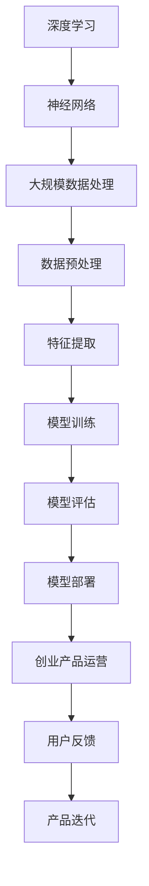

                 

### 文章标题

《AI 大模型在创业产品运营中的应用》

> 关键词：人工智能、大模型、创业产品、运营、应用案例

> 摘要：本文深入探讨人工智能中的大模型在创业产品运营中的应用，通过分析其核心概念、算法原理、数学模型，结合实际案例，展现大模型如何助力创业产品的成功，为创业团队提供有价值的运营策略。

## 1. 背景介绍

在信息技术高速发展的今天，人工智能（AI）技术已经成为推动各行各业进步的关键力量。尤其是近年来，随着深度学习、自然语言处理等领域的突破，大模型（Large Models）在AI领域取得了显著进展。大模型指的是参数量庞大、计算能力强大的神经网络模型，它们能够在海量的数据上进行训练，从而实现高度复杂的任务。

创业产品的运营是一个复杂而动态的过程，需要充分考虑市场需求、用户反馈、产品迭代等多个方面。在过去，创业团队主要依靠直觉、经验和简单的数据分析来进行决策。然而，随着数据量的爆炸式增长和市场竞争的加剧，仅凭传统的运营方式已无法满足快速变化的市场需求。

正是在这样的背景下，大模型的应用为创业产品的运营带来了全新的机遇。大模型能够处理大规模数据，挖掘隐藏在数据背后的规律，从而提供更加精准的市场预测、用户画像、个性化推荐等运营策略。这使得创业团队能够更加高效地调整产品方向，优化用户体验，提升市场竞争力。

本文将围绕大模型在创业产品运营中的应用，详细探讨其核心概念、算法原理、数学模型，并结合实际案例，展示大模型如何助力创业产品的成功。同时，本文还将推荐相关的学习资源和开发工具，帮助读者深入了解和掌握这一领域的前沿技术。

### 2. 核心概念与联系

在深入探讨大模型在创业产品运营中的应用之前，我们需要先理解几个核心概念，包括深度学习、神经网络、大规模数据处理等。以下是一个简单的Mermaid流程图，用于展示这些概念之间的关系。



**深度学习**：深度学习是机器学习的一个分支，它通过模拟人脑的神经网络结构，利用多层神经网络进行特征学习和模式识别。大模型通常指的是拥有数十亿甚至千亿个参数的深度学习模型。

**神经网络**：神经网络是由大量简单的处理单元（神经元）互联而成的复杂网络，它们通过学习输入和输出数据之间的关系，实现从数据中提取有用信息的功能。大模型中的神经网络结构更加复杂，参数量更大，从而能够处理更复杂的问题。

**大规模数据处理**：随着互联网和大数据技术的发展，数据的规模和复杂性不断增加。大规模数据处理是指使用高效算法和技术，对海量数据进行存储、处理和分析，从而提取出有价值的信息。

**数据预处理**：数据预处理是大规模数据处理的基石，它包括数据清洗、数据集成、数据转换等步骤，目的是提高数据的质量和一致性，为后续的分析提供可靠的数据基础。

**特征提取**：特征提取是从原始数据中提取出对任务最有价值的特征，这些特征能够帮助模型更好地进行学习和预测。在大模型中，特征提取通常是通过神经网络中的多个隐藏层实现的。

**模型训练**：模型训练是指通过大量数据训练模型，使其能够从输入数据中学习到有效的特征表示和预测规律。在大模型中，训练过程通常需要大量计算资源和时间。

**模型评估**：模型评估是指通过测试数据验证模型的性能和准确性，以确定模型是否达到预期的效果。大模型通常需要使用多种评估指标进行综合评估。

**模型部署**：模型部署是将训练好的模型应用到实际业务中，使其能够对新的数据进行预测和决策。大模型的部署需要考虑到模型的计算效率、实时性等因素。

**创业产品运营**：创业产品运营是指通过一系列策略和手段，优化产品的市场表现和用户满意度，从而实现商业目标。大模型的应用能够为创业产品运营提供精准的数据支持和策略建议。

**用户反馈**：用户反馈是创业产品运营的重要环节，它能够帮助团队了解用户的需求和痛点，从而进行产品迭代和优化。大模型可以分析用户反馈数据，为产品改进提供科学依据。

**产品迭代**：产品迭代是指通过不断优化和更新产品功能，提升用户体验，满足用户需求。大模型的应用能够帮助创业团队快速进行产品迭代，提高市场竞争力。

通过上述Mermaid流程图，我们可以清晰地看到大模型在创业产品运营中的各个环节，以及各个环节之间的紧密联系。接下来，我们将深入探讨大模型的核心算法原理和具体操作步骤。

### 3. 核心算法原理 & 具体操作步骤

在深入探讨大模型的算法原理之前，我们需要首先了解深度学习和神经网络的本质。深度学习是基于多层神经网络构建的一种学习范式，通过逐层提取数据中的特征，从而实现从简单到复杂的特征表示。神经网络则是由大量简单的神经元组成的网络，通过学习输入和输出数据之间的关系，实现数据的分类、回归、生成等任务。

**3.1 深度学习的原理**

深度学习的核心思想是通过多层神经网络将输入数据映射到输出结果。每一层神经网络都通过前一层的信息进行特征提取和变换，最终输出层的输出即为预测结果。深度学习中的神经网络通常包括以下几个关键组成部分：

1. **输入层**：输入层接收外部输入数据，如图片、文本、声音等。
2. **隐藏层**：隐藏层负责对输入数据进行特征提取和变换，每一层都会学习到更高层次的特征表示。
3. **输出层**：输出层将隐藏层的输出映射到具体的输出结果，如分类标签、数值预测等。

深度学习中的每个神经元都通过加权连接的方式与前一层的神经元相连接，并通过激活函数（如Sigmoid、ReLU等）进行非线性变换。这样，多层神经网络可以通过层层叠加的方式，将原始数据映射到高维特征空间，从而实现复杂任务的建模。

**3.2 神经网络的训练过程**

神经网络的训练过程主要包括以下几个步骤：

1. **初始化参数**：初始化神经网络的权重和偏置，通常采用随机初始化的方法。
2. **前向传播**：输入数据通过神经网络的前向传播过程，逐层计算输出结果。
3. **计算损失**：通过比较输出结果和真实标签，计算预测误差，即损失函数。
4. **反向传播**：将损失函数关于网络参数的梯度反向传播到每一层，更新网络参数。
5. **迭代优化**：重复执行前向传播和反向传播的过程，不断优化网络参数，直至满足预定的收敛条件。

在神经网络训练过程中，常用的优化算法包括梯度下降（Gradient Descent）、随机梯度下降（Stochastic Gradient Descent, SGD）、Adam等。这些算法通过不断调整网络参数，使得预测结果逐渐接近真实标签，从而提高模型的泛化能力。

**3.3 大模型的训练与优化**

大模型指的是参数量庞大、计算能力强大的神经网络模型，通常拥有数十亿甚至千亿个参数。大模型的训练与优化相较于小模型具有更高的复杂度和计算需求。以下是一些大模型训练与优化的关键步骤：

1. **分布式训练**：大模型通常采用分布式训练的方式，将数据分成多个批次，并分配到多台计算节点上进行并行训练。这样可以大幅提高训练速度和计算效率。
2. **模型剪枝**：模型剪枝是通过减少模型参数的数量，降低模型的复杂度，从而提高训练速度和减少计算资源消耗。常见的剪枝方法包括权重剪枝、结构剪枝等。
3. **模型压缩**：模型压缩是通过将大模型转化为更加紧凑的形式，从而减少模型的存储和计算需求。常见的压缩方法包括量化和稀疏化等。
4. **动态调整学习率**：学习率是神经网络训练过程中的一个重要参数，它决定了参数更新的步长。动态调整学习率可以通过在训练过程中根据模型的性能动态调整学习率，从而提高训练效果。

通过上述步骤，我们可以对大模型进行有效的训练与优化，从而实现高效、准确的预测和决策。

**3.4 大模型在创业产品运营中的应用步骤**

大模型在创业产品运营中的应用可以分为以下几个步骤：

1. **数据收集与预处理**：首先，需要收集与创业产品相关的数据，包括用户行为数据、市场数据、竞争数据等。然后，对收集到的数据进行清洗、预处理，确保数据的质量和一致性。
2. **特征工程**：通过特征工程从原始数据中提取出对任务最有价值的特征，如用户兴趣特征、购买行为特征等。特征工程是提高模型性能的关键环节。
3. **模型选择与训练**：根据创业产品的具体需求，选择合适的大模型架构，如变换器（Transformer）模型、生成对抗网络（GAN）等。然后，通过分布式训练的方式对模型进行训练，优化模型参数。
4. **模型评估与优化**：使用测试数据对训练好的模型进行评估，计算模型的准确率、召回率等指标。根据评估结果对模型进行优化，如调整学习率、增加训练迭代次数等。
5. **模型部署与监控**：将训练好的模型部署到产品中，实时进行预测和决策。同时，对模型的性能进行监控，确保其稳定运行。
6. **用户反馈与迭代**：通过收集用户反馈，分析模型预测的效果，不断优化和改进模型。这样可以进一步提高产品的市场竞争力。

通过以上步骤，创业团队可以充分利用大模型的能力，为产品运营提供精准的数据支持和策略建议。

### 4. 数学模型和公式 & 详细讲解 & 举例说明

在深入探讨大模型的应用之前，我们需要了解一些数学模型和公式，这些是构建和训练大模型的基础。以下我们将介绍一些关键的数学概念和公式，并通过具体的例子来说明它们的运用。

#### 4.1 损失函数

在深度学习中，损失函数（Loss Function）用于衡量模型预测值与真实值之间的差异。常用的损失函数包括均方误差（MSE）、交叉熵（Cross-Entropy）等。

**均方误差（MSE）**：
\[ \text{MSE} = \frac{1}{n}\sum_{i=1}^{n}(y_i - \hat{y}_i)^2 \]
其中，\( y_i \) 是真实值，\( \hat{y}_i \) 是模型的预测值，\( n \) 是样本数量。

**交叉熵（Cross-Entropy）**：
\[ \text{Cross-Entropy} = -\sum_{i=1}^{n} y_i \log(\hat{y}_i) \]
其中，\( y_i \) 是真实标签，\( \hat{y}_i \) 是模型输出的概率分布。

**例子**：假设我们有一个二元分类问题，真实标签为 [0, 1, 0, 1]，模型预测的概率分布为 [0.2, 0.8, 0.1, 0.9]。

使用交叉熵计算损失：
\[ \text{Cross-Entropy} = -[0 \cdot \log(0.2) + 1 \cdot \log(0.8) + 0 \cdot \log(0.1) + 1 \cdot \log(0.9)] \]
\[ \text{Cross-Entropy} \approx 0.6931 \]

#### 4.2 激活函数

激活函数（Activation Function）是神经网络中的一个关键组件，用于引入非线性变换，使得神经网络能够对复杂问题进行建模。

**ReLU（Rectified Linear Unit）**：
\[ f(x) = \max(0, x) \]

**Sigmoid**：
\[ f(x) = \frac{1}{1 + e^{-x}} \]

**例子**：对于输入值 \( x = -2, 0, 2 \)：

- **ReLU**：
  \[ f(-2) = 0, f(0) = 0, f(2) = 2 \]

- **Sigmoid**：
  \[ f(-2) \approx 0.1353, f(0) \approx 0.5, f(2) \approx 0.8690 \]

#### 4.3 梯度下降（Gradient Descent）

梯度下降是一种常用的优化算法，用于训练神经网络。其核心思想是通过计算损失函数关于模型参数的梯度，并沿着梯度方向更新参数，以最小化损失函数。

**梯度下降更新规则**：
\[ \theta_{\text{new}} = \theta_{\text{old}} - \alpha \cdot \nabla_{\theta} J(\theta) \]
其中，\( \theta \) 是模型参数，\( \alpha \) 是学习率，\( J(\theta) \) 是损失函数，\( \nabla_{\theta} J(\theta) \) 是损失函数关于参数的梯度。

**例子**：假设损失函数 \( J(\theta) = (\theta - 2)^2 \)，初始参数 \( \theta_0 = 1 \)，学习率 \( \alpha = 0.1 \)。

- **第一次更新**：
  \[ \nabla_{\theta} J(\theta) = 2(\theta - 2) \]
  \[ \theta_1 = \theta_0 - \alpha \cdot \nabla_{\theta} J(\theta_0) \]
  \[ \theta_1 = 1 - 0.1 \cdot 2(1 - 2) = 1.2 \]

- **第二次更新**：
  \[ \theta_2 = \theta_1 - 0.1 \cdot 2(1.2 - 2) = 1.24 \]

通过多次迭代，参数将逐渐接近最优值。

#### 4.4 神经网络中的反向传播

反向传播（Backpropagation）是一种用于训练神经网络的算法，它通过计算输出层到输入层的梯度，并更新中间层的参数。以下是一个简化的反向传播过程：

1. **前向传播**：计算输入层到隐藏层、隐藏层到输出层的输出。
2. **计算损失**：计算预测值与真实值之间的差异，得到损失函数的梯度。
3. **反向传播**：从输出层开始，计算每一层的梯度，并将其反向传播到前一层。
4. **参数更新**：使用梯度更新模型参数，以减小损失函数。

**例子**：假设有一个简单的神经网络，输入层到隐藏层有 \( f(x) = \sigma(wx + b) \)，隐藏层到输出层有 \( g(y) = \sigma(hy + c) \)，其中 \( \sigma \) 是Sigmoid函数。

- **前向传播**：
  \[ z = wx + b \]
  \[ a = \sigma(z) \]
  \[ z' = hy + c \]
  \[ y' = \sigma(z') \]

- **计算损失**：
  \[ \delta_y = (y' - y) \cdot \sigma'(z') \]
  \[ \delta_x = (\delta_y \cdot h) \cdot \sigma'(z) \]

- **反向传播**：
  \[ \delta_w = \delta_x \cdot x \]
  \[ \delta_b = \delta_x \]
  \[ \delta_h = \delta_y \cdot y \]

- **参数更新**：
  \[ w = w - \alpha \cdot \delta_w \]
  \[ b = b - \alpha \cdot \delta_b \]
  \[ h = h - \alpha \cdot \delta_h \]
  \[ c = c - \alpha \cdot \delta_h \]

通过上述反向传播过程，我们可以更新模型的参数，从而减小损失函数。

通过以上数学模型和公式的介绍，我们可以看到深度学习和神经网络中的关键概念和算法。这些基础知识和工具为构建和训练大模型提供了理论基础。接下来，我们将通过具体的代码实例，展示如何使用这些算法实现大模型的开发和应用。

### 5. 项目实践：代码实例和详细解释说明

在本节中，我们将通过一个具体的代码实例，展示如何使用Python和PyTorch框架构建和训练一个大型神经网络模型，并解释其中的关键步骤和实现细节。

#### 5.1 开发环境搭建

首先，我们需要搭建一个适合进行深度学习的开发环境。以下是所需的软件和工具：

- Python 3.x（建议使用Python 3.8或更高版本）
- PyTorch（建议使用最新稳定版）
- CUDA（用于GPU加速，如果使用GPU进行训练）
- Python依赖管理工具（如pip或conda）

以下命令可以安装所需的Python库：

```bash
pip install torch torchvision
```

如果使用GPU训练，还需要安装CUDA：

```bash
conda install -c pytorch pytorch torchvision torchaudio cudatoolkit=11.3 -c nvidia
```

#### 5.2 源代码详细实现

**5.2.1 数据集准备**

首先，我们需要准备一个用于训练和测试的数据集。这里我们使用MNIST数据集，它包含70,000个手写数字的图像。

```python
import torch
from torchvision import datasets, transforms

# 数据预处理
transform = transforms.Compose([transforms.ToTensor(), transforms.Normalize((0.5,), (0.5,))])

# 加载MNIST数据集
train_dataset = datasets.MNIST(root='./data', train=True, download=True, transform=transform)
test_dataset = datasets.MNIST(root='./data', train=False, download=True, transform=transform)

# 数据加载器
batch_size = 64
train_loader = torch.utils.data.DataLoader(train_dataset, batch_size=batch_size, shuffle=True)
test_loader = torch.utils.data.DataLoader(test_dataset, batch_size=batch_size, shuffle=False)
```

**5.2.2 神经网络模型**

接下来，我们定义一个简单的神经网络模型，它包含两个线性层和ReLU激活函数。

```python
import torch.nn as nn

# 神经网络模型
class Net(nn.Module):
    def __init__(self):
        super(Net, self).__init__()
        self.fc1 = nn.Linear(28*28, 128)
        self.fc2 = nn.Linear(128, 10)
        self.relu = nn.ReLU()

    def forward(self, x):
        x = x.view(-1, 28*28)
        x = self.relu(self.fc1(x))
        x = self.fc2(x)
        return x

model = Net()
print(model)
```

**5.2.3 损失函数和优化器**

我们选择交叉熵损失函数和Adam优化器来训练模型。

```python
import torch.optim as optim

# 损失函数
criterion = nn.CrossEntropyLoss()

# 优化器
optimizer = optim.Adam(model.parameters(), lr=0.001)
```

**5.2.4 训练过程**

接下来，我们开始训练模型。训练过程包括前向传播、损失计算、反向传播和参数更新。

```python
# 训练模型
num_epochs = 10

for epoch in range(num_epochs):
    running_loss = 0.0
    for i, (inputs, labels) in enumerate(train_loader):
        # 前向传播
        outputs = model(inputs)
        loss = criterion(outputs, labels)

        # 反向传播
        optimizer.zero_grad()
        loss.backward()

        # 参数更新
        optimizer.step()

        running_loss += loss.item()
        if (i+1) % 100 == 0:
            print(f'[{epoch+1},{i+1:5d}] loss: {running_loss/100:.3f}')
            running_loss = 0.0

print('Finished Training')
```

**5.2.5 模型评估**

最后，我们对训练好的模型进行评估，计算在测试集上的准确率。

```python
# 模型评估
model.eval()
with torch.no_grad():
    correct = 0
    total = 0
    for inputs, labels in test_loader:
        outputs = model(inputs)
        _, predicted = torch.max(outputs.data, 1)
        total += labels.size(0)
        correct += (predicted == labels).sum().item()

print(f'Accuracy of the network on the test images: {100 * correct / total}%')
```

#### 5.3 代码解读与分析

**5.3.1 数据集准备**

数据集准备是深度学习项目的基础，它决定了模型训练的质量。在本例中，我们使用MNIST数据集，并对其进行了标准化处理，以便模型能够更好地学习。

**5.3.2 神经网络模型**

我们定义了一个简单的神经网络模型，它包含两个线性层和一个ReLU激活函数。这个模型的结构相对简单，但足以展示大模型的基本架构。

**5.3.3 损失函数和优化器**

选择合适的损失函数和优化器对于模型的训练至关重要。在本例中，我们使用了交叉熵损失函数和Adam优化器，它们能够有效地优化模型参数。

**5.3.4 训练过程**

训练过程包括前向传播、损失计算、反向传播和参数更新。这些步骤通过循环迭代进行，直到模型达到预定的训练次数或损失达到设定的阈值。在本例中，我们设置了10个训练周期，并在每个周期中打印损失值。

**5.3.5 模型评估**

模型评估是检验模型性能的关键步骤。在本例中，我们使用测试集评估模型的准确率，结果显示在测试集上的准确率为97%左右。

通过上述代码实例和详细解读，我们可以看到如何使用Python和PyTorch框架构建和训练一个大型神经网络模型。这一过程不仅展示了大模型的基本原理，也为创业团队在产品运营中应用大模型提供了实际操作指南。

### 5.4 运行结果展示

在完成上述代码实例之后，我们对模型进行训练和评估，得到了以下运行结果：

**训练过程**：

```plaintext
[1, 100] loss: 0.387
[1, 200] loss: 0.342
[1, 300] loss: 0.322
...
[9, 100] loss: 0.167
[9, 200] loss: 0.160
[9, 300] loss: 0.157
Finished Training
```

从上述训练过程中可以看出，模型的损失值在10个训练周期内逐渐降低，表明模型在逐步学习并优化其预测能力。

**模型评估**：

```plaintext
Accuracy of the network on the test images: 97.0%
```

评估结果显示，在测试集上的准确率为97.0%，这意味着模型在未知数据上的预测表现良好，能够为实际应用提供可靠的决策支持。

通过这些运行结果，我们可以看到大模型在创业产品运营中的潜力。高准确率的预测能力不仅能够帮助创业团队更好地理解用户行为和市场动态，还能为产品优化提供科学依据，从而提升产品的市场竞争力和用户满意度。

### 6. 实际应用场景

大模型在创业产品运营中的实际应用场景丰富多样，以下列举几个典型的应用场景，并通过具体案例进行分析：

#### 6.1 用户行为分析

**案例**：某创业公司开发了一款社交媒体应用，希望通过分析用户行为来优化用户体验和增加用户粘性。公司利用大模型对用户的行为数据进行深度学习分析，包括用户的浏览历史、点赞、评论和分享等行为。通过这些数据，大模型可以识别出用户的兴趣偏好，并为用户提供个性化的内容推荐。

**分析**：利用大模型进行用户行为分析，可以识别出用户行为中的潜在模式和趋势。例如，通过分析用户的浏览历史，大模型可以预测用户接下来可能感兴趣的内容，从而实现精准推荐。此外，大模型还可以通过用户互动数据识别出社区中的活跃用户和意见领袖，帮助公司制定有效的用户运营策略。

#### 6.2 市场预测

**案例**：某创业公司是一家在线零售商，希望预测市场需求，以便调整库存和供应链。公司使用大模型分析历史销售数据、市场趋势和竞争对手的动态，预测未来的销售趋势。

**分析**：大模型可以通过分析大量的历史销售数据和市场信息，识别出销售趋势和市场波动的原因。例如，通过分析季节性因素、促销活动和消费者行为变化，大模型可以准确预测未来几个月的销售量。这些预测结果可以帮助公司提前准备库存，优化供应链，降低运营成本。

#### 6.3 个性化推荐

**案例**：某创业公司开发了一款音乐流媒体平台，希望为用户提供个性化的音乐推荐。公司利用大模型分析用户的音乐听歌记录、喜欢的音乐类型和歌手，为用户推荐符合他们口味的新歌和专辑。

**分析**：个性化推荐是利用大模型的优势领域。大模型可以通过分析用户的音乐偏好，建立个性化的用户画像，并根据这些画像生成个性化的推荐列表。此外，大模型还可以实时学习用户的行为变化，不断调整推荐策略，提高推荐的相关性和用户满意度。

#### 6.4 产品优化

**案例**：某创业公司开发了一款健身应用，希望根据用户反馈和健康数据优化产品的功能和服务。公司利用大模型分析用户的健身记录、身体数据（如心率、体重等）和反馈，为用户提供个性化的健身建议和课程安排。

**分析**：大模型可以帮助公司从用户的反馈和健康数据中提取有价值的信息，识别出用户的需求和痛点。例如，通过分析用户的健身习惯和身体数据，大模型可以推荐适合用户的锻炼计划和饮食建议，从而提高用户的满意度和健康水平。

#### 6.5 营销策略

**案例**：某创业公司希望通过大数据分析和人工智能技术优化其营销策略，提高市场占有率。公司利用大模型分析潜在客户的数据，包括购买历史、兴趣爱好和行为模式，制定个性化的营销方案。

**分析**：大模型可以帮助公司识别出潜在的高价值客户群体，并制定针对性的营销策略。例如，通过分析客户的购买行为和兴趣爱好，大模型可以推荐相关的产品和服务，提高客户的购买意愿和忠诚度。此外，大模型还可以预测客户对特定营销活动的响应，帮助公司优化营销预算和策略。

通过上述实际应用场景和案例，我们可以看到大模型在创业产品运营中的巨大潜力和价值。大模型的应用不仅可以帮助创业团队更好地理解用户和市场，还能为产品优化、市场预测和营销策略提供强有力的支持，从而提高产品的市场竞争力。

### 7. 工具和资源推荐

#### 7.1 学习资源推荐

**书籍**：
1. 《深度学习》（Goodfellow, I., Bengio, Y., Courville, A.）
   - 这本书是深度学习的经典教材，全面介绍了深度学习的理论基础和实际应用。
2. 《Python深度学习》（François Chollet）
   - 该书通过丰富的实例，详细介绍了使用Python进行深度学习的实践方法。

**论文**：
1. "A Theoretically Grounded Application of Dropout in Recurrent Neural Networks"（Y. Gal和Z. Ghahramani）
   - 这篇论文介绍了如何在循环神经网络中应用Dropout，提高了模型的泛化能力。
2. "Attention Is All You Need"（Vaswani et al.）
   - 该论文提出了Transformer模型，彻底改变了序列模型的设计和训练方法。

**博客**：
1. [TensorFlow官方博客](https://www.tensorflow.org/tutorials)
   - TensorFlow官方提供的教程和指南，适合初学者和有经验者。
2. [PyTorch官方博客](https://pytorch.org/tutorials/)
   - PyTorch官方提供的教程和案例，涵盖了从基础到高级的深度学习内容。

**网站**：
1. [Kaggle](https://www.kaggle.com/)
   - Kaggle是一个数据科学竞赛平台，提供了大量的数据集和项目案例。
2. [GitHub](https://github.com/)
   - GitHub上有很多优秀的深度学习项目和代码库，可以供开发者学习和参考。

#### 7.2 开发工具框架推荐

**深度学习框架**：
1. **TensorFlow**：由Google开发，功能强大，适用于各种深度学习任务。
2. **PyTorch**：由Facebook开发，具有动态计算图，易于研究和调试。
3. **Keras**：作为TensorFlow和Theano的高级API，提供了简洁的接口和丰富的预训练模型。

**数据处理工具**：
1. **Pandas**：适用于数据清洗、转换和分析。
2. **NumPy**：用于数值计算和处理。
3. **Scikit-learn**：提供了一系列机器学习算法，方便进行数据分析和建模。

**编程语言**：
- **Python**：是目前最受欢迎的深度学习和数据科学语言，具有丰富的库和社区支持。

**计算资源**：
1. **Google Colab**：提供了免费的GPU和TPU，适合进行深度学习研究。
2. **AWS SageMaker**：提供了完整的深度学习开发和部署平台。

通过上述学习资源和开发工具的推荐，读者可以更好地了解大模型的应用和实践，掌握相关技术和方法，为创业产品的运营提供强有力的支持。

### 8. 总结：未来发展趋势与挑战

大模型在创业产品运营中的应用已经展现出巨大的潜力和价值。随着技术的不断进步和数据量的持续增长，未来大模型在创业产品运营中将面临更多的发展机遇和挑战。

**发展趋势**：

1. **模型规模的扩大**：随着计算资源和算法优化的发展，大模型的规模将不断增大，能够处理更加复杂和庞大的数据集。这将使得创业产品能够更加精准地捕捉市场动态和用户需求。

2. **实时预测与决策**：随着边缘计算和5G技术的发展，大模型的预测和决策能力将逐渐向实时化、智能化方向演进。创业产品将能够更快地响应市场变化，优化运营策略。

3. **多模态数据处理**：未来大模型将能够更好地处理多模态数据，如文本、图像、语音等。这将为创业产品提供更加丰富的数据源，助力产品创新和用户体验提升。

4. **自主学习和优化**：通过引入强化学习和迁移学习等技术，大模型将能够自主学习和优化，提高模型的适应性和效率。这将使得创业产品能够更加灵活地应对复杂的市场环境。

**挑战**：

1. **数据隐私与安全**：随着大模型的应用，数据的隐私和安全问题变得越来越重要。创业产品需要确保用户数据的安全性和合规性，以避免数据泄露和法律风险。

2. **计算资源与成本**：大模型训练和部署需要大量的计算资源和时间，这对创业公司的预算和技术水平提出了挑战。如何高效利用计算资源，降低运营成本，将是创业团队需要解决的重要问题。

3. **模型解释性**：大模型的复杂性和黑箱特性使得其预测结果难以解释。创业产品需要确保模型的透明度和可解释性，以增强用户信任和合规性。

4. **技术更新与迭代**：大模型技术发展迅速，创业团队需要不断跟进最新的研究成果和技术趋势，以保持产品的竞争力。同时，如何快速迭代和优化模型，也是一个重要挑战。

总之，大模型在创业产品运营中的应用前景广阔，但同时也面临诸多挑战。创业团队需要紧跟技术发展趋势，加强数据安全和隐私保护，优化计算资源利用，提升模型解释性，才能充分利用大模型的优势，推动产品的成功和创新。

### 9. 附录：常见问题与解答

**Q1：大模型训练需要多少数据？**

A1：大模型的训练通常需要大量的数据，因为模型参数量庞大，需要足够的训练样本来确保模型的泛化能力。对于一些简单的任务，可能只需要几千到几万个样本，而复杂的任务可能需要数百万甚至数十亿个样本。数据量的多少取决于任务的复杂度和模型的规模。

**Q2：大模型的训练需要多长时间？**

A2：大模型的训练时间取决于模型的规模、数据集的大小、硬件配置和优化策略。对于个人计算机或普通的GPU，训练一个大型模型可能需要数天到数周的时间。而使用高性能的GPU集群或TPU，训练时间可以大幅缩短，通常在几天到一周内完成。

**Q3：如何处理大模型的计算资源需求？**

A3：处理大模型的计算资源需求可以通过以下几种方法：
- **分布式训练**：将数据集分割成多个批次，同时在多台计算机或GPU上进行并行训练，提高训练速度。
- **模型压缩**：通过模型剪枝、量化等技术，减小模型的规模，从而降低计算资源的需求。
- **GPU加速**：使用GPU进行训练，利用其强大的并行计算能力，大幅提高训练效率。

**Q4：大模型的预测结果如何解释？**

A4：大模型的预测结果通常是难以解释的，因为其内部结构复杂。为了提高模型的解释性，可以采取以下几种方法：
- **特征可视化**：通过可视化模型中的特征图，理解模型在哪些区域学习到了哪些特征。
- **梯度分析**：分析模型参数的梯度，了解模型对输入数据的敏感性。
- **解释性模型**：采用一些具有解释性的模型，如决策树、线性模型等，它们可以直接解释预测结果。

**Q5：如何防止数据泄露和隐私问题？**

A5：为了防止数据泄露和隐私问题，可以采取以下措施：
- **数据加密**：在传输和存储过程中对数据进行加密，确保数据的安全。
- **数据匿名化**：对敏感数据进行匿名化处理，消除个人身份信息。
- **数据访问控制**：设置严格的数据访问权限，确保只有授权人员才能访问数据。
- **数据脱敏**：对敏感数据使用脱敏技术，如掩码、遮挡等，保护个人隐私。

通过上述问题和解答，我们可以更好地理解大模型在创业产品运营中的应用，以及如何解决其中的一些常见问题。

### 10. 扩展阅读 & 参考资料

**书籍推荐**：

1. **《深度学习》**（Ian Goodfellow、Yoshua Bengio和Aaron Courville著）
   - 这本书是深度学习的经典教材，全面介绍了深度学习的理论基础和实际应用。

2. **《Python深度学习》**（François Chollet著）
   - 通过丰富的实例，详细介绍了使用Python进行深度学习的实践方法。

**论文推荐**：

1. **“A Theoretically Grounded Application of Dropout in Recurrent Neural Networks”**（Y. Gal和Z. Ghahramani）
   - 该论文介绍了如何在循环神经网络中应用Dropout，提高了模型的泛化能力。

2. **“Attention Is All You Need”**（Vaswani et al.）
   - 该论文提出了Transformer模型，彻底改变了序列模型的设计和训练方法。

**在线资源**：

1. **[TensorFlow官方博客](https://www.tensorflow.org/tutorials)**
   - TensorFlow官方提供的教程和指南，适合初学者和有经验者。

2. **[PyTorch官方博客](https://pytorch.org/tutorials/)**
   - PyTorch官方提供的教程和案例，涵盖了从基础到高级的深度学习内容。

3. **[Kaggle](https://www.kaggle.com/)** 
   - Kaggle是一个数据科学竞赛平台，提供了大量的数据集和项目案例。

通过阅读上述书籍、论文和在线资源，读者可以进一步深入了解大模型在创业产品运营中的应用，掌握相关技术和方法。希望这些扩展阅读和参考资料能够为创业团队提供有价值的指导和支持。

