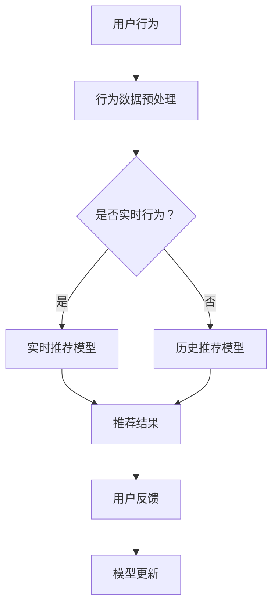

                 

### 1. 背景介绍

在当今数字化时代，电子商务已经成为人们日常生活的重要组成部分。随着互联网技术的飞速发展，电商平台上的商品种类和数量呈现爆炸式增长，用户在搜索和购买商品时面临的挑战也随之增加。在这种背景下，如何提高电商平台的搜索推荐系统性能，满足用户实时需求与行为偏好，成为了电商领域研究的热点问题。

搜索推荐系统作为电商平台的核心功能之一，其目标是在海量商品中为用户找到最符合其需求的商品。传统的搜索推荐系统主要依赖于基于内容的推荐和协同过滤算法，虽然在一定程度上提高了推荐的准确性和覆盖率，但仍然存在以下问题：

1. **响应速度慢**：传统的推荐算法通常需要大量计算时间，难以实现实时推荐。
2. **推荐质量不稳定**：在用户行为数据不足或者用户行为变化较快时，推荐系统的效果会受到显著影响。
3. **用户个性化体验不足**：难以准确捕捉用户的瞬时需求与行为偏好。

为了解决这些问题，近年来，人工智能技术，特别是深度学习和大规模预训练模型（如GPT、BERT等）在推荐系统中的应用逐渐成熟。这些大模型通过在海量数据上的预训练，能够学习到丰富的知识，从而在推荐时更好地捕捉用户的个性化需求和行为模式。此外，实时推荐策略的引入，使得推荐系统能够迅速响应用户的搜索行为，提供更精准的推荐结果。

本文将围绕AI大模型在电商搜索推荐中的实时推荐策略展开讨论，旨在探讨如何利用AI大模型技术，结合实时推荐策略，提升电商搜索推荐系统的效果和用户体验。

### 2. 核心概念与联系

#### 2.1 实时推荐系统

实时推荐系统是指能够在用户搜索或浏览商品时，立即为其生成推荐列表的推荐系统。这种系统对响应速度要求极高，因为用户的行为是瞬息万变的，延迟推荐可能导致用户流失。

#### 2.2 AI 大模型

AI大模型是指通过大规模数据训练得到的深度学习模型，如GPT、BERT等。这些模型具有强大的特征提取和表示能力，能够在海量数据中学习到丰富的知识，从而实现高度个性化的推荐。

#### 2.3 用户瞬时需求与行为偏好

用户瞬时需求是指用户在某一时刻对某一类商品的强烈需求，可能是由于促销活动、个人兴趣变化等因素引起的。行为偏好则是指用户长期积累的购物习惯和喜好，是推荐系统进行个性化推荐的重要依据。

#### 2.4 Mermaid 流程图

下面是电商搜索推荐系统的流程图，展示了实时推荐策略中各核心概念的相互关系：

在这个流程图中，用户行为数据首先经过预处理，然后根据行为是否实时判断使用实时推荐模型还是历史推荐模型。无论是实时推荐模型还是历史推荐模型，最终都会生成推荐结果并收集用户反馈，用于模型更新，形成一个闭环系统。

### 3. 核心算法原理 & 具体操作步骤

#### 3.1 实时推荐算法

实时推荐算法的关键在于快速响应用户的行为，提供即时且准确的推荐结果。以下是实时推荐算法的几个关键步骤：

1. **用户行为采集**：实时推荐系统需要实时采集用户的搜索、浏览、购买等行为数据。
2. **行为数据预处理**：对采集到的行为数据进行清洗、去噪和特征提取，使其适合输入到推荐模型。
3. **模型选择与加载**：根据用户行为数据的特点选择合适的实时推荐模型，并加载预训练好的模型权重。
4. **模型预测**：将预处理后的用户行为数据输入到推荐模型，获取推荐结果。
5. **结果呈现**：将推荐结果展示给用户，如商品列表、广告位等。

#### 3.2 AI 大模型在实时推荐中的应用

AI大模型在实时推荐中的应用主要体现在以下几个方面：

1. **特征提取**：大模型能够从原始行为数据中提取出高维、抽象的特征表示，这些特征有助于提高推荐的准确性和个性

