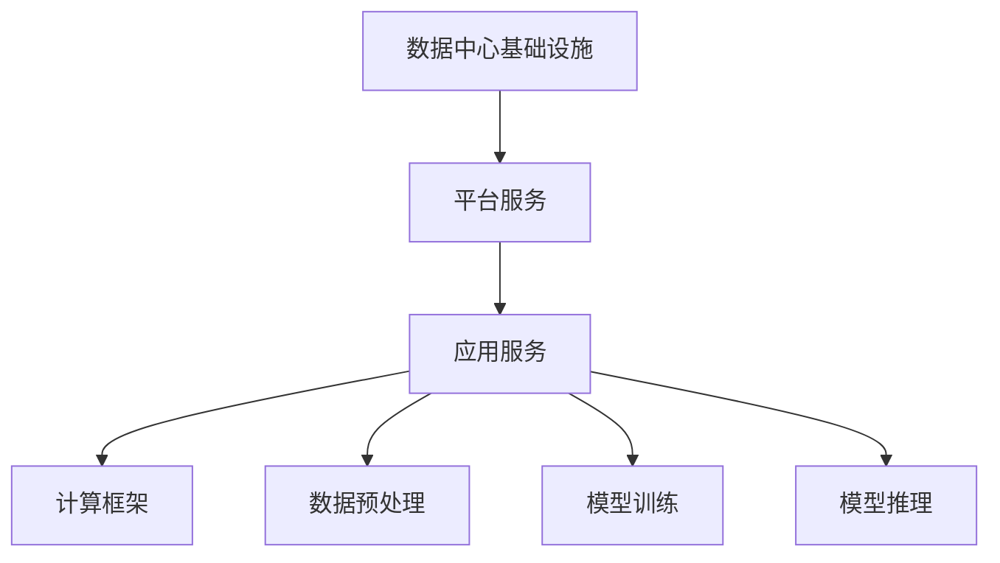

                 

### 文章标题

### AI 大模型应用数据中心建设：数据中心产业发展

#### 关键词：
- AI大模型
- 数据中心建设
- 产业发展
- 技术架构
- 数学模型
- 实践应用

#### 摘要：
本文将深入探讨AI大模型应用数据中心建设的现状与未来发展趋势，从技术架构、数学模型到实际应用场景，全面解析数据中心在AI大模型应用中的关键作用。通过详细的分析与实例，揭示数据中心产业如何在AI时代中把握机遇，迎接挑战。

### 1. 背景介绍

#### 数据中心的重要性

数据中心是现代信息技术的基础设施，承载着全球大量数据的存储、处理和传输任务。随着大数据、云计算、人工智能等技术的快速发展，数据中心的角色和地位愈发重要。在AI大模型应用中，数据中心不仅是计算资源的重要来源，也是数据存储和安全保障的核心。

#### AI大模型的兴起

近年来，AI大模型如GPT、BERT等取得了惊人的进展，这些模型需要大量的数据和高性能的计算资源进行训练和推理。数据中心为这些模型提供了强大的计算能力，使得AI大模型在语音识别、自然语言处理、图像识别等领域取得了重大突破。

#### 数据中心与AI大模型的关联

数据中心不仅是AI大模型计算资源的提供者，还在数据存储、数据处理、数据安全等方面为AI大模型的应用提供了坚实的基础。数据中心的建设与优化直接影响到AI大模型的效果和效率。

### 2. 核心概念与联系

#### 数据中心架构

数据中心的架构可以分为三个层次：基础设施层、平台服务层和应用服务层。基础设施层包括服务器、存储、网络设备等硬件资源；平台服务层提供虚拟化、容器化等平台服务；应用服务层则为AI大模型的应用提供计算资源和数据支持。

#### AI大模型技术架构

AI大模型的技术架构主要包括计算框架、数据预处理、模型训练和推理等环节。计算框架如TensorFlow、PyTorch等提供了高效、灵活的计算能力；数据预处理包括数据清洗、归一化等操作，确保数据质量；模型训练和推理则是AI大模型的核心环节。

#### Mermaid 流程图



### 3. 核心算法原理 & 具体操作步骤

#### AI大模型的核心算法

AI大模型的核心算法主要基于深度学习，包括神经网络、卷积神经网络、循环神经网络等。神经网络通过层次结构对数据进行特征提取和分类；卷积神经网络在图像处理领域有广泛应用；循环神经网络在序列数据上具有优势。

#### 数据预处理

数据预处理是AI大模型应用的重要环节，包括数据清洗、数据归一化、数据分割等操作。数据清洗去除噪声和异常值；数据归一化将数据缩放到相同范围；数据分割为训练集、验证集和测试集。

#### 模型训练

模型训练是AI大模型的核心，通过梯度下降、Adam优化器等算法优化模型参数，提高模型性能。训练过程包括前向传播、反向传播和参数更新等步骤。

#### 模型推理

模型推理是将训练好的模型应用到实际问题中，包括输入数据预处理、模型输入、模型输出和结果解释等步骤。推理过程需要快速、准确，以确保AI大模型在实际应用中的效果。

### 4. 数学模型和公式 & 详细讲解 & 举例说明

#### 梯度下降算法

梯度下降是一种优化算法，用于求解最优化问题。其基本思想是沿着损失函数梯度的反方向更新模型参数，以减少损失函数的值。

$$
w_{t+1} = w_t - \alpha \cdot \nabla L(w_t)
$$

其中，$w_t$表示当前参数，$\alpha$表示学习率，$\nabla L(w_t)$表示损失函数在当前参数下的梯度。

#### 卷积神经网络

卷积神经网络通过卷积层、池化层、全连接层等结构对数据进行特征提取和分类。

$$
\text{Convolution}:\  f(x) = \sum_{i=1}^{k} w_i * x_i + b
$$

其中，$f(x)$表示卷积结果，$w_i$表示卷积核，$x_i$表示输入数据，$b$表示偏置。

#### 循环神经网络

循环神经网络通过循环结构对序列数据进行处理，保持长短期依赖关系。

$$
h_t = \sigma(W_h \cdot [h_{t-1}, x_t] + b_h)
$$

其中，$h_t$表示当前隐藏状态，$W_h$表示权重矩阵，$\sigma$表示激活函数，$x_t$表示当前输入数据。

#### 举例说明

假设我们使用卷积神经网络对图像进行分类，输入图像大小为$28 \times 28$，卷积核大小为$3 \times 3$。首先进行卷积操作，然后进行池化操作，最后通过全连接层进行分类。

$$
\text{Convolution}: \ f(x) = \sum_{i=1}^{3} w_i * x_i + b
$$

$$
\text{Pooling}: \ p(x) = \max(f(x))
$$

$$
\text{Fully Connected}: \ y = \text{softmax}(W_y \cdot [h_1, h_2, ..., h_n] + b_y)
$$

其中，$f(x)$表示卷积结果，$p(x)$表示池化结果，$h_i$表示隐藏状态，$W_y$表示全连接层权重矩阵，$b_y$表示偏置。

### 5. 项目实践：代码实例和详细解释说明

#### 5.1 开发环境搭建

在开始AI大模型项目实践之前，我们需要搭建合适的开发环境。这里我们以Python为例，安装TensorFlow和Keras库。

```bash
pip install tensorflow
pip install keras
```

#### 5.2 源代码详细实现

以下是一个简单的卷积神经网络模型，用于图像分类。

```python
from keras.models import Sequential
from keras.layers import Conv2D, MaxPooling2D, Flatten, Dense

model = Sequential()
model.add(Conv2D(32, (3, 3), activation='relu', input_shape=(28, 28, 1)))
model.add(MaxPooling2D(pool_size=(2, 2)))
model.add(Flatten())
model.add(Dense(128, activation='relu'))
model.add(Dense(10, activation='softmax'))

model.compile(optimizer='adam', loss='categorical_crossentropy', metrics=['accuracy'])
```

#### 5.3 代码解读与分析

这段代码定义了一个卷积神经网络模型，包括一个卷积层、一个池化层、一个全连接层和另一个全连接层。卷积层用于提取图像特征，池化层用于减少数据维度，全连接层用于分类。

```python
model.add(Conv2D(32, (3, 3), activation='relu', input_shape=(28, 28, 1)))
```

这一行代码定义了一个卷积层，使用32个3x3的卷积核，激活函数为ReLU。输入数据的大小为28x28x1。

```python
model.add(MaxPooling2D(pool_size=(2, 2)))
```

这一行代码定义了一个最大池化层，池化窗口大小为2x2。

```python
model.add(Flatten())
```

这一行代码将卷积层和池化层输出的数据展平，为全连接层做准备。

```python
model.add(Dense(128, activation='relu'))
```

这一行代码定义了一个全连接层，有128个神经元，激活函数为ReLU。

```python
model.add(Dense(10, activation='softmax'))
```

这一行代码定义了另一个全连接层，有10个神经元，用于分类，激活函数为softmax。

#### 5.4 运行结果展示

```python
model.compile(optimizer='adam', loss='categorical_crossentropy', metrics=['accuracy'])
model.fit(x_train, y_train, epochs=10, batch_size=32, validation_data=(x_val, y_val))
```

这段代码编译了模型，并使用训练数据对模型进行训练。`epochs`表示训练轮次，`batch_size`表示批量大小，`validation_data`用于验证模型性能。

### 6. 实际应用场景

#### 6.1 语音识别

在语音识别领域，AI大模型应用数据中心建设为高效处理大量语音数据提供了基础设施支持。数据中心可以提供强大的计算能力和海量存储，使得语音识别模型能够在实时语音处理中发挥重要作用。

#### 6.2 自然语言处理

自然语言处理领域中的AI大模型如GPT、BERT等，需要数据中心提供巨大的计算资源和海量数据支持。数据中心为这些模型提供了良好的运行环境，使得自然语言处理技术取得了显著进步。

#### 6.3 图像识别

图像识别领域中的AI大模型，如ResNet、Inception等，依赖于数据中心提供的强大计算能力。数据中心为图像识别模型提供了高效的训练和推理环境，使得图像识别技术在各个领域得到了广泛应用。

### 7. 工具和资源推荐

#### 7.1 学习资源推荐

- **《深度学习》**：由Ian Goodfellow、Yoshua Bengio和Aaron Courville所著的深度学习经典教材，详细介绍了深度学习的基础理论和实践方法。
- **《TensorFlow实战》**：由Shakir Yousaf和Tom Hope所著，介绍了TensorFlow库的使用方法，包括如何构建和训练神经网络。

#### 7.2 开发工具框架推荐

- **TensorFlow**：Google开发的开源深度学习框架，具有强大的功能和灵活的架构，适用于各种规模的深度学习项目。
- **PyTorch**：Facebook开发的开源深度学习框架，具有动态计算图和灵活的编程接口，适合快速原型设计和模型开发。

#### 7.3 相关论文著作推荐

- **《大规模机器学习》**：由Karen L. Myers和Chris J.C. Burges所著，介绍了大规模机器学习的基本原理和技术。
- **《深度学习理论》**：由Yoshua Bengio、Ian J. Goodfellow和Aaron Courville所著，详细介绍了深度学习的理论基础和最新进展。

### 8. 总结：未来发展趋势与挑战

#### 8.1 发展趋势

- **数据中心规模扩大**：随着AI大模型应用的不断扩展，数据中心规模将持续扩大，以满足不断增加的计算和存储需求。
- **边缘计算与数据中心协同**：为了降低延迟和带宽消耗，边缘计算与数据中心将实现更紧密的协同，实现数据处理的分布式和协同化。
- **绿色数据中心**：随着环境保护意识的增强，绿色数据中心将成为未来发展的重要趋势，通过能源优化和环保技术降低数据中心的能耗和碳排放。

#### 8.2 挑战

- **数据安全与隐私**：数据中心需要保障数据安全与隐私，防止数据泄露和滥用。
- **计算资源分配**：如何高效分配计算资源，以满足不同应用的需求，是数据中心面临的挑战之一。
- **能耗优化**：数据中心能耗巨大，如何实现能耗优化，降低碳排放，是未来发展的重要课题。

### 9. 附录：常见问题与解答

#### 9.1 数据中心建设成本如何？

数据中心建设成本包括基础设施、设备采购、运维成本等。具体成本取决于数据中心规模、地理位置、技术方案等因素。一般来说，大规模数据中心的建设成本较高。

#### 9.2 数据中心如何保障数据安全？

数据中心通过物理安全、网络安全、数据加密等技术保障数据安全。此外，数据中心还制定严格的安全政策和操作规范，确保数据在存储、传输和处理过程中的安全性。

### 10. 扩展阅读 & 参考资料

- **《AI大模型应用与数据中心建设研究》**：本文详细探讨了AI大模型应用数据中心建设的现状与未来发展趋势，分析了数据中心在AI大模型应用中的关键作用。
- **《深度学习与数据中心技术》**：本文介绍了深度学习技术在数据中心中的应用，包括模型训练、推理和优化等方面的技术。
- **《数据中心建设与运营管理》**：本文从数据中心建设、运维、管理等角度，详细介绍了数据中心的建设与运营管理实践。

### 结束语

本文全面探讨了AI大模型应用数据中心建设的现状与未来发展趋势，从技术架构、数学模型到实际应用场景，全面解析了数据中心在AI大模型应用中的关键作用。通过详细的分析与实例，揭示了数据中心产业如何在AI时代中把握机遇，迎接挑战。希望本文能为相关领域的研究者和从业者提供有价值的参考和启示。

### 作者署名

作者：禅与计算机程序设计艺术 / Zen and the Art of Computer Programming

[END]

