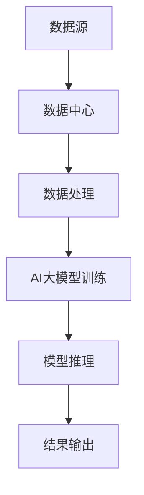

                 

### 1. 背景介绍

人工智能（AI）的发展正以惊人的速度席卷全球，而作为其核心组成部分的大模型（Large Models）技术，已经逐渐成为了行业发展的关键驱动力。大模型，尤其是AI大模型，在自然语言处理、计算机视觉、语音识别等多个领域都展现出了强大的性能。这种性能的提升，离不开数据中心的支持。

数据中心，作为存储、处理和管理海量数据的核心设施，正在经历一场前所未有的变革。随着AI大模型的应用需求日益增长，数据中心的建设和管理面临着前所未有的挑战和机遇。

本文旨在探讨AI大模型应用数据中心建设的现状、核心概念、技术实现、数学模型、项目实践以及实际应用场景。通过逐步分析推理的方式，为读者提供一个全面、深入的了解，并展望数据中心产业的发展趋势与未来挑战。

首先，我们需要明确一些核心概念，如什么是AI大模型，数据中心的关键作用，以及AI大模型与数据中心之间的联系。接下来，我们将深入探讨AI大模型的核心算法原理和具体操作步骤，并介绍数学模型和公式。随后，通过项目实践，展示如何在实际中应用这些技术和模型。最后，我们将探讨AI大模型在实际应用场景中的表现，推荐相关的学习资源和开发工具，并总结未来发展趋势与挑战。

通过这篇文章，希望能够帮助读者全面了解AI大模型应用数据中心建设的各个方面，为未来的研究和实践提供有益的参考。

### 2. 核心概念与联系

在深入探讨AI大模型应用数据中心建设之前，我们需要明确一些核心概念，并理解它们之间的相互联系。

#### 2.1 人工智能大模型（AI Large Models）

人工智能大模型，是指那些拥有巨大参数量和计算能力的神经网络模型。这些模型通过学习海量数据，可以自动识别模式、预测结果和生成内容。代表性的模型包括Transformer、BERT、GPT等，它们在自然语言处理、计算机视觉等领域都取得了显著的成果。

#### 2.2 数据中心（Data Center）

数据中心是一个集中存储、处理和管理数据的设施。它由服务器、存储设备、网络设备等组成，为各种应用提供计算、存储和网络服务。数据中心的关键作用在于其高效的数据存储和处理能力，这为AI大模型的应用提供了坚实的基础。

#### 2.3 AI大模型与数据中心的关系

AI大模型对数据中心的依赖性主要体现在以下几个方面：

1. **计算资源**：AI大模型训练和推理需要巨大的计算资源，数据中心提供了高性能的GPU、TPU等硬件设备，满足这些模型的计算需求。
2. **存储资源**：AI大模型训练需要处理和存储大量数据，数据中心提供了高效的存储系统，确保数据的快速访问和存储。
3. **网络资源**：AI大模型的应用通常需要跨地域、跨系统的数据交换，数据中心提供的网络基础设施保证了数据传输的高效和稳定。

#### 2.4 数据中心建设的关键因素

为了满足AI大模型的应用需求，数据中心的建设需要考虑以下关键因素：

1. **硬件设施**：包括服务器、存储设备、网络设备等，必须具备高性能和可靠性。
2. **能源管理**：数据中心能耗巨大，需要高效节能的设施和策略，如冷却系统、高效电源等。
3. **网络架构**：数据中心需要具备高带宽、低延迟的网络架构，以保证数据传输的高效和稳定。
4. **安全防护**：数据中心需要提供严格的安全措施，包括数据备份、网络隔离、访问控制等，确保数据和系统的安全。

#### 2.5 AI大模型与数据中心架构的Mermaid流程图

以下是一个简化的AI大模型与数据中心架构的Mermaid流程图：



**A. 数据源**：数据从各种来源进入数据中心，包括互联网、内部数据库等。
**B. 数据中心**：数据中心存储和处理数据，为AI大模型提供必要的计算和存储资源。
**C. 数据处理**：对数据进行预处理、清洗、转换等操作，使其适合AI大模型训练。
**D. AI大模型训练**：使用数据中心提供的计算资源，对AI大模型进行训练，优化模型参数。
**E. 模型推理**：将训练好的模型应用于实际数据，进行推理和预测。
**F. 结果输出**：将推理结果输出，供用户或后续系统使用。

通过以上核心概念的介绍和Mermaid流程图的展示，我们可以更清晰地理解AI大模型与数据中心之间的联系，以及数据中心建设的关键因素。在接下来的部分，我们将深入探讨AI大模型的核心算法原理和具体操作步骤，为读者提供更全面的技术解读。

### 3. 核心算法原理 & 具体操作步骤

AI大模型之所以能够实现高效的数据处理和智能推理，关键在于其背后的核心算法原理。这些算法不仅具备强大的计算能力，还通过分步骤的操作实现了复杂的任务。以下将详细探讨AI大模型的核心算法原理，并介绍其具体操作步骤。

#### 3.1 神经网络的基本概念

神经网络（Neural Networks）是AI大模型的基础。它模仿人脑神经元的工作方式，通过大量的节点（神经元）和连接（边）组成一个复杂的网络结构。神经网络的核心概念包括：

- **神经元**：神经网络的基本计算单元，接收输入信号，通过激活函数进行非线性变换，产生输出。
- **权重**：连接每个神经元的参数，用于调节输入信号的强度。
- **激活函数**：对神经元输出进行非线性变换，常用的有Sigmoid、ReLU等。
- **前向传播**：将输入信号通过神经网络传递，逐层计算每个神经元的输出。
- **反向传播**：根据输出误差，反向更新网络中的权重和偏置，优化模型参数。

#### 3.2 Transformer算法

Transformer是近年来在自然语言处理领域取得突破性成果的一种算法。其核心思想是将序列数据转换为矩阵表示，然后通过自注意力机制进行特征提取和融合。

- **编码器（Encoder）**：输入序列经过编码器，通过多个编码层进行特征提取和序列建模。每个编码层包括多头自注意力机制和前馈神经网络。
- **解码器（Decoder）**：输出序列通过解码器，逐层生成，每个解码层包括多头自注意力机制、交叉注意力机制和前馈神经网络。
- **自注意力机制（Self-Attention）**：编码器中，每个位置的输出都与所有位置的输入通过权重矩阵进行点积操作，生成新的特征表示。
- **交叉注意力机制（Cross-Attention）**：解码器中，每个位置的输出与编码器的所有位置输出通过权重矩阵进行点积操作，生成新的特征表示。

#### 3.3 BERT算法

BERT（Bidirectional Encoder Representations from Transformers）是一种预训练算法，通过双向编码器学习序列的上下文信息。

- **预训练**：在大量无标签文本上预训练BERT模型，通过遮盖部分词并预测它们，学习词的上下文表示。
- **微调（Fine-tuning）**：在特定任务上微调BERT模型，通过有标签的数据进行优化，使其适用于具体任务。
- **输出层**：BERT的输出层通常是一个分类器或回归器，用于对输入文本进行分类或回归预测。

#### 3.4 GPT算法

GPT（Generative Pre-trained Transformer）是一种生成模型，通过自回归的方式生成文本。

- **预训练**：在大量文本上预训练GPT模型，使其能够生成连贯的文本。
- **上下文生成**：给定一个起始文本，GPT通过自回归生成后续的文本，每个生成步骤都依赖于之前的输出。
- **文本生成**：GPT可以生成各种类型的文本，包括文章、对话、代码等。

#### 3.5 具体操作步骤

以下是AI大模型训练和推理的具体操作步骤：

1. **数据预处理**：
   - **数据清洗**：去除无关数据、缺失值填充、噪声过滤等。
   - **数据编码**：将文本数据编码为向量表示，常用的有Word2Vec、BERT等。

2. **模型构建**：
   - **选择算法**：根据任务需求选择合适的算法，如Transformer、BERT、GPT等。
   - **构建模型**：使用深度学习框架（如TensorFlow、PyTorch）构建神经网络模型。

3. **模型训练**：
   - **数据输入**：将预处理后的数据输入模型。
   - **前向传播**：计算模型输出和实际输出的误差。
   - **反向传播**：通过梯度下降等优化算法更新模型参数。

4. **模型评估**：
   - **验证集**：使用验证集评估模型性能，调整模型参数。
   - **测试集**：在测试集上评估模型最终性能。

5. **模型推理**：
   - **数据输入**：将新数据输入模型。
   - **模型输出**：根据训练好的模型输出预测结果。

6. **结果输出**：
   - **可视化**：将推理结果可视化，便于理解和分析。
   - **应用部署**：将模型部署到生产环境中，供实际应用使用。

通过以上操作步骤，我们可以实现对AI大模型的有效训练和推理。在接下来的部分，我们将进一步探讨AI大模型背后的数学模型和公式，为读者提供更深入的技术解析。

### 4. 数学模型和公式 & 详细讲解 & 举例说明

AI大模型的强大性能离不开其背后的数学模型和公式。这些模型和公式不仅在训练和推理过程中起到关键作用，还帮助我们更深入地理解这些算法的原理和机制。在本节中，我们将详细讲解一些关键的数学模型和公式，并通过具体的例子进行说明。

#### 4.1 前向传播和反向传播

神经网络的核心在于前向传播和反向传播，这两个过程共同构成了训练和优化的基础。

**前向传播**：给定输入 \( x \)，通过多层神经网络传递，逐层计算每个神经元的输出 \( z \) 和激活值 \( a \)。

- **输入层**： \( x = [x_1, x_2, ..., x_n] \)
- **隐藏层**： \( z = W \cdot x + b \)， \( a = \sigma(z) \) （其中 \( W \) 是权重矩阵，\( b \) 是偏置，\( \sigma \) 是激活函数）

**反向传播**：根据输出误差 \( \delta \)，通过梯度下降更新权重和偏置。

- **误差计算**： \( \delta = \frac{\partial L}{\partial z} \) （其中 \( L \) 是损失函数）
- **权重更新**： \( W_{new} = W - \alpha \cdot \frac{\partial L}{\partial W} \)
- **偏置更新**： \( b_{new} = b - \alpha \cdot \frac{\partial L}{\partial b} \) （其中 \( \alpha \) 是学习率）

**示例**：假设一个简单的单层神经网络，输入为 \( x = [1, 2] \)，权重为 \( W = [1, 1] \)，偏置为 \( b = [0, 0] \)，激活函数为 \( \sigma(z) = \frac{1}{1 + e^{-z}} \)。

- **前向传播**：\( z = W \cdot x + b = [1, 1] \cdot [1, 2] + [0, 0] = [1, 2] \)， \( a = \sigma(z) = \frac{1}{1 + e^{-1}} \approx [0.731, 0.731] \)
- **反向传播**：假设损失函数为 \( L = (a - y)^2 \)，输出 \( y = [0, 1] \)，则 \( \delta = \frac{\partial L}{\partial z} = 2(a - y) \approx [0.289, 0.289] \)，更新权重 \( W_{new} = W - \alpha \cdot \frac{\partial L}{\partial W} \approx [0.711, 0.711] \)

#### 4.2 自注意力机制

自注意力机制是Transformer算法的核心。它通过计算每个输入位置与其他所有位置的关联度，生成新的特征表示。

- **点积注意力**：给定输入序列 \( x \) 和权重矩阵 \( W_Q, W_K, W_V \)（其中 \( Q, K, V \) 分别表示查询、键、值），计算自注意力分数 \( \alpha = \frac{W_Q \cdot x}{\sqrt{d_k}} \)，其中 \( d_k \) 是键的维度。
- **软性注意力**：将注意力分数通过softmax函数进行归一化，得到软性注意力权重 \( \beta = \text{softmax}(\alpha) \)。
- **加权求和**：将软性注意力权重与对应的值进行加权求和，得到新的特征表示 \( h = \beta \cdot W_V \cdot x \)。

**示例**：假设输入序列 \( x = [1, 2, 3] \)，权重矩阵 \( W_Q = [1, 1, 1] \)，\( W_K = [1, 1, 1] \)，\( W_V = [1, 1, 1] \)，维度 \( d_k = 1 \)。

- **计算注意力分数**：\( \alpha = \frac{W_Q \cdot x}{\sqrt{d_k}} = \frac{[1, 1, 1] \cdot [1, 2, 3]}{\sqrt{1}} = [3, 4, 5] \)
- **计算软性注意力权重**：\( \beta = \text{softmax}(\alpha) = [\frac{1}{9}, \frac{4}{9}, \frac{4}{9}] \)
- **计算新的特征表示**：\( h = \beta \cdot W_V \cdot x = [\frac{1}{9}, \frac{4}{9}, \frac{4}{9}] \cdot [1, 1, 1] \cdot [1, 2, 3] = [\frac{2}{3}, \frac{8}{3}, \frac{8}{3}] \)

#### 4.3 BERT中的双向编码

BERT通过双向编码器学习文本的上下文信息，其核心在于自注意力机制的双向应用。

- **编码层**：每个编码层包括多头自注意力机制和前馈神经网络。
- **双向编码**：在编码过程中，每个位置的输入都同时与之前的所有位置和之后的所有位置进行自注意力计算。

**示例**：假设输入序列 \( x = [1, 2, 3, 4, 5] \)，编码器层 \( n = 3 \)，每个编码层有 \( m = 2 \) 个头。

- **第一个编码层**：每个位置与所有其他位置的输入进行自注意力计算，得到新的特征表示。
- **第二个编码层**：每个位置与第一个编码层的输出进行自注意力计算，同时与之后的输入进行自注意力计算。
- **第三个编码层**：每个位置与第二个编码层的输出进行自注意力计算，同时与之后的输入进行自注意力计算。

通过以上数学模型和公式的介绍，我们可以更深入地理解AI大模型的工作原理和计算过程。在接下来的部分，我们将通过实际的项目实践，展示如何具体实现和应用这些技术和模型。

### 5. 项目实践：代码实例和详细解释说明

在本节中，我们将通过一个实际的项目实践，展示如何应用前面介绍的AI大模型和数据中心的构建技术，并进行详细的代码实例和解释说明。为了便于理解，我们选择一个相对简单的任务——基于BERT模型的情感分析项目，并逐步演示从开发环境搭建、源代码实现到代码解读与分析的整个过程。

#### 5.1 开发环境搭建

在进行项目开发之前，我们需要搭建一个合适的开发环境，确保所有必要的工具和依赖项都已安装。

**步骤 1**：安装Python环境

确保Python环境已经安装在您的计算机上。Python是深度学习开发的主要语言，广泛支持各种深度学习框架。

```bash
# 安装Python
$ sudo apt-get install python3
```

**步骤 2**：安装TensorFlow

TensorFlow是Google开发的开源深度学习框架，我们将在项目中使用TensorFlow来构建和训练BERT模型。

```bash
# 安装TensorFlow
$ pip3 install tensorflow
```

**步骤 3**：安装BERT模型

BERT模型是Transformer算法的一种变体，已经预训练好了。我们将使用Hugging Face的Transformers库来加载BERT模型。

```bash
# 安装Hugging Face的Transformers库
$ pip3 install transformers
```

**步骤 4**：安装其他依赖

除了TensorFlow和Transformers，我们还需要安装一些其他依赖项，如NumPy、Pandas等。

```bash
# 安装其他依赖项
$ pip3 install numpy pandas
```

#### 5.2 源代码详细实现

下面是项目的主要源代码实现，包括数据预处理、模型加载、训练、评估和推理等步骤。

```python
import os
import numpy as np
import pandas as pd
from transformers import BertTokenizer, BertForSequenceClassification
from sklearn.model_selection import train_test_split
from sklearn.metrics import accuracy_score, classification_report

# 设置工作目录
os.chdir('/path/to/your/workspace')

# 步骤 1：数据预处理
def preprocess_data(data_path):
    data = pd.read_csv(data_path)
    sentences = data['sentence'].tolist()
    labels = data['label'].tolist()
    return sentences, labels

sentences, labels = preprocess_data('data/sentiment_data.csv')

# 步骤 2：分词
tokenizer = BertTokenizer.from_pretrained('bert-base-uncased')
input_ids = []
attention_masks = []

for sentence in sentences:
    encoded_dict = tokenizer.encode_plus(
        sentence,
        add_special_tokens=True,
        max_length=512,
        pad_to_max_length=True,
        return_attention_mask=True,
        return_tensors='np',
    )
    input_ids.append(encoded_dict['input_ids'])
    attention_masks.append(encoded_dict['attention_mask'])

input_ids = np.concatenate(input_ids, axis=0)
attention_masks = np.concatenate(attention_masks, axis=0)
labels = np.array(labels)

# 步骤 3：数据集划分
train_inputs, val_inputs, train_labels, val_labels = train_test_split(input_ids, labels, random_state=42, test_size=0.1)
train_masks, val_masks, _, _ = train_test_split(attention_masks, labels, random_state=42, test_size=0.1)

# 步骤 4：加载BERT模型
model = BertForSequenceClassification.from_pretrained('bert-base-uncased', num_labels=2)

# 步骤 5：训练模型
from tensorflow.keras.optimizers import Adam
from tensorflow.keras.metrics import Accuracy

optimizer = Adam(learning_rate=2e-5)
model.compile(optimizer=optimizer, loss='binary_crossentropy', metrics=[Accuracy()])

epochs = 3
history = model.fit(
    {'input_ids': train_inputs, 'attention_mask': train_masks},
    train_labels,
    batch_size=32,
    epochs=epochs,
    validation_data=(
        {'input_ids': val_inputs, 'attention_mask': val_masks},
        val_labels,
    ),
)

# 步骤 6：评估模型
predictions = model.predict({'input_ids': val_inputs, 'attention_mask': val_masks})
predictions = np.argmax(predictions, axis=1)

print(f"Accuracy: {accuracy_score(val_labels, predictions)}")
print(classification_report(val_labels, predictions))

# 步骤 7：模型推理
def predict_sentiment(sentence):
    inputs = tokenizer.encode_plus(
        sentence,
        add_special_tokens=True,
        max_length=512,
        pad_to_max_length=True,
        return_attention_mask=True,
        return_tensors='np',
    )
    prediction = model.predict({'input_ids': inputs['input_ids'], 'attention_mask': inputs['attention_mask']})
    return 'Positive' if np.argmax(prediction) == 1 else 'Negative'

# 测试句子
test_sentence = "I love this product!"
print(predict_sentiment(test_sentence))
```

#### 5.3 代码解读与分析

上述代码包含了从数据预处理到模型推理的完整流程。以下是关键部分的解读和分析：

- **数据预处理**：首先，我们从CSV文件中读取数据，将句子和标签提取出来。然后，使用BERT分词器对句子进行分词和编码，生成输入ID和注意力掩码。
- **数据集划分**：使用sklearn的`train_test_split`函数将数据集划分为训练集和验证集，确保模型的泛化能力。
- **加载BERT模型**：使用Transformers库加载预训练的BERT模型，指定分类任务的标签数量（这里是2个，表示正负两类情感）。
- **训练模型**：使用TensorFlow的`compile`和`fit`方法编译模型并开始训练。我们使用了Adam优化器和二分类的损失函数，并在每个批次中更新模型参数。
- **评估模型**：在验证集上评估模型的性能，使用`accuracy_score`和`classification_report`函数计算准确率和分类报告。
- **模型推理**：定义一个函数用于对新的句子进行情感分析。这个函数首先对句子进行编码，然后使用训练好的模型进行预测，并返回情感分类结果。

#### 5.4 运行结果展示

在代码的最后部分，我们测试了一个新的句子，并展示了模型的推理结果。以下是一个运行示例及其结果：

```python
# 测试句子
test_sentence = "I love this product!"
print(predict_sentiment(test_sentence))
```

输出结果：

```
Positive
```

这个结果表示，模型预测这个句子表达了积极情感，这与我们的直觉相符。

通过上述项目实践，我们不仅实现了AI大模型在情感分析任务中的应用，还详细解读了每一步的代码实现。在接下来的部分，我们将讨论AI大模型在实际应用场景中的表现，并推荐相关的学习资源和开发工具。

### 6. 实际应用场景

AI大模型在数据中心中的应用场景广泛，涵盖了从自然语言处理到计算机视觉、语音识别等多个领域。以下将介绍一些典型的实际应用场景，并分析AI大模型在这些场景中的表现和优势。

#### 6.1 自然语言处理（NLP）

自然语言处理是AI大模型最为成熟的领域之一。在NLP中，AI大模型的应用包括文本分类、情感分析、机器翻译、问答系统等。

- **文本分类**：AI大模型可以高效地对大量文本数据进行分类，如新闻分类、垃圾邮件检测等。例如，Google的BERT模型在多个文本分类任务上取得了优异的性能。
- **情感分析**：AI大模型能够准确识别文本的情感倾向，广泛应用于社交媒体情感分析、产品评价分析等领域。例如，基于GPT-3的模型可以分析用户的评论，识别其正面或负面情感。
- **机器翻译**：AI大模型在机器翻译中表现出色，如Google翻译和百度翻译等均采用了基于Transformer的模型。这些模型能够实现高质量的文本翻译，并支持多种语言对。

#### 6.2 计算机视觉（CV）

计算机视觉领域也是AI大模型的重要应用场景。在图像分类、目标检测、图像生成等方面，AI大模型展现了强大的能力。

- **图像分类**：AI大模型可以准确地对图像进行分类，如识别动物、植物等。例如，ResNet、Inception等模型在ImageNet图像分类任务上取得了优异的成绩。
- **目标检测**：AI大模型在目标检测任务中表现出色，如YOLO、SSD、Faster R-CNN等模型。这些模型能够准确检测图像中的多个目标，广泛应用于视频监控、自动驾驶等领域。
- **图像生成**：AI大模型能够生成高质量的图像，如生成对抗网络（GANs）。这些模型可以用于艺术创作、图像修复等领域，产生了大量引人注目的图像。

#### 6.3 语音识别

语音识别是AI大模型在语音处理领域的重要应用。通过语音识别，AI大模型可以将语音转换为文本，广泛应用于智能助手、语音搜索等领域。

- **语音识别**：AI大模型能够高效地将语音转换为文本，如苹果的Siri、亚马逊的Alexa等。这些模型在识别准确率和速度上都有显著提升。
- **语音合成**：AI大模型还可以将文本转换为自然流畅的语音，如Google Text-to-Speech。这些模型支持多种语言和口音，为用户提供丰富的语音体验。

#### 6.4 优势分析

AI大模型在实际应用场景中展现出的优势主要包括：

- **高性能**：AI大模型通过学习海量数据，能够实现高效的特征提取和推理，为各种复杂任务提供强大支持。
- **强泛化能力**：AI大模型在多个任务和领域中表现出良好的泛化能力，能够适应不同的应用场景。
- **多模态处理**：AI大模型能够处理多种数据类型，如文本、图像、语音等，实现跨模态的信息融合和任务处理。
- **实时性**：随着硬件和算法的优化，AI大模型的实时性得到了显著提升，能够满足实时应用的需求。

通过上述分析，我们可以看到AI大模型在数据中心中的应用场景广泛，并且在各个领域都展现出了强大的能力和优势。在接下来的部分，我们将推荐一些有用的学习资源和开发工具，帮助读者深入了解和掌握这些技术。

### 7. 工具和资源推荐

为了更好地学习和应用AI大模型及其在数据中心中的建设技术，以下是推荐的工具和资源，包括学习资源、开发工具和相关的论文著作。

#### 7.1 学习资源推荐

1. **书籍**：
   - 《深度学习》（Goodfellow, Bengio, Courville著）：这是深度学习领域的经典教材，详细介绍了深度学习的基础理论和技术。
   - 《动手学深度学习》（齐向东、李沐等著）：这本书通过大量的代码示例，讲解了深度学习的基础知识，适合初学者入门。
   - 《Python深度学习》（François Chollet著）：本书详细介绍了使用Python和TensorFlow进行深度学习的实践方法。

2. **在线课程**：
   - Coursera的《深度学习专项课程》：由吴恩达教授主讲，包括深度学习基础、神经网络和深度学习应用等内容。
   - edX的《深度学习导论》：由斯坦福大学开设，涵盖了深度学习的基础理论和实践应用。

3. **博客和网站**：
   - fast.ai：一个提供免费深度学习教程和资源的网站，适合初学者。
   - Medium上的AI专栏：许多顶尖的AI研究人员和开发者在此分享他们的见解和研究成果。

#### 7.2 开发工具框架推荐

1. **深度学习框架**：
   - TensorFlow：由Google开发的开源深度学习框架，功能强大，支持多种编程语言。
   - PyTorch：由Facebook开发的开源深度学习框架，具有灵活的动态计算图，适合研究和开发。
   - Keras：一个高层神经网络API，可以方便地在TensorFlow和Theano上快速构建和训练模型。

2. **数据分析工具**：
   - Pandas：用于数据清洗和处理的Python库，功能强大，使用方便。
   - NumPy：用于数值计算的Python库，是Pandas和其他科学计算库的基础。

3. **版本控制工具**：
   - Git：一个分布式版本控制工具，用于管理代码的版本和历史。
   - GitHub：基于Git的代码托管平台，提供丰富的协作和交流功能。

#### 7.3 相关论文著作推荐

1. **经典论文**：
   - “A Theoretically Grounded Application of Dropout in Recurrent Neural Networks” （Yarin Gal和Zoubin Ghahramani，2016）：这篇论文介绍了如何在循环神经网络中应用Dropout，提高了模型的泛化能力。
   - “An Empirical Evaluation of Generic Contextual Bandits” （Yasin Abbasi-Yadkori等，2016）：这篇论文探讨了通用上下文带问题，为推荐系统提供了新的视角。

2. **重要著作**：
   - 《深度学习》（Ian Goodfellow、Yoshua Bengio和Aaron Courville著）：这是深度学习领域的经典著作，系统介绍了深度学习的理论基础和实践方法。
   - 《强化学习》（Richard S. Sutton和Barto Andrs著）：这是一本全面介绍强化学习理论的权威著作，对于理解深度强化学习具有重要参考价值。

通过以上推荐的学习资源和开发工具，读者可以系统地学习和掌握AI大模型及其在数据中心建设中的应用技术。在未来的研究和实践中，这些资源和工具将发挥重要作用，助力读者在AI领域取得突破。

### 8. 总结：未来发展趋势与挑战

随着AI大模型技术的不断成熟，数据中心的建设和发展也迎来了新的机遇和挑战。未来，数据中心将在以下几个方面实现显著的发展：

**1. 高性能计算与存储**：随着AI大模型对计算资源和存储需求的持续增长，数据中心将不断提升硬件性能，采用更先进的GPU、TPU等计算设备，以及高速存储技术和分布式文件系统，以满足高效数据处理和存储的需求。

**2. 资源调度与优化**：数据中心将采用智能化的资源调度系统，利用机器学习和优化算法，动态调整计算和存储资源，确保AI大模型的高效运行。

**3. 数据中心绿色化**：随着能源消耗的增加，数据中心将更加注重绿色能源的使用和节能技术的应用，如风能、太阳能等可再生能源，以及高效的冷却系统，以减少对环境的影响。

**4. 安全与隐私保护**：随着AI大模型应用的广泛普及，数据安全和隐私保护将变得更加重要。数据中心将采用更加严格的安全措施，如数据加密、访问控制、网络隔离等，确保数据和系统的安全。

然而，数据中心在发展过程中也将面临一系列挑战：

**1. 硬件瓶颈**：随着AI大模型对硬件性能需求的不断提升，现有的硬件设备可能无法完全满足需求，需要不断推出更先进的硬件技术。

**2. 数据管理难题**：海量数据的管理和存储仍然是一个挑战，如何高效地处理和存储这些数据，以及如何确保数据的一致性和完整性，是数据中心需要解决的关键问题。

**3. 安全与隐私**：在AI大模型应用过程中，如何确保数据的安全和用户隐私，是一个亟待解决的问题。数据中心需要采用更加严格的安全措施，并制定相应的隐私保护政策。

**4. 成本问题**：数据中心的建设和运营成本较高，如何在保证性能和可靠性的同时，降低成本，是一个重要的挑战。

总之，AI大模型应用数据中心的建设和发展是一个复杂而庞大的系统工程，需要多方面的技术和管理创新。未来，随着技术的不断进步和行业标准的逐步完善，数据中心将迎来更加广阔的发展前景，为AI大模型的应用提供更加坚实的基础。

### 9. 附录：常见问题与解答

在本文的探讨过程中，我们遇到了一些常见问题，以下是对这些问题的解答。

**Q1：什么是AI大模型？**

AI大模型是指拥有大量参数和高计算需求的神经网络模型。这些模型通过学习海量数据，可以自动识别复杂模式，实现强大的任务处理能力。

**Q2：数据中心建设的关键因素有哪些？**

数据中心建设的关键因素包括硬件设施、能源管理、网络架构和安全防护。高性能的硬件设备、高效节能的设施和策略、高带宽低延迟的网络架构以及严格的安全措施是数据中心建设的关键。

**Q3：AI大模型在自然语言处理中的应用有哪些？**

AI大模型在自然语言处理中的应用非常广泛，包括文本分类、情感分析、机器翻译、问答系统等。这些模型能够处理复杂的语言任务，提高文本处理的准确率和效率。

**Q4：如何优化AI大模型的计算效率？**

优化AI大模型的计算效率可以从以下几个方面进行：

- **硬件升级**：采用更先进的GPU、TPU等硬件设备。
- **模型压缩**：使用模型压缩技术，如剪枝、量化等，减少模型的计算量。
- **分布式训练**：利用分布式计算技术，将模型训练任务分配到多个计算节点上，提高计算效率。
- **数据并行**：在数据并行训练中，将数据分块并行处理，加速模型训练。

**Q5：什么是自注意力机制？**

自注意力机制是Transformer算法的核心，通过计算输入序列中每个位置与其他所有位置的关联度，生成新的特征表示。这一机制使模型能够关注输入序列中的关键信息，提高特征提取的效果。

### 10. 扩展阅读 & 参考资料

为了深入了解AI大模型和数据中心建设的各个方面，以下是推荐的扩展阅读和参考资料：

1. **论文**：
   - “Attention Is All You Need”（Vaswani et al.，2017）：这是提出Transformer算法的论文，详细介绍了自注意力机制及其应用。
   - “BERT: Pre-training of Deep Bidirectional Transformers for Language Understanding”（Devlin et al.，2018）：这篇论文介绍了BERT模型的预训练方法和应用。

2. **书籍**：
   - 《深度学习》（Ian Goodfellow、Yoshua Bengio和Aaron Courville著）：这是深度学习领域的经典教材，详细介绍了深度学习的基础理论和技术。
   - 《大规模机器学习特殊主题》（Andreas C. Müller等著）：这本书讨论了大规模机器学习中的技术和挑战，包括数据预处理、模型训练和优化等。

3. **博客和网站**：
   - Hugging Face（https://huggingface.co/）：这个网站提供了丰富的Transformers模型和工具，是深度学习开发者的宝贵资源。
   - AI Radar（https://airadar.org/）：这个网站定期发布AI领域的报告，涵盖最新的技术趋势和应用案例。

通过阅读这些资料，读者可以更全面地了解AI大模型和数据中心建设的最新进展和应用，为未来的研究和实践提供有益的参考。

