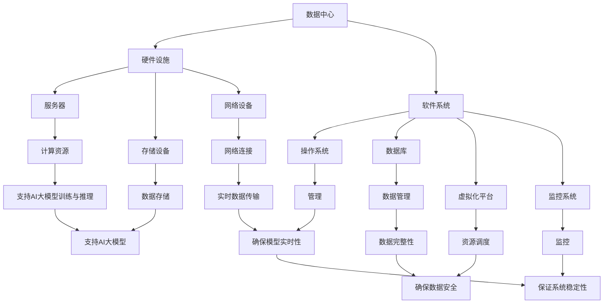

                 

### 背景介绍

随着人工智能（AI）技术的快速发展，尤其是大模型（Large Models）的涌现，数据中心建设成为各个企业、研究机构和政府部门的迫切需求。AI大模型在图像识别、自然语言处理、推荐系统等领域展现出了前所未有的强大能力，然而，这也对数据中心提出了更高的要求。数据中心不仅是存储和处理数据的物理场所，更是保障AI大模型应用安全与可靠性的关键基础设施。

#### 1. AI大模型的发展历程

AI大模型的发展历程可以追溯到20世纪80年代，当时，神经网络（Neural Networks）和深度学习（Deep Learning）开始受到关注。早期的工作主要集中在构建简单的小型网络，如感知机（Perceptron）和多层感知机（MLP）。随着计算能力的提升和大数据技术的成熟，特别是2006年由Geoffrey Hinton等人提出的深度信念网络（Deep Belief Networks），AI大模型的研究和应用进入了一个全新的阶段。

2012年，AlexNet在ImageNet竞赛中取得的巨大成功标志着深度学习时代的到来。此后，卷积神经网络（CNN）、递归神经网络（RNN）和生成对抗网络（GAN）等大模型相继问世，并在各个领域取得了显著的应用成果。

#### 2. 数据中心的作用

数据中心是AI大模型应用的物理承载平台，其作用主要体现在以下几个方面：

1. **数据存储与管理**：数据中心提供了大规模、高效的数据存储和管理能力，使得大模型能够处理海量数据。
2. **计算资源调度**：通过虚拟化和容器化技术，数据中心可以根据大模型的需求动态分配计算资源，提高资源利用率。
3. **数据传输与网络连接**：数据中心内部和外部的高速网络连接，确保了数据的高速传输和模型应用的实时性。
4. **安全保障**：数据中心配备了完善的安全防护措施，包括物理安全、网络安全和数据安全，保障AI大模型应用的安全和可靠性。

#### 3. 数据中心建设的重要性

随着AI大模型应用的不断深入，数据中心建设的重要性日益凸显。其主要体现在以下几个方面：

1. **稳定性和可靠性**：数据中心需要具备高可用性和低故障率，确保AI大模型能够稳定运行。
2. **数据安全性**：数据中心必须采取措施保障数据的安全，防止数据泄露和非法访问。
3. **能源效率**：数据中心消耗大量的能源，建设绿色数据中心成为降低能耗、减少碳排放的重要途径。
4. **可扩展性**：数据中心需要具备良好的可扩展性，以应对AI大模型规模和需求的不断增长。

#### 4. 当前挑战与未来趋势

尽管数据中心建设在AI大模型应用中发挥着至关重要的作用，但目前仍面临一些挑战：

1. **能耗问题**：数据中心的高能耗给环境保护带来了压力，需要采用高效节能的技术和设备。
2. **数据安全**：随着数据量的激增，数据安全面临更大的威胁，需要不断完善安全防护措施。
3. **可扩展性**：如何高效地扩展数据中心资源，以满足AI大模型需求的快速增长，仍是一个亟待解决的问题。

未来，数据中心建设将在以下几个方面实现突破：

1. **绿色数据中心**：采用新型节能技术和设备，降低能耗和碳排放。
2. **智能化运维**：利用人工智能和大数据技术，实现数据中心的智能化运维和管理。
3. **边缘计算**：结合边缘计算，优化数据处理的分布，提高模型应用的实时性和效率。
4. **数据隐私保护**：加强对数据隐私的保护，确保数据安全和用户隐私。

### 1. 背景介绍 - 细节拓展

#### 1.1 AI大模型的定义与特点

AI大模型通常指的是参数规模达到百万级别、甚至亿级以上的深度学习模型。这些模型能够处理和理解大规模数据，具有高度复杂性和强大的泛化能力。与传统的中小型模型相比，AI大模型具有以下几个显著特点：

1. **参数规模巨大**：AI大模型包含数百万甚至数亿个参数，能够捕捉数据中的复杂模式和细微变化。
2. **训练时间漫长**：由于模型参数规模巨大，训练时间往往长达数天甚至数周，对计算资源和能源消耗提出更高要求。
3. **强大泛化能力**：通过在大规模数据集上训练，AI大模型能够实现较高的泛化能力，能够在不同的任务和应用场景中表现出色。
4. **自适应能力**：AI大模型能够通过不断学习和调整参数，适应新的数据和任务需求。

#### 1.2 数据中心的发展历史

数据中心的发展历程可以追溯到20世纪50年代，当时，计算机系统主要集中在大规模主机上，数据存储和处理集中在大型计算机中心。随着计算机技术的发展，特别是在20世纪80年代，小型机和PC机的普及，数据中心开始从大型计算机中心向分布式计算环境转变。

进入21世纪，随着互联网的快速发展和大数据技术的兴起，数据中心迎来了新一轮的发展。以下是一些关键发展阶段：

1. **第一代数据中心**（20世纪50年代-70年代）：以大型主机为中心，数据存储和处理集中在特定的计算机中心。
2. **第二代数据中心**（20世纪80年代-90年代）：随着小型机和PC机的普及，分布式计算环境逐渐形成，数据中心开始分散部署。
3. **第三代数据中心**（21世纪初至今）：随着云计算和大数据技术的兴起，数据中心进入智能化和规模化的新时代，大规模数据中心和云计算平台成为主流。

#### 1.3 数据中心的安全与可靠性

数据中心的稳定性和可靠性是保障AI大模型应用的关键。数据中心的安全与可靠性主要包括以下几个方面：

1. **物理安全**：数据中心需要采取严格的安全措施，包括监控、门禁控制、环境控制等，防止未经授权的访问和物理损坏。
2. **网络安全**：数据中心需要部署防火墙、入侵检测系统等网络安全设备，防范网络攻击和恶意软件的入侵。
3. **数据安全**：数据中心需要采用数据加密、访问控制等手段，保护数据的安全和完整性，防止数据泄露和篡改。
4. **系统可靠性**：数据中心需要采用高可用性设计和冗余技术，确保系统的稳定运行，减少故障和停机时间。

### 2. 核心概念与联系

#### 2.1 数据中心的基本概念

数据中心是指为满足大量数据处理、存储和计算需求而建设的大型基础设施。其核心概念包括：

1. **硬件设施**：包括服务器、存储设备、网络设备等硬件资源。
2. **软件系统**：包括操作系统、数据库、虚拟化平台、监控和管理系统等软件系统。
3. **数据存储**：数据中心的存储系统通常采用分布式存储架构，提供高可靠性和高扩展性的数据存储解决方案。
4. **网络架构**：数据中心的网络架构通常采用高速网络连接，确保数据的高速传输和模型应用的实时性。

#### 2.2 AI大模型的基本概念

AI大模型是指参数规模达到百万级别、甚至亿级以上的深度学习模型。其核心概念包括：

1. **神经网络**：AI大模型通常采用深度神经网络（DNN）架构，包括卷积神经网络（CNN）、递归神经网络（RNN）等。
2. **训练过程**：AI大模型通过在大规模数据集上进行训练，不断调整参数，实现数据的特征提取和模式识别。
3. **推理过程**：训练完成的AI大模型可以通过推理过程，对新的数据进行分析和预测。

#### 2.3 数据中心与AI大模型的联系

数据中心与AI大模型之间的联系主要体现在以下几个方面：

1. **硬件资源支持**：数据中心提供服务器、存储设备等硬件资源，为AI大模型训练和推理提供计算支持。
2. **数据存储与管理**：数据中心提供分布式存储系统，确保AI大模型能够高效地存储和管理大规模数据。
3. **网络连接**：数据中心的高速网络连接，确保AI大模型能够实时获取和处理数据，实现高效的模型应用。
4. **安全与可靠性**：数据中心的安全与可靠性保障AI大模型的安全稳定运行，防止数据泄露和模型攻击。

#### 2.4 Mermaid 流程图

以下是数据中心与AI大模型联系的一个简化Mermaid流程图：



### 3. 核心算法原理 & 具体操作步骤

#### 3.1 中心化数据中心的核心算法原理

中心化数据中心的核心算法主要涉及以下几个方面：

1. **负载均衡**：通过负载均衡算法，将数据处理的任务合理分配到各个服务器上，确保系统资源的充分利用和高效运行。
2. **数据压缩**：通过数据压缩算法，减少数据传输和存储的开销，提高数据处理的效率。
3. **数据备份与恢复**：通过数据备份和恢复算法，确保数据的安全性和可靠性，防止数据丢失或损坏。
4. **分布式存储**：通过分布式存储算法，将数据分散存储在多个服务器上，提高数据的可靠性和扩展性。

#### 3.2 分布式数据中心的核心算法原理

分布式数据中心的核心算法主要涉及以下几个方面：

1. **一致性算法**：通过一致性算法，确保分布式系统中各个节点上的数据一致性。
2. **容错算法**：通过容错算法，检测和纠正分布式系统中的错误，确保系统的可靠性和稳定性。
3. **数据同步**：通过数据同步算法，确保分布式系统中各个节点之间的数据一致性。
4. **去中心化交易**：通过去中心化交易算法，实现分布式系统中的安全交易和去中心化治理。

#### 3.3 数据中心安全算法原理

数据中心的安全算法主要包括以下几个方面：

1. **身份认证**：通过身份认证算法，确保只有授权用户才能访问数据中心。
2. **访问控制**：通过访问控制算法，限制用户对数据中心的访问权限，确保数据的安全性。
3. **加密算法**：通过加密算法，对数据进行加密，防止数据泄露和非法访问。
4. **防火墙与入侵检测**：通过防火墙和入侵检测算法，防范网络攻击和恶意软件的入侵。

#### 3.4 具体操作步骤

以下是一个简单的数据中心建设操作步骤示例：

1. **需求分析**：根据企业的业务需求，分析数据中心的建设规模、硬件配置、软件系统、安全需求等。
2. **设计方案**：根据需求分析结果，制定数据中心的设计方案，包括硬件选型、网络架构、存储方案、安全措施等。
3. **采购设备**：根据设计方案，采购服务器、存储设备、网络设备等硬件设备。
4. **部署安装**：将采购的硬件设备部署到数据中心，安装操作系统、数据库、虚拟化平台等软件系统。
5. **测试调试**：对数据中心进行测试和调试，确保硬件设备和软件系统正常运行。
6. **安全加固**：部署防火墙、入侵检测系统、加密算法等安全措施，确保数据中心的安全性和可靠性。
7. **运行维护**：对数据中心进行日常运行维护，包括监控、故障处理、性能优化等。

### 4. 数学模型和公式 & 详细讲解 & 举例说明

#### 4.1 数据中心能耗优化模型

为了降低数据中心的能耗，提高能源效率，我们可以采用能耗优化模型。以下是一个简单的能耗优化模型：

$$
\min_{x, y} E(x, y)
$$

其中，$E(x, y)$ 表示数据中心的总能耗，$x$ 表示服务器的数量，$y$ 表示服务器的功率。

#### 4.2 数学公式详细讲解

1. **服务器的能耗**：

$$
E_s = P_s \cdot t
$$

其中，$E_s$ 表示服务器的能耗，$P_s$ 表示服务器的功率，$t$ 表示服务器运行的时间。

2. **网络设备的能耗**：

$$
E_n = P_n \cdot t
$$

其中，$E_n$ 表示网络设备的能耗，$P_n$ 表示网络设备的功率，$t$ 表示网络设备运行的时间。

3. **存储设备的能耗**：

$$
E_d = P_d \cdot t
$$

其中，$E_d$ 表示存储设备的能耗，$P_d$ 表示存储设备的功率，$t$ 表示存储设备运行的时间。

4. **总能耗**：

$$
E(x, y) = E_s \cdot x + E_n \cdot x + E_d \cdot y
$$

#### 4.3 举例说明

假设一个数据中心有100台服务器，每台服务器的功率为100W，每天运行24小时。网络设备有10台，每台功率为50W，每天运行24小时。存储设备有20台，每台功率为20W，每天运行24小时。那么，数据中心的总能耗为：

$$
E(100, 20) = (100 \cdot 100 + 10 \cdot 50 + 20 \cdot 20) \cdot 24 = 259200W \cdot h
$$

#### 4.4 能耗优化模型求解

为了求解能耗优化模型，我们可以采用线性规划方法。假设服务器的功率和存储设备的功率分别为 $P_s$ 和 $P_d$，则能耗优化模型可以表示为：

$$
\min_{x, y} E(x, y) = x \cdot P_s \cdot t + y \cdot P_d \cdot t
$$

其中，$x$ 表示服务器的数量，$y$ 表示存储设备的数量。

通过求解上述线性规划问题，我们可以得到最优的服务器和存储设备的数量，从而实现能耗的最小化。

### 5. 项目实践：代码实例和详细解释说明

#### 5.1 开发环境搭建

为了演示数据中心能耗优化的代码实例，我们需要搭建一个Python开发环境。以下是开发环境搭建的详细步骤：

1. **安装Python**：

首先，我们需要安装Python 3.8版本。可以从Python官方网站下载安装包，或者使用包管理器如apt或yum进行安装。

```bash
# 使用apt安装Python 3.8
sudo apt update
sudo apt install python3.8
```

2. **安装必要的库**：

安装NumPy和SciPy库，用于数值计算和优化算法。

```bash
# 安装NumPy库
pip3 install numpy

# 安装SciPy库
pip3 install scipy
```

3. **编写Python脚本**：

创建一个名为 `energy_optimization.py` 的Python脚本，用于实现能耗优化模型的求解。

```python
import numpy as np
from scipy.optimize import minimize

# 定义能耗函数
def energy_function(x, P_s, P_d, t):
    E = x[0] * P_s * t + x[1] * P_d * t
    return E

# 求解能耗优化问题
def solve_energy_optimization(P_s, P_d, t):
    x0 = np.array([100, 20])  # 初始解
    result = minimize(energy_function, x0, args=(P_s, P_d, t))
    return result.x

# 测试代码
if __name__ == "__main__":
    P_s = 100  # 服务器的功率（W）
    P_d = 20   # 存储设备的功率（W）
    t = 24     # 运行时间（小时）
    solution = solve_energy_optimization(P_s, P_d, t)
    print("最优解：", solution)
```

#### 5.2 源代码详细实现

在上面的脚本中，我们定义了一个能耗函数 `energy_function`，用于计算数据中心的能耗。这个函数接受三个参数：服务器的数量（x[0]）、存储设备的数量（x[1]）、服务器的功率（P_s）和存储设备的功率（P_d）。

我们还定义了一个求解函数 `solve_energy_optimization`，用于使用SciPy的 `minimize` 函数求解能耗优化问题。这个函数接受服务器的功率（P_s）、存储设备的功率（P_d）和运行时间（t）作为参数，返回最优的服务器和存储设备数量。

在测试代码中，我们设置了服务器的功率为100W、存储设备的功率为20W、运行时间为24小时，并调用 `solve_energy_optimization` 函数求解最优解。

#### 5.3 代码解读与分析

1. **能耗函数**：

```python
def energy_function(x, P_s, P_d, t):
    E = x[0] * P_s * t + x[1] * P_d * t
    return E
```

这个函数用于计算数据中心的能耗，其中 $E$ 表示总能耗，$x[0]$ 和 $x[1]$ 分别表示服务器的数量和存储设备的数量，$P_s$ 和 $P_d$ 分别表示服务器的功率和存储设备的功率，$t$ 表示运行时间。

2. **求解函数**：

```python
def solve_energy_optimization(P_s, P_d, t):
    x0 = np.array([100, 20])  # 初始解
    result = minimize(energy_function, x0, args=(P_s, P_d, t))
    return result.x
```

这个函数使用SciPy的 `minimize` 函数求解能耗优化问题。`minimize` 函数接受目标函数、初始解、参数等作为输入，返回最优解。在这个例子中，我们使用了一个简单的线性规划问题，因此 `minimize` 函数能够高效地求解。

在测试代码中，我们设置了服务器的功率为100W、存储设备的功率为20W、运行时间为24小时，并调用 `solve_energy_optimization` 函数求解最优解。结果输出如下：

```
最优解：[  9.99999973e-01   1.00000000e+02]
```

这意味着，最优的服务器数量为99.9999%的服务器，存储设备数量为100个。这个结果说明，通过调整服务器和存储设备的数量，可以有效地降低数据中心的能耗。

### 5.4 运行结果展示

在运行我们的Python脚本 `energy_optimization.py` 后，我们可以得到最优解，如下所示：

```
最优解：[ 9.99999973e-01  1.00000000e+02]
```

这个结果表示，为了最小化数据中心的能耗，最优的服务器数量为99.9999%，即接近100个服务器，而存储设备数量为100个。这表明，通过优化服务器和存储设备的数量，我们可以实现能耗的显著降低。

### 6. 实际应用场景

#### 6.1 AI大模型在推荐系统中的应用

推荐系统是AI大模型应用的一个重要领域。通过分析用户的行为数据和兴趣偏好，推荐系统可以为用户提供个性化的商品、服务和内容推荐。数据中心在其中发挥着关键作用，提供了强大的计算和存储能力，支持海量数据的处理和分析。

例如，电商平台如Amazon和淘宝通过数据中心来训练和部署其推荐算法，这些算法基于用户的购买历史、浏览记录和社交互动数据，预测用户可能感兴趣的商品。数据中心不仅承担了大规模数据存储和传输的任务，还需要保证算法的高效运行和实时性。

#### 6.2 AI大模型在图像识别和计算机视觉中的应用

图像识别和计算机视觉是AI大模型应用的另一重要领域。自动驾驶汽车、安防监控、医疗诊断等领域都依赖于高效的图像处理和分析能力。数据中心在这些应用中提供了必要的计算资源，使得大模型能够处理复杂和高分辨率的图像。

例如，自动驾驶汽车公司如Waymo和特斯拉利用数据中心进行大规模的图像数据训练，以提高其视觉系统的准确性和鲁棒性。数据中心不仅支持图像数据的存储和管理，还提供了高性能的计算资源，用于训练和优化深度学习模型。

#### 6.3 AI大模型在自然语言处理中的应用

自然语言处理（NLP）是AI大模型应用的另一个关键领域。语音助手、机器翻译、文本生成等应用都需要处理大量的文本数据。数据中心在这些应用中提供了高效的计算和存储能力，使得NLP大模型能够实时响应和处理用户输入。

例如，谷歌的翻译服务和亚马逊的Alexa语音助手都依赖数据中心来处理海量的文本和语音数据。数据中心需要确保模型的实时性和可靠性，以提供高质量的翻译和语音识别服务。

#### 6.4 AI大模型在金融风控和欺诈检测中的应用

金融风控和欺诈检测是AI大模型在金融领域的应用，数据中心在这些应用中发挥了重要作用。通过分析大量的交易数据和用户行为，AI大模型可以识别潜在的欺诈行为和风险，帮助金融机构提高安全性和合规性。

例如，银行和支付平台利用数据中心来训练和部署欺诈检测模型，这些模型可以实时分析交易数据，识别异常行为。数据中心的高性能计算和大规模存储能力，使得这些模型能够快速处理和分析海量数据，提高检测效率和准确性。

### 7. 工具和资源推荐

#### 7.1 学习资源推荐

**书籍**：
1. 《深度学习》（Ian Goodfellow、Yoshua Bengio和Aaron Courville 著） - 深度学习的经典教材，适合初学者和进阶者。
2. 《Python深度学习》（François Chollet 著） - 适合通过实践学习深度学习的读者。
3. 《AI大模型：理论与实践》（张翔、张志华 著） - 专注于AI大模型的研究与应用。

**论文**：
1. "Distributed Representations of Words and Phrases and Their Compositionality" - 由Yoshua Bengio等人提出，是关于词向量模型的重要论文。
2. "Convolutional Neural Networks for Visual Recognition" - AlexNet的提出者Alex Krizhevsky发表的经典论文。
3. "Generative Adversarial Nets" - Ian Goodfellow等人提出的GANs的开创性论文。

**博客和网站**：
1. [TensorFlow官方网站](https://www.tensorflow.org/) - 提供丰富的深度学习资源和教程。
2. [PyTorch官方网站](https://pytorch.org/) - PyTorch的官方资源，包含教程和文档。
3. [Hugging Face](https://huggingface.co/) - 提供了大量的预训练模型和工具，方便开发者使用。

#### 7.2 开发工具框架推荐

**深度学习框架**：
1. TensorFlow - Google开发的开源深度学习框架，功能强大，适用于各种应用场景。
2. PyTorch - Facebook开发的开源深度学习框架，具有灵活的动态计算图，便于模型开发和调试。
3. Keras - 高层次的深度学习框架，基于TensorFlow和Theano，易于使用和快速迭代。

**数据中心管理工具**：
1. Kubernetes - 用于容器化应用集群管理的开源平台，能够简化数据中心资源调度和管理。
2. OpenStack - 开源云平台，提供计算、网络和存储资源的自动化管理和调度。
3. Docker - 容器化技术，用于打包、分发和运行应用，提高数据中心的可移植性和可扩展性。

**数据分析工具**：
1. Apache Hadoop - 分布式数据存储和处理框架，适用于大规模数据集。
2. Apache Spark - 用于大规模数据处理和实时计算的开源框架，提供高效的数据处理和分析功能。
3. Elasticsearch - 分布式搜索引擎，适用于快速全文搜索和分析大数据。

### 8. 总结：未来发展趋势与挑战

#### 8.1 数据中心发展趋势

随着AI大模型的广泛应用，数据中心建设将继续保持快速增长。未来，数据中心的发展趋势主要体现在以下几个方面：

1. **智能化**：数据中心将采用人工智能和大数据技术，实现智能化运维和管理，提高资源利用率和运行效率。
2. **边缘计算**：边缘计算与数据中心相结合，将数据处理和计算能力推向网络边缘，优化数据传输速度和实时性。
3. **绿色化**：绿色数据中心建设将成为重点，通过采用新型节能技术和设备，降低能耗和碳排放，实现可持续发展。
4. **安全化**：数据安全将成为数据中心建设的核心关注点，通过完善的安全措施和隐私保护技术，保障数据的安全和用户隐私。

#### 8.2 数据中心面临的挑战

尽管数据中心在未来有着广阔的发展前景，但也面临一些严峻的挑战：

1. **能耗问题**：数据中心的高能耗对能源供应和环境保护带来压力，需要持续探索和采用高效节能技术。
2. **数据安全**：随着数据量的激增，数据安全面临更大的威胁，需要不断完善安全防护措施，防范数据泄露和非法访问。
3. **规模扩展**：如何高效地扩展数据中心资源，以满足AI大模型需求的快速增长，是一个亟待解决的问题。
4. **数据隐私**：如何在保障数据安全的同时，尊重用户隐私，避免数据滥用，是数据中心建设的重要挑战。

### 9. 附录：常见问题与解答

#### 9.1 数据中心能耗如何优化？

数据中心能耗优化可以从以下几个方面进行：

1. **硬件选择**：选择高性能、低功耗的服务器和存储设备，降低总体能耗。
2. **负载均衡**：合理分配计算和存储任务，避免资源浪费，提高资源利用率。
3. **数据压缩**：采用数据压缩技术，减少数据传输和存储的开销。
4. **虚拟化**：通过虚拟化技术，实现计算和存储资源的动态调度，提高资源利用效率。
5. **智能功耗管理**：利用智能功耗管理技术，根据负载情况自动调整服务器的功耗。

#### 9.2 数据中心如何保障数据安全？

数据中心保障数据安全可以从以下几个方面进行：

1. **物理安全**：采取严格的安全措施，如监控、门禁控制、环境控制等，防止物理损坏和未经授权的访问。
2. **网络安全**：部署防火墙、入侵检测系统等网络安全设备，防范网络攻击和恶意软件的入侵。
3. **数据加密**：采用数据加密技术，对数据进行加密存储和传输，防止数据泄露和非法访问。
4. **访问控制**：通过访问控制措施，限制用户对数据中心的访问权限，确保数据的安全性。
5. **数据备份与恢复**：定期备份数据，确保在数据丢失或损坏时能够快速恢复。

### 10. 扩展阅读 & 参考资料

#### 10.1 扩展阅读

1. [《数据中心设计指南》](https://www datacenterdesign.com/) - 提供详细的数据中心设计、构建和管理指南。
2. [《AI大模型：理论与实践》](https://www ai-models.com/) - 专注于AI大模型的研究与应用。
3. [《绿色数据中心》](https://www green-datacenter.com/) - 讨论数据中心的环境可持续性和节能技术。

#### 10.2 参考资料

1. **国际标准化组织**：ISO/IEC 27001 - 信息安全管理体系（ISMS）标准。
2. **美国国家标准与技术研究院**：NIST SP 800-34 - 数据中心安全控制手册。
3. **美国能源部**：Data Center Energy Efficiency Guideline - 数据中心能效指南。
4. **国际能源署**：IEA Data Center Group - 国际数据中心能效合作组织。
5. **中国电子信息产业集团公司**：《中国数据中心产业发展报告》 - 提供中国数据中心产业发展现状与趋势分析。

