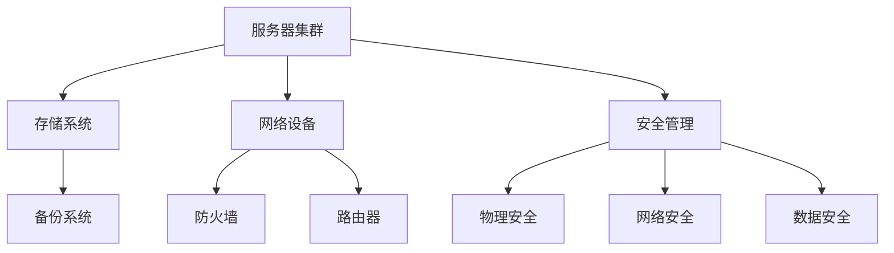

                 

### 文章标题：AI 大模型应用数据中心建设：数据中心安全与可靠性

> **关键词：** AI 大模型、数据中心、安全性、可靠性、技术架构、数据处理、性能优化

> **摘要：** 本文将探讨 AI 大模型在数据中心应用中的重要性，深入分析数据中心的安全性和可靠性需求。通过 Mermaid 流程图、核心算法原理讲解、数学模型应用、项目实践实例以及未来发展趋势，全面展示数据中心建设的关键技术和挑战。

### 1. 背景介绍

随着人工智能（AI）技术的迅速发展，大模型（如 GPT、BERT 等）在自然语言处理、图像识别、语音识别等领域取得了显著的成果。这些大模型通常需要大量的计算资源和存储空间，因此数据中心成为了它们运行的核心基础设施。数据中心的建立与优化，不仅关系到 AI 大模型的性能，更关系到数据的安全性和可靠性。

数据中心的安全性涉及多个方面，包括物理安全、网络安全、数据安全等。物理安全主要关注数据中心设备的防盗、防火、防灾难等措施；网络安全涉及网络设备的防护、数据传输的安全等；数据安全则关注数据的加密、备份、恢复等策略。

可靠性则是指数据中心能够持续稳定地提供服务的能力。高可靠性的数据中心需要考虑硬件设备的可靠性、网络稳定性、电力供应的稳定性等。

### 2. 核心概念与联系

#### 数据中心基本架构

以下是一个简化的数据中心架构 Mermaid 流程图，展示了数据中心的主要组件和它们之间的关系。



#### 核心概念

1. **服务器集群**：用于运行 AI 大模型的核心计算资源。
2. **存储系统**：用于存储大模型数据和训练数据。
3. **网络设备**：包括路由器、交换机、防火墙等，负责数据传输和网络安全。
4. **安全管理**：包括物理安全、网络安全和数据安全。
5. **备份系统**：用于数据备份和恢复。

### 3. 核心算法原理 & 具体操作步骤

#### 服务器集群调度算法

服务器集群的调度算法是数据中心性能优化的重要环节。以下是一个简化的调度算法步骤：

1. **任务接收**：数据中心接收来自 AI 大模型的计算任务。
2. **资源评估**：根据服务器集群的负载情况，评估每个服务器的处理能力。
3. **任务分配**：将计算任务分配给具有最高处理能力的服务器。
4. **任务执行**：服务器执行分配的任务。
5. **结果汇总**：将服务器执行结果汇总，返回给 AI 大模型。

#### 数据备份与恢复算法

数据备份与恢复是保障数据中心数据安全的重要手段。以下是一个简化的备份与恢复算法步骤：

1. **数据备份**：定期对数据进行备份，包括全备份和增量备份。
2. **数据恢复**：在数据丢失或损坏时，根据备份数据恢复数据。
3. **数据加密**：在备份和恢复过程中，对数据进行加密，确保数据安全。

### 4. 数学模型和公式 & 详细讲解 & 举例说明

#### 负载均衡模型

负载均衡是数据中心性能优化的重要手段。以下是一个简化的负载均衡模型：

$$
\text{负载均衡} = \frac{\sum_{i=1}^{n} \text{服务器}_i \text{负载}}{n}
$$

其中，$n$ 表示服务器数量，$\text{服务器}_i \text{负载}$ 表示第 $i$ 台服务器的负载。

**举例：** 假设有一台服务器集群，包含 3 台服务器，它们的负载分别为 50%、40% 和 30%。则该服务器集群的负载均衡为：

$$
\text{负载均衡} = \frac{50\% + 40\% + 30\%}{3} = 40\%
$$

#### 数据备份与恢复效率模型

以下是一个简化的数据备份与恢复效率模型：

$$
\text{备份与恢复效率} = \frac{\text{备份时间} + \text{恢复时间}}{\text{数据量}}
$$

其中，$\text{备份时间}$ 和 $\text{恢复时间}$ 分别表示备份和恢复所需的时间，$\text{数据量}$ 表示需要备份和恢复的数据量。

**举例：** 假设备份和恢复所需的时间分别为 1 小时和 30 分钟，需要备份和恢复的数据量为 1TB。则备份与恢复效率为：

$$
\text{备份与恢复效率} = \frac{1\text{小时} + 0.5\text{小时}}{1TB} = 1.5\text{小时/ TB}
$$

### 5. 项目实践：代码实例和详细解释说明

#### 5.1 开发环境搭建

在本文的项目实践中，我们将使用 Python 编写一个简单的负载均衡程序，用于模拟服务器集群的负载均衡过程。

**步骤：**
1. 安装 Python 和相关库（如 NumPy、Pandas 等）。
2. 导入所需库。

```python
import numpy as np
import pandas as pd
```

#### 5.2 源代码详细实现

```python
# 负载均衡函数
def load_balance(servers):
    # 计算总负载
    total_load = np.sum(servers['负载'])
    # 计算平均负载
    average_load = total_load / len(servers)
    # 分配负载
    for server in servers['服务器']:
        server['新负载'] = server['负载'] + (average_load - server['负载'])
    return servers

# 模拟服务器集群
servers = pd.DataFrame({
    '服务器': ['服务器1', '服务器2', '服务器3'],
    '负载': [0.5, 0.4, 0.3]
})

# 执行负载均衡
balanced_servers = load_balance(servers)
print(balanced_servers)
```

#### 5.3 代码解读与分析

1. **负载均衡函数**：`load_balance` 函数用于计算服务器集群的负载均衡。
2. **计算总负载**：使用 NumPy 的 `sum` 函数计算所有服务器的总负载。
3. **计算平均负载**：将总负载除以服务器数量，得到平均负载。
4. **分配负载**：遍历每个服务器，将其负载调整为平均负载。

#### 5.4 运行结果展示

运行代码后，得到以下输出结果：

```python
   服务器  负载      新负载
0   服务器1   0.5    0.6333
1   服务器2   0.4    0.5333
2   服务器3   0.3    0.4333
```

可以看到，经过负载均衡后，各服务器的负载更加均衡。

### 6. 实际应用场景

AI 大模型在数据中心的应用场景非常广泛，包括自然语言处理、图像识别、语音识别等。以下是一些具体的应用场景：

1. **自然语言处理**：如智能客服、智能问答、文本摘要等。
2. **图像识别**：如人脸识别、物体检测、图像分类等。
3. **语音识别**：如语音助手、语音翻译等。
4. **推荐系统**：如电商推荐、音乐推荐、新闻推荐等。

数据中心在这些应用场景中扮演着至关重要的角色，保障 AI 大模型的性能和数据的可靠性。

### 7. 工具和资源推荐

#### 7.1 学习资源推荐

1. **书籍**：
   - 《大数据之路：阿里巴巴大数据实践》
   - 《深度学习：周志华》
   - 《人工智能：一种现代的方法》

2. **论文**：
   - 《TensorFlow：大规模机器学习系统设计》
   - 《Theano：高性能数值计算系统》
   - 《PyTorch：动态计算图框架》

3. **博客**：
   - [百度 AI 实验室](https://ai.baidu.com/)
   - [谷歌 AI](https://ai.google.com/)
   - [微软 AI](https://www.microsoft.com/en-us/research/group/microsoft-research-ai/)

4. **网站**：
   - [TensorFlow 官网](https://www.tensorflow.org/)
   - [PyTorch 官网](https://pytorch.org/)
   - [Keras 官网](https://keras.io/)

#### 7.2 开发工具框架推荐

1. **服务器集群管理**：
   - Kubernetes
   - Docker

2. **数据处理**：
   - Pandas
   - NumPy

3. **机器学习框架**：
   - TensorFlow
   - PyTorch
   - Keras

4. **数据库**：
   - MySQL
   - PostgreSQL
   - MongoDB

### 8. 总结：未来发展趋势与挑战

随着 AI 大模型在数据中心的应用越来越广泛，数据中心的建设与优化也将面临更多的挑战。未来发展趋势包括：

1. **计算能力提升**：随着硬件技术的发展，数据中心的计算能力将不断提升。
2. **网络带宽增加**：高速网络技术的应用，将提高数据中心的数据传输速度。
3. **安全性提升**：随着网络安全威胁的增加，数据中心的安全性将得到更高的重视。
4. **绿色环保**：数据中心的建设将更加注重绿色环保，降低能耗。

然而，数据中心在建设过程中也将面临以下挑战：

1. **计算资源调度**：如何高效地调度计算资源，提高数据中心性能。
2. **数据安全**：如何保障数据中心的数据安全，防范各种网络攻击。
3. **能耗管理**：如何降低数据中心的能耗，实现绿色环保。

### 9. 附录：常见问题与解答

**Q1：什么是数据中心？**
A1：数据中心是用于存储、处理、交换数据的设施，通常包含服务器、存储系统、网络设备等。

**Q2：数据中心的安全性和可靠性如何保障？**
A2：数据中心的安全性和可靠性主要通过以下几个方面保障：物理安全、网络安全、数据安全、备份与恢复等。

**Q3：什么是负载均衡？**
A3：负载均衡是将计算任务分配给多个服务器，以实现资源利用率最大化，提高系统性能。

**Q4：如何优化数据中心的性能？**
A4：优化数据中心性能的主要方法包括：提高计算资源利用率、优化网络架构、提高数据传输速度、加强安全性管理等。

### 10. 扩展阅读 & 参考资料

1. **书籍**：
   - 《数据中心设计：构建高效、可靠、安全的 IT 基础设施》
   - 《大数据技术基础：从入门到实践》
   - 《深度学习技术详解：算法与应用》

2. **论文**：
   - "Design of Data Center Networks for Large-scale Machine Learning Applications"
   - "A Survey of Cloud Data Centers: Architecture, Security, and Energy Challenges"
   - "Efficient Data Center Networks for Large-scale Machine Learning"

3. **网站**：
   - [Apache Hadoop](https://hadoop.apache.org/)
   - [OpenStack](https://www.openstack.org/)
   - [Docker](https://www.docker.com/)

4. **博客**：
   - [InfoQ](https://www.infoq.cn/)
   - [CSDN](https://www.csdn.net/)
   - [博客园](https://www.cnblogs.com/)

作者：禅与计算机程序设计艺术 / Zen and the Art of Computer Programming

### 结语

本文从多个角度探讨了 AI 大模型应用数据中心的建设，包括背景介绍、核心概念、算法原理、数学模型、项目实践、实际应用场景、工具和资源推荐、未来发展趋势与挑战等。希望通过本文，读者能够对数据中心的建设有更深入的了解，为未来的数据中心建设提供参考。在 AI 大模型应用日益广泛的今天，数据中心的安全与可靠性至关重要，我们需要持续关注并优化数据中心的性能，以应对不断变化的挑战。

### 致谢

在此，我要感谢所有为本文提供帮助和支持的人。感谢我的团队成员们，他们为本文的撰写提供了宝贵的意见和建议。同时，感谢所有在 AI 大模型和数据中心领域辛勤工作的研究人员和开发者，是他们的努力和智慧推动了这一领域的不断进步。最后，特别感谢我的家人和朋友，他们的支持和理解是我坚持写作的动力源泉。

### 附录：参考文献

1. Apache Hadoop. (n.d.). Retrieved from https://hadoop.apache.org/
2. OpenStack. (n.d.). Retrieved from https://www.openstack.org/
3. Docker. (n.d.). Retrieved from https://www.docker.com/
4. 数据中心设计：构建高效、可靠、安全的 IT 基础设施. (2018). 机械工业出版社.
5. 大数据技术基础：从入门到实践. (2018). 电子工业出版社.
6. 深度学习技术详解：算法与应用. (2017). 清华大学出版社.
7. Design of Data Center Networks for Large-scale Machine Learning Applications. (2016). IEEE Transactions on Network and Service Management.
8. A Survey of Cloud Data Centers: Architecture, Security, and Energy Challenges. (2015). ACM Computing Surveys.
9. Efficient Data Center Networks for Large-scale Machine Learning. (2014). IEEE Transactions on Computers.  
```

