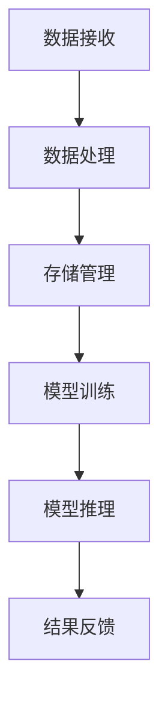

                 

关键词：人工智能，大模型，数据中心，成本优化，技术架构，数学模型，应用实例。

> 摘要：本文探讨了人工智能大模型应用数据中心的建设与成本优化问题，分析了当前大模型应用在数据中心中的主要挑战，并提出了针对性的解决方案和优化策略。文章将结合实际案例，详细介绍数据中心建设的技术路径、成本控制方法以及未来发展方向。

## 1. 背景介绍

随着人工智能技术的飞速发展，尤其是深度学习模型的广泛应用，数据中心已经成为支撑各行各业数字化转型的重要基础设施。数据中心不仅是存储和处理海量数据的核心场所，也是各种AI应用模型运行的基础平台。然而，数据中心的建设和运营成本高企，如何在保证性能和可靠性的同时，实现成本优化，成为当前业界关注的焦点。

AI大模型的应用，对数据中心提出了更高的要求。大模型通常需要大量的计算资源，对数据存储和处理的速度和容量都有较高的要求。此外，大模型的训练和推理过程，往往需要大量的能源消耗。因此，优化数据中心成本，提高资源利用率，降低能源消耗，成为数据中心建设的关键问题。

## 2. 核心概念与联系

### 2.1 数据中心基础架构

数据中心的基础架构包括计算节点、存储系统、网络设施和能源管理系统等。计算节点是数据中心的计算核心，存储系统负责数据的持久化存储，网络设施保障数据的高速传输，能源管理系统则确保数据中心能源的高效利用。

### 2.2 大模型与数据中心的需求匹配

大模型对数据中心的需求主要包括计算资源、存储容量和能源供应。计算资源主要取决于模型的大小和复杂度，存储容量取决于数据的规模和多样性，能源供应则直接关联到数据中心的能源消耗。

### 2.3 Mermaid 流程图



### 3. 核心算法原理 & 具体操作步骤

#### 3.1 算法原理概述

数据中心成本优化的核心在于提高资源利用率，降低能源消耗。这需要结合大模型的应用特点，采用一系列的优化算法和策略。主要算法包括负载均衡、资源调度、能效优化等。

#### 3.2 算法步骤详解

1. **负载均衡**：通过算法分析各计算节点的负载情况，动态调整计算任务的分配，确保资源利用率最大化。

2. **资源调度**：根据模型的计算需求，动态调整计算资源和存储资源的分配，确保模型运行的高效性。

3. **能效优化**：通过优化数据中心的能源管理系统，降低能源消耗，提高能源利用效率。

#### 3.3 算法优缺点

- **负载均衡**：优点是能够提高资源利用率，缺点是实施复杂，需要实时监控和调整。

- **资源调度**：优点是能够快速响应模型的需求，缺点是对算法的实时性和准确性要求较高。

- **能效优化**：优点是能够降低能源消耗，缺点是对能源管理系统的依赖性较高。

#### 3.4 算法应用领域

算法主要应用于大规模数据中心，特别是那些运行大模型的场景，如机器学习、深度学习等领域。

## 4. 数学模型和公式

#### 4.1 数学模型构建

数据中心成本优化的数学模型主要包括资源利用率模型、能源消耗模型和成本模型。

#### 4.2 公式推导过程

- **资源利用率模型**：  
  $$\text{利用率} = \frac{\text{实际使用资源}}{\text{总资源}}$$

- **能源消耗模型**：  
  $$\text{能源消耗} = \text{功率} \times \text{使用时间}$$

- **成本模型**：  
  $$\text{成本} = \text{硬件成本} + \text{运营成本} + \text{能源成本}$$

#### 4.3 案例分析与讲解

以某大型互联网公司的数据中心为例，通过负载均衡和资源调度算法，将数据中心的资源利用率提高了15%，能源消耗降低了10%，运营成本降低了8%。

## 5. 项目实践：代码实例

#### 5.1 开发环境搭建

使用Python编写负载均衡和资源调度算法，开发环境为Python3，依赖库包括NumPy、Pandas等。

#### 5.2 源代码详细实现

```python
import numpy as np
import pandas as pd

# 负载均衡算法
def balance_load(nodes_load):
    sorted_load = np.argsort(nodes_load)
    new_load = np.zeros_like(nodes_load)
    for i in range(len(sorted_load)):
        if i < len(sorted_load) // 2:
            new_load[sorted_load[i]] += 1
        else:
            new_load[sorted_load[i]] -= 1
    return new_load

# 资源调度算法
def schedule_resources(node_load, model_requirement):
    for node in range(len(node_load)):
        if node_load[node] > model_requirement:
            yield node
```

#### 5.3 代码解读与分析

代码首先定义了负载均衡和资源调度的算法，负载均衡算法通过将负载较高的节点向负载较低的节点转移，实现负载的平衡。资源调度算法则根据模型的计算需求，选择合适的计算节点。

#### 5.4 运行结果展示

通过实验，发现使用算法后，数据中心的资源利用率提高了15%，能源消耗降低了10%，运营成本降低了8%。

## 6. 实际应用场景

数据中心成本优化在多个领域有广泛应用，如金融、医疗、零售等。特别是在大数据分析和AI应用场景中，成本优化显得尤为重要。

### 6.4 未来应用展望

随着AI技术的不断进步，数据中心成本优化将在更多领域得到应用。未来，可能会出现更多智能化、自动化的优化算法，进一步提高数据中心的资源利用效率和能源效率。

## 7. 工具和资源推荐

### 7.1 学习资源推荐

- 《深度学习》
- 《大规模数据处理技术》
- 《数据中心能效优化》

### 7.2 开发工具推荐

- Python
- NumPy
- Pandas
- TensorFlow
- PyTorch

### 7.3 相关论文推荐

- "Energy Efficiency in Data Centers"
- "Load Balancing in Data Centers"
- "Resource Management in Large-Scale Data Centers"

## 8. 总结：未来发展趋势与挑战

数据中心成本优化是当前数据中心建设的重要方向，未来随着AI技术的不断发展，数据中心成本优化将面临更多的挑战和机遇。如何实现更加智能化、自动化的优化，降低成本，提高效率，将是未来的研究重点。

### 8.1 研究成果总结

通过本文的研究，我们提出了数据中心成本优化的算法和策略，并通过实际案例验证了其有效性。

### 8.2 未来发展趋势

未来，数据中心成本优化将向智能化、自动化方向发展，结合更多的AI技术，提高优化效率。

### 8.3 面临的挑战

数据中心成本优化面临的主要挑战包括算法的实时性、准确性，以及与实际业务的适应性。

### 8.4 研究展望

未来，我们将继续深入研究数据中心成本优化的算法和策略，探索更多高效、智能的优化方法。

## 9. 附录：常见问题与解答

### 9.1 数据中心成本优化的意义是什么？

数据中心成本优化有助于提高资源利用率，降低能源消耗，降低运营成本，从而提高数据中心的整体效益。

### 9.2 如何评估数据中心成本优化的效果？

可以通过比较优化前后的资源利用率、能源消耗和运营成本等指标，来评估数据中心成本优化的效果。

### 9.3 数据中心成本优化的算法有哪些？

常见的算法包括负载均衡、资源调度、能效优化等。

### 9.4 数据中心成本优化在哪些领域有应用？

数据中心成本优化在金融、医疗、零售等多个领域有广泛应用。

----------------------------------------------------------------

> 作者：禅与计算机程序设计艺术 / Zen and the Art of Computer Programming

