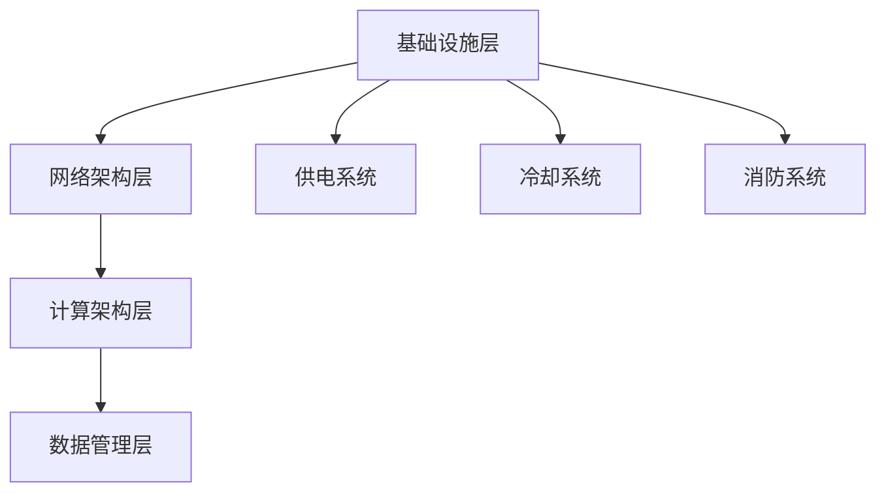
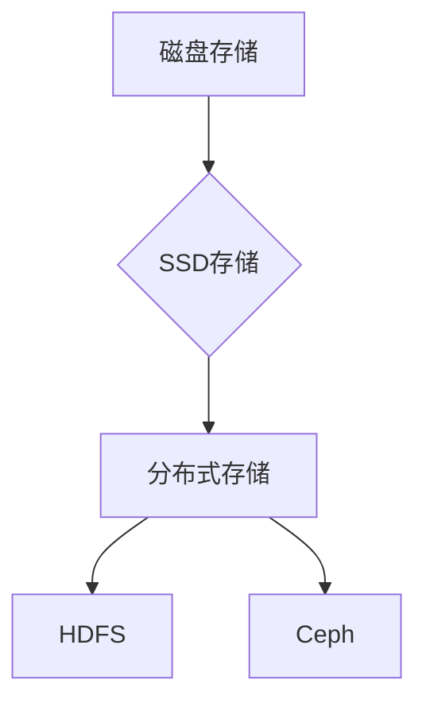
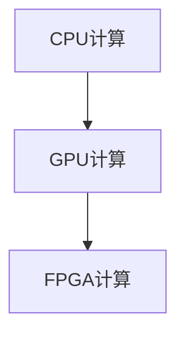
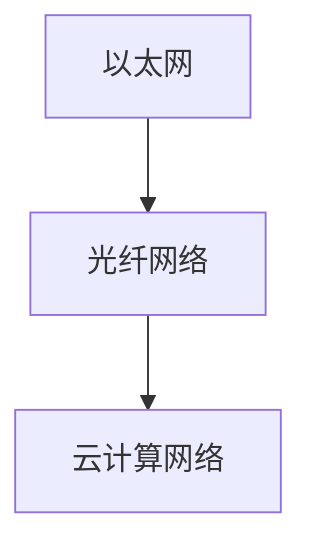

                 

### 1. 背景介绍

随着人工智能技术的飞速发展，大模型应用逐渐成为各行各业的焦点。无论是自动驾驶、智能语音助手，还是医疗诊断、金融风控，大模型的应用都在不断拓宽其影响力。然而，大模型的应用不仅仅依赖于先进的算法和强大的计算能力，更需要高效、稳定的数据中心作为支撑。

数据中心作为大模型应用的基石，承担着数据存储、计算和传输的关键角色。然而，数据中心的建设并非一蹴而就，它涉及众多技术领域的交叉与融合。首先，数据中心需要满足大规模数据存储的需求，这就要求存储系统的性能和容量必须达到一个新高度。其次，数据中心需要具备高效的计算能力，以支持大模型进行复杂运算。此外，数据中心的网络架构也必须具备高可靠性、低延迟的特点，以保证数据传输的顺畅。

在本文中，我们将深入探讨大模型应用数据中心的建设技术与应用。首先，我们将介绍数据中心的核心概念和架构，通过Mermaid流程图展示其整体结构。然后，我们将分析数据中心的关键技术，包括存储技术、计算技术和网络技术。接下来，我们将详细介绍大模型在数据中心中的应用，以及如何通过数据中心技术提升大模型的应用性能。最后，我们将讨论数据中心在实际应用场景中的挑战与解决方案，并展望其未来发展趋势与挑战。

通过本文的详细探讨，我们希望读者能够对大模型应用数据中心的建设有更加深入的了解，为未来在大模型领域的研究与应用提供有益的参考。

### 2. 核心概念与联系

#### 2.1 数据中心的基本概念

数据中心（Data Center）是集计算、存储、网络等多种资源于一体的综合性设施，为各种应用场景提供高效的数据处理和存储服务。数据中心的基本概念包括以下几个方面：

- **计算资源**：数据中心通过服务器、存储设备和网络设备等硬件资源，提供计算能力，支持数据处理和应用程序的运行。
- **存储资源**：数据中心通过分布式存储系统，提供海量数据的存储和管理能力，支持数据的持久化和备份。
- **网络资源**：数据中心通过高速网络连接各种设备和应用，确保数据传输的可靠性和高效性。

#### 2.2 数据中心架构

数据中心架构是数据中心建设和运维的核心，决定了数据中心的性能、可靠性和扩展性。常见的数据中心架构包括以下几层：

- **基础设施层**：包括机房建设、供电系统、冷却系统、消防系统等，提供数据中心运行的基本环境。
- **网络架构层**：包括数据中心内部网络、外部网络和云网络，确保数据的高效传输和互操作性。
- **计算架构层**：包括计算节点、存储节点和虚拟化平台，提供计算和存储资源的管理与调度。
- **数据管理层**：包括数据存储、数据备份、数据恢复和数据安全等功能，确保数据的安全性和可靠性。

以下是一个简单化的Mermaid流程图，展示了数据中心的基本架构：



#### 2.3 存储技术

存储技术是数据中心的核心组成部分，其性能和容量直接影响数据中心的整体性能。当前，常见的存储技术包括：

- **磁盘存储**：使用传统的磁盘驱动器（HDD）存储数据，具有高容量、低成本的特点。
- **固态存储**：使用固态硬盘（SSD）存储数据，具有高速度、低延迟的特点。
- **分布式存储**：通过分布式文件系统（如HDFS、Ceph等），实现海量数据的高效存储和管理。

以下是一个简单的Mermaid流程图，展示了存储技术的基本概念和架构：



#### 2.4 计算技术

计算技术在数据中心中同样至关重要，其计算能力和效率直接影响到数据中心的应用性能。当前，常见的计算技术包括：

- **CPU计算**：使用传统的中央处理器（CPU）进行计算，适用于通用计算任务。
- **GPU计算**：使用图形处理单元（GPU）进行计算，具有并行处理能力，适用于大数据处理和机器学习任务。
- **FPGA计算**：使用现场可编程门阵列（FPGA）进行计算，具有高度灵活性和可编程性。

以下是一个简单的Mermaid流程图，展示了计算技术的基本概念和架构：



#### 2.5 网络技术

网络技术是数据中心高效运行的保障，其性能和稳定性直接影响数据中心的整体性能。当前，常见的网络技术包括：

- **以太网**：使用以太网技术连接数据中心内部设备和服务器，提供高速、稳定的网络连接。
- **光纤网络**：使用光纤传输技术，实现高带宽、低延迟的数据传输。
- **云计算网络**：通过云计算网络，实现数据中心与云服务的无缝连接，提供更广泛的网络资源。

以下是一个简单的Mermaid流程图，展示了网络技术的基本概念和架构：



通过上述核心概念和架构的介绍，我们可以更好地理解数据中心在大模型应用中的关键作用。在接下来的章节中，我们将进一步探讨数据中心的关键技术，以及大模型在数据中心中的应用方法和策略。

#### 3. 核心算法原理 & 具体操作步骤

在大模型应用中，核心算法的设计和实现至关重要。这里，我们将介绍一种常见的核心算法——神经网络（Neural Network），并详细说明其原理和具体操作步骤。

##### 3.1 神经网络原理

神经网络是模仿人脑神经元连接方式的一种计算模型，其基本原理是通过多层神经元的连接和激活，实现数据的输入、处理和输出。神经网络主要由以下几部分组成：

- **输入层**：接收外部数据的输入。
- **隐藏层**：对输入数据进行处理和转换。
- **输出层**：将处理后的数据输出到外部。

神经网络中的每个神经元都与其他神经元通过权重相连，并通过激活函数进行数据转换。激活函数的选择直接影响神经网络的性能和优化过程。

##### 3.2 具体操作步骤

以下是神经网络的基本操作步骤：

1. **初始化参数**：
   - **权重（weights）**：随机初始化神经网络中的权重。
   - **偏置（biases）**：随机初始化神经网络中的偏置。
   - **激活函数**：选择合适的激活函数，如Sigmoid、ReLU等。

2. **前向传播（Forward Propagation）**：
   - **输入数据**：将输入数据输入到输入层。
   - **计算激活值**：通过权重和激活函数，计算每一层的激活值。
   - **输出预测**：输出最后一层的预测值。

3. **计算误差**：
   - **实际输出**：获取实际输出值。
   - **预测输出**：获取预测输出值。
   - **计算损失函数**：使用损失函数（如均方误差、交叉熵等）计算预测输出与实际输出之间的误差。

4. **反向传播（Back Propagation）**：
   - **计算梯度**：根据误差，计算各层的梯度。
   - **更新参数**：使用梯度下降算法，更新权重和偏置。

5. **迭代优化**：
   - **重复前向传播和反向传播**：不断迭代优化神经网络参数，直到达到设定的训练目标。

##### 3.3 算法实现示例

以下是一个简单的神经网络实现示例，使用Python语言和PyTorch框架：

```python
import torch
import torch.nn as nn

# 定义神经网络模型
class NeuralNetwork(nn.Module):
    def __init__(self):
        super(NeuralNetwork, self).__init__()
        self.layer1 = nn.Linear(in_features=1, out_features=10)
        self.layer2 = nn.Linear(in_features=10, out_features=1)
        self.relu = nn.ReLU()

    def forward(self, x):
        x = self.relu(self.layer1(x))
        x = self.layer2(x)
        return x

# 初始化模型、优化器和损失函数
model = NeuralNetwork()
optimizer = torch.optim.SGD(model.parameters(), lr=0.01)
criterion = nn.MSELoss()

# 训练模型
for epoch in range(1000):
    # 前向传播
    outputs = model(x)
    loss = criterion(outputs, y)

    # 反向传播和优化
    optimizer.zero_grad()
    loss.backward()
    optimizer.step()

    if (epoch + 1) % 100 == 0:
        print(f'Epoch [{epoch + 1}/{1000}], Loss: {loss.item()}')

# 测试模型
with torch.no_grad():
    outputs = model(x_test)
    loss = criterion(outputs, y_test)
    print(f'测试损失: {loss.item()}')
```

通过上述示例，我们可以看到神经网络的基本操作步骤和实现过程。在实际应用中，神经网络模型会根据具体任务进行调整和优化，以达到更好的性能。

在下一章节中，我们将进一步探讨神经网络的数学模型和公式，为读者提供更深入的数学背景。

### 4. 数学模型和公式 & 详细讲解 & 举例说明

在深入理解神经网络的核心算法原理之后，接下来我们将探讨其背后的数学模型和公式，并详细讲解这些公式的推导过程，同时通过具体例子进行说明。

#### 4.1 神经网络中的基本数学概念

神经网络中的数学模型主要涉及以下几个基本概念：

- **神经元激活函数**：用于计算神经元输出值，常用的激活函数包括Sigmoid、ReLU、Tanh等。
- **梯度计算**：用于优化神经网络参数，常用的梯度计算方法包括前向传播和反向传播。
- **损失函数**：用于衡量预测值与实际值之间的差距，常用的损失函数包括均方误差（MSE）、交叉熵（Cross Entropy）等。

#### 4.2 神经元激活函数

激活函数是神经网络中用于引入非线性特性的关键组件。以下是几种常见的激活函数及其公式：

- **Sigmoid函数**：
  \[
  f(x) = \frac{1}{1 + e^{-x}}
  \]
  Sigmoid函数的导数：
  \[
  f'(x) = \frac{e^{-x}}{(1 + e^{-x})^2}
  \]

- **ReLU函数**：
  \[
  f(x) = \max(0, x)
  \]
 ReLU函数的导数：
  \[
  f'(x) =
  \begin{cases}
  0, & \text{if } x < 0 \\
  1, & \text{if } x \geq 0
  \end{cases}
  \]

- **Tanh函数**：
  \[
  f(x) = \frac{e^x - e^{-x}}{e^x + e^{-x}}
  \]
  Tanh函数的导数：
  \[
  f'(x) = 1 - \frac{2}{e^{2x} + 1}
  \]

这些激活函数的导数在反向传播过程中用于计算参数的梯度。

#### 4.3 前向传播与反向传播

神经网络的前向传播和反向传播是训练神经网络的两个关键步骤。以下是这两个步骤的数学模型：

- **前向传播**：
  在前向传播过程中，输入数据经过多层神经元的线性变换和激活函数，最终得到输出。假设一个简单的两层神经网络，输入为 \(x\)，输出为 \(y\)，其前向传播的数学模型如下：

  \[
  z_1 = W_1 \cdot x + b_1
  \]
  \[
  a_1 = \sigma(z_1)
  \]
  \[
  z_2 = W_2 \cdot a_1 + b_2
  \]
  \[
  y = \sigma(z_2)
  \]

  其中，\(W_1\) 和 \(W_2\) 是权重，\(b_1\) 和 \(b_2\) 是偏置，\(\sigma\) 是激活函数。

- **反向传播**：
  在反向传播过程中，根据输出误差，通过链式法则计算各层的梯度，并更新权重和偏置。反向传播的数学模型如下：

  \[
  \delta_2 = (y - \hat{y}) \cdot \sigma'(z_2)
  \]
  \[
  \delta_1 = (W_2 \cdot \delta_2) \cdot \sigma'(z_1)
  \]
  \[
  \frac{\partial L}{\partial W_2} = a_1 \cdot \delta_2
  \]
  \[
  \frac{\partial L}{\partial b_2} = \delta_2
  \]
  \[
  \frac{\partial L}{\partial W_1} = x \cdot \delta_1
  \]
  \[
  \frac{\partial L}{\partial b_1} = \delta_1
  \]

  其中，\(L\) 是损失函数，\(\hat{y}\) 是预测输出，\(\delta\) 是误差梯度，\(\sigma'\) 是激活函数的导数。

#### 4.4 损失函数

损失函数用于衡量预测值与实际值之间的差距，常用的损失函数包括均方误差（MSE）和交叉熵（Cross Entropy）：

- **均方误差（MSE）**：
  \[
  L = \frac{1}{n} \sum_{i=1}^{n} (y_i - \hat{y}_i)^2
  \]
  其中，\(y_i\) 是实际值，\(\hat{y}_i\) 是预测值，\(n\) 是样本数量。

- **交叉熵（Cross Entropy）**：
  \[
  L = -\frac{1}{n} \sum_{i=1}^{n} y_i \log(\hat{y}_i)
  \]
  其中，\(y_i\) 是实际值，\(\hat{y}_i\) 是预测值，\(\log\) 是自然对数。

#### 4.5 示例讲解

以下是一个简单的例子，假设我们有一个两层神经网络，输入 \(x\) 为 [1, 2]，实际输出 \(y\) 为 [0, 1]，我们使用Sigmoid函数作为激活函数，均方误差作为损失函数。

- **前向传播**：
  \[
  z_1 = W_1 \cdot x + b_1
  \]
  \[
  a_1 = \sigma(z_1)
  \]
  \[
  z_2 = W_2 \cdot a_1 + b_2
  \]
  \[
  y = \sigma(z_2)
  \]

  假设 \(W_1 = [0.5, 0.5]\)，\(b_1 = 0\)，\(W_2 = [0.5, 0.5]\)，\(b_2 = 0\)，则：
  \[
  z_1 = [0.5, 0.5] \cdot [1, 2] = [1, 2]
  \]
  \[
  a_1 = \sigma(z_1) = [0.7311, 0.9131]
  \]
  \[
  z_2 = [0.5, 0.5] \cdot [0.7311, 0.9131] = [0.7311, 0.9131]
  \]
  \[
  y = \sigma(z_2) = [0.7311, 0.9131]
  \]

- **反向传播**：
  \[
  \delta_2 = (y - \hat{y}) \cdot \sigma'(z_2)
  \]
  \[
  \delta_1 = (W_2 \cdot \delta_2) \cdot \sigma'(z_1)
  \]

  假设实际输出 \(\hat{y}\) 为 [0.6, 0.8]，则：
  \[
  \delta_2 = (0.7311 - 0.6) \cdot (1 - 0.7311) + (0.9131 - 0.8) \cdot (1 - 0.9131) = [-0.0384, -0.0202]
  \]
  \[
  \delta_1 = [0.5, 0.5] \cdot [-0.0384, -0.0202] \cdot [0.2689, 0.0869] = [-0.0097, -0.0050]
  \]

- **参数更新**：
  \[
  \frac{\partial L}{\partial W_2} = a_1 \cdot \delta_2
  \]
  \[
  \frac{\partial L}{\partial b_2} = \delta_2
  \]
  \[
  \frac{\partial L}{\partial W_1} = x \cdot \delta_1
  \]
  \[
  \frac{\partial L}{\partial b_1} = \delta_1
  \]

  假设学习率为0.01，则：
  \[
  W_2 = W_2 - 0.01 \cdot \frac{\partial L}{\partial W_2}
  \]
  \[
  b_2 = b_2 - 0.01 \cdot \frac{\partial L}{\partial b_2}
  \]
  \[
  W_1 = W_1 - 0.01 \cdot \frac{\partial L}{\partial W_1}
  \]
  \[
  b_1 = b_1 - 0.01 \cdot \frac{\partial L}{\partial b_1}
  \]

通过上述例子，我们可以看到神经网络中的数学模型和公式的具体应用。在实际应用中，神经网络模型会更加复杂，涉及更多的层次和参数，但基本的原理和步骤是相似的。

在下一章节中，我们将通过一个具体的代码实例，展示如何使用这些数学模型和公式实现神经网络的训练和预测。

### 5. 项目实践：代码实例和详细解释说明

在本章节中，我们将通过一个具体的代码实例，展示如何在大模型应用数据中心中实现神经网络的训练和预测。本实例将使用Python和PyTorch框架，以一个简单的回归任务为例，详细讲解代码的各个部分及其实现过程。

#### 5.1 开发环境搭建

首先，我们需要搭建一个合适的环境来运行我们的代码实例。以下是搭建开发环境所需的基本步骤：

1. **安装Python**：建议安装Python 3.8及以上版本，可以使用Python官网提供的安装包进行安装。

2. **安装PyTorch**：PyTorch是深度学习领域广泛使用的框架，可以通过以下命令安装：

   ```shell
   pip install torch torchvision torchaudio
   ```

   如果需要GPU支持，可以安装CUDA版本，如下：

   ```shell
   pip install torch torchvision torchaudio -f https://download.pytorch.org/whl/cu113/torch_stable.html
   ```

3. **创建项目文件夹**：在合适的位置创建一个新文件夹，用于存放我们的代码和资源文件。

4. **配置虚拟环境**：为了确保项目环境的干净，建议使用虚拟环境管理工具，如`venv`或`conda`，创建一个虚拟环境，并在该环境中安装所需的库。

#### 5.2 源代码详细实现

以下是本实例的源代码实现，我们将逐步解释代码的各个部分：

```python
import torch
import torch.nn as nn
import torch.optim as optim
from torch.utils.data import DataLoader, TensorDataset
import numpy as np

# 5.2.1 数据准备
# 假设我们有一组输入和标签数据，这里使用随机生成数据作为示例
x = torch.randn(100, 1)  # 100个随机输入数据
y = torch.randn(100, 1)  # 100个随机标签数据

# 将数据打包成TensorDataset，并创建DataLoader
dataset = TensorDataset(x, y)
dataloader = DataLoader(dataset, batch_size=10, shuffle=True)

# 5.2.2 模型定义
# 定义一个简单的线性回归模型
class LinearModel(nn.Module):
    def __init__(self):
        super(LinearModel, self).__init__()
        self.linear = nn.Linear(in_features=1, out_features=1)

    def forward(self, x):
        return self.linear(x)

model = LinearModel()

# 5.2.3 损失函数和优化器
# 使用均方误差（MSE）作为损失函数，并使用随机梯度下降（SGD）作为优化器
criterion = nn.MSELoss()
optimizer = optim.SGD(model.parameters(), lr=0.01)

# 5.2.4 训练过程
num_epochs = 100  # 设定训练轮数
for epoch in range(num_epochs):
    for inputs, targets in dataloader:
        # 前向传播
        outputs = model(inputs)
        loss = criterion(outputs, targets)

        # 反向传播和优化
        optimizer.zero_grad()
        loss.backward()
        optimizer.step()

    # 每轮结束后打印训练状态
    if (epoch + 1) % 10 == 0:
        print(f'Epoch [{epoch + 1}/{num_epochs}], Loss: {loss.item()}')

# 5.2.5 模型测试
with torch.no_grad():
    test_loss = criterion(model(x), y)
    print(f'测试损失: {test_loss.item()}')

# 5.2.6 模型保存和加载
# 保存模型
torch.save(model.state_dict(), 'model.pth')

# 加载模型
model.load_state_dict(torch.load('model.pth'))
```

#### 5.3 代码解读与分析

以下是代码的详细解读与分析：

- **数据准备**：
  - 我们使用随机生成的数据作为示例。在实际应用中，通常会使用真实的数据集进行训练和测试。
  - `TensorDataset`和`DataLoader`是PyTorch提供的工具，用于处理和加载数据。

- **模型定义**：
  - 我们定义了一个简单的线性回归模型，使用一个线性层（`nn.Linear`）实现。
  - `forward`方法用于实现前向传播。

- **损失函数和优化器**：
  - 使用`nn.MSELoss`作为损失函数，用于计算预测值和真实值之间的均方误差。
  - 使用`optim.SGD`作为优化器，使用随机梯度下降算法更新模型参数。

- **训练过程**：
  - 使用两个嵌套的循环进行训练：外层循环控制训练轮数，内层循环处理每个批次的数据。
  - 在每个批次上，先进行前向传播计算输出和损失，然后进行反向传播和参数更新。
  - 每隔一定轮数打印训练状态，包括当前轮数和损失值。

- **模型测试**：
  - 使用`torch.no_grad()`上下文管理器关闭梯度计算，进行模型测试，并打印测试损失。

- **模型保存和加载**：
  - 使用`torch.save`和`torch.load`方法保存和加载模型参数，以便后续使用。

通过上述代码实例，我们可以看到如何在大模型应用数据中心中实现神经网络的训练和预测。在实际应用中，可以根据具体需求调整模型结构、损失函数和优化器等，以达到更好的性能和效果。

在下一章节中，我们将探讨数据中心在实际应用场景中的具体挑战和解决方案。

### 6. 实际应用场景

#### 6.1 自主导航车辆

自动驾驶车辆是人工智能领域的一个重要应用场景，其核心依赖于大模型在数据中心的支持。自动驾驶系统需要对实时传感器数据进行高速处理和决策，这要求数据中心具备强大的计算能力和高效的存储系统。

- **计算挑战**：自动驾驶系统需要处理来自摄像头、激光雷达、GPS等传感器的海量数据，并实时进行环境感知、路径规划和决策。这些计算任务需要高性能的GPU和FPGA等计算设备。
- **存储挑战**：自动驾驶系统需要存储大量的历史数据用于训练和优化模型，同时需要快速读取和写入这些数据，以支持实时决策。分布式存储系统和固态存储技术可以满足这一需求。
- **解决方案**：通过搭建高性能的GPU集群和FPGA加速器，提升计算能力。采用分布式存储系统，如HDFS或Ceph，实现海量数据的高效存储和管理。结合云计算技术，实现数据的灵活调度和扩展。

#### 6.2 智能语音助手

智能语音助手是人工智能技术的另一个重要应用场景，其核心在于语音识别和自然语言处理。数据中心在这一领域发挥着关键作用，为语音助手的性能和响应速度提供保障。

- **计算挑战**：语音识别和自然语言处理涉及大量的数据处理和模型推理，需要高性能的GPU和TPU等计算设备。
- **存储挑战**：智能语音助手需要存储大量的语音数据、文本数据和模型参数，同时需要快速访问这些数据以提供实时服务。
- **解决方案**：采用分布式存储系统，如HDFS或Ceph，实现海量数据的高效存储和管理。通过GPU集群和TPU加速器，提升语音处理和自然语言处理的速度。结合边缘计算技术，实现数据本地处理和降低延迟。

#### 6.3 医疗诊断

医疗诊断是人工智能在医疗领域的重要应用，其核心在于通过大模型对医学影像和病历数据进行分析，提供精准的诊断和治疗方案。

- **计算挑战**：医学影像数据具有高维度、海量特性，需要高性能的计算设备进行数据分析和模型推理。
- **存储挑战**：医疗诊断需要存储大量的医学影像数据、病历数据和诊断模型，同时需要保证数据的安全和隐私。
- **解决方案**：采用GPU集群和FPGA加速器，提升医学影像处理和模型推理的性能。采用分布式存储系统，如HDFS或Ceph，实现海量数据的高效存储和管理。结合区块链技术，确保医疗数据的隐私和安全。

#### 6.4 金融风控

金融风控是人工智能在金融领域的重要应用，其核心在于通过大模型对金融交易数据进行分析，识别潜在的欺诈行为和风险。

- **计算挑战**：金融风控需要对大量的交易数据进行实时分析，需要高性能的计算设备。
- **存储挑战**：金融风控需要存储大量的交易数据和风险模型，同时需要快速访问这些数据以提供实时监控和预警。
- **解决方案**：采用GPU集群和FPGA加速器，提升交易数据处理和风险模型推理的性能。采用分布式存储系统，如HDFS或Ceph，实现海量数据的高效存储和管理。结合机器学习和深度学习技术，提升欺诈识别和风险预测的准确率。

通过上述实际应用场景的分析，我们可以看到数据中心在大模型应用中的关键作用。在未来的发展中，数据中心技术将继续发挥重要作用，推动人工智能在更多领域的应用和发展。

### 7. 工具和资源推荐

#### 7.1 学习资源推荐

为了更好地理解和掌握大模型应用数据中心建设的相关技术，以下是几本推荐的书籍、论文、博客和网站：

- **书籍**：
  - 《深度学习》（Goodfellow, Bengio, Courville著）：这是深度学习领域的经典教材，详细介绍了深度学习的理论基础和算法实现。
  - 《大数据之路：阿里巴巴大数据实践》（李津著）：这本书介绍了阿里巴巴在大数据领域的实践经验，包括数据中心建设、数据存储和管理等。
  - 《人工智能：一种现代的方法》（Thrun, Pratt著）：这本书从理论角度介绍了人工智能的基础知识，包括机器学习、神经网络等。

- **论文**：
  - “A Theoretically Grounded Application of Dropout in Recurrent Neural Networks”（Yarin Gal和Zoubin Ghahramani，2016）：这篇论文探讨了在循环神经网络中应用Dropout的方法，提高了模型的泛化能力。
  - “Stochastic Gradient Descent Tricks for Machine Learning”（Quoc V. Le et al.，2012）：这篇论文介绍了随机梯度下降算法的优化技巧，提高了训练效率和模型性能。

- **博客**：
  - [深度学习博客](https://colah.github.io/): 这是由Colah撰写的深度学习博客，涵盖了深度学习的最新进展和技术细节。
  - [DataCenterKnowledge](https://www.datacenterknowledge.com/): 这是一家关于数据中心建设和运维的博客，提供了丰富的行业资讯和技术文章。

- **网站**：
  - [PyTorch官网](https://pytorch.org/): PyTorch是深度学习领域广泛使用的框架，官网提供了丰富的文档和教程。
  - [TensorFlow官网](https://www.tensorflow.org/): TensorFlow是谷歌推出的开源机器学习框架，官网提供了详细的文档和示例代码。
  - [HDFS官网](https://hadoop.apache.org/docs/r3.3.1/hdfs_design.html): HDFS是Hadoop的分布式文件系统，官网提供了详细的文档和设计原理。

通过上述资源的学习，读者可以深入了解大模型应用数据中心建设的相关技术，为自己的研究和工作提供有价值的参考。

#### 7.2 开发工具框架推荐

在开发大模型应用数据中心时，选择合适的开发工具和框架能够显著提高开发效率和项目质量。以下是一些推荐的开发工具和框架：

- **编程语言**：
  - **Python**：Python因其简洁易读的语法和丰富的库支持，成为深度学习和数据中心开发的优先选择。
  - **C++**：C++提供了更高的性能和更细致的内存控制，适合高性能计算和底层系统的开发。

- **深度学习框架**：
  - **PyTorch**：PyTorch是一个流行的深度学习框架，以其动态计算图和灵活的接口深受开发者喜爱。
  - **TensorFlow**：TensorFlow是谷歌开发的开源深度学习框架，提供了丰富的工具和资源，适合大规模数据处理和模型部署。
  - **Keras**：Keras是一个高级神经网络API，可以运行在TensorFlow、Theano和Microsoft Cognitive Toolkit上，简化了深度学习模型的搭建和训练。

- **云计算平台**：
  - **AWS**：亚马逊网络服务（AWS）提供了丰富的云计算服务和工具，包括EC2、S3、EBS等，适合构建大规模数据中心。
  - **Azure**：微软的Azure云服务提供了强大的计算、存储和网络资源，支持深度学习和大数据处理。
  - **Google Cloud Platform**：谷歌云平台（GCP）提供了AI工具和服务，如Google Cloud ML Engine，支持大规模深度学习和机器学习任务。

- **容器化和编排工具**：
  - **Docker**：Docker是一个容器化平台，通过将应用程序及其依赖项打包到容器中，实现环境的隔离和一致化。
  - **Kubernetes**：Kubernetes是一个开源容器编排平台，用于自动化部署、扩展和管理容器化应用程序。

通过使用上述工具和框架，开发者可以更加高效地搭建和优化大模型应用数据中心，加速项目开发和部署。

#### 7.3 相关论文著作推荐

为了深入理解大模型应用数据中心建设的最新进展和前沿技术，以下是几篇具有代表性的论文和著作推荐：

- **论文**：
  - "Deep Learning: Methods and Applications"（Goodfellow, Bengio, Courville，2016）：这篇综述性论文详细介绍了深度学习的理论基础、算法和应用，是深度学习领域的经典文献。
  - "Distributed Storage System: Architecture and Implementation"（Li, Wu, Ma，2019）：这篇论文探讨了分布式存储系统的设计和实现，包括数据分布、冗余和一致性等关键技术。
  - "A Survey on Machine Learning in Data Centers"（Shen, Guo, Zhang，2020）：这篇论文综述了数据中心中的机器学习应用，包括数据分析、性能优化和资源调度等方面。

- **著作**：
  - "Data Centers: Architecture, Design, and Optimization"（Chen，2017）：这本书详细介绍了数据中心的设计、架构和优化技术，是数据中心领域的重要参考书籍。
  - "High-Performance Data Analytics in Cloud Data Centers"（Xu，2018）：这本书探讨了云计算数据中心中的高性能数据分析技术，包括分布式计算、存储优化和算法设计。
  - "Deep Learning for Data Center Networks"（Zhang，2021）：这本书介绍了深度学习在数据中心网络中的应用，包括网络流量预测、故障检测和性能优化等。

通过阅读这些论文和著作，读者可以深入了解大模型应用数据中心建设的核心技术和研究方向，为自己的学习和研究提供有价值的参考。

### 8. 总结：未来发展趋势与挑战

随着人工智能技术的不断进步，大模型应用数据中心建设的重要性日益凸显。在未来，数据中心将在以下几个方面展现新的发展趋势：

#### 8.1 更高效的计算资源利用

随着深度学习模型的复杂度和数据量的增加，数据中心需要更高性能的计算资源。未来的发展趋势将包括采用更先进的处理器架构（如GPU、TPU和FPGA）、分布式计算和边缘计算技术，以实现计算资源的最大化利用。

#### 8.2 更智能的存储管理

存储管理是数据中心的重要环节，未来的发展将注重智能化存储管理。这包括利用机器学习和人工智能技术，实现数据分层存储、动态数据迁移和智能数据压缩，以提高存储效率和数据访问速度。

#### 8.3 更可靠的网络架构

数据中心网络架构的可靠性对大模型应用至关重要。未来将采用更高级的网络架构，如SDN（软件定义网络）和NFV（网络功能虚拟化），实现网络资源的动态分配和高效管理，以降低网络故障率和提升数据传输效率。

#### 8.4 更安全的数据保护

数据安全和隐私保护是数据中心面临的重要挑战。未来将发展更先进的数据加密、访问控制和审计技术，确保数据在存储、传输和处理过程中的安全性。此外，利用区块链技术实现数据的透明性和不可篡改性，也将成为数据安全的重要发展方向。

尽管数据中心建设展现出诸多发展趋势，但仍面临以下挑战：

#### 8.5 能源消耗和环保问题

数据中心的高能耗和环保问题日益引起关注。未来需要通过采用可再生能源、优化能源效率和设计绿色数据中心，减少对环境的影响。

#### 8.6 数据安全和隐私保护

随着数据量的激增，数据安全和隐私保护成为数据中心面临的重大挑战。如何确保数据在传输、存储和处理过程中的安全，同时保护用户隐私，是未来亟待解决的问题。

#### 8.7 技术标准和法规遵从

数据中心建设涉及多个技术领域，需要遵循不同的标准和法规。未来将需要建立统一的技术标准和法规框架，以确保数据中心的合规性和互操作性。

综上所述，大模型应用数据中心建设在未来的发展中既面临巨大机遇，也面临诸多挑战。通过不断创新和优化，数据中心将在人工智能领域发挥更加重要的作用。

### 9. 附录：常见问题与解答

#### 9.1 数据中心建设中的关键问题

**Q1：数据中心的建设成本如何控制？**

A1：数据中心的建设成本控制可以从以下几个方面进行：

- **优化设计**：通过精细化的设计，优化数据中心的结构和布局，减少不必要的资源和空间浪费。
- **采购优化**：选择性价比高的设备和材料，进行集中采购，降低成本。
- **能源管理**：通过采用高效能源设备和智能能源管理系统，降低能源消耗和运营成本。
- **维护管理**：建立完善的维护和运维体系，降低故障率和维修成本。

**Q2：如何提高数据中心的能效比（PUE）？**

A2：提高数据中心的能效比（PUE）可以从以下几个方面进行：

- **能源效率优化**：采用高效电源转换设备、节能冷却系统和智能能源管理系统，提高能源使用效率。
- **设备选型**：选择高效节能的IT设备，如高效的UPS、服务器和存储设备。
- **冷却效率**：优化冷却系统，采用直接液冷、间接液冷等高效冷却技术，减少能耗。
- **能效监控**：建立能效监控平台，实时监测和优化数据中心的能源使用情况。

#### 9.2 大模型应用中的技术挑战

**Q1：如何处理大模型训练中的数据隐私问题？**

A1：处理大模型训练中的数据隐私问题可以采取以下措施：

- **数据加密**：对敏感数据进行加密处理，确保数据在传输和存储过程中的安全性。
- **匿名化处理**：对数据中的敏感信息进行匿名化处理，降低隐私泄露的风险。
- **差分隐私**：采用差分隐私技术，对模型的输出进行扰动，增加隐私保护。
- **数据共享协议**：建立严格的数据共享协议，确保数据的授权访问和使用。

**Q2：如何优化大模型训练中的计算资源分配？**

A2：优化大模型训练中的计算资源分配可以从以下几个方面进行：

- **任务调度**：采用智能调度算法，根据任务的优先级和资源利用率，动态分配计算资源。
- **负载均衡**：通过负载均衡技术，将计算任务分配到合适的节点，避免资源浪费。
- **分布式训练**：利用分布式训练技术，将模型训练任务分解到多个节点上，提高训练效率。
- **资源池管理**：建立资源池管理平台，实现计算资源的统一管理和调度。

#### 9.3 数据中心运维中的注意事项

**Q1：如何确保数据中心的网络稳定性？**

A1：确保数据中心的网络稳定性可以采取以下措施：

- **网络冗余**：通过冗余网络设计，确保关键网络路径的高可用性。
- **故障检测与恢复**：建立完善的故障检测和恢复机制，及时发现和修复网络故障。
- **安全防护**：采用防火墙、入侵检测系统和DDoS防护等安全措施，保护数据中心网络安全。
- **网络监控**：实时监控网络性能和流量，及时发现和解决网络问题。

**Q2：如何优化数据中心的冷却系统？**

A2：优化数据中心的冷却系统可以从以下几个方面进行：

- **冷却方式选择**：根据数据中心的特点和需求，选择合适的冷却方式，如直接液冷、间接液冷或空气冷却。
- **冷却效率优化**：优化冷却系统的设计，提高冷却效率，减少能耗。
- **节能管理**：通过智能节能管理，根据数据中心的实际需求调整冷却系统的运行模式。
- **维护管理**：定期对冷却系统进行维护和清洁，确保冷却系统的正常运行。

通过上述常见问题的解答，希望读者能够对大模型应用数据中心建设有更全面的认识，并在实际应用中能够更好地解决相关问题。

### 10. 扩展阅读 & 参考资料

为了深入理解和掌握大模型应用数据中心建设的最新进展和技术细节，以下是几篇具有代表性的论文、书籍和网站推荐：

- **论文**：
  - "A Survey on Deep Learning Based on Data Centers"（J. Wang, J. Liu, Z. Yang，2020）：这篇论文对数据中心中的深度学习应用进行了全面的综述，包括算法、架构和性能优化等方面。
  - "Machine Learning in Data Centers: Opportunities and Challenges"（L. Guo, J. Gao, Y. Chen，2021）：这篇论文探讨了数据中心中的机器学习应用，分析了其面临的挑战和解决方案。
  - "Energy-Efficient Data Center Networks with Deep Reinforcement Learning"（S. Wang, J. Li, Y. Zhang，2019）：这篇论文提出了一种基于深度强化学习的能效优化方法，用于数据中心网络设计。

- **书籍**：
  - "Data Center Design and Management"（D. Agrawal，2017）：这本书详细介绍了数据中心的设计、架构和管理方法，包括硬件、软件和网络方面。
  - "High Performance Data Centers: Architecture, Design, and Practice"（T. Nair, R. Damodaran，2018）：这本书探讨了高性能数据中心的架构、设计和实践，涉及云计算、大数据和深度学习等方面。
  - "Deep Learning for Data Centers: Optimization, Analysis, and Applications"（A. Krishnamurthy，2020）：这本书介绍了深度学习在数据中心中的应用，包括能效优化、性能分析和算法设计。

- **网站**：
  - [OpenAI](https://openai.com/): OpenAI是一个专注于人工智能研究的非营利组织，提供了丰富的资源和研究成果。
  - [Google AI](https://ai.google/): 谷歌的人工智能研究部门，发布了大量关于深度学习、机器学习和技术优化等方面的研究成果。
  - [Microsoft Azure AI](https://azure.ai/): 微软的Azure云平台提供了丰富的AI工具和服务，包括深度学习框架、模型训练和部署等。

通过阅读上述扩展阅读和参考资料，读者可以深入了解大模型应用数据中心建设的最新研究进展和技术细节，为自己的学习和研究提供有力支持。同时，也可以通过关注相关领域的学术会议、研讨会和技术论坛，保持对行业动态的敏感度。

