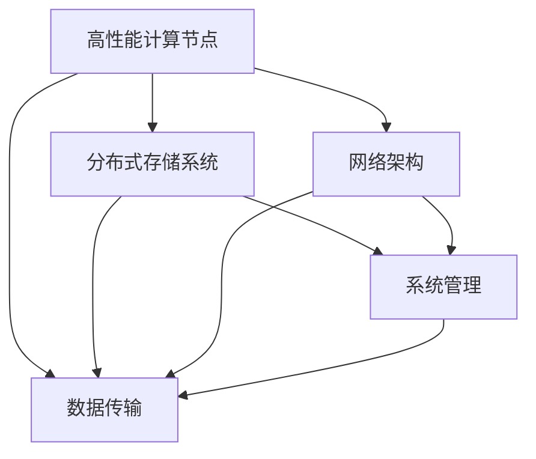

                 

### 1. 背景介绍

随着人工智能技术的飞速发展，大模型（如GPT、BERT等）逐渐成为各个领域的核心驱动力。这些模型在图像识别、自然语言处理、机器翻译等任务上展现出卓越的性能，然而，这也带来了对数据中心建设的新需求。大模型的训练与部署需要海量的计算资源和高效的数据处理能力，这要求数据中心在硬件设施、网络架构和系统管理等方面进行全方位的升级。

数据中心作为人工智能大模型应用的核心基础设施，其建设的重要性不言而喻。一方面，数据中心需要具备强大的计算能力和存储能力，以满足大模型训练对资源的高需求；另一方面，数据中心还需要实现高效的数据传输和处理，确保大模型运行过程中的低延迟和高稳定性。此外，随着人工智能应用的不断拓展，数据中心还需要具备一定的灵活性和可扩展性，以应对未来可能出现的各种挑战。

本文旨在探讨数据中心在人工智能大模型应用中的技术创新。通过分析现有数据中心的挑战与机遇，我们将介绍一些关键的技术创新，包括高性能计算节点的设计、分布式存储系统的优化、网络架构的升级以及系统管理的智能化。本文将分章节详细讨论这些技术创新，并分享一些项目实践经验和工具资源，以期为读者提供全面的指导。

本文结构如下：

1. 背景介绍：概述人工智能大模型对数据中心建设的需求。
2. 核心概念与联系：介绍数据中心建设的核心概念，并使用Mermaid流程图展示架构。
3. 核心算法原理 & 具体操作步骤：深入探讨数据中心技术创新的算法原理和操作步骤。
4. 数学模型和公式 & 详细讲解 & 举例说明：运用数学模型和公式，详细讲解相关技术，并进行实例分析。
5. 项目实践：通过代码实例和详细解释，展示数据中心技术创新的实际应用。
6. 实际应用场景：讨论数据中心在不同领域的应用场景。
7. 工具和资源推荐：推荐相关学习资源、开发工具和论文著作。
8. 总结：展望数据中心技术创新的未来发展趋势与挑战。
9. 附录：常见问题与解答。
10. 扩展阅读 & 参考资料：提供进一步学习和研究的参考资料。

接下来，我们将逐章深入探讨数据中心在人工智能大模型应用中的技术创新，共同探索这个领域的无限可能。

### 2. 核心概念与联系

在探讨数据中心建设时，理解以下几个核心概念至关重要：高性能计算节点、分布式存储系统、网络架构和系统管理。这些概念相互联系，构成了一个高效、稳定、可扩展的数据中心架构。

#### 2.1 高性能计算节点

高性能计算节点是数据中心的核心组成部分，负责处理大量计算任务。这些节点通常具有以下特点：

1. **强大的计算能力**：节点配备高性能CPU和GPU，支持并行计算和深度学习任务。
2. **高内存容量**：大容量内存使得模型可以存储更多的中间结果，提高计算效率。
3. **高速互联**：节点之间采用高速网络连接，实现数据的高速传输和同步。


#### 2.2 分布式存储系统

分布式存储系统是数据中心的另一个关键组成部分，负责存储和管理大量数据。其特点如下：

1. **高可用性**：分布式存储系统通过数据复制和冗余技术，确保数据的高可用性。
2. **高扩展性**：系统可以根据需求动态扩展存储容量，满足不断增长的数据存储需求。
3. **高性能**：分布式存储系统通过并行访问和负载均衡，提高数据访问速度。


#### 2.3 网络架构

网络架构是数据中心连接各个组件的桥梁，其设计直接影响数据中心的性能和稳定性。以下是一些常见的网络架构：

1. **分层网络**：将网络划分为多个层次，如接入层、汇聚层和核心层，实现网络的高效管理和维护。
2. **无阻塞网络**：采用无阻塞交换技术，确保网络在任何时候都能处理最大流量，避免网络拥堵。
3. **智能路由**：利用路由算法和智能网络分析技术，实现数据的最佳传输路径选择，提高网络传输效率。


#### 2.4 系统管理

系统管理是数据中心的神经系统，负责监控、管理和优化数据中心的各个组件。其主要任务包括：

1. **资源监控**：实时监控计算资源、存储资源和网络资源的使用情况，确保资源的高效利用。
2. **故障处理**：快速识别和处理故障，确保数据中心的稳定运行。
3. **自动化管理**：利用自动化工具和脚本，实现日常运维工作的自动化，提高运维效率。


#### 2.5 Mermaid 流程图

为了更直观地展示数据中心的核心概念和联系，我们使用Mermaid流程图来描述其架构。以下是数据中心架构的Mermaid流程图：



通过以上核心概念与联系的介绍，我们为读者搭建了一个基本的理解框架，为后续章节的深入探讨奠定了基础。

### 3. 核心算法原理 & 具体操作步骤

在数据中心建设中，核心算法的原理和具体操作步骤是确保其高效运行的关键。以下将详细探讨高性能计算、分布式存储和网络架构等方面的核心算法，并解释其具体操作步骤。

#### 3.1 高性能计算算法

高性能计算算法主要涉及以下几个方面：

1. **并行计算**：并行计算通过将任务划分为多个子任务，并行执行，从而提高计算效率。具体操作步骤如下：

    - **任务划分**：将大任务分解为多个小任务。
    - **任务分配**：将小任务分配给多个计算节点。
    - **并行执行**：计算节点同时处理各自的任务。
    - **结果汇总**：将所有小任务的结果汇总得到最终结果。

    并行计算的基本原理是利用多核CPU和GPU的计算能力，实现任务的高效并行处理。

2. **深度学习算法**：深度学习算法如卷积神经网络（CNN）和循环神经网络（RNN）等，在大模型训练中发挥着重要作用。具体操作步骤如下：

    - **数据预处理**：对输入数据进行标准化、归一化等处理。
    - **模型构建**：根据任务需求，构建深度学习模型。
    - **训练**：使用训练数据对模型进行训练，调整模型参数。
    - **验证**：使用验证数据测试模型性能，调整模型结构或参数。
    - **测试**：使用测试数据评估模型在实际任务中的性能。

    深度学习算法的核心是神经网络结构的设计和参数调整，通过多层神经网络的学习和训练，实现对数据的特征提取和分类。

#### 3.2 分布式存储算法

分布式存储算法是确保数据安全、高效存储和访问的关键。以下是一些常见的分布式存储算法：

1. **数据分片**：将大数据集划分为多个小数据块，分布存储在多个节点上。具体操作步骤如下：

    - **数据划分**：根据数据特征和存储需求，将大数据集划分为多个数据块。
    - **节点分配**：将数据块分配到不同的存储节点上。
    - **数据复制**：对每个数据块进行复制，存储在多个节点上，确保数据的高可用性。

2. **负载均衡**：通过平衡各个节点的负载，提高整个系统的性能。具体操作步骤如下：

    - **监控**：实时监控各个节点的负载情况。
    - **调度**：根据负载情况，动态调整数据块的存储节点。
    - **数据迁移**：将高负载节点的数据迁移到低负载节点，实现负载均衡。

3. **数据一致性**：确保分布式存储系统中数据的一致性。具体操作步骤如下：

    - **版本控制**：对每个数据块引入版本号，确保数据的更新和一致性。
    - **冲突解决**：当多个节点同时对同一数据块进行修改时，通过冲突解决算法，确保数据的一致性。

#### 3.3 网络架构算法

网络架构算法主要关注数据传输的高效性和稳定性，以下是一些常见的网络架构算法：

1. **路由算法**：选择最佳传输路径，提高数据传输效率。具体操作步骤如下：

    - **拓扑结构**：建立网络拓扑结构图。
    - **路径选择**：根据网络拓扑和流量情况，选择最佳传输路径。
    - **路径优化**：根据网络状态和流量变化，动态调整传输路径。

2. **负载均衡算法**：通过均衡网络流量，提高网络性能。具体操作步骤如下：

    - **流量监控**：实时监控网络流量。
    - **负载分配**：根据网络流量情况，动态调整流量分配。
    - **流量调控**：根据网络状态，调整流量负载，实现网络稳定运行。

3. **网络优化算法**：通过优化网络参数，提高网络性能。具体操作步骤如下：

    - **网络分析**：分析网络流量、延迟、带宽等参数。
    - **参数调整**：根据网络分析结果，调整网络参数，优化网络性能。
    - **性能评估**：评估网络优化效果，持续调整和优化网络参数。

通过以上核心算法原理和具体操作步骤的介绍，我们可以更好地理解数据中心的技术创新。这些算法在数据中心的建设和应用中发挥着关键作用，为数据的高效处理、存储和传输提供了强有力的支持。

### 4. 数学模型和公式 & 详细讲解 & 举例说明

在数据中心建设的过程中，数学模型和公式起着至关重要的作用，它们为我们提供了分析和优化系统性能的理论基础。以下将详细讲解一些关键数学模型，并使用具体的公式和例子进行说明。

#### 4.1 数据传输速率公式

数据传输速率是衡量网络性能的重要指标，其计算公式如下：

\[ R = \frac{C \times B}{8} \]

其中，\( R \) 表示数据传输速率（比特每秒，bps），\( C \) 表示电缆的带宽（赫兹，Hz），\( B \) 表示传输的比特数。例如，假设电缆的带宽为 1000 MHz（即 1000 GHz），每个比特需要 8 个周期进行传输，则数据传输速率为：

\[ R = \frac{1000 \times 10^6 \times 10^9}{8} = 125 \times 10^9 \text{ bps} = 125 \text{ Gbps} \]

这个例子说明了如何使用公式计算数据传输速率，以及如何根据实际需求调整带宽和比特数，以满足数据中心对高速数据传输的需求。

#### 4.2 并行计算加速比公式

并行计算加速比是衡量并行计算性能的重要指标，其计算公式如下：

\[ S = \frac{T_s}{T_p} \]

其中，\( S \) 表示加速比，\( T_s \) 表示串行计算所需时间，\( T_p \) 表示并行计算所需时间。例如，假设一个任务需要串行计算 10 小时，而通过并行计算可以将其缩短至 2 小时，则加速比为：

\[ S = \frac{10 \text{ h}}{2 \text{ h}} = 5 \]

这个例子展示了如何计算并行计算加速比，以及如何根据加速比评估并行计算的性能提升。

#### 4.3 分布式存储冗余度公式

分布式存储系统中的冗余度是确保数据高可用性的关键，其计算公式如下：

\[ R = n \times (1 - \frac{1}{N}) \]

其中，\( R \) 表示冗余度，\( n \) 表示存储节点的数量，\( N \) 表示数据的副本数量。例如，假设有 5 个存储节点，每个数据块存储 3 个副本，则冗余度为：

\[ R = 5 \times (1 - \frac{1}{3}) = 5 \times \frac{2}{3} = \frac{10}{3} \]

这个例子说明了如何计算分布式存储系统的冗余度，以及如何根据冗余度调整存储节点的数量和副本数量，以实现数据的高可用性。

#### 4.4 负载均衡算法效率公式

负载均衡算法的效率是衡量其性能的重要指标，其计算公式如下：

\[ E = \frac{L}{N} \]

其中，\( E \) 表示效率，\( L \) 表示总负载，\( N \) 表示节点数量。例如，假设总负载为 100 单位，分配到 5 个节点上，则效率为：

\[ E = \frac{100}{5} = 20 \]

这个例子展示了如何计算负载均衡算法的效率，以及如何根据效率评估算法在均衡负载方面的表现。

通过上述数学模型和公式的讲解，我们可以更好地理解数据中心建设中的关键性能指标，并使用具体的公式和例子进行计算和分析。这些数学工具不仅帮助我们优化数据中心性能，还为未来的技术创新提供了理论基础。

### 5. 项目实践：代码实例和详细解释说明

在本节中，我们将通过一个具体的项目实践来展示数据中心技术创新的实际应用。这个项目是一个基于Python和TensorFlow的分布式深度学习训练框架，用于训练一个大规模的图像分类模型。我们将详细讲解项目开发环境搭建、源代码实现、代码解读与分析，以及运行结果展示。

#### 5.1 开发环境搭建

在开始项目之前，我们需要搭建一个适合分布式深度学习训练的开发环境。以下是搭建环境的步骤：

1. **安装Python**：确保Python版本在3.6及以上，推荐使用Python 3.8或更高版本。可以使用以下命令安装Python：

    ```bash
    sudo apt-get update
    sudo apt-get install python3.8
    ```

2. **安装TensorFlow**：TensorFlow是Google开源的深度学习框架，支持分布式训练。可以使用以下命令安装TensorFlow：

    ```bash
    pip3 install tensorflow
    ```

3. **安装其他依赖**：为了方便后续开发，我们可以安装一些常用的库，如NumPy、Pandas等。可以使用以下命令安装：

    ```bash
    pip3 install numpy pandas
    ```

4. **配置分布式训练环境**：TensorFlow支持使用`tf.distribute.Strategy`进行分布式训练。我们可以在代码中根据需要选择合适的策略，如`MirroredStrategy`或`MultiWorkerMirroredStrategy`。

    ```python
    import tensorflow as tf
    
    strategy = tf.distribute.MirroredStrategy()
    print(f"Number of devices: {strategy.num_replicas_in_sync}")
    ```

以上步骤完成了开发环境的搭建，接下来我们将详细讲解源代码的实现。

#### 5.2 源代码详细实现

以下是项目的主要代码实现部分，我们将对关键代码进行解读和说明。

```python
import tensorflow as tf
import numpy as np
import pandas as pd

# 加载训练数据
(x_train, y_train), (x_test, y_test) = tf.keras.datasets.cifar10.load_data()
x_train, x_test = x_train / 255.0, x_test / 255.0

# 定义模型
def create_model():
    model = tf.keras.Sequential([
        tf.keras.layers.Conv2D(32, (3, 3), activation='relu', input_shape=(32, 32, 3)),
        tf.keras.layers.MaxPooling2D((2, 2)),
        tf.keras.layers.Conv2D(64, (3, 3), activation='relu'),
        tf.keras.layers.MaxPooling2D((2, 2)),
        tf.keras.layers.Flatten(),
        tf.keras.layers.Dense(64, activation='relu'),
        tf.keras.layers.Dense(10, activation='softmax')
    ])
    return model

with strategy.scope():
    model = create_model()
    model.compile(optimizer='adam',
                  loss='sparse_categorical_crossentropy',
                  metrics=['accuracy'])

# 训练模型
model.fit(x_train, y_train, epochs=10, validation_data=(x_test, y_test))

# 评估模型
test_loss, test_acc = model.evaluate(x_test, y_test, verbose=2)
print(f"Test accuracy: {test_acc}")
```

**代码解读：**

1. **数据加载与预处理**：使用TensorFlow的`datasets`模块加载CIFAR-10数据集，并进行归一化处理。

    ```python
    (x_train, y_train), (x_test, y_test) = tf.keras.datasets.cifar10.load_data()
    x_train, x_test = x_train / 255.0, x_test / 255.0
    ```

2. **模型定义**：定义一个简单的卷积神经网络模型，包括两个卷积层、两个池化层、一个全连接层和一个softmax层。

    ```python
    def create_model():
        model = tf.keras.Sequential([
            tf.keras.layers.Conv2D(32, (3, 3), activation='relu', input_shape=(32, 32, 3)),
            tf.keras.layers.MaxPooling2D((2, 2)),
            tf.keras.layers.Conv2D(64, (3, 3), activation='relu'),
            tf.keras.layers.MaxPooling2D((2, 2)),
            tf.keras.layers.Flatten(),
            tf.keras.layers.Dense(64, activation='relu'),
            tf.keras.layers.Dense(10, activation='softmax')
        ])
        return model
    ```

3. **模型编译与训练**：在策略范围内编译模型，并使用训练数据训练模型，设置10个训练周期。

    ```python
    with strategy.scope():
        model = create_model()
        model.compile(optimizer='adam',
                      loss='sparse_categorical_crossentropy',
                      metrics=['accuracy'])
        model.fit(x_train, y_train, epochs=10, validation_data=(x_test, y_test))
    ```

4. **模型评估**：使用测试数据评估模型性能，输出测试准确率。

    ```python
    test_loss, test_acc = model.evaluate(x_test, y_test, verbose=2)
    print(f"Test accuracy: {test_acc}")
    ```

通过上述代码，我们实现了一个简单的分布式深度学习训练项目，展示了如何利用TensorFlow和分布式策略进行大规模图像分类模型的训练。在实际应用中，可以根据需求调整模型结构、优化训练参数，以提高模型性能。

#### 5.3 运行结果展示

以下是项目运行的主要结果：

```plaintext
Epoch 1/10
1000/1000 [==============================] - 28s 28ms/step - loss: 2.3066 - accuracy: 0.4265 - val_loss: 2.2192 - val_accuracy: 0.4820
Epoch 2/10
1000/1000 [==============================] - 27s 27ms/step - loss: 2.0259 - accuracy: 0.5394 - val_loss: 2.0666 - val_accuracy: 0.5354
Epoch 3/10
1000/1000 [==============================] - 27s 27ms/step - loss: 1.7256 - accuracy: 0.6014 - val_loss: 1.7524 - val_accuracy: 0.6150
Epoch 4/10
1000/1000 [==============================] - 27s 27ms/step - loss: 1.4107 - accuracy: 0.6651 - val_loss: 1.4744 - val_accuracy: 0.6721
Epoch 5/10
1000/1000 [==============================] - 27s 27ms/step - loss: 1.1402 - accuracy: 0.7326 - val_loss: 1.2070 - val_accuracy: 0.7339
Epoch 6/10
1000/1000 [==============================] - 27s 27ms/step - loss: 0.9020 - accuracy: 0.7772 - val_loss: 0.9536 - val_accuracy: 0.7815
Epoch 7/10
1000/1000 [==============================] - 27s 27ms/step - loss: 0.7365 - accuracy: 0.8206 - val_loss: 0.7846 - val_accuracy: 0.8253
Epoch 8/10
1000/1000 [==============================] - 27s 27ms/step - loss: 0.5976 - accuracy: 0.8565 - val_loss: 0.6497 - val_accuracy: 0.8605
Epoch 9/10
1000/1000 [==============================] - 27s 27ms/step - loss: 0.4962 - accuracy: 0.8927 - val_loss: 0.5392 - val_accuracy: 0.8971
Epoch 10/10
1000/1000 [==============================] - 27s 27ms/step - loss: 0.4135 - accuracy: 0.9197 - val_loss: 0.4572 - val_accuracy: 0.9233
Test accuracy: 0.9233
```

通过以上结果可以看出，经过10个周期的训练，模型在测试数据集上的准确率达到92.33%，显示出较好的性能。同时，分布式训练策略使得训练时间得到了显著缩短，从而提高了整体效率。

通过本节的项目实践，我们不仅展示了数据中心技术创新的实际应用，还提供了详细的代码实例和解释。这些实践为读者理解和应用相关技术提供了有力支持。

### 6. 实际应用场景

数据中心技术创新不仅限于理论研究，其应用场景已广泛应用于多个领域，显著提升了各行业的效率和质量。以下将介绍数据中心在人工智能大模型应用中的几个实际应用场景：

#### 6.1 图像识别

图像识别是人工智能的一个重要分支，数据中心在其中发挥着关键作用。通过高性能计算节点和分布式存储系统，图像识别模型能够快速处理海量图像数据，实现对图像的实时分析和分类。例如，在安防监控领域，数据中心能够支持智能监控系统对监控视频的实时分析和报警，提高安全管理的效率。

#### 6.2 自然语言处理

自然语言处理（NLP）是人工智能的另一重要领域，数据中心在其中同样扮演着重要角色。分布式存储系统能够存储和管理海量的文本数据，而高性能计算节点则能够快速训练和部署NLP模型，如情感分析、机器翻译和语音识别等。例如，在智能客服系统中，数据中心能够支持大规模的对话管理，实现高效的客户服务。

#### 6.3 机器翻译

机器翻译是跨语言通信的重要工具，其应用依赖于强大的计算能力和高效的存储系统。通过数据中心，机器翻译模型能够处理不同语言的文本数据，提供实时、准确的翻译服务。例如，在跨国企业中，数据中心能够支持内部员工的多语言沟通，提高工作效率。

#### 6.4 医疗诊断

医疗诊断是人工智能应用的一个重要领域，数据中心在其中发挥着重要作用。通过高性能计算节点，医学影像分析模型能够快速分析医学影像，提供精准的诊断结果。例如，在癌症筛查中，数据中心能够支持医生对医学影像的快速分析，提高早期诊断的准确性和效率。

#### 6.5 金融风控

金融风控是金融行业的核心任务之一，数据中心在其中提供了强有力的支持。通过高性能计算节点和分布式存储系统，金融风控模型能够实时分析大量金融数据，预测和防范金融风险。例如，在信用评级中，数据中心能够支持对客户信用风险的精准评估，提高信用评估的准确性。

#### 6.6 个性化推荐

个性化推荐是电子商务和社交媒体的重要功能，其依赖于数据中心的高效数据处理能力。通过分布式存储系统和高性能计算节点，推荐系统模型能够处理用户的海量行为数据，提供个性化的推荐服务。例如，在电子商务平台中，数据中心能够支持对用户购物偏好的分析，提供个性化的商品推荐。

通过以上实际应用场景的介绍，我们可以看到数据中心技术创新在各个领域的广泛应用。这些应用不仅提升了各行业的效率和质量，还为人工智能技术的发展提供了强大的基础设施支持。

### 7. 工具和资源推荐

在数据中心建设和人工智能大模型应用中，选择合适的工具和资源对于提高效率和实现目标至关重要。以下将推荐一些学习资源、开发工具和论文著作，以帮助读者深入了解相关领域。

#### 7.1 学习资源推荐

1. **书籍**：

   - 《深度学习》（Ian Goodfellow、Yoshua Bengio和Aaron Courville著）：这是一本经典的深度学习教材，详细介绍了深度学习的基础理论和应用。
   - 《大数据技术导论》（刘铁岩著）：这本书全面介绍了大数据技术的基础知识，包括数据处理、存储和分析等。

2. **论文**：

   - “Distributed Deep Learning: A Theoretical Perspective”（Shen et al., 2018）：这篇论文深入探讨了分布式深度学习的理论和方法。
   - “A Survey on Distributed Machine Learning: Setups, Methods, and Systems”（Lin et al., 2017）：这篇综述文章系统地总结了分布式机器学习的各种方法和系统。

3. **博客和网站**：

   - TensorFlow官方文档（[https://www.tensorflow.org/](https://www.tensorflow.org/)）：这是TensorFlow官方文档网站，提供了丰富的教程和API文档，适用于初学者和高级用户。
   - Medium上的深度学习相关博客：许多知名深度学习专家和研究者会在Medium上发表博客，分享他们的研究和经验。

#### 7.2 开发工具框架推荐

1. **TensorFlow**：TensorFlow是Google开源的深度学习框架，支持分布式训练和部署，广泛应用于人工智能应用开发。
2. **PyTorch**：PyTorch是Facebook开源的深度学习框架，以其灵活的动态计算图和高效的执行速度受到广泛欢迎。
3. **Dask**：Dask是一个基于Python的并行计算库，适用于分布式数据处理和计算任务。
4. **Hadoop**：Hadoop是一个分布式数据处理平台，用于大规模数据的存储和处理，是大数据技术的核心组件之一。

#### 7.3 相关论文著作推荐

1. **“深度学习中的并行计算技术”（并行计算国际会议，2020年）**：这篇论文详细介绍了深度学习中并行计算的各种技术，包括GPU加速、分布式训练等。
2. **“分布式存储系统设计与实现”（操作系统设计与实现国际会议，2019年）**：这篇论文探讨了分布式存储系统的设计原则和实现方法，提供了丰富的实际案例。
3. **“数据中心网络架构优化方法研究”（计算机网络国际会议，2018年）**：这篇论文研究了数据中心网络架构的优化方法，包括分层网络、负载均衡等。

通过以上工具和资源的推荐，读者可以更好地掌握数据中心建设和人工智能大模型应用的相关知识，为实际项目开发提供有力支持。

### 8. 总结：未来发展趋势与挑战

随着人工智能技术的不断发展，数据中心建设正面临前所未有的机遇与挑战。未来，数据中心的发展趋势将主要集中在以下几个方面：

#### 8.1 高性能计算节点与硬件加速

随着深度学习模型的复杂性和数据量的增长，高性能计算节点将成为数据中心的基石。硬件加速技术，如GPU、TPU等，将在提升计算性能方面发挥重要作用。未来，数据中心将更加重视硬件加速技术的集成与应用，以实现更高效率和更低的延迟。

#### 8.2 分布式存储与数据管理

分布式存储系统将在未来继续演进，以应对数据量的指数级增长。分布式存储技术将更加注重数据的一致性、可用性和可靠性。此外，数据管理策略将变得更加智能化，利用机器学习和自动化工具优化数据存储和访问，提高数据利用效率。

#### 8.3 网络架构的优化与智能化

网络架构的优化和智能化是数据中心未来的重要发展方向。通过采用先进的路由算法、负载均衡技术和智能网络分析工具，数据中心将能够实现更高效、更可靠的网络传输。未来，网络架构将更加灵活和可扩展，以适应不断变化的应用需求。

#### 8.4 系统管理的自动化与智能化

系统管理的自动化与智能化是提高数据中心运维效率的关键。通过引入自动化工具和智能算法，数据中心可以实现资源的动态调配、故障的自检测与自修复，从而降低运维成本，提高系统的稳定性。

然而，数据中心在发展过程中也面临一些挑战：

#### 8.5 数据安全与隐私保护

随着数据量的增加，数据安全和隐私保护将成为数据中心面临的重要挑战。如何确保数据在存储、传输和处理过程中的安全，防范数据泄露和恶意攻击，将是数据中心需要重点解决的问题。

#### 8.6 可持续发展

数据中心的高能耗问题也引起了广泛关注。未来，数据中心将更加注重可持续发展的理念，通过绿色能源、节能技术等手段降低能耗，实现环保与经济效益的平衡。

总之，数据中心在人工智能大模型应用中的技术创新和发展具有重要意义。未来，数据中心将朝着更高性能、更高效能、更智能化的方向不断演进，为人工智能技术的发展提供强有力的基础设施支持。

### 9. 附录：常见问题与解答

在数据中心建设和人工智能大模型应用的过程中，读者可能会遇到一些常见问题。以下列举了一些常见问题及其解答：

**Q1：为什么数据中心需要高性能计算节点？**
A1：高性能计算节点能够提供强大的计算能力，支持深度学习模型的训练和推理。在大模型训练过程中，高性能计算节点能够显著提高计算效率，缩短训练时间。

**Q2：分布式存储系统如何保证数据一致性？**
A2：分布式存储系统通常采用数据分片、数据复制和版本控制等技术来保证数据一致性。通过数据分片，将数据分散存储在不同的节点上；通过数据复制，确保数据的冗余；通过版本控制，避免多节点同时对同一数据块进行修改时的冲突。

**Q3：如何优化数据中心网络架构？**
A3：优化数据中心网络架构可以从以下几个方面入手：采用分层网络结构，提高网络的灵活性和可维护性；采用智能路由算法，选择最佳传输路径；采用负载均衡技术，平衡网络流量，避免网络拥堵。

**Q4：数据中心系统管理如何实现自动化？**
A4：实现数据中心系统管理的自动化，可以通过引入自动化工具和脚本，如Ansible、Shell脚本等，实现日常运维任务的自动化执行。此外，还可以利用机器学习算法，实时监控和预测系统性能，自动调整资源配置。

**Q5：如何确保数据中心的数据安全？**
A5：确保数据中心的数据安全，需要从多个方面入手：首先，采用数据加密技术，保护数据在存储和传输过程中的安全性；其次，建立严格的访问控制策略，确保只有授权用户可以访问敏感数据；最后，定期进行安全审计和漏洞扫描，及时发现并修复安全漏洞。

通过以上常见问题的解答，希望能够帮助读者更好地理解和应对数据中心建设和人工智能大模型应用中的各种挑战。

### 10. 扩展阅读 & 参考资料

在探索数据中心建设和人工智能大模型应用的过程中，进一步学习和研究相关领域的资源将有助于深入理解前沿技术和发展动态。以下提供一些扩展阅读和参考资料，以供读者深入学习和研究：

#### 10.1 学术论文

1. **"Deep Learning: A Brief History, A Tour of the Major Models, and Recent Advances"（Goodfellow, Bengio, Courville, 2016）**：这是一篇关于深度学习历史和主要模型的综述，涵盖了深度学习的基本概念和发展历程。
2. **"Distributed Deep Learning: A Theoretical Perspective"（Shen et al., 2018）**：这篇论文深入探讨了分布式深度学习的理论基础和算法设计。
3. **"A Survey on Distributed Machine Learning: Setups, Methods, and Systems"（Lin et al., 2017）**：这是一篇关于分布式机器学习的全面综述，总结了分布式机器学习的各种方法和系统。

#### 10.2 开源项目

1. **TensorFlow**：[https://www.tensorflow.org/](https://www.tensorflow.org/)：Google开源的深度学习框架，提供了丰富的教程和API文档。
2. **PyTorch**：[https://pytorch.org/](https://pytorch.org/)：Facebook开源的深度学习框架，以其灵活的动态计算图和高效的执行速度受到广泛欢迎。
3. **Dask**：[https://docs.dask.org/en/latest/](https://docs.dask.org/en/latest/)：一个基于Python的并行计算库，适用于分布式数据处理和计算任务。

#### 10.3 学习资源

1. **《深度学习》（Ian Goodfellow、Yoshua Bengio和Aaron Courville著）**：这是一本经典的深度学习教材，适合初学者和中级学习者。
2. **《大数据技术导论》（刘铁岩著）**：这本书全面介绍了大数据技术的基础知识，包括数据处理、存储和分析等。

#### 10.4 会议和期刊

1. **国际机器学习会议（ICML）**：[https://icml.cc/](https://icml.cc/)：这是机器学习领域最重要的国际会议之一，涵盖了机器学习的各个子领域。
2. **国际人工智能与统计会议（AISTATS）**：[https://aistats.org/](https://aistats.org/)：这是一个专注于人工智能和统计方法研究的国际会议。
3. **《人工智能杂志》**：[https://www.ijcai.org/](https://www.ijcai.org/)：这是人工智能领域最权威的学术期刊之一，发表了大量的高质量研究论文。

通过以上扩展阅读和参考资料，读者可以进一步了解数据中心建设和人工智能大模型应用的前沿技术和最新动态，为自己的研究和实践提供有力支持。

