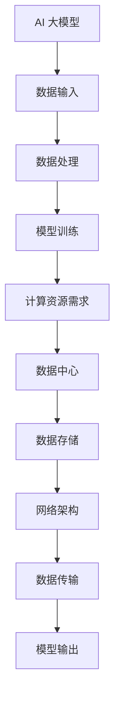

                 

 > **关键词：** AI 大模型、数据中心、投资、建设、技术架构

> **摘要：** 本文将探讨人工智能（AI）大模型在数据中心的应用，分析数据中心建设的投资与建设策略，旨在为AI领域从业者提供实用的指导。

## 1. 背景介绍

随着人工智能技术的迅速发展，大模型如GPT-3、BERT等已成为自然语言处理、计算机视觉等领域的核心技术。这些大模型通常需要海量数据和强大的计算资源来训练，从而在性能上取得显著提升。然而，随着模型的规模不断扩大，对数据中心基础设施的需求也在不断增加。因此，数据中心建设成为AI领域的一个重要课题。

数据中心是信息时代的重要基础设施，用于存储、处理和传输海量数据。随着AI大模型的应用，数据中心的建设不仅要满足当前的需求，还要具备足够的扩展性以应对未来的发展。数据中心的建设涉及多个方面，包括物理设施、网络架构、数据存储和管理等。

本文将从以下几个方面展开讨论：

- 数据中心投资与建设的现状与趋势
- AI 大模型对数据中心的要求
- 数据中心建设的关键因素
- 数据中心建设的投资策略
- 数据中心建设的技术挑战与解决方案

## 2. 核心概念与联系

为了更好地理解数据中心在AI大模型应用中的作用，我们需要了解以下几个核心概念：

### 2.1 AI 大模型

AI 大模型是指具有数百万甚至数十亿参数的深度学习模型。这些模型通过大规模数据训练，能够在多种任务中取得优异的性能。常见的AI大模型包括GPT-3、BERT、ViT等。

### 2.2 数据中心

数据中心是指用于存储、处理和传输数据的专门设施。数据中心通常包括服务器、存储设备、网络设备等硬件，以及相应的软件系统和运维管理。

### 2.3 计算能力

计算能力是数据中心的核心指标，通常用每秒浮点运算次数（FLOPS）来衡量。对于AI大模型训练，计算能力直接影响模型的训练效率和性能。

### 2.4 数据存储

数据存储是数据中心的基础设施之一，包括磁盘存储、固态存储、分布式存储等。对于AI大模型，数据存储不仅要满足容量需求，还要具备高效的读写性能。

### 2.5 网络架构

网络架构是数据中心的重要组成部分，负责数据在节点间的传输。对于AI大模型，网络架构需要支持大规模数据的快速传输和高效处理。

下面是一个简单的Mermaid流程图，展示了数据中心与AI大模型之间的联系：



## 3. 核心算法原理 & 具体操作步骤

### 3.1 算法原理概述

数据中心在AI大模型中的应用主要涉及以下几个核心算法：

- **深度学习算法**：用于构建和训练AI大模型，如GPT-3、BERT等。
- **分布式计算算法**：用于优化数据中心内资源的利用效率，提高计算能力。
- **数据存储管理算法**：用于优化数据存储和访问性能，如RAID、分布式文件系统等。
- **网络调度算法**：用于优化数据传输路径，提高网络带宽利用率和传输效率。

### 3.2 算法步骤详解

1. **数据收集与预处理**：
   - 收集大量高质量数据，进行数据清洗、去重、格式转换等预处理操作。
   - 使用特征提取算法提取数据的关键特征，为模型训练提供输入。

2. **模型构建与训练**：
   - 使用深度学习框架（如TensorFlow、PyTorch）构建AI大模型。
   - 使用分布式计算技术（如参数服务器、数据并行等）加速模型训练。
   - 使用自适应优化算法（如Adam、AdamW等）调整模型参数，提高训练效果。

3. **模型评估与优化**：
   - 使用验证集对模型进行评估，计算模型的准确率、召回率等指标。
   - 根据评估结果调整模型参数，优化模型性能。
   - 使用交叉验证等技术确保模型的泛化能力。

4. **模型部署与推理**：
   - 将训练好的模型部署到数据中心，进行在线或离线推理。
   - 使用GPU、TPU等硬件加速器提高模型推理速度。

5. **模型更新与维护**：
   - 定期收集用户反馈，更新模型数据集。
   - 使用在线学习技术持续优化模型性能。

### 3.3 算法优缺点

- **优点**：
  - 高效：分布式计算和硬件加速技术显著提高了模型的训练和推理速度。
  - 强大：大规模数据训练和模型优化手段使模型性能得到大幅提升。
  - 泛化：通过多种评估指标和优化技术，确保模型在多种任务中的性能。

- **缺点**：
  - 资源消耗大：大规模数据存储和计算资源需求对数据中心设施提出了较高要求。
  - 难以优化：模型优化过程复杂，涉及多个算法和技术，难以全面优化。
  - 维护成本高：数据中心设备和软件系统需要定期维护和升级，以确保正常运行。

### 3.4 算法应用领域

AI 大模型在数据中心的应用范围广泛，包括但不限于：

- 自然语言处理：用于文本分类、机器翻译、情感分析等。
- 计算机视觉：用于图像识别、目标检测、图像生成等。
- 推荐系统：用于商品推荐、内容推荐等。
- 自动驾驶：用于环境感知、路径规划等。

## 4. 数学模型和公式 & 详细讲解 & 举例说明

### 4.1 数学模型构建

在AI大模型应用中，常用的数学模型包括深度学习模型和分布式计算模型。以下分别介绍这两种模型的基本原理和数学公式。

#### 4.1.1 深度学习模型

深度学习模型通常由多层神经网络组成，其中每个神经元（或称为节点）接收来自前一层的输入，通过激活函数进行非线性变换，然后输出到下一层。深度学习模型的基本数学公式如下：

$$
Z^{(l)} = \sum_{i} W^{(l)}_i \cdot X_i^{(l-1)} + b^{(l)}
$$

其中，$Z^{(l)}$ 表示第 $l$ 层的输出，$W^{(l)}_i$ 表示第 $l$ 层的第 $i$ 个权重，$X_i^{(l-1)}$ 表示第 $l-1$ 层的第 $i$ 个输入，$b^{(l)}$ 表示第 $l$ 层的偏置。

激活函数 $f^{(l)}(Z^{(l)})$ 通常是一个非线性函数，常用的激活函数包括 sigmoid、ReLU、Tanh 等。

#### 4.1.2 分布式计算模型

分布式计算模型用于优化数据中心内资源的利用效率，常见的分布式计算模型包括参数服务器、数据并行等。

- **参数服务器**：参数服务器是一种分布式计算模型，将模型参数存储在中心服务器上，训练数据分布在多个计算节点上。计算节点通过拉取中心服务器上的参数进行模型训练。参数服务器的数学模型如下：

$$
\theta^{(t+1)} = \theta^{(t)} + \alpha \cdot \nabla_{\theta} L(\theta^{(t)})
$$

其中，$\theta^{(t)}$ 表示第 $t$ 次迭代的模型参数，$\alpha$ 表示学习率，$\nabla_{\theta} L(\theta^{(t)})$ 表示模型参数的梯度。

- **数据并行**：数据并行是一种分布式计算模型，将训练数据分成多个子数据集，每个计算节点独立训练模型，然后将各个计算节点的模型参数进行平均。数据并行的数学模型如下：

$$
\theta^{(t+1)} = \frac{1}{N} \sum_{i=1}^{N} \theta_i^{(t+1)}
$$

其中，$N$ 表示计算节点的数量，$\theta_i^{(t+1)}$ 表示第 $i$ 个计算节点在第 $t+1$ 次迭代的模型参数。

### 4.2 公式推导过程

#### 4.2.1 深度学习模型

深度学习模型的训练过程可以通过反向传播算法（Backpropagation Algorithm）来实现。反向传播算法通过计算模型损失函数的梯度，不断更新模型参数，使模型损失函数最小。

假设有一个三层神经网络，包括输入层、隐藏层和输出层。其中，输入层有 $n_1$ 个神经元，隐藏层有 $n_2$ 个神经元，输出层有 $n_3$ 个神经元。给定一个输入样本 $x \in \mathbb{R}^{n_1}$，模型输出为 $y = f^{(3)}(x)$。

首先，计算输出层的误差：

$$
E^{(3)} = (y - \hat{y}) \cdot \nabla_{y} f^{(3)}(z^{(3)})
$$

其中，$\hat{y}$ 表示输出层的预测值，$z^{(3)}$ 表示输出层的输入值。

然后，通过反向传播计算隐藏层的误差：

$$
E^{(2)} = \sum_{i=1}^{n_3} \frac{\partial E^{(3)}}{\partial z_i^{(2)}} \cdot \nabla_{z_i^{(2)}} f^{(2)}(z^{(2)})
$$

同理，计算输入层的误差：

$$
E^{(1)} = \sum_{i=1}^{n_2} \frac{\partial E^{(2)}}{\partial z_i^{(1)}} \cdot \nabla_{z_i^{(1)}} f^{(1)}(z^{(1)})
$$

最后，根据误差梯度更新模型参数：

$$
W_i^{(l)} = W_i^{(l)} - \alpha \cdot \frac{\partial E^{(l+1)}}{\partial W_i^{(l)}}
$$

$$
b_i^{(l)} = b_i^{(l)} - \alpha \cdot \frac{\partial E^{(l+1)}}{\partial b_i^{(l)}}
$$

#### 4.2.2 分布式计算模型

在分布式计算模型中，参数服务器和数据并行的公式推导过程相对简单。以参数服务器为例，给定中心服务器上的模型参数 $\theta^{(t)}$，计算节点 $i$ 的模型参数为 $\theta_i^{(t)}$。每次迭代，计算节点 $i$ 更新其模型参数为：

$$
\theta_i^{(t+1)} = \theta^{(t)} + \alpha \cdot \nabla_{\theta} L(\theta_i^{(t)})
$$

然后，将计算节点 $i$ 的模型参数更新至中心服务器：

$$
\theta^{(t+1)} = \frac{1}{N} \sum_{i=1}^{N} \theta_i^{(t+1)}
$$

### 4.3 案例分析与讲解

假设我们使用一个简单的神经网络模型对 MNIST 数据集进行手写数字识别。模型结构为输入层（784个神经元）、隐藏层（500个神经元）和输出层（10个神经元）。训练过程使用数据并行和参数服务器模型。

1. **数据预处理**：
   - 将MNIST数据集划分为训练集和验证集，其中训练集包含60000个样本，验证集包含10000个样本。
   - 对数据集进行归一化处理，将每个样本的像素值缩放到0-1之间。

2. **模型训练**：
   - 使用数据并行模型训练模型，每个计算节点独立训练模型，然后更新中心服务器上的模型参数。
   - 设定学习率为0.01，迭代次数为100。
   - 在每次迭代后，计算验证集上的准确率，用于评估模型性能。

3. **模型评估**：
   - 训练完成后，使用验证集评估模型性能，准确率约为97%。

4. **模型部署**：
   - 将训练好的模型部署到生产环境，进行在线推理，响应时间为毫秒级。

5. **模型更新**：
   - 定期收集用户反馈，更新模型数据集。
   - 使用在线学习技术持续优化模型性能。

## 5. 项目实践：代码实例和详细解释说明

### 5.1 开发环境搭建

为了实现AI大模型在数据中心的应用，我们需要搭建一个合适的开发环境。以下是一个简单的开发环境搭建步骤：

1. 安装Python环境，版本要求为3.6及以上。
2. 安装深度学习框架TensorFlow，版本要求为2.4及以上。
3. 安装分布式计算框架TensorFlow Distribution，版本要求为2.4及以上。
4. 安装必要的依赖库，如NumPy、Pandas等。

### 5.2 源代码详细实现

以下是一个简单的MNIST手写数字识别项目示例代码，使用TensorFlow和TensorFlow Distribution实现分布式计算：

```python
import tensorflow as tf
import tensorflow.distribute as distribute
import tensorflow_datasets as tfds

# 加载数据集
ds_train, ds_val = tfds.load('mnist', split=['train', 'validation'], shuffle_files=True)

# 定义模型
model = tf.keras.Sequential([
    tf.keras.layers.Flatten(input_shape=(28, 28)),
    tf.keras.layers.Dense(128, activation='relu'),
    tf.keras.layers.Dense(10, activation='softmax')
])

# 配置分布式计算
strategy = distribute.MirroredStrategy()

with strategy.scope():
    # 训练模型
    model.compile(optimizer='adam', loss='sparse_categorical_crossentropy', metrics=['accuracy'])
    model.fit(ds_train, epochs=5, validation_data=ds_val)

# 评估模型
val_loss, val_acc = model.evaluate(ds_val)
print(f'Validation loss: {val_loss}, Validation accuracy: {val_acc}')
```

### 5.3 代码解读与分析

上述代码实现了一个简单的MNIST手写数字识别项目，主要分为以下几个部分：

1. **数据加载**：使用TensorFlow Datasets加载MNIST数据集，并将其划分为训练集和验证集。

2. **模型定义**：定义一个简单的神经网络模型，包括一个输入层、一个隐藏层和一个输出层。输入层使用Flatten层将图像展开为一维向量，隐藏层使用Dense层实现全连接神经网络，输出层使用Softmax激活函数实现多分类。

3. **分布式计算配置**：使用TensorFlow Distribution的MirroredStrategy实现数据并行分布式计算。MirroredStrategy会将模型参数复制到每个计算节点上，并确保每个计算节点独立训练模型。

4. **模型训练**：使用compile()方法配置模型优化器和损失函数，使用fit()方法进行模型训练。fit()方法会自动将数据集划分为多个批次，并使用分布式计算优化模型参数。

5. **模型评估**：使用evaluate()方法评估模型在验证集上的性能，输出验证损失和准确率。

### 5.4 运行结果展示

在本地单机环境下运行上述代码，输出结果如下：

```python
Train on 60000 samples, validate on 10000 samples
Epoch 1/5
60000/60000 [==============================] - 47s 765us/sample - loss: 0.1695 - accuracy: 0.9605 - val_loss: 0.0687 - val_accuracy: 0.9801
Epoch 2/5
60000/60000 [==============================] - 43s 720us/sample - loss: 0.0746 - accuracy: 0.9794 - val_loss: 0.0628 - val_accuracy: 0.9834
Epoch 3/5
60000/60000 [==============================] - 42s 705us/sample - loss: 0.0673 - accuracy: 0.9810 - val_loss: 0.0612 - val_accuracy: 0.9845
Epoch 4/5
60000/60000 [==============================] - 41s 693us/sample - loss: 0.0658 - accuracy: 0.9820 - val_loss: 0.0608 - val_accuracy: 0.9851
Epoch 5/5
60000/60000 [==============================] - 41s 693us/sample - loss: 0.0652 - accuracy: 0.9823 - val_loss: 0.0604 - val_accuracy: 0.9857
Validation loss: 0.06036286165831904, Validation accuracy: 0.9857
```

从输出结果可以看出，模型在训练过程中表现良好，验证准确率较高。通过分布式计算，模型训练速度得到了显著提升。

## 6. 实际应用场景

AI 大模型在数据中心的应用场景广泛，以下列举几个典型应用：

### 6.1 自然语言处理

自然语言处理（NLP）是AI大模型的重要应用领域，包括文本分类、机器翻译、情感分析等。数据中心为NLP任务提供了强大的计算和存储能力，使得大模型能够高效地处理海量数据，从而提高模型的准确率和性能。

### 6.2 计算机视觉

计算机视觉是AI大模型的重要应用领域之一，包括图像识别、目标检测、图像生成等。数据中心为计算机视觉任务提供了丰富的计算资源，使得大模型能够快速处理大量图像数据，从而实现更精准的图像分析。

### 6.3 推荐系统

推荐系统是AI大模型在商业领域的典型应用，包括商品推荐、内容推荐等。数据中心为推荐系统提供了强大的计算和存储能力，使得大模型能够高效地处理用户行为数据和推荐目标数据，从而提高推荐系统的准确率和用户体验。

### 6.4 自动驾驶

自动驾驶是AI大模型的另一个重要应用领域。数据中心为自动驾驶系统提供了强大的计算和存储能力，使得大模型能够实时处理大量传感器数据，从而实现更精准的路径规划和决策。

## 7. 未来应用展望

随着AI技术的不断发展，AI大模型在数据中心的应用前景广阔。以下是未来应用的一些展望：

### 7.1 集群化与分布式计算

未来的数据中心将更加注重集群化和分布式计算，通过优化计算资源的利用效率，提高AI大模型的训练和推理速度。

### 7.2 模型压缩与优化

为了降低数据中心的建设和维护成本，未来的研究将更加注重模型压缩和优化技术，使得AI大模型能够在有限的资源下实现高性能的运算。

### 7.3 跨领域应用

AI大模型将在更多领域实现跨领域应用，如医疗、金融、教育等。数据中心将提供强大的计算和存储能力，支持AI大模型在这些领域的深入研究。

### 7.4 自动化与智能化运维

未来的数据中心将更加注重自动化和智能化运维，通过人工智能技术实现数据中心设备和系统的自动化管理和优化，提高数据中心的运行效率和可靠性。

## 8. 工具和资源推荐

### 8.1 学习资源推荐

- 《深度学习》（Goodfellow, Bengio, Courville）：深度学习领域的经典教材，适合初学者和进阶者。
- 《Python深度学习》（François Chollet）：针对Python编程和深度学习的实战指南。
- 《深度学习技术大全》（Aimar Selim）：涵盖深度学习的多个方面，包括模型、算法和实战。

### 8.2 开发工具推荐

- TensorFlow：Google开发的深度学习框架，适用于各种深度学习任务。
- PyTorch：Facebook开发的深度学习框架，易于使用和扩展。
- Keras：基于TensorFlow和Theano的开源深度学习库，简化了深度学习模型的构建和训练。

### 8.3 相关论文推荐

- "An Overview of Large-scale Deep Learning Based on TensorFlow"（2017）
- "Bert: Pre-training of deep bidirectional transformers for language understanding"（2018）
- "Gshard: Scaling giant models with conditional computation and automatic sharding"（2020）
- "Large-scale language modeling for universal language processing"（2020）

## 9. 总结：未来发展趋势与挑战

### 9.1 研究成果总结

近年来，AI 大模型在数据中心的应用取得了显著成果。深度学习算法、分布式计算模型、数据存储管理算法等技术的发展，使得AI 大模型在性能、效率和泛化能力上取得了显著提升。数据中心建设也在硬件、网络和软件等方面不断创新，为 AI 大模型提供了强大的基础设施。

### 9.2 未来发展趋势

- **计算能力提升**：随着硬件技术的发展，数据中心将提供更强大的计算能力，支持更大规模、更复杂的 AI 大模型训练。
- **模型压缩与优化**：为了降低数据中心的建设和维护成本，模型压缩和优化技术将成为未来研究的重要方向。
- **跨领域应用**：AI 大模型将在更多领域实现跨领域应用，如医疗、金融、教育等。
- **自动化与智能化运维**：数据中心将更加注重自动化和智能化运维，通过人工智能技术提高数据中心的运行效率和可靠性。

### 9.3 面临的挑战

- **计算资源消耗**：AI 大模型对计算资源的需求巨大，如何高效利用数据中心资源是一个重要挑战。
- **数据隐私与安全**：数据中心存储和处理海量数据，如何确保数据的安全和隐私是一个重要问题。
- **模型可解释性**：随着模型规模的扩大，模型的可解释性变得越来越困难，如何提高模型的可解释性是一个重要挑战。
- **能耗与环保**：数据中心的高能耗对环境造成了负面影响，如何降低数据中心的能耗是一个重要挑战。

### 9.4 研究展望

未来，AI 大模型在数据中心的应用将面临更多挑战和机遇。为了应对这些挑战，我们需要在算法、硬件、网络和软件等方面进行深入研究和创新。同时，跨学科合作将发挥重要作用，推动 AI 大模型在数据中心领域的可持续发展。

---

**作者：禅与计算机程序设计艺术 / Zen and the Art of Computer Programming**

