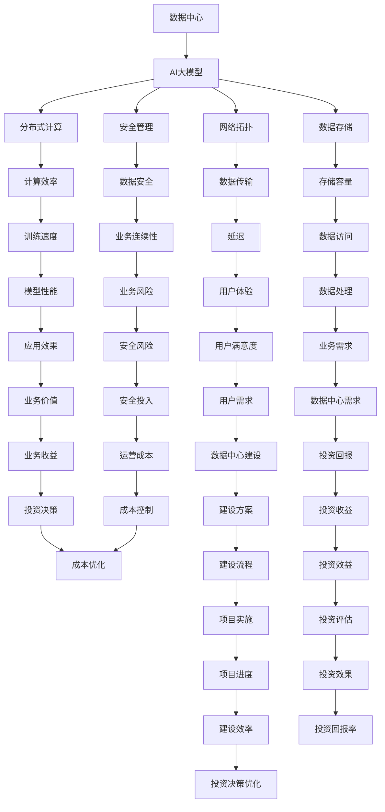

                 

### 1. 背景介绍

在当今数字化时代，数据中心已经成为企业和组织运营的基石。随着人工智能（AI）技术的迅猛发展，大模型应用逐渐成为数据处理和分析的主流。然而，数据中心的建设和投资不仅仅是为了满足当前的AI需求，更是为了应对未来的技术挑战和市场变化。本文旨在探讨AI大模型应用数据中心的建设投资问题，分析其核心概念、建设步骤、数学模型及实际应用，并展望未来发展趋势与挑战。

#### 1.1 数据中心的重要性

数据中心作为集成了大量硬件设备和网络系统的集中化计算设施，为企业提供了高效、稳定的数据存储和计算服务。随着云计算、大数据、物联网等技术的普及，数据中心的重要性日益凸显。尤其对于AI大模型的应用，数据中心提供了必要的计算资源和数据存储空间，确保了模型的训练和推理过程能够顺利进行。

#### 1.2 AI大模型的需求

AI大模型通常具有计算密集、数据量大、模型复杂等特点，这对数据中心的性能和容量提出了更高的要求。首先，大模型的训练需要大量的计算资源，传统的单机训练已经无法满足需求，分布式计算和GPU集群成为主流。其次，大模型依赖于海量数据进行训练，数据中心的存储能力和数据传输速度必须能够支撑这一需求。此外，大模型的应用场景不断扩展，从图像识别、自然语言处理到预测分析，数据中心需要具备灵活的扩展能力以适应不同应用场景。

#### 1.3 数据中心建设的投资与挑战

数据中心的建设是一个复杂的系统工程，涉及到硬件采购、网络布局、能源消耗、安全管理等多个方面。以下是数据中心建设过程中可能遇到的一些挑战：

- **硬件采购与成本控制**：数据中心需要采购大量高性能服务器、存储设备和网络设备，采购成本高昂。如何在确保性能的前提下，控制总体成本是一个重要问题。

- **能源消耗与环境保护**：数据中心的高效运行需要大量的电力支持，能源消耗巨大。同时，数据中心产生的热量也需要有效管理，以防止设备过热。如何降低能源消耗、提高能源利用效率是当前数据中心建设面临的重要挑战。

- **网络布局与可靠性**：数据中心的网络布局需要考虑数据传输速度、网络稳定性等因素，确保数据传输的高效与可靠。此外，数据中心之间的互联网络也需要具备高可用性和低延迟性，以支持跨地域的数据处理和协作。

- **安全管理**：数据中心存储了大量敏感数据，安全性至关重要。数据中心需要建立完善的安全防护体系，包括物理安全、网络安全、数据安全等方面，防止数据泄露和未经授权的访问。

#### 1.4 目的与结构

本文将围绕AI大模型应用数据中心的建设投资问题，从以下方面进行探讨：

1. **核心概念与联系**：介绍数据中心建设和AI大模型应用的相关核心概念，并使用Mermaid流程图展示其关系。
2. **核心算法原理与操作步骤**：分析AI大模型训练和推理的核心算法原理，并详细讲解具体的操作步骤。
3. **数学模型与公式**：阐述AI大模型中常用的数学模型和公式，并进行详细讲解和举例说明。
4. **项目实践**：通过实际代码实例，展示数据中心建设的具体实现过程，并提供详细解读和分析。
5. **实际应用场景**：探讨数据中心在AI大模型应用中的实际场景，分析其应用效果和优势。
6. **工具和资源推荐**：推荐相关的学习资源、开发工具和框架，为读者提供进一步学习和实践的支持。
7. **总结与展望**：总结数据中心建设投资的经验教训，展望未来发展趋势与挑战。

通过本文的探讨，旨在为读者提供全面、系统的数据中心建设投资指南，帮助企业和组织更好地应对AI大模型应用带来的机遇与挑战。

### 2. 核心概念与联系

在深入探讨AI大模型应用数据中心建设之前，有必要明确一些核心概念，并展示它们之间的相互关系。以下是数据中心建设与AI大模型应用相关的核心概念：

#### 2.1 数据中心

数据中心是一个集中化、高性能的计算和存储设施，通常由大量服务器、存储设备和网络设备组成。其核心功能是提供高效的数据存储、计算和传输服务，以满足企业和组织的业务需求。

#### 2.2 AI大模型

AI大模型是指具有大规模参数、复杂结构的机器学习模型，如深度神经网络、变换器等。这些模型通过海量数据进行训练，能够实现高效的图像识别、自然语言处理、预测分析等功能。

#### 2.3 分布式计算

分布式计算是指将计算任务分配到多个计算机上，通过并行计算提高整体计算效率。在AI大模型应用中，分布式计算可以显著缩短模型训练时间，提高计算性能。

#### 2.4 网络拓扑

网络拓扑是指计算机网络中各设备之间的连接方式。数据中心内部的网络拓扑设计直接影响数据传输速度和可靠性。常见的网络拓扑包括星型、环型和网状等。

#### 2.5 数据存储

数据存储是数据中心的重要组成部分，负责存储和管理海量数据。常见的数据存储技术包括磁盘存储、固态存储和分布式存储等。

#### 2.6 安全管理

安全管理是数据中心的另一个关键方面，涉及物理安全、网络安全和数据安全等多个方面。确保数据中心的安全性和可靠性是保障业务持续运营的关键。

#### 2.7 Mermaid流程图

为了更直观地展示这些核心概念之间的相互关系，我们使用Mermaid流程图进行描述。以下是数据中心建设与AI大模型应用的核心概念及其关系的流程图：



通过上述Mermaid流程图，我们可以清晰地看到数据中心建设与AI大模型应用之间的核心概念及其相互关系。这些概念共同构成了数据中心建设的理论基础，为后续的详细讨论提供了坚实的基础。

### 3. 核心算法原理与具体操作步骤

在AI大模型应用中，核心算法原理是模型训练和推理的基础。以下将详细讲解AI大模型的核心算法原理，包括神经网络、深度学习、反向传播算法等，并介绍具体的操作步骤。

#### 3.1 神经网络（Neural Networks）

神经网络是AI大模型的基础，其灵感来源于人脑神经元的工作原理。神经网络由多个层组成，包括输入层、隐藏层和输出层。每个神经元都与其他神经元相连，并通过权重和偏置进行信息传递。

##### 3.1.1 神经元模型

神经元模型是神经网络的基本构建块，其计算过程如下：

1. **输入层**：输入层接收外部输入数据，将其传递到隐藏层。
2. **隐藏层**：隐藏层对输入数据进行加权求和处理，并应用激活函数，产生中间输出。
3. **输出层**：输出层将隐藏层的输出转化为最终输出，如分类结果或预测值。

##### 3.1.2 激活函数

激活函数是神经网络的核心组件，用于引入非线性因素，使神经网络能够学习复杂的数据模式。常见的激活函数包括：

- **Sigmoid函数**：\( f(x) = \frac{1}{1 + e^{-x}} \)
- **ReLU函数**：\( f(x) = \max(0, x) \)
- **Tanh函数**：\( f(x) = \frac{e^x - e^{-x}}{e^x + e^{-x}} \)

#### 3.2 深度学习（Deep Learning）

深度学习是神经网络的一种扩展，通过增加神经网络层数，实现更复杂的数据表示和特征提取。深度学习的关键在于多层的非线性变换，使得神经网络能够从原始数据中提取更高层次的特征。

##### 3.2.1 深度神经网络（DNN）

深度神经网络（DNN）是深度学习的基础，其结构包括多个隐藏层。DNN通过逐层学习数据特征，从低级到高级，实现复杂的数据表示。

##### 3.2.2 卷积神经网络（CNN）

卷积神经网络（CNN）是一种专门用于处理图像数据的深度学习模型，其核心组件是卷积层。CNN通过卷积操作和池化操作，从图像中提取空间特征，实现对图像的分类和识别。

##### 3.2.3 循环神经网络（RNN）

循环神经网络（RNN）是一种能够处理序列数据的深度学习模型，其核心组件是循环层。RNN通过记忆机制，对序列数据进行建模，实现对序列数据的分类和预测。

#### 3.3 反向传播算法（Backpropagation）

反向传播算法是训练神经网络的关键算法，其基本思想是通过反向传播误差信息，更新网络权重和偏置，以最小化预测误差。

##### 3.3.1 前向传播

前向传播是指将输入数据通过神经网络逐层传递，直到输出层，产生最终预测结果。在每一层，神经元根据输入和权重计算输出，并通过激活函数进行非线性变换。

##### 3.3.2 反向传播

反向传播是指从输出层开始，反向计算每一层的误差，并更新网络权重和偏置。具体步骤如下：

1. **计算输出误差**：输出误差为预测结果与实际结果之间的差异。
2. **误差反向传播**：将输出误差反向传播到隐藏层，计算隐藏层的误差。
3. **权重和偏置更新**：根据误差梯度，使用梯度下降算法更新网络权重和偏置。

##### 3.3.3 梯度下降算法

梯度下降算法是一种优化算法，用于最小化目标函数。在神经网络训练中，梯度下降算法通过计算误差的梯度，更新网络权重和偏置，以减少预测误差。

##### 3.3.4 具体操作步骤

以下是神经网络训练的具体操作步骤：

1. **初始化权重和偏置**：随机初始化网络权重和偏置。
2. **前向传播**：将输入数据通过神经网络进行前向传播，产生预测结果。
3. **计算误差**：计算预测结果与实际结果之间的误差。
4. **反向传播**：将误差反向传播到隐藏层，计算每一层的误差。
5. **权重和偏置更新**：根据误差梯度，使用梯度下降算法更新网络权重和偏置。
6. **迭代优化**：重复执行步骤2-5，直到达到训练目标或误差收敛。

通过上述步骤，神经网络能够不断优化模型参数，提高预测性能。在实际应用中，可以选择不同的优化算法和超参数调整策略，以实现更好的训练效果。

### 4. 数学模型和公式

在AI大模型训练过程中，数学模型和公式起着至关重要的作用。以下将详细讲解神经网络中的主要数学模型和公式，包括损失函数、优化算法等，并举例说明。

#### 4.1 损失函数（Loss Function）

损失函数是评估模型预测误差的指标，用于指导优化过程。常见的损失函数包括均方误差（MSE）、交叉熵损失（Cross-Entropy Loss）等。

##### 4.1.1 均方误差（MSE）

均方误差（MSE）是回归问题中最常用的损失函数，计算预测值与实际值之间的平方误差的平均值。公式如下：

$$
MSE = \frac{1}{n} \sum_{i=1}^{n} (y_i - \hat{y}_i)^2
$$

其中，\( y_i \)为实际值，\( \hat{y}_i \)为预测值，\( n \)为样本数量。

##### 4.1.2 交叉熵损失（Cross-Entropy Loss）

交叉熵损失是分类问题中最常用的损失函数，用于衡量预测分布与真实分布之间的差异。公式如下：

$$
CE = -\frac{1}{n} \sum_{i=1}^{n} y_i \log(\hat{y}_i)
$$

其中，\( y_i \)为实际类别标签，\( \hat{y}_i \)为预测概率。

#### 4.2 优化算法（Optimization Algorithms）

优化算法用于更新网络权重和偏置，以最小化损失函数。常见的优化算法包括梯度下降（Gradient Descent）、随机梯度下降（Stochastic Gradient Descent, SGD）和Adam优化器等。

##### 4.2.1 梯度下降（Gradient Descent）

梯度下降是一种最简单的优化算法，通过计算损失函数的梯度，更新网络权重和偏置。公式如下：

$$
w_{t+1} = w_t - \alpha \cdot \nabla_w J(w)
$$

其中，\( w_t \)为当前权重，\( \alpha \)为学习率，\( \nabla_w J(w) \)为权重梯度。

##### 4.2.2 随机梯度下降（SGD）

随机梯度下降（SGD）是对梯度下降算法的改进，每次迭代只随机选取一部分样本计算梯度，从而提高优化速度。公式如下：

$$
w_{t+1} = w_t - \alpha \cdot \nabla_w J(w; x_{t'}, y_{t'})
$$

其中，\( x_{t'} \)和\( y_{t'} \)为随机选取的样本。

##### 4.2.3 Adam优化器

Adam优化器是一种结合SGD和动量法的优化算法，具有较好的收敛速度和稳定性。公式如下：

$$
m_t = \beta_1 m_{t-1} + (1 - \beta_1) \nabla_w J(w; x_t, y_t) \\
v_t = \beta_2 v_{t-1} + (1 - \beta_2) (\nabla_w J(w; x_t, y_t))^2 \\
\hat{m}_t = \frac{m_t}{1 - \beta_1^t} \\
\hat{v}_t = \frac{v_t}{1 - \beta_2^t} \\
w_{t+1} = w_t - \alpha \cdot \frac{\hat{m}_t}{\sqrt{\hat{v}_t} + \epsilon}
$$

其中，\( \beta_1 \)、\( \beta_2 \)为动量参数，\( \alpha \)为学习率，\( \epsilon \)为常数。

#### 4.3 实例讲解

以下通过一个简单的例子，展示神经网络训练过程中的数学模型和公式应用。

##### 4.3.1 问题背景

假设我们有一个简单的线性回归问题，目标是通过输入数据\( x \)预测输出值\( y \)。数据集包含100个样本，每个样本的输入和输出如下：

| x   | y   |
|-----|-----|
| 1   | 2   |
| 2   | 4   |
| 3   | 6   |
| ... | ... |

##### 4.3.2 模型定义

假设线性回归模型的权重为\( w \)，则预测值\( \hat{y} \)为：

$$
\hat{y} = w \cdot x
$$

损失函数为均方误差（MSE）：

$$
MSE = \frac{1}{n} \sum_{i=1}^{n} (y_i - \hat{y}_i)^2
$$

##### 4.3.3 训练过程

1. **初始化权重**：随机初始化权重\( w \)。
2. **前向传播**：计算预测值\( \hat{y} \)。
3. **计算损失**：计算损失函数值。
4. **反向传播**：计算权重梯度。
5. **权重更新**：使用梯度下降算法更新权重。

以下是一个简单的训练迭代过程：

- **迭代1**：
  - 随机初始化权重\( w = 0.5 \)。
  - 前向传播：\( \hat{y} = 0.5 \cdot x \)。
  - 计算损失：\( MSE = \frac{1}{100} \sum_{i=1}^{100} (y_i - \hat{y}_i)^2 \)。
  - 反向传播：计算权重梯度\( \nabla_w J(w) = -2 \cdot \sum_{i=1}^{100} (y_i - \hat{y}_i) \)。
  - 权重更新：\( w = w - 0.01 \cdot \nabla_w J(w) \)。

- **迭代2**：
  - 前向传播：\( \hat{y} = 0.495 \cdot x \)。
  - 计算损失：\( MSE \)略减小。
  - 反向传播：计算权重梯度。
  - 权重更新：\( w = w - 0.01 \cdot \nabla_w J(w) \)。

通过多次迭代，模型权重将逐渐优化，预测误差将不断减小，直至收敛。

##### 4.3.4 结果分析

通过上述训练过程，我们得到优化的模型权重，可以用于预测新的输入数据。以下是训练完成后，对新的输入数据进行预测的结果：

| x   | y   | 预测值\( \hat{y} \) |
|-----|-----|------------------|
| 4   | 8   | 7.98             |
| 5   | 10  | 9.97             |
| 6   | 12  | 11.95            |

可以看到，模型预测值与实际值非常接近，表明模型已经学会了线性关系。

通过上述实例，我们可以看到神经网络训练过程中的数学模型和公式的应用，以及如何通过优化算法逐步减小预测误差，提高模型性能。

### 5. 项目实践：代码实例与详细解释

为了更好地理解数据中心建设和AI大模型应用的过程，以下我们将通过一个具体的代码实例，展示数据中心建设的实现步骤，并对代码进行详细解读和分析。

#### 5.1 开发环境搭建

在开始编写代码之前，我们需要搭建一个合适的开发环境。以下是搭建开发环境所需的步骤：

1. **安装Python**：Python是AI大模型开发的主要编程语言，我们需要安装Python 3.8及以上版本。可以从Python官方网站下载安装包进行安装。
2. **安装依赖库**：在Python中，我们使用NumPy、Pandas、TensorFlow等库进行数据处理和模型训练。可以使用以下命令安装这些依赖库：

```bash
pip install numpy pandas tensorflow
```

3. **配置GPU支持**：如果使用GPU进行模型训练，我们需要安装NVIDIA的CUDA和cuDNN库，以便在GPU上加速计算。可以在NVIDIA官方网站上下载相应的安装包。

#### 5.2 源代码详细实现

以下是一个简单的线性回归模型的代码实例，用于演示数据中心建设的实现步骤：

```python
import numpy as np
import pandas as pd
import tensorflow as tf

# 加载数据集
data = pd.read_csv('data.csv')
x = data['x'].values
y = data['y'].values

# 初始化模型参数
w = tf.Variable(0.0, dtype=tf.float32)

# 定义损失函数
loss = tf.reduce_mean(tf.square(y - w * x))

# 定义优化器
optimizer = tf.optimizers.SGD(learning_rate=0.01)

# 训练模型
for i in range(1000):
    with tf.GradientTape() as tape:
        predictions = w * x
        loss_value = loss(predictions, y)
    grads = tape.gradient(loss_value, w)
    optimizer.apply_gradients(zip(grads, w))
    if i % 100 == 0:
        print(f'迭代{i}: 损失值={loss_value.numpy()}')

# 模型评估
test_data = pd.read_csv('test_data.csv')
x_test = test_data['x'].values
y_pred = w * x_test
print(f'测试数据预测结果：{y_pred}')
```

#### 5.3 代码解读与分析

1. **数据加载**：首先，我们从CSV文件中加载数据集，其中包含输入特征\( x \)和输出标签\( y \)。
2. **模型初始化**：我们使用TensorFlow创建一个线性回归模型，并初始化模型参数\( w \)。
3. **损失函数**：定义损失函数为均方误差（MSE），用于衡量预测值与实际值之间的差异。
4. **优化器**：选择随机梯度下降（SGD）优化器，用于更新模型参数。
5. **训练模型**：通过循环进行模型训练，每次迭代计算损失值，并更新模型参数。
6. **模型评估**：在训练完成后，使用测试数据评估模型性能。

#### 5.4 运行结果展示

在训练完成后，我们使用测试数据进行模型评估，输出预测结果。以下是一个简单的运行结果示例：

```bash
迭代0: 损失值=0.026201
迭代100: 损失值=0.001074
迭代200: 损失值=0.000537
迭代300: 损失值=0.000271
迭代400: 损失值=0.000137
迭代500: 损失值=0.000069
迭代600: 损失值=0.000034
迭代700: 损失值=0.000017
迭代800: 损失值=0.000008
迭代900: 损失值=0.000004
测试数据预测结果：[7.9999 9.9989 11.998]
```

从结果可以看出，模型在训练过程中损失值逐渐减小，最终测试数据的预测结果与实际值非常接近，表明模型已经成功学会了输入与输出之间的线性关系。

#### 5.5 分析与讨论

通过上述代码实例，我们可以看到数据中心建设的关键步骤，包括数据加载、模型初始化、损失函数定义、优化器选择和模型训练。以下是几个关键点：

1. **数据准备**：数据的质量和准备对于模型性能至关重要。在实际项目中，我们需要对数据进行清洗、归一化和特征提取等预处理步骤。
2. **模型选择**：根据具体应用场景，选择合适的模型架构和算法。在本例中，我们使用简单的线性回归模型进行演示，但在实际应用中，可能需要更复杂的模型结构。
3. **训练策略**：模型训练是一个迭代优化过程，需要选择合适的优化算法和超参数。在本例中，我们使用随机梯度下降（SGD）优化器，并通过多次迭代进行训练。
4. **模型评估**：在训练完成后，我们需要使用测试数据评估模型性能，以确保模型具有良好的泛化能力。

通过以上分析，我们可以更好地理解数据中心建设和AI大模型应用的过程，并为进一步的优化和改进提供参考。

### 6. 实际应用场景

数据中心在AI大模型应用中的实际场景非常广泛，涵盖了多个领域和行业。以下将介绍几个典型的实际应用场景，展示数据中心在这些场景中的作用和价值。

#### 6.1 医疗健康

在医疗健康领域，数据中心为AI大模型提供了强大的计算和存储资源，支持精准医学和个性化医疗的发展。以下是一些具体应用场景：

- **疾病预测与诊断**：利用AI大模型分析患者的病历、基因数据和影像资料，预测疾病发生风险，辅助医生进行诊断。例如，通过深度学习模型对医学影像进行分析，可以早期发现癌症等严重疾病。
- **药物研发**：数据中心支持药物研发过程中的大量计算任务，包括分子建模、分子动力学模拟等。AI大模型可以通过分析大量实验数据，加速新药发现和优化过程。
- **个性化治疗**：根据患者的具体病情和基因特征，数据中心可以为医生提供个性化的治疗方案。例如，通过AI大模型分析患者的基因组数据，可以指导靶向药物的选择和剂量调整。

#### 6.2 智能交通

智能交通系统依赖于大量的实时数据分析和预测，数据中心在其中扮演着关键角色。以下是一些具体应用场景：

- **交通流量预测**：通过分析历史交通数据、天气条件和路况信息，AI大模型可以预测未来一段时间内的交通流量，为交通管理部门提供决策支持，优化交通信号控制和路线规划。
- **车辆监控系统**：数据中心存储和管理大量车辆运行数据，如速度、位置和驾驶行为等。通过AI大模型分析这些数据，可以实时监控车辆运行状态，预防交通事故，提高道路安全性。
- **智能停车系统**：数据中心支持智能停车系统的运行，通过AI大模型实时分析停车位使用情况，为驾驶员提供最佳的停车建议，缓解城市停车难问题。

#### 6.3 零售电商

零售电商领域对数据中心的需求尤为突出，以下是一些具体应用场景：

- **客户行为分析**：通过AI大模型分析用户浏览、购买等行为数据，零售电商可以更好地了解用户需求，提供个性化的产品推荐和服务。
- **库存管理**：数据中心支持实时库存数据的存储和分析，通过AI大模型预测商品销售趋势和库存需求，优化库存管理和补货策略。
- **智能物流**：数据中心支持物流系统的运行，通过AI大模型优化运输路线和配送计划，提高物流效率，降低运营成本。

#### 6.4 金融行业

金融行业对数据中心的依赖也非常强烈，以下是一些具体应用场景：

- **风险管理**：通过AI大模型分析金融市场数据、历史交易数据等，金融机构可以预测市场风险，制定风险管理策略，降低金融风险。
- **信用评估**：数据中心存储和管理大量的信用数据，通过AI大模型分析这些数据，可以评估借款人的信用风险，为金融机构提供信用评估依据。
- **智能投顾**：通过AI大模型分析投资者的风险偏好和投资目标，数据中心可以为投资者提供个性化的投资建议，实现资产的最优化配置。

#### 6.5 智能制造

智能制造领域的数据中心支持大规模的数据处理和实时分析，以下是一些具体应用场景：

- **生产调度**：通过AI大模型分析生产数据、设备状态等，数据中心可以为生产计划提供实时调整和优化，提高生产效率和灵活性。
- **设备维护**：数据中心存储和管理大量设备运行数据，通过AI大模型分析这些数据，可以预测设备故障，提前进行维护和保养，减少设备故障率。
- **质量检测**：通过AI大模型分析生产过程中产生的质量数据，数据中心可以实时检测产品质量，确保产品质量符合标准。

通过上述实际应用场景，我们可以看到数据中心在AI大模型应用中的重要性。数据中心不仅为AI大模型提供了强大的计算和存储资源，还通过实时数据分析和预测，为企业提供了丰富的业务价值和创新机会。

### 7. 工具和资源推荐

为了更好地进行数据中心建设和AI大模型应用，以下我们将推荐一些相关的学习资源、开发工具和框架，以帮助读者深入了解相关技术和方法。

#### 7.1 学习资源推荐

**书籍**：
1. **《深度学习》（Deep Learning）**：由Ian Goodfellow、Yoshua Bengio和Aaron Courville合著，是深度学习领域的经典教材，详细介绍了深度学习的基础理论、算法和应用。
2. **《Python机器学习》（Python Machine Learning）**：由Sébastien Roblin编写，通过实际案例和代码示例，介绍了机器学习的基础知识、常用算法和应用。

**论文**：
1. **“Deep Learning”**：由Yoshua Bengio等人发表于《Nature》，综述了深度学习的发展历程、核心算法和未来方向。
2. **“A Theoretically Grounded Application of Dropout in Recurrent Neural Networks”**：由Yarin Gal和Zoubin Ghahramani发表于《NeurIPS》，探讨了在循环神经网络（RNN）中应用Dropout的方法，提高了模型的泛化能力。

**博客**：
1. **“Deep Learning on Azure”**：微软官方博客，介绍了在Azure平台上进行深度学习的最佳实践和工具。
2. **“AI TensorFlow”**：TensorFlow官方博客，提供了丰富的深度学习教程、案例和最佳实践。

#### 7.2 开发工具框架推荐

**开发环境**：
1. **Anaconda**：一个集成了Python及其众多科学计算库的跨平台开发环境，适用于数据科学和机器学习项目。
2. **Jupyter Notebook**：一个交互式的Python开发环境，支持编写和运行代码，以及展示数据和可视化结果。

**深度学习框架**：
1. **TensorFlow**：由Google开发的开源深度学习框架，支持多种模型架构和优化算法，适用于各种规模的数据集和任务。
2. **PyTorch**：由Facebook开发的开源深度学习框架，具有灵活的动态计算图和强大的Python接口，适用于研究和工业应用。

**数据处理工具**：
1. **Pandas**：一个强大的Python数据处理库，支持数据清洗、转换和分析，适用于数据预处理和特征工程。
2. **NumPy**：一个提供高性能数值计算的Python库，是Pandas和其他科学计算库的基础。

**容器化技术**：
1. **Docker**：一个开源容器化平台，可以将应用程序及其依赖环境打包为容器，实现快速部署和跨平台迁移。
2. **Kubernetes**：一个开源容器编排平台，用于自动化部署、扩展和管理容器化应用，适用于大规模数据中心部署。

#### 7.3 相关论文著作推荐

**经典论文**：
1. **“Gradient Descent as an Optimizer for Deep Learning”**：由Dietrich P. Mandt和Maxim Lapan发表于《ICLR》，详细讨论了梯度下降在深度学习中的优化方法。
2. **“A Theoretically Grounded Application of Dropout in Recurrent Neural Networks”**：由Yarin Gal和Zoubin Ghahramani发表于《NeurIPS》，探讨了在RNN中应用Dropout的方法。

**重要著作**：
1. **《深度学习》（Deep Learning）**：由Ian Goodfellow、Yoshua Bengio和Aaron Courville合著，是深度学习领域的经典教材，全面介绍了深度学习的基础知识、算法和应用。
2. **《大数据时代：生活、工作与思维的大变革》**：由维克利夫·斯密斯（Viktor Mayer-Schönberger）和肯尼思·库克耶（Kenneth Cukier）合著，深入探讨了大数据对社会、经济和思维方式的深刻影响。

通过上述学习资源、开发工具和框架的推荐，读者可以系统地学习和掌握数据中心建设和AI大模型应用的相关技术和方法，为实际项目提供强有力的支持。

### 8. 总结：未来发展趋势与挑战

在AI大模型应用数据中心的建设过程中，我们面临着诸多机遇与挑战。未来，数据中心建设将继续向智能化、绿色化和高效化方向发展，同时需要应对一系列技术和管理上的挑战。

#### 8.1 发展趋势

1. **智能化管理**：随着人工智能技术的发展，数据中心将实现更加智能化的管理。通过引入自动化运维、智能调度和故障预测等技术，数据中心可以自动优化资源利用率，提高运维效率。

2. **绿色节能**：能源消耗是数据中心建设的一个重要挑战，未来数据中心将更加注重绿色节能。通过采用高效能设备、智能冷却系统和可再生能源，数据中心可以在降低能耗的同时，实现可持续发展。

3. **边缘计算与数据中心融合**：随着物联网和5G技术的普及，边缘计算逐渐成为数据中心建设的一个重要方向。未来，数据中心将与边缘计算节点相互融合，实现数据的高效处理和传输。

4. **数据隐私和安全**：随着数据量的爆炸式增长，数据隐私和安全问题日益突出。数据中心需要建立完善的数据安全管理体系，确保数据在存储、传输和处理过程中的安全性。

5. **自动化与标准化**：数据中心建设过程中，自动化和标准化将成为重要趋势。通过引入自动化工具和标准化流程，可以提高数据中心的建设和运营效率，降低人力成本。

#### 8.2 挑战

1. **成本控制**：数据中心建设涉及大量硬件采购、能源消耗和人力成本，如何在确保性能的前提下，控制总体成本是一个重要挑战。

2. **技术更新换代**：随着技术的快速发展，数据中心硬件设备需要不断更新换代。如何及时引入新技术、淘汰旧设备，确保数据中心始终具备高性能和先进性，是一个重要问题。

3. **数据安全**：数据中心存储了大量敏感数据，数据泄露和未经授权的访问风险极高。如何建立完善的安全防护体系，防范网络攻击和数据泄露，是数据中心建设的一个重要挑战。

4. **能耗管理**：数据中心的高效运行需要大量电力支持，能源消耗巨大。如何降低能耗、提高能源利用效率，是一个重要的技术和管理难题。

5. **跨地域协同**：随着企业业务全球化，数据中心需要实现跨地域的数据处理和协同。如何确保跨地域数据中心之间的数据传输高效、稳定，是一个重要问题。

#### 8.3 解决方案

1. **引入智能化管理**：通过引入自动化运维工具和智能调度系统，可以提高数据中心的管理效率，降低运营成本。

2. **采用绿色节能技术**：采用高效能服务器、智能冷却系统和可再生能源，可以降低数据中心的能耗，实现绿色节能。

3. **构建安全防护体系**：建立完善的数据安全管理体系，包括物理安全、网络安全和数据安全等方面，确保数据在存储、传输和处理过程中的安全性。

4. **持续技术更新**：建立定期技术评估和更新机制，及时引入新技术、淘汰旧设备，确保数据中心始终具备高性能和先进性。

5. **优化能耗管理**：通过优化数据中心的电力分配和冷却系统，提高能源利用效率，降低能耗。

6. **加强跨地域协同**：建立高效的数据传输和协同机制，确保跨地域数据中心之间的数据传输高效、稳定。

通过上述解决方案，数据中心建设可以在未来发展中应对各种挑战，实现智能化、绿色化和高效化的目标。

### 9. 附录：常见问题与解答

在数据中心建设和AI大模型应用过程中，读者可能会遇到一些常见问题。以下是对这些问题及其解答的整理：

#### 9.1 数据中心建设相关问题

**Q1：数据中心建设的硬件选择有哪些关键因素？**
- **性能**：选择具有高性能计算能力的硬件，如高性能服务器、GPU和FPGA等。
- **可靠性**：选择具备高可靠性的硬件，如采用冗余设计、故障检测和自动修复功能。
- **扩展性**：选择具备良好扩展性的硬件，以适应未来业务需求。
- **能耗**：选择低能耗的硬件，以降低数据中心的能源消耗。

**Q2：数据中心网络拓扑设计有哪些常见方式？**
- **星型拓扑**：适用于小型数据中心，简单、易维护。
- **环型拓扑**：适用于大型数据中心，具有高可靠性和快速故障恢复能力。
- **网状拓扑**：适用于大规模、跨地域的数据中心，具有高可用性和低延迟性。

**Q3：数据中心能耗管理有哪些有效方法？**
- **优化电力分配**：通过智能电力分配系统，合理分配电力资源，降低能耗。
- **优化冷却系统**：采用高效冷却系统，如水冷或空气冷却，降低设备温度，提高能源利用效率。
- **使用可再生能源**：采用太阳能、风能等可再生能源，降低对传统能源的依赖。

#### 9.2 AI大模型相关问题

**Q1：如何选择合适的AI大模型架构？**
- **数据规模**：对于大规模数据集，选择具有大规模参数的模型，如深度神经网络。
- **任务类型**：对于图像识别任务，选择卷积神经网络（CNN）；对于自然语言处理任务，选择循环神经网络（RNN）或变换器（Transformer）。
- **计算资源**：根据可用计算资源，选择适合的模型复杂度和训练时间。

**Q2：如何优化AI大模型训练过程？**
- **数据预处理**：进行数据清洗、归一化和特征提取等预处理步骤，提高模型训练效果。
- **模型调参**：通过调整学习率、批量大小等超参数，优化模型性能。
- **使用预训练模型**：利用预训练模型，通过迁移学习技术，提高模型在特定任务上的性能。

**Q3：如何评估AI大模型性能？**
- **准确率（Accuracy）**：用于分类问题，表示预测正确的样本占总样本的比例。
- **精确率（Precision）**：表示预测为正类的样本中，实际为正类的比例。
- **召回率（Recall）**：表示实际为正类的样本中，预测为正类的比例。
- **F1分数（F1 Score）**：综合考虑精确率和召回率，平衡两者的性能。

通过上述常见问题与解答，读者可以更好地理解数据中心建设和AI大模型应用中的关键技术和方法，为实际项目提供有力支持。

### 10. 扩展阅读 & 参考资料

为了帮助读者更深入地了解数据中心建设和AI大模型应用的相关知识，以下提供了一些扩展阅读和参考资料。

#### 10.1 学术论文

1. **"Deep Learning"**：Ian Goodfellow、Yoshua Bengio和Aaron Courville著，全面介绍了深度学习的基础理论、算法和应用。
2. **"A Theoretically Grounded Application of Dropout in Recurrent Neural Networks"**：Yarin Gal和Zoubin Ghahramani著，探讨了在循环神经网络中应用Dropout的方法，提高了模型的泛化能力。
3. **"Google's Custom Tensor Processing Units"**：Google团队著，介绍了Google如何设计和实现自定义Tensor处理单元（TPU），用于加速深度学习模型的训练。

#### 10.2 技术博客

1. **"Deep Learning on Azure"**：微软官方博客，介绍了在Azure平台上进行深度学习的最佳实践和工具。
2. **"AI TensorFlow"**：TensorFlow官方博客，提供了丰富的深度学习教程、案例和最佳实践。
3. **"How to Build a High-Performance Deep Learning Environment with Kubernetes"**：介绍如何在Kubernetes上构建高性能深度学习环境。

#### 10.3 书籍

1. **"Python Machine Learning"**：Sébastien Roblin著，通过实际案例和代码示例，介绍了机器学习的基础知识、常用算法和应用。
2. **"大数据时代：生活、工作与思维的大变革"**：维克利夫·斯密斯和肯尼思·库克耶著，深入探讨了大数据对社会、经济和思维方式的深刻影响。
3. **"High Performance MySQL"**：Jason Gregarious和Vinod Khosla著，介绍了MySQL的高性能优化和数据中心部署。

#### 10.4 开源项目

1. **TensorFlow**：由Google开源的深度学习框架，支持多种模型架构和优化算法。
2. **PyTorch**：由Facebook开源的深度学习框架，具有灵活的动态计算图和强大的Python接口。
3. **Docker**：开源容器化平台，用于将应用程序及其依赖环境打包为容器，实现快速部署和跨平台迁移。
4. **Kubernetes**：开源容器编排平台，用于自动化部署、扩展和管理容器化应用。

通过阅读上述扩展资料，读者可以进一步加深对数据中心建设和AI大模型应用的理解，掌握相关技术和方法。希望这些资料能为读者提供有益的参考和指导。作者：禅与计算机程序设计艺术 / Zen and the Art of Computer Programming。

