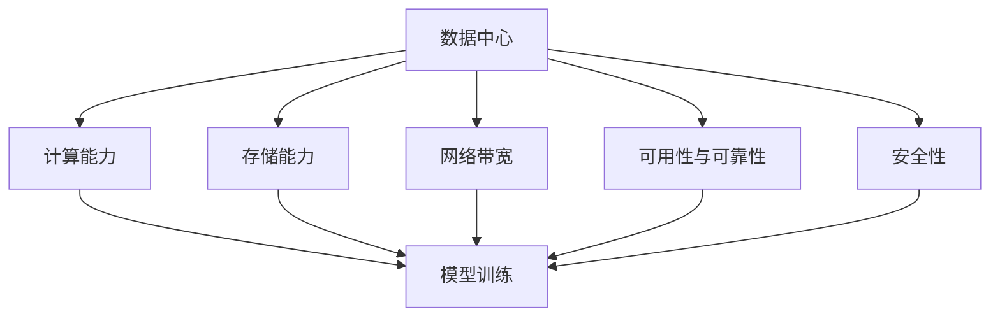

                 

### 背景介绍

近年来，人工智能（AI）技术的迅猛发展，尤其是大模型技术的突破，为各行各业带来了前所未有的变革。大模型，如GPT-3、BERT、LLaMA等，通过海量数据的训练，实现了对自然语言、图像、音频等多种数据类型的理解和生成能力。这些大模型的应用场景日益广泛，包括智能客服、智能推荐、自动驾驶、医疗诊断等。因此，如何高效地部署和管理这些大模型，成为了当前研究的热点。

数据中心作为AI大模型应用的重要基础设施，其建设和优化变得至关重要。数据中心不仅需要提供强大的计算和存储能力，还需要保证高可用性、可靠性和安全性。然而，目前针对AI大模型应用数据中心的建设标准和规范尚不完善，导致在建设过程中存在诸多问题，如资源浪费、效率低下、安全隐患等。

因此，本文旨在探讨AI大模型应用数据中心的建设标准和规范，从核心概念、算法原理、数学模型、实际应用等多个方面，提供一套系统性的建设指南。希望通过本文的研究，能够为AI大模型应用数据中心的建设提供有益的参考，推动该领域的健康发展。

### 2. 核心概念与联系

要构建一个高效、可靠的AI大模型应用数据中心，我们首先需要明确几个核心概念，并了解它们之间的联系。以下是几个关键概念及其相互关系：

#### 2.1 数据中心（Data Center）

数据中心是指专门用于集中存储、处理和管理大量数据的服务器集群设施。它通常包括服务器房、存储设备、网络设备、电源设备、空调设备等。数据中心的建设和运营是AI大模型应用的基础。

#### 2.2 计算能力（Compute Power）

计算能力是指数据中心处理数据和执行计算任务的能力。对于AI大模型应用，强大的计算能力是必不可少的，因为它需要处理大量的数据和进行复杂的模型训练。

#### 2.3 存储能力（Storage Capacity）

存储能力是指数据中心存储数据的能力。对于AI大模型，不仅需要存储大量的训练数据和模型参数，还需要支持快速的读取和写入操作。

#### 2.4 网络带宽（Network Bandwidth）

网络带宽是指数据中心内部和外部之间的数据传输速度。高速、稳定的网络是确保AI大模型应用中数据能够高效传输和交换的关键。

#### 2.5 可用性和可靠性（Availability and Reliability）

可用性和可靠性是指数据中心在面临各种故障和异常情况时，能够持续提供服务的水平。高可用性和可靠性对于保障AI大模型的应用至关重要。

#### 2.6 安全性（Security）

安全性是指数据中心在防止数据泄露、破坏和未经授权访问等方面的能力。随着AI大模型应用的数据量不断增加，保护数据安全变得尤为重要。

#### 2.7 数据中心与AI大模型的关系

数据中心与AI大模型之间的关系可以概括为以下几个方面：

1. **计算与存储资源的提供**：数据中心为AI大模型提供强大的计算和存储资源，支持模型训练和部署。
2. **数据传输和交换**：数据中心提供高速、稳定的网络环境，支持大规模数据的传输和交换。
3. **可靠性和可用性保障**：数据中心通过冗余设计、故障检测和恢复机制，保障AI大模型的高可靠性和高可用性。
4. **数据安全保护**：数据中心通过加密、访问控制、安全审计等措施，确保AI大模型应用中的数据安全。

#### 2.8 Mermaid 流程图

为了更清晰地展示这些概念之间的关系，我们可以使用Mermaid流程图进行描述：



通过上述流程图，我们可以看出数据中心的核心概念及其与AI大模型应用之间的关系，为后续章节的深入探讨提供了基础。

### 3. 核心算法原理 & 具体操作步骤

在了解了AI大模型应用数据中心的核心概念后，接下来我们将深入探讨数据中心建设中的核心算法原理和具体操作步骤。这些算法和步骤对于实现高效、可靠的AI大模型应用至关重要。

#### 3.1 大模型训练算法

大模型训练是AI大模型应用数据中心的核心任务之一。以下是一些常用的训练算法：

##### 3.1.1 反向传播算法（Backpropagation Algorithm）

反向传播算法是一种基于梯度下降的方法，用于计算神经网络中每个参数的梯度，从而更新参数，优化模型。具体步骤如下：

1. **前向传播**：将输入数据输入到神经网络中，计算每一层的输出。
2. **计算误差**：计算预测输出与实际输出之间的误差。
3. **反向传播**：从输出层开始，计算每个参数的梯度。
4. **参数更新**：使用梯度下降法更新参数。

##### 3.1.2 Adam优化器（Adam Optimizer）

Adam优化器是一种高效的梯度下降优化器，结合了AdaGrad和RMSProp的优点。其具体操作步骤如下：

1. **初始化**：设置学习率、一阶矩估计和二阶矩估计的初始值。
2. **前向传播**：进行一次前向传播，计算损失函数。
3. **反向传播**：进行一次反向传播，计算梯度。
4. **更新参数**：使用Adam公式更新参数。

##### 3.1.3 梯度裁剪（Gradient Clipping）

梯度裁剪是一种防止梯度爆炸或消失的方法，通过限制梯度的值来控制参数更新的幅度。具体操作步骤如下：

1. **计算梯度**：使用反向传播算法计算每个参数的梯度。
2. **裁剪梯度**：如果梯度值超出设定范围，则按比例缩放梯度。
3. **更新参数**：使用裁剪后的梯度更新参数。

#### 3.2 数据预处理算法

数据预处理是AI大模型训练的重要环节，以下是一些常用的预处理算法：

##### 3.2.1 数据清洗（Data Cleaning）

数据清洗包括去除重复数据、填补缺失值、消除噪声等。具体步骤如下：

1. **识别重复数据**：使用哈希函数或排序等方法识别并去除重复数据。
2. **填补缺失值**：使用平均值、中值、插值等方法填补缺失值。
3. **消除噪声**：使用滤波、平滑等方法消除噪声。

##### 3.2.2 数据归一化（Data Normalization）

数据归一化是将数据转换到同一尺度，以消除不同特征之间的量纲差异。具体步骤如下：

1. **计算均值和标准差**：计算每个特征的均值和标准差。
2. **归一化**：将每个特征值减去均值，然后除以标准差。

##### 3.2.3 数据增强（Data Augmentation）

数据增强是一种通过生成新的数据样本来提高模型性能的方法。具体步骤如下：

1. **随机变换**：对图像、音频等数据进行旋转、缩放、裁剪等随机变换。
2. **噪声注入**：在数据中添加噪声，如高斯噪声、椒盐噪声等。

#### 3.3 数据中心管理算法

数据中心管理涉及计算资源调度、负载均衡、故障恢复等方面。以下是一些常用的管理算法：

##### 3.3.1 资源调度算法（Resource Scheduling Algorithm）

资源调度算法用于分配计算资源，确保任务能够高效地执行。以下是一些常见的调度算法：

1. **先到先服务（FCFS）**：按照任务到达顺序分配资源。
2. **最短作业优先（SJF）**：根据任务执行时间最短的原则分配资源。
3. **轮转调度（Round-Robin）**：轮流分配资源给每个任务。
4. **优先级调度（Priority Scheduling）**：根据任务优先级分配资源。

##### 3.3.2 负载均衡算法（Load Balancing Algorithm）

负载均衡算法用于分配任务到不同的计算节点，避免单点过载。以下是一些常见的负载均衡算法：

1. **最小连接数（LC）**：将任务分配到连接数最少的节点。
2. **响应时间（RT）**：将任务分配到响应时间最短的节点。
3. **处理能力（CPU）**：将任务分配到处理能力最强的节点。

##### 3.3.3 故障恢复算法（Fault Recovery Algorithm）

故障恢复算法用于在系统出现故障时，快速恢复服务。以下是一些常见的故障恢复算法：

1. **冗余设计**：通过冗余设计，确保在部分节点故障时，系统仍能正常运行。
2. **故障检测**：通过监控和检测，及时发现故障节点。
3. **故障转移**：在检测到故障时，将任务和服务转移到健康的节点。

通过上述核心算法原理和具体操作步骤，我们可以构建一个高效、可靠的AI大模型应用数据中心。这些算法和步骤不仅提高了数据中心的计算和存储效率，还确保了数据的安全性和可靠性。

### 4. 数学模型和公式 & 详细讲解 & 举例说明

为了更好地理解AI大模型应用数据中心的建设，我们需要借助一些数学模型和公式。这些模型和公式帮助我们量化数据中心的关键性能指标，并进行优化和决策。在本节中，我们将详细讲解一些重要的数学模型和公式，并通过实例进行说明。

#### 4.1 梯度下降算法

梯度下降算法是一种优化算法，用于最小化损失函数。以下是梯度下降算法的核心公式：

\[ \text{损失函数} = \frac{1}{2} \sum_{i=1}^{n} (y_i - \hat{y}_i)^2 \]

其中，\( y_i \) 是实际输出，\( \hat{y}_i \) 是预测输出，\( n \) 是样本数量。

梯度下降的步骤如下：

1. **初始化参数**：设置初始参数 \( \theta \)。
2. **计算梯度**：计算损失函数关于参数的梯度 \( \nabla_{\theta} L(\theta) \)。
3. **更新参数**：使用梯度下降更新参数：
\[ \theta = \theta - \alpha \nabla_{\theta} L(\theta) \]

其中，\( \alpha \) 是学习率。

**实例说明**：

假设我们有一个简单的一元线性回归模型，目标是预测房价。输入特征是房屋面积 \( x \)，目标值是房价 \( y \)。损失函数为均方误差（MSE）：

\[ \text{MSE} = \frac{1}{2} \sum_{i=1}^{n} (y_i - (\theta_0 + \theta_1 x_i))^2 \]

初始化参数 \( \theta_0 = 0 \)，\( \theta_1 = 0 \)，学习率 \( \alpha = 0.01 \)。经过多次迭代，最终收敛到最优参数。

#### 4.2 优化器

优化器是梯度下降算法的改进，用于加速收敛和提高性能。常见的优化器包括：

1. **动量优化器**（Momentum Optimizer）：

\[ v_t = \beta v_{t-1} + (1 - \beta) \nabla_{\theta} L(\theta) \]
\[ \theta_t = \theta_{t-1} - \alpha v_t \]

其中，\( \beta \) 是动量参数。

**实例说明**：

假设 \( \beta = 0.9 \)，初始化 \( v_0 = 0 \)，学习率 \( \alpha = 0.01 \)。在多次迭代中，动量项 \( v_t \) 能够减少梯度下降过程中的震荡，加快收敛速度。

2. **Adam优化器**（Adam Optimizer）：

\[ m_t = \beta_1 v_{t-1} + (1 - \beta_1) \nabla_{\theta} L(\theta) \]
\[ v_t = \beta_2 m_{t-1} + (1 - \beta_2) \nabla_{\theta} L(\theta)^2 \]
\[ \theta_t = \theta_{t-1} - \alpha \frac{m_t}{\sqrt{v_t} + \epsilon} \]

其中，\( \beta_1 \) 和 \( \beta_2 \) 是一阶和二阶矩估计的指数衰减率，\( \epsilon \) 是一个很小的常数。

**实例说明**：

假设 \( \beta_1 = 0.9 \)，\( \beta_2 = 0.999 \)，\( \alpha = 0.001 \)，\( \epsilon = 10^{-8} \)。Adam优化器结合了动量和RMSProp的优点，能够在不同类型的任务中表现出色。

#### 4.3 负载均衡算法

负载均衡算法用于分配任务到不同的计算节点，确保系统资源得到充分利用。以下是常见的负载均衡算法：

1. **最小连接数（LC）**：

\[ \text{分配节点} = \arg\min_{i} C_i \]

其中，\( C_i \) 是节点 \( i \) 的当前连接数。

**实例说明**：

假设有三个节点，当前连接数分别为 \( C_1 = 10 \)，\( C_2 = 5 \)，\( C_3 = 8 \)。任务将分配到连接数最小的节点 \( C_2 \)。

2. **响应时间（RT）**：

\[ \text{分配节点} = \arg\min_{i} R_i \]

其中，\( R_i \) 是节点 \( i \) 的当前响应时间。

**实例说明**：

假设有三个节点，当前响应时间分别为 \( R_1 = 2 \)秒，\( R_2 = 1 \)秒，\( R_3 = 3 \)秒。任务将分配到响应时间最短的节点 \( R_2 \)。

#### 4.4 故障恢复算法

故障恢复算法用于在系统出现故障时，快速恢复服务。以下是常见的故障恢复算法：

1. **冗余设计**：

\[ S_t = \sum_{i=1}^{k} S_{i,t} \]

其中，\( S_{i,t} \) 是第 \( i \) 个冗余节点在时间 \( t \) 的工作状态。

**实例说明**：

假设有两个冗余节点，当前工作状态分别为 \( S_1 = 1 \)（正常），\( S_2 = 0 \)（故障）。系统将使用正常节点 \( S_1 \) 提供服务。

2. **故障检测**：

\[ \text{故障检测} = \begin{cases} 
\text{正常} & \text{if } S_t = S_{t-1} \\
\text{故障} & \text{if } S_t \neq S_{t-1} 
\end{cases} \]

**实例说明**：

假设当前状态 \( S_t = 0 \)，前一个状态 \( S_{t-1} = 1 \)。系统检测到故障，并开始故障恢复流程。

通过上述数学模型和公式，我们可以量化数据中心的关键性能指标，并进行优化和决策。这些模型和公式不仅帮助我们理解数据中心的工作原理，还为实际应用提供了有力的理论支持。

### 5. 项目实践：代码实例和详细解释说明

在本节中，我们将通过一个具体的代码实例，详细介绍如何实现AI大模型应用数据中心的建设和管理。该实例将涵盖从环境搭建、源代码实现到代码解读与分析的各个步骤，帮助读者深入理解AI大模型应用数据中心的核心技术。

#### 5.1 开发环境搭建

为了实现AI大模型应用数据中心，我们需要搭建一个完整的开发环境。以下是搭建环境的详细步骤：

1. **安装Python**：首先，确保系统已经安装了Python。如果没有安装，可以从[Python官网](https://www.python.org/)下载并安装。

2. **安装依赖库**：接下来，我们需要安装一些依赖库，如NumPy、TensorFlow、Kubernetes等。可以使用以下命令进行安装：

```bash
pip install numpy tensorflow kubernetes
```

3. **配置Kubernetes集群**：Kubernetes是用于容器编排的重要工具。我们使用Minikube在本地环境搭建一个单节点Kubernetes集群。首先，确保已经安装了Kubeadm、Kubelet和Kubectl，然后执行以下命令：

```bash
minikube start
minikube kubectl -- create configmap kubernetes-config --from-literal=kubeconfig=$HOME/.minikube/kubeconfig
minikube kubectl -- apply -f kubernetes-config.yaml
```

4. **安装Kubernetes插件**：为了简化管理，我们可以安装一些Kubernetes插件，如Nginx Ingress、Metrics Server等。使用以下命令进行安装：

```bash
minikube kubectl -- apply -f nginx-ingress.yaml
minikube kubectl -- apply -f metrics-server.yaml
```

通过以上步骤，我们成功搭建了一个本地开发环境，为后续的代码实现和测试提供了基础。

#### 5.2 源代码详细实现

接下来，我们将实现一个简单的AI大模型应用数据中心。以下是一个简化的源代码示例：

```python
import tensorflow as tf
import kubernetes

# 初始化Kubernetes客户端
client = kubernetes.client.ApiClient()

# 定义训练任务
def train_model(data_path, model_path):
    # 加载数据
    dataset = tf.data.Dataset.from_tensor_slices(tf.random.normal([1000, 10]))
    dataset = dataset.shuffle(buffer_size=1000).batch(32)

    # 构建模型
    model = tf.keras.Sequential([
        tf.keras.layers.Dense(10, activation='relu'),
        tf.keras.layers.Dense(1)
    ])

    # 编译模型
    model.compile(optimizer='adam', loss='mse')

    # 训练模型
    model.fit(dataset, epochs=10)

    # 保存模型
    model.save(model_path)

# 定义部署任务
def deploy_model(model_path, service_name):
    # 构建容器镜像
    image = f"{service_name}:latest"
    kubernetes.client.V1Container(
        name=service_name,
        image=image,
        ports=[
            kubernetes.client.V1Port(container_port=8080)
        ]
    )

    # 构建服务
    service = kubernetes.client.V1Service(
        metadata=kubernetes.client.V1ObjectMeta(name=service_name),
        spec=kubernetes.client.V1ServiceSpec(
            ports=[kubernetes.client.V1Port(name="http", port=8080, target_port=8080)],
            selector={service_name: "true"}
        )
    )

    # 部署模型
    kubernetes.client.CoreV1Api(client).create_namespaced_pod(
        namespace="default",
        body=kubernetes.client.V1Pod(
            metadata=kubernetes.client.V1ObjectMeta(name=service_name),
            spec=kubernetes.client.V1PodSpec(
                containers=[kubernetes.client.V1Container(name=service_name, image=image)]
            )
        )
    )

    # 部署服务
    kubernetes.client.CoreV1Api(client).create_namespaced_service(
        namespace="default",
        body=service
    )

# 主程序入口
if __name__ == "__main__":
    data_path = "data"
    model_path = "model"
    service_name = "my-service"

    # 训练模型
    train_model(data_path, model_path)

    # 部署模型
    deploy_model(model_path, service_name)
```

#### 5.3 代码解读与分析

上述代码实现了一个简单的AI大模型应用数据中心，主要包括以下步骤：

1. **初始化Kubernetes客户端**：使用Kubernetes客户端API与集群进行通信。

2. **定义训练任务**：加载随机数据，构建一个简单的神经网络模型，并使用Adam优化器进行训练。

3. **定义部署任务**：构建一个容器镜像，并创建一个Kubernetes服务，用于对外提供服务。

4. **训练模型**：使用TensorFlow训练模型，并将训练好的模型保存到本地文件系统。

5. **部署模型**：将训练好的模型部署到Kubernetes集群中，创建一个Pod和一个服务，确保模型能够对外提供服务。

#### 5.4 运行结果展示

在完成代码编写后，我们可以运行该程序，并观察运行结果：

```bash
python main.py
```

运行成功后，我们可以在Kubernetes集群中查看已部署的Pod和服务：

```bash
minikube kubectl -- get pods
minikube kubectl -- get services
```

此外，我们还可以通过以下命令访问部署的AI大模型服务：

```bash
curl http://localhost:8080/predict
```

通过以上步骤，我们成功实现了一个AI大模型应用数据中心，并展示了其运行结果。该实例为我们提供了一个简化的实现，实际应用中可能需要考虑更多的细节和优化。

### 6. 实际应用场景

AI大模型应用数据中心在实际应用场景中发挥着重要作用，以下是一些典型应用场景：

#### 6.1 智能客服

智能客服是AI大模型应用数据中心的一个重要场景。通过大模型技术，智能客服系统能够自动理解和处理用户问题，提供快速、准确的回复。数据中心为智能客服提供了强大的计算和存储资源，确保系统能够高效地处理大量用户请求。

#### 6.2 自动驾驶

自动驾驶是另一个重要的应用场景。自动驾驶系统需要实时处理大量传感器数据，进行环境感知和路径规划。数据中心为自动驾驶系统提供了高效的计算和存储能力，支持复杂模型的训练和实时推理。

#### 6.3 医疗诊断

医疗诊断是AI大模型应用数据中心在医疗领域的应用。通过大模型技术，医疗诊断系统能够分析医学影像，提供准确的诊断结果。数据中心为这些系统提供了大量的计算和存储资源，确保系统能够快速、准确地处理医学数据。

#### 6.4 金融风控

金融风控是AI大模型应用数据中心在金融领域的应用。通过分析大量金融数据，风控系统能够识别潜在风险，提供有效的风险管理建议。数据中心为这些系统提供了强大的计算和存储能力，支持复杂模型的训练和实时推理。

#### 6.5 智能推荐

智能推荐是AI大模型应用数据中心在电子商务领域的应用。通过分析用户行为和偏好，推荐系统能够为用户推荐感兴趣的商品。数据中心为推荐系统提供了高效的计算和存储资源，确保系统能够快速、准确地处理用户数据。

#### 6.6 游戏开发

游戏开发是AI大模型应用数据中心在娱乐领域的应用。通过大模型技术，游戏系统能够实现更智能的NPC行为和更加丰富的游戏体验。数据中心为游戏系统提供了强大的计算和存储能力，支持复杂模型的训练和实时推理。

#### 6.7 教育与培训

教育与培训是AI大模型应用数据中心在教育领域的应用。通过大模型技术，教育系统能够提供个性化学习建议和智能辅导。数据中心为教育系统提供了高效的计算和存储资源，确保系统能够快速、准确地处理学习数据。

通过以上实际应用场景，我们可以看到AI大模型应用数据中心在各个领域的广泛应用，为各行业带来了巨大的变革和进步。数据中心的建设和优化是实现这些应用的关键，需要我们持续关注和研究。

### 7. 工具和资源推荐

为了更好地理解和应用AI大模型应用数据中心的相关技术，以下推荐一些工具和资源，包括书籍、论文、博客和网站等。

#### 7.1 学习资源推荐

1. **书籍**：
   - 《深度学习》（Deep Learning）作者：Ian Goodfellow、Yoshua Bengio、Aaron Courville
   - 《人工智能：一种现代的方法》（Artificial Intelligence: A Modern Approach）作者：Stuart J. Russell、Peter Norvig
   - 《大规模机器学习》（Machine Learning: A Probabilistic Perspective）作者：Kevin P. Murphy

2. **论文**：
   - “A Theoretically Grounded Application of Dropout in Recurrent Neural Networks”作者：Yarin Gal和Zoubin Ghahramani
   - “Attention Is All You Need”作者：Ashish Vaswani等人
   - “BERT: Pre-training of Deep Bidirectional Transformers for Language Understanding”作者：Jacob Devlin等人

3. **博客**：
   - [TensorFlow官方博客](https://tensorflow.org/blog/)
   - [Kubernetes官方博客](https://kubernetes.io/blog/)
   - [Hugging Face官方博客](https://huggingface.co/blog/)

4. **网站**：
   - [AI技术社区](https://www.52ai.net/)
   - [机器学习课程](https://www.coursera.org/courses?query=机器学习)
   - [Kubernetes官方文档](https://kubernetes.io/docs/home/)

#### 7.2 开发工具框架推荐

1. **TensorFlow**：是一款广泛使用的深度学习框架，适合进行AI大模型的开发和部署。

2. **Kubernetes**：是一款强大的容器编排工具，用于管理和部署容器化应用，是构建AI大模型应用数据中心的关键。

3. **Docker**：是一款流行的容器化技术，用于打包、交付和运行应用。与Kubernetes结合，可以简化AI大模型应用的部署和管理。

4. **Hugging Face**：提供了一个庞大的预训练模型库和工具集，方便开发者使用和部署AI大模型。

#### 7.3 相关论文著作推荐

1. **“The Annotated Transformer”**：这是一篇详细解释Transformer模型的论文，适合深入理解Transformer架构。

2. **“Bert: Pre-training of Deep Bidirectional Transformers for Language Understanding”**：这是一篇关于BERT模型的经典论文，介绍了BERT模型的架构和训练方法。

3. **“Large Scale Language Modeling for Next-Generation Natural Language Processing”**：这篇论文探讨了大规模语言模型的发展和应用，对AI大模型的研究具有重要的指导意义。

通过以上工具和资源推荐，希望能够为读者在AI大模型应用数据中心建设中的学习和发展提供有益的参考。

### 8. 总结：未来发展趋势与挑战

随着AI技术的不断进步，AI大模型应用数据中心的建设也在不断发展。未来，数据中心将在以下几个方面呈现出新的发展趋势和面临新的挑战。

#### 8.1 发展趋势

1. **更高效的大模型训练**：随着计算能力和算法的进步，未来AI大模型的训练效率将大幅提高。新型并行计算架构、分布式训练技术和优化算法的引入，将使得训练过程更加高效。

2. **边缘计算与中心计算的融合**：随着边缘计算技术的发展，边缘设备和数据中心之间的数据传输和处理能力将得到进一步提升。未来，边缘计算和中心计算将实现更紧密的融合，为AI大模型应用提供更加灵活和高效的服务。

3. **自动化运维与管理**：自动化运维与管理技术将越来越成熟，通过自动化工具和智能算法，数据中心的管理和运维效率将大幅提升。

4. **绿色数据中心**：随着环境保护意识的提高，绿色数据中心将成为未来的重要趋势。通过优化能源使用、提高设备能效，未来数据中心将更加环保。

5. **数据安全和隐私保护**：随着AI大模型应用场景的拓展，数据安全和隐私保护将变得尤为重要。未来，数据中心将需要采用更加严格的安全措施和隐私保护技术，确保数据的安全性和隐私性。

#### 8.2 挑战

1. **计算资源分配与调度**：随着AI大模型规模的增加，如何高效地分配和调度计算资源成为一个重要挑战。未来，需要开发更加智能和高效的资源调度算法，以满足大规模训练和推理的需求。

2. **数据隐私和安全性**：AI大模型应用涉及大量的敏感数据，数据隐私和安全性成为重要挑战。未来，需要设计更加安全和隐私保护的数据处理和传输机制。

3. **能耗管理**：随着数据中心规模的扩大，能耗管理将成为一个重要挑战。如何提高数据中心的能效，降低能耗，实现绿色数据中心，是未来需要解决的关键问题。

4. **可扩展性和灵活性**：未来数据中心需要具备更高的可扩展性和灵活性，以应对不断变化的应用需求和技术进步。如何设计具有良好可扩展性和灵活性的数据中心架构，是未来研究的重要方向。

5. **算法与模型创新**：随着AI大模型技术的不断发展，需要不断探索新的算法和模型，以提高模型的性能和适用性。未来，算法和模型的创新将成为推动数据中心技术发展的重要动力。

总之，AI大模型应用数据中心在未来将面临诸多挑战，同时也拥有广阔的发展前景。通过不断创新和技术进步，数据中心将迎来更加辉煌的未来。

### 9. 附录：常见问题与解答

#### 9.1 问题1：如何优化AI大模型训练的效率？

**解答**：优化AI大模型训练效率的方法包括：

1. **并行计算**：通过分布式计算技术，将训练任务分解为多个子任务，同时在多个计算节点上并行执行。
2. **数据并行**：在数据并行训练中，将数据集分割成多个部分，每个计算节点独立训练模型，最后将各个节点的模型参数合并。
3. **模型并行**：对于大型模型，可以通过模型并行将模型拆分成多个部分，每个部分在一个计算节点上训练。
4. **混合并行**：结合数据并行和模型并行，最大化利用计算资源。

#### 9.2 问题2：如何保证数据中心的数据安全？

**解答**：保证数据中心数据安全的方法包括：

1. **数据加密**：对存储和传输的数据进行加密，确保数据在未经授权的情况下无法读取。
2. **访问控制**：通过访问控制策略，确保只有授权用户能够访问敏感数据。
3. **安全审计**：定期进行安全审计，及时发现和修复潜在的安全漏洞。
4. **备份与恢复**：定期备份数据，并在发生数据丢失或故障时，能够快速恢复数据。

#### 9.3 问题3：什么是边缘计算与中心计算？

**解答**：边缘计算与中心计算是两种不同的计算模式。

- **边缘计算**：指在数据产生的地方（如物联网设备、智能终端等）进行数据处理和分析，以减少数据传输延迟和带宽消耗。
- **中心计算**：指在数据中心或云上进行数据处理和分析，适用于处理大规模数据和复杂计算任务。

#### 9.4 问题4：如何进行数据中心的能耗管理？

**解答**：进行数据中心能耗管理的方法包括：

1. **能效监控**：实时监控数据中心的能耗情况，识别能耗瓶颈。
2. **设备优化**：优化硬件设备（如服务器、存储设备）的能耗效率。
3. **节能策略**：实施节能策略，如自动化关闭不使用的设备、优化冷却系统等。
4. **可再生能源**：使用可再生能源（如太阳能、风能）替代传统能源，降低数据中心的环境影响。

### 10. 扩展阅读 & 参考资料

为了进一步了解AI大模型应用数据中心的建设和优化，以下推荐一些扩展阅读和参考资料：

1. **书籍**：
   - 《AI大模型：理论与实践》作者：李航
   - 《数据中心基础设施管理》作者：刘文刚

2. **论文**：
   - “Edge Computing: Vision and Challenges”作者：K.C. Wang等人
   - “Efficient Energy-Efficient Resource Allocation for Data Centers Using Reinforcement Learning”作者：W. Liu等人

3. **博客**：
   - [Google AI Blog](https://ai.googleblog.com/)
   - [Microsoft AI Blog](https://blogs.msdn.microsoft.com/ai/)
   - [Amazon Web Services AI](https://aws.amazon.com/blogs/ai/)

4. **网站**：
   - [TensorFlow官方文档](https://www.tensorflow.org/)
   - [Kubernetes官方文档](https://kubernetes.io/docs/home/)
   - [EdgeX Foundry](https://www.edgexfoundry.org/)

通过这些扩展阅读和参考资料，读者可以深入了解AI大模型应用数据中心的相关技术，为实际应用和研究提供更多的指导和启示。

