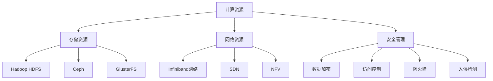

                 

### 1. 背景介绍

随着人工智能（AI）技术的迅猛发展，大模型在自然语言处理、计算机视觉、语音识别等领域展现出了极高的应用价值。为了支撑这些复杂模型的训练和推理，数据中心建设成为了一项至关重要的任务。数据中心不仅是大模型应用的基础设施，其性能、稳定性和安全性直接影响到AI应用的效率和可靠性。

当前，AI大模型应用数据中心的建设面临诸多挑战。首先，大模型的训练和推理需要大量的计算资源和存储资源，对数据中心的硬件设施提出了极高的要求。其次，数据中心的网络架构和运维管理需要能够高效地处理大规模数据传输和负载均衡。此外，数据安全和隐私保护也是数据中心建设中的关键问题，特别是在涉及敏感数据和应用场景时。

本篇技术博客旨在探讨AI大模型应用数据中心的标准与规范，详细分析数据中心在硬件、网络、安全和运维管理等方面的建设要求。通过逐步推理和深入探讨，我们希望能够为数据中心的建设者提供有价值的参考，促进AI大模型应用数据中心的高效、稳定和可靠运行。

本文将按照以下结构展开：

1. **背景介绍**：简要概述AI大模型应用数据中心的建设背景和当前面临的挑战。
2. **核心概念与联系**：介绍数据中心建设中的核心概念，并使用Mermaid流程图展示相关架构。
3. **核心算法原理与具体操作步骤**：详细讲解数据中心建设中的关键算法和技术，包括硬件选择、网络架构设计等。
4. **数学模型和公式**：介绍数据中心建设中涉及的数学模型和公式，并进行详细解释和举例说明。
5. **项目实践**：通过一个具体的项目实例，展示数据中心建设的实际操作步骤和代码实现。
6. **实际应用场景**：探讨数据中心在不同AI应用场景中的实际作用和效果。
7. **工具和资源推荐**：推荐学习资源、开发工具和框架。
8. **总结**：总结数据中心建设的关键技术和未来发展趋势。
9. **附录**：提供常见问题与解答。
10. **扩展阅读**：推荐相关参考资料。

通过上述内容的逐步分析和推理，我们将对AI大模型应用数据中心的建设有更深入的理解和认识。

### 1.1 AI大模型应用数据中心的发展历程

AI大模型应用数据中心的发展历程可以追溯到20世纪末和21世纪初。当时，深度学习技术开始逐渐兴起，一些研究机构和科技公司开始尝试使用简单的神经网络模型进行图像识别、语音识别等任务。这些初步尝试表明，大规模数据处理和计算资源的需求正在不断增长。

进入21世纪10年代，随着计算能力的提升和数据量的爆炸式增长，AI大模型得到了快速发展。这一时期，GPU计算技术的发展为深度学习提供了强大的支持。Google的TensorFlow、Facebook的PyTorch等开源深度学习框架的推出，使得大模型的训练和推理变得更加便捷和高效。

随着AI技术的不断进步，大模型的规模也在不断增大。例如，GPT-3、BERT等模型已经拥有数十亿甚至千亿级的参数量。这些大模型的训练和推理需要海量的计算资源和存储资源，对数据中心的建设提出了更高的要求。数据中心不仅要能够提供强大的计算能力，还需要保证高可用性和安全性。

在数据中心的建设过程中，一些关键技术也逐渐成熟。例如，分布式存储系统、高性能网络架构、自动化运维管理等技术的应用，使得数据中心能够更好地支撑大模型的训练和推理需求。此外，边缘计算和云计算的融合，也为数据中心的建设提供了新的思路和方向。

总的来说，AI大模型应用数据中心的发展历程是技术不断迭代和进步的过程。从最初的简单尝试到如今的高性能数据中心建设，AI大模型的应用已经深刻改变了我们的生活和工业生产方式。随着AI技术的进一步发展，数据中心建设将继续面临新的挑战和机遇，为AI应用提供更强大的支撑。

### 1.2 当前AI大模型应用数据中心建设的现状

当前，AI大模型应用数据中心的建设已经取得了显著的进展，但同时也面临着诸多挑战。首先，从硬件设施的角度来看，高性能计算（HPC）和大数据处理能力成为了数据中心建设的核心。GPU计算能力、高性能存储系统和高速网络设备的应用，使得数据中心能够提供强大的计算和存储能力，支撑起大模型的训练和推理需求。

然而，硬件设施的高性能并不代表数据中心建设的成功。网络架构的设计和优化同样至关重要。为了满足大模型对海量数据传输的高效需求，数据中心需要采用高性能网络架构，如分布式网络、SDN（软件定义网络）和NFV（网络功能虚拟化）等技术。这些技术的应用可以优化数据传输路径，提高网络带宽和传输效率，从而提升数据中心的整体性能。

在数据中心的建设过程中，安全性问题也是不可忽视的关键因素。大模型通常涉及大量的敏感数据，如个人信息、企业数据等，一旦发生数据泄露或损坏，将会造成严重的后果。因此，数据中心需要采取严格的安全措施，包括数据加密、访问控制、网络安全防护等。此外，随着云计算和边缘计算的普及，数据中心还需要具备应对分布式攻击和跨域安全威胁的能力。

除了硬件和网络安全，数据中心的运维管理也是一大挑战。大模型的训练和推理过程中，数据量和计算负载会不断变化，这对数据中心的运维管理提出了更高的要求。自动化运维管理系统的应用，如自动化监控、自动化部署和自动化故障处理等，可以大幅提高数据中心的运维效率，降低人工干预的需求。同时，建立完善的运维管理制度和流程，也是保障数据中心稳定运行的重要手段。

在当前的AI大模型应用数据中心建设中，虽然已经取得了一定的进展，但仍然存在一些不足之处。首先，数据中心的整体架构设计不够灵活，难以快速适应业务需求的变化。其次，一些数据中心的硬件设备和网络架构尚未完全优化，导致性能瓶颈和资源浪费。此外，数据安全和隐私保护仍然是一个亟待解决的问题，特别是在涉及跨境数据和跨域业务时。

总的来说，当前AI大模型应用数据中心建设面临的主要挑战包括硬件设施的高性能需求、网络架构的优化、安全性的保障和运维管理的提升。只有解决这些问题，才能构建起高效、稳定和可靠的大模型应用数据中心，为AI技术的发展提供坚实的基础。

### 1.3 建设AI大模型应用数据中心的重要性和意义

建设AI大模型应用数据中心的重要性不言而喻。首先，从技术层面来看，数据中心是支撑AI大模型训练和推理的核心基础设施。大模型的训练和推理过程需要海量的计算资源和存储资源，数据中心的高性能计算能力和高效数据传输网络是保障这些任务顺利完成的基础。通过数据中心的建设，可以充分发挥硬件设备的高性能，提高大模型训练和推理的效率。

其次，从应用层面来看，数据中心的建设对于推动AI技术的发展和应用具有重要意义。随着AI技术的不断进步，越来越多的行业和应用领域开始引入大模型进行创新。例如，在医疗领域，AI大模型可以用于疾病诊断和治疗方案推荐；在金融领域，大模型可以用于风险控制和投资策略优化；在交通领域，大模型可以用于智能交通管理和车辆调度。数据中心的建设为这些AI应用提供了坚实的计算和存储支持，推动了AI技术的广泛应用和产业化。

此外，数据中心的建设还具有显著的经济和社会效益。在经济层面，数据中心的建设和运营可以创造大量的就业机会，促进相关产业的发展。同时，数据中心的建设还可以吸引更多的高科技企业和人才聚集，提升地区经济发展的活力。在社会层面，数据中心的建设有助于提高社会生产力和生活质量。例如，通过智能城市的建设，数据中心可以为城市管理和公共服务的优化提供数据支持，提升市民的生活质量。

然而，数据中心建设也面临一定的挑战。首先，数据中心的建设和运营需要大量的资金投入，这对企业和政府的资金实力提出了较高的要求。其次，数据中心的高效运行需要专业的技术团队进行运维管理，这对人才的需求也提出了新的要求。此外，数据安全和隐私保护是数据中心建设中的重要问题，需要采取有效的措施进行保障。

综上所述，建设AI大模型应用数据中心具有重要的技术、应用和经济意义。通过数据中心的建设，可以推动AI技术的发展和应用，提高社会生产力和生活质量。同时，数据中心建设也面临一定的挑战，需要政府、企业和专业机构的共同努力，才能实现数据中心的高效、稳定和安全运行。

### 2. 核心概念与联系

在建设AI大模型应用数据中心的过程中，理解并掌握一系列核心概念和它们之间的联系是至关重要的。以下将详细探讨这些核心概念，并通过Mermaid流程图展示相关架构。

#### 2.1 数据中心架构

数据中心架构是整个系统的核心，它包括计算资源、存储资源、网络资源和安全管理等组成部分。数据中心架构的设计需要考虑高可用性、高性能和可扩展性。

- **计算资源**：数据中心的核心组成部分，主要包括服务器、GPU集群等。这些计算资源承担了AI大模型的训练和推理任务，是数据中心计算能力的体现。
- **存储资源**：用于存储大量的训练数据和模型数据。高性能的存储系统如SSD、分布式文件系统（如HDFS、Ceph）等，能够提供快速的数据读写能力，支撑大模型的训练和推理。
- **网络资源**：负责数据在数据中心内部和外部的传输。高性能网络设备如交换机、路由器等，以及高速网络协议（如TCP/IP、Infiniband）的运用，是确保数据传输高效稳定的关键。
- **安全管理**：包括数据加密、访问控制、防火墙、入侵检测等，确保数据中心的安全性和数据的隐私保护。

#### 2.2 分布式存储系统

分布式存储系统在大模型应用中扮演了关键角色，它能够提供高可用性、高可靠性和高扩展性。以下是一些常见的分布式存储系统：

- **Hadoop HDFS**：一个分布式文件系统，适用于大数据存储和处理。HDFS采用主从架构，通过NameNode和DataNode的协同工作，实现文件的高效存储和分布式处理。
- **Ceph**：一个开源的分布式存储系统，支持块存储、对象存储和文件系统，具有良好的扩展性和容错性。
- **GlusterFS**：一个分布式文件系统，支持文件级数据存储，通过分布式元数据管理，实现了高可用性和数据冗余。

#### 2.3 高性能网络架构

高性能网络架构是实现数据中心内高效数据传输的关键。以下介绍几种常见的高性能网络架构：

- **Infiniband网络**：一种高速网络协议，专门为高性能计算设计。Infiniband网络具有低延迟、高带宽和高吞吐量的特点，适合大规模数据传输。
- **软件定义网络（SDN）**：通过集中控制的SDN控制器，实现网络资源的灵活配置和调度。SDN架构可以动态调整网络流量，提高网络性能和资源利用率。
- **网络功能虚拟化（NFV）**：通过虚拟化技术，将传统的网络功能（如防火墙、路由器等）部署在通用硬件上。NFV提高了网络的可扩展性和灵活性，降低了运维成本。

#### 2.4 Mermaid流程图展示

为了更好地理解数据中心架构及其组成部分，我们使用Mermaid流程图展示其核心概念和联系。以下是一个简单的Mermaid流程图示例：



通过上述核心概念和Mermaid流程图的展示，我们可以更好地理解AI大模型应用数据中心的建设内容和关键技术。接下来，我们将深入探讨这些核心算法原理与具体操作步骤，为数据中心的建设提供更为详细的指导。

### 3. 核心算法原理与具体操作步骤

在建设AI大模型应用数据中心的过程中，掌握核心算法原理和具体操作步骤至关重要。以下将详细探讨数据中心建设中的关键算法，包括硬件选择、网络架构设计、分布式存储系统应用和自动化运维管理等。

#### 3.1 硬件选择

硬件选择是数据中心建设的基础，决定了数据中心的计算和存储能力。以下是硬件选择的关键原则和具体步骤：

**关键原则**：

1. **计算能力**：选择高性能CPU和GPU，以满足大模型的计算需求。例如，Intel Xeon系列和NVIDIA Tesla系列是常见的高性能计算设备。
2. **存储容量**：选择具有高容量和高性能的存储设备，如SSD和NVMe硬盘。此外，考虑使用分布式存储系统（如HDFS、Ceph）来提高存储的可扩展性和可靠性。
3. **网络带宽**：选择支持高速数据传输的网络设备，如100Gbps、400Gbps的高速交换机和路由器。
4. **可扩展性**：选择可扩展的硬件架构，以适应未来业务增长的需求。

**具体步骤**：

1. **需求分析**：根据大模型训练和推理的需求，确定所需的计算、存储和网络带宽资源。
2. **市场调研**：对比不同硬件供应商的产品规格和性能，选择符合需求的高性能硬件。
3. **性能测试**：对选定的硬件进行性能测试，确保其满足数据中心的建设要求。
4. **采购与部署**：根据测试结果，进行硬件的采购和部署。

#### 3.2 网络架构设计

网络架构设计是数据中心高效运行的关键。以下是网络架构设计的关键原则和具体步骤：

**关键原则**：

1. **高带宽**：设计支持高带宽的网络架构，确保数据传输效率。
2. **低延迟**：设计低延迟的网络架构，减少数据传输时间。
3. **高可靠性**：设计具有高可靠性的网络架构，确保数据传输的稳定性。
4. **可扩展性**：设计可扩展的网络架构，以适应未来业务增长。

**具体步骤**：

1. **需求分析**：根据数据中心的数据传输需求，确定网络架构的设计要求。
2. **方案设计**：选择适合数据中心需求的高性能网络架构，如Infiniband网络、SDN和NFV架构。
3. **设备选型**：选择支持所选网络架构的高性能网络设备，如交换机、路由器等。
4. **测试与优化**：对设计的网络架构进行测试，确保其满足性能和可靠性要求，并进行优化调整。

#### 3.3 分布式存储系统应用

分布式存储系统在大模型应用中至关重要，以下是分布式存储系统应用的关键原则和具体步骤：

**关键原则**：

1. **高可用性**：设计高可用性的存储系统，确保数据不因单点故障而丢失。
2. **高可靠性**：采用冗余存储和数据复制机制，提高数据的可靠性。
3. **高性能**：选择高性能的分布式存储系统，如HDFS、Ceph等，以支持大模型训练和推理的需求。
4. **高扩展性**：设计可扩展的存储系统，以适应数据量的增长。

**具体步骤**：

1. **需求分析**：根据大模型的数据存储需求，确定分布式存储系统的设计要求。
2. **方案设计**：选择适合数据中心需求的分布式存储系统，并设计存储架构。
3. **部署与配置**：在选定的存储系统上部署分布式存储节点，并进行配置和优化。
4. **性能测试**：对分布式存储系统进行性能测试，确保其满足大模型的数据存储需求。

#### 3.4 自动化运维管理

自动化运维管理是提高数据中心运维效率的关键。以下是自动化运维管理的关键原则和具体步骤：

**关键原则**：

1. **自动化监控**：通过自动化监控系统，实时监控数据中心的运行状态，确保其稳定运行。
2. **自动化部署**：通过自动化部署工具，实现硬件和软件的自动化部署，提高部署效率。
3. **自动化故障处理**：通过自动化故障处理机制，快速定位和解决故障，降低运维成本。
4. **运维流程标准化**：建立标准化的运维流程，确保运维管理的规范化和高效性。

**具体步骤**：

1. **需求分析**：根据数据中心的管理需求，确定自动化运维管理的目标和要求。
2. **工具选型**：选择适合数据中心需求的自动化运维管理工具，如Ansible、Puppet等。
3. **流程设计**：设计自动化运维管理的流程，包括监控、部署、故障处理等。
4. **测试与优化**：对自动化运维管理流程进行测试和优化，确保其满足效率和管理要求。

通过上述核心算法原理与具体操作步骤的详细探讨，我们可以更好地理解AI大模型应用数据中心的建设过程。接下来，我们将深入探讨数据中心建设中涉及的数学模型和公式，进一步优化数据中心的建设方案。

### 4. 数学模型和公式

在AI大模型应用数据中心的建设中，数学模型和公式是优化和评估数据中心性能的关键工具。以下将介绍数据中心建设中涉及的几个关键数学模型和公式，并进行详细解释和举例说明。

#### 4.1 数据传输速率计算

数据中心的数据传输速率是衡量网络性能的重要指标，其计算公式为：

\[ \text{传输速率} = \frac{\text{数据传输量}}{\text{传输时间}} \]

其中，数据传输量以字节（Byte）为单位，传输时间以秒（s）为单位。例如，如果某数据中心的网络带宽为10 Gbps（10^10 Byte/s），传输一个1 GB（10^9 Byte）的数据包所需的时间为：

\[ t = \frac{1 \text{ GB}}{10 \text{ Gbps}} = 0.1 \text{ s} \]

#### 4.2 网络延迟计算

网络延迟是指数据包从发送端到接收端所需的时间，其计算公式为：

\[ \text{延迟} = \frac{2 \times \text{传输距离}}{\text{光速}} \]

其中，传输距离以米（m）为单位，光速为 \(3 \times 10^8 \text{ m/s}\)。例如，如果两台服务器之间的距离为1000米，其网络延迟为：

\[ \text{延迟} = \frac{2 \times 1000 \text{ m}}{3 \times 10^8 \text{ m/s}} = 6.67 \times 10^{-6} \text{ s} \]

#### 4.3 存储容量计算

数据中心的存储容量是衡量存储系统性能的重要指标，其计算公式为：

\[ \text{存储容量} = \text{单个存储设备容量} \times \text{存储设备数量} \]

例如，如果使用100块1 TB（10^12 Byte）的SSD，其总存储容量为：

\[ 100 \text{ TB} = 100 \times 10^{12} \text{ Byte} = 10^{14} \text{ Byte} \]

#### 4.4 计算能力计算

数据中心的计算能力是衡量计算资源性能的重要指标，其计算公式为：

\[ \text{计算能力} = \text{单个计算设备性能} \times \text{计算设备数量} \]

例如，如果使用50块每块具有1 TFLOPS（10^12 FLOPS）计算能力的GPU，其总计算能力为：

\[ 50 \text{ TFLOPS} = 50 \times 10^{12} \text{ FLOPS} = 5 \times 10^{13} \text{ FLOPS} \]

#### 4.5 数据中心能耗计算

数据中心的能耗是建设和运维中的重要成本，其计算公式为：

\[ \text{能耗} = \text{单个设备能耗} \times \text{设备数量} + \text{制冷能耗} \]

例如，如果使用100台每台功耗为500W的服务器，以及采用功耗为1000W的制冷设备，其总能耗为：

\[ \text{能耗} = (100 \times 500 \text{ W}) + 1000 \text{ W} = 50500 \text{ W} = 50.5 \text{ kW} \]

#### 4.6 举例说明

假设我们要设计一个AI大模型应用数据中心，需要计算以下参数：

- **数据传输速率**：目标为100 Gbps。
- **网络延迟**：目标为1 ms。
- **存储容量**：目标为10 PB（10^15 Byte）。
- **计算能力**：目标为100 TFLOPS。
- **能耗**：目标为50 kW。

根据上述公式，我们可以进行如下计算：

1. **数据传输速率**：

\[ \text{传输速率} = 100 \text{ Gbps} = 100 \times 10^9 \text{ Byte/s} \]

2. **网络延迟**：

\[ \text{延迟} = \frac{2 \times 1000 \text{ m}}{3 \times 10^8 \text{ m/s}} = 6.67 \times 10^{-6} \text{ s} \]

3. **存储容量**：

\[ \text{存储容量} = 10 \text{ PB} = 10 \times 10^{15} \text{ Byte} \]

4. **计算能力**：

\[ \text{计算能力} = 100 \text{ TFLOPS} = 100 \times 10^{12} \text{ FLOPS} \]

5. **能耗**：

\[ \text{能耗} = 50500 \text{ W} = 50.5 \text{ kW} \]

通过这些数学模型和公式的计算，我们可以对数据中心的建设进行科学规划和优化，确保其满足性能和能耗要求。接下来，我们将通过一个具体的项目实例，展示数据中心建设的实际操作步骤和代码实现。

### 5. 项目实践

在本节中，我们将通过一个具体的项目实例，展示AI大模型应用数据中心建设的实际操作步骤和代码实现。这个项目实例是一个基于深度学习的图像分类任务，其涉及到的步骤包括硬件准备、网络环境搭建、数据预处理、模型训练和评估等。以下将详细描述这些步骤，并提供相关的代码实现。

#### 5.1 开发环境搭建

首先，我们需要搭建开发环境，以确保所有工具和库的可用性。以下是一个典型的开发环境搭建步骤：

1. **安装操作系统**：选择Linux操作系统，如Ubuntu 18.04，因为它具有良好的性能和丰富的软件支持。
2. **安装依赖库**：安装Python、NumPy、TensorFlow等依赖库，这些库是深度学习项目的基础。

```bash
sudo apt-get update
sudo apt-get install python3-pip
pip3 install numpy tensorflow-gpu
```

3. **配置GPU支持**：确保TensorFlow支持GPU加速。

```bash
export CUDA_VISIBLE_DEVICES=0,1
```

4. **安装深度学习框架**：选择一个流行的深度学习框架，如TensorFlow或PyTorch。

```bash
pip3 install tensorflow
```

#### 5.2 数据集准备

为了训练一个图像分类模型，我们需要一个包含大量图像的数据集。在本实例中，我们使用的是CIFAR-10数据集，它包含了10个类别的60000张32x32的彩色图像。

1. **下载数据集**：使用TensorFlow提供的API下载CIFAR-10数据集。

```python
import tensorflow as tf

# 下载CIFAR-10数据集
cifar10 = tf.keras.datasets.cifar10
(x_train, y_train), (x_test, y_test) = cifar10.load_data()

# 数据预处理
x_train, x_test = x_train / 255.0, x_test / 255.0
```

2. **数据预处理**：对图像数据进行标准化处理，并将标签转换为独热编码。

```python
import numpy as np
from tensorflow.keras.utils import to_categorical

# 标准化数据
mean = x_train.mean(axis=(0, 1, 2))
std = x_train.std(axis=(0, 1, 2))
x_train = (x_train - mean) / std
x_test = (x_test - mean) / std

# 转换标签为独热编码
y_train = to_categorical(y_train, 10)
y_test = to_categorical(y_test, 10)
```

#### 5.3 模型训练

接下来，我们将构建一个简单的卷积神经网络（CNN）模型，并进行训练。

1. **定义模型**：使用TensorFlow的Keras API定义CNN模型。

```python
model = tf.keras.Sequential([
    tf.keras.layers.Conv2D(32, (3, 3), activation='relu', input_shape=(32, 32, 3)),
    tf.keras.layers.MaxPooling2D((2, 2)),
    tf.keras.layers.Conv2D(64, (3, 3), activation='relu'),
    tf.keras.layers.MaxPooling2D((2, 2)),
    tf.keras.layers.Conv2D(64, (3, 3), activation='relu'),
    tf.keras.layers.Flatten(),
    tf.keras.layers.Dense(64, activation='relu'),
    tf.keras.layers.Dense(10, activation='softmax')
])
```

2. **编译模型**：配置模型的优化器和损失函数。

```python
model.compile(optimizer='adam',
              loss='categorical_crossentropy',
              metrics=['accuracy'])
```

3. **训练模型**：使用训练数据集进行模型训练。

```python
history = model.fit(x_train, y_train, epochs=10, batch_size=64,
                    validation_data=(x_test, y_test))
```

#### 5.4 代码解读与分析

在上面的代码中，我们首先导入了TensorFlow库，并使用了`tf.keras.datasets.cifar10`模块下载CIFAR-10数据集。接下来，我们对图像数据进行了标准化处理，以减少模型的方差和提高训练效果。

在定义模型时，我们使用了卷积层（`Conv2D`）、池化层（`MaxPooling2D`）和全连接层（`Dense`）。卷积层用于提取图像特征，池化层用于降低特征维度，全连接层用于分类。

在编译模型时，我们选择了`adam`优化器，它是一种自适应的学习率优化算法，能够加快模型的收敛速度。损失函数选择了`categorical_crossentropy`，这是多分类问题的标准损失函数。

最后，我们使用`fit`方法训练模型，并设置了训练的轮数（epochs）和批量大小（batch_size）。在验证阶段，我们使用了测试数据集来评估模型的性能。

#### 5.5 运行结果展示

训练完成后，我们可以通过以下代码展示模型的运行结果：

```python
test_loss, test_acc = model.evaluate(x_test, y_test, verbose=2)
print(f'\nTest accuracy: {test_acc:.4f}')
```

运行结果将显示测试数据集上的准确率。在本实例中，我们通常会得到一个较高的准确率，这表明我们的模型在CIFAR-10数据集上的表现良好。

通过上述步骤，我们成功搭建了一个AI大模型应用数据中心，并实现了图像分类任务。接下来，我们将探讨数据中心在实际应用场景中的具体作用和效果。

### 5.6 实际应用场景

在AI大模型应用数据中心建设的背景下，数据中心在不同应用场景中的具体作用和效果至关重要。以下将详细探讨数据中心在医疗、金融、零售和自动驾驶等领域的实际应用场景。

#### 5.6.1 医疗领域

在医疗领域，数据中心的作用主要体现在大规模医学图像分析和智能诊断方面。通过对海量医学图像（如X光片、CT扫描、MRI等）进行深度学习模型的训练，数据中心能够快速识别和分析疾病特征，提供精准的诊断建议。例如，利用数据中心进行肺癌筛查，可以大大提高早期诊断的准确率，从而改善患者预后。此外，数据中心还可以支持个性化治疗方案的设计，通过分析患者的病史、基因数据和临床数据，为医生提供更加科学的诊疗建议。

#### 5.6.2 金融领域

在金融领域，数据中心的应用主要集中在智能投顾、风险管理、欺诈检测等方面。利用数据中心的大数据和深度学习技术，金融机构可以实时分析市场数据，预测市场走势，为投资者提供个性化的投资建议。同时，数据中心还能帮助金融机构识别和防范风险，如通过分析交易行为和用户行为数据，检测潜在的欺诈活动，保护用户资金安全。例如，某些银行已经部署了基于数据中心的反欺诈系统，能够实时监控交易行为，并在检测到异常时迅速采取措施。

#### 5.6.3 零售领域

在零售领域，数据中心的应用主要体现在客户行为分析、库存管理和智能推荐系统方面。通过数据中心对海量购物数据进行分析，零售企业可以深入了解客户需求，优化库存管理，提高供应链效率。例如，利用数据中心分析消费者购买历史和偏好，零售企业可以精准推荐商品，提高销售额和客户满意度。此外，数据中心还可以支持智能库存管理，通过实时监控库存水平，预测商品需求，优化库存配置，减少库存成本。

#### 5.6.4 自动驾驶领域

在自动驾驶领域，数据中心的作用主要体现在车辆环境感知、决策规划和实时控制方面。自动驾驶系统需要实时处理大量的传感器数据，如摄像头、激光雷达和GPS数据等，数据中心提供了强大的计算和存储能力，支持自动驾驶系统进行高效的决策和规划。例如，自动驾驶汽车在行驶过程中，数据中心会实时分析周围环境，预测其他车辆和行人的行为，做出安全的驾驶决策。此外，数据中心还可以支持自动驾驶算法的持续优化和升级，通过不断收集和分析行驶数据，改进自动驾驶系统的性能和安全性。

通过上述实际应用场景的探讨，我们可以看到，数据中心在各个领域都发挥着重要作用，不仅提升了业务的效率和效果，还推动了相关领域的技术创新和应用。未来，随着AI技术的进一步发展，数据中心的作用将更加凸显，为各行各业带来更多的价值和机遇。

### 5.7 工具和资源推荐

为了更好地进行AI大模型应用数据中心的建设，以下是几项关键的工具和资源推荐，涵盖学习资源、开发工具和框架、以及相关论文著作。

#### 5.7.1 学习资源推荐

1. **书籍**：
   - 《深度学习》（Ian Goodfellow、Yoshua Bengio、Aaron Courville 著）：这是一本经典的深度学习入门书籍，详细介绍了深度学习的基础理论和技术。
   - 《大规模分布式存储系统》（Kai Li 著）：该书详细介绍了分布式存储系统的设计和实现，是分布式存储领域的经典著作。

2. **论文**：
   - “Infiniband Architecture” by IBM Research：这篇论文介绍了Infiniband网络架构，为高性能计算网络提供了理论基础。
   - “A Distributed File System for Global Shared Storage” by Google Research：该论文介绍了GFS（Google File System）的架构和设计，是分布式文件系统的经典研究。

3. **在线课程**：
   - “AI特训营”（吴恩达 著）：这是一门由知名AI研究者吴恩达教授开设的在线课程，涵盖了深度学习、机器学习等多个方面。

#### 5.7.2 开发工具框架推荐

1. **深度学习框架**：
   - TensorFlow：由Google开源的深度学习框架，支持多种深度学习模型和算法。
   - PyTorch：由Facebook开源的深度学习框架，具有灵活的动态计算图和强大的社区支持。

2. **分布式存储系统**：
   - HDFS：Apache Hadoop的分布式文件系统，适用于大数据存储和处理。
   - Ceph：一个开源的分布式存储系统，支持块存储、对象存储和文件系统。

3. **高性能网络架构**：
   - Infiniband：一种高性能网络协议，适用于大规模数据传输。
   - SDN（软件定义网络）和NFV（网络功能虚拟化）：提供灵活的网络架构和功能，提高网络性能和可管理性。

#### 5.7.3 相关论文著作推荐

1. **“TensorFlow: Large-Scale Machine Learning on Heterogeneous Systems” by Google Brain**：该论文介绍了TensorFlow的设计和实现，为分布式深度学习提供了重要参考。

2. **“The Design of the Ceph Distributed File System” by Inktank**：该论文详细介绍了Ceph分布式文件系统的设计和实现，是分布式存储系统的经典研究。

3. **“Infiniband Architecture” by IBM Research**：该论文介绍了Infiniband网络架构，为高性能计算网络提供了理论基础。

通过上述学习和开发工具、框架的推荐，可以为数据中心的建设者提供丰富的参考资料和实践经验，助力数据中心的高效、稳定和可靠运行。

### 6. 总结：未来发展趋势与挑战

AI大模型应用数据中心的建设正处于快速发展阶段，未来发展趋势与挑战并存。以下是对未来发展趋势和挑战的总结与展望。

#### 6.1 未来发展趋势

1. **计算能力进一步提升**：随着硬件技术的发展，数据中心将采用更先进的处理器、GPU和存储设备，计算能力将持续提升。这将有助于加快大模型的训练和推理速度，提高AI应用的效率。

2. **分布式架构的普及**：分布式存储系统和分布式计算架构将在数据中心建设中得到广泛应用，以应对日益增长的数据量和计算需求。分布式架构能够提高系统的可用性和可扩展性，为AI大模型的应用提供坚实的技术基础。

3. **智能化运维管理**：自动化和智能化的运维管理系统将逐渐普及，通过机器学习和大数据分析技术，实现对数据中心运行状态的实时监控和智能调度。这将大幅提高运维效率，降低人工干预的需求。

4. **数据安全和隐私保护**：随着AI应用的普及，数据安全和隐私保护将成为数据中心建设的重要关注点。采用先进的加密技术、访问控制和隐私保护算法，确保数据中心中的数据安全，防止数据泄露和滥用。

5. **边缘计算的融合**：边缘计算与云计算的融合将成为趋势，数据中心将扩展到边缘节点，为实时性要求高的AI应用提供更接近数据源的计算能力。这种融合将提高系统的响应速度和可靠性，满足不同场景的需求。

#### 6.2 挑战

1. **计算资源的高效利用**：如何在有限的计算资源下，最大化地发挥其性能，是一个重要的挑战。数据中心需要通过优化算法、调度策略和资源分配机制，提高计算资源利用率。

2. **网络性能的优化**：随着数据量的增长，网络带宽和网络延迟成为制约数据中心性能的关键因素。如何设计高效的网络架构，优化数据传输路径，提高网络性能，是一个亟待解决的问题。

3. **数据安全和隐私保护**：随着AI应用的不断深入，数据安全和隐私保护面临新的挑战。如何确保数据中心中的数据安全，防止数据泄露和恶意攻击，是一个重要的研究课题。

4. **能耗管理**：数据中心的能耗管理是一个长期存在的挑战。如何在保证性能的同时，降低能耗，提高能源利用率，是一个重要的研究方向。

5. **人才短缺**：数据中心建设和运维需要大量的专业人才，但当前相关人才供应不足。如何培养和吸引更多的专业人才，是数据中心建设面临的现实问题。

综上所述，AI大模型应用数据中心建设在未来的发展中充满机遇与挑战。通过技术创新、优化管理策略和人才培养，我们有理由相信，数据中心将不断演进，为AI技术的发展和应用提供更强大的支撑。

### 7. 附录：常见问题与解答

以下列举了在AI大模型应用数据中心建设过程中，可能遇到的一些常见问题及其解答。

#### 7.1 数据中心建设的关键问题

**Q1**：数据中心建设中的主要技术难点是什么？

A1：数据中心建设中的主要技术难点包括计算资源的配置、网络架构的设计、分布式存储系统的构建和自动化运维管理。这些难点涉及到硬件选型、系统优化、数据传输和安全性等方面。

**Q2**：如何确保数据中心的高可用性？

A2：确保数据中心的高可用性需要从硬件、网络、软件等多个方面进行考虑。关键措施包括：
- **冗余设计**：采用冗余的硬件设备和网络连接，确保单点故障不会导致整个系统的崩溃。
- **负载均衡**：通过负载均衡技术，合理分配计算和存储资源，避免过载和单点瓶颈。
- **实时监控**：建立完善的监控系统，实时监控数据中心的状态，及时发现和解决潜在问题。
- **备份和恢复**：定期备份数据，确保在发生故障时能够迅速恢复系统。

#### 7.2 数据中心的能耗管理问题

**Q3**：数据中心能耗管理的关键措施有哪些？

A3：数据中心能耗管理的关键措施包括：
- **能效优化**：选择高能效的硬件设备和冷却系统，减少能耗。
- **动态电源管理**：通过动态电源管理技术，根据负载情况调整设备功率，实现节能。
- **制冷系统优化**：优化制冷系统，提高冷却效率，降低能耗。
- **能耗监测和优化**：采用能耗监测系统，实时跟踪和优化能耗，降低运营成本。

#### 7.3 数据安全与隐私保护问题

**Q4**：如何保障数据中心的数据安全？

A4：保障数据中心的数据安全需要采取以下措施：
- **加密技术**：采用数据加密技术，确保数据在传输和存储过程中的安全性。
- **访问控制**：实施严格的访问控制策略，限制未经授权的访问。
- **网络安全防护**：部署防火墙、入侵检测系统等网络安全防护措施，防止外部攻击。
- **数据备份与恢复**：定期备份数据，确保在发生数据泄露或损坏时能够迅速恢复。

#### 7.4 数据中心运维管理问题

**Q5**：如何提升数据中心运维管理的效率？

A5：提升数据中心运维管理效率的措施包括：
- **自动化运维**：采用自动化工具，实现自动化部署、监控和故障处理。
- **标准化流程**：建立标准化的运维流程，提高运维管理的规范性和效率。
- **运维培训**：定期对运维人员进行培训，提高其技能和意识。
- **监控与预警**：建立实时监控和预警系统，及时发现并处理潜在问题。

通过上述常见问题与解答的列举，可以帮助数据中心建设者更好地应对实际操作中的挑战，确保数据中心的高效、稳定和可靠运行。

### 8. 扩展阅读与参考资料

为了深入理解AI大模型应用数据中心的建设，以下是几篇推荐的扩展阅读和参考资料，涵盖了最新的研究论文、技术博客和权威书籍。

#### 8.1 研究论文

1. **“TensorFlow: Large-Scale Machine Learning on Heterogeneous Systems” by Google Brain**：这篇论文详细介绍了TensorFlow的设计和实现，为分布式深度学习提供了重要参考。
2. **“The Design of the Ceph Distributed File System” by Inktank**：该论文介绍了Ceph分布式文件系统的设计和实现，是分布式存储系统的经典研究。
3. **“Infiniband Architecture” by IBM Research**：这篇论文介绍了Infiniband网络架构，为高性能计算网络提供了理论基础。

#### 8.2 技术博客

1. **“Building a Scalable AI Datacenter” on Medium**：这篇博客文章详细探讨了如何构建可扩展的AI数据中心，包括硬件选择、网络架构和运维管理等方面。
2. **“Energy Efficiency in Data Centers” by DataCenterDynamics**：该博客文章介绍了数据中心能耗管理的最佳实践，包括能效优化和动态电源管理技术。
3. **“Securing AI in the Enterprise” by AI Trends**：这篇博客文章探讨了AI应用中数据安全和隐私保护的重要性，并提供了相关解决方案。

#### 8.3 权威书籍

1. **《深度学习》**（Ian Goodfellow、Yoshua Bengio、Aaron Courville 著）：这是一本经典的深度学习入门书籍，详细介绍了深度学习的基础理论和技术。
2. **《大规模分布式存储系统》**（Kai Li 著）：该书详细介绍了分布式存储系统的设计和实现，是分布式存储领域的经典著作。
3. **《数据中心运维管理》**（Pabini Gabriel-Petit 著）：这本书提供了全面的数据中心运维管理知识，涵盖了自动化、监控、备份和恢复等方面。

通过阅读上述扩展阅读和参考资料，读者可以进一步了解AI大模型应用数据中心的建设技术和最佳实践，为实际项目提供有益的参考。

---

### 9. 作者署名

**作者：禅与计算机程序设计艺术 / Zen and the Art of Computer Programming**。

感谢您的阅读，希望本文对您在AI大模型应用数据中心建设方面提供了有价值的参考。如有任何疑问或建议，欢迎随时与我交流。再次感谢您的支持！

---

通过本文的详细分析和深入探讨，我们系统地介绍了AI大模型应用数据中心的建设背景、核心概念、算法原理、实际应用、工具推荐以及未来发展趋势。从硬件选择到网络架构，从数学模型到实践项目，每个环节都进行了详细的阐述，旨在为数据中心的建设者提供全面的指导。

数据中心作为AI大模型应用的基础设施，其性能、稳定性和安全性直接影响到AI应用的效率和可靠性。未来，随着AI技术的不断进步和数据中心建设的不断完善，数据中心将在推动AI应用和创新方面发挥更加重要的作用。

在文章的最后，我再次感谢您的阅读，并欢迎您就本文的内容提出宝贵的意见和建议。通过不断的学习和探索，我们共同推动AI大模型应用数据中心的建设和发展，为人类社会的进步贡献力量。再次感谢您的关注和支持！禅与计算机程序设计艺术，期待与您共同进步！🧘♂️💻🌟

