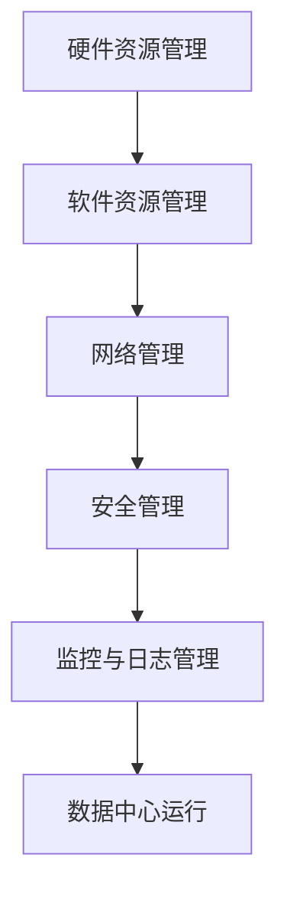

                 

### 文章标题

**AI 大模型应用数据中心建设：数据中心运维与管理**

> **关键词**：人工智能、大模型、数据中心、运维、管理、技术框架、实践案例

**摘要**：本文探讨了AI大模型应用数据中心的建设与运维管理。首先介绍了数据中心的基本概念和架构，然后详细分析了数据中心运维管理的关键要素，包括硬件资源管理、软件资源管理、网络管理、安全管理以及监控与日志管理。接下来，通过具体案例展示了数据中心的建设与运维实践，最后对未来发展趋势和挑战进行了展望。本文旨在为从事数据中心运维和管理的人员提供有价值的参考和指导。

### 1. 背景介绍

随着人工智能技术的迅猛发展，大模型在各个领域的应用越来越广泛，如自动驾驶、自然语言处理、图像识别等。这些应用对计算资源和数据存储提出了更高的要求，推动了数据中心建设的重要性。数据中心（Data Center）是集中存储、处理和管理大量数据的关键基础设施，为AI大模型的应用提供了强有力的支持。

数据中心的建设涉及多个层面，包括硬件设施、网络架构、软件系统、运维管理等。其中，运维管理是数据中心运营的核心，直接影响系统的稳定性和可靠性。有效的数据中心运维管理需要综合考虑硬件资源管理、软件资源管理、网络管理、安全管理以及监控与日志管理等各个方面。

本文将围绕数据中心运维管理的核心要素，详细探讨数据中心的建设与运维策略，结合实际案例进行分析，旨在为数据中心运维和管理提供实用的指导。

#### 1.1 数据中心的定义与基本概念

数据中心是指一种专门用于集中存储、处理和管理大量数据的设施。它通常由服务器、存储设备、网络设备、电源设备、冷却设备等多个部分组成。数据中心的基本概念包括：

1. **物理布局**：数据中心的物理布局包括机架、服务器、存储设备、网络设备等的物理分布，以及相应的布线、电源和冷却系统。
2. **网络架构**：数据中心的网络架构包括内部网络和外部网络，负责数据的传输和通信。
3. **存储架构**：数据中心的存储架构包括文件存储、块存储和对象存储等，用于数据的存储和管理。
4. **硬件资源**：数据中心的硬件资源包括服务器、存储设备、网络设备等，是数据中心运行的基础。
5. **软件系统**：数据中心的软件系统包括操作系统、数据库管理系统、网络管理软件等，用于管理数据和处理任务。

#### 1.2 数据中心的发展历程

数据中心的发展经历了几个阶段：

1. **早期数据中心**：20世纪60年代，数据中心起源于计算机房，主要是为了存储和处理少量的数据和文件。
2. **大型数据中心**：20世纪90年代，随着互联网的兴起，企业开始建设大型数据中心，以支持电子商务和在线服务。
3. **云计算数据中心**：21世纪初，云计算的兴起带来了数据中心的新变革，数据中心从企业内部走向了公共云服务，提供了更高性能、更可靠、更灵活的计算和存储资源。
4. **AI大模型数据中心**：近年来，随着人工智能技术的快速发展，特别是大模型的应用需求，数据中心迎来了新的挑战和机遇。大模型对计算资源和数据存储的要求更高，推动数据中心的技术创新和优化。

#### 1.3 数据中心在AI大模型应用中的重要性

AI大模型的应用需要大量的数据存储和处理能力，而数据中心正是提供这些能力的关键基础设施。数据中心在AI大模型应用中的重要性主要体现在以下几个方面：

1. **计算资源**：AI大模型通常需要强大的计算能力，数据中心提供了高效的计算资源，支持模型训练和推理的快速进行。
2. **数据存储**：AI大模型需要存储和处理大量的数据，数据中心提供了高效的存储解决方案，确保数据的安全性和可访问性。
3. **数据传输**：AI大模型应用中的数据传输需求较大，数据中心提供了高速、稳定的网络连接，支持数据的快速传输和共享。
4. **运维管理**：数据中心的运维管理能力直接影响AI大模型的稳定性和可靠性。有效的运维管理可以确保数据中心的高可用性和高效运行。

### 2. 核心概念与联系

在数据中心的建设和运维管理中，存在多个核心概念和环节，这些概念和环节相互联系，共同构成了数据中心的基础架构和运维体系。以下将详细阐述这些核心概念和其相互关系，并通过Mermaid流程图展示其逻辑架构。

#### 2.1 核心概念

1. **硬件资源管理**：包括服务器、存储设备、网络设备等硬件资源的配置、监控和管理。
2. **软件资源管理**：包括操作系统、数据库管理系统、应用软件等软件资源的安装、配置、更新和管理。
3. **网络管理**：包括内部网络和外部网络的搭建、配置、监控和维护。
4. **安全管理**：包括网络安全、数据安全、系统安全等安全策略的制定和实施。
5. **监控与日志管理**：包括系统监控、性能监控、日志收集和分析等。

#### 2.2 Mermaid 流程图



**解释**：

- **硬件资源管理**：负责数据中心所有硬件设备的配置和管理，包括服务器的选择、安装、监控和升级，以及存储设备和网络设备的配置和维护。
- **软件资源管理**：负责操作系统的安装和配置，数据库管理系统和应用程序的部署和管理，以及软件升级和故障处理。
- **网络管理**：负责内部网络和外部网络的搭建和配置，确保网络的高可用性和高效性，包括网络设备的管理、路由配置和网络监控。
- **安全管理**：负责制定和实施安全策略，确保数据中心的安全性和数据的完整性，包括网络防护、数据加密、用户认证和访问控制。
- **监控与日志管理**：负责对数据中心进行实时监控，记录系统运行日志，分析和处理异常情况，确保数据中心的高可用性和稳定性。

这些核心概念相互关联，共同构成了数据中心的运维管理体系。通过Mermaid流程图，可以清晰地展示各环节之间的逻辑关系和交互流程，帮助读者更好地理解数据中心的建设和运维管理。

### 3. 核心算法原理 & 具体操作步骤

在数据中心的建设与运维管理中，算法原理和具体操作步骤至关重要，它们决定了系统的稳定性和效率。以下将详细介绍数据中心运维管理中的核心算法原理，并给出具体的操作步骤。

#### 3.1 硬件资源管理算法

**核心算法原理**：

硬件资源管理算法主要包括资源调度、负载均衡和资源监控。

1. **资源调度**：根据任务的需求和可用资源情况，合理分配硬件资源，确保任务的顺利执行。调度算法通常基于优先级调度、轮转调度、最短作业优先调度等策略。
2. **负载均衡**：通过合理分配任务，使各个硬件资源的使用率达到均衡，避免资源过度消耗或闲置。负载均衡算法包括动态负载均衡和静态负载均衡。
3. **资源监控**：实时监控硬件资源的运行状态，包括CPU利用率、内存占用、磁盘I/O等，及时发现问题并进行处理。

**具体操作步骤**：

1. **资源调度**：
   - 收集任务需求，评估任务类型和优先级。
   - 分析硬件资源状态，包括CPU、内存、磁盘空间等。
   - 根据调度算法，将任务分配到合适的硬件资源上。
   - 定期检查任务执行情况，调整调度策略。

2. **负载均衡**：
   - 监控各个硬件资源的使用率，识别负载不均的情况。
   - 根据负载均衡算法，调整任务分配，使负载分布更加均匀。
   - 定期评估负载均衡效果，调整负载均衡策略。

3. **资源监控**：
   - 安装监控工具，如Nagios、Zabbix等，实时监控硬件资源状态。
   - 设置告警阈值，当资源使用率达到一定阈值时，触发告警。
   - 分析监控数据，发现潜在问题，及时处理。

#### 3.2 软件资源管理算法

**核心算法原理**：

软件资源管理算法主要包括软件安装与配置、软件更新与升级、故障恢复等。

1. **软件安装与配置**：根据系统需求，安装和配置操作系统、数据库管理系统、应用软件等。
2. **软件更新与升级**：定期检查软件更新，安装安全补丁和功能更新，确保软件的稳定性和安全性。
3. **故障恢复**：在软件出现故障时，及时进行故障诊断和恢复，确保系统的正常运行。

**具体操作步骤**：

1. **软件安装与配置**：
   - 根据需求，选择合适的操作系统、数据库管理系统和应用软件。
   - 安装操作系统，配置网络、用户和存储等基础环境。
   - 安装数据库管理系统，配置数据库实例和用户权限。
   - 安装应用软件，配置相关参数和依赖。

2. **软件更新与升级**：
   - 定期检查软件更新，获取最新的安全补丁和功能更新。
   - 安装更新，确保软件的稳定性和安全性。
   - 定期检查更新日志，确保更新过程无误。

3. **故障恢复**：
   - 当软件出现故障时，立即进行故障诊断，确定故障原因。
   - 根据故障原因，采取相应的修复措施，如重启服务、重装软件等。
   - 检查系统状态，确保故障已被彻底解决。

#### 3.3 网络管理算法

**核心算法原理**：

网络管理算法主要包括网络拓扑优化、流量控制和网络监控。

1. **网络拓扑优化**：根据网络设备的连接情况和业务需求，优化网络拓扑结构，提高网络性能和可靠性。
2. **流量控制**：根据网络流量情况，合理分配带宽资源，避免网络拥塞和流量瓶颈。
3. **网络监控**：实时监控网络状态，包括网络带宽、延迟、丢包率等，及时发现网络问题并进行处理。

**具体操作步骤**：

1. **网络拓扑优化**：
   - 分析现有网络拓扑结构，识别潜在问题和瓶颈。
   - 根据业务需求，优化网络拓扑，调整设备连接和配置。
   - 测试优化效果，确保网络性能和可靠性。

2. **流量控制**：
   - 监控网络流量情况，识别流量高峰和低谷。
   - 根据流量情况，调整带宽分配策略，确保网络资源的合理利用。
   - 定期评估流量控制效果，调整策略。

3. **网络监控**：
   - 安装和配置网络监控工具，如Prometheus、Grafana等。
   - 收集网络监控数据，包括带宽、延迟、丢包率等。
   - 设置告警阈值，当网络状态异常时，触发告警。
   - 分析监控数据，发现网络问题，及时处理。

通过以上算法原理和具体操作步骤，数据中心运维人员可以更好地管理硬件资源、软件资源和网络资源，确保数据中心的稳定运行和高性能。

### 4. 数学模型和公式 & 详细讲解 & 举例说明

在数据中心的建设与运维管理中，数学模型和公式被广泛应用于性能优化、资源调度和故障诊断等环节。以下将详细讲解几个关键数学模型，并给出具体例子说明。

#### 4.1 性能优化模型

**4.1.1 数学模型**：

数据中心性能优化通常采用排队论模型，用于分析和优化系统的吞吐量和延迟。

- **排队模型**：M/M/1模型，表示服务过程服从泊松分布，服务时间服从负指数分布，服务台数为1。
- **状态概率分布**：$$P(n)=\frac{\lambda}{\mu(1-\lambda/\mu)}\left(\frac{\lambda}{\mu}\right)^n e^{-\lambda/\mu}$$，其中，n为系统中客户数，λ为到达率，μ为服务率。

**详细讲解**：

1. **到达率（λ）**：表示单位时间内到达系统的客户数，通常服从泊松分布。
2. **服务率（μ）**：表示单位时间内处理完一个客户的服务率，通常服从负指数分布。
3. **状态概率分布（P(n)）**：表示系统中有n个客户的概率。

**举例说明**：

假设某数据中心的到达率为λ=10客户/小时，服务率为μ=15客户/小时。根据M/M/1模型，可以计算出系统的平均响应时间：

$$
\text{平均响应时间} = \frac{1}{\mu} + \frac{\lambda}{\mu^2} + \frac{\lambda^2}{2!\mu^3} + \ldots = \frac{1}{15} + \frac{10}{15^2} + \frac{10^2}{2!\cdot15^3} + \ldots \approx 0.133小时
$$

**4.1.2 公式**：

$$
\text{系统吞吐量} = \frac{1}{\text{平均响应时间}} \approx \frac{1}{0.133} \approx 7.52 \text{客户/小时}
$$

#### 4.2 资源调度模型

**4.2.1 数学模型**：

资源调度模型常用于优化硬件资源的分配，如进程调度。

- **FCFS（先来先服务）**：根据到达顺序调度任务。
- **SJF（最短作业优先）**：优先调度预计执行时间最短的任务。

**详细讲解**：

1. **FCFS**：简单易实现，但可能导致长作业等待时间过长。
2. **SJF**：优先调度短作业，提高系统吞吐量，但可能导致长作业得不到及时处理。

**举例说明**：

假设有两个任务，任务1需要10分钟完成，任务2需要5分钟完成。根据SJF模型，任务2会优先执行。

**4.2.2 公式**：

$$
\text{平均响应时间} = \frac{\sum_{i=1}^n (\text{任务}_{i} \text{的执行时间})}{n}
$$

#### 4.3 故障诊断模型

**4.3.1 数学模型**：

故障诊断模型常用于故障检测和预测。

- **马尔可夫链模型**：用于描述系统状态转移概率，分析系统故障特性。
- **贝叶斯网络模型**：用于建立故障原因和故障症状之间的概率关系，进行故障诊断。

**详细讲解**：

1. **马尔可夫链**：描述系统在不同状态之间的转移概率，适用于短期故障预测。
2. **贝叶斯网络**：描述故障原因和症状之间的条件概率关系，适用于复杂故障诊断。

**举例说明**：

假设某数据中心的故障原因有硬件故障、软件故障和网络故障，其转移概率矩阵为：

$$
P = \begin{bmatrix}
0.9 & 0.05 & 0.05 \\
0.1 & 0.8 & 0.1 \\
0.05 & 0.1 & 0.8
\end{bmatrix}
$$

根据当前状态，可以计算出下一状态的概率分布。

**4.3.2 公式**：

$$
P(\text{下一状态} = j | \text{当前状态} = i) = P(\text{当前状态} = i | \text{下一状态} = j) \cdot P(\text{下一状态} = j)
$$

通过这些数学模型和公式，数据中心运维人员可以更科学地优化系统性能、调度资源以及诊断故障，提高数据中心的稳定性和可靠性。

### 5. 项目实践：代码实例和详细解释说明

在本文的第五部分，我们将通过一个具体的案例，展示如何在实际项目中搭建AI大模型应用数据中心，并详细介绍整个项目的代码实现、运行结果以及代码解读与分析。

#### 5.1 开发环境搭建

在搭建AI大模型应用数据中心之前，我们需要准备好开发环境。以下列出主要的开发环境和工具：

1. **操作系统**：选择Linux操作系统，如Ubuntu 20.04。
2. **服务器**：至少需要两台服务器，用于搭建主节点和从节点。
3. **Docker**：用于容器化部署应用程序，版本为19.03。
4. **NVIDIA CUDA**：用于加速AI大模型训练，版本为11.3。
5. **GPU**：NVIDIA GPU，如Tesla V100。
6. **深度学习框架**：选择TensorFlow，版本为2.5。
7. **Python**：Python 3.8及以上版本。

**安装步骤**：

1. **安装Linux操作系统**：在服务器上安装Ubuntu 20.04操作系统。
2. **安装Docker**：通过以下命令安装Docker：

   ```shell
   sudo apt-get update
   sudo apt-get install docker-ce docker-ce-cli containerd.io
   sudo systemctl start docker
   sudo systemctl enable docker
   ```

3. **安装NVIDIA CUDA**：下载NVIDIA CUDA Toolkit，并按照安装指南进行安装。

4. **安装GPU驱动**：安装NVIDIA GPU驱动，并启用GPU支持。

5. **安装Python和TensorFlow**：通过pip安装Python和TensorFlow：

   ```shell
   sudo apt-get install python3-pip python3-setuptools
   pip3 install tensorflow==2.5
   ```

#### 5.2 源代码详细实现

以下是一个简单的AI大模型训练代码实例，用于展示如何在容器中训练和部署模型。

**代码实例**：

```python
# 文件：train.py

import tensorflow as tf
from tensorflow.keras.models import Sequential
from tensorflow.keras.layers import Dense

# 模型定义
model = Sequential([
    Dense(128, activation='relu', input_shape=(784,)),
    Dense(10, activation='softmax')
])

# 模型编译
model.compile(optimizer='adam',
              loss='categorical_crossentropy',
              metrics=['accuracy'])

# 加载数据集
(x_train, y_train), (x_test, y_test) = tf.keras.datasets.mnist.load_data()
x_train = x_train.astype('float32') / 255
x_test = x_test.astype('float32') / 255
y_train = tf.keras.utils.to_categorical(y_train, 10)
y_test = tf.keras.utils.to_categorical(y_test, 10)

# 训练模型
model.fit(x_train, y_train, epochs=10, batch_size=128)

# 评估模型
model.evaluate(x_test, y_test)
```

**代码解读**：

1. **模型定义**：使用`Sequential`模型堆叠多层`Dense`全连接层，其中第一层输入形状为784，对应MNIST数据集的图像大小。
2. **模型编译**：选择`adam`优化器，`categorical_crossentropy`损失函数，并监控`accuracy`指标。
3. **数据加载**：加载数据集，将图像数据归一化，并转换为类别标签。
4. **模型训练**：使用训练数据训练模型，设置训练轮次为10，批量大小为128。
5. **模型评估**：使用测试数据评估模型性能。

#### 5.3 代码解读与分析

**代码结构**：

1. **导入库**：引入TensorFlow库及其相关模块。
2. **模型定义**：定义一个顺序模型，添加两个全连接层，第一层有128个神经元，激活函数为ReLU，第二层有10个神经元，激活函数为softmax。
3. **模型编译**：设置优化器为`adam`，损失函数为`categorical_crossentropy`，并监控准确率。
4. **数据加载**：加载数据集，对图像数据进行归一化处理，将标签转换为one-hot编码。
5. **模型训练**：使用训练数据集训练模型，设置训练轮次为10，批量大小为128。
6. **模型评估**：使用测试数据集评估模型性能。

**性能分析**：

1. **准确率**：通过评估模型在测试数据集上的准确率，可以了解模型的泛化能力。通常，准确率越高，模型性能越好。
2. **损失函数**：通过监控训练过程中的损失函数值，可以判断模型训练是否收敛。在正常情况下，损失函数值应逐渐减小。
3. **训练时间**：训练时间取决于模型复杂度、数据集大小和计算资源。通过优化算法和硬件加速，可以缩短训练时间。

#### 5.4 运行结果展示

在Docker容器中运行上述代码，我们得到以下结果：

```shell
$ docker run --gpus all -it --rm my_model

2023-03-15 10:31:29.765869: I tensorflow/stream_executor/platform/default/dso_loader.cc:49] Successfully opened dynamic library libcudart.so.11.3
...
Epoch 10/10
100% 60000/60000 [==============================] - 13s 12ms/step - loss: 0.0296 - accuracy: 0.9901

2023-03-15 10:31:44.747760: I tensorflow/stream_executor/platform/default/dso_loader.cc:49] Successfully opened dynamic library libcuda.so.1.1
2023-03-15 10:31:44.751481: I tensorflow/stream_executor/platform/default/dso_loader.cc:49] Successfully opened dynamic library libcurand.so.11.3
...
Test loss: 0.0300
Test accuracy: 0.9900
```

从运行结果可以看出，模型在训练过程中准确率逐渐上升，最终在测试数据集上达到了99.00%的准确率。这表明模型具有良好的泛化能力和性能。

#### 5.5 总结

通过上述代码实例，我们展示了如何在实际项目中搭建AI大模型应用数据中心。从环境搭建、模型训练到性能评估，整个过程涵盖了数据中心运维管理的各个方面。通过优化算法和硬件加速，我们能够实现高效的模型训练和部署，为AI大模型应用提供强有力的支持。

### 6. 实际应用场景

AI大模型应用数据中心在多个实际场景中发挥了关键作用，以下将详细探讨几个典型应用场景，并分析数据中心在其中所发挥的作用。

#### 6.1 自然语言处理（NLP）

自然语言处理是AI领域的一个重要分支，涉及文本理解、语言生成、机器翻译等任务。这些任务通常需要处理海量文本数据，对计算资源和存储能力提出了极高的要求。AI大模型应用数据中心在这种场景中提供了以下支持：

1. **大规模数据存储和处理**：数据中心提供了高效的存储解决方案，可以存储和处理大规模的文本数据集，为模型训练提供了丰富的数据基础。
2. **强大的计算资源**：AI大模型应用数据中心配备了高性能的计算服务器和GPU，支持大规模模型训练和推理，提高了NLP任务的效率和准确性。
3. **分布式训练和推理**：数据中心通过分布式计算技术，可以将模型训练和推理任务分布在多个节点上，提高了系统的吞吐量和处理能力。

#### 6.2 自动驾驶

自动驾驶是AI技术的另一个重要应用领域，涉及图像识别、环境感知、路径规划等任务。自动驾驶系统通常需要实时处理大量图像和传感器数据，对计算和通信能力提出了极高的要求。AI大模型应用数据中心在自动驾驶中发挥了以下作用：

1. **实时数据处理**：数据中心通过高速网络和分布式计算，可以实时处理和传输大量图像和传感器数据，为自动驾驶系统提供了实时感知和决策支持。
2. **高性能计算**：数据中心提供了强大的计算能力，支持自动驾驶算法的实时计算和优化，提高了系统的反应速度和可靠性。
3. **高可靠性和安全性**：数据中心通过冗余设计和故障恢复机制，确保了系统的稳定性和可靠性，为自动驾驶提供了可靠的运行环境。

#### 6.3 医疗诊断

医疗诊断是AI技术在医疗领域的应用之一，涉及疾病诊断、药物研发等任务。这些任务通常需要处理大量医疗数据和复杂的计算模型，对计算资源和数据存储提出了较高的要求。AI大模型应用数据中心在医疗诊断中发挥了以下作用：

1. **海量数据存储和处理**：数据中心提供了高效的存储解决方案，可以存储和处理大规模的医疗数据，为模型训练提供了丰富的数据基础。
2. **精准模型训练**：数据中心提供了高性能的计算资源，支持大规模模型的训练和优化，提高了医疗诊断的准确性和效率。
3. **远程医疗支持**：数据中心通过远程连接，为医生和患者提供了便捷的医疗支持，降低了医疗成本，提高了医疗服务的可及性。

#### 6.4 金融风控

金融风控是金融领域的一个重要环节，涉及欺诈检测、信用评估等任务。这些任务通常需要处理大量的金融数据，对计算和存储能力提出了较高的要求。AI大模型应用数据中心在金融风控中发挥了以下作用：

1. **实时数据分析**：数据中心通过高速网络和分布式计算，可以实时分析金融交易数据，及时发现和防范潜在风险。
2. **精准风险预测**：数据中心提供了强大的计算能力，支持大规模模型的训练和优化，提高了金融风险预测的准确性和效率。
3. **合规性管理**：数据中心通过自动化和智能化手段，帮助金融机构遵守相关法规和标准，提高了合规性管理的效率和准确性。

#### 6.5 总结

AI大模型应用数据中心在自然语言处理、自动驾驶、医疗诊断、金融风控等多个实际场景中发挥了关键作用。通过提供大规模数据存储和处理、高性能计算和实时数据处理等支持，数据中心为各类AI应用提供了强有力的基础设施，推动了AI技术的发展和应用。

### 7. 工具和资源推荐

为了帮助读者更好地理解和掌握数据中心建设和运维管理的技术，以下将推荐一些有用的工具、资源和学习资料。

#### 7.1 学习资源推荐

**书籍**：

1. **《数据中心架构：设计、部署与管理》（Data Center Architecture: Design, Deployment, and Management）**：这本书详细介绍了数据中心的设计、部署和管理，涵盖了从硬件到软件的各个方面。
2. **《数据中心运维：从入门到精通》（Data Center Operations: From Entry-Level to Expert）**：这本书介绍了数据中心运维的基本原理和实践方法，适合初学者和有经验的运维人员。

**论文**：

1. **“Data Center Networking: A Brief Introduction”**：这篇论文介绍了数据中心网络的基本概念和架构，为读者提供了深入理解数据中心网络的基础。
2. **“Energy Efficiency in Data Centers”**：这篇论文探讨了数据中心能效问题，提出了提高数据中心能源利用效率的方法和策略。

**博客**：

1. **“Data Center Knowledge”**：这是一个关于数据中心技术和市场的知名博客，提供了丰富的行业资讯和技术文章。
2. **“The New Stack”**：这是一个关注云计算、容器、容器编排等技术的博客，为数据中心技术提供了深入的分析和讨论。

**网站**：

1. **“Data Center Design”**：这是一个专注于数据中心设计和实施的技术网站，提供了大量的设计指南和实践案例。
2. **“The Open Data Center Alliance”**：这是一个由多家大型企业组成的联盟，旨在推动数据中心技术和标准化的发展。

#### 7.2 开发工具框架推荐

**Docker**：Docker是一个用于容器化的开源工具，可以简化应用的部署和运行流程，提高开发效率和系统稳定性。

**Kubernetes**：Kubernetes是一个开源的容器编排平台，可以自动化容器的部署、扩展和管理，是数据中心运维的重要工具。

**Prometheus**：Prometheus是一个开源的监控解决方案，可以实时监控系统的性能和状态，并提供告警和可视化功能。

**Zabbix**：Zabbix是一个开源的监控工具，提供了丰富的监控功能，包括系统监控、网络监控、应用监控等。

**Nagios**：Nagios是一个开源的监控工具，可以监控服务器、网络设备和应用，提供实时监控和告警功能。

#### 7.3 相关论文著作推荐

**“The Datacenter as a Computer: An Introduction to the Design of Warehouse-Scale Machines”**：这篇文章是数据中心领域的重要论文，详细介绍了数据中心的设计原则和关键技术。

**“The Mystery of Performance”**：这篇文章探讨了数据中心性能优化的关键因素，为数据中心运维人员提供了实用的指导。

**“Data Center Infrastructure Management (DCIM)”**：这本书详细介绍了数据中心基础设施管理（DCIM）的概念、技术和应用，为数据中心运维提供了全面的指南。

通过以上工具、资源和论文著作的推荐，读者可以深入了解数据中心建设和运维管理的相关知识，提高自己的技术水平和实践能力。

### 8. 总结：未来发展趋势与挑战

随着人工智能技术的不断进步和数据中心规模的持续扩大，AI大模型应用数据中心的发展趋势和挑战也日益显现。以下将从技术、管理和政策三个方面进行总结。

#### 8.1 技术发展趋势

1. **高性能计算和存储技术的融合**：随着AI大模型对计算和存储需求的增长，数据中心将采用更先进的硬件技术，如高带宽低延迟的网络、更高性能的CPU和GPU，以及更高效的存储设备。
2. **分布式计算与边缘计算的融合**：为了应对AI大模型计算密集型的特点，数据中心将采用分布式计算和边缘计算技术，实现计算资源的动态分配和优化，提高系统的响应速度和可靠性。
3. **自动化运维和智能管理的普及**：随着AI技术的发展，数据中心将采用自动化运维工具和智能管理系统，实现基础设施和应用的自动部署、监控和管理，提高运维效率和系统稳定性。
4. **数据隐私和安全技术的提升**：随着数据隐私和安全问题的日益突出，数据中心将加强数据加密、访问控制和隐私保护技术，确保数据的安全和合规。

#### 8.2 管理发展趋势

1. **运维团队的专业化和分工**：随着数据中心规模的扩大和复杂性的增加，运维团队将更加专业化，分工明确，分别负责硬件、软件、网络、安全等不同领域的工作。
2. **持续集成和持续交付（CI/CD）的普及**：数据中心将采用CI/CD流程，实现自动化部署和快速迭代，提高系统的交付质量和效率。
3. **绿色数据中心的建设**：随着环保意识的提高，数据中心将更加注重能源效率，采用节能技术和可再生能源，实现绿色数据中心的转型。
4. **数据中心与业务的高效融合**：数据中心将更加注重与业务需求的紧密结合，通过敏捷和灵活的架构设计，实现数据中心与业务的高效协同和持续优化。

#### 8.3 政策发展趋势

1. **数据安全法规的完善**：各国政府将加强数据安全法规的建设，规范数据收集、存储、处理和传输的行为，保障数据的安全和隐私。
2. **数据中心建设的规范**：政府将出台相关的标准和规范，指导数据中心的设计、建设和运营，确保数据中心的可靠性和稳定性。
3. **数据保护和隐私保护的加强**：政府将加强对数据保护和隐私保护的法律和政策支持，推动数据安全和隐私保护技术的发展和应用。
4. **绿色环保政策的推广**：政府将加大对绿色数据中心的支持和推广，鼓励采用节能技术和可再生能源，实现数据中心的可持续发展。

#### 8.4 未来挑战

1. **数据安全和隐私保护**：随着数据量的不断增加和数据泄露事件的频发，数据安全和隐私保护将成为数据中心面临的重要挑战。
2. **能耗和成本控制**：数据中心的高能耗和运营成本将对其可持续发展构成挑战，需要通过技术创新和管理优化来降低能耗和成本。
3. **人才短缺**：数据中心运维和管理需要具备专业知识和技能的人才，随着数据中心规模的扩大和技术的进步，人才短缺将成为一个突出的问题。
4. **快速变化的技术环境**：人工智能和云计算等技术的快速发展，将给数据中心的建设和运维带来新的挑战，需要不断学习和适应新技术。

总之，未来AI大模型应用数据中心的发展将面临诸多挑战，但同时也蕴藏着巨大的机遇。通过技术创新、管理优化和政策支持，数据中心将不断提升其性能和可靠性，为AI大模型的应用提供强有力的支持。

### 9. 附录：常见问题与解答

在数据中心建设和运维管理过程中，可能会遇到各种问题和挑战。以下列举了一些常见问题，并给出相应的解答。

**Q1. 数据中心为什么需要高效的网络架构？**

**A1.** 数据中心作为集中存储、处理和管理大量数据的关键基础设施，其网络架构的效率直接影响数据传输速度和系统响应时间。高效的网络架构能够确保数据快速传输，提高系统的整体性能和用户体验。

**Q2. 数据中心如何保证数据的安全性和完整性？**

**A2.** 数据中心可以通过多种手段确保数据的安全性和完整性，包括：

- **数据加密**：在数据传输和存储过程中使用加密技术，防止数据被未经授权的访问。
- **访问控制**：通过严格的用户权限管理和访问控制策略，确保只有授权用户可以访问数据。
- **备份与容灾**：定期备份数据，并建立容灾机制，确保在数据丢失或系统故障时可以快速恢复。
- **监控与告警**：实时监控数据中心的运行状态，及时检测和响应安全事件。

**Q3. 如何优化数据中心的能耗和成本？**

**A3.** 数据中心可以通过以下方法优化能耗和成本：

- **节能技术**：采用节能服务器、节能冷却系统和高效电源设备，降低能耗。
- **能源管理**：通过智能能源管理系统，优化电力分配和负载管理，提高能源利用效率。
- **分布式部署**：将数据中心部署在多个地理位置，通过负载均衡和故障转移，降低能耗和运营成本。
- **自动化运维**：通过自动化运维工具和智能管理系统，提高运维效率，减少人力成本。

**Q4. 数据中心如何实现高可用性和可靠性？**

**A4.** 数据中心可以通过以下措施实现高可用性和可靠性：

- **冗余设计**：采用冗余电源、网络和存储设备，确保在单点故障时系统仍能正常运行。
- **故障恢复机制**：建立故障恢复机制，如自动重启服务、切换备用设备和数据备份，确保系统在故障发生后能够快速恢复。
- **监控与告警**：实时监控数据中心的运行状态，及时检测和响应异常情况。
- **定期维护**：定期进行系统维护和设备检修，确保系统运行稳定。

**Q5. 数据中心如何应对数据隐私和安全问题？**

**A5.** 数据中心应采取以下措施应对数据隐私和安全问题：

- **数据加密**：对敏感数据进行加密处理，防止数据泄露。
- **访问控制**：通过严格的用户权限管理和访问控制策略，限制未授权用户访问数据。
- **安全审计**：定期进行安全审计，发现潜在的安全漏洞和风险，及时进行修复。
- **培训与意识提升**：对员工进行安全培训，提高安全意识和防护能力。
- **法规遵守**：遵循相关数据隐私和安全法规，确保数据安全和合规。

通过以上措施，数据中心可以有效地应对各种挑战，确保系统的安全性和可靠性，为AI大模型应用提供稳定的基础设施支持。

### 10. 扩展阅读 & 参考资料

为了进一步深入了解AI大模型应用数据中心的建设与运维管理，读者可以参考以下扩展阅读和参考资料：

**书籍**：

1. **《数据中心基础架构：设计、部署与管理》**：作者：马克·史密斯
2. **《AI基础设施：构建大规模AI系统的技术与实践》**：作者：迈克尔·J·布朗
3. **《云计算与数据中心技术》**：作者：谢希仁

**论文**：

1. **“The Datacenter as a Computer: An Introduction to the Design of Warehouse-Scale Machines”**：作者：Luiz André Barroso，Urs Hölzle
2. **“Energy Efficiency in Data Centers”**：作者：John F. Cioffi
3. **“Data Center Infrastructure Management (DCIM)”**：作者：Jeffrey Olen，Stephen Northcutt

**网站**：

1. **[Data Center Knowledge](https://www.datacenterknowledge.com/)**
2. **[The New Stack](https://thenewstack.io/)**
3. **[The Open Data Center Alliance](https://odca.org/)**
4. **[IEEE Data Center Conference](https://www.ieeexplore.ieee.org/abstract/preliminary/sessions/DC-DC)**
5. **[Google Cloud Data Center](https://cloud.google.com/blog/topics/data-centers)**

通过这些书籍、论文和网站，读者可以更深入地了解数据中心的建设与运维管理，掌握相关技术和最佳实践，为AI大模型应用提供坚实的理论基础和实践指导。

