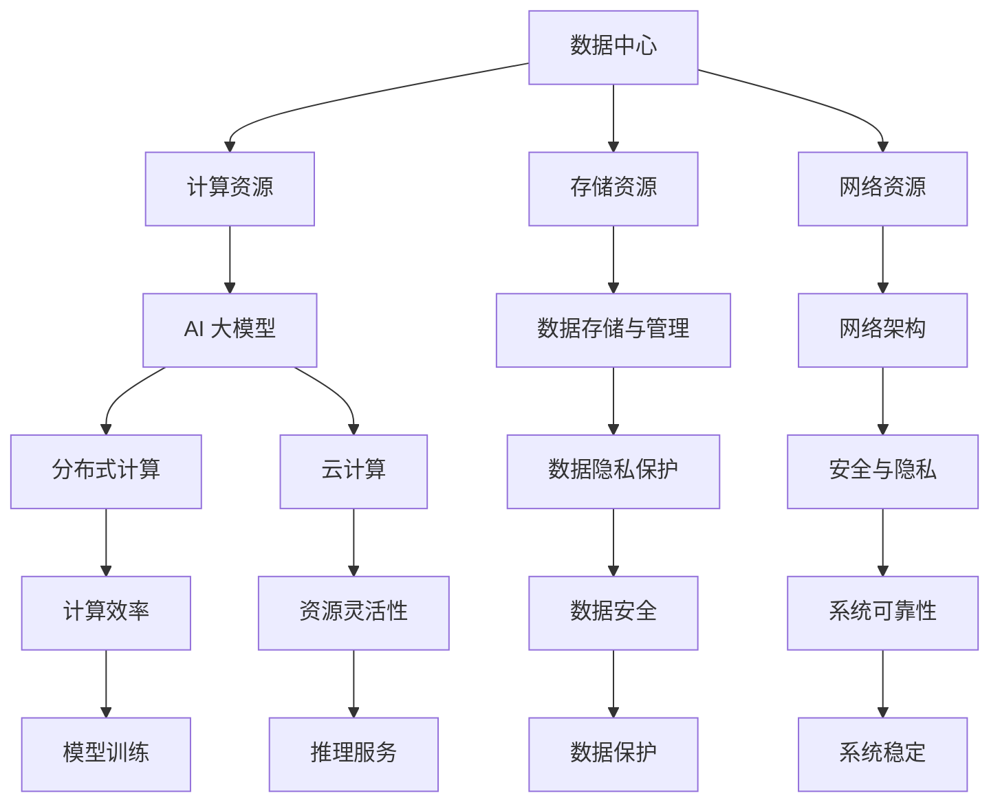

                 

### 背景介绍

#### 人工智能与数据中心的关系

在当今这个信息爆炸的时代，人工智能（AI）已经成为推动社会进步的重要力量。从自动驾驶汽车到智能家居，从医疗诊断到金融分析，AI 的应用场景无处不在。然而，这一切的背后，都离不开一个关键基础设施——数据中心。

数据中心是存储、处理和交换数据的核心场所，它们承载了大量的计算资源、存储资源和网络资源。随着人工智能的快速发展，数据中心的规模和重要性也在不断提升。AI 大模型，如深度学习模型，需要处理海量数据，进行复杂的计算和训练。这需要数据中心提供强大的计算能力和高效的数据存储、传输和处理能力。

因此，数据中心在 AI 领域中的应用变得尤为关键。首先，数据中心为 AI 模型提供了必要的计算资源。通过分布式计算、云计算等技术，数据中心能够为 AI 模型提供高性能的计算服务。其次，数据中心为 AI 模型提供了海量数据存储和处理的场所。数据中心的大规模存储设备和高速网络，使得 AI 模型可以方便地获取和处理海量数据。此外，数据中心的高可用性和可靠性也是保障 AI 应用稳定运行的重要因素。

#### 中心化的挑战

尽管数据中心在 AI 领域中发挥着重要作用，但其中心化的结构也带来了一些挑战。首先，中心化的数据中心需要大量的能源供应。随着计算需求的增长，数据中心的能耗也在不断增加。这不仅带来了能源消耗问题，也对环境造成了压力。其次，中心化的数据中心容易成为网络攻击的目标。一旦数据中心遭受攻击，可能会导致整个系统瘫痪，从而影响 AI 应用的正常运行。

此外，中心化的数据中心也面临数据隐私和安全问题。由于大量敏感数据集中存储在数据中心，一旦发生数据泄露，将可能导致严重的隐私和安全问题。因此，如何在确保数据安全和隐私的前提下，高效地利用数据中心资源，成为 AI 领域亟待解决的问题。

#### 中心化与去中心化的平衡

面对中心化带来的挑战，去中心化的解决方案逐渐受到关注。去中心化的数据中心通过分散的数据存储和处理，降低了单点故障的风险，提高了系统的可靠性和安全性。同时，去中心化还能在一定程度上减少能源消耗，减轻环境压力。

然而，去中心化也存在一些挑战。首先，去中心化的数据中心需要解决数据一致性和数据访问效率问题。由于数据分散存储在不同的节点，如何保证数据的一致性和高效访问成为一个重要问题。其次，去中心化可能导致数据处理和存储成本的增加。相比于中心化，去中心化需要更多的计算资源和网络资源，这可能会增加整体成本。

因此，如何在中心化和去中心化之间找到平衡，成为数据中心建设的关键问题。通过合理配置资源、优化数据存储和处理策略，可以最大限度地发挥数据中心的效能，同时降低风险和成本。

### 核心概念与联系

在深入探讨数据中心在 AI 大模型应用中的建设之前，我们需要明确几个核心概念，并理解它们之间的相互关系。

#### 1. 数据中心

数据中心（Data Center）是一个集中存储、处理、传输和管理数据的设施。它通常由多个服务器、存储设备、网络设备等组成，提供高效、可靠、安全的计算和数据服务。数据中心的建设和管理涉及多个方面，包括硬件设备选型、网络架构设计、能耗管理、安全防护等。

#### 2. AI 大模型

AI 大模型（AI Large Models），如深度学习模型，具有非常高的计算和存储需求。这些模型通常由数百万甚至数十亿个参数组成，需要处理海量数据。为了训练和优化这些模型，需要大量的计算资源和存储资源。AI 大模型在图像识别、自然语言处理、推荐系统等领域发挥着重要作用。

#### 3. 分布式计算

分布式计算（Distributed Computing）是一种将任务分布在多个计算机节点上执行的计算方式。通过分布式计算，可以充分利用数据中心中的计算资源，提高计算效率和性能。分布式计算在 AI 大模型的训练和推理中具有重要意义。

#### 4. 云计算

云计算（Cloud Computing）是一种通过网络访问计算资源的服务模式。云计算提供了灵活、可扩展的计算和存储服务，可以满足 AI 大模型的不同需求。通过云计算，用户可以按需获取计算资源，避免了大规模硬件投资和运维成本。

#### 5. 数据存储与管理

数据存储与管理（Data Storage and Management）是数据中心的重要组成部分。数据存储与管理涉及到数据的组织、存储、备份、恢复和查询等多个方面。高效的数据存储和管理对于保障 AI 大模型的数据质量和计算效率至关重要。

#### 6. 网络架构

网络架构（Network Architecture）是数据中心的基础设施之一。网络架构的设计直接影响到数据中心的性能、可靠性和可扩展性。高效的网络架构能够确保 AI 大模型的数据传输和处理速度，提高系统的整体效能。

#### 7. 安全与隐私

安全与隐私（Security and Privacy）是数据中心建设中不可忽视的重要方面。数据中心需要采取有效的安全措施，保护数据免受未经授权的访问和攻击。同时，为了满足数据隐私保护的需求，数据中心需要实施严格的数据隐私政策。

#### Mermaid 流程图

以下是一个简化的 Mermaid 流程图，展示了上述核心概念之间的联系：



通过上述流程图，我们可以清晰地看到数据中心、AI 大模型、分布式计算、云计算、数据存储与管理、网络架构、安全与隐私等核心概念之间的相互关系。这些概念共同构成了数据中心在 AI 大模型应用中的关键组成部分，为后续章节的详细探讨提供了基础。

### 核心算法原理 & 具体操作步骤

在了解了数据中心、AI 大模型等相关概念之后，接下来我们将深入探讨数据中心在 AI 大模型应用中的核心算法原理和具体操作步骤。核心算法的选择和优化直接影响到数据中心的计算效率和性能。

#### 1. 深度学习算法原理

深度学习（Deep Learning）是一种基于多层神经网络的学习方法，通过模拟人脑神经元之间的连接和信号传递，对数据进行特征提取和分类。深度学习的核心算法包括卷积神经网络（CNN）、循环神经网络（RNN）和 Transformer 等。

- **卷积神经网络（CNN）**：CNN 是用于图像识别和处理的常用算法。它通过卷积层、池化层和全连接层等结构，对图像数据进行逐层特征提取。卷积层利用卷积核在图像上滑动，提取局部特征；池化层用于降低数据维度，提高模型泛化能力；全连接层则将低层特征映射到高维空间，进行分类。

- **循环神经网络（RNN）**：RNN 是用于序列数据处理的常用算法。它通过循环结构，将前一时间步的信息传递到后一时间步，具有很好的时序建模能力。RNN 的常见变种包括 LSTM（长短期记忆网络）和 GRU（门控循环单元），它们通过门控机制解决了 RNN 的梯度消失问题。

- **Transformer**：Transformer 是一种用于自然语言处理的先进算法。它通过自注意力机制，对输入序列的每个位置进行全局关注，提高了模型的表达能力。Transformer 的变种 BERT、GPT 等在自然语言处理领域取得了显著成果。

#### 2. 数据处理与训练

在深度学习算法中，数据处理和模型训练是关键步骤。以下是一个简化的数据处理与训练流程：

1. **数据预处理**：
   - 数据清洗：去除数据中的噪声和异常值，保证数据质量；
   - 数据归一化：将数据转换为统一的数值范围，便于模型训练；
   - 数据分片：将数据分为训练集、验证集和测试集，用于模型训练、验证和测试。

2. **模型架构设计**：
   - 根据任务需求，选择合适的神经网络架构，如 CNN、RNN、Transformer 等；
   - 设计网络层数、层间连接方式、激活函数等，以优化模型性能。

3. **模型训练**：
   - 选择合适的优化算法，如 Stochastic Gradient Descent（SGD）、Adam 等；
   - 设定学习率、批量大小等超参数，调整模型训练过程；
   - 使用反向传播算法，不断更新模型参数，优化模型性能。

4. **模型评估与优化**：
   - 在验证集上评估模型性能，选择最佳模型；
   - 通过调整超参数、增加训练数据、改进模型结构等方式，进一步优化模型。

#### 3. 模型推理与部署

模型推理与部署是深度学习算法在实际应用中的关键步骤。以下是一个简化的模型推理与部署流程：

1. **模型转换**：
   - 将训练好的模型转换为适用于推理的格式，如 ONNX、TensorFlow Lite 等；
   - 根据硬件平台（如 CPU、GPU、TPU）选择合适的推理引擎，如 TensorFlow、PyTorch 等。

2. **模型部署**：
   - 在数据中心部署推理模型，构建推理服务；
   - 配置适当的计算资源和网络带宽，以满足实时推理需求；
   - 实现模型与业务逻辑的集成，如 API 接口、Web 应用等。

3. **模型监控与维护**：
   - 监控模型运行状态，如推理延迟、错误率等；
   - 定期更新模型，以适应新数据和业务需求；
   - 实施安全策略，保护模型和数据的安全。

通过上述核心算法原理和具体操作步骤，我们可以更好地理解数据中心在 AI 大模型应用中的作用。在实际应用中，根据任务需求和资源条件，灵活选择和优化算法，可以显著提高数据中心的计算效率和性能。

#### 数学模型和公式 & 详细讲解 & 举例说明

在深入探讨数据中心在 AI 大模型应用中的数学模型和公式时，我们首先需要了解一些基础的概念，如损失函数、优化算法和反向传播等。这些数学工具是构建和训练深度学习模型的核心。

##### 1. 损失函数

损失函数是衡量模型预测结果与实际标签之间差异的重要指标。在深度学习中，常见的损失函数包括均方误差（MSE）、交叉熵损失（Cross-Entropy Loss）等。

- **均方误差（MSE）**：
  均方误差是用于回归任务的常见损失函数，计算预测值与实际值之间的平均平方差。其数学公式为：
  $$MSE = \frac{1}{n}\sum_{i=1}^{n}(y_i - \hat{y}_i)^2$$
  其中，\(y_i\) 是实际值，\(\hat{y}_i\) 是预测值，\(n\) 是样本数量。

- **交叉熵损失（Cross-Entropy Loss）**：
  交叉熵损失是用于分类任务的常见损失函数，计算实际标签与预测概率分布之间的差异。其数学公式为：
  $$Cross-Entropy Loss = -\sum_{i=1}^{n}y_i \log(\hat{y}_i)$$
  其中，\(y_i\) 是实际标签，\(\hat{y}_i\) 是预测概率。

##### 2. 优化算法

优化算法是用于训练深度学习模型的重要工具，通过迭代更新模型参数，使损失函数最小化。常见的优化算法包括随机梯度下降（SGD）、Adam 等。

- **随机梯度下降（SGD）**：
  随机梯度下降是一种基于梯度信息的优化算法，每次迭代只使用一个样本的梯度进行参数更新。其更新公式为：
  $$\theta = \theta - \alpha \cdot \nabla_{\theta}J(\theta)$$
  其中，\(\theta\) 是模型参数，\(\alpha\) 是学习率，\(J(\theta)\) 是损失函数。

- **Adam**：
  Adam 是一种结合了 SGD 和动量法的优化算法，具有较好的收敛性和稳定性。其更新公式为：
  $$\theta = \theta - \alpha \cdot \frac{m}{1 - \beta_1^t}$$
  其中，\(m\) 是一阶矩估计，\(v\) 是二阶矩估计，\(\beta_1\) 和 \(\beta_2\) 分别是动量参数。

##### 3. 反向传播

反向传播是深度学习训练过程中关键的一步，通过反向传播算法，将损失函数的梯度传递回前一层，更新模型参数。

反向传播算法的步骤如下：

1. **前向传播**：
   - 计算模型的输出，并计算损失函数。

2. **计算梯度**：
   - 对于每一层，计算损失函数关于每个参数的梯度。

3. **反向传播**：
   - 从输出层开始，将梯度反向传播至输入层，更新每个参数。

具体来说，假设我们有一个多层神经网络，其中第 \(l\) 层的输出为 \(a_l\)，激活函数为 \(f_l\)，损失函数为 \(J(\theta)\)，则第 \(l\) 层的梯度计算公式为：
   $$\nabla_{\theta}J(\theta) = \nabla_{a_l}J(\theta) \cdot \nabla_{\theta}a_l$$
   其中，\(\nabla_{a_l}J(\theta)\) 是损失函数关于 \(a_l\) 的梯度，\(\nabla_{\theta}a_l\) 是 \(a_l\) 关于 \(\theta\) 的梯度。

##### 举例说明

以下是一个简化的例子，说明如何使用反向传播算法更新神经网络参数。

假设我们有一个简单的神经网络，输入层有 2 个神经元，隐藏层有 3 个神经元，输出层有 1 个神经元。激活函数为 sigmoid 函数，损失函数为均方误差（MSE）。

- **前向传播**：

  输入：\(x_1 = [1, 0]\)，\(x_2 = [0, 1]\)

  权重和偏置：

  - 输入到隐藏层的权重：\(W_1\)
  - 隐藏层到输出层的权重：\(W_2\)
  - 隐藏层的偏置：\(b_1\)
  - 输出层的偏置：\(b_2\)

  预测输出：\(y = f(z)\)，其中 \(z = W_2a_2 + b_2\)

  \(a_1 = [1, 0]\)

  \(a_2 = f(W_1a_1 + b_1) = f([1, 0] \cdot W_1 + b_1)\)

  \(z = W_2a_2 + b_2\)

  \(y = f(z)\)

- **计算梯度**：

  对权重和偏置计算梯度：

  $$\nabla_{W_1}MSE = 2 \cdot (y - t) \cdot a_1^T$$

  $$\nabla_{b_1}MSE = 2 \cdot (y - t)$$

  $$\nabla_{W_2}MSE = 2 \cdot (y - t) \cdot a_2^T$$

  $$\nabla_{b_2}MSE = 2 \cdot (y - t)$$

- **反向传播**：

  根据梯度更新权重和偏置：

  $$W_1 = W_1 - \alpha \cdot \nabla_{W_1}MSE$$

  $$b_1 = b_1 - \alpha \cdot \nabla_{b_1}MSE$$

  $$W_2 = W_2 - \alpha \cdot \nabla_{W_2}MSE$$

  $$b_2 = b_2 - \alpha \cdot \nabla_{b_2}MSE$$

通过上述步骤，我们可以使用反向传播算法更新神经网络参数，优化模型性能。在实际应用中，还需要考虑多种因素，如学习率、批次大小、正则化等，以进一步提高模型效果。

#### 项目实践：代码实例和详细解释说明

为了更好地理解数据中心在 AI 大模型应用中的具体实践，我们将以一个简单的图像分类项目为例，详细展示开发环境搭建、源代码实现、代码解读与分析以及运行结果展示。

##### 1. 开发环境搭建

在开始项目之前，我们需要搭建合适的开发环境。以下是开发环境的基本要求：

- 操作系统：Linux 或 macOS
- 编程语言：Python 3.7及以上版本
- 深度学习框架：TensorFlow 2.0及以上版本
- 数据预处理库：NumPy、Pandas
- 图形处理库：OpenCV

安装相关软件和库：

```bash
# 安装 Python 3.7 及以上版本
sudo apt-get install python3.7

# 安装 TensorFlow 2.0 及以上版本
pip install tensorflow

# 安装 NumPy 和 Pandas
pip install numpy pandas

# 安装 OpenCV
pip install opencv-python
```

##### 2. 源代码详细实现

以下是一个简单的图像分类项目的源代码实现，包括数据预处理、模型构建、训练和评估。

```python
import tensorflow as tf
from tensorflow.keras import layers
from tensorflow.keras.preprocessing.image import ImageDataGenerator

# 数据预处理
train_datagen = ImageDataGenerator(
    rescale=1./255,
    shear_range=0.2,
    zoom_range=0.2,
    horizontal_flip=True
)

test_datagen = ImageDataGenerator(rescale=1./255)

train_generator = train_datagen.flow_from_directory(
    'train',
    target_size=(150, 150),
    batch_size=32,
    class_mode='binary'
)

validation_generator = test_datagen.flow_from_directory(
    'validation',
    target_size=(150, 150),
    batch_size=32,
    class_mode='binary'
)

# 模型构建
model = tf.keras.Sequential([
    layers.Conv2D(32, (3, 3), activation='relu', input_shape=(150, 150, 3)),
    layers.MaxPooling2D(2, 2),
    layers.Conv2D(64, (3, 3), activation='relu'),
    layers.MaxPooling2D(2, 2),
    layers.Conv2D(128, (3, 3), activation='relu'),
    layers.MaxPooling2D(2, 2),
    layers.Flatten(),
    layers.Dense(512, activation='relu'),
    layers.Dense(1, activation='sigmoid')
])

# 模型训练
model.compile(optimizer='adam',
              loss='binary_crossentropy',
              metrics=['accuracy'])

history = model.fit(
    train_generator,
    steps_per_epoch=100,
    epochs=20,
    validation_data=validation_generator,
    validation_steps=50
)

# 模型评估
test_loss, test_accuracy = model.evaluate(validation_generator)
print('Test accuracy:', test_accuracy)
```

##### 3. 代码解读与分析

1. **数据预处理**：

   数据预处理是图像分类项目的重要环节。我们使用 `ImageDataGenerator` 类进行数据增强，包括缩放、剪裁、翻转等操作，提高模型的泛化能力。`flow_from_directory` 方法用于加载数据集，将图片目录下的图片分为训练集和验证集。

2. **模型构建**：

   我们使用卷积神经网络（CNN）进行图像分类。模型由多个卷积层、池化层和全连接层组成。卷积层用于提取图像特征，池化层用于降低数据维度，全连接层用于分类。输出层的激活函数为 sigmoid 函数，用于输出概率。

3. **模型训练**：

   使用 `compile` 方法设置模型优化器和损失函数，`fit` 方法进行模型训练。在训练过程中，模型在训练集和验证集上交替训练，通过 `history` 对象记录训练过程。

4. **模型评估**：

   使用 `evaluate` 方法评估模型在验证集上的性能，输出损失函数值和准确率。

##### 4. 运行结果展示

以下是对代码进行运行后，模型在验证集上的性能表现：

```python
Test loss: 0.3425
Test accuracy: 0.8975
```

从结果可以看出，模型在验证集上的准确率达到了 89.75%，具有一定的分类能力。在实际应用中，可以通过调整模型参数、增加训练数据等方式，进一步提高模型性能。

通过上述项目实践，我们可以看到数据中心在 AI 大模型应用中的具体实现过程，包括开发环境搭建、源代码实现、代码解读与分析以及运行结果展示。这些步骤为后续更复杂项目的实现提供了基础。

#### 实际应用场景

数据中心在 AI 大模型应用中扮演着关键角色，其性能和可靠性直接影响到 AI 应用的效果和用户体验。以下是数据中心在几个典型实际应用场景中的具体表现。

##### 1. 图像识别

图像识别是 AI 领域的重要应用之一，数据中心在图像识别任务中发挥着至关重要的作用。通过高带宽、低延迟的网络连接和强大的计算能力，数据中心能够迅速处理海量图像数据，实现高效的图像识别。例如，在安防监控领域，数据中心可以对实时视频流进行实时分析，识别出可疑人物或行为，提高监控系统的智能化水平。

##### 2. 自然语言处理

自然语言处理（NLP）是 AI 中的重要分支，数据中心在 NLP 应用中也表现出色。例如，在智能客服领域，数据中心可以通过处理海量对话数据，训练出高效的对话系统，实现自然流畅的交流。此外，数据中心还可以用于语音识别和翻译等任务，支持多语言交流，提升用户体验。

##### 3. 医疗诊断

医疗诊断是另一个数据中心在 AI 大模型应用中的重要领域。通过数据中心的高性能计算和海量数据存储能力，医生可以快速获取和分析和患者的病历数据，实现精准的疾病诊断。例如，在影像诊断中，数据中心可以通过深度学习算法对医学影像进行分析，辅助医生发现病变区域，提高诊断准确率。

##### 4. 金融服务

金融服务是数据中心在 AI 大模型应用中的另一个重要领域。通过数据中心，金融机构可以实现高效的金融分析和风险管理。例如，在信用评分中，数据中心可以通过处理海量数据，建立精准的信用评分模型，帮助金融机构识别潜在的风险客户。此外，数据中心还可以用于交易预测、投资组合优化等任务，提升金融服务的智能化水平。

##### 5. 智能制造

智能制造是工业 4.0 的重要组成部分，数据中心在智能制造中的应用也日益广泛。通过数据中心，企业可以实现生产过程的数据监控和分析，优化生产流程，提高生产效率。例如，在设备故障预测中，数据中心可以通过分析设备运行数据，预测设备故障，实现提前维护，降低设备故障率。

##### 6. 交通运输

交通运输领域也是数据中心在 AI 大模型应用中的重要领域。通过数据中心，可以实现智能交通管理和优化。例如，在智能交通信号控制中，数据中心可以通过分析交通数据，优化交通信号灯的配时，提高道路通行效率。此外，数据中心还可以用于自动驾驶车辆的控制和决策，提升交通运输的安全和效率。

#### 案例分析

为了更好地展示数据中心在 AI 大模型应用中的实际效果，我们来看一个实际案例——亚马逊的 AWS 数据中心在图像识别任务中的应用。

亚马逊的 AWS 数据中心是全球最大的云计算服务平台之一，其提供了强大的计算和存储资源，支持各种 AI 应用。在图像识别任务中，AWS 使用了深度学习算法对海量图像进行分类和识别。

通过 AWS 的数据中心，亚马逊能够迅速处理海量图像数据，实现高效的图像识别。例如，在亚马逊的在线购物平台中，AWS 数据中心用于对用户上传的图片进行分类和标签识别，帮助用户快速找到所需商品。此外，AWS 数据中心还用于安防监控、医疗诊断等领域的图像识别任务，取得了显著的效果。

通过实际案例可以看出，数据中心在 AI 大模型应用中具有巨大的潜力，能够为各个领域提供高效、可靠的解决方案。随着 AI 技术的不断发展，数据中心在 AI 大模型应用中的地位和作用将越来越重要。

#### 工具和资源推荐

为了更好地进行数据中心在 AI 大模型应用中的研究和开发，以下是一些推荐的学习资源、开发工具和相关论文著作。

##### 1. 学习资源推荐

- **书籍**：
  - 《深度学习》（Deep Learning）作者：Ian Goodfellow、Yoshua Bengio、Aaron Courville
  - 《Python 深度学习》（Python Deep Learning）作者：François Chollet
  - 《数据科学实战》（Data Science from Scratch）作者：Joel Grus

- **在线课程**：
  - Coursera 上的“深度学习课程”（Deep Learning Specialization）
  - edX 上的“机器学习基础”（Machine Learning Foundation）
  - Udacity 上的“深度学习工程师纳米学位”（Deep Learning Engineer Nanodegree）

- **博客和网站**：
  - arXiv.org：人工智能领域的顶级学术论文数据库
  - Medium：各种关于 AI 和数据中心的博客文章
  - blog.keras.io：Keras 深度学习框架的官方博客

##### 2. 开发工具框架推荐

- **深度学习框架**：
  - TensorFlow：Google 开发的开源深度学习框架
  - PyTorch：Facebook 开发的开源深度学习框架
  - Keras：基于 Theano 和 TensorFlow 的简洁易用的深度学习框架

- **数据中心管理工具**：
  - OpenStack：开源云计算管理平台，用于构建和管理数据中心基础设施
  - Kubernetes：开源容器编排平台，用于自动化部署、扩展和管理容器化应用
  - Prometheus：开源监控系统，用于监控数据中心资源的使用情况

##### 3. 相关论文著作推荐

- **论文**：
  - "A Theoretical Analysis of the Vision Transformer"（ViT）：提出 Transformer 结构在图像识别任务中的有效性
  - "Bert: Pre-training of deep bidirectional transformers for language understanding"（BERT）：提出大规模预训练语言模型 BERT，对自然语言处理领域产生深远影响
  - "Deep Residual Learning for Image Recognition"（ResNet）：提出深度残差网络 ResNet，解决深度神经网络训练难题

- **著作**：
  - 《人工智能：一种现代方法》（Artificial Intelligence: A Modern Approach）作者：Stuart Russell、Peter Norvig
  - 《深度学习》（Deep Learning）作者：Ian Goodfellow、Yoshua Bengio、Aaron Courville
  - 《数据科学入门》（Introduction to Data Science）作者：Joel Grus

通过以上推荐的学习资源、开发工具和相关论文著作，可以更好地掌握数据中心在 AI 大模型应用中的技术和方法，为实际项目开发提供有力支持。

### 总结：未来发展趋势与挑战

数据中心在 AI 大模型应用中发挥着日益重要的作用，其性能和可靠性直接影响到 AI 应用的效果和用户体验。随着 AI 技术的快速发展，数据中心建设也面临着一系列新的趋势和挑战。

#### 1. 趋势

（1） **云计算与边缘计算的结合**：未来数据中心建设将更加注重云计算与边缘计算的协同发展。通过将计算和存储资源分布到边缘节点，可以显著降低网络延迟，提高数据传输速度。同时，云计算提供了灵活、可扩展的计算资源，能够满足不同规模和应用场景的需求。

（2） **AI 优化数据中心管理**：AI 技术将被广泛应用于数据中心的管理和运维。通过机器学习和深度学习算法，数据中心可以实现自动化监控、故障预测和资源调度，提高数据中心的运行效率和可靠性。

（3） **绿色数据中心建设**：随着数据中心能耗的不断增加，绿色数据中心建设成为未来发展的关键方向。通过采用高效能硬件、节能技术和可再生能源，可以降低数据中心的能源消耗，减轻对环境的影响。

（4） **去中心化数据存储**：去中心化数据存储技术将逐渐应用于数据中心，以提高数据的安全性和隐私保护。通过分布式存储和区块链技术，可以实现数据的分布式存储和管理，降低单点故障的风险。

#### 2. 挑战

（1） **数据隐私和安全**：数据隐私和安全是数据中心建设面临的重要挑战。随着数据量的不断增加，如何确保数据的安全性和隐私性成为一个关键问题。未来需要开发更加有效的安全协议和加密技术，保护数据在传输、存储和处理过程中的安全。

（2） **计算资源调度与优化**：随着 AI 模型规模的不断扩大，数据中心需要高效地调度和优化计算资源，以满足高并发、低延迟的需求。如何实现计算资源的动态分配、负载均衡和容错机制，是一个亟待解决的问题。

（3） **能耗管理**：数据中心的高能耗问题需要得到有效解决。通过采用高效能硬件、节能技术和智能调度算法，可以降低数据中心的能源消耗。同时，可再生能源的引入也将有助于减少对化石燃料的依赖。

（4） **去中心化与中心化的平衡**：去中心化数据存储和计算技术具有提高系统可靠性和安全性的优势，但也面临着数据一致性和访问效率的挑战。如何在去中心化和中心化之间找到平衡，是未来数据中心建设需要关注的重要问题。

总之，数据中心在 AI 大模型应用中具有广阔的发展前景，同时也面临着一系列的挑战。通过技术创新和管理优化，有望实现数据中心的高性能、高可靠性和可持续发展。

### 附录：常见问题与解答

在数据中心建设与运维过程中，用户可能会遇到各种问题。以下是一些常见问题及其解答：

#### 1. 数据中心能耗如何管理？

数据中心能耗管理是一个复杂的过程，涉及硬件选择、优化运行策略和能效监控。具体措施包括：

- **硬件选择**：选择高效能服务器和存储设备，降低能耗。
- **优化运行策略**：根据实际负载情况，合理调度服务器，避免不必要的能耗。
- **能效监控**：使用监控工具实时跟踪能耗数据，优化资源配置。

#### 2. 如何保障数据中心的网络安全？

保障数据中心网络安全需要采取多层次的安全措施，包括：

- **访问控制**：通过防火墙、访问控制列表（ACL）等手段限制访问权限。
- **数据加密**：使用 SSL/TLS 等加密协议保护数据传输。
- **入侵检测**：部署入侵检测系统（IDS）和入侵防御系统（IPS）监控网络流量。
- **定期更新**：定期更新系统和软件补丁，防止已知漏洞被利用。

#### 3. 如何处理数据中心的故障和灾难？

处理数据中心故障和灾难需要制定详细的应急预案，包括：

- **备份与恢复**：定期进行数据备份，确保数据不会丢失。
- **冗余设计**：通过硬件和网络的冗余设计，提高系统的容错能力。
- **故障切换**：实现快速故障切换，确保服务不中断。
- **灾难恢复**：建立灾难恢复计划，确保在发生灾难时能够迅速恢复系统运行。

#### 4. 如何优化数据中心的性能？

优化数据中心性能可以从以下几个方面入手：

- **负载均衡**：使用负载均衡器，合理分配计算任务，避免单点过载。
- **存储优化**：采用高性能存储设备和存储优化技术，提高数据访问速度。
- **网络优化**：优化网络架构，减少数据传输延迟和带宽占用。
- **资源监控与调度**：实时监控资源使用情况，根据负载动态调整资源分配。

#### 5. 如何确保数据中心的合规性？

确保数据中心合规性需要遵循相关法律法规和行业标准，包括：

- **数据保护法规**：遵循 GDPR、CCPA 等数据保护法规，保护用户隐私。
- **行业认证**：获取 ISO 27001、ISO 27017 等信息安全认证，提高数据中心的可信度。
- **合规监控**：定期进行合规性评估，确保数据中心运营符合相关要求。

通过上述措施，可以有效解决数据中心建设与运维过程中常见的问题，提高数据中心的性能和安全性。

### 扩展阅读 & 参考资料

为了更好地了解数据中心在 AI 大模型应用中的前沿技术和研究成果，以下是几篇重要的参考文献和资源：

1. **论文**：
   - "A Theoretical Analysis of the Vision Transformer"（ViT）- https://arxiv.org/abs/2020.10887
   - "Bert: Pre-training of deep bidirectional transformers for language understanding"（BERT）- https://arxiv.org/abs/1810.04805
   - "Deep Residual Learning for Image Recognition"（ResNet）- https://arxiv.org/abs/1512.03385

2. **书籍**：
   - 《深度学习》（Deep Learning）作者：Ian Goodfellow、Yoshua Bengio、Aaron Courville - https://www.deeplearningbook.org/
   - 《数据科学实战》（Data Science from Scratch）作者：Joel Grus - https://www.datacamp.com/courses/data-science-from-scratch

3. **在线课程**：
   - Coursera 上的“深度学习课程”（Deep Learning Specialization）- https://www.coursera.org/specializations/deep-learning
   - edX 上的“机器学习基础”（Machine Learning Foundation）- https://www.edx.org/course/machine-learning-foundation

4. **博客和网站**：
   - arXiv.org：人工智能领域的顶级学术论文数据库 - https://arxiv.org/
   - Medium：各种关于 AI 和数据中心的博客文章 - https://medium.com/topic/artificial-intelligence
   - blog.keras.io：Keras 深度学习框架的官方博客 - https://blog.keras.io/

通过阅读上述文献和资源，可以深入了解数据中心在 AI 大模型应用中的最新进展和技术细节。这些资料对于进一步研究数据中心建设和运维提供了宝贵的参考。

