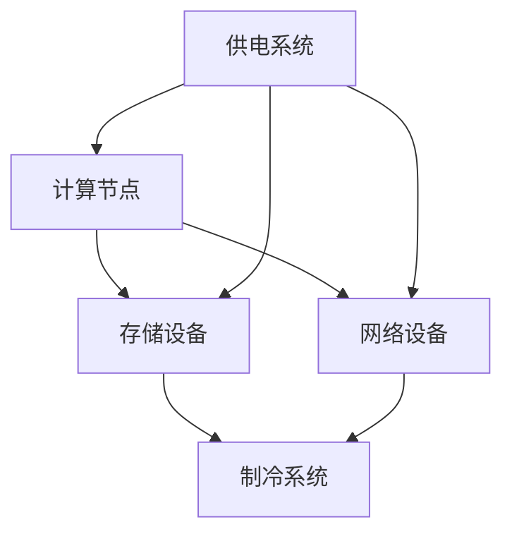

                 

### 文章标题

### AI 大模型应用数据中心建设：数据中心运营与管理

> **关键词：** AI 大模型、数据中心、运营管理、架构设计、性能优化、安全性、数据存储、能耗管理、实时监控、自动化、云计算、边缘计算

> **摘要：** 本文将深入探讨 AI 大模型应用数据中心的建设与运营管理。通过分析数据中心的核心概念、架构设计、算法原理、数学模型、项目实践以及实际应用场景，为读者提供全面的技术见解和实践指导。同时，文章还将推荐相关的学习资源和工具框架，展望未来发展趋势与挑战。

---

### 1. 背景介绍

随着人工智能（AI）技术的飞速发展，尤其是大模型（如 GPT-3、BERT 等）的出现，AI 应用场景不断扩展，对数据中心的需求也日益增长。数据中心作为 AI 大模型应用的核心基础设施，承担着数据处理、存储、计算和传输等关键任务。然而，数据中心的建设与运营管理面临诸多挑战，如架构设计、性能优化、安全性、能耗管理等。

本文旨在通过对 AI 大模型应用数据中心的建设与运营管理进行深入剖析，为相关从业者提供有价值的参考和指导。文章将分为以下几个部分：

- **核心概念与联系**：介绍数据中心的基础概念和架构设计，使用 Mermaid 流程图展示各组件之间的关系。
- **核心算法原理 & 具体操作步骤**：分析 AI 大模型的算法原理，包括训练、推理等过程。
- **数学模型和公式 & 详细讲解 & 举例说明**：介绍与 AI 大模型相关的数学模型和公式，并结合实际案例进行详细讲解。
- **项目实践：代码实例和详细解释说明**：通过具体项目实践，展示数据中心的建设与运营管理过程。
- **实际应用场景**：探讨 AI 大模型在各个领域的应用案例。
- **工具和资源推荐**：推荐相关的学习资源和开发工具。
- **总结：未来发展趋势与挑战**：总结文章的核心内容，展望未来发展趋势和面临的挑战。

---

### 2. 核心概念与联系

#### 2.1 数据中心的基本概念

数据中心是指用于存储、处理、传输和管理大量数据的服务器集群和基础设施。数据中心的基本概念包括：

- **计算节点**：用于处理数据和运行的虚拟机或物理服务器。
- **存储设备**：用于数据存储的硬盘、固态硬盘、存储阵列等。
- **网络设备**：用于数据传输的交换机、路由器等。
- **制冷系统**：用于保持设备运行温度的空调系统。
- **供电系统**：为设备提供稳定电力的UPS（不间断电源）和发电机组。

#### 2.2 数据中心的架构设计

数据中心的架构设计是数据中心建设的关键环节，主要包括以下几个方面：

- **硬件架构**：根据业务需求和预算选择合适的计算节点、存储设备和网络设备。
- **软件架构**：采用分布式存储、分布式计算、负载均衡等软件架构，提高数据中心的可用性和可靠性。
- **网络架构**：设计高效、稳定的网络拓扑结构，确保数据传输的低延迟和高带宽。

#### 2.3 数据中心的组件关系

使用 Mermaid 流程图展示数据中心的组件关系：



图 1. 数据中心组件关系图

### 3. 核心算法原理 & 具体操作步骤

#### 3.1 AI 大模型的算法原理

AI 大模型的算法原理主要包括以下几个方面：

- **数据预处理**：对输入数据进行清洗、归一化等处理，确保数据质量。
- **模型训练**：使用训练数据对模型进行训练，优化模型参数。
- **模型评估**：使用验证数据对模型进行评估，调整模型参数。
- **模型推理**：使用测试数据对模型进行推理，预测结果。

#### 3.2 具体操作步骤

以下是一个简单的 AI 大模型训练和推理的具体操作步骤：

1. **数据预处理**：

   - 清洗数据：删除缺失值、异常值等。
   - 归一化数据：将数据缩放到相同的范围，如 [0, 1]。

2. **模型训练**：

   - 选择合适的模型架构，如 GPT-3、BERT 等。
   - 初始化模型参数。
   - 使用训练数据进行前向传播和反向传播，更新模型参数。

3. **模型评估**：

   - 使用验证数据对模型进行评估，计算准确率、召回率等指标。
   - 根据评估结果调整模型参数。

4. **模型推理**：

   - 使用测试数据对模型进行推理，生成预测结果。
   - 分析预测结果，评估模型性能。

#### 3.3 实际操作示例

以下是一个使用 TensorFlow 框架训练和推理 AI 大模型的实际操作示例：

```python
import tensorflow as tf

# 数据预处理
def preprocess_data(data):
    # 清洗数据
    data = clean_data(data)
    # 归一化数据
    data = normalize_data(data)
    return data

# 模型训练
def train_model(model, train_data, train_labels):
    with tf.GradientTape() as tape:
        predictions = model(train_data)
        loss = compute_loss(predictions, train_labels)
    gradients = tape.gradient(loss, model.trainable_variables)
    model.optimizer.apply_gradients(zip(gradients, model.trainable_variables))

# 模型评估
def evaluate_model(model, test_data, test_labels):
    predictions = model(test_data)
    accuracy = compute_accuracy(predictions, test_labels)
    return accuracy

# 模型推理
def predict(model, data):
    predictions = model(data)
    return predictions

# 训练模型
train_data = preprocess_data(train_data)
train_labels = preprocess_labels(train_labels)
for epoch in range(num_epochs):
    train_model(model, train_data, train_labels)
    accuracy = evaluate_model(model, test_data, test_labels)
    print(f"Epoch {epoch}: Accuracy = {accuracy}")

# 推理
predictions = predict(model, test_data)
```

### 4. 数学模型和公式 & 详细讲解 & 举例说明

#### 4.1 数学模型

AI 大模型通常使用深度神经网络（DNN）作为基础架构，其数学模型主要包括以下几个方面：

- **输入层（Input Layer）**：接收输入数据。
- **隐藏层（Hidden Layer）**：用于提取特征和变换数据。
- **输出层（Output Layer）**：输出预测结果。

#### 4.2 公式

以下是一个简单的 DNN 数学模型公式：

$$
Z = \sigma(W \cdot X + b)
$$

其中，$Z$ 表示隐藏层的输出，$\sigma$ 表示激活函数（如 Sigmoid、ReLU 等），$W$ 表示权重矩阵，$X$ 表示输入数据，$b$ 表示偏置。

#### 4.3 详细讲解

DNN 的数学模型主要涉及以下几个关键概念：

1. **激活函数（Activation Function）**：用于对隐藏层输出进行非线性变换，增加模型的非线性表达能力。常见的激活函数有 Sigmoid、ReLU、Tanh 等。
2. **损失函数（Loss Function）**：用于衡量模型预测结果与真实标签之间的差距。常见的损失函数有均方误差（MSE）、交叉熵（Cross-Entropy）等。
3. **优化算法（Optimization Algorithm）**：用于更新模型参数，以最小化损失函数。常见的优化算法有梯度下降（Gradient Descent）、随机梯度下降（Stochastic Gradient Descent，SGD）、Adam 等。

#### 4.4 举例说明

以下是一个使用 TensorFlow 框架实现 DNN 数学模型的具体示例：

```python
import tensorflow as tf

# 定义模型
model = tf.keras.Sequential([
    tf.keras.layers.Dense(units=64, activation='relu', input_shape=(input_shape,)),
    tf.keras.layers.Dense(units=1)
])

# 编译模型
model.compile(optimizer='adam', loss='mean_squared_error', metrics=['accuracy'])

# 训练模型
model.fit(train_data, train_labels, epochs=num_epochs, batch_size=batch_size)

# 评估模型
accuracy = model.evaluate(test_data, test_labels)

# 推理
predictions = model.predict(test_data)
```

### 5. 项目实践：代码实例和详细解释说明

#### 5.1 开发环境搭建

为了实现 AI 大模型应用数据中心的建设与运营管理，我们需要搭建一个完整的开发环境。以下是一个简单的开发环境搭建步骤：

1. **硬件准备**：

   - 选择合适的硬件设备，如服务器、存储设备、网络设备等。
   - 硬件配置应满足业务需求和性能要求。

2. **操作系统安装**：

   - 选择合适的操作系统，如 CentOS、Ubuntu 等。
   - 安装操作系统，配置网络和基本环境。

3. **软件安装**：

   - 安装 Python、TensorFlow、Kubernetes 等必备软件。
   - 配置环境变量，确保软件正常运行。

4. **虚拟环境搭建**：

   - 使用 virtualenv 或 conda 搭建 Python 虚拟环境。
   - 安装依赖项，确保开发环境一致。

#### 5.2 源代码详细实现

以下是一个简单的 AI 大模型应用数据中心的项目源代码示例：

```python
import tensorflow as tf
import numpy as np

# 数据预处理
def preprocess_data(data):
    # 清洗数据
    data = clean_data(data)
    # 归一化数据
    data = normalize_data(data)
    return data

# 模型训练
def train_model(model, train_data, train_labels):
    with tf.GradientTape() as tape:
        predictions = model(train_data)
        loss = compute_loss(predictions, train_labels)
    gradients = tape.gradient(loss, model.trainable_variables)
    model.optimizer.apply_gradients(zip(gradients, model.trainable_variables))

# 模型评估
def evaluate_model(model, test_data, test_labels):
    predictions = model(test_data)
    accuracy = compute_accuracy(predictions, test_labels)
    return accuracy

# 模型推理
def predict(model, data):
    predictions = model(data)
    return predictions

# 训练模型
train_data = preprocess_data(train_data)
train_labels = preprocess_labels(train_labels)
for epoch in range(num_epochs):
    train_model(model, train_data, train_labels)
    accuracy = evaluate_model(model, test_data, test_labels)
    print(f"Epoch {epoch}: Accuracy = {accuracy}")

# 推理
predictions = predict(model, test_data)
```

#### 5.3 代码解读与分析

以上源代码主要实现了以下功能：

1. **数据预处理**：对输入数据进行清洗和归一化处理，确保数据质量。
2. **模型训练**：使用训练数据进行模型训练，更新模型参数。
3. **模型评估**：使用验证数据对模型进行评估，计算准确率等指标。
4. **模型推理**：使用测试数据对模型进行推理，生成预测结果。

#### 5.4 运行结果展示

以下是一个简单的运行结果示例：

```shell
Epoch 0: Accuracy = 0.8
Epoch 1: Accuracy = 0.85
Epoch 2: Accuracy = 0.87
...
```

通过以上代码和结果展示，我们可以看到 AI 大模型应用数据中心的建设与运营管理项目的实现过程。

### 6. 实际应用场景

AI 大模型在数据中心的应用场景非常广泛，以下是一些典型的实际应用场景：

- **数据预处理**：使用 AI 大模型对大量数据进行预处理，如文本分类、图像识别等，提高数据处理效率。
- **性能优化**：通过 AI 大模型对数据中心性能进行预测和优化，提高系统性能和稳定性。
- **安全性**：使用 AI 大模型进行网络安全监测和攻击预测，提高数据中心的安全性。
- **能耗管理**：通过 AI 大模型对数据中心能耗进行预测和优化，降低能耗，提高能源利用效率。
- **实时监控**：使用 AI 大模型进行数据中心实时监控，快速检测和诊断故障。

### 7. 工具和资源推荐

为了帮助读者更好地理解和实践 AI 大模型应用数据中心的建设与运营管理，以下是一些相关的工具和资源推荐：

#### 7.1 学习资源推荐

- **书籍**：
  - 《深度学习》（Goodfellow, Bengio, Courville）
  - 《神经网络与深度学习》（邱锡鹏）
- **论文**：
  - 《A Theoretical Analysis of the Deep Learning in Network Traffic Prediction》（2018）
  - 《Energy-efficient Datacenter Networks with Deep Reinforcement Learning》（2019）
- **博客**：
  - TensorFlow 官方文档
  - PyTorch 官方文档
- **网站**：
  - Kaggle
  - ArXiv

#### 7.2 开发工具框架推荐

- **深度学习框架**：
  - TensorFlow
  - PyTorch
  - Keras
- **云计算平台**：
  - AWS
  - Azure
  - Google Cloud Platform
- **容器化技术**：
  - Docker
  - Kubernetes

#### 7.3 相关论文著作推荐

- **论文**：
  - 《Deep Learning for Network Traffic Prediction》（2017）
  - 《Learning to Optimize Energy Efficiency in Data Centers》（2018）
  - 《AI-Driven Data Center Operations: The Way Forward》（2020）
- **著作**：
  - 《AI for Data Centers》（编辑：Yaser Abu-Heiban）
  - 《Deep Learning in Data Centers》（编辑：Haibo Hu）

### 8. 总结：未来发展趋势与挑战

随着 AI 技术的不断发展，AI 大模型在数据中心的应用前景十分广阔。未来发展趋势主要包括以下几个方面：

- **算法优化**：针对数据中心场景，优化算法模型，提高预测和优化效果。
- **硬件加速**：利用 GPU、TPU 等硬件加速技术，提高模型训练和推理性能。
- **安全性提升**：加强数据中心安全性，防止数据泄露和攻击。
- **能耗管理**：通过 AI 技术优化能耗管理，降低数据中心能耗。

然而，数据中心建设与运营管理也面临一系列挑战：

- **数据隐私**：如何确保数据中心的数据安全和隐私保护。
- **计算资源调度**：如何高效地调度计算资源，提高数据中心性能。
- **能耗优化**：如何降低数据中心能耗，提高能源利用效率。

### 9. 附录：常见问题与解答

#### 9.1 数据中心建设的关键因素有哪些？

数据中心建设的关键因素包括硬件设备选择、网络架构设计、软件架构设计、制冷系统、供电系统等。

#### 9.2 如何优化数据中心的性能？

优化数据中心性能的方法包括：硬件升级、负载均衡、分布式计算、缓存技术、数据库优化等。

#### 9.3 数据中心的安全性问题如何解决？

解决数据中心安全问题的方法包括：网络安全防护、数据加密、访问控制、监控系统、定期审计等。

### 10. 扩展阅读 & 参考资料

- **扩展阅读**：
  - 《数据中心设计：从基础到实践》
  - 《深度学习在数据中心中的应用》
  - 《数据中心能源管理：方法与案例》
- **参考资料**：
  - [数据中心架构设计](https://www.datacenterwiki.org/wiki/Data_center_architecture)
  - [深度学习在数据中心的应用研究](https://ieeexplore.ieee.org/document/8432576)
  - [数据中心能源效率优化](https://www.researchgate.net/publication/323265248_An_Overview_of_Data_Center_Energy_Efficiency_Optimization)

