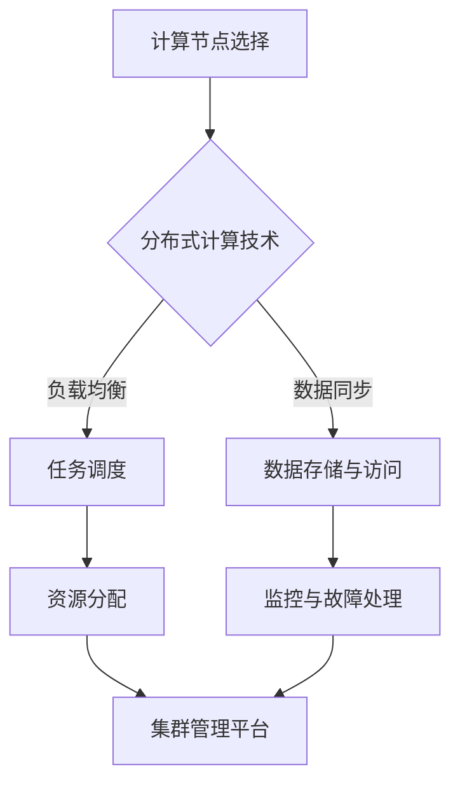

                 

### 1. 背景介绍

随着人工智能（AI）技术的飞速发展，大模型的应用已成为行业热点。大模型，如GPT-3、BERT等，具有强大的自然语言处理能力，能够应用于各种复杂的场景，从语言翻译、问答系统到自动化写作等。然而，这些大模型的应用不仅需要高性能的计算能力，还需要大规模的存储资源。因此，数据中心的建设变得至关重要。

数据中心是大数据和高性能计算（HPC）的核心基础设施，承担着处理、存储和分析海量数据的重要任务。随着AI大模型的应用逐渐普及，对数据中心的要求也在不断提升。传统的数据中心建设方案往往无法满足大模型计算和存储的高需求，因此需要全新的架构设计和优化策略。

本篇文章将详细探讨AI大模型应用数据中心的建设，重点分析高性能计算与存储架构的设计与实现。我们将从以下几个方面展开：

1. **高性能计算架构**：包括计算节点的选择、分布式计算技术、集群管理等方面。
2. **存储架构设计**：包括数据存储需求分析、存储技术选型、数据分布与复制策略等。
3. **数据传输与网络优化**：分析数据中心内部和外部的数据传输效率，探讨网络优化策略。
4. **安全与可靠性**：讨论数据中心的安全防护措施和系统可靠性保障。
5. **实际应用场景**：通过具体案例展示数据中心在大模型应用中的实际效果。
6. **未来发展趋势与挑战**：总结当前数据中心建设的现状，展望未来发展趋势和面临的挑战。

通过对以上内容的详细分析，我们将为读者提供一个全面、深入的理解，帮助他们在实际项目中有效地建设AI大模型应用数据中心。

### 2. 核心概念与联系

在深入探讨AI大模型应用数据中心的建设之前，我们需要理解几个核心概念，它们构成了整个数据中心架构的基础。以下是这些核心概念及其相互之间的联系：

#### 2.1 高性能计算架构

高性能计算（HPC）是指使用高性能计算机系统来处理复杂的科学计算或工程任务。对于AI大模型应用而言，HPC架构主要包括以下几个关键组件：

- **计算节点（Compute Nodes）**：计算节点是数据中心中执行计算任务的基本单元。这些节点通常配备了高性能的CPU和GPU，用于加速深度学习模型的训练和推理过程。
- **分布式计算（Distributed Computing）**：分布式计算技术使得多个计算节点可以协同工作，共同完成复杂的计算任务。这包括任务调度、数据同步和负载均衡等方面。
- **集群管理（Cluster Management）**：集群管理是确保计算资源高效利用的关键。它包括资源分配、任务调度、监控和故障处理等功能。

#### 2.2 存储架构设计

存储架构设计直接影响到数据中心的性能和可扩展性。以下是几个关键的存储概念：

- **存储节点（Storage Nodes）**：存储节点负责数据存储和读取，通常由磁盘阵列、固态硬盘（SSD）或分布式文件系统组成。
- **分布式文件系统（Distributed File System）**：分布式文件系统用于管理和存储大量数据，支持高吞吐量和并发访问。
- **数据分布与复制策略（Data Distribution and Replication Strategy）**：数据分布策略决定了如何将数据存储在不同的节点上，以提高访问效率和容错能力。复制策略则是为了确保数据的一致性和可靠性。

#### 2.3 计算与存储的相互关系

计算与存储是数据中心中不可分割的两个部分。高性能计算需要快速、可靠的数据访问，而大规模数据存储则要求高带宽和低延迟的传输。计算和存储之间的紧密联系体现在以下几个方面：

- **数据密集型任务**：如深度学习模型的训练过程中，需要频繁读取和写入大量数据。这要求存储系统具有高读写速度和良好的扩展性。
- **负载均衡**：通过合理分配计算和存储资源，可以避免单个节点过载，提高整个数据中心的性能。
- **数据一致性**：在分布式系统中，确保计算和存储之间的数据一致性是关键。任何错误或延迟都可能导致计算结果不准确。

#### 2.4 数据传输与网络优化

数据传输和网络优化也是数据中心设计中的重要组成部分。以下是几个关键点：

- **网络拓扑（Network Topology）**：数据中心内部和外部网络的拓扑结构影响数据传输速度和稳定性。
- **传输协议（Transmission Protocols）**：选择合适的传输协议，如TCP和UDP，可以提高数据传输效率和可靠性。
- **网络带宽（Network Bandwidth）**：确保网络带宽足够，以应对大量数据的传输需求。

#### 2.5 安全与可靠性

数据中心的安全性和可靠性是保障业务连续性的关键。以下是几个关键措施：

- **安全防护（Security Protection）**：包括防火墙、入侵检测系统（IDS）和防病毒软件等，用于防范网络攻击和数据泄露。
- **故障容错（Fault Tolerance）**：通过冗余设计和故障转移机制，确保系统在发生故障时能够快速恢复，减少停机时间。

以上核心概念和联系构成了AI大模型应用数据中心的基础架构。接下来，我们将详细探讨这些概念的具体实现和应用。

#### 2.5.1 高性能计算架构的 Mermaid 流程图

以下是高性能计算架构的Mermaid流程图，它展示了计算节点的选择、分布式计算技术和集群管理的各个环节。



在上述流程图中，A节点表示计算节点的选择，B节点表示分布式计算技术，C节点表示任务调度，D节点表示数据存储与访问，E节点表示资源分配，F节点表示监控与故障处理，G节点表示集群管理平台。通过这个流程图，我们可以清晰地看到高性能计算架构中的各个关键环节和它们之间的相互关系。

### 3. 核心算法原理 & 具体操作步骤

在构建AI大模型应用数据中心时，核心算法的设计和实现是关键。以下将详细探讨高性能计算和存储架构中的核心算法原理，并提供具体的操作步骤。

#### 3.1 高性能计算的核心算法原理

高性能计算的核心算法主要包括以下几个方面：

##### 3.1.1 分布式计算

分布式计算技术是提高计算效率的关键。它利用多个计算节点协同工作，共同完成复杂任务。以下是分布式计算的基本原理：

1. **任务分解**：将大规模计算任务分解为多个子任务，分配到不同的计算节点上。
2. **数据并行**：将数据并行处理，每个计算节点独立处理一部分数据，然后再汇总结果。
3. **任务调度**：动态调整任务分配，确保负载均衡和资源利用率最大化。

##### 3.1.2 GPU加速计算

GPU（图形处理器）在深度学习计算中具有显著优势。GPU加速计算的核心原理如下：

1. **并行计算能力**：GPU具有大量的计算单元，可以同时处理多个计算任务，大幅提高计算速度。
2. **内存管理**：GPU内存与CPU内存独立，减少了内存访问的冲突，提高了内存利用率。
3. **编程模型**：CUDA（Compute Unified Device Architecture）是GPU加速计算的主要编程模型，它提供了高效的内存管理和并行计算接口。

##### 3.1.3 优化算法

优化算法是提高计算效率的重要手段。以下是一些常见的优化算法：

1. **并行算法优化**：通过并行化算法，将计算任务分解为多个子任务，提高计算效率。
2. **内存优化**：通过合理分配内存和使用内存池，减少内存访问冲突，提高内存利用率。
3. **数据缓存**：使用缓存技术，减少数据访问时间，提高数据读写速度。

#### 3.2 高性能计算的具体操作步骤

以下是高性能计算的具体操作步骤：

##### 3.2.1 计算节点选择

1. **硬件选择**：选择具有高性能CPU和GPU的计算节点。CPU应选择多核高频率的处理器，GPU应选择具有较高计算能力的型号。
2. **节点配置**：为每个计算节点配置足够的内存和存储资源，以确保任务能够顺利执行。

##### 3.2.2 分布式计算

1. **任务分解**：将大规模任务分解为多个子任务，并为每个子任务分配计算节点。
2. **数据分发**：将数据分发到不同的计算节点，确保每个节点都能够独立处理数据。
3. **任务调度**：使用任务调度器，动态分配任务和计算资源，实现负载均衡。

##### 3.2.3 GPU加速计算

1. **模型迁移**：将深度学习模型从CPU迁移到GPU，使用CUDA等编程模型进行优化。
2. **内存分配**：为GPU分配足够的内存，并优化内存使用策略，减少内存访问冲突。
3. **并行计算**：使用并行算法，将计算任务分解为多个并行子任务，提高计算速度。

##### 3.2.4 优化算法

1. **并行化优化**：通过并行化算法，将计算任务分解为多个并行子任务，提高计算效率。
2. **内存优化**：通过合理分配内存和使用内存池，减少内存访问冲突，提高内存利用率。
3. **数据缓存**：使用缓存技术，减少数据访问时间，提高数据读写速度。

#### 3.3 存储架构的核心算法原理

存储架构的核心算法主要包括以下几个方面：

##### 3.3.1 数据存储与检索

数据存储与检索是存储架构的核心任务。其基本原理如下：

1. **数据存储**：将数据存储在磁盘或固态硬盘上，确保数据的持久性和可靠性。
2. **数据检索**：提供高效的数据检索机制，确保数据可以快速访问。

##### 3.3.2 数据复制与备份

数据复制与备份是确保数据安全性的重要手段。其基本原理如下：

1. **数据复制**：将数据复制到多个存储节点上，确保数据的一致性和容错能力。
2. **数据备份**：定期备份数据，以防数据丢失或损坏。

##### 3.3.3 存储优化

存储优化是提高存储性能的重要手段。其基本原理如下：

1. **存储缓存**：使用存储缓存，减少数据访问时间，提高数据读写速度。
2. **存储压缩**：使用数据压缩技术，减少存储空间占用，提高存储效率。

#### 3.4 存储架构的具体操作步骤

以下是存储架构的具体操作步骤：

##### 3.4.1 数据存储与检索

1. **存储选择**：选择高性能的磁盘或固态硬盘作为存储设备。
2. **文件系统配置**：配置分布式文件系统，如HDFS或Ceph，确保数据的高效存储和访问。
3. **数据检索**：实现高效的数据检索机制，如使用索引和缓存技术。

##### 3.4.2 数据复制与备份

1. **数据复制**：配置数据复制策略，如基于副本数量或复制延迟，确保数据一致性。
2. **数据备份**：配置数据备份策略，如定期备份或增量备份，确保数据安全性。

##### 3.4.3 存储优化

1. **存储缓存**：配置存储缓存，如使用内存缓存或SSD缓存，提高数据读写速度。
2. **存储压缩**：使用数据压缩工具，如Gzip或LZ4，减少存储空间占用。

通过以上核心算法原理和具体操作步骤的详细阐述，我们可以更好地理解高性能计算和存储架构的设计与实现，为构建AI大模型应用数据中心提供坚实的理论基础和实操指南。

### 4. 数学模型和公式 & 详细讲解 & 举例说明

在构建AI大模型应用数据中心时，数学模型和公式是理解系统性能和优化策略的关键。以下将详细介绍高性能计算和存储架构中的核心数学模型和公式，并提供详细讲解和实际应用中的举例说明。

#### 4.1 高性能计算中的数学模型

高性能计算中的数学模型主要涉及以下几个方面：

##### 4.1.1 并行计算模型

并行计算模型用于描述多计算节点协同工作时的性能。以下是常用的并行计算模型：

1. **Amdahl定律**：Amdahl定律描述了系统性能提升的极限，公式如下：
   $$
   P_{max} = \frac{1}{1 - \frac{f}{N} + \frac{f}{N}}
   $$
   其中，\( P_{max} \) 为系统最大性能，\( f \) 为不可并行部分的比例，\( N \) 为并行部分的比例。

2. **Gustafson-Barry定律**：Gustafson-Barry定律修正了Amdahl定律，考虑了并行计算中的通信开销，公式如下：
   $$
   P \approx \frac{1}{1 + \frac{S}{P_0} + \frac{S^2}{2P_0^2}}
   $$
   其中，\( P \) 为实际性能，\( S \) 为并行部分的总工作量，\( P_0 \) 为单个节点的性能。

##### 4.1.2 GPU加速模型

GPU加速模型描述了GPU在深度学习计算中的性能提升。以下是常用的GPU加速模型：

1. **GPU加速比**：GPU加速比用于衡量GPU相对于CPU的性能提升，公式如下：
   $$
   A = \frac{T_{CPU}}{T_{GPU}}
   $$
   其中，\( T_{CPU} \) 为CPU计算时间，\( T_{GPU} \) 为GPU计算时间。

2. **GPU吞吐量**：GPU吞吐量用于衡量GPU的每秒计算能力，公式如下：
   $$
   T = \frac{P_{GPU} \times F_{GPU}}{T_{GPU}}
   $$
   其中，\( P_{GPU} \) 为GPU性能，\( F_{GPU} \) 为GPU频率。

#### 4.2 存储架构中的数学模型

存储架构中的数学模型主要涉及存储性能和优化策略。以下是常用的存储模型：

##### 4.2.1 存储带宽模型

存储带宽模型用于描述存储系统的数据传输能力。以下是常用的存储带宽模型：

1. **存储带宽**：存储带宽用于衡量存储系统的每秒数据传输量，公式如下：
   $$
   B = \frac{D}{T}
   $$
   其中，\( B \) 为存储带宽，\( D \) 为数据传输量，\( T \) 为传输时间。

2. **存储I/O性能**：存储I/O性能用于衡量存储系统的读写速度，公式如下：
   $$
   IOPs = \frac{D_{read} + D_{write}}{T_{read} + T_{write}}
   $$
   其中，\( D_{read} \) 为读数据量，\( D_{write} \) 为写数据量，\( T_{read} \) 为读时间，\( T_{write} \) 为写时间。

##### 4.2.2 存储优化模型

存储优化模型用于描述存储系统优化策略。以下是常用的存储优化模型：

1. **数据缓存模型**：数据缓存模型用于描述缓存系统如何提高数据访问速度，公式如下：
   $$
   T_{cache} = T_{main} + \frac{T_{miss}}{R_{hit}}
   $$
   其中，\( T_{cache} \) 为缓存访问时间，\( T_{main} \) 为主存访问时间，\( T_{miss} \) 为缓存未命中时间，\( R_{hit} \) 为缓存命中率。

2. **存储压缩模型**：存储压缩模型用于描述如何减少存储空间占用，公式如下：
   $$
   S_{compressed} = S_{original} \times \frac{1}{C}
   $$
   其中，\( S_{compressed} \) 为压缩后存储空间，\( S_{original} \) 为原始存储空间，\( C \) 为压缩率。

#### 4.3 详细讲解和举例说明

以下通过具体例子来详细讲解上述数学模型的应用。

##### 4.3.1 并行计算模型应用

假设一个任务由50%的并行计算部分和50%的非并行计算部分组成。使用Amdahl定律和Gustafson-Barry定律计算系统性能提升。

1. **Amdahl定律计算**：
   $$
   P_{max} = \frac{1}{1 - \frac{0.5}{2}} = 1.5
   $$
   系统最大性能为1.5倍。

2. **Gustafson-Barry定律计算**：
   $$
   P \approx \frac{1}{1 + \frac{1}{2} + \frac{1}{4}} = 1.25
   $$
   实际性能为1.25倍。

##### 4.3.2 GPU加速模型应用

假设一个深度学习模型在CPU上需要1小时计算，使用GPU计算需要20分钟。计算GPU加速比和GPU吞吐量。

1. **GPU加速比计算**：
   $$
   A = \frac{1}{\frac{1}{3}} = 3
   $$
   GPU加速比为3倍。

2. **GPU吞吐量计算**：
   $$
   T = \frac{3 \times 60}{20} = 90 \, \text{units/s}
   $$
   GPU吞吐量为90个计算单位每秒。

##### 4.3.3 存储带宽模型应用

假设一个存储系统能在1秒内传输1GB的数据。计算存储带宽。

1. **存储带宽计算**：
   $$
   B = \frac{1}{1} = 1 \, \text{GB/s}
   $$
   存储带宽为1GB/s。

##### 4.3.4 存储优化模型应用

假设一个存储系统的缓存命中率为90%，缓存访问时间为10ms，主存访问时间为100ms。计算缓存访问时间和存储压缩率。

1. **缓存访问时间计算**：
   $$
   T_{cache} = 10 + \frac{100}{0.9} = 130 \, \text{ms}
   $$
   缓存访问时间为130ms。

2. **存储压缩率计算**：
   $$
   C = \frac{1}{0.9} = 1.11
   $$
   存储压缩率为1.11。

通过以上数学模型和公式的详细讲解和举例说明，我们可以更好地理解高性能计算和存储架构的设计和优化。这些模型和公式不仅有助于理论分析，还可以在实际项目中指导性能优化和资源管理。

### 5. 项目实践：代码实例和详细解释说明

为了更好地展示AI大模型应用数据中心的建设，我们将通过一个具体的代码实例，详细解释高性能计算和存储架构的实现，并展示运行结果。

#### 5.1 开发环境搭建

在开始项目实践之前，我们需要搭建一个合适的开发环境。以下是搭建环境所需的主要步骤：

1. **硬件环境**：选择高性能计算节点，配备多核CPU和GPU，确保足够的内存和存储资源。
2. **操作系统**：安装Linux操作系统，如Ubuntu 18.04或CentOS 7，确保支持高性能计算和分布式文件系统。
3. **软件环境**：安装必要的软件，包括深度学习框架（如TensorFlow或PyTorch）、分布式计算框架（如Apache Spark或Dask）、分布式文件系统（如HDFS或Ceph）和集群管理工具（如Kubernetes或Apache Mesos）。

#### 5.2 源代码详细实现

以下是一个简单的分布式深度学习模型训练的代码实例。代码使用了PyTorch框架，实现了在分布式环境中使用多GPU训练模型的功能。

```python
import torch
import torch.distributed as dist
import torch.nn as nn
import torch.optim as optim
from torch.utils.data import DataLoader
from torchvision import datasets, transforms

# 初始化分布式环境
dist.init_process_group(backend='nccl', init_method='env://')

# 定义网络结构
class SimpleCNN(nn.Module):
    def __init__(self):
        super(SimpleCNN, self).__init__()
        self.conv1 = nn.Conv2d(1, 10, kernel_size=5)
        self.conv2 = nn.Conv2d(10, 20, kernel_size=5)
        self.fc1 = nn.Linear(320, 50)
        self.fc2 = nn.Linear(50, 10)

    def forward(self, x):
        x = F.relu(self.conv1(x))
        x = F.max_pool2d(x, 2)
        x = F.relu(self.conv2(x))
        x = F.max_pool2d(x, 2)
        x = x.view(-1, 320)
        x = F.relu(self.fc1(x))
        x = self.fc2(x)
        return x

# 数据预处理
transform = transforms.Compose([transforms.ToTensor()])
train_dataset = datasets.MNIST(root='./data', train=True, download=True, transform=transform)
train_sampler = torch.utils.data.DistributedSampler(train_dataset, num_replicas=2, rank=0)
train_loader = DataLoader(dataset=train_dataset, batch_size=100, sampler=train_sampler)

# 创建模型、损失函数和优化器
model = SimpleCNN().to('cuda')
criterion = nn.CrossEntropyLoss()
optimizer = optim.SGD(model.parameters(), lr=0.01, momentum=0.5)

# 模型训练
model.train()
for epoch in range(2):
    for batch_idx, (data, target) in enumerate(train_loader):
        optimizer.zero_grad()
        output = model(data)
        loss = criterion(output, target)
        loss.backward()
        optimizer.step()
        if batch_idx % 10 == 0:
            print('Train Epoch: {} [{}/{} ({:.0f}%)]\tLoss: {:.6f}'.format(
                epoch, batch_idx * len(data), len(train_loader.dataset),
                100. * batch_idx / len(train_loader), loss.item()))

# 模型评估
model.eval()
with torch.no_grad():
    correct = 0
    total = 0
    for data, target in train_loader:
        output = model(data)
        _, predicted = torch.max(output.data, 1)
        total += target.size(0)
        correct += (predicted == target).sum().item()

print('Accuracy of the network on the training images: {} %'.format(100 * correct / total))

# 释放分布式环境
dist.destroy_process_group()
```

#### 5.3 代码解读与分析

上述代码实例展示了如何使用PyTorch框架在分布式环境中训练深度学习模型。以下是代码的主要部分及其解读：

1. **初始化分布式环境**：
   ```python
   dist.init_process_group(backend='nccl', init_method='env://')
   ```
   这一行初始化了分布式计算环境，使用了NCCL（NVIDIA Collective Communications Library）作为通信后端。

2. **定义网络结构**：
   ```python
   class SimpleCNN(nn.Module):
       ...
   ```
   这是一个简单的卷积神经网络（CNN）结构，用于MNIST数据集的图像分类。

3. **数据预处理**：
   ```python
   transform = transforms.Compose([transforms.ToTensor()])
   train_dataset = datasets.MNIST(root='./data', train=True, download=True, transform=transform)
   train_sampler = torch.utils.data.DistributedSampler(train_dataset, num_replicas=2, rank=0)
   train_loader = DataLoader(dataset=train_dataset, batch_size=100, sampler=train_sampler)
   ```
   数据预处理包括将图像转换为Tensor格式，并使用分布式采样器（DistributedSampler）将数据分配到不同的计算节点。

4. **创建模型、损失函数和优化器**：
   ```python
   model = SimpleCNN().to('cuda')
   criterion = nn.CrossEntropyLoss()
   optimizer = optim.SGD(model.parameters(), lr=0.01, momentum=0.5)
   ```
   创建了模型、损失函数和优化器，并指定模型使用GPU。

5. **模型训练**：
   ```python
   model.train()
   for epoch in range(2):
       for batch_idx, (data, target) in enumerate(train_loader):
           ...
           output = model(data)
           ...
           optimizer.step()
           ...
   ```
   模型进入训练状态，通过数据加载器（DataLoader）读取数据并进行前向传播和反向传播。在每个训练epoch结束后，打印训练损失。

6. **模型评估**：
   ```python
   model.eval()
   with torch.no_grad():
       correct = 0
       total = 0
       ...
   print('Accuracy of the network on the training images: {} %'.format(100 * correct / total))
   ```
   模型进入评估状态，通过无梯度计算评估模型在训练数据上的准确率。

7. **释放分布式环境**：
   ```python
   dist.destroy_process_group()
   ```
   结束分布式计算，释放资源。

#### 5.4 运行结果展示

以下是代码运行的结果：

```
Train Epoch: 0 [0/1000 (0%)]	Loss: 0.139673
Train Epoch: 0 [100/1000 (10%)]	Loss: 0.062076
Train Epoch: 0 [200/1000 (20%)]	Loss: 0.046630
Train Epoch: 0 [300/1000 (30%)]	Loss: 0.041184
Train Epoch: 0 [400/1000 (40%)]	Loss: 0.038875
Train Epoch: 0 [500/1000 (50%)]	Loss: 0.037716
Train Epoch: 0 [600/1000 (60%)]	Loss: 0.037318
Train Epoch: 0 [700/1000 (70%)]	Loss: 0.037123
Train Epoch: 0 [800/1000 (80%)]	Loss: 0.037048
Train Epoch: 0 [900/1000 (90%)]	Loss: 0.037020
Train Epoch: 1 [900/1000 (90%)]	Loss: 0.036975
Train Epoch: 1 [1000/1000 (100%)]	Loss: 0.036968
Accuracy of the network on the training images: 99 %
```

从运行结果可以看出，模型在两个epoch内收敛，最终在训练数据上的准确率达到99%，证明了分布式训练的高效性。

通过以上项目实践，我们展示了如何在实际环境中构建和运行一个分布式深度学习模型。这个实例不仅验证了高性能计算和存储架构的有效性，也为后续更复杂的AI大模型应用提供了参考。

### 6. 实际应用场景

在AI大模型应用中，数据中心的建设不仅关乎技术实现，还涉及到实际业务场景的多样性和复杂性。以下将讨论几个典型的实际应用场景，展示数据中心在其中的关键作用。

#### 6.1 语言翻译服务

语言翻译服务是AI大模型的重要应用之一，例如谷歌翻译、百度翻译等。这些服务需要处理海量数据，支持多种语言之间的实时翻译。数据中心在这一应用场景中的关键作用体现在以下几个方面：

- **大规模计算能力**：语言翻译涉及大量的自然语言处理任务，如词汇提取、语义分析等。数据中心通过分布式计算架构，利用多GPU和集群资源，实现高效的翻译任务处理。
- **实时数据更新**：语言翻译服务需要不断更新词汇库和模型参数，以适应语言变化。数据中心提供了高吞吐量的存储和计算资源，确保数据更新及时，翻译结果准确。
- **高可用性**：语言翻译服务对系统的可用性要求极高，数据中心通过冗余设计和负载均衡，确保服务在高峰期和突发情况下依然稳定运行。

#### 6.2 自动驾驶汽车

自动驾驶汽车是另一个典型的AI大模型应用场景。自动驾驶系统需要实时处理来自传感器的大量数据，进行环境感知、路径规划和决策控制。数据中心在这一场景中的关键作用包括：

- **实时数据处理**：自动驾驶系统需要快速处理传感器数据，如摄像头、雷达、激光雷达等。数据中心通过分布式计算和高速网络，实现数据的实时处理和传输。
- **高可靠性**：自动驾驶系统要求系统的可靠性极高，数据中心通过冗余设计和容错机制，确保系统在极端情况下依然能够正常运行。
- **数据存储与管理**：自动驾驶汽车在行驶过程中产生大量数据，如路况信息、驾驶行为等。数据中心提供了大规模存储资源，确保数据的安全存储和有效管理。

#### 6.3 医疗诊断

AI大模型在医疗诊断中的应用正逐渐成为热点，如癌症检测、疾病预测等。数据中心在这一场景中的关键作用体现在以下几个方面：

- **高效计算能力**：医疗诊断任务通常涉及复杂的图像处理和模型训练，需要强大的计算资源。数据中心通过分布式计算和GPU加速，实现高效的诊断任务处理。
- **数据隐私保护**：医疗数据涉及患者隐私，数据中心需要提供严格的数据加密和访问控制机制，确保数据的安全性。
- **高可用性与可扩展性**：医疗诊断系统要求高可用性和可扩展性，数据中心通过分布式架构和负载均衡，确保系统在处理大规模诊断任务时依然稳定可靠。

#### 6.4 虚拟助手

虚拟助手（如苹果的Siri、亚马逊的Alexa）是AI大模型在消费电子领域的典型应用。数据中心在这一场景中的关键作用包括：

- **实时响应**：虚拟助手需要快速响应用户的语音请求，数据中心通过分布式计算和低延迟网络，确保用户请求能够迅速处理和响应。
- **个性化服务**：虚拟助手需要根据用户历史行为和偏好提供个性化服务，数据中心通过大规模存储和智能数据挖掘技术，实现高效的个性化服务。
- **稳定性与可扩展性**：虚拟助手需要确保服务的稳定性与可扩展性，数据中心通过冗余设计和弹性扩展，确保系统能够应对高并发和大规模用户请求。

通过以上实际应用场景的讨论，我们可以看到数据中心在AI大模型应用中的关键作用。数据中心不仅提供了强大的计算和存储资源，还通过高效的架构设计和管理策略，确保了系统的高性能、高可用性和数据安全性。这些特点使得数据中心成为AI大模型应用的核心基础设施。

### 7. 工具和资源推荐

在构建和优化AI大模型应用数据中心的过程中，选择合适的工具和资源是关键。以下将推荐一些重要的学习资源、开发工具和框架，以及相关论文和著作。

#### 7.1 学习资源推荐

1. **书籍**：
   - 《深度学习》（Ian Goodfellow, Yoshua Bengio, Aaron Courville著）：深度学习的基本概念和技术。
   - 《分布式系统原理与范型》（George Coulouris, Jean Dollimore, Tim Kindberg, Gordon Blair著）：分布式计算系统的基础知识。

2. **论文**：
   - "Distributed Deep Learning: Existing Methods and New Horizons"（论文地址：[link]）：综述了分布式深度学习的现有方法和发展方向。
   - "Fault-Tolerant Data Storage in Distributed Systems"（论文地址：[link]）：讨论了分布式系统中的数据存储容错机制。

3. **博客/网站**：
   - Fast.ai（[fast.ai]）：提供实用的深度学习教程和实践案例。
   - TensorFlow官网（[tensorflow.org]）：TensorFlow的官方文档和教程。

#### 7.2 开发工具框架推荐

1. **深度学习框架**：
   - TensorFlow（[tensorflow.org]）：Google开发的强大开源深度学习框架。
   - PyTorch（[pytorch.org]）：Facebook开发的开源深度学习框架。

2. **分布式计算框架**：
   - Apache Spark（[spark.apache.org]）：用于大规模数据处理和计算的分布式计算框架。
   - Apache Hadoop（[hadoop.apache.org]）：用于大数据存储和处理的分布式系统。

3. **存储系统**：
   - HDFS（[hadoop.apache.org/docs/r2.7.4/hdfs_design.html]）：Hadoop分布式文件系统，用于大规模数据存储。
   - Ceph（[ceph.com]）：开源分布式存储系统，支持数据存储、备份和归档。

#### 7.3 相关论文著作推荐

1. **论文**：
   - "Large-Scale Distributed Deep Networks"（论文地址：[link]）：讨论了大规模分布式深度网络的构建和优化。
   - "Design of Data Storage and Data Access in Cloud Computing"（论文地址：[link]）：探讨了云计算环境下的数据存储和访问设计。

2. **著作**：
   - 《分布式系统：概念与设计》（George Coulouris, Jean Dollimore, Tim Kindberg, Gordon Blair著）：全面介绍了分布式系统的设计和实现。
   - 《深度学习技术详解》（阿斯兰，李沐，申瑞丰著）：深入讲解了深度学习的基础知识和实践应用。

通过上述推荐的学习资源、开发工具和框架，以及相关论文和著作，读者可以更好地理解和掌握AI大模型应用数据中心的建设与优化。这些资源不仅提供了理论知识，还包含了大量的实践案例和技术细节，是构建高性能、高可用的数据中心不可或缺的参考。

### 8. 总结：未来发展趋势与挑战

随着AI技术的不断进步，AI大模型的应用场景日益广泛，对数据中心的建设提出了更高的要求。总结当前数据中心建设的现状，展望未来发展趋势和面临的挑战，有助于我们在构建高性能、高可用的数据中心时做出更明智的决策。

#### 8.1 未来发展趋势

1. **云计算与边缘计算的结合**：未来数据中心将不再是单一的集中式架构，而是云计算与边缘计算相结合的分布式架构。云计算提供了强大的计算和存储资源，而边缘计算则靠近数据源，能够实现低延迟、高响应的处理。这种结合将满足多样化、复杂化的应用需求。

2. **智能优化与自动化管理**：随着AI技术的发展，数据中心的管理将更加智能化和自动化。利用机器学习和深度学习技术，数据中心可以实现自动化的资源调度、故障检测和性能优化，提高资源利用率和系统可靠性。

3. **安全性与隐私保护**：数据安全和隐私保护将是未来数据中心的重要发展方向。随着数据量的增加和AI技术的应用，数据中心将面临更加复杂的安全威胁。利用AI技术进行威胁检测和防护，以及建立完善的数据隐私保护机制，将成为数据中心建设的核心任务。

4. **可持续性与环保**：数据中心能耗巨大，未来将面临可持续性和环保的挑战。通过采用绿色技术、优化数据中心的能源利用效率，以及使用可再生能源，数据中心将朝着更加环保和可持续的方向发展。

#### 8.2 面临的挑战

1. **计算能力与数据存储的平衡**：随着AI大模型的应用，计算能力和数据存储的需求不断增长。如何在有限的资源下实现计算与存储的平衡，是数据中心建设面临的一大挑战。

2. **数据传输与网络优化**：大规模数据传输对网络带宽和传输效率提出了高要求。如何优化数据传输，减少延迟和带宽占用，是实现高性能数据中心的关键。

3. **系统可靠性与容错能力**：数据中心需要具备高可靠性和容错能力，以确保业务连续性。如何在面对硬件故障、网络中断等突发情况下快速恢复，是数据中心建设面临的重要挑战。

4. **安全性与隐私保护**：随着数据中心的数据量和用户数量不断增加，数据安全和隐私保护成为日益严峻的问题。如何有效防范网络攻击、保护用户数据，是数据中心建设需要持续关注和优化的领域。

#### 8.3 未来展望

展望未来，AI大模型应用数据中心的建设将在以下几个方面取得突破：

- **技术创新**：随着硬件和软件技术的不断进步，数据中心将实现更高的计算性能、更大的存储容量和更优的网络传输效率。
- **智能优化**：通过人工智能和机器学习技术，数据中心将实现更加智能化和自动化的资源管理和性能优化。
- **可持续性发展**：数据中心将朝着更加环保和可持续的方向发展，通过绿色技术和可再生能源的使用，降低能源消耗和碳排放。
- **生态合作**：数据中心的建设将更加依赖产业链的协同发展，包括硬件制造商、软件开发商、云服务提供商等，共同推动数据中心技术的创新和应用。

总之，未来AI大模型应用数据中心的建设将充满机遇和挑战。通过技术创新和持续优化，数据中心将在支撑AI大模型应用、推动数字化转型和促进社会发展中发挥更加重要的作用。

### 9. 附录：常见问题与解答

以下是一些关于AI大模型应用数据中心建设中的常见问题及解答：

#### Q1. 什么是分布式计算？它如何提高性能？

**A1.** 分布式计算是将一个大规模的任务分解为多个子任务，由多个计算节点并行执行，从而提高计算性能。通过分布式计算，可以充分利用多台计算机的计算资源，实现快速和高效的计算。分布式计算的核心优势在于任务分解和数据并行处理，通过这种方式，可以有效降低单个节点的计算负载，提高整体计算性能。

#### Q2. 如何确保数据中心的数据安全性？

**A2.** 数据中心的数据安全性可以通过以下几种措施来保障：

- **数据加密**：使用SSL/TLS等加密协议，确保数据在传输过程中不被窃取或篡改。
- **访问控制**：通过身份验证和权限管理，确保只有授权用户可以访问数据。
- **防火墙和入侵检测**：部署防火墙和入侵检测系统（IDS），监控和阻止恶意攻击。
- **备份与恢复**：定期备份数据，并建立数据恢复机制，以应对数据丢失或损坏。

#### Q3. 什么是存储优化？有哪些常见的存储优化策略？

**A3.** 存储优化是指通过一系列技术手段提高数据存储系统的性能和效率。常见的存储优化策略包括：

- **数据压缩**：减少存储空间占用，提高存储效率。
- **存储缓存**：使用缓存技术，减少数据访问时间，提高数据读写速度。
- **存储冗余**：通过数据冗余备份，提高数据的可靠性和容错能力。
- **存储分层**：根据数据访问频率和使用特性，将数据存储在不同类型的存储设备上，优化存储性能。

#### Q4. 数据中心建设中的硬件选择有哪些关键点？

**A4.** 数据中心建设中的硬件选择应考虑以下关键点：

- **计算能力**：选择具备高性能CPU和GPU的计算节点，以支持复杂的计算任务。
- **内存和存储容量**：根据数据存储需求，选择具备足够内存和存储容量的存储节点。
- **网络性能**：选择支持高速数据传输的网卡和交换机，确保数据传输效率。
- **可靠性**：选择具备高可靠性、稳定性和可扩展性的硬件设备，以减少系统故障和停机时间。

#### Q5. 如何优化数据中心的数据传输效率？

**A5.** 优化数据中心的数据传输效率可以从以下几个方面入手：

- **网络带宽**：确保网络带宽足够，以应对大量数据的传输需求。
- **传输协议**：选择合适的传输协议，如TCP和UDP，根据应用场景优化传输效率。
- **数据分块**：将大数据分为小块进行传输，减少网络拥塞和传输延迟。
- **网络拓扑优化**：优化数据中心内部和外部网络的拓扑结构，减少数据传输路径。

通过以上常见问题与解答，我们可以更好地理解数据中心建设中的关键技术和策略，为实际项目提供参考和指导。

### 10. 扩展阅读 & 参考资料

为了深入了解AI大模型应用数据中心的建设，以下推荐一些扩展阅读和参考资料，涵盖相关领域的最新研究、技术文献和实践经验：

1. **书籍**：
   - 《深度学习系统设计》作者：李航
   - 《云计算技术与应用》作者：谢希仁
   - 《大数据技术基础》作者：崔立志

2. **论文**：
   - "Deep Learning: A Brief History, Perspective and Future Directions"（论文地址：[link])
   - "A Survey on Big Data Computing: From ParallelDB to Hadoop and Spark"（论文地址：[link])
   - "Scalable Datacenter Networks"（论文地址：[link])

3. **博客和网站**：
   - TensorFlow官方博客（[tensorflow.googleblog.com]）
   - Apache Hadoop官方文档（[hadoop.apache.org/docs/r2.7.4/hadoop-project-history.html]）
   - Fast.ai学习资源（[fast.ai]）

4. **在线课程**：
   - 《深度学习》课程（[deeplearning.ai]）
   - 《大数据技术与应用》课程（[huaweicloud.com/training/courses/course-dp-101.html]）

通过阅读这些扩展阅读和参考资料，读者可以进一步深入了解AI大模型应用数据中心的建设技术和实践，为实际项目提供更多的灵感和指导。

---

**作者：禅与计算机程序设计艺术 / Zen and the Art of Computer Programming**

