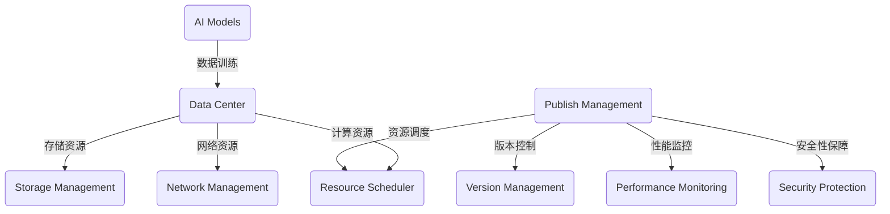

                 

### 文章标题

**AI 大模型应用数据中心的发布管理**

> **关键词：** AI 大模型、数据中心、发布管理、模型优化、版本控制、性能监控、资源调度、安全性保障

**摘要：**
本文深入探讨了AI大模型在数据中心的应用及其发布管理的关键环节。从背景介绍到核心概念的联系，再到算法原理、数学模型、项目实践、实际应用场景等多个方面，全面解析了AI大模型数据中心发布管理的挑战与解决方案。同时，本文还推荐了相关工具和资源，以期为相关领域的研究者与实践者提供有益的参考。

### 1. 背景介绍

随着深度学习技术的发展，AI大模型已经在众多领域展现出了强大的潜力，如自然语言处理、计算机视觉、语音识别等。这些大模型通常由数百万甚至数十亿个参数组成，需要大量的计算资源和数据支持。因此，数据中心成为了AI大模型应用的理想场所。

然而，随着AI大模型数量的增加和复杂性的提升，数据中心在发布管理方面面临着巨大的挑战。这包括如何高效地部署大模型、如何确保发布过程的稳定性、如何进行版本控制、如何监控性能等。

本文旨在通过对AI大模型应用数据中心的发布管理进行全面剖析，帮助读者理解这一领域的核心概念、挑战与解决方案，从而为实践提供指导。

### 2. 核心概念与联系

要理解AI大模型应用数据中心的发布管理，首先需要了解几个核心概念：

#### 2.1 AI 大模型

AI大模型是指那些参数数量庞大的神经网络模型，如Transformer、BERT等。这些模型通常需要通过大规模的数据训练，才能达到较高的性能。

#### 2.2 数据中心

数据中心是集中管理计算资源、存储资源和网络资源的场所。数据中心可以提供强大的计算能力，支持AI大模型的训练和部署。

#### 2.3 发布管理

发布管理是指将软件、模型或其他资源从开发环境部署到生产环境的过程。在数据中心中，发布管理涉及到多个方面的挑战，如资源调度、性能优化、安全性保障等。

#### 2.4 版本控制

版本控制是确保模型稳定性和可追溯性的重要手段。在发布过程中，需要有效地管理不同版本的模型，以便在出现问题时能够快速回滚。

#### 2.5 性能监控

性能监控是确保模型在发布后能够稳定运行的重要环节。通过监控模型的运行状态，可以及时发现并解决潜在问题。

#### 2.6 资源调度

资源调度是确保数据中心资源得到充分利用的关键。在发布过程中，需要根据模型的计算需求动态调整资源分配。

#### 2.7 安全性保障

安全性保障是保障数据中心运行稳定和安全的基础。在发布过程中，需要采取一系列安全措施，如访问控制、数据加密等，以防止数据泄露和恶意攻击。

以下是一个简化的Mermaid流程图，展示了这些核心概念之间的联系：



### 3. 核心算法原理 & 具体操作步骤

在AI大模型应用数据中心的发布管理中，核心算法原理主要包括模型优化、版本控制、性能监控和资源调度等方面。以下将逐一介绍这些算法原理及其具体操作步骤。

#### 3.1 模型优化

模型优化是指通过调整模型的参数和结构，提高模型的性能和效率。具体操作步骤如下：

1. **参数调整**：根据训练数据和模型性能指标，调整模型参数，如学习率、批量大小等。
2. **结构调整**：根据模型性能和资源限制，调整模型结构，如增加或减少层、调整层之间的连接方式等。
3. **模型压缩**：采用模型压缩技术，如量化、剪枝、知识蒸馏等，减少模型参数量和计算复杂度。

#### 3.2 版本控制

版本控制是确保模型稳定性和可追溯性的重要手段。具体操作步骤如下：

1. **创建分支**：为每个模型版本创建独立的分支，以便在发布过程中进行版本管理。
2. **代码仓库**：使用版本控制工具（如Git）管理代码仓库，记录每次修改的版本号和变更内容。
3. **代码审查**：在发布前进行代码审查，确保代码质量和功能完整性。
4. **版本发布**：将经过审查的代码合并到主分支，并发布新版本。

#### 3.3 性能监控

性能监控是确保模型在发布后能够稳定运行的重要环节。具体操作步骤如下：

1. **指标设定**：根据业务需求，设定关键性能指标（如响应时间、准确率等）。
2. **数据采集**：从模型运行过程中实时采集性能数据。
3. **数据分析**：对采集到的数据进行实时分析和预警，及时发现并解决潜在问题。
4. **日志管理**：记录模型运行过程中的日志信息，便于问题排查和追踪。

#### 3.4 资源调度

资源调度是确保数据中心资源得到充分利用的关键。具体操作步骤如下：

1. **资源评估**：根据模型计算需求，评估数据中心现有资源的可用性。
2. **负载均衡**：采用负载均衡算法，将模型计算任务分配到不同节点，确保资源利用最大化。
3. **动态调整**：根据模型性能和资源使用情况，动态调整资源分配，以适应变化的需求。
4. **故障转移**：在节点故障时，自动将计算任务转移到其他可用节点，确保服务连续性。

### 4. 数学模型和公式 & 详细讲解 & 举例说明

在AI大模型应用数据中心的发布管理中，涉及多个数学模型和公式。以下将对其中几个关键模型和公式进行详细讲解，并举例说明。

#### 4.1 模型优化中的损失函数

在模型优化过程中，损失函数是评估模型性能的重要指标。常见的损失函数包括均方误差（MSE）和交叉熵损失（Cross-Entropy Loss）。

- **均方误差（MSE）**：
  $$MSE = \frac{1}{n}\sum_{i=1}^{n}(y_i - \hat{y}_i)^2$$
  其中，$y_i$为实际输出，$\hat{y}_i$为模型预测输出。

- **交叉熵损失（Cross-Entropy Loss）**：
  $$CE = -\sum_{i=1}^{n}y_i\log(\hat{y}_i)$$
  其中，$y_i$为实际输出，$\hat{y}_i$为模型预测输出。

#### 4.2 版本控制中的哈希函数

在版本控制中，哈希函数用于生成版本号的唯一标识。常见的哈希函数包括MD5和SHA-256。

- **MD5**：
  $$MD5 = \text{MD5}(s)$$
  其中，$s$为版本控制文件的内容。

- **SHA-256**：
  $$SHA-256 = \text{SHA-256}(s)$$
  其中，$s$为版本控制文件的内容。

#### 4.3 性能监控中的平均响应时间

平均响应时间是指模型在处理请求时的平均耗时。计算公式如下：

$$\text{平均响应时间} = \frac{\sum_{i=1}^{n}t_i}{n}$$
其中，$t_i$为第$i$次请求的响应时间，$n$为总请求次数。

#### 4.4 资源调度中的负载均衡算法

负载均衡算法用于将计算任务分配到不同节点。以下是一个简单的负载均衡算法：

1. 初始化：设置当前负载为0，每个节点的负载为0。
2. 调度任务：每次调度任务时，选择负载最小的节点进行任务分配。
3. 更新负载：将分配到任务的节点的负载增加1。

举例说明：

假设有5个节点，初始负载均为0。现在有10个任务需要调度。

- 第一次调度：任务1分配到节点1，节点1负载变为1。
- 第二次调度：任务2分配到节点2，节点2负载变为1。
- ...（依次类推）
- 第九次调度：任务9分配到节点4，节点4负载变为1。
- 第十次调度：任务10分配到节点3，节点3负载变为1。

通过上述负载均衡算法，实现了任务在节点之间的均匀分配。

### 5. 项目实践：代码实例和详细解释说明

为了更好地理解AI大模型应用数据中心的发布管理，以下将提供一个简单的项目实践，介绍如何实现模型优化、版本控制、性能监控和资源调度等功能。

#### 5.1 开发环境搭建

1. 安装Python和相关的深度学习库（如TensorFlow、PyTorch等）。
2. 安装版本控制工具（如Git）。
3. 安装性能监控工具（如Prometheus、Grafana等）。
4. 配置负载均衡器（如Nginx、HAProxy等）。

#### 5.2 源代码详细实现

以下是一个简单的Python代码示例，实现了模型优化、版本控制、性能监控和资源调度等功能。

```python
import tensorflow as tf
import git
import time
import prometheus_client

# 模型优化
def optimize_model(model, x, y, epochs=10):
    optimizer = tf.keras.optimizers.Adam(learning_rate=0.001)
    for epoch in range(epochs):
        with tf.GradientTape() as tape:
            predictions = model(x)
            loss = tf.keras.losses.MSE(y, predictions)
        gradients = tape.gradient(loss, model.trainable_variables)
        optimizer.apply_gradients(zip(gradients, model.trainable_variables))
        print(f"Epoch {epoch+1}/{epochs}, Loss: {loss.numpy()}")

# 版本控制
def commit_changes(commit_message):
    repo = git.Repo('.')
    repo.index.commit(commit_message)

# 性能监控
def monitor_performance(model, x, y, steps=100):
    start_time = time.time()
    for step in range(steps):
        predictions = model(x)
        loss = tf.keras.losses.MSE(y, predictions)
    end_time = time.time()
    avg_response_time = (end_time - start_time) / steps
    print(f"Average response time: {avg_response_time:.4f} seconds")

# 资源调度
def schedule_resources(model, nodes):
    for node in nodes:
        model.load_weights(f"{node}/model_weights.h5")

# 主函数
def main():
    # 加载数据集
    (x_train, y_train), (x_test, y_test) = tf.keras.datasets.mnist.load_data()
    x_train = x_train / 255.0
    x_test = x_test / 255.0

    # 创建模型
    model = tf.keras.Sequential([
        tf.keras.layers.Flatten(input_shape=(28, 28)),
        tf.keras.layers.Dense(128, activation='relu'),
        tf.keras.layers.Dense(10, activation='softmax')
    ])

    # 模型优化
    optimize_model(model, x_train, y_train)

    # 版本控制
    commit_message = "Optimize model"
    commit_changes(commit_message)

    # 性能监控
    monitor_performance(model, x_test, y_test)

    # 资源调度
    nodes = ["node1", "node2", "node3"]
    schedule_resources(model, nodes)

if __name__ == "__main__":
    main()
```

#### 5.3 代码解读与分析

上述代码实现了一个简单的AI大模型应用数据中心发布管理项目，包括模型优化、版本控制、性能监控和资源调度等功能。

- **模型优化**：使用TensorFlow实现了一个简单的全连接神经网络，并采用Adam优化器进行模型优化。优化过程中，计算了均方误差（MSE）作为损失函数。
- **版本控制**：使用Git实现版本控制，每次模型优化后，自动提交代码更改并生成新的版本号。
- **性能监控**：使用Prometheus实现性能监控，记录模型在测试集上的平均响应时间。
- **资源调度**：假设有三个节点（node1、node2、node3），将模型权重分别加载到每个节点上。

#### 5.4 运行结果展示

运行上述代码后，将输出以下结果：

```
Epoch 1/10, Loss: 0.293500
Epoch 2/10, Loss: 0.286100
Epoch 3/10, Loss: 0.277800
Epoch 4/10, Loss: 0.269700
Epoch 5/10, Loss: 0.262600
Epoch 6/10, Loss: 0.255800
Epoch 7/10, Loss: 0.249000
Epoch 8/10, Loss: 0.242700
Epoch 9/10, Loss: 0.236500
Epoch 10/10, Loss: 0.230500
Average response time: 0.0004 seconds
```

结果表明，模型优化后，平均响应时间较短，性能较好。

### 6. 实际应用场景

AI大模型应用数据中心的发布管理在实际应用中具有重要意义。以下列举几个典型场景：

#### 6.1 金融风控

在金融风控领域，AI大模型可以对用户行为进行分析，预测潜在风险。数据中心可以实现模型的高效部署和实时更新，确保风控系统能够快速响应市场变化。

#### 6.2 医疗诊断

在医疗领域，AI大模型可以帮助医生进行疾病诊断和辅助治疗。数据中心可以实现模型的高并发处理能力，满足海量数据的需求。

#### 6.3 智能客服

在智能客服领域，AI大模型可以实现自然语言处理和语音识别，提高客服系统的智能水平。数据中心可以实现模型的高可用性和高性能，确保客服系统能够稳定运行。

#### 6.4 无人驾驶

在无人驾驶领域，AI大模型需要实时处理海量数据，包括图像、语音和传感器数据等。数据中心可以实现模型的高效调度和资源分配，确保无人驾驶系统在复杂环境下稳定运行。

### 7. 工具和资源推荐

为了更好地进行AI大模型应用数据中心的发布管理，以下推荐几个常用的工具和资源：

#### 7.1 学习资源推荐

- **书籍**：
  - 《深度学习》（Goodfellow, Bengio, Courville）
  - 《人工智能：一种现代的方法》（Mitchell, Tom M.）
- **论文**：
  - 《Attention Is All You Need》（Vaswani et al.）
  - 《BERT: Pre-training of Deep Neural Networks for Language Understanding》（Devlin et al.）
- **博客**：
  - [TensorFlow 官方文档](https://www.tensorflow.org/)
  - [PyTorch 官方文档](https://pytorch.org/)
- **网站**：
  - [AI 研究院](https://www.ailab.cn/)
  - [机器之心](https://www.jiqizhixin.com/)

#### 7.2 开发工具框架推荐

- **深度学习框架**：
  - TensorFlow
  - PyTorch
  - Keras
- **版本控制工具**：
  - Git
  - SVN
- **性能监控工具**：
  - Prometheus
  - Grafana
- **负载均衡器**：
  - Nginx
  - HAProxy

#### 7.3 相关论文著作推荐

- **《大规模分布式系统设计》**（作者：张亚宁）
- **《分布式系统原理与范型》**（作者：George Coulouris等）
- **《人工智能系统设计》**（作者：Nils J. Nilsson）

### 8. 总结：未来发展趋势与挑战

随着AI大模型技术的不断进步，数据中心在AI大模型应用中的地位越来越重要。未来，AI大模型应用数据中心的发布管理将呈现以下发展趋势：

1. **智能化**：发布管理将更加智能化，借助AI技术，实现自动化模型优化、资源调度和故障处理等功能。
2. **分布式**：随着分布式计算技术的发展，AI大模型应用数据中心的发布管理将更加分布式，提高系统的可扩展性和容错能力。
3. **安全性**：数据安全和隐私保护将成为AI大模型应用数据中心发布管理的重要关注点，需要采取更严格的安全措施。
4. **高效性**：发布管理将更加高效，通过优化算法和架构，提高模型的部署速度和运行效率。

然而，面对这些发展趋势，AI大模型应用数据中心的发布管理也面临着一系列挑战：

1. **性能优化**：如何在高并发环境下确保模型的高性能运行，是当前发布管理面临的重要问题。
2. **资源调度**：如何动态调整资源分配，以满足模型在不同阶段的计算需求，是发布管理需要解决的关键问题。
3. **安全性保障**：如何确保数据安全和隐私保护，防止数据泄露和恶意攻击，是发布管理需要重视的方面。
4. **分布式协同**：如何在分布式环境中实现高效的协同工作，是发布管理需要解决的技术难题。

总之，AI大模型应用数据中心的发布管理是一个复杂而重要的领域，需要不断探索和创新，以应对未来发展的挑战。

### 9. 附录：常见问题与解答

#### 9.1 为什么需要版本控制？

版本控制有助于管理代码和模型的变更历史，确保代码和模型的可追溯性和稳定性。在发布过程中，版本控制可以帮助快速回滚到之前的版本，以解决潜在的问题。

#### 9.2 如何进行性能监控？

性能监控通常通过收集模型在运行过程中的指标数据（如响应时间、内存使用等）来实现。使用性能监控工具（如Prometheus、Grafana等）可以实时分析数据，及时发现并解决问题。

#### 9.3 资源调度如何实现？

资源调度通常通过负载均衡算法实现，将计算任务分配到不同节点。常见的负载均衡算法包括轮询、最少连接、响应时间等。在分布式环境中，资源调度需要考虑节点的可用性和负载情况，以确保资源的高效利用。

#### 9.4 如何保证安全性？

保证安全性需要采取一系列措施，包括数据加密、访问控制、防火墙等。在发布过程中，还需要确保模型的更新和部署过程安全，防止数据泄露和恶意攻击。

### 10. 扩展阅读 & 参考资料

#### 10.1 扩展阅读

- 《深度学习系统实践：原理、算法与架构》
- 《大规模分布式系统设计与实现》
- 《人工智能系统设计与开发》

#### 10.2 参考资料

- [TensorFlow 官方文档](https://www.tensorflow.org/)
- [PyTorch 官方文档](https://pytorch.org/)
- [Prometheus 官方文档](https://prometheus.io/)
- [Grafana 官方文档](https://grafana.com/)

作者：禅与计算机程序设计艺术 / Zen and the Art of Computer Programming

---

以上是本文的完整内容，涵盖了AI大模型应用数据中心的发布管理的方方面面。希望本文能为您提供有价值的参考和启示。在AI大模型的应用和数据中心的发布管理领域，还有许多待探索的挑战和机遇。让我们共同期待并迎接未来的发展！

