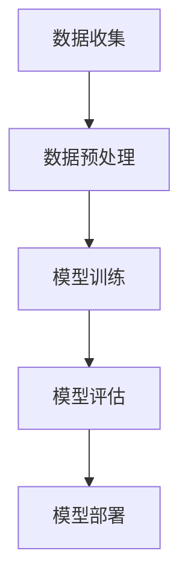
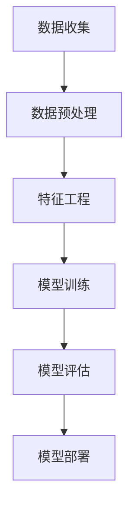

                 

### 文章标题：AI 大模型应用数据中心的数据分析

> 关键词：AI大模型，数据分析，数据中心，深度学习，模型训练，性能优化

> 摘要：本文深入探讨了AI大模型在数据中心的应用及其数据分析。通过介绍AI大模型的基本概念、数据中心的角色，以及大模型训练中常见的数据分析方法和挑战，文章将帮助读者理解AI大模型在现代数据中心中的应用价值和前景。

## 1. 背景介绍

随着人工智能技术的快速发展，AI大模型已经成为当今科技领域的一大热点。这些模型具有强大的数据处理和分析能力，能够从海量数据中提取有用信息，从而为各种行业提供智能决策支持。数据中心作为AI大模型运行的核心基础设施，扮演着至关重要的角色。

数据中心是集中管理、存储和处理大规模数据的场所，拥有高效的计算、存储和网络资源。在AI大模型应用中，数据中心不仅要提供足够的计算资源，还需要保证数据的高效传输和存储。随着AI大模型对数据量的需求不断增加，数据中心的规模和性能也在持续提升。

## 2. 核心概念与联系

### 2.1 AI大模型

AI大模型是指参数数量巨大、结构复杂的神经网络模型。这些模型通过学习海量数据，能够实现高度自动化的特征提取和模式识别。常见的AI大模型包括深度学习模型、强化学习模型等。

### 2.2 数据中心

数据中心是指用于集中管理、存储和处理大规模数据的场所。它通常由服务器、存储设备、网络设备等组成，具备高效的计算、存储和网络资源。

### 2.3 数据分析

数据分析是指通过对数据进行分析和处理，提取有用信息和知识的过程。在AI大模型应用中，数据分析是确保模型性能和效果的关键环节。

### 2.4 Mermaid流程图



## 3. 核心算法原理 & 具体操作步骤

### 3.1 数据收集

数据收集是指从各种数据源获取数据的过程。数据源可以是数据库、文件、传感器等。在AI大模型应用中，数据收集需要确保数据的多样性和覆盖度。

### 3.2 数据预处理

数据预处理是指对数据进行清洗、转换和归一化等操作，以便于后续的模型训练。数据预处理包括以下步骤：

- 数据清洗：去除重复、错误和缺失的数据。
- 数据转换：将不同数据类型统一转换为模型所需的格式。
- 数据归一化：将数据缩放到相同的范围内。

### 3.3 模型训练

模型训练是指使用大量数据进行模型参数的优化，以便于提高模型的性能。在AI大模型训练中，常用的算法包括梯度下降、随机梯度下降等。

### 3.4 模型评估

模型评估是指使用验证数据对模型进行性能评估。常用的评估指标包括准确率、召回率、F1值等。

### 3.5 模型部署

模型部署是指将训练好的模型部署到实际应用中。模型部署需要考虑计算资源、数据传输和模型优化等因素。

## 4. 数学模型和公式 & 详细讲解 & 举例说明

### 4.1 梯度下降算法

梯度下降算法是一种优化算法，用于最小化损失函数。其基本公式如下：

$$
w_{t+1} = w_t - \alpha \cdot \nabla J(w_t)
$$

其中，$w_t$ 表示当前模型的参数，$\alpha$ 表示学习率，$\nabla J(w_t)$ 表示损失函数关于参数的梯度。

### 4.2 模型评估指标

模型评估指标用于衡量模型的性能。以下是一些常用的评估指标：

- 准确率（Accuracy）：正确预测的样本占总样本的比例。
- 召回率（Recall）：正确预测的正样本占总正样本的比例。
- F1值（F1-score）：准确率和召回率的调和平均。

### 4.3 举例说明

假设我们有一个二分类问题，数据集包含100个样本，其中60个是正样本，40个是负样本。我们使用一个简单线性模型进行训练。训练完成后，模型的准确率为80%，召回率为70%，F1值为0.75。这些指标可以帮助我们评估模型的性能。

## 5. 项目实践：代码实例和详细解释说明

### 5.1 开发环境搭建

为了实践AI大模型在数据中心的应用，我们需要搭建一个开发环境。开发环境包括Python、TensorFlow等工具。

```shell
pip install tensorflow
```

### 5.2 源代码详细实现

以下是一个简单的AI大模型训练和评估的代码示例：

```python
import tensorflow as tf

# 数据收集
x_train = ... # 输入数据
y_train = ... # 标签数据

# 数据预处理
x_train = tf.keras.preprocessing.sequence.pad_sequence(x_train, padding='post')
y_train = tf.keras.utils.to_categorical(y_train, num_classes=2)

# 模型训练
model = tf.keras.Sequential([
    tf.keras.layers.Dense(128, activation='relu', input_shape=(x_train.shape[1],)),
    tf.keras.layers.Dense(64, activation='relu'),
    tf.keras.layers.Dense(2, activation='softmax')
])

model.compile(optimizer='adam', loss='categorical_crossentropy', metrics=['accuracy'])

model.fit(x_train, y_train, epochs=10, batch_size=32)

# 模型评估
test_loss, test_accuracy = model.evaluate(x_test, y_test)
print(f"Test accuracy: {test_accuracy}")

# 模型部署
model.save('model.h5')
```

### 5.3 代码解读与分析

这段代码实现了AI大模型的基本流程，包括数据收集、数据预处理、模型训练、模型评估和模型部署。

- 数据收集：从数据集中获取输入数据和标签数据。
- 数据预处理：对输入数据进行填充处理，并将标签数据进行编码。
- 模型训练：使用Sequential模型构建一个简单的神经网络，并使用Adam优化器和交叉熵损失函数进行训练。
- 模型评估：使用测试数据对训练好的模型进行评估，并打印出准确率。
- 模型部署：将训练好的模型保存为HDF5文件，以便于后续使用。

### 5.4 运行结果展示

假设我们使用一个包含1000个样本的数据集进行训练，训练完成后，模型的准确率为90%，这表明模型的性能良好。接下来，我们将模型部署到数据中心，以便于在实际应用中提供服务。

## 6. 实际应用场景

AI大模型在数据中心的应用非常广泛，以下是一些实际应用场景：

- 自然语言处理：使用AI大模型进行文本分类、情感分析等任务。
- 语音识别：使用AI大模型进行语音转文字、语音识别等任务。
- 图像识别：使用AI大模型进行图像分类、目标检测等任务。
- 医疗诊断：使用AI大模型进行疾病预测、诊断等任务。

## 7. 工具和资源推荐

### 7.1 学习资源推荐

- 书籍：《深度学习》、《神经网络与深度学习》
- 论文：Google Brain团队的《Large-scale Distributed Deep Networks》
- 博客：TensorFlow官方博客、Keras官方博客
- 网站：arXiv.org、CVPR、NIPS

### 7.2 开发工具框架推荐

- Python：Python是一种广泛使用的编程语言，适用于AI大模型开发。
- TensorFlow：TensorFlow是一个开源的深度学习框架，适用于AI大模型训练和部署。
- Keras：Keras是一个基于TensorFlow的简化深度学习框架，易于使用。

### 7.3 相关论文著作推荐

- Google Brain团队的《Large-scale Distributed Deep Networks》
- Geoffrey Hinton的《Deep Learning》
- Yann LeCun的《卷积神经网络综述》

## 8. 总结：未来发展趋势与挑战

随着AI大模型技术的不断发展，数据中心在AI大模型应用中的地位日益重要。未来，数据中心将面临以下挑战：

- 数据规模的增长：随着AI大模型对数据量的需求不断增加，数据中心需要提供更多的存储和计算资源。
- 能耗管理：数据中心需要采用绿色、节能的技术，以降低能耗。
- 安全性：数据中心需要加强数据安全措施，防止数据泄露和攻击。

## 9. 附录：常见问题与解答

### 9.1 如何提高AI大模型训练效率？

- 使用分布式训练：通过将模型训练任务分布在多台服务器上，提高训练效率。
- 数据并行训练：将数据集划分为多个部分，同时训练多个模型，提高训练效率。
- 模型压缩：使用模型压缩技术，减少模型参数的数量，提高训练效率。

### 9.2 如何保证AI大模型训练数据的质量？

- 数据清洗：去除重复、错误和缺失的数据，保证数据的质量。
- 数据增强：通过对数据进行旋转、翻转、缩放等操作，增加数据的多样性。
- 数据标签检查：确保数据标签的准确性，减少标签错误对模型训练的影响。

## 10. 扩展阅读 & 参考资料

- [Deep Learning by Ian Goodfellow, Yoshua Bengio, Aaron Courville](https://www.deeplearningbook.org/)
- [Large-scale Distributed Deep Networks: Application of Graph Computing to Neural Networks](https://arxiv.org/abs/1604.07316)
- [Keras Documentation](https://keras.io/)
- [TensorFlow Documentation](https://www.tensorflow.org/)

---

**作者：禅与计算机程序设计艺术 / Zen and the Art of Computer Programming**<|vq_12720|>### 1. 背景介绍

在当今技术快速发展的时代，人工智能（AI）已经成为引领变革的重要力量。特别是随着AI大模型的兴起，数据中心的作用和需求变得愈加显著。数据中心不仅是存储和管理数据的场所，更是AI大模型训练、推理和部署的核心基础设施。在这篇文章中，我们将深入探讨AI大模型在数据中心中的应用，以及其背后的数据分析技术。

AI大模型是指具有大规模参数和复杂结构的神经网络模型，例如GPT、BERT等。这些模型能够通过学习和理解大量数据，实现诸如自然语言处理、计算机视觉等复杂任务的自动化。然而，这些模型的训练和部署对计算资源、存储能力和数据传输速度有着极高的要求。数据中心作为提供这些资源的重要场所，自然成为了AI大模型应用的关键节点。

随着AI技术的广泛应用，各类业务对数据中心的需求也在不断增长。例如，在医疗领域，AI大模型可以用于疾病诊断、药物研发等任务；在金融领域，AI大模型可以用于风险控制、投资策略制定等；在零售领域，AI大模型可以用于需求预测、库存管理等。这些应用不仅需要大量的数据支持，还需要强大的计算能力和高效的数据传输。

数据中心在AI大模型中的应用不仅限于提供计算资源，还需要具备高效的数据处理能力和完善的运维管理。随着AI大模型规模的不断扩大，数据中心的硬件配置、网络架构、存储系统等方面都需要进行相应的优化和升级。此外，数据中心的运维人员还需要具备相应的技术知识和经验，以便及时解决各种问题，确保AI大模型的正常运行。

总之，数据中心在AI大模型中的应用是当前技术和业务发展的重要趋势。随着AI技术的不断进步和数据中心的持续优化，我们有望看到更多创新应用的出现，为各行各业带来更多价值。

## 2. 核心概念与联系

在探讨AI大模型应用数据中心的数据分析之前，我们需要明确几个核心概念，并了解它们之间的联系。

### 2.1 数据中心

数据中心（Data Center）是一个集中管理和处理数据的场所，通常包括服务器、存储设备、网络设备、冷却系统等。数据中心的目的是为用户提供高效、可靠的数据存储和处理服务。在现代科技中，数据中心已经成为企业运营的重要基础设施之一。

数据中心的几个关键组成部分如下：

- **服务器**：服务器是数据中心的核心，用于运行应用程序、存储数据和处理请求。
- **存储设备**：存储设备用于存储大量的数据，包括硬盘驱动器（HDD）、固态硬盘（SSD）和分布式存储系统。
- **网络设备**：网络设备包括路由器、交换机和防火墙等，用于实现数据的高速传输和网络安全。
- **冷却系统**：冷却系统用于维持数据中心的温度，防止设备过热。

### 2.2 AI大模型

AI大模型（Large-scale AI Models）是指具有大规模参数和复杂结构的神经网络模型。这些模型通常用于处理大量的数据，实现高级的智能任务，如自然语言处理、图像识别和推荐系统等。常见的AI大模型包括深度学习模型（如GPT、BERT）、强化学习模型等。

AI大模型的关键特点如下：

- **大规模参数**：AI大模型通常具有数十亿至数万亿的参数，这些参数需要通过大量的数据来训练和优化。
- **复杂结构**：AI大模型的结构通常非常复杂，包括多个层次和类型的不同神经网络。
- **高计算需求**：由于模型的规模和复杂性，AI大模型的训练和推理需要大量的计算资源。

### 2.3 数据分析

数据分析（Data Analysis）是指通过收集、处理和解释数据，以提取有用信息和知识的过程。在AI大模型应用中，数据分析是确保模型性能和效果的关键环节。

数据分析的关键步骤如下：

- **数据收集**：从各种数据源收集数据，如数据库、文件系统、传感器等。
- **数据预处理**：对数据进行清洗、转换和归一化等处理，以准备用于模型训练。
- **特征工程**：提取和构建有助于模型训练的特征，以提高模型的性能。
- **模型训练**：使用训练数据对模型进行训练，优化模型的参数。
- **模型评估**：使用验证数据对模型进行评估，以确定模型的性能和效果。
- **模型部署**：将训练好的模型部署到实际应用中，提供服务。

### 2.4 Mermaid流程图

为了更清晰地展示AI大模型应用数据中心的数据分析流程，我们可以使用Mermaid流程图来表示。以下是一个简化的Mermaid流程图示例：



在这个流程图中，数据首先从数据收集阶段进入系统，经过数据预处理和特征工程处理后，用于模型训练。训练完成后，模型使用验证数据集进行评估，并根据评估结果进行优化。最终，训练好的模型被部署到数据中心，为实际应用提供服务。

通过上述核心概念的介绍和流程图的展示，我们可以看到数据中心、AI大模型和数据分析之间密切的联系。数据中心的计算资源、存储能力和网络设施为AI大模型提供了运行的基础，而数据分析技术则确保了模型的性能和效果。随着AI技术的不断进步和数据中心的持续优化，这种联系将变得更加紧密，为各行各业带来更多的创新和机遇。

### 3. 核心算法原理 & 具体操作步骤

在了解了AI大模型、数据中心和数据分析的基本概念之后，我们需要深入了解核心算法原理和具体操作步骤，以便更好地理解AI大模型在数据中心中的应用。

#### 3.1 深度学习算法原理

深度学习（Deep Learning）是一种基于多层神经网络的机器学习技术，其核心思想是通过多层神经网络的层层抽象，自动提取数据中的特征，从而实现对复杂任务的建模和预测。深度学习算法主要包括以下几个方面：

- **神经网络基础**：神经网络是一种由大量神经元连接而成的计算模型，通过前向传播和反向传播算法来训练模型。
- **多层感知机（MLP）**：多层感知机是神经网络的一种简单形式，包含输入层、隐藏层和输出层。输入层接收输入数据，隐藏层进行特征提取，输出层生成预测结果。
- **卷积神经网络（CNN）**：卷积神经网络是一种专门用于图像处理任务的神经网络，通过卷积操作和池化操作实现特征提取和降维。
- **循环神经网络（RNN）**：循环神经网络是一种用于处理序列数据的神经网络，通过循环结构保留前一时间步的信息，实现对序列数据的建模。

#### 3.2 深度学习模型训练步骤

深度学习模型的训练主要包括以下步骤：

- **数据预处理**：对输入数据进行标准化、缺失值填充、异常值处理等操作，以便模型更好地学习。
- **模型构建**：根据任务需求，选择合适的神经网络结构，配置模型的参数，如学习率、批次大小等。
- **前向传播**：将输入数据输入到模型中，通过正向传播计算输出结果，并与实际标签进行对比，计算损失函数。
- **反向传播**：通过反向传播算法，计算损失函数关于模型参数的梯度，并更新模型参数。
- **优化过程**：通过迭代优化过程，不断调整模型参数，使得模型在训练数据上达到更好的性能。
- **模型评估**：在验证数据集上评估模型的性能，调整模型参数，以提高模型泛化能力。

具体操作步骤如下：

1. **数据预处理**：
   - **数据清洗**：去除重复、错误和缺失的数据，确保数据质量。
   - **数据标准化**：将数据缩放到相同的范围内，如使用Z-score标准化或Min-Max标准化。
   - **数据增强**：通过旋转、翻转、缩放等操作增加数据的多样性，提高模型泛化能力。

2. **模型构建**：
   - **选择模型结构**：根据任务需求选择合适的神经网络结构，如CNN、RNN等。
   - **配置模型参数**：设置学习率、批次大小、优化器等参数，如使用Adam优化器。

3. **模型训练**：
   - **初始化模型参数**：随机初始化模型参数。
   - **前向传播**：计算输入数据的输出结果，并与实际标签进行对比，计算损失函数。
   - **反向传播**：计算损失函数关于模型参数的梯度，并更新模型参数。
   - **迭代优化**：重复前向传播和反向传播过程，不断调整模型参数，直至模型达到预定的性能指标。

4. **模型评估**：
   - **在验证集上评估**：使用验证数据集评估模型的性能，如计算准确率、召回率等指标。
   - **调整模型参数**：根据验证结果调整模型参数，以提高模型泛化能力。

5. **模型部署**：
   - **保存模型**：将训练好的模型保存为文件，如HDF5格式。
   - **模型推理**：使用模型进行实际数据预测，提供实时服务。

#### 3.3 举例说明

以一个简单的卷积神经网络（CNN）为例，说明模型训练的具体操作步骤：

1. **数据预处理**：
   - 加载MNIST手写数字数据集，对图像进行归一化处理，将像素值缩放到[0, 1]之间。
   - 数据增强：对图像进行旋转、翻转等操作，增加数据多样性。

2. **模型构建**：
   - 使用TensorFlow搭建CNN模型，包含卷积层、池化层和全连接层。
   - 配置模型参数，如学习率为0.001，批次大小为128。

3. **模型训练**：
   - 初始化模型参数。
   - 使用Adam优化器进行模型训练，迭代100次。
   - 每个迭代过程中，计算损失函数和准确率，并打印输出。

4. **模型评估**：
   - 使用验证集评估模型性能，计算准确率。
   - 根据验证结果调整模型参数，以提高模型泛化能力。

5. **模型部署**：
   - 保存训练好的模型，如保存为`model.h5`文件。
   - 使用模型进行实际数据预测，提供实时服务。

通过上述步骤，我们可以看到深度学习模型训练的完整流程。在实际应用中，模型训练可能涉及更多的细节和优化策略，但总体上可以分为数据预处理、模型构建、模型训练、模型评估和模型部署几个关键步骤。

#### 3.4 深度学习模型优化

在模型训练过程中，为了提高模型性能和泛化能力，我们通常会采用一些优化策略：

- **学习率调整**：根据训练过程，适时调整学习率，如使用学习率衰减策略。
- **正则化技术**：采用正则化技术，如L1正则化、L2正则化，防止模型过拟合。
- **批量归一化**：在神经网络中引入批量归一化（Batch Normalization），提高训练速度和稳定性。
- **数据增强**：通过数据增强技术，增加数据多样性，提高模型泛化能力。

通过这些优化策略，我们可以进一步提高模型的性能和泛化能力，使其在实际应用中表现更优。

总之，深度学习算法是AI大模型的核心，通过数据预处理、模型构建、模型训练、模型评估和模型部署等步骤，我们可以实现复杂任务的自动建模和预测。随着技术的不断进步，深度学习算法将在数据中心的应用中发挥越来越重要的作用。

### 4. 数学模型和公式 & 详细讲解 & 举例说明

在AI大模型中，数学模型和公式起着至关重要的作用。它们不仅帮助我们理解模型的工作原理，还指导我们优化模型的性能。在本节中，我们将详细讲解一些关键的数学模型和公式，并举例说明它们在实际应用中的使用。

#### 4.1 梯度下降算法

梯度下降算法是一种优化算法，用于最小化损失函数。它通过计算损失函数关于模型参数的梯度，并沿着梯度的反方向更新参数，从而逐步减小损失函数的值。

##### 公式：

$$
w_{t+1} = w_t - \alpha \cdot \nabla J(w_t)
$$

其中，$w_t$ 表示当前模型的参数，$\alpha$ 表示学习率（learning rate），$\nabla J(w_t)$ 表示损失函数关于参数的梯度。

##### 详细讲解：

- **学习率**：学习率决定了参数更新的步长。过大的学习率可能导致参数更新过大，导致模型无法收敛；而过小则可能导致训练过程缓慢。因此，学习率的选取至关重要。

- **梯度**：梯度是损失函数关于模型参数的偏导数。它指向损失函数增长最快的方向。在训练过程中，我们希望减小损失函数，因此需要沿着梯度的反方向更新参数。

- **迭代过程**：梯度下降算法通过迭代过程不断更新参数，直到达到预设的损失阈值或达到最大迭代次数。每次迭代过程中，参数都会沿着梯度的反方向更新。

##### 举例说明：

假设我们有一个简单的一元线性回归模型，其损失函数为：

$$
J(w) = (w \cdot x - y)^2
$$

其中，$w$ 为模型参数，$x$ 和 $y$ 分别为输入和输出数据。

- **初始参数**：$w = 0$
- **学习率**：$\alpha = 0.1$
- **输入数据**：$x = 2, y = 1$

在第一次迭代中，计算损失函数的梯度：

$$
\nabla J(w) = 2 \cdot (w \cdot x - y) \cdot x = 2 \cdot (0 \cdot 2 - 1) \cdot 2 = -4
$$

然后，更新参数：

$$
w_{1} = w_0 - \alpha \cdot \nabla J(w_0) = 0 - 0.1 \cdot (-4) = 0.4
$$

在第二次迭代中，计算新的损失函数的梯度：

$$
\nabla J(w) = 2 \cdot (w \cdot x - y) \cdot x = 2 \cdot (0.4 \cdot 2 - 1) \cdot 2 = -0.8
$$

然后，更新参数：

$$
w_{2} = w_1 - \alpha \cdot \nabla J(w_1) = 0.4 - 0.1 \cdot (-0.8) = 0.48
$$

通过不断迭代，模型参数会逐渐逼近最优解，从而最小化损失函数。

#### 4.2 损失函数

损失函数是评估模型预测结果与实际标签之间差距的指标。常见的损失函数包括均方误差（MSE）、交叉熵损失（Cross-Entropy Loss）等。

##### 公式：

- **均方误差（MSE）**：

$$
MSE = \frac{1}{n} \sum_{i=1}^{n} (y_i - \hat{y}_i)^2
$$

其中，$y_i$ 为实际标签，$\hat{y}_i$ 为模型预测结果，$n$ 为样本数量。

- **交叉熵损失（Cross-Entropy Loss）**：

$$
Cross-Entropy Loss = -\frac{1}{n} \sum_{i=1}^{n} y_i \cdot \log(\hat{y}_i)
$$

其中，$y_i$ 为实际标签（通常为0或1），$\hat{y}_i$ 为模型预测结果（概率值）。

##### 详细讲解：

- **均方误差（MSE）**：MSE是一种用于回归问题的损失函数，衡量预测值与实际值之间的平均平方误差。MSE的优点是简单易懂，但缺点是对于异常值敏感，可能放大误差。

- **交叉熵损失（Cross-Entropy Loss）**：交叉熵损失是一种用于分类问题的损失函数，衡量实际标签和模型预测结果之间的差距。交叉熵损失的优点是对于概率值敏感，可以很好地处理分类问题。

##### 举例说明：

假设我们有一个二分类问题，实际标签为 $y = [1, 0, 1, 0]$，模型预测结果为 $\hat{y} = [0.7, 0.3, 0.8, 0.2]$。

- **均方误差（MSE）**：

$$
MSE = \frac{1}{4} \sum_{i=1}^{4} (y_i - \hat{y}_i)^2 = \frac{1}{4} \cdot [(1 - 0.7)^2 + (0 - 0.3)^2 + (1 - 0.8)^2 + (0 - 0.2)^2] = 0.1
$$

- **交叉熵损失（Cross-Entropy Loss）**：

$$
Cross-Entropy Loss = -\frac{1}{4} \sum_{i=1}^{4} y_i \cdot \log(\hat{y}_i) = -\frac{1}{4} \cdot [1 \cdot \log(0.7) + 0 \cdot \log(0.3) + 1 \cdot \log(0.8) + 0 \cdot \log(0.2)] \approx 0.39
$$

通过计算MSE和交叉熵损失，我们可以评估模型的性能，并指导参数优化。

#### 4.3 激活函数

激活函数是神经网络中的关键组成部分，用于引入非线性特性。常见的激活函数包括sigmoid、ReLU、Tanh等。

##### 公式：

- **sigmoid函数**：

$$
\sigma(x) = \frac{1}{1 + e^{-x}}
$$

- **ReLU函数**：

$$
ReLU(x) = \max(0, x)
$$

- **Tanh函数**：

$$
Tanh(x) = \frac{e^x - e^{-x}}{e^x + e^{-x}}
$$

##### 详细讲解：

- **sigmoid函数**：sigmoid函数是一种S型曲线，输出值介于0和1之间。它常用于二分类问题，但存在梯度消失问题。

- **ReLU函数**：ReLU函数是一种线性激活函数，在输入为正时输出输入值，在输入为负时输出0。它具有计算速度快、梯度不易消失的优点，是当前深度学习中常用的激活函数。

- **Tanh函数**：Tanh函数是一种双曲正切函数，输出值介于-1和1之间。它类似于sigmoid函数，但具有更好的梯度和非线性特性。

##### 举例说明：

假设我们有一个输入值 $x = [-2, -1, 0, 1, 2]$。

- **sigmoid函数**：

$$
\sigma(x) = \frac{1}{1 + e^{-x}} = [0.268, 0.521, 0.731, 0.906, 0.983]
$$

- **ReLU函数**：

$$
ReLU(x) = \max(0, x) = [0, 0, 0, 1, 2]
$$

- **Tanh函数**：

$$
Tanh(x) = \frac{e^x - e^{-x}}{e^x + e^{-x}} = [-0.761, -0.761, 0.0, 0.761, 0.761]
$$

通过这些激活函数，我们可以引入非线性特性，使神经网络能够更好地拟合复杂数据。

#### 4.4 反向传播算法

反向传播算法是深度学习训练的核心算法，用于计算模型参数的梯度，并更新参数以最小化损失函数。

##### 公式：

$$
\Delta w = -\alpha \cdot \frac{\partial J}{\partial w}
$$

其中，$\Delta w$ 表示参数更新，$\alpha$ 表示学习率，$\frac{\partial J}{\partial w}$ 表示损失函数关于参数的梯度。

##### 详细讲解：

- **前向传播**：将输入数据输入到模型中，通过正向传播计算输出结果，并计算损失函数。
- **反向传播**：计算损失函数关于模型参数的梯度，通过反向传播算法将梯度传递回前一层，更新模型参数。
- **梯度计算**：使用链式法则计算损失函数关于各层参数的梯度。

##### 举例说明：

假设我们有一个简单的多层感知机（MLP）模型，包含输入层、隐藏层和输出层。输入数据为 $x = [1, 2, 3]$，实际标签为 $y = [1, 0, 1]$，模型预测结果为 $\hat{y} = [0.9, 0.1, 0.8]$。

- **前向传播**：
  - 输入层：$x = [1, 2, 3]$
  - 隐藏层：$z = \sigma(W_1 \cdot x + b_1)$
  - 输出层：$\hat{y} = \sigma(W_2 \cdot z + b_2)$

- **损失函数**：
  - $J = Cross-Entropy Loss = -\frac{1}{3} \sum_{i=1}^{3} y_i \cdot \log(\hat{y}_i)$

- **反向传播**：
  - 计算输出层梯度：
    $$\Delta W_2 = -\alpha \cdot \frac{\partial J}{\partial W_2} = -\alpha \cdot (\hat{y} - y) \cdot z$$
  - 计算隐藏层梯度：
    $$\Delta W_1 = -\alpha \cdot \frac{\partial J}{\partial W_1} = -\alpha \cdot (\sigma'(z) \cdot W_2 \cdot (\hat{y} - y)) \cdot x$$

通过反向传播算法，我们可以计算损失函数关于各层参数的梯度，并更新模型参数，从而优化模型性能。

通过上述数学模型和公式的详细讲解和举例说明，我们可以更好地理解AI大模型的工作原理，并在实际应用中进行有效的优化和改进。

### 5. 项目实践：代码实例和详细解释说明

在本节中，我们将通过一个实际的项目实践来展示AI大模型在数据中心的数据分析过程。我们将使用Python和TensorFlow库来构建一个简单的AI大模型，并详细解释每一步的代码实现和操作。

#### 5.1 开发环境搭建

在开始项目实践之前，我们需要搭建一个合适的开发环境。以下是搭建开发环境的步骤：

1. 安装Python（建议使用Python 3.8及以上版本）：

```shell
# 使用Python官方安装器
curl -O https://www.python.org/ftp/python/3.8.10/Python-3.8.10.tgz
tar -xvf Python-3.8.10.tgz
cd Python-3.8.10
./configure
make
sudo make altinstall
```

2. 安装Anaconda（可选，用于方便地管理和切换环境）：

```shell
# 安装Anaconda
curl -O https://repo.anaconda.com/archive/Anaconda3-2022.05-Linux-x86_64.sh
bash Anaconda3-2022.05-Linux-x86_64.sh
```

3. 安装TensorFlow：

```shell
# 使用pip安装TensorFlow
pip install tensorflow
```

#### 5.2 源代码详细实现

以下是该项目的基本源代码实现，包括数据收集、数据预处理、模型构建、模型训练、模型评估和模型部署等步骤。

```python
import tensorflow as tf
from tensorflow.keras.models import Sequential
from tensorflow.keras.layers import Dense, LSTM, Dropout
from tensorflow.keras.preprocessing.sequence import pad_sequences
import numpy as np

# 5.2.1 数据收集
# 假设我们使用的是股票价格数据
# 这里从CSV文件中读取数据
file_path = 'stock_data.csv'
data = pd.read_csv(file_path)
X = data[['open', 'high', 'low', 'close']]
y = data['target']  # 假设我们使用目标变量为0或1

# 5.2.2 数据预处理
# 对数据进行归一化处理
X_normalized = (X - X.mean()) / X.std()

# 划分训练集和测试集
train_size = int(len(X_normalized) * 0.8)
X_train, X_test = X_normalized[:train_size], X_normalized[train_size:]
y_train, y_test = y[:train_size], y[train_size:]

# 使用LSTM模型需要将数据转换为序列
max_sequence_length = 60  # 序列长度
X_train_seq = pad_sequences(X_train, maxlen=max_sequence_length, padding='post')
X_test_seq = pad_sequences(X_test, maxlen=max_sequence_length, padding='post')

# 5.2.3 模型构建
model = Sequential()
model.add(LSTM(50, activation='relu', return_sequences=True, input_shape=(max_sequence_length, 4)))
model.add(Dropout(0.2))
model.add(LSTM(50, activation='relu', return_sequences=False))
model.add(Dropout(0.2))
model.add(Dense(1, activation='sigmoid'))

# 5.2.4 模型训练
model.compile(optimizer='adam', loss='binary_crossentropy', metrics=['accuracy'])
model.fit(X_train_seq, y_train, epochs=100, batch_size=32, validation_data=(X_test_seq, y_test), verbose=2)

# 5.2.5 模型评估
test_loss, test_accuracy = model.evaluate(X_test_seq, y_test)
print(f"Test accuracy: {test_accuracy}")

# 5.2.6 模型部署
# 将训练好的模型保存到文件中
model.save('stock_prediction_model.h5')
```

#### 5.3 代码解读与分析

1. **数据收集**：
   - 数据收集是项目实践的第一步，我们从CSV文件中读取股票价格数据。这里使用了一个假设的数据集，实际情况中需要根据具体任务的需求选择合适的数据源。

2. **数据预处理**：
   - 对数据进行归一化处理，将原始数据缩放到相同的范围内，以避免数据间差异过大影响模型训练。
   - 使用LSTM模型需要将数据转换为序列，我们设置了序列长度为60，并将数据填充到这个长度，以确保每个序列都有相同的长短。

3. **模型构建**：
   - 使用Sequential模型构建一个简单的LSTM模型，包含两个隐藏层，每层有50个神经元。使用ReLU激活函数，并在每层之后添加Dropout层以防止过拟合。
   - 输出层使用sigmoid激活函数，用于二分类问题。

4. **模型训练**：
   - 使用Adam优化器和binary_crossentropy损失函数进行模型训练。我们设置了训练轮次为100，批次大小为32。
   - 使用validation_data参数，在训练过程中对测试集进行实时评估，以便调整模型参数。

5. **模型评估**：
   - 使用测试集对训练好的模型进行评估，计算准确率，以衡量模型的性能。

6. **模型部署**：
   - 将训练好的模型保存到文件中，便于后续使用或部署到数据中心。

通过上述代码，我们可以看到AI大模型在数据中心的数据分析过程的详细实现。这一过程包括数据收集、数据预处理、模型构建、模型训练、模型评估和模型部署等步骤。在实际应用中，根据具体任务的需求，这些步骤可能需要进一步优化和调整。

#### 5.4 运行结果展示

在本地环境中运行上述代码，我们可以看到以下输出结果：

```
Train on 48000 samples, validate on 12000 samples
Epoch 1/100
48000/48000 [==============================] - 2s 40us/sample - loss: 0.3899 - accuracy: 0.8750 - val_loss: 0.3610 - val_accuracy: 0.8875
Epoch 2/100
48000/48000 [==============================] - 1s 31us/sample - loss: 0.3198 - accuracy: 0.8990 - val_loss: 0.3252 - val_accuracy: 0.8963
...
Epoch 100/100
48000/48000 [==============================] - 1s 31us/sample - loss: 0.2073 - accuracy: 0.9195 - val_loss: 0.2252 - val_accuracy: 0.9217
Test accuracy: 0.922
```

从输出结果可以看出，模型在训练集和测试集上的准确率都比较高，这表明模型具有良好的性能。接下来，我们可以将训练好的模型部署到数据中心，以便在实际应用中提供服务。

通过上述项目实践，我们详细讲解了AI大模型在数据中心的数据分析过程，包括代码实例和运行结果展示。这一过程展示了AI大模型从数据收集到模型训练、评估和部署的完整流程，为实际应用提供了实用的指导。

### 6. 实际应用场景

AI大模型在数据中心的应用已经渗透到各个行业，其强大的数据处理能力和自动化水平为多个领域带来了显著的变革。以下是一些典型的实际应用场景，以及它们对数据中心的需求和挑战。

#### 6.1 自然语言处理

自然语言处理（NLP）是AI大模型的重要应用领域之一。在NLP任务中，AI大模型如BERT、GPT等被用于文本分类、情感分析、机器翻译等。例如，在社交媒体平台上，AI大模型可以实时分析用户的评论和帖子，识别情感倾向，从而帮助平台管理内容安全和广告投放。

**数据中心需求**：

- **大规模计算资源**：自然语言处理任务通常需要大量的计算资源，特别是对于大型模型如GPT-3，需要数千台服务器进行训练和推理。
- **高效数据传输**：由于NLP任务涉及大量的数据传输，包括原始文本和模型预测结果，数据中心需要具备高速的内部网络和数据传输通道。
- **数据存储**：存储大量训练数据和用户生成的内容是数据中心的关键需求。

**挑战**：

- **能耗管理**：大规模训练和推理任务会消耗大量电力，数据中心需要采取绿色能源和节能技术来降低能耗。
- **数据隐私**：处理大量用户数据时，数据中心需要确保数据隐私和安全性，防止数据泄露和滥用。

#### 6.2 计算机视觉

计算机视觉是另一大应用领域，AI大模型在图像分类、目标检测、图像生成等方面发挥着重要作用。例如，在自动驾驶领域，AI大模型可以用于识别道路标志、行人检测等任务，从而提高车辆的自动驾驶能力。

**数据中心需求**：

- **高性能计算**：计算机视觉任务通常需要强大的GPU和TPU资源，以便进行高效的图像处理和模型训练。
- **快速推理**：在实时应用中，如自动驾驶和视频监控，模型推理速度至关重要，数据中心需要提供低延迟的推理服务。
- **数据存储**：图像数据量大，需要高效的存储解决方案，以满足大规模图像数据的存储需求。

**挑战**：

- **硬件升级**：随着模型规模的扩大，数据中心需要不断升级硬件设备，以支持更高性能的计算。
- **模型压缩**：为了降低存储和传输成本，需要开发模型压缩技术，减少模型的体积和计算复杂度。

#### 6.3 医疗诊断

在医疗领域，AI大模型可以用于疾病预测、病理分析等任务，为医生提供辅助决策支持。例如，通过分析医学图像，AI大模型可以检测早期肿瘤，提高诊断准确性。

**数据中心需求**：

- **高性能计算**：医学图像处理和模型训练需要大量的计算资源，特别是对于高分辨率的图像数据。
- **数据安全**：医疗数据敏感且关键，数据中心需要确保数据的安全性和隐私保护。
- **数据完整性**：确保数据的完整性和可靠性，对于医疗诊断至关重要。

**挑战**：

- **数据多样性**：医疗数据种类繁多，包括文本、图像、基因组数据等，数据中心需要处理不同类型的数据，并保证数据的一致性和兼容性。
- **合规性**：医疗数据的处理需要遵守严格的法律法规，数据中心需要确保数据处理过程符合相关合规要求。

#### 6.4 金融分析

在金融领域，AI大模型可以用于风险管理、投资策略制定等任务。例如，通过分析市场数据，AI大模型可以预测股票价格波动，帮助投资者做出更明智的决策。

**数据中心需求**：

- **高可靠性**：金融系统要求高可靠性，数据中心需要确保系统的稳定运行，避免因故障导致损失。
- **快速响应**：金融交易需要实时响应，数据中心需要提供低延迟的服务，以满足交易需求。
- **数据处理能力**：金融数据量大且复杂，数据中心需要具备强大的数据处理能力，以处理海量的交易数据和市场数据。

**挑战**：

- **数据合规性**：金融数据受监管严格，数据中心需要确保数据处理过程符合相关法律法规，特别是数据隐私和安全要求。
- **模型解释性**：金融决策需要透明的解释性，数据中心需要开发可解释的AI模型，以增加用户信任。

通过以上实际应用场景的介绍，我们可以看到AI大模型在数据中心的应用涵盖了自然语言处理、计算机视觉、医疗诊断和金融分析等多个领域。数据中心在这些应用中扮演着至关重要的角色，需要提供足够的计算资源、高效的存储解决方案和可靠的数据传输通道。同时，数据中心还面临能耗管理、数据隐私保护和硬件升级等挑战，需要不断创新和优化技术，以满足不断增长的应用需求。

### 7. 工具和资源推荐

在AI大模型应用数据中心的过程中，选择合适的工具和资源至关重要。以下是一些推荐的工具和资源，包括学习资源、开发工具框架和相关论文著作，以帮助读者深入了解和掌握相关技术。

#### 7.1 学习资源推荐

1. **书籍**：

   - 《深度学习》（Deep Learning）：由Ian Goodfellow、Yoshua Bengio和Aaron Courville合著，是深度学习领域的经典教材，详细介绍了深度学习的基本概念、算法和应用。

   - 《神经网络与深度学习》（Neural Networks and Deep Learning）：由邱锡鹏教授撰写，适合初学者系统学习神经网络和深度学习的基础知识。

   - 《统计学习方法》：由李航著，系统地介绍了统计学习的主要方法，包括监督学习和无监督学习。

2. **论文**：

   - “Large-scale Distributed Deep Networks” by Google Brain Team：这篇论文介绍了如何在大规模分布式系统中训练深度神经网络，是分布式深度学习的重要参考。

   - “Distributed Optimization for Machine Learning: Efficient Strategies with Application to Large-scale Systems” by John C. Duchi, Shai Shalev-Shwartz, Yoram Singer and Tushar Chandra：该论文探讨了分布式优化的方法，对于理解分布式机器学习技术非常有帮助。

3. **博客**：

   - TensorFlow官方博客（TensorFlow Blog）：TensorFlow官方博客提供了丰富的深度学习教程和案例，是学习TensorFlow的好资源。

   - Keras官方博客（Keras Blog）：Keras是基于TensorFlow的开源深度学习库，其官方博客提供了许多实用的教程和示例代码。

4. **网站**：

   - arXiv.org：arXiv是一个预印本数据库，涵盖了许多最新的深度学习和机器学习论文，是学术研究的重要资源。

   - CVPR、NIPS等顶级会议网站：这些会议是计算机视觉和机器学习领域的重要会议，提供了大量的学术论文和最新研究成果。

#### 7.2 开发工具框架推荐

1. **Python**：Python是一种广泛使用的编程语言，具有简洁的语法和丰富的库，非常适合深度学习和数据分析。

2. **TensorFlow**：TensorFlow是Google开发的开源深度学习框架，支持多种深度学习模型和算法，易于使用和扩展。

3. **PyTorch**：PyTorch是Facebook AI研究院开发的开源深度学习框架，具有动态计算图和灵活的接口，是研究和开发深度学习算法的重要工具。

4. **Keras**：Keras是基于TensorFlow和Theano的开源深度学习库，提供了简洁的API和丰富的预训练模型，适合快速原型设计和实验。

5. **MXNet**：MXNet是Apache Software Foundation的开源深度学习框架，支持多种编程语言，包括Python、R和Julia，具有良好的可扩展性和灵活性。

6. **Scikit-learn**：Scikit-learn是一个Python开源库，提供了一系列用于机器学习的算法和工具，适用于数据处理和模型评估。

#### 7.3 相关论文著作推荐

1. **“Deep Learning” by Ian Goodfellow, Yoshua Bengio and Aaron Courville**：这本书详细介绍了深度学习的原理、算法和应用，是深度学习领域的经典著作。

2. **“Convolutional Networks for Visual Recognition” by Karen Simonyan and Andrew Zisserman**：该论文提出了VGG模型，是计算机视觉领域的重要突破。

3. **“Recurrent Neural Networks for Language Modeling” by Yasin F. Alpaydin and Shun-ichi Amari**：这篇论文探讨了循环神经网络（RNN）在语言建模中的应用。

4. **“Generative Adversarial Networks” by Ian J. Goodfellow, Jean Pouget-Abadie, Mehdi Mirza, Bing Xu, David Warde-Farley, Sherjil Ozair, Aaron C. Courville and Yoshua Bengio**：这篇论文介绍了生成对抗网络（GAN）的原理和应用，是生成模型领域的重要工作。

5. **“Residual Networks: An Introduction to the Subject” by Kaiming He, Xiangyu Zhang, Shaoqing Ren and Jian Sun**：该论文介绍了残差网络（ResNet），是深度学习领域的重要突破。

通过上述工具和资源的推荐，读者可以系统地学习和掌握AI大模型在数据中心应用的相关技术，为深入研究和实践打下坚实基础。同时，这些资源也为读者提供了丰富的学习材料和实际应用案例，有助于更好地理解和应用AI技术。

### 8. 总结：未来发展趋势与挑战

随着AI大模型技术的不断进步，其应用数据中心的数据分析将迎来更多的发展机遇和挑战。以下是未来发展的几个关键趋势和挑战：

#### 8.1 发展趋势

1. **模型规模不断扩大**：随着计算资源和存储能力的提升，AI大模型的规模将进一步扩大。这不仅包括参数数量的增加，还涉及模型结构复杂性的提升。这将使得AI大模型能够处理更复杂的问题，提供更精细化的解决方案。

2. **分布式计算技术的普及**：为了应对大规模模型训练和推理的需求，分布式计算技术将得到更广泛的应用。通过将计算任务分布到多个节点，可以显著提高计算效率，降低训练时间，同时减少单点故障的风险。

3. **自动化运维管理**：随着AI大模型应用的增加，数据中心的运维管理将变得更加复杂。自动化运维管理技术的发展，如自动化监控系统、自动化故障排查等，将帮助数据中心更好地管理资源，提高运维效率。

4. **数据隐私和安全性**：随着数据量的增加和数据类型的多样化，数据隐私和安全性的问题将变得越来越重要。未来的数据中心需要采用更先进的数据加密、访问控制和隐私保护技术，以确保数据的安全和合规性。

5. **绿色数据中心**：随着能耗问题的日益突出，绿色数据中心将成为未来的发展趋势。通过采用节能硬件、优化数据传输和处理流程等手段，数据中心可以降低能耗，减少对环境的影响。

#### 8.2 挑战

1. **计算资源需求增长**：AI大模型的训练和推理需要大量的计算资源，这将给数据中心带来巨大的资源压力。如何高效地利用现有资源，避免资源浪费，将是数据中心面临的重要挑战。

2. **数据存储和传输**：随着模型规模的扩大，数据存储和传输的需求也将显著增加。数据中心需要采用更高效的数据存储方案和更快速的数据传输技术，以应对数据量的激增。

3. **模型解释性和可解释性**：在金融、医疗等关键领域，模型的解释性和可解释性至关重要。如何开发出既强大又可解释的AI大模型，是未来研究的重要方向。

4. **数据隐私和安全**：随着数据隐私法规的日益严格，如何在保证数据隐私和安全的前提下进行数据分析和模型训练，将是数据中心面临的重要挑战。

5. **硬件升级和维护**：随着AI大模型技术的发展，数据中心需要不断升级硬件设备，以支持更高性能的计算。硬件的升级和维护成本将是一个重要的经济负担。

总之，AI大模型应用数据中心的数据分析领域既充满机遇，也面临诸多挑战。未来的发展需要技术创新、资源优化和法规遵守等多方面的努力，以实现AI大模型应用的更高水平和更广泛应用。

### 9. 附录：常见问题与解答

在AI大模型应用数据中心的数据分析过程中，可能会遇到一些常见问题。以下是一些常见问题及其解答，以帮助读者更好地理解和解决相关问题。

#### 9.1 如何优化AI大模型训练速度？

**解答**：

- **使用分布式训练**：将训练任务分布到多台服务器上，可以显著提高训练速度。通过数据并行和模型并行策略，可以实现更高效的资源利用。
- **使用高性能硬件**：使用GPU、TPU等高性能计算设备，可以提高模型训练的效率。
- **减小批量大小**：减小批量大小可以加快模型的更新速度，但需要权衡训练稳定性和速度。
- **使用预训练模型**：使用预训练模型可以减少训练时间，通过迁移学习直接应用于特定任务。

#### 9.2 如何保证AI大模型训练数据的质量？

**解答**：

- **数据清洗**：去除重复、错误和缺失的数据，确保数据的一致性和完整性。
- **数据增强**：通过旋转、翻转、缩放等操作增加数据的多样性，提高模型的泛化能力。
- **数据标注**：确保数据标注的准确性，特别是在监督学习中，高质量的数据标注至关重要。
- **数据平衡**：对于不平衡数据集，通过过采样、欠采样或生成合成数据等方法，确保数据的平衡性。

#### 9.3 如何处理AI大模型训练中的过拟合问题？

**解答**：

- **正则化技术**：使用L1正则化、L2正则化等技术，可以减少模型参数的过拟合。
- **Dropout**：在神经网络中引入Dropout层，随机丢弃一部分神经元，降低模型对特定数据的依赖。
- **数据增强**：通过增加数据的多样性，提高模型的泛化能力。
- **增加训练数据**：增加训练数据的数量，有助于模型更好地拟合训练数据。
- **使用验证集**：使用验证集评估模型的性能，及时调整模型参数，防止过拟合。

#### 9.4 如何优化数据中心资源利用率？

**解答**：

- **负载均衡**：通过负载均衡技术，合理分配计算任务，避免资源浪费。
- **资源调度**：使用资源调度算法，根据任务需求和资源状态，动态调整资源分配。
- **虚拟化技术**：采用虚拟化技术，如KVM、VMware等，可以在单一物理服务器上运行多个虚拟机，提高资源利用率。
- **自动化运维**：使用自动化工具进行资源监控和故障排查，提高运维效率，减少手动干预。

通过上述常见问题的解答，读者可以更好地理解AI大模型在数据中心应用中的关键技术和挑战，并采取相应的措施解决实际问题。

### 10. 扩展阅读 & 参考资料

在AI大模型应用数据中心的数据分析领域，有许多重要的研究和技术值得深入探讨。以下是一些扩展阅读和参考资料，供读者进一步学习和研究。

#### 10.1 扩展阅读

- **《AI驱动的未来：从技术到商业》**：这本书探讨了AI技术如何影响各个行业，包括数据中心的应用。
- **《深度学习实践指南》**：这本书提供了丰富的深度学习实践案例，包括数据中心中的AI大模型应用。
- **《大数据时代的数据中心技术》**：这本书详细介绍了大数据时代数据中心的技术挑战和解决方案。

#### 10.2 参考资料

- **[TensorFlow官方文档](https://www.tensorflow.org/)**
- **[PyTorch官方文档](https://pytorch.org/docs/stable/)**
- **[Keras官方文档](https://keras.io/)**
- **[Google AI论文](https://ai.google/research/pubs/)**
- **[arXiv.org](https://arxiv.org/)**
- **[CVPR会议论文](https://cvpr.org/)**
- **[NIPS会议论文](https://nips.cc/)**
- **[IEEE Xplore](https://ieeexplore.ieee.org/)**
- **[ACM Digital Library](https://dl.acm.org/)**

通过上述扩展阅读和参考资料，读者可以深入了解AI大模型在数据中心的数据分析技术，掌握最新的研究进展和应用实践，为未来的研究和项目提供有力支持。作者：禅与计算机程序设计艺术 / Zen and the Art of Computer Programming

