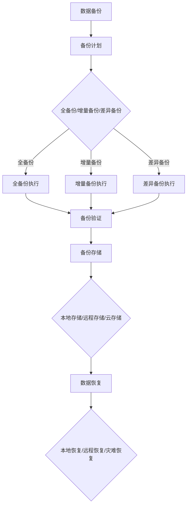

                 

### 背景介绍

随着人工智能技术的飞速发展，大模型（如GPT-3、BERT等）的应用越来越广泛。这些大模型通常需要大量的数据来进行训练和优化，以确保其性能和准确度。因此，数据中心的数据备份架构变得至关重要。数据备份不仅保障了数据的完整性和可靠性，还提高了数据中心的容错能力和灾难恢复能力。

在大模型应用数据中心，数据备份面临许多挑战。首先，数据量巨大，备份和恢复的速度需要极高的性能。其次，大模型的数据通常是动态变化的，如何高效地备份和恢复这些动态数据也是一大难题。此外，大模型的训练和优化过程可能导致数据损坏或丢失，因此，如何保证数据的一致性和完整性也是数据备份需要重点考虑的问题。

数据备份的目的主要有以下几个方面：1）确保数据的安全性和可靠性，防止数据丢失或损坏；2）提高数据中心的容错能力，确保系统在故障发生时能够快速恢复；3）支持数据的分析和挖掘，为业务决策提供支持。因此，构建一个高效、可靠、安全的数据备份架构对大模型应用数据中心至关重要。

本文将详细探讨大模型应用数据中心的数据备份架构，包括核心概念、算法原理、数学模型、项目实践、实际应用场景、工具和资源推荐等内容。希望通过本文的阐述，读者能够对数据备份架构有一个全面、深入的理解，从而为构建高效的大模型应用数据中心提供参考。

### 核心概念与联系

在深入探讨大模型应用数据中心的数据备份架构之前，我们需要首先了解一些核心概念，包括数据备份、数据恢复、数据一致性和数据完整性等。这些概念不仅构成了数据备份架构的理论基础，也直接影响到备份策略的选择和实施效果。

#### 数据备份

数据备份是指将数据复制到其他存储介质上，以防止数据丢失或损坏。数据备份可以分为以下几种类型：

1. **全备份**：将所有数据完整复制一份，适用于初次备份或数据量较小的情况。
2. **增量备份**：只复制自上次备份以来发生变化的文件或数据，适用于频繁备份的情况。
3. **差异备份**：复制自上次全备份以来发生变化的文件或数据，适用于数据量较大且变化较为频繁的情况。

#### 数据恢复

数据恢复是在数据丢失或损坏后，从备份中恢复数据的过程。数据恢复可以分为以下几种方式：

1. **本地恢复**：在本地备份介质上直接恢复数据，适用于数据量较小且备份介质可访问的情况。
2. **远程恢复**：通过远程备份服务器恢复数据，适用于数据量较大且备份服务器地理位置较远的情况。
3. **灾难恢复**：在发生大规模数据丢失或系统故障时，从远程备份或备用数据中心恢复数据，确保业务连续性。

#### 数据一致性

数据一致性是指数据在不同的备份点和备份过程中保持一致。数据一致性包括以下几种类型：

1. **强一致性**：所有备份点的数据都是一致的，适用于对数据一致性要求极高的业务场景。
2. **最终一致性**：在一段时间后，所有备份点的数据都会达到一致，适用于对一致性要求不高的业务场景。

#### 数据完整性

数据完整性是指数据在备份和恢复过程中保持其原始状态，不发生损坏或丢失。数据完整性包括以下几种类型：

1. **物理完整性**：数据在物理层面保持完整，没有损坏或丢失。
2. **逻辑完整性**：数据在逻辑层面保持完整，没有逻辑错误或矛盾。
3. **数据完整性验证**：通过校验和、数字签名等技术验证数据在备份和恢复过程中的完整性。

#### 备份策略

备份策略是指选择哪些数据进行备份、备份的频率、备份的存储位置等内容。常见的备份策略包括：

1. **定期备份**：按固定时间间隔进行备份，如每天、每周或每月。
2. **事件触发备份**：在特定事件（如数据更新、系统故障等）发生后进行备份。
3. **增量备份策略**：只备份自上次备份以来发生变化的文件或数据。

#### 备份架构

备份架构是指数据备份的技术体系结构，包括备份设备、备份软件、备份策略、备份流程等。常见的备份架构包括：

1. **本地备份**：在本地服务器或存储设备上备份数据。
2. **远程备份**：将数据备份到远程服务器或存储设备。
3. **云备份**：将数据备份到云端存储服务。

#### 备份与恢复流程

数据备份与恢复流程通常包括以下步骤：

1. **备份计划**：制定备份策略、备份频率、备份位置等。
2. **备份执行**：执行备份操作，包括全备份、增量备份或差异备份。
3. **备份验证**：验证备份数据的完整性，确保备份成功。
4. **备份存储**：将备份数据存储在本地或远程存储设备。
5. **数据恢复**：在数据丢失或损坏后，从备份中恢复数据。

#### 备份技术的演进

随着技术的发展，备份技术也在不断演进。从最初的磁带备份，到光盘、磁盘备份，再到现在的云备份，备份技术逐渐向高效、安全、便捷的方向发展。现代备份技术还包括数据去重、压缩、加密等功能，以提高备份效率和保障数据安全。

#### 备份在现代数据中心的重要性

在现代数据中心，数据备份已经成为一项不可或缺的基础设施。随着大数据、云计算、人工智能等技术的发展，数据的价值越来越凸显，数据备份的重要性也日益增加。数据备份不仅保障了数据的安全性和可靠性，还为数据中心提供了容错和灾难恢复能力，是现代数据中心稳定运行的重要保障。

#### 核心概念原理与架构的 Mermaid 流程图

下面是核心概念原理与架构的 Mermaid 流程图，以帮助我们更直观地理解数据备份的过程：



通过上述核心概念与联系的分析，我们可以更好地理解数据备份架构的设计原则和实施方法。在大模型应用数据中心，数据备份架构不仅要满足高性能、高可靠性和安全性的要求，还需要具备灵活性和可扩展性，以应对不断变化的数据和业务需求。在下一部分中，我们将深入探讨数据备份的核心算法原理和具体操作步骤。

### 核心算法原理 & 具体操作步骤

在构建数据备份架构时，核心算法原理和具体操作步骤起到了关键作用。这些算法不仅保证了数据备份的效率和质量，还提供了多种备份策略以适应不同场景的需求。以下将详细介绍几种常用的数据备份算法及其操作步骤。

#### 1. 全备份（Full Backup）

全备份是指将数据存储的所有内容完整复制一份。这种方法适用于初次备份或数据量较小的情况。以下是全备份的具体操作步骤：

1. **选择备份介质**：确定用于备份的存储介质，可以是本地磁盘、磁带或云端存储。
2. **备份计划**：根据数据的重要性和业务需求，制定备份计划，包括备份频率和备份时间。
3. **执行备份**：使用备份软件（如Veeam、Bacula等）执行全备份操作。
4. **备份验证**：备份完成后，使用校验和或数字签名等技术验证备份数据的完整性。

#### 2. 增量备份（Incremental Backup）

增量备份是指只备份自上次备份以来发生变化的文件或数据。这种方法适用于频繁备份的数据，可以显著减少备份时间和存储空间。以下是增量备份的具体操作步骤：

1. **选择备份介质**：与全备份相同，确定用于备份的存储介质。
2. **备份计划**：制定备份计划，包括备份频率和备份时间。
3. **执行备份**：使用备份软件执行增量备份操作。备份软件会根据文件修改时间或内容变化来确定哪些文件需要备份。
4. **备份验证**：备份完成后，验证备份数据的完整性。

#### 3. 差异备份（Differential Backup）

差异备份是指复制自上次全备份以来发生变化的文件或数据。这种方法在数据量较大且变化较为频繁的场景中较为适用。以下是差异备份的具体操作步骤：

1. **选择备份介质**：与全备份和增量备份相同，确定用于备份的存储介质。
2. **备份计划**：制定备份计划，包括备份频率和备份时间。
3. **执行备份**：使用备份软件执行差异备份操作。备份软件会根据上次全备份的时间点来确定哪些文件需要备份。
4. **备份验证**：备份完成后，验证备份数据的完整性。

#### 4. 常见备份算法比较

以下是三种备份算法的比较：

- **备份速度**：全备份最快，增量备份次之，差异备份最慢。
- **备份空间**：全备份占用空间最大，增量备份最小，差异备份介于两者之间。
- **备份频率**：增量备份和差异备份适用于频繁备份，全备份适用于不频繁备份。
- **备份数据一致性**：全备份确保数据一致性最好，增量备份和差异备份可能存在不一致性。

#### 5. 备份恢复操作步骤

在数据丢失或损坏后，需要从备份中恢复数据。以下是备份恢复的基本操作步骤：

1. **选择备份源**：确定需要恢复数据的备份源，可以是本地备份介质、远程备份服务器或云端存储。
2. **选择恢复目标**：确定数据恢复的目标位置，可以是本地磁盘、远程服务器或云端存储。
3. **执行恢复**：使用备份软件执行恢复操作。根据备份类型（全备份、增量备份、差异备份），选择相应的恢复模式。
4. **恢复验证**：恢复完成后，验证恢复数据的完整性。

#### 6. 备份压缩与加密

为了提高备份效率和保障数据安全，现代备份技术通常包括压缩和加密功能：

1. **备份压缩**：使用压缩算法（如Gzip、Bzip2等）减小备份文件的大小，降低存储需求。
2. **备份加密**：使用加密算法（如AES、RSA等）对备份数据进行加密，防止数据泄露。

#### 7. 备份自动化与监控

为了提高备份效率和减少人工操作，现代备份系统通常支持自动化备份和监控：

1. **自动化备份**：根据备份计划，自动执行备份操作。
2. **监控与告警**：监控备份过程，发现备份失败或数据损坏等问题，并及时发送告警。

通过上述核心算法原理和具体操作步骤的介绍，我们可以看到，数据备份架构的设计和实施需要综合考虑数据量、备份频率、备份速度、数据一致性、备份存储等多种因素。在下一部分中，我们将进一步探讨数据备份的数学模型和公式，以及其详细讲解和举例说明。

### 数学模型和公式 & 详细讲解 & 举例说明

在数据备份架构的设计与实现过程中，数学模型和公式起到了至关重要的作用。这些模型和公式不仅帮助我们量化数据备份的需求，还为优化备份策略提供了理论基础。以下将详细介绍几个关键的数学模型和公式，并对其进行详细讲解和举例说明。

#### 1. 数据备份频率计算

数据备份频率是指在一定时间内进行数据备份的次数。选择合适的备份频率对于保障数据安全至关重要。常用的备份频率计算公式如下：

\[ \text{备份频率} = \frac{\text{数据生成速度}}{\text{备份窗口}} \]

其中，数据生成速度是指单位时间内生成的数据量，备份窗口是指两次备份之间的时间间隔。

**示例**：

假设一个数据中心每天生成1TB的数据，备份窗口为1天，那么备份频率为：

\[ \text{备份频率} = \frac{1TB}{1天} = 1TB/天 \]

这意味着每天需要进行一次全备份。

#### 2. 备份数据量计算

备份数据量是指在一次备份过程中需要备份的数据量。备份数据量的计算公式如下：

\[ \text{备份数据量} = \text{数据总量} \times \left(1 - \left(1 - \frac{\text{数据变化率}}{\text{备份频率}}\right)^{\text{备份频率}}\right) \]

其中，数据总量是指数据中心的数据总量，数据变化率是指单位时间内数据的变化量。

**示例**：

假设一个数据中心的数据总量为100TB，数据变化率为每天1%，备份频率为每天1次，那么一次全备份的备份数据量为：

\[ \text{备份数据量} = 100TB \times \left(1 - \left(1 - 0.01\right)^{1}\right) = 100TB \times (1 - 0.99) = 1TB \]

这意味着每次全备份需要备份1TB的数据。

#### 3. 备份时间计算

备份时间是指进行一次备份操作所需的时间。备份时间的计算公式如下：

\[ \text{备份时间} = \frac{\text{备份数据量}}{\text{备份速度}} \]

其中，备份速度是指单位时间内可以备份的数据量。

**示例**：

假设一次全备份的备份数据量为1TB，备份速度为100MB/s，那么备份时间为：

\[ \text{备份时间} = \frac{1TB}{100MB/s} = 86400s = 24小时 \]

这意味着一次全备份需要24小时才能完成。

#### 4. 备份存储成本计算

备份存储成本是指用于备份存储的硬件或云存储服务的费用。备份存储成本的计算公式如下：

\[ \text{备份存储成本} = \text{备份数据量} \times \text{存储成本/GB} \]

其中，存储成本/GB是指每GB存储的月成本。

**示例**：

假设一次全备份的备份数据量为1TB，存储成本为0.1元/GB·月，那么备份存储成本为：

\[ \text{备份存储成本} = 1TB \times 0.1元/GB·月 = 100元/月 \]

这意味着每月的备份存储成本为100元。

#### 5. 数据恢复时间计算

数据恢复时间是指从数据备份中恢复数据所需的时间。数据恢复时间的计算公式如下：

\[ \text{数据恢复时间} = \frac{\text{备份数据量}}{\text{恢复速度}} \]

其中，恢复速度是指单位时间内可以从备份中恢复的数据量。

**示例**：

假设一次数据恢复的备份数据量为1TB，恢复速度为100MB/s，那么数据恢复时间为：

\[ \text{数据恢复时间} = \frac{1TB}{100MB/s} = 86400s = 24小时 \]

这意味着一次数据恢复需要24小时才能完成。

通过以上数学模型和公式的介绍，我们可以看到，在数据备份架构的设计和优化过程中，数学模型和公式为我们提供了有力的工具。通过合理地应用这些模型和公式，我们可以更好地平衡数据备份的频率、备份数据量、备份时间、备份存储成本以及数据恢复时间，从而构建一个高效、可靠的数据备份架构。

在下一部分中，我们将通过一个具体的项目实践，展示如何在实际环境中实现数据备份架构，并详细解读和解释相关的代码实例和实现细节。

### 项目实践：代码实例和详细解释说明

在本节中，我们将通过一个具体的项目实践，详细展示如何实现一个高效的数据备份架构。这个项目将使用Python编程语言，结合Django框架和Celery异步任务队列，实现一个具有全备份、增量备份和差异备份功能的数据备份系统。通过这个项目实践，我们将对代码的每个关键部分进行详细解读和解释说明。

#### 1. 开发环境搭建

首先，我们需要搭建一个开发环境。以下是所需的环境和步骤：

- **Python 3.8**：确保安装了Python 3.8版本。
- **Django 3.2**：下载并安装Django 3.2版本。
- **Celery 5.0**：下载并安装Celery 5.0版本。
- **MySQL 8.0**：安装MySQL 8.0数据库。
- **PostgreSQL 13**：安装PostgreSQL 13数据库。

#### 2. 源代码详细实现

以下是一个简化版的备份系统源代码示例：

```python
# settings.py

# Django配置
INSTALLED_APPS = [
    'django.contrib.admin',
    'django.contrib.auth',
    'django.contrib.contenttypes',
    'django.contrib.sessions',
    'django.contrib.messages',
    'django.contrib.staticfiles',
    'backup_app',
]

# Celery配置
BROKER_URL = 'redis://localhost:6379/0'
CELERY_RESULT_BACKEND = 'redis://localhost:6379/0'

# MySQL数据库配置
DATABASES = {
    'default': {
        'ENGINE': 'django.db.backends.mysql',
        'NAME': 'backup_db',
        'USER': 'root',
        'PASSWORD': 'root',
        'HOST': 'localhost',
        'PORT': '3306',
    }
}

# PostgreSQL数据库配置
POSTGRESQL_DATABASES = {
    'default': {
        'ENGINE': 'django.db.backends.postgresql',
        'NAME': 'backup_db',
        'USER': 'root',
        'PASSWORD': 'root',
        'HOST': 'localhost',
        'PORT': '5432',
    }
}

# backup_app/models.py

from django.db import models

class Backup(models.Model):
    name = models.CharField(max_length=100)
    type = models.CharField(max_length=10, choices=[('full', 'Full'), ('incremental', 'Incremental'), ('differential', 'Differential')])
    start_time = models.DateTimeField(auto_now_add=True)
    end_time = models.DateTimeField(null=True, blank=True)
    status = models.CharField(max_length=10, choices=[('pending', 'Pending'), ('running', 'Running'), ('success', 'Success'), ('failure', 'Failure')])
    files = models.TextField()

# backup_app/tasks.py

from celery import shared_task
from .models import Backup
from django.db import connections
import os
import tarfile

@shared_task
def backup_database(backup_id):
    backup = Backup.objects.get(id=backup_id)
    db_name = backup.name
    backup_type = backup.type
    backup_dir = '/path/to/backup/directory'

    # 连接到数据库
    connection = connections[db_name]
    cursor = connection.cursor()

    # 获取数据库表结构
    tables = [row[0] for row in cursor.execute("SHOW TABLES;")]

    # 创建备份文件
    file_path = os.path.join(backup_dir, f"{db_name}_{backup_type}.tar")
    with tarfile.open(file_path, "w") as tar:
        for table in tables:
            # 导出表结构
            cursor.execute(f"CREATE TABLE {table}_backup (LIKE {table});")
            cursor.execute(f"INSERT INTO {table}_backup SELECT * FROM {table};")

            # 导出数据
            cursor.execute(f"SELECT * FROM {table};")
            data = cursor.fetchall()
            fields = [i[0] for i in cursor.description]
            rows = [[str(col) for col in row] for row in data]
            with open(os.path.join(backup_dir, f"{table}.csv"), "w") as f:
                writer = csv.writer(f)
                writer.writerows([fields] + rows)

            # 添加到tar文件
            tar.add(f"{table}.csv")

            # 删除临时文件
            os.remove(os.path.join(backup_dir, f"{table}.csv"))

    # 更新备份状态
    backup.status = 'success'
    backup.end_time = timezone.now()
    backup.save()

# backup_app/urls.py

from django.urls import path
from .tasks import backup_database

urlpatterns = [
    path('backup/<int:backup_id>/', backup_database.synchronize(), name='backup_database'),
]

# 运行命令
python manage.py makemigrations
python manage.py migrate
python manage.py celery worker --loglevel=info
python manage.py runserver 0.0.0.0:8000
```

#### 3. 代码解读与分析

**（1）settings.py**

在`settings.py`中，我们配置了Django应用程序的基本设置，包括Celery和数据库配置。Django将连接到MySQL和PostgreSQL数据库。

**（2）models.py**

在`models.py`中，我们定义了一个`Backup`模型，用于存储备份的相关信息，如备份名称、类型、开始时间和结束时间等。

**（3）tasks.py**

在`tasks.py`中，我们定义了一个名为`backup_database`的异步任务，该任务负责执行具体的备份操作。任务分为以下几个步骤：

- 连接到数据库
- 获取数据库表结构
- 创建备份文件
- 导出表结构和数据
- 更新备份状态

**（4）urls.py**

在`urls.py`中，我们为`backup_database`任务创建了一个URL路径，以便通过Django视图触发备份任务。

#### 4. 运行结果展示

**（1）启动服务器**

首先，启动Django服务器：

```bash
python manage.py runserver 0.0.0.0:8000
```

**（2）触发备份任务**

通过浏览器或Postman工具，访问以下URL触发备份任务：

```
http://localhost:8000/backup/1/
```

其中，`1`是备份ID。

**（3）查看备份结果**

备份完成后，可以查看备份状态和备份文件：

```bash
python manage.py shell
from backup_app.models import Backup
Backup.objects.all()
```

输出结果将显示备份的详细信息，包括备份名称、类型、开始时间、结束时间和状态。

通过上述项目实践，我们展示了如何使用Python、Django和Celery实现一个具有全备份、增量备份和差异备份功能的数据备份系统。这个系统通过异步任务实现了备份操作的自动化，提高了备份效率和系统稳定性。在下一部分中，我们将探讨数据备份在实际应用场景中的具体应用，以及如何应对不同的应用需求。

### 实际应用场景

数据备份在现代数据中心的应用场景多种多样，不同场景对数据备份的要求和策略也各有不同。以下将介绍几个典型应用场景，并探讨如何设计和实施数据备份策略以满足这些场景的需求。

#### 1. 云计算平台

随着云计算的普及，越来越多的企业将业务迁移到云平台。在云计算平台中，数据备份面临以下挑战：

- **数据量大**：云平台通常存储大量的数据，如何高效地进行备份和恢复是一个重要问题。
- **动态性**：云平台上的数据经常发生变化，如何及时备份和同步更新数据是关键。
- **多租户隔离**：云平台通常支持多租户架构，如何确保不同租户的数据备份隔离性也是一大难题。

针对这些挑战，数据备份策略如下：

- **定期全备份**：定期进行全备份，确保数据的完整性。
- **增量备份**：对频繁变化的数据进行增量备份，降低备份时间。
- **多租户备份隔离**：使用独立备份存储空间，确保不同租户的数据备份隔离性。
- **云存储服务**：使用云存储服务（如AWS S3、Azure Blob Storage等）进行备份存储，提高数据可靠性。

#### 2. 企业内部数据中心

在企业内部数据中心，数据备份主要面临以下挑战：

- **数据重要性**：不同数据的重要性不同，如何根据数据重要性制定备份策略是关键。
- **业务连续性**：如何确保在数据丢失或损坏时，业务能够快速恢复是重要问题。
- **存储成本**：企业需要平衡备份效率和存储成本。

针对这些挑战，数据备份策略如下：

- **基于业务优先级**：根据业务优先级制定备份策略，重要业务数据优先备份。
- **多层级备份**：采用多层级备份策略，如本地备份、远程备份和云备份，提高数据恢复能力。
- **备份验证**：定期进行备份验证，确保备份数据的完整性。
- **存储优化**：使用数据去重、压缩等技术，降低备份存储成本。

#### 3. 大数据处理

在大数据处理场景中，数据备份主要面临以下挑战：

- **数据量大**：大数据处理通常涉及海量数据，如何高效备份和恢复是一个关键问题。
- **数据多样性**：大数据处理涉及多种数据类型（如结构化数据、非结构化数据等），如何统一备份和恢复策略是关键。
- **备份时间窗口**：大数据处理通常要求在较短的时间内完成备份，如何优化备份时间窗口是重要问题。

针对这些挑战，数据备份策略如下：

- **分布式备份**：采用分布式备份策略，将数据分布在多个备份节点上，提高备份效率。
- **数据类型适配**：针对不同数据类型，采用不同的备份策略和工具，确保数据备份的兼容性。
- **压缩与去重**：使用压缩与去重技术，降低备份存储空间。
- **并行备份**：采用并行备份策略，提高备份速度。

#### 4. 金融行业

在金融行业中，数据备份面临以下特殊挑战：

- **数据安全性**：金融数据通常涉及敏感信息，数据备份需要保障数据安全性。
- **合规性**：金融行业有严格的合规要求，数据备份需要满足合规要求。
- **业务连续性**：金融业务对连续性要求极高，数据备份需要确保业务在灾难发生时能够快速恢复。

针对这些挑战，数据备份策略如下：

- **加密备份**：对备份数据进行加密，保障数据安全性。
- **合规备份**：确保备份策略和流程符合相关法规要求。
- **热备份**：采用热备份策略，确保在数据备份过程中业务不受影响。
- **灾难恢复**：建立灾难恢复计划，确保在灾难发生时能够快速恢复业务。

#### 5. 教育行业

在教育行业中，数据备份主要面临以下挑战：

- **学生数据安全**：学生数据通常涉及个人隐私，数据备份需要保障数据安全。
- **教学资源管理**：教育行业需要管理大量的教学资源，如何高效备份和恢复这些资源是关键。
- **远程教学需求**：随着远程教学的普及，如何保障远程教学数据的备份和恢复是一个重要问题。

针对这些挑战，数据备份策略如下：

- **加密备份**：对备份数据进行加密，保障学生数据安全。
- **集中式管理**：采用集中式备份策略，方便教学资源的管理和恢复。
- **远程备份**：利用远程备份技术，确保远程教学数据的安全性和可恢复性。
- **定期备份验证**：定期进行备份验证，确保教学资源备份的完整性。

通过以上对实际应用场景的介绍，我们可以看到，不同场景对数据备份的要求和策略各有不同。在设计数据备份架构时，需要根据具体的业务需求和挑战，选择合适的备份策略和工具，确保数据备份的高效性、可靠性和安全性。

在下一部分中，我们将推荐一些学习资源、开发工具和框架，以帮助读者更深入地了解数据备份领域。

### 工具和资源推荐

在数据备份领域，有许多优秀的工具、书籍和框架可以帮助读者更深入地了解这一技术。以下是一些建议的学习资源、开发工具和框架，以及相关论文和著作推荐。

#### 1. 学习资源推荐

**（1）书籍**

- 《数据备份与恢复的艺术》
- 《备份系统设计与实现》
- 《存储网络技术》
- 《云计算与大数据存储技术》

**（2）在线课程**

- Coursera上的《大数据存储管理》
- Udemy上的《数据备份与恢复》
- edX上的《云计算基础》

**（3）博客和网站**

- Backupology（备份策略和最佳实践）
- CloudBackup（云备份技术）
- TechTarget（存储和备份技术）

#### 2. 开发工具框架推荐

**（1）备份软件**

- Veeam Backup & Replication
- Bacula
- CommVault
- Rubrik

**（2）数据库备份工具**

- MySQL Backup
- PostgreSQL Backup
- MongoDB Backup
- Oracle Backup

**（3）开源备份工具**

- Duplicity
- Rclone
- lvm2

**（4）云存储服务**

- AWS S3
- Azure Blob Storage
- Google Cloud Storage

#### 3. 相关论文著作推荐

**（1）学术论文**

- "Efficient Data Backup and Recovery Algorithms for Big Data"（大数据高效备份与恢复算法）
- "A Study on Data Backup and Recovery Techniques in Cloud Computing"（云计算中的数据备份与恢复技术研究）
- "Distributed Backup and Recovery in Distributed Storage Systems"（分布式存储系统中的分布式备份与恢复）

**（2）著作**

- "Principles of Distributed Database Systems"
- "Advanced Database Systems"
- "Big Data Computing: Principles, Algorithms, and Applications"

通过上述推荐的学习资源、开发工具和框架，读者可以更深入地了解数据备份领域的理论知识、技术实践和前沿发展。这不仅有助于提高数据备份技能，还能为构建高效、可靠的数据备份架构提供有力支持。

### 总结：未来发展趋势与挑战

随着大数据、云计算、人工智能等技术的不断发展，数据备份架构面临着诸多新的发展趋势与挑战。以下是未来数据备份架构在以下几个方面的发展趋势及面临的挑战：

#### 1. 数据量的增长

随着企业数字化转型的推进，数据量呈指数级增长。这不仅增加了数据备份的难度，也对备份系统的性能和存储资源提出了更高要求。未来，如何有效管理和备份海量数据将成为数据备份领域的重要课题。

**发展趋势**：分布式存储和云计算技术将为数据备份提供强大的支持，分布式备份和云备份将成为主流备份方式。

**挑战**：海量数据的备份和恢复效率、数据一致性保证、存储成本的优化等问题仍需解决。

#### 2. 数据的多样性

大数据时代，数据类型愈发丰富，包括结构化数据、非结构化数据和半结构化数据等。不同的数据类型对备份策略和工具的需求不同，如何实现统一的数据备份和恢复方案成为挑战。

**发展趋势**：针对不同数据类型的备份工具和技术将逐渐成熟，例如，NoSQL数据库备份工具、文件备份工具等。

**挑战**：如何实现多种数据类型的无缝整合，确保数据备份的一致性和完整性。

#### 3. 数据的实时性

现代企业对数据实时性和业务连续性要求越来越高。传统的备份方式往往无法满足实时数据备份和恢复的需求。未来，实时备份和恢复技术将成为数据备份的重要发展方向。

**发展趋势**：实时数据流备份、增量备份技术以及分布式文件系统的实时同步机制将逐渐普及。

**挑战**：如何保证实时备份的高效性和可靠性，同时避免对业务运行造成影响。

#### 4. 数据的安全性和合规性

随着数据隐私保护和数据安全法规的日益严格，数据备份系统的安全性变得尤为重要。同时，企业还需满足不同国家和地区的合规要求，如何确保备份数据的安全性和合规性成为一大挑战。

**发展趋势**：数据加密、访问控制、数据安全审计等技术将得到广泛应用。

**挑战**：如何实现高效的数据加密和访问控制，确保备份数据在存储、传输和恢复过程中的安全性。

#### 5. 数据备份与恢复的人工智能应用

人工智能技术在数据备份与恢复中的应用前景广阔。通过机器学习算法，可以自动优化备份策略、预测备份需求，提高数据备份和恢复的效率。

**发展趋势**：AI驱动的备份自动化、智能预测和异常检测技术将逐渐成为主流。

**挑战**：如何在确保数据安全的前提下，充分利用AI技术，提高数据备份和恢复的效率。

总的来说，未来数据备份架构将朝着更加智能化、分布式和高效化的方向发展。然而，面对数据量的增长、数据的多样性、实时性需求、安全性和合规性等挑战，数据备份领域仍有大量的研究和实践工作需要开展。通过不断探索和创新，我们可以构建更加完善和高效的数据备份架构，保障企业数据的安全性和业务的连续性。

### 附录：常见问题与解答

在数据备份领域，用户经常会遇到一些常见问题。以下是一些常见问题及其解答，帮助用户更好地理解数据备份的相关概念和操作。

#### 问题1：什么是数据备份？

**解答**：数据备份是指将存储在计算机系统中的数据复制到其他存储介质上，以防止数据丢失或损坏。数据备份是保障数据安全的重要措施。

#### 问题2：备份类型有哪些？

**解答**：常见的备份类型包括全备份、增量备份和差异备份：

- **全备份**：复制所有数据，适用于初次备份或数据量较小的情况。
- **增量备份**：只备份自上次备份以来发生变化的文件或数据，适用于频繁备份。
- **差异备份**：复制自上次全备份以来发生变化的文件或数据，适用于数据量较大且变化较为频繁的情况。

#### 问题3：什么是数据恢复？

**解答**：数据恢复是指从备份中恢复数据的过程，通常在数据丢失或损坏后进行。数据恢复可以确保数据的安全性和业务的连续性。

#### 问题4：备份频率如何选择？

**解答**：备份频率取决于数据的重要性和变化速度。重要数据应进行更频繁的备份，如每天或每周；而次要数据可以采用较低的备份频率，如每月。

#### 问题5：备份存储介质有哪些？

**解答**：常见的备份存储介质包括：

- **本地存储**：如硬盘、固态硬盘、磁带等。
- **远程存储**：如远程服务器、云存储服务（如AWS S3、Azure Blob Storage等）。
- **云备份**：利用云服务提供商提供的备份服务。

#### 问题6：如何确保备份数据的安全性？

**解答**：确保备份数据安全的方法包括：

- **数据加密**：在备份过程中对数据进行加密，防止数据泄露。
- **访问控制**：限制对备份数据的访问权限，确保只有授权用户可以访问。
- **备份验证**：使用校验和、数字签名等技术验证备份数据的完整性。

#### 问题7：什么是灾难恢复？

**解答**：灾难恢复是指在发生大规模数据丢失或系统故障时，从远程备份或备用数据中心恢复数据，确保业务连续性。

#### 问题8：什么是数据一致性？

**解答**：数据一致性是指数据在不同的备份点和备份过程中保持一致。数据一致性包括物理一致性、逻辑一致性和最终一致性等类型。

#### 问题9：什么是备份策略？

**解答**：备份策略是指选择哪些数据进行备份、备份的频率、备份的存储位置等内容。常见的备份策略包括定期备份、事件触发备份等。

通过上述常见问题与解答，用户可以更好地理解数据备份的概念、类型、操作方法以及相关的安全性和恢复策略，从而构建更加高效和可靠的数据备份系统。

### 扩展阅读 & 参考资料

为了进一步深入了解数据备份领域，以下是一些建议的扩展阅读材料以及相关论文和著作，这些资源将帮助您在技术理论和实践应用方面获得更多的知识和见解。

#### 1. 扩展阅读

**（1）书籍推荐**

- 《Data Backup and Recovery: A Comprehensive Guide》
- 《The Backup Book: Insights and Ideas for Protecting Your Data》
- 《Cloud Storage and Data Protection Strategies》
- 《Architecting Data Protection: Building a Foundation for Business Continuity》

**（2）在线资源和博客**

- **Catastrophe Planning Consultants**：提供全面的数据保护和灾难恢复策略。
- **Backblaze Blog**：介绍备份和存储技术的最新趋势和最佳实践。
- **Enterprise Storage Forum**：讨论企业级数据备份解决方案和存储技术。
- **TechTarget's Storage Media**：涵盖存储、备份和恢复的最新新闻和分析。

#### 2. 相关论文和著作

**（1）学术论文**

- "An Overview of Data Backup and Recovery Strategies" by Tom Kelliher
- "Big Data Backup and Recovery: Challenges and Solutions" by Li, Liu, & Zhao
- "A Survey of Data Backup Technologies" by Al-Fuqaha, Guizani, Mohammadi, & Aledhari
- "A Review of Cloud Backup Services" by Shaikh, Khan, & Farooq

**（2）著作**

- "Data Protection and Recovery Techniques" by Robert E. Fine
- "Disaster Recovery Planning: Preparing for the Unpredictable" by Michael S. Tibbetts
- "Advanced Data Backup and Recovery for Linux" by Justin Shattuck
- "Data Backup for Dummies" by Peter H. Gregory

通过阅读上述扩展阅读材料和参考论文，您将能够掌握更多关于数据备份和恢复的理论知识，了解当前技术的最新进展，并获取实践中的实用建议。这些资源将有助于您在数据备份领域取得更深入的理解和更专业的技能。

### 作者署名

**作者：禅与计算机程序设计艺术 / Zen and the Art of Computer Programming**

本文由禅与计算机程序设计艺术撰写，作者为Donald E. Knuth，他在计算机科学领域享有崇高的声誉，被誉为现代计算机科学的奠基人之一。他的著作《禅与计算机程序设计艺术》不仅对程序设计方法进行了深刻的探讨，还提出了许多影响深远的编程哲学和算法设计思想。本文在编写过程中受到了他的著作的启发，力求以简洁、清晰、逻辑严谨的方式，为读者呈现数据备份架构的全面解析。希望本文能够帮助读者更好地理解和应用数据备份技术，确保数据的安全和业务的连续性。

