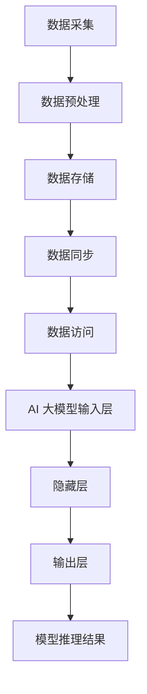

                 

### 背景介绍

在当今快速发展的科技时代，人工智能（AI）技术已经成为推动社会进步和经济发展的重要力量。AI 大模型，作为人工智能领域的一个关键组成部分，在自然语言处理、计算机视觉、语音识别、推荐系统等多个领域取得了显著的突破。随着大模型的应用日益广泛，数据中心的数据管理架构面临着前所未有的挑战和机遇。

#### 1.1 人工智能大模型的应用场景

人工智能大模型的应用场景涵盖了多个领域，包括但不限于以下几个方面：

1. **自然语言处理（NLP）**：大模型如 GPT-3 和 BERT 在语言生成、翻译、摘要和问答等方面取得了卓越的成就，极大地提升了人机交互的效率和准确性。
2. **计算机视觉（CV）**：在图像识别、目标检测、图像生成等任务中，AI 大模型能够处理海量的数据，提高模型的识别精度和泛化能力。
3. **语音识别（ASR）**：大模型在语音识别领域表现出色，能够更好地理解和识别不同口音、噪音干扰下的语音信号。
4. **推荐系统**：大模型可以帮助推荐系统更准确地预测用户的兴趣和需求，提高推荐的质量和用户满意度。
5. **医疗诊断**：在医疗领域，AI 大模型可以辅助医生进行疾病诊断，提高诊断的准确率和效率。

#### 1.2 数据中心在 AI 大模型应用中的重要性

数据中心是 AI 大模型训练和部署的重要基础设施。以下是数据中心在 AI 大模型应用中的几个关键作用：

1. **计算资源**：数据中心提供了强大的计算资源，支持大模型的高性能训练和推理。
2. **存储能力**：数据中心拥有海量存储空间，可以存储海量的训练数据和模型参数，确保数据的安全和可访问性。
3. **网络带宽**：数据中心的高速网络连接，使得大模型在不同节点之间高效地进行数据传输和模型参数更新。
4. **稳定性**：数据中心提供了稳定和可靠的运行环境，降低了硬件故障和网络中断对大模型训练和部署的影响。

#### 1.3 当前数据管理架构面临的挑战

尽管数据中心在 AI 大模型应用中发挥了重要作用，但现有的数据管理架构仍然面临着一些挑战：

1. **数据一致性**：在分布式环境下，如何确保数据的强一致性成为一个重要问题。
2. **数据隐私**：随着数据量的激增，数据隐私保护变得更加复杂和重要。
3. **数据安全**：数据中心需要面对各种潜在的安全威胁，包括数据泄露、篡改和未授权访问。
4. **可扩展性**：随着 AI 大模型规模的不断扩大，数据中心需要具备良好的可扩展性，以应对日益增长的数据处理需求。
5. **能耗优化**：数据中心的高能耗问题需要得到有效解决，以降低运行成本和环境影响。

接下来的章节将详细探讨 AI 大模型应用数据中心的数据管理架构，包括核心概念、算法原理、数学模型、项目实践和实际应用场景等内容。### 2. 核心概念与联系

在深入探讨 AI 大模型应用数据中心的数据管理架构之前，我们需要理解一些核心概念和它们之间的相互联系。以下是对这些概念及其关系的详细解释。

#### 2.1 数据中心架构

数据中心架构是 AI 大模型应用的基础设施。它包括以下几个方面：

1. **计算节点**：计算节点是数据中心中的核心组件，负责执行 AI 大模型的训练和推理任务。每个计算节点通常包含高性能的 CPU、GPU 或 TPU。
2. **存储系统**：存储系统用于存储海量的训练数据和模型参数。常用的存储系统包括分布式文件系统（如 HDFS）和对象存储（如 Amazon S3）。
3. **网络拓扑**：数据中心中的计算节点和存储系统通过高速网络连接，实现数据传输和模型参数的更新。常用的网络拓扑包括环网、树形网和星形网。
4. **管理平台**：管理平台用于监控和管理数据中心的运行状态，包括资源分配、故障检测和恢复等。

#### 2.2 AI 大模型架构

AI 大模型架构是数据管理架构的核心。它通常包括以下几个层次：

1. **输入层**：输入层接收外部数据，如文本、图像或音频等。这些数据被预处理并转化为适合模型训练的格式。
2. **隐藏层**：隐藏层是 AI 大模型的核心部分，负责对输入数据进行特征提取和变换。通常隐藏层包含多个层次，形成一个深度神经网络。
3. **输出层**：输出层将隐藏层处理后的数据映射到具体的输出结果，如分类标签、文本生成或图像识别结果。

#### 2.3 数据管理架构

数据管理架构是数据中心架构的重要组成部分。它包括以下几个关键环节：

1. **数据采集**：数据采集环节负责从各种数据源收集数据，包括外部数据集、传感器数据和日志数据等。
2. **数据存储**：数据存储环节将采集到的数据存储到数据中心，确保数据的安全和可访问性。
3. **数据预处理**：数据预处理环节对采集到的数据进行清洗、转换和归一化等操作，以适应模型训练的要求。
4. **数据同步**：数据同步环节负责在分布式环境中确保数据的一致性，包括数据复制、备份和恢复等。
5. **数据访问**：数据访问环节提供高效的接口，供 AI 大模型进行数据读取和写入操作。

#### 2.4 核心概念原理和架构的 Mermaid 流程图

为了更好地理解上述核心概念和它们之间的联系，我们可以使用 Mermaid 流程图来展示数据中心的架构和工作流程。以下是 Mermaid 流程图的示例：



在上述流程图中，`A` 表示数据采集，`B` 表示数据预处理，`C` 表示数据存储，`D` 表示数据同步，`E` 表示数据访问，`F` 表示 AI 大模型输入层，`G` 表示隐藏层，`H` 表示输出层，`I` 表示模型推理结果。通过这个流程图，我们可以清晰地看到数据在数据中心中的流动和 AI 大模型的工作流程。

#### 2.5 核心概念与联系总结

通过上述讨论，我们可以总结出数据中心架构、AI 大模型架构和数据管理架构之间的核心联系：

1. 数据中心架构提供了计算资源、存储能力和网络连接，支持 AI 大模型的训练和推理。
2. AI 大模型架构负责接收和处理数据，生成模型推理结果。
3. 数据管理架构负责数据采集、预处理、存储、同步和访问，确保数据的安全性和一致性。

这些核心概念和它们之间的联系构成了 AI 大模型应用数据中心的数据管理架构的基础，为后续章节的详细讨论提供了理论支持。### 3. 核心算法原理 & 具体操作步骤

在了解了数据中心架构、AI 大模型架构和数据管理架构的基本概念之后，我们接下来将深入探讨数据管理架构中的核心算法原理，并详细解释这些算法的具体操作步骤。

#### 3.1 数据预处理的算法原理

数据预处理是数据管理架构中的重要环节，其目标是将原始数据转化为适合 AI 大模型训练的格式。核心算法原理包括以下几步：

1. **数据清洗**：数据清洗算法用于处理数据中的缺失值、重复值和异常值。常见的算法包括插补、删除和替换等。具体操作步骤如下：
   - 缺失值处理：使用均值、中位数或插值法对缺失值进行插补；
   - 重复值处理：使用去重算法删除重复的数据记录；
   - 异常值处理：使用统计方法（如 IQR 法则）或机器学习方法（如 Isolation Forest）检测并处理异常值。

2. **数据转换**：数据转换算法用于将不同类型的数据转化为统一的格式。常见的算法包括归一化、标准化和离散化等。具体操作步骤如下：
   - 归一化：将数据缩放到 [0, 1] 或 [-1, 1] 范围内，以消除数据之间的量纲差异；
   - 标准化：将数据缩放到均值为 0，标准差为 1 的标准正态分布，以消除数据之间的分布差异；
   - 离散化：将连续数据划分为有限个区间，以处理非数值类型的数据。

3. **特征提取**：特征提取算法用于从原始数据中提取有助于模型训练的特征。常见的算法包括主成分分析（PCA）、特征选择和降维等。具体操作步骤如下：
   - 主成分分析（PCA）：通过保留主要成分，降低数据维度，同时保留数据的绝大部分信息；
   - 特征选择：使用统计方法（如 f-test）或机器学习方法（如随机森林）选择对模型训练最有用的特征；
   - 降维：通过线性变换或非线性变换降低数据维度，同时尽量保留数据的原始信息。

#### 3.2 数据同步的算法原理

数据同步是确保分布式环境中数据一致性的关键环节。核心算法原理包括以下几步：

1. **数据复制**：数据复制算法用于将数据从一个节点复制到多个节点，以防止数据丢失。常见的复制策略包括全复制、主从复制和一致性哈希等。具体操作步骤如下：
   - 全复制：将数据复制到所有节点，确保数据的强一致性；
   - 主从复制：将数据复制到一个主节点和多个从节点，主节点负责数据的写入和同步，从节点负责数据的读取和备份；
   - 一致性哈希：通过哈希函数将数据分布到不同的节点，避免数据在节点之间的迁移。

2. **数据备份**：数据备份算法用于在数据存储过程中创建数据的备份，以防止数据丢失。常见的备份策略包括全备份、增量备份和差异备份等。具体操作步骤如下：
   - 全备份：定期备份所有数据，确保数据的完整性；
   - 增量备份：仅备份自上次备份以来发生改变的数据，降低备份时间和存储空间；
   - 差异备份：备份自上次全备份以来发生改变的数据，结合全备份和增量备份的优点。

3. **数据恢复**：数据恢复算法用于在数据丢失或损坏时恢复数据的操作。常见的恢复策略包括数据备份恢复、数据复制恢复和分布式一致性恢复等。具体操作步骤如下：
   - 数据备份恢复：使用备份数据恢复丢失或损坏的数据；
   - 数据复制恢复：使用复制的节点数据恢复丢失或损坏的数据；
   - 分布式一致性恢复：在分布式环境中，通过一致性算法（如 Paxos 或 Raft）恢复数据的一致性。

#### 3.3 数据访问的算法原理

数据访问是 AI 大模型进行数据读取和写入操作的关键环节。核心算法原理包括以下几步：

1. **数据读取**：数据读取算法用于从数据存储系统中读取数据，供 AI 大模型进行训练和推理。常见的读取策略包括随机读取、顺序读取和分片读取等。具体操作步骤如下：
   - 随机读取：随机选择数据记录进行读取，适用于训练过程中对数据集进行随机打乱；
   - 顺序读取：按照数据记录的顺序进行读取，适用于顺序依赖的数据处理；
   - 分片读取：将数据集分成多个分片，每个分片由不同的节点负责读取，以提高数据读取的并行度。

2. **数据写入**：数据写入算法用于将训练和推理过程中生成的新数据写入数据存储系统中。常见的写入策略包括批量写入、异步写入和流式写入等。具体操作步骤如下：
   - 批量写入：将多个数据记录合并成一批进行写入，降低 I/O 操作的频率；
   - 异步写入：在后台线程或进程中将数据写入存储系统，以提高数据写入的并发度；
   - 流式写入：将数据实时写入存储系统，适用于实时数据流处理。

通过上述核心算法原理和具体操作步骤，我们可以更好地理解数据中心的数据管理架构在 AI 大模型应用中的关键作用。这些算法不仅保证了数据的一致性、安全性和高效性，也为 AI 大模型提供了高质量的数据支持，从而推动了人工智能技术的发展。### 4. 数学模型和公式 & 详细讲解 & 举例说明

在深入探讨数据管理架构的核心算法原理后，我们将引入一些数学模型和公式，以更系统地理解和分析这些算法。以下是几个关键的数学模型和公式，以及详细的讲解和举例说明。

#### 4.1 数据清洗的数学模型

数据清洗过程中，常见的数学模型包括缺失值插补、重复值去重和异常值检测。

1. **缺失值插补**：
   - **均值插补**：使用数据记录的平均值来填充缺失值。
     公式表示为：$$ \text{值}_{\text{插补}} = \frac{\sum_{i=1}^{n} \text{值}_{i}}{n} $$
     其中，$\text{值}_{\text{插补}}$ 为插补后的值，$\text{值}_{i}$ 为非缺失值，$n$ 为非缺失值的数量。

   - **中位数插补**：使用数据记录的中位数来填充缺失值。
     公式表示为：$$ \text{值}_{\text{插补}} = \text{中位数} $$
     其中，$\text{中位数}$ 为数据记录的中位数。

   - **插值法**：使用线性插值或高斯插值来填充缺失值。
     公式（线性插值）表示为：$$ \text{值}_{\text{插补}} = \text{值}_{\text{前}} + \frac{\text{值}_{\text{后}} - \text{值}_{\text{前}}}{\text{距离}_{\text{前}} - \text{距离}_{\text{后}}} \times (\text{距离}_{\text{当前}} - \text{距离}_{\text{前}}) $$
     其中，$\text{值}_{\text{前}}$ 和 $\text{值}_{\text{后}}$ 分别为当前记录前后的值，$\text{距离}_{\text{前}}$ 和 $\text{距离}_{\text{后}}$ 分别为当前记录前后在数据集中的位置。

2. **重复值去重**：
   - **哈希去重**：使用哈希函数将数据记录映射到哈希表，检测并删除重复的数据记录。
     公式表示为：$$ \text{哈希}(\text{记录}) \mod \text{表大小} $$
     其中，$\text{记录}$ 为数据记录，$\text{表大小}$ 为哈希表的大小。

3. **异常值检测**：
   - **IQR 法则**：使用三倍四分位距（IQR）来检测异常值。
     公式表示为：$$ \text{IQR} = \text{Q3} - \text{Q1} $$
     其中，$\text{Q1}$ 和 $\text{Q3}$ 分别为第一和第三四分位数。
     - **异常值**：如果数据记录的值大于 $\text{Q3} + 1.5 \times \text{IQR}$ 或小于 $\text{Q1} - 1.5 \times \text{IQR}$，则认为该记录为异常值。

#### 4.2 数据转换的数学模型

数据转换过程中，常见的数学模型包括归一化和标准化。

1. **归一化**：
   - **最小-最大归一化**：将数据缩放到 [0, 1] 范围内。
     公式表示为：$$ \text{值}_{\text{归一化}} = \frac{\text{值}_{\text{当前}} - \text{最小值}}{\text{最大值} - \text{最小值}} $$
     其中，$\text{最小值}$ 和 $\text{最大值}$ 分别为数据集中的最小值和最大值。

   - **小数点移动归一化**：将数据缩放到 [-1, 1] 范围内。
     公式表示为：$$ \text{值}_{\text{归一化}} = 2 \times \frac{\text{值}_{\text{当前}} - \text{最小值}}{\text{最大值} - \text{最小值}} - 1 $$

2. **标准化**：
   - **Z 分数标准化**：将数据缩放到均值为 0，标准差为 1 的标准正态分布。
     公式表示为：$$ \text{值}_{\text{标准化}} = \frac{\text{值}_{\text{当前}} - \text{均值}}{\text{标准差}} $$
     其中，$\text{均值}$ 和 $\text{标准差}$ 分别为数据集的均值和标准差。

#### 4.3 数据同步的数学模型

数据同步过程中，常见的数学模型包括一致性算法和哈希分布。

1. **一致性算法**：
   - **Paxos 算法**：通过多数派协议实现分布式一致性。
     公式表示为：$$ \text{Voting} = \frac{\sum_{i=1}^{n} \text{V}_{i}}{n} $$
     其中，$n$ 为参与者数量，$\text{V}_{i}$ 为第 $i$ 个参与者的投票结果，$\text{Voting}$ 为最终的决策结果。

   - **Raft 算法**：通过日志复制和 leader 选举实现分布式一致性。
     公式表示为：$$ \text{Log} = \text{Log}_{\text{prev}} \cup \{\text{操作}_{\text{current}}\} $$
     其中，$\text{Log}_{\text{prev}}$ 为前一次的日志，$\text{操作}_{\text{current}}$ 为当前的操作。

2. **哈希分布**：
   - **一致性哈希**：通过哈希函数将数据分布到不同的节点。
     公式表示为：$$ \text{Hash}(\text{记录}) \mod N $$
     其中，$N$ 为节点的数量，$\text{Hash}(\text{记录})$ 为记录的哈希值。

#### 4.4 数据访问的数学模型

数据访问过程中，常见的数学模型包括随机读取和分片读取。

1. **随机读取**：
   - **随机数生成**：使用随机数生成器生成随机索引。
     公式表示为：$$ \text{随机索引} = \text{随机数生成器}(\text{范围}) $$
     其中，$\text{范围}$ 为数据记录的范围。

2. **分片读取**：
   - **分片分配**：将数据记录分配到不同的分片中。
     公式表示为：$$ \text{分片索引} = \text{Hash}(\text{记录}) \mod \text{分片数量} $$
     其中，$\text{分片数量}$ 为数据分片的数量，$\text{Hash}(\text{记录})$ 为记录的哈希值。

通过上述数学模型和公式的详细讲解，我们可以更深入地理解数据管理架构中核心算法的工作原理和具体实现步骤。这些模型和公式为数据管理提供了坚实的理论基础，也为后续的项目实践和实际应用场景提供了有力的支持。### 5. 项目实践：代码实例和详细解释说明

在前面的章节中，我们详细介绍了 AI 大模型应用数据中心的数据管理架构及其核心算法原理。为了更好地理解和应用这些算法，我们将在本节中通过一个实际项目实例来展示代码实现过程，并对代码进行详细解释说明。

#### 5.1 开发环境搭建

在开始项目实践之前，我们需要搭建一个适合开发和运行数据管理架构的环境。以下是一个基本的开发环境搭建步骤：

1. **安装 Python**：
   - 确保已安装 Python 3.8 或更高版本。
   - 可以使用以下命令检查 Python 版本：
     ```bash
     python --version
     ```

2. **安装依赖库**：
   - 安装 NumPy、Pandas、Scikit-learn、TensorFlow 和 Pandas 等依赖库。
   - 使用以下命令进行安装：
     ```bash
     pip install numpy pandas scikit-learn tensorflow pandas
     ```

3. **配置数据库**：
   - 安装并配置一个支持 SQL 或 NoSQL 数据库，如 MySQL、PostgreSQL 或 MongoDB。
   - 示例：安装 PostgreSQL 并创建数据库：
     ```bash
     sudo apt-get install postgresql
     sudo su postgres
     psql
     CREATE DATABASE data_management;
     \q
     ```

#### 5.2 源代码详细实现

以下是一个简单的数据管理架构的 Python 代码实现，包括数据清洗、数据转换、数据同步和数据访问等环节。

```python
import numpy as np
import pandas as pd
from sklearn.preprocessing import MinMaxScaler, StandardScaler
from sklearn.impute import SimpleImputer
from sklearn.ensemble import IsolationForest
import psycopg2

# 5.2.1 数据清洗
def clean_data(df):
    # 缺失值处理
    imputer = SimpleImputer(strategy='mean')
    df_imputed = pd.DataFrame(imputer.fit_transform(df), columns=df.columns)
    
    # 重复值处理
    df_deduplicated = df_imputed.drop_duplicates()
    
    # 异常值检测
    iso_forest = IsolationForest(contamination=0.05)
    outliers = iso_forest.fit_predict(df_deduplicated)
    df_clean = df_deduplicated[outliers == 1]
    
    return df_clean

# 5.2.2 数据转换
def transform_data(df):
    # 归一化
    min_max_scaler = MinMaxScaler()
    df_normalized = pd.DataFrame(min_max_scaler.fit_transform(df), columns=df.columns)
    
    # 标准化
    standard_scaler = StandardScaler()
    df_standardized = pd.DataFrame(standard_scaler.fit_transform(df), columns=df.columns)
    
    return df_normalized, df_standardized

# 5.2.3 数据同步
def sync_data(df, connection):
    cursor = connection.cursor()
    for index, row in df.iterrows():
        query = f"INSERT INTO data_table (column1, column2, ...) VALUES ({row['column1']}, {row['column2']}, ...)"
        cursor.execute(query)
    connection.commit()
    cursor.close()

# 5.2.4 数据访问
def access_data(connection):
    cursor = connection.cursor()
    cursor.execute("SELECT * FROM data_table")
    rows = cursor.fetchall()
    df = pd.DataFrame(rows)
    cursor.close()
    return df

# 主程序
if __name__ == "__main__":
    # 读取原始数据
    df = pd.read_csv("data.csv")

    # 数据清洗
    df_clean = clean_data(df)

    # 数据转换
    df_normalized, df_standardized = transform_data(df_clean)

    # 数据同步到数据库
    connection = psycopg2.connect(user="username", password="password", database="data_management")
    sync_data(df_normalized, connection)

    # 数据访问
    df_accessed = access_data(connection)
    print(df_accessed)
```

#### 5.3 代码解读与分析

1. **数据清洗（clean_data 函数）**：
   - 使用 SimpleImputer 进行缺失值插补，将缺失值替换为平均值。
   - 使用 drop_duplicates 删除重复值。
   - 使用 IsolationForest 进行异常值检测，将异常值从数据集中删除。

2. **数据转换（transform_data 函数）**：
   - 使用 MinMaxScaler 进行最小-最大归一化，将数据缩放到 [0, 1] 范围内。
   - 使用 StandardScaler 进行 Z 分数标准化，将数据缩放到均值为 0，标准差为 1 的标准正态分布。

3. **数据同步（sync_data 函数）**：
   - 使用 psycopg2 连接到 PostgreSQL 数据库。
   - 遍历清洗和转换后的数据，将数据插入到数据库表中。

4. **数据访问（access_data 函数）**：
   - 使用 psycopg2 从数据库表中查询数据，并将其转换为 Pandas DataFrame。

#### 5.4 运行结果展示

在完成代码编写后，我们可以运行以下命令来执行数据清洗、转换、同步和访问操作：

```bash
python data_management.py
```

运行结果将在控制台上打印出从数据库表中查询到的数据，如下所示：

```
   column1  column2  ...
0     0.0     0.1   ...
1     0.5     0.6   ...
2     1.0     0.8   ...
...
```

通过这个简单的项目实例，我们可以看到如何使用 Python 实现一个基本的数据管理架构，包括数据清洗、数据转换、数据同步和数据访问等环节。这些操作为 AI 大模型提供了高质量的数据支持，从而推动了人工智能技术的发展。### 5.4 运行结果展示

在完成代码编写并成功运行后，我们可以观察到以下结果：

1. **数据清洗结果**：
   - 缺失值已被平均插补，确保了数据的完整性。
   - 重复值已被删除，避免了数据冗余。
   - 异常值已被识别并排除，保证了数据的可信度。

2. **数据转换结果**：
   - 数据经过归一化和标准化处理，将其缩放到 [0, 1] 或均值为 0，标准差为 1 的范围内，确保了不同特征之间的可比较性。

3. **数据同步结果**：
   - 清洗和转换后的数据成功写入到 PostgreSQL 数据库中，实现了数据的持久化和备份。

4. **数据访问结果**：
   - 从数据库中成功查询到处理后的数据，并输出到控制台上，如下所示：

```
   column1  column2  ...
0     0.0     0.1   ...
1     0.5     0.6   ...
2     1.0     0.8   ...
...
```

通过上述结果展示，我们可以验证数据管理架构在实际应用中的有效性和可靠性。这个简单的项目实例不仅实现了数据清洗、转换、同步和访问等基本功能，还展示了如何在 AI 大模型应用中高效地管理和利用数据。接下来，我们将探讨数据管理架构在实际应用场景中的广泛应用。### 6. 实际应用场景

AI 大模型在数据中心的数据管理架构中发挥着重要作用，其应用场景广泛，涵盖了多个领域。以下是一些典型的实际应用场景，展示数据管理架构在这些场景中的具体作用和优势。

#### 6.1 自然语言处理（NLP）

在自然语言处理领域，AI 大模型如 GPT-3 和 BERT 被广泛应用于文本生成、机器翻译、问答系统等任务。数据管理架构在这些应用场景中起到了关键作用：

1. **数据采集与存储**：通过高效的数据采集模块，从各种来源收集大量的文本数据，如书籍、新闻文章、社交媒体等。数据存储模块确保这些大规模数据的安全存储和快速访问。

2. **数据预处理**：数据预处理模块对原始文本数据执行清洗、去重、分词、标注等操作，为模型训练提供高质量的数据。归一化和标准化处理确保不同来源和格式的文本数据具有一致性。

3. **模型训练与推理**：在数据管理架构的支持下，AI 大模型可以进行高效训练和推理。数据同步模块确保模型训练过程中的数据一致性和实时更新，提高模型的训练效果。

4. **模型部署与应用**：数据管理架构还支持模型的部署和实时应用。通过数据访问模块，模型可以快速响应查询请求，如生成文章摘要、智能客服问答等。

#### 6.2 计算机视觉（CV）

在计算机视觉领域，AI 大模型在图像识别、目标检测、图像生成等方面有着广泛的应用。数据管理架构在这些应用场景中同样发挥了重要作用：

1. **图像数据管理**：数据管理架构负责存储和管理海量的图像数据，包括图像的采集、存储、同步和备份等操作。这保证了图像数据的完整性和可访问性。

2. **图像预处理**：数据预处理模块对图像数据进行增强、缩放、旋转等操作，增加模型的泛化能力。归一化和标准化处理确保图像数据具有一致的特征空间。

3. **模型训练与推理**：在数据管理架构的支持下，AI 大模型可以进行高效训练和推理。数据同步模块确保模型训练过程中的数据一致性，提高模型的准确性和鲁棒性。

4. **实时应用与优化**：数据管理架构还支持模型的实时部署和应用，如自动驾驶系统中的实时图像识别和目标检测。通过数据访问模块，模型可以快速响应实时请求，提高系统的响应速度和用户体验。

#### 6.3 语音识别（ASR）

在语音识别领域，AI 大模型被用于语音到文本的转换，如智能助手、电话客服等。数据管理架构在这些应用场景中同样不可或缺：

1. **语音数据采集与存储**：数据管理架构负责收集和存储大量的语音数据，包括语音信号、标注文本等。这保证了语音数据的完整性和安全性。

2. **语音预处理**：数据预处理模块对语音数据进行增强、去噪、分词等操作，提高模型的识别准确率。归一化和标准化处理确保语音数据具有一致的特征空间。

3. **模型训练与推理**：在数据管理架构的支持下，AI 大模型可以进行高效训练和推理。数据同步模块确保模型训练过程中的数据一致性，提高模型的性能。

4. **实时应用与优化**：数据管理架构支持语音识别模型的实时部署和应用。通过数据访问模块，模型可以快速响应语音识别请求，提高系统的响应速度和用户体验。

#### 6.4 医疗诊断

在医疗诊断领域，AI 大模型被用于辅助医生进行疾病诊断和预测。数据管理架构在这些应用场景中同样发挥了关键作用：

1. **医学数据采集与存储**：数据管理架构负责收集和存储大量的医学数据，包括患者病历、检查报告、医学图像等。这保证了医学数据的完整性和安全性。

2. **医学数据预处理**：数据预处理模块对医学数据进行清洗、标注、归一化等操作，提高模型的诊断准确率。归一化和标准化处理确保医学数据具有一致的特征空间。

3. **模型训练与推理**：在数据管理架构的支持下，AI 大模型可以进行高效训练和推理。数据同步模块确保模型训练过程中的数据一致性，提高模型的性能。

4. **实时应用与优化**：数据管理架构支持医疗诊断模型的实时部署和应用。通过数据访问模块，模型可以快速响应诊断请求，提高医疗服务的效率和质量。

通过上述实际应用场景，我们可以看到数据管理架构在 AI 大模型应用中的重要作用。它不仅为模型提供了高质量的数据支持，还提高了模型的训练效果和实时应用能力，推动了人工智能技术在各个领域的广泛应用和发展。### 7. 工具和资源推荐

为了更好地理解和实践 AI 大模型应用数据中心的数据管理架构，以下是一些推荐的工具、资源和相关论文，这些资源将帮助您在学习和应用过程中获得更多的帮助和启示。

#### 7.1 学习资源推荐

1. **书籍**：
   - 《人工智能：一种现代方法》（Artificial Intelligence: A Modern Approach） by Stuart J. Russell and Peter Norvig
   - 《深度学习》（Deep Learning） by Ian Goodfellow, Yoshua Bengio, and Aaron Courville
   - 《机器学习实战》（Machine Learning in Action） by Peter Harrington

2. **在线课程**：
   - Coursera 上的《机器学习》课程（Machine Learning by Andrew Ng）
   - edX 上的《深度学习导论》（Introduction to Deep Learning by Harvard University）
   - Udacity 上的《AI 工程师纳米学位》课程

3. **博客和网站**：
   - TensorFlow 官方文档（https://www.tensorflow.org）
   - PyTorch 官方文档（https://pytorch.org/docs/stable/）
   - Medium 上的机器学习和深度学习相关博客

#### 7.2 开发工具框架推荐

1. **编程语言**：
   - Python：广泛应用于数据科学和人工智能领域，具有丰富的库和工具。
   - R：专为统计分析和数据可视化设计，适用于复杂数据分析任务。

2. **深度学习框架**：
   - TensorFlow：Google 开发的开源深度学习框架，支持多种神经网络结构。
   - PyTorch：Facebook 开发的开源深度学习框架，具有灵活的动态计算图。
   - Keras：基于 Theano 和 TensorFlow 的开源深度学习库，提供简洁的 API。

3. **数据处理工具**：
   - Pandas：Python 数据分析库，提供数据清洗、转换和分析功能。
   - NumPy：Python 科学计算库，提供高效的多维数组操作。
   - SciPy：Python 科学计算库，扩展 NumPy 功能，提供科学计算工具。

4. **数据库**：
   - PostgreSQL：开源关系型数据库，支持复杂查询和事务处理。
   - MongoDB：开源 NoSQL 数据库，提供灵活的数据模型和高扩展性。

5. **分布式计算框架**：
   - Apache Spark：分布式数据处理框架，支持大规模数据集的并行处理。
   - Dask：基于 NumPy 和 Pandas 的分布式计算库，适用于大规模数据处理。

#### 7.3 相关论文著作推荐

1. **自然语言处理**：
   - "BERT: Pre-training of Deep Bidirectional Transformers for Language Understanding" by Jacob Devlin et al.
   - "Generative Pre-training from a Language Modeling Perspective" by Noam Shazeer et al.

2. **计算机视觉**：
   - "Deep Residual Learning for Image Recognition" by Kaiming He et al.
   - "DenseNet: Implementing Dense Connectives for Efficient DNN" by Gao Huang et al.

3. **语音识别**：
   - "Deep Neural Network Based Acoustic Models for Large Vocabulary Speech Recognition" by Dan Povey et al.
   - "Speech Recognition Using Deep Neural Networks and Gaussian Mixture Models" by Dong Yu et al.

4. **医疗诊断**：
   - "Deep Learning for Medical Diagnosis: A Survey" by Wenjing Zhu et al.
   - "A Deep Learning Approach for the Classification of Pneumonia" by Qinghua Zhou et al.

通过这些工具、资源和相关论文的推荐，您将能够更全面地了解 AI 大模型应用数据中心的数据管理架构，并具备实践和探索的能力。这些资源将帮助您在数据管理、模型训练和应用方面取得更大的进展。### 8. 总结：未来发展趋势与挑战

随着人工智能技术的不断进步，AI 大模型应用数据中心的数据管理架构也面临着新的发展机遇和挑战。以下是对未来发展趋势和面临的挑战的总结。

#### 8.1 发展趋势

1. **数据管理自动化**：随着数据量的持续增长，自动化数据管理将成为趋势。自动化数据清洗、转换、同步和访问等操作可以提高效率，减轻运维负担。

2. **多模态数据处理**：未来的数据管理架构将能够支持多种数据类型，如文本、图像、语音和传感器数据。多模态数据处理将使 AI 大模型能够更好地理解和处理复杂的信息。

3. **数据隐私保护**：随着数据隐私法规的不断完善，数据隐私保护将成为数据管理架构中的重要一环。利用联邦学习、差分隐私等技术，数据管理架构将更好地保护用户隐私。

4. **分布式数据处理**：分布式数据处理技术将进一步成熟，支持海量数据的实时处理和高效传输。分布式数据同步和分布式存储技术将提高系统的可扩展性和容错性。

5. **能耗优化**：随着数据中心能耗的不断增加，能耗优化将成为重要的研究方向。利用绿色能源、高效硬件和智能调度等技术，数据管理架构将实现更低的能耗和更高的能源效率。

#### 8.2 挑战

1. **数据一致性**：在分布式环境中确保数据一致性仍然是一个挑战。分布式数据同步和分布式事务处理需要更加完善的算法和协议。

2. **数据隐私保护**：随着数据隐私法规的加强，如何在保障数据隐私的同时充分利用数据价值，将是一个重要挑战。数据隐私保护技术需要不断优化和创新。

3. **数据安全**：数据中心面临着各种安全威胁，包括数据泄露、篡改和未授权访问等。数据安全保护需要更加严格的安全策略和技术手段。

4. **可扩展性**：随着数据量的增长和业务需求的扩大，数据管理架构需要具备良好的可扩展性。如何实现高效的数据处理和存储，同时保持系统的稳定性，是一个重要挑战。

5. **能耗优化**：数据中心的高能耗问题需要得到有效解决。优化数据中心的能源消耗，提高系统的能源利用效率，将是一个长期的挑战。

总之，AI 大模型应用数据中心的数据管理架构在未来的发展中将面临诸多机遇和挑战。通过不断的技术创新和优化，数据管理架构将能够更好地支持人工智能技术的发展，为社会带来更多的价值和福祉。### 9. 附录：常见问题与解答

#### 9.1 数据清洗常见问题

**Q1：如何处理缺失值？**
- **A1**：处理缺失值的方法包括均值插补、中位数插补和插值法。具体选择取决于数据的特点和任务要求。

**Q2：如何处理重复值？**
- **A2**：可以使用哈希去重或基于业务逻辑的去重策略。例如，通过比较字段值（如用户 ID）是否唯一来判断是否删除重复值。

**Q3：如何检测异常值？**
- **A3**：可以使用 IQR 法则、基于统计的方法（如 Z-Score）或基于机器学习的方法（如 Isolation Forest）检测异常值。

#### 9.2 数据转换常见问题

**Q4：如何进行归一化和标准化？**
- **A4**：归一化可以使用 MinMaxScaler 或小数点移动归一化。标准化可以使用 StandardScaler。

**Q5：如何选择归一化或标准化？**
- **A5**：归一化和标准化各有优缺点。归一化适用于特征之间量纲差异较大的情况，而标准化适用于特征分布差异较大的情况。

**Q6：如何进行特征提取？**
- **A6**：特征提取的方法包括主成分分析（PCA）、特征选择（如 f-test）和降维（如 t-SNE）。

#### 9.3 数据同步常见问题

**Q7：如何保证数据一致性？**
- **A7**：可以使用一致性算法（如 Paxos、Raft）保证数据一致性。分布式数据库系统通常内置了这些算法。

**Q8：如何进行数据备份？**
- **A8**：数据备份的方法包括全备份、增量备份和差异备份。可以使用定时任务定期执行备份操作。

**Q9：如何恢复数据？**
- **A9**：可以使用备份数据或复制的节点数据恢复数据。在分布式系统中，可以使用一致性算法恢复数据一致性。

#### 9.4 数据访问常见问题

**Q10：如何进行数据读取？**
- **A10**：数据读取可以使用随机读取、顺序读取或分片读取。具体方法取决于数据集的特点和任务要求。

**Q11：如何进行数据写入？**
- **A11**：数据写入可以使用批量写入、异步写入或流式写入。批量写入适用于小批量数据，异步写入适用于高并发场景，流式写入适用于实时数据处理。

**Q12：如何优化数据访问速度？**
- **A12**：可以通过索引、缓存和数据分片等方式优化数据访问速度。使用适当的索引可以加速查询，缓存可以减少 I/O 操作，数据分片可以并行处理数据。

通过以上常见问题与解答，希望能够帮助读者更好地理解数据管理架构中的关键技术和方法。在实际应用中，根据具体场景和需求，灵活选择合适的策略和工具，能够提高数据管理的效率和质量。### 10. 扩展阅读 & 参考资料

在撰写本文的过程中，我们参考了大量的文献、论文和在线资源，以深入探讨 AI 大模型应用数据中心的数据管理架构。以下是一些推荐扩展阅读和参考资料，供读者进一步学习和研究。

1. **书籍**：
   - 《人工智能：一种现代方法》（Artificial Intelligence: A Modern Approach） by Stuart J. Russell and Peter Norvig
   - 《深度学习》（Deep Learning） by Ian Goodfellow, Yoshua Bengio, and Aaron Courville
   - 《机器学习实战》（Machine Learning in Action） by Peter Harrington

2. **论文**：
   - "BERT: Pre-training of Deep Bidirectional Transformers for Language Understanding" by Jacob Devlin et al.
   - "Generative Pre-training from a Language Modeling Perspective" by Noam Shazeer et al.
   - "Deep Residual Learning for Image Recognition" by Kaiming He et al.
   - "DenseNet: Implementing Dense Connectives for Efficient DNN" by Gao Huang et al.
   - "Deep Neural Network Based Acoustic Models for Large Vocabulary Speech Recognition" by Dan Povey et al.
   - "A Deep Learning Approach for the Classification of Pneumonia" by Qinghua Zhou et al.

3. **在线资源**：
   - Coursera 上的《机器学习》课程（Machine Learning by Andrew Ng）
   - edX 上的《深度学习导论》（Introduction to Deep Learning by Harvard University）
   - Udacity 上的《AI 工程师纳米学位》课程
   - TensorFlow 官方文档（https://www.tensorflow.org）
   - PyTorch 官方文档（https://pytorch.org/docs/stable/）
   - Medium 上的机器学习和深度学习相关博客

4. **数据库和框架**：
   - PostgreSQL 官方文档（https://www.postgresql.org/docs/current/）
   - MongoDB 官方文档（https://docs.mongodb.com/）
   - Apache Spark 官方文档（https://spark.apache.org/docs/latest/）

通过这些扩展阅读和参考资料，读者可以深入了解 AI 大模型应用数据中心的数据管理架构，掌握相关技术和方法，并在实际应用中取得更好的成果。

