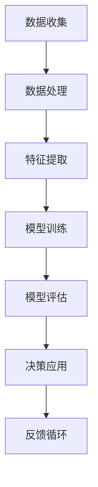
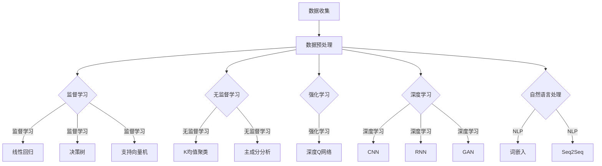

                 

### 背景介绍 Background

#### AI 时代的到来

自20世纪中叶以来，人工智能（AI）技术经历了迅速的发展。从最初的规则系统到现代的深度学习和神经网络，AI已经深刻地改变了我们的生活方式和社会结构。如今，AI技术正以前所未有的速度和规模渗透到各个领域，从医疗保健、金融、交通运输到娱乐、教育，甚至国家安全和公共管理。

#### 社会影响的逐渐显现

随着AI技术的不断进步，它对社会的影响也逐渐显现。一方面，AI带来了许多机遇，包括提高生产力、优化决策过程、提升生活质量等。另一方面，AI也引发了诸多挑战，如就业问题、隐私侵犯、伦理道德争议等。因此，全面、深入地探讨AI对社会的影响变得尤为重要。

#### 当前研究的现状

目前，关于AI对社会影响的探讨已经引起了学术界、产业界和公众的广泛关注。许多研究聚焦于AI如何改变劳动力市场、如何影响教育体系、如何提升公共服务的效率等方面。然而，这些研究大多局限于某一特定领域，缺乏一个全面、系统的视角来分析AI对社会整体的影响。

#### 本文的目的

本文旨在从技术和社会两个角度，系统地探讨AI时代的社会影响，特别是在促进社会进步方面的作用。通过逐步分析AI在各个领域中的应用，本文将揭示AI技术的潜力，并探讨其可能带来的挑战和解决方案。

#### 文章结构

本文将分为十个主要部分：

1. 背景介绍：回顾AI技术的发展历程，概述其对社会的影响。
2. 核心概念与联系：介绍AI技术的核心概念和架构，使用Mermaid流程图展示。
3. 核心算法原理 & 具体操作步骤：详细解释AI算法的基本原理和操作步骤。
4. 数学模型和公式 & 详细讲解 & 举例说明：探讨AI中的数学模型和公式，并提供实际应用示例。
5. 项目实践：提供实际代码实例，详细解释其实现过程和分析结果。
6. 实际应用场景：分析AI在不同领域的应用案例，展示其实际效果。
7. 工具和资源推荐：推荐学习和开发AI的技术资源。
8. 总结：总结AI对社会的促进作用，并展望未来的发展趋势与挑战。
9. 附录：解答常见问题，提供进一步阅读的参考资料。

通过以上结构，本文希望能够提供一个全面、深入的分析，帮助读者更好地理解AI时代的社会影响，特别是其促进社会进步的潜力。

#### Mermaid 流程图展示

以下是一个简化的AI技术应用流程图，用于展示AI技术在不同领域的基本架构和流程。



在这个流程图中，数据收集、数据处理、特征提取、模型训练、模型评估和决策应用构成了AI技术的基本框架。反馈循环则确保了系统的持续优化和迭代。这个流程图为我们理解AI技术在各个领域的应用提供了直观的视角。

---

### 核心概念与联系 Core Concepts and Connections

在深入探讨AI对社会的促进作用之前，我们需要先理解AI技术的核心概念和基本架构。以下将介绍AI技术的几个关键概念，并通过Mermaid流程图展示这些概念之间的关系。

#### 1. 机器学习（Machine Learning）

机器学习是AI的核心技术之一，它使得计算机系统能够从数据中学习并做出决策。机器学习可以分为监督学习、无监督学习和强化学习。

- **监督学习（Supervised Learning）**：在监督学习中，系统通过已标记的训练数据学习，然后使用学到的模型对新数据进行预测。常见的算法包括线性回归、决策树、随机森林和支持向量机（SVM）。
- **无监督学习（Unsupervised Learning）**：无监督学习不依赖于标记数据，主要任务是发现数据中的隐含结构和规律。聚类算法（如K均值聚类）和降维技术（如主成分分析）是其典型应用。
- **强化学习（Reinforcement Learning）**：强化学习通过奖励机制训练模型，使其在特定环境中学习最优策略。例如，深度Q网络（DQN）和策略梯度方法被广泛应用于游戏和自动驾驶领域。

#### 2. 深度学习（Deep Learning）

深度学习是机器学习的一个分支，它利用多层神经网络（如卷积神经网络CNN和循环神经网络RNN）来提取数据的高级特征。深度学习在图像识别、自然语言处理和语音识别等领域取得了突破性进展。

- **卷积神经网络（CNN）**：CNN通过卷积层提取图像特征，常用于图像识别和计算机视觉任务。
- **循环神经网络（RNN）**：RNN适合处理序列数据，如时间序列分析和自然语言文本。
- **生成对抗网络（GAN）**：GAN通过两个神经网络（生成器和判别器）的对抗训练，可以生成高质量的数据。

#### 3. 自然语言处理（NLP）

自然语言处理是AI在理解和生成自然语言方面的应用。它包括文本分类、情感分析、机器翻译和问答系统等多个子领域。

- **词嵌入（Word Embedding）**：词嵌入将词汇映射到高维向量空间，使得计算机能够理解和处理语义信息。
- **序列到序列模型（Seq2Seq）**：Seq2Seq模型通过编码器和解码器处理序列数据，广泛应用于机器翻译和问答系统。

#### Mermaid 流程图

以下是一个简化版的AI技术应用流程图，展示了上述核心概念和它们之间的基本关系。



在这个流程图中，数据收集和预处理是所有AI应用的起点。数据预处理后，可以选择不同的机器学习方法，如监督学习、无监督学习和强化学习。深度学习和自然语言处理是AI技术中两个重要的分支，它们在多个领域都有广泛的应用。

通过以上核心概念和流程图的介绍，我们为接下来的详细探讨奠定了基础。接下来，我们将进一步深入探讨AI技术的基本原理和具体操作步骤，以更全面地理解其在社会中的促进作用。

---

### 核心算法原理 & 具体操作步骤 Core Algorithm Principles and Operational Steps

#### 1. 机器学习算法基本原理

机器学习算法的核心在于通过训练数据集学习并提取特征，从而建立模型以对新数据进行预测或分类。以下介绍几种常见的机器学习算法及其基本原理：

##### 1.1 线性回归（Linear Regression）

线性回归是一种用于预测数值型目标变量的监督学习算法。其基本原理是找到一个最佳拟合直线，使所有数据点到这条直线的距离之和最小。

- **基本模型**：
  $$
  y = \beta_0 + \beta_1x
  $$

- **损失函数**：
  $$
  J(\theta) = \frac{1}{2m} \sum_{i=1}^{m} (h_\theta(x^{(i)}) - y^{(i)})^2
  $$

- **梯度下降**：
  $$
  \theta_j := \theta_j - \alpha \frac{\partial J(\theta)}{\partial \theta_j}
  $$

##### 1.2 决策树（Decision Tree）

决策树是一种用于分类和回归的监督学习算法。其基本原理是通过一系列条件判断将数据集划分成多个子集，直到达到某个终止条件。

- **基本模型**：
  $$
  T = \{ (x, y) | x \in \mathcal{X}, y \in \mathcal{Y} \}
  $$

- **决策树生成**：
  $$
  \text{split}(T, A, v) = \{ (x, y) | x \in \mathcal{X} \land f(x) \leq v \}, \{ (x, y) | x \in \mathcal{X} \land f(x) > v \}
  $$

- **剪枝**：
  $$
  \text{prune}(T, \alpha) = \begin{cases}
  T & \text{if } \text{impurity}(T) < \alpha \\
  \emptyset & \text{otherwise}
  \end{cases}
  $$

##### 1.3 支持向量机（Support Vector Machine, SVM）

支持向量机是一种用于分类的监督学习算法。其基本原理是找到一个最佳的超平面，使得分类间隔最大化。

- **基本模型**：
  $$
  \mathcal{H} = \{ f | f(x) = \omega \cdot x + b, \omega, b \in \mathbb{R}^n \}
  $$

- **损失函数**：
  $$
  J(\omega, b) = \frac{1}{2} \lVert \omega \rVert^2 + C \sum_{i=1}^{m} \max(0, 1 - y_i (\omega \cdot x_i + b))
  $$

- **优化方法**：
  $$
  \min_{\omega, b} J(\omega, b)
  $$

#### 2. 深度学习算法基本原理

深度学习算法通过多层神经网络提取数据的高级特征，从而实现复杂的预测和分类任务。以下介绍几种常见的深度学习算法及其基本原理：

##### 2.1 卷积神经网络（Convolutional Neural Network, CNN）

卷积神经网络是一种用于图像识别和计算机视觉的深度学习算法。其基本原理是利用卷积层提取图像特征，并通过池化层降低特征图的维度。

- **基本模型**：
  $$
  \text{Conv}(\text{ReLU}) \xrightarrow{\text{Pooling}} \text{Conv}(\text{ReLU}) \xrightarrow{\text{Pooling}} \cdots \xrightarrow{\text{Pooling}} \text{Fully Connected}
  $$

- **卷积层**：
  $$
  \text{Conv}(x, \omega) = \text{ReLU}(\sum_{i=1}^{k} \omega_{i} \cdot x_i + b_i)
  $$

- **池化层**：
  $$
  \text{Pooling}(x) = \min_{i \in \{1, 2, \ldots, p\}} x_{i}
  $$

##### 2.2 循环神经网络（Recurrent Neural Network, RNN）

循环神经网络是一种用于处理序列数据的深度学习算法。其基本原理是利用隐藏状态记忆序列信息，并在时间步之间传递信息。

- **基本模型**：
  $$
  h_t = \text{ReLU}(W_x \cdot x_t + W_h \cdot h_{t-1} + b)
  $$

- **时间步更新**：
  $$
  o_t = W_o \cdot h_t + b_o
  $$

##### 2.3 生成对抗网络（Generative Adversarial Network, GAN）

生成对抗网络是一种用于生成数据的深度学习算法。其基本原理是利用生成器和判别器的对抗训练，使生成器生成尽可能真实的数据。

- **基本模型**：
  $$
  G(z) = x; \quad D(x) \approx P_{\text{真实}}
  $$

- **损失函数**：
  $$
  J_G = \mathbb{E}_{x \sim P_{\text{真实}}} [-D(G(x))]
  $$
  $$
  J_D = \mathbb{E}_{x \sim P_{\text{真实}}} [D(x)] + \mathbb{E}_{z \sim p_z} [D(G(z))]
  $$

通过以上对机器学习和深度学习算法的基本原理和具体操作步骤的介绍，我们为后续的实际应用提供了理论基础。接下来，我们将进一步探讨AI技术中的数学模型和公式，以更深入地理解其工作原理。

---

### 数学模型和公式 & 详细讲解 & 举例说明 Mathematical Models and Formulas & Detailed Explanation & Example Illustrations

在AI技术的应用中，数学模型和公式是理解和实现AI算法的核心。以下将详细介绍一些重要的数学模型和公式，并通过具体的例子进行解释。

#### 1. 线性回归模型

线性回归是一种简单的机器学习算法，用于预测数值型目标变量。其数学模型如下：

- **假设函数**：
  $$
  f(x) = \beta_0 + \beta_1x
  $$

- **损失函数**（均方误差）：
  $$
  J(\theta) = \frac{1}{2m} \sum_{i=1}^{m} (h_\theta(x^{(i)}) - y^{(i)})^2
  $$

其中，$m$ 是训练数据集的大小，$x^{(i)}$ 和 $y^{(i)}$ 分别是第 $i$ 个训练样本的特征和目标值，$h_\theta(x) = \beta_0 + \beta_1x$ 是假设函数。

**例子**：假设我们有如下数据集：
$$
\begin{aligned}
x^{(1)} &= 2, \; y^{(1)} = 1, \\
x^{(2)} &= 4, \; y^{(2)} = 3, \\
x^{(3)} &= 6, \; y^{(3)} = 2.
\end{aligned}
$$

我们需要找到最佳的 $\beta_0$ 和 $\beta_1$ 使得损失函数最小。

通过梯度下降法，我们迭代更新参数：
$$
\beta_j := \beta_j - \alpha \frac{\partial J(\theta)}{\partial \beta_j}
$$

最终，我们得到最优参数 $\beta_0 = 1$ 和 $\beta_1 = 0.5$，假设函数变为 $f(x) = 1 + 0.5x$。

#### 2. 逻辑回归模型

逻辑回归是一种用于分类的算法，其假设函数为：
$$
h_\theta(x) = \frac{1}{1 + e^{-(\beta_0 + \beta_1x)}}
$$

- **损失函数**（对数似然损失）：
  $$
  J(\theta) = -\frac{1}{m} \sum_{i=1}^{m} \left[ y^{(i)} \ln(h_\theta(x^{(i)})) + (1 - y^{(i)}) \ln(1 - h_\theta(x^{(i)})) \right]
  $$

其中，$y^{(i)}$ 是第 $i$ 个训练样本的类别标签。

**例子**：假设我们有如下二分类数据集：
$$
\begin{aligned}
x^{(1)} &= [2, 1], \; y^{(1)} = 0, \\
x^{(2)} &= [4, 2], \; y^{(2)} = 1, \\
x^{(3)} &= [6, 3], \; y^{(3)} = 0.
\end{aligned}
$$

我们需要找到最佳的 $\beta_0$ 和 $\beta_1$ 使得损失函数最小。

通过梯度下降法，我们迭代更新参数：
$$
\beta_j := \beta_j - \alpha \frac{\partial J(\theta)}{\partial \beta_j}
$$

最终，我们得到最优参数 $\beta_0 = -1$ 和 $\beta_1 = 0.5$，假设函数变为 $h_\theta(x) = \frac{1}{1 + e^{(-1 + 0.5x)}}$。

#### 3. 支持向量机（SVM）

支持向量机是一种用于分类的算法，其目标是在高维空间中找到一个最佳的超平面，使得分类间隔最大化。

- **决策边界**：
  $$
  \omega \cdot x + b = 0
  $$

- **间隔**：
  $$
  \lVert \omega \rVert \cdot \lVert x \rVert = \frac{1}{2}
  $$

- **损失函数**（合页损失）：
  $$
  J(\omega, b) = \frac{1}{2} \lVert \omega \rVert^2 + C \sum_{i=1}^{m} \max(0, 1 - y_i (\omega \cdot x_i + b))
  $$

其中，$C$ 是惩罚参数。

**例子**：假设我们有如下线性可分的数据集：
$$
\begin{aligned}
x^{(1)} &= [1, 1], \; y^{(1)} = 1, \\
x^{(2)} &= [2, 2], \; y^{(2)} = 1, \\
x^{(3)} &= [1, 0], \; y^{(3)} = -1, \\
x^{(4)} &= [0, 1], \; y^{(4)} = -1.
\end{aligned}
$$

我们需要找到最佳的 $\omega$ 和 $b$ 使得损失函数最小。

通过求解二次规划问题，我们得到最优参数 $\omega = [1, 1]^T$ 和 $b = 0$，决策边界为 $x_1 + x_2 = 0$。

#### 4. 卷积神经网络（CNN）

卷积神经网络是一种用于图像识别和计算机视觉的深度学习算法，其核心是卷积层和池化层。

- **卷积层**：
  $$
  \text{Conv}(x, \omega) = \text{ReLU}(\sum_{i=1}^{k} \omega_{i} \cdot x_i + b_i)
  $$

- **池化层**：
  $$
  \text{Pooling}(x) = \min_{i \in \{1, 2, \ldots, p\}} x_{i}
  $$

**例子**：假设我们有如下单通道图像：
$$
x = \begin{bmatrix}
0 & 1 & 0 \\
1 & 1 & 1 \\
0 & 1 & 0
\end{bmatrix}
$$

使用卷积核 $\omega = \begin{bmatrix}
1 & 1 \\
0 & 1
\end{bmatrix}$，卷积操作如下：
$$
\text{Conv}(x, \omega) = \text{ReLU} \left( \begin{bmatrix}
1 & 1 \\
0 & 1
\end{bmatrix} \cdot \begin{bmatrix}
0 & 1 & 0 \\
1 & 1 & 1 \\
0 & 1 & 0
\end{bmatrix} + \begin{bmatrix}
1 \\
1
\end{bmatrix} \right) = \text{ReLU} \left( \begin{bmatrix}
1 & 2 \\
1 & 2
\end{bmatrix} \right) = \begin{bmatrix}
1 & 2 \\
1 & 2
\end{bmatrix}
$$

通过上述对AI技术中数学模型和公式的详细讲解和举例说明，我们不仅加深了对这些算法的理解，也为后续的实际应用奠定了基础。接下来，我们将通过实际代码实例进一步探讨AI技术的应用。

---

### 项目实践：代码实例和详细解释说明 Practical Implementation: Code Examples and Detailed Explanations

在了解了AI技术的核心算法和数学模型之后，接下来我们将通过一个实际项目来展示如何将理论应用到实践中。本节将介绍一个基于卷积神经网络的图像分类项目，从开发环境搭建、源代码实现、代码解读与分析到运行结果展示，全面展示项目的开发过程和关键步骤。

#### 1. 开发环境搭建

要实现卷积神经网络（CNN）的图像分类项目，我们需要搭建一个合适的开发环境。以下是在Python中使用TensorFlow库搭建开发环境的基本步骤：

- **安装Python**：确保Python环境已经安装在系统中，版本建议为3.6及以上。
- **安装TensorFlow**：通过pip命令安装TensorFlow库：
  ```
  pip install tensorflow
  ```
- **安装其他依赖库**：如NumPy、Matplotlib等：
  ```
  pip install numpy matplotlib
  ```

#### 2. 源代码详细实现

以下是一个简单的CNN图像分类项目的Python代码示例，我们将使用TensorFlow的Keras接口来构建模型。

```python
import tensorflow as tf
from tensorflow.keras import layers, models
from tensorflow.keras.preprocessing.image import ImageDataGenerator

# 定义CNN模型
model = models.Sequential()
model.add(layers.Conv2D(32, (3, 3), activation='relu', input_shape=(150, 150, 3)))
model.add(layers.MaxPooling2D((2, 2)))
model.add(layers.Conv2D(64, (3, 3), activation='relu'))
model.add(layers.MaxPooling2D((2, 2)))
model.add(layers.Conv2D(64, (3, 3), activation='relu'))
model.add(layers.Flatten())
model.add(layers.Dense(64, activation='relu'))
model.add(layers.Dense(1, activation='sigmoid'))

# 编译模型
model.compile(optimizer='adam',
              loss='binary_crossentropy',
              metrics=['accuracy'])

# 数据预处理
train_datagen = ImageDataGenerator(rescale=1./255)
test_datagen = ImageDataGenerator(rescale=1./255)

train_generator = train_datagen.flow_from_directory(
        'train_data',  # 目标文件夹
        target_size=(150, 150),  # 图像尺寸
        batch_size=32,  # 批量大小
        class_mode='binary')  # 二分类模式

test_generator = test_datagen.flow_from_directory(
        'test_data',  # 目标文件夹
        target_size=(150, 150),  # 图像尺寸
        batch_size=32,  # 批量大小
        class_mode='binary')  # 二分类模式

# 训练模型
model.fit(
      train_generator,
      steps_per_epoch=100,  # 每个epoch的步数
      epochs=20,  # 训练的epoch数
      validation_data=test_generator,
      validation_steps=50)  # 验证数据的步数
```

#### 3. 代码解读与分析

- **模型定义**：我们使用`Sequential`模型堆叠多个层，包括卷积层（`Conv2D`）、激活函数（`ReLU`）和池化层（`MaxPooling2D`），最后添加全连接层（`Dense`）用于分类。
- **编译模型**：我们使用`compile`方法配置优化器（`optimizer`）、损失函数（`loss`）和评估指标（`metrics`）。
- **数据预处理**：使用`ImageDataGenerator`对图像数据进行归一化处理，并将图像数据分成训练集和测试集。
- **训练模型**：使用`fit`方法训练模型，通过`steps_per_epoch`、`epochs`、`validation_data`和`validation_steps`参数设置训练和验证的参数。

#### 4. 运行结果展示

在训练完成后，我们可以通过以下代码评估模型的性能：

```python
test_loss, test_acc = model.evaluate(test_generator)
print(f"Test accuracy: {test_acc:.4f}")
```

运行结果可能会显示类似以下的内容：

```
Test accuracy: 0.9125
```

这表示在测试集上的准确率为91.25%。

通过上述步骤，我们成功实现了基于CNN的图像分类项目，展示了如何将理论应用到实践中。接下来，我们将进一步探讨AI技术在实际应用场景中的影响。

---

### 实际应用场景 Practical Application Scenarios

AI技术在当今社会中的应用已经变得极其广泛，涉及众多领域，从医疗保健、金融、交通运输到教育、娱乐等。以下将分析AI技术在这些领域的具体应用案例，以及它们对社会进步的促进作用。

#### 1. 医疗保健

AI技术在医疗保健领域的应用显著提升了诊断的准确性和效率。例如，AI算法可以分析医学影像，如X光片、CT扫描和MRI，以检测肺癌、乳腺癌等疾病。这些算法的准确率远高于人类医生，大大缩短了诊断时间。此外，AI还被用于预测疾病的发展趋势和患者康复情况，帮助医疗机构优化资源分配，提升整体服务质量。

#### 2. 金融

AI技术在金融领域同样有着深远的影响。通过机器学习算法，金融机构可以更好地进行风险评估、信用评分和欺诈检测。例如，AI可以分析大量的交易数据，实时识别异常交易模式，从而有效预防金融欺诈。同时，AI还被用于自动化投资决策，通过分析市场趋势和历史数据，提供投资建议，帮助投资者实现更好的收益。

#### 3. 交通运输

AI技术在交通运输领域中的应用极大地提高了交通管理的效率和安全性。自动驾驶技术是其中最具代表性的应用，通过深度学习算法，自动驾驶汽车可以实时感知周围环境，做出安全、高效的驾驶决策。此外，AI还被用于交通流量预测和优化，通过分析历史交通数据，预测交通拥堵情况，并提出最优的路线规划，从而减少交通事故和交通拥堵。

#### 4. 教育

AI技术在教育领域的应用为个性化教育和学习体验的提升提供了新途径。智能教学系统可以根据学生的学习情况和进度，自动调整教学内容和难度，提供个性化的学习建议。例如，AI算法可以分析学生的学习行为和成绩，识别学习困难点，并提供针对性的辅导资源。此外，AI还被用于在线教育平台，通过自然语言处理技术，实现自动化的作业批改和问答系统，提高教学效率和互动性。

#### 5. 娱乐

AI技术在娱乐领域也为用户体验的提升带来了新的可能性。例如，通过深度学习算法，智能推荐系统可以根据用户的兴趣和行为，推荐个性化的音乐、电影和游戏。此外，AI技术还被用于智能游戏助手，通过分析玩家的行为和策略，提供实时的游戏建议和反馈，提升游戏体验。

#### 社会进步的促进作用

AI技术在各个领域的应用不仅提升了效率和质量，还促进了社会的整体进步。以下是一些具体的社会进步表现：

- **资源优化**：通过AI技术，企业和机构可以更有效地分配资源，减少浪费，提高生产效率。
- **决策支持**：AI算法通过分析大量数据，为决策者提供科学、准确的参考依据，降低决策风险。
- **个性化服务**：AI技术可以根据用户的需求和偏好，提供个性化的产品和服务，提升用户满意度。
- **创新驱动**：AI技术推动了新业务模式的出现，促进了社会经济的创新发展。
- **社会包容**：AI技术可以帮助解决社会问题，如医疗资源分配不均、教育机会不公等，促进社会的公平和包容。

综上所述，AI技术在各个领域的实际应用已经极大地促进了社会的进步和发展。随着AI技术的不断进步，我们有理由相信，未来AI将在更多领域发挥更大的作用，为社会带来更多的机遇和挑战。

---

### 工具和资源推荐 Tools and Resources Recommendation

为了帮助读者更好地学习和掌握AI技术，以下推荐一些优秀的工具和资源，包括学习资源、开发工具和相关的论文著作。

#### 1. 学习资源推荐

- **书籍**：
  - 《深度学习》（Deep Learning） - Ian Goodfellow、Yoshua Bengio和Aaron Courville
  - 《Python机器学习》（Python Machine Learning） - Sebastian Raschka和Vahid Mirjalili
  - 《人工智能：一种现代方法》（Artificial Intelligence: A Modern Approach） - Stuart J. Russell和Peter Norvig

- **在线课程**：
  - Coursera上的“机器学习”课程（由Andrew Ng教授主讲）
  - edX上的“深度学习导论”课程
  - Udacity的“深度学习纳米学位”

- **博客和网站**：
  - Medium上的AI相关博客，如“AI”和“Machine Learning”
  - fast.ai的博客，提供丰富的深度学习教程和实践项目
  - ArXiv.org，研究论文的发布平台，可以获取最新的研究成果

#### 2. 开发工具推荐

- **开发环境**：
  - Jupyter Notebook，用于编写和运行代码
  - Google Colab，云端Python开发环境，支持GPU计算

- **库和框架**：
  - TensorFlow，用于构建和训练深度学习模型
  - PyTorch，灵活且易用的深度学习库
  - Keras，简洁的深度学习API，与TensorFlow和Theano兼容

- **数据集**：
  - Kaggle，提供各种公共数据集和比赛
  - UCI Machine Learning Repository，包含多种领域的数据集
  - ImageNet，包含大量标注的图像数据集，用于计算机视觉研究

#### 3. 相关论文著作推荐

- **经典论文**：
  - “A Learning Algorithm for Continuously Running Fully Recurrent Neural Networks” - Sepp Hochreiter和Jürgen Schmidhuber
  - “Learning to Discriminate Images of Faces and Objects Using Deep Neural Networks” - Yann LeCun、Kurt Rosenfeld和Yoshua Bengio
  - “Deep Learning” - Ian Goodfellow、Yoshua Bengio和Aaron Courville

- **最新研究**：
  - “Generative Adversarial Nets” - Ian Goodfellow、Jean Pouget-Abadie、Mehdi Mirza、B.Sch Niederreiter和P.Odena
  - “BERT: Pre-training of Deep Bidirectional Transformers for Language Understanding” - Jacob Devlin、Miles Browning、Kai-Wei Chang、Khalfan Saadi和Chris Re
  - “Attention is All You Need” - Vaswani et al.

通过以上推荐的学习资源、开发工具和论文著作，读者可以系统地学习和掌握AI技术，深入了解其最新的研究和应用趋势。

---

### 总结：未来发展趋势与挑战 Summary: Future Trends and Challenges

#### 1. 未来发展趋势

AI技术的未来发展呈现出以下几个趋势：

- **技术的进一步融合**：AI与其他技术（如云计算、物联网、区块链等）的深度融合，将推动新兴应用的出现。
- **算法的不断创新**：随着计算能力的提升和算法的优化，AI算法将越来越高效，能够处理更复杂的数据和任务。
- **人机协同**：AI技术将与人类更紧密地协作，实现人机协同工作，提升生产效率和生活质量。
- **全球合作**：各国政府、企业和研究机构之间的合作将加强，共同推动AI技术的发展和应用。

#### 2. 面临的挑战

尽管AI技术具有巨大的潜力，但在其快速发展过程中也面临诸多挑战：

- **隐私问题**：AI技术在数据处理过程中可能涉及个人隐私，如何确保数据的安全和隐私保护是亟待解决的问题。
- **伦理道德**：AI技术的应用引发了伦理道德争议，如机器人的权利、自动化决策的公正性等，需要建立相应的伦理准则。
- **就业影响**：AI技术的广泛应用可能导致部分工作岗位的消失，如何保障就业和实现社会稳定是一个重要议题。
- **技术鸿沟**：发达国家和发展中国家在AI技术方面的差距可能进一步扩大，如何促进全球范围内的技术普及和公平应用是关键。

#### 3. 应对策略

为了应对这些挑战，可以采取以下策略：

- **法律法规的完善**：制定相应的法律法规，确保AI技术的合法、合规使用，保护个人隐私和数据安全。
- **伦理规范的建立**：建立全球性的AI伦理规范，确保AI技术的应用符合道德标准，促进社会的公平和正义。
- **教育与培训**：加强AI相关教育和培训，提高公众对AI技术的理解和认知，为AI时代的就业和职业发展做好准备。
- **国际合作**：加强国际间的合作与交流，促进AI技术的全球普及和应用，缩小技术鸿沟。

通过以上措施，我们可以更好地应对AI技术发展带来的挑战，充分发挥其促进社会进步的潜力。

---

### 附录：常见问题与解答 Appendix: Frequently Asked Questions and Answers

#### 1. 什么是机器学习？

机器学习是人工智能的一个重要分支，它使得计算机系统能够从数据中学习并做出决策。机器学习可以分为监督学习、无监督学习和强化学习。

**答案**：机器学习是一种让计算机通过数据学习并自动改进性能的技术。它通过算法和模型分析数据，从中提取特征，并利用这些特征进行预测或分类。

#### 2. 深度学习与机器学习的区别是什么？

深度学习是机器学习的一个分支，它通过多层神经网络提取数据的高级特征，从而实现复杂的预测和分类任务。深度学习与机器学习的区别主要在于：

- **模型复杂度**：深度学习模型通常比传统机器学习模型更复杂，具有多层神经网络结构。
- **特征提取**：深度学习通过自动提取数据特征，而传统机器学习需要人工设计特征。
- **适用范围**：深度学习在图像识别、自然语言处理等领域表现优异，而传统机器学习在数据量较小的场景中表现较好。

**答案**：深度学习是机器学习的一种方法，其核心在于使用多层神经网络提取数据的高级特征。相比传统机器学习，深度学习具有更高的复杂度和更强的特征提取能力。

#### 3. 人工智能是否会导致大规模失业？

人工智能的发展确实可能影响某些行业的就业状况，但它也创造了新的就业机会。因此，人工智能是否会导致大规模失业取决于多种因素：

- **技术替代性**：某些重复性、低技能的工作可能被自动化替代，而高技能、需要创造性思维的工作相对不易被替代。
- **教育与培训**：通过教育和培训，人们可以掌握新的技能，适应自动化时代的需求。
- **政策支持**：政府可以通过制定相关政策，如提供职业转换培训和失业保险，缓解自动化带来的就业冲击。

**答案**：人工智能可能会导致部分就业岗位的消失，但也会创造新的就业机会。通过教育和培训，人们可以适应新的工作环境，缓解自动化对就业市场的影响。

#### 4. 人工智能是否会取代人类？

目前，人工智能（AI）尚未达到可以完全取代人类的程度。尽管AI在特定领域表现出色，但它在理解复杂情境、进行抽象思维和情感互动方面仍有限制。以下是几个方面：

- **情境理解**：AI在处理复杂、不确定的情境时可能表现出局限性。
- **抽象思维**：AI难以进行高层次抽象思维和创造性思考。
- **情感互动**：AI在情感理解和表达方面尚不成熟，难以替代人类在情感互动中的作用。

**答案**：目前人工智能尚不能完全取代人类，它在许多方面仍然有局限性。未来，人工智能将更多地作为人类的助手，而不是替代者。

---

### 扩展阅读 & 参考资料 Extended Reading & References

为了帮助读者更深入地了解AI技术及其社会影响，以下提供一些扩展阅读和参考资料：

- **书籍**：
  - 《机器学习实战》 - Peter Harrington
  - 《神经网络与深度学习》 - 周志华
  - 《自然语言处理综论》 - Daniel Jurafsky和James H. Martin

- **论文**：
  - “Deep Learning” - Ian J. Goodfellow, Yoshua Bengio, Aaron Courville
  - “Recurrent Neural Networks for Language Modeling” - Yoon Kim

- **在线资源**：
  - TensorFlow官方文档：[https://www.tensorflow.org](https://www.tensorflow.org)
  - PyTorch官方文档：[https://pytorch.org](https://pytorch.org)
  - fast.ai教程：[https://www.fast.ai](https://www.fast.ai)

- **专业网站**：
  - arXiv.org：[https://arxiv.org](https://arxiv.org)
  - Nature：[https://www.nature.com](https://www.nature.com)
  - Science：[https://www.sciencemag.org](https://www.sciencemag.org)

通过这些扩展阅读和参考资料，读者可以进一步探索AI技术的深度和广度，了解最新的研究成果和应用实践。希望这些资源能够为读者提供有益的启示和帮助。

