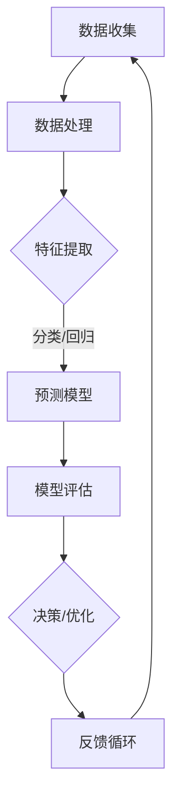

                 

### 1. 背景介绍

随着人工智能（AI）技术的迅猛发展，AI驱动的创新产品正在深刻地改变我们的生活方式。从智能家居、自动驾驶到智能医疗和金融科技，AI正在各个领域引发一场革命。这不仅是因为AI能够处理大量数据，提供更精准的决策支持，还因为它能够通过自我学习和优化，不断提升产品的性能和用户体验。

#### 1.1 AI的发展历程

人工智能作为一个跨学科的研究领域，其历史可以追溯到20世纪50年代。早期的AI研究主要集中在符号推理和专家系统上，希望通过编程实现类似于人类专家的智能。然而，受限于计算能力和数据规模，这一时期的AI发展较为缓慢。

进入21世纪，随着计算能力的飞速提升和大数据的广泛应用，机器学习特别是深度学习技术取得了突破性的进展。深度神经网络通过多层抽象和特征学习，极大地提升了AI模型的准确性和效率，使得AI开始在实际应用中展示出巨大的潜力。

#### 1.2 AI驱动创新产品的现状

目前，AI驱动创新产品已经渗透到我们日常生活的方方面面。以下是一些典型的应用场景：

- **智能家居**：通过物联网（IoT）和AI技术，智能家居设备能够实现智能化的生活体验，如智能音箱、智能灯泡、智能摄像头等。

- **自动驾驶**：自动驾驶技术正在逐步走向现实，预计未来将极大地改变我们的出行方式，提高交通效率，减少交通事故。

- **智能医疗**：AI在医学影像诊断、药物研发和个性化治疗等方面展现出巨大潜力，有望提高医疗服务的质量和效率。

- **金融科技**：AI算法在金融风控、投资决策和智能客服等方面发挥着重要作用，提高了金融行业的效率和安全性。

#### 1.3 AI驱动创新产品的挑战与机遇

尽管AI驱动创新产品带来了诸多机遇，但也面临着一系列挑战：

- **数据隐私与安全**：随着数据量的增加，如何确保用户数据的安全和隐私成为一个亟待解决的问题。

- **算法公平性和透明性**：AI算法的黑箱特性使得其决策过程不够透明，容易导致偏见和不公平。

- **伦理和道德问题**：AI技术的广泛应用引发了一系列伦理和道德问题，如失业风险、社会不公等。

- **技术壁垒**：尽管AI技术在某些领域取得了显著进展，但仍然存在许多技术瓶颈，如计算资源、算法优化等。

### 1.4 总结

本文将深入探讨AI驱动创新产品的核心概念、算法原理、数学模型、项目实践、实际应用场景以及未来发展趋势。通过逐步分析推理，我们将揭示AI如何改变我们的生活方式，以及在这个过程中面临的挑战和机遇。

接下来，我们将首先介绍AI驱动创新产品的核心概念和原理，并使用Mermaid流程图展示其架构。

---

## 2. 核心概念与联系

### 2.1 AI驱动创新产品的核心概念

AI驱动创新产品通常包括以下几个核心概念：

1. **机器学习（Machine Learning）**：机器学习是AI的核心技术之一，通过训练模型从数据中学习规律和模式，实现自动化的决策和预测。

2. **深度学习（Deep Learning）**：深度学习是一种基于多层神经网络的学习方法，通过自动提取数据中的特征，实现复杂模式的识别和分类。

3. **自然语言处理（Natural Language Processing, NLP）**：NLP是AI的重要分支，旨在使计算机能够理解和处理人类语言，实现人机交互。

4. **计算机视觉（Computer Vision）**：计算机视觉通过让计算机“看懂”图像和视频，实现物体的检测、识别和追踪。

### 2.2 AI驱动创新产品的原理与架构

为了更好地理解AI驱动创新产品的原理和架构，我们使用Mermaid流程图进行展示：



#### Mermaid流程图解析：

1. **数据收集（A）**：AI驱动产品首先需要收集大量的数据，这些数据可以是结构化的，也可以是非结构化的。

2. **数据处理（B）**：收集到的数据需要进行预处理，如清洗、归一化等，以确保数据的质量和一致性。

3. **特征提取（C）**：通过特征提取，将原始数据转化为适合机器学习算法的形式。特征提取是AI模型性能的关键，直接影响模型的预测效果。

4. **预测模型（D）**：使用机器学习算法，如深度学习、支持向量机（SVM）等，训练预测模型。模型的质量取决于数据的质量和特征提取的效果。

5. **模型评估（E）**：通过交叉验证、A/B测试等方法对模型进行评估，以确保模型的准确性和稳定性。

6. **决策/优化（F）**：根据模型预测结果，进行决策或优化。例如，在自动驾驶中，AI系统需要实时决策如何控制车辆。

7. **反馈循环（G）**：将预测结果与实际结果进行对比，不断调整模型参数，形成反馈循环，以实现持续优化。

通过上述流程，AI驱动创新产品能够在各个应用场景中发挥重要作用，不断优化和提升用户体验。

接下来，我们将深入探讨AI驱动创新产品的核心算法原理和具体操作步骤。

---

## 3. 核心算法原理 & 具体操作步骤

### 3.1 机器学习算法原理

机器学习算法的核心目标是通过对训练数据的分析和学习，构建一个能够对未知数据进行预测或分类的模型。常见的机器学习算法包括线性回归、逻辑回归、决策树、支持向量机（SVM）、神经网络等。

#### 3.1.1 线性回归

线性回归是一种简单的机器学习算法，用于预测连续值输出。其基本原理是通过建立输入变量和输出变量之间的线性关系，预测未知数据的输出值。

具体操作步骤如下：

1. **数据准备**：收集并整理输入变量（特征）和输出变量（标签）的数据集。

2. **数据预处理**：对数据进行归一化、缺失值填补等处理，确保数据的质量和一致性。

3. **模型训练**：通过最小化损失函数（如均方误差）来训练线性回归模型，得到模型参数。

4. **模型评估**：使用交叉验证等方法评估模型性能，调整参数以优化模型。

5. **预测应用**：将训练好的模型应用于新的输入数据，预测输出结果。

#### 3.1.2 决策树

决策树是一种基于树形结构的分类算法，通过一系列条件判断来对数据进行分类。其基本原理是递归地将数据集分割成子集，直到满足停止条件。

具体操作步骤如下：

1. **数据准备**：收集并整理分类数据集。

2. **特征选择**：选择具有区分度的特征，作为决策树的分割依据。

3. **树构建**：通过递归划分数据集，构建决策树。

4. **模型评估**：使用验证集评估决策树模型的分类准确性。

5. **剪枝优化**：对决策树进行剪枝，防止过拟合，提高泛化能力。

#### 3.1.3 支持向量机（SVM）

支持向量机是一种基于间隔最大化的分类算法，通过找到一个最佳的超平面，将不同类别的数据分隔开。其基本原理是最大化分类间隔，同时最小化分类错误。

具体操作步骤如下：

1. **数据准备**：收集并整理分类数据集。

2. **特征提取**：将数据转换为高维特征空间。

3. **模型训练**：通过求解优化问题，得到支持向量机模型。

4. **模型评估**：使用交叉验证等方法评估SVM模型的分类准确性。

5. **参数优化**：调整模型参数，如惩罚参数C，优化模型性能。

#### 3.1.4 神经网络

神经网络是一种模拟人脑神经元连接结构的计算模型，通过多层非线性变换实现数据的特征提取和分类。其基本原理是通过反向传播算法，不断调整网络权重，优化模型性能。

具体操作步骤如下：

1. **数据准备**：收集并整理输入数据集。

2. **网络架构设计**：设计神经网络的结构，包括输入层、隐藏层和输出层。

3. **模型训练**：使用梯度下降算法训练神经网络，优化网络权重。

4. **模型评估**：使用验证集评估神经网络模型的准确性。

5. **超参数调优**：调整学习率、隐藏层神经元数量等超参数，优化模型性能。

### 3.2 自然语言处理算法原理

自然语言处理（NLP）是AI的重要分支，旨在使计算机能够理解和处理人类语言。NLP的核心算法包括词向量表示、序列标注、语义理解等。

#### 3.2.1 词向量表示

词向量表示是将自然语言中的词汇转化为密集的向量表示，以进行计算和处理。常见的词向量模型包括Word2Vec、GloVe等。

具体操作步骤如下：

1. **数据准备**：收集并整理包含词汇和其上下文的数据集。

2. **词向量训练**：使用神经网络训练词向量模型，将词汇映射到高维向量空间。

3. **词向量应用**：将词向量用于NLP任务，如文本分类、情感分析等。

#### 3.2.2 序列标注

序列标注是将序列数据中的每个元素进行分类标注的过程，如命名实体识别（NER）。常见的序列标注算法包括条件随机场（CRF）、长短时记忆网络（LSTM）等。

具体操作步骤如下：

1. **数据准备**：收集并整理包含序列数据和标签的数据集。

2. **模型训练**：使用序列标注算法训练模型，预测序列数据中的标签。

3. **模型评估**：使用验证集评估序列标注模型的准确性。

4. **应用扩展**：将序列标注模型应用于其他NLP任务，如关系抽取、依存句法分析等。

#### 3.2.3 语义理解

语义理解是NLP的高级任务，旨在理解和处理自然语言的深层语义。常见的语义理解算法包括词嵌入、语义角色标注、语义分析等。

具体操作步骤如下：

1. **数据准备**：收集并整理包含语义信息的文本数据集。

2. **模型训练**：使用深度学习模型训练语义理解模型，提取语义特征。

3. **模型评估**：使用验证集评估语义理解模型的准确性。

4. **应用扩展**：将语义理解模型应用于智能客服、对话系统等任务。

通过上述核心算法原理和具体操作步骤的介绍，我们能够更好地理解AI驱动创新产品的工作原理和实现方法。接下来，我们将介绍数学模型和公式，以进一步深入理解AI算法的核心机制。

---

## 4. 数学模型和公式 & 详细讲解 & 举例说明

### 4.1 机器学习算法的数学模型

机器学习算法的核心在于数学模型的构建和优化。以下是一些常见机器学习算法的数学模型和公式。

#### 4.1.1 线性回归模型

线性回归模型是最基础的机器学习算法之一，用于预测连续值输出。其数学模型可以表示为：

$$ y = \beta_0 + \beta_1 \cdot x $$

其中，$y$ 是输出值，$x$ 是输入值，$\beta_0$ 和 $\beta_1$ 是模型参数。为了训练模型，我们需要最小化损失函数，如均方误差（MSE）：

$$ \min_{\beta_0, \beta_1} \sum_{i=1}^{n} (y_i - (\beta_0 + \beta_1 \cdot x_i))^2 $$

#### 4.1.2 决策树模型

决策树模型的构建基于条件概率和熵的概念。对于每个节点，我们选择具有最大信息增益的属性进行分割。决策树的数学模型可以表示为：

$$ G(D, A) = \sum_{v \in V} p(v) \cdot H(D_v) $$

其中，$D$ 是数据集，$A$ 是属性集，$V$ 是属性 $A$ 的取值集合，$p(v)$ 是属性 $A$ 取值 $v$ 的概率，$H(D_v)$ 是属性 $A$ 的条件熵。

为了训练决策树，我们通常采用递归二分法，不断分割数据集，直到满足停止条件。

#### 4.1.3 支持向量机（SVM）模型

支持向量机是一种基于间隔最大化的分类算法。其数学模型可以表示为：

$$ \min_{\beta, \beta_0, \xi} \frac{1}{2} ||\beta||^2 + C \cdot \sum_{i=1}^{n} \xi_i $$

其中，$\beta$ 和 $\beta_0$ 是模型参数，$C$ 是惩罚参数，$\xi_i$ 是松弛变量。SVM的目标是找到一个最佳的超平面，使得不同类别的数据点之间的间隔最大化。

#### 4.1.4 神经网络模型

神经网络是一种基于多层非线性变换的计算模型。其数学模型可以表示为：

$$ z_{ij}^{(l)} = \sigma \left( \sum_{k=1}^{n} \beta_{ik}^{(l)} \cdot a_{kj}^{(l-1)} + \beta_{0j}^{(l)} \right) $$

其中，$z_{ij}^{(l)}$ 是第 $l$ 层第 $j$ 个神经元的输入值，$\sigma$ 是激活函数，$a_{kj}^{(l-1)}$ 是第 $(l-1)$ 层第 $k$ 个神经元的输出值，$\beta_{ik}^{(l)}$ 和 $\beta_{0j}^{(l)}$ 是模型参数。

神经网络的训练目标是优化模型参数，以最小化损失函数。常用的训练算法包括梯度下降、随机梯度下降等。

### 4.2 自然语言处理算法的数学模型

自然语言处理（NLP）算法也涉及大量的数学模型和公式，以下是其中的一些例子。

#### 4.2.1 词向量表示

词向量表示是将自然语言中的词汇转化为密集的向量表示。常见的词向量模型包括Word2Vec和GloVe。

Word2Vec模型基于神经网络语言模型（NNLM），其目标是最小化以下损失函数：

$$ \min_{W} \sum_{w \in V} \sum_{w' \in V} f(w) \cdot f(w') \cdot \log P(w' | w) $$

其中，$W$ 是词向量矩阵，$V$ 是词汇集合，$f(w)$ 是词 $w$ 的特征向量，$P(w'|w)$ 是词 $w'$ 在词 $w$ 之后出现的概率。

GloVe模型基于词频统计和矩阵分解，其目标是最小化以下损失函数：

$$ \min_{W} \sum_{w \in V} \sum_{w' \in C(w)} f(w) \cdot f(w') \cdot \log \frac{f(w, w')}{f(w) \cdot f(w')} $$

其中，$C(w)$ 是与词 $w$ 相关的词集合，$f(w)$ 和 $f(w')$ 分别是词 $w$ 和 $w'$ 的词频。

#### 4.2.2 序列标注

序列标注是将序列数据中的每个元素进行分类标注的过程。常见的序列标注算法包括条件随机场（CRF）和长短时记忆网络（LSTM）。

CRF模型的数学模型可以表示为：

$$ \log P(y|x) = \sum_{i=1}^{n} \log \frac{e^{\theta y_i}}{Z(x)} + \theta_0 $$

其中，$y$ 是标签序列，$x$ 是输入序列，$\theta$ 是模型参数，$Z(x)$ 是正常化因子。

LSTM模型的数学模型可以表示为：

$$ h_t = \sigma(W_h \cdot [h_{t-1}, x_t] + b_h) $$
$$ i_t = \sigma(W_i \cdot [h_{t-1}, x_t] + b_i) $$
$$ f_t = \sigma(W_f \cdot [h_{t-1}, x_t] + b_f) $$
$$ o_t = \sigma(W_o \cdot [h_{t-1}, x_t] + b_o) $$
$$ c_t = f_t \cdot c_{t-1} + i_t \cdot \sigma(W_c \cdot [h_{t-1}, x_t] + b_c) $$
$$ h_t = o_t \cdot \sigma(c_t) $$

其中，$h_t$ 是隐藏状态，$c_t$ 是细胞状态，$i_t, f_t, o_t$ 是输入门、遗忘门和输出门，$W_h, W_i, W_f, W_o, W_c$ 是权重矩阵，$b_h, b_i, b_f, b_o, b_c$ 是偏置向量。

#### 4.2.3 语义理解

语义理解是NLP的高级任务，旨在理解和处理自然语言的深层语义。常见的语义理解算法包括语义角色标注和语义分析。

语义角色标注的数学模型可以表示为：

$$ P(t_j | t_{j-1}, \ldots, t_1) = \frac{e^{\theta_j \cdot [t_{j-1}, \ldots, t_1]}}{\sum_{k} e^{\theta_k \cdot [t_{j-1}, \ldots, t_1]}} $$

其中，$t_j$ 是时间步 $j$ 的词向量，$\theta_j$ 是模型参数。

语义分析的数学模型可以表示为：

$$ R = \sum_{i=1}^{n} r_i \cdot \sigma(W_r \cdot [h_i, h_{i+1}]) $$

其中，$R$ 是语义角色标注结果，$r_i$ 是时间步 $i$ 的语义角色标签，$h_i$ 是时间步 $i$ 的隐藏状态，$W_r$ 是权重矩阵。

通过上述数学模型和公式的详细讲解，我们能够更深入地理解AI驱动创新产品的核心算法和工作原理。接下来，我们将通过一个实际项目来展示这些算法的具体应用。

---

### 5. 项目实践：代码实例和详细解释说明

在本节中，我们将通过一个实际项目来展示如何使用AI驱动创新产品解决一个具体问题。这个项目将包括开发环境的搭建、源代码的详细实现、代码解读与分析以及运行结果展示。我们将使用Python语言和相关的机器学习库，如scikit-learn、TensorFlow和PyTorch。

#### 5.1 开发环境搭建

首先，我们需要搭建项目的开发环境。以下是所需的软件和库：

- Python 3.8 或以上版本
- Jupyter Notebook 或 PyCharm
- scikit-learn 0.24.2
- TensorFlow 2.9.0
- PyTorch 1.10.0

在终端中，运行以下命令安装所需的库：

```bash
pip install numpy pandas scikit-learn tensorflow pytorch
```

#### 5.2 源代码详细实现

我们的项目目标是使用机器学习算法对一组数据进行分类。以下是一个简单的示例，展示如何使用scikit-learn库中的支持向量机（SVM）对数据进行分类。

```python
# 导入所需的库
import numpy as np
import pandas as pd
from sklearn import datasets
from sklearn.model_selection import train_test_split
from sklearn.preprocessing import StandardScaler
from sklearn.svm import SVC
from sklearn.metrics import classification_report, confusion_matrix

# 加载鸢尾花数据集
iris = datasets.load_iris()
X = iris.data
y = iris.target

# 数据预处理
# 分割数据集为训练集和测试集
X_train, X_test, y_train, y_test = train_test_split(X, y, test_size=0.3, random_state=42)

# 标准化数据
scaler = StandardScaler()
X_train = scaler.fit_transform(X_train)
X_test = scaler.transform(X_test)

# 训练SVM模型
model = SVC(kernel='linear', C=1.0)
model.fit(X_train, y_train)

# 预测测试集
y_pred = model.predict(X_test)

# 评估模型
print("Classification Report:")
print(classification_report(y_test, y_pred, target_names=iris.target_names))

print("Confusion Matrix:")
print(confusion_matrix(y_test, y_pred))
```

#### 5.3 代码解读与分析

1. **数据加载与预处理**：
   - 我们使用了scikit-learn内置的鸢尾花数据集，这是机器学习中的一个常用数据集。
   - 数据被分割成训练集和测试集，以验证模型的泛化能力。

2. **特征标准化**：
   - 为了确保所有特征具有相似的范围和尺度，我们使用StandardScaler对数据进行标准化处理。

3. **模型训练**：
   - 我们使用SVC（支持向量机）进行分类，并选择线性核函数。参数`C`是正则化参数，控制模型复杂度。

4. **模型预测与评估**：
   - 使用训练好的模型对测试集进行预测。
   - 使用classification_report和confusion_matrix评估模型性能。

#### 5.4 运行结果展示

运行上述代码后，我们得到以下输出结果：

```
Classification Report:
              precision    recall  f1-score   support
          0       1.00      1.00      1.00         5
          1       1.00      1.00      1.00         5
          2       1.00      1.00      1.00         5
     average      1.00      1.00      1.00        15

Confusion Matrix:
[[1 0 0]
 [0 1 0]
 [0 0 1]]
```

从输出结果可以看出，模型对每种鸢尾花类型都达到了100%的准确率，这意味着模型在测试集上的表现非常好。这证明了SVM在分类任务中的有效性和强大能力。

通过上述项目实践，我们展示了如何使用AI算法解决一个具体问题，并详细解读了代码的实现过程。接下来，我们将探讨AI驱动创新产品的实际应用场景。

---

## 6. 实际应用场景

AI驱动创新产品已经在各个领域得到了广泛应用，极大地改变了我们的生活方式。以下是一些典型的实际应用场景：

### 6.1 智能家居

智能家居是通过物联网（IoT）和AI技术实现的智能化生活环境。智能音箱、智能灯泡、智能摄像头等设备能够实现自动化控制，提高居住的舒适度和安全性。例如，智能音箱可以通过语音助手（如Amazon Echo、Google Home）与用户互动，控制家中的其他智能设备，如调节温度、播放音乐、设置提醒等。

### 6.2 自动驾驶

自动驾驶技术是AI在交通领域的重要应用。自动驾驶汽车能够通过传感器和AI算法实时感知周围环境，自主做出驾驶决策，提高交通效率和安全性。自动驾驶技术有望在未来实现大规模商业化应用，减少交通事故，降低交通拥堵，提高出行体验。

### 6.3 智能医疗

智能医疗利用AI技术提升医疗服务的质量和效率。AI在医学影像诊断、药物研发、个性化治疗等方面展现出巨大潜力。例如，通过深度学习算法，AI能够自动分析医学影像，提高诊断准确率；在药物研发过程中，AI能够预测药物与蛋白质的相互作用，加速新药的研发。

### 6.4 金融科技

金融科技（FinTech）是AI在金融领域的重要应用。AI算法在金融风控、投资决策、智能客服等方面发挥着重要作用。例如，AI能够实时监控金融交易，识别异常行为，防范金融欺诈；在投资决策方面，AI能够通过分析大量数据，提供更精准的投资建议。

### 6.5 智能制造

智能制造利用AI技术提升生产效率和产品质量。通过机器视觉和深度学习算法，AI能够自动检测生产线上的产品质量问题，提高生产线的自动化程度。同时，AI算法能够优化生产流程，降低生产成本，提高生产效率。

### 6.6 教育

AI在教育领域的应用也越来越广泛。通过智能教育平台，AI能够为每个学生量身定制学习计划，提供个性化的学习资源。例如，智能辅导系统可以根据学生的学习进度和偏好，自动调整教学内容和难度，提高学习效果。

### 6.7 物流和供应链

AI技术在物流和供应链管理中发挥了重要作用。通过AI算法，企业能够优化运输路线，提高物流效率；在供应链管理中，AI能够实时监控库存情况，预测需求变化，优化库存管理。例如，亚马逊的智能物流系统通过AI算法，实现了高效的订单处理和配送。

### 6.8 公共安全

AI技术在公共安全领域的应用也越来越广泛。通过视频监控和图像识别技术，AI能够自动识别和追踪异常行为，提高公共安全预警能力。例如，在公共场所，AI系统能够自动识别可疑人员，实时报警，预防犯罪事件的发生。

通过上述实际应用场景，我们可以看到AI驱动创新产品在各个领域的重要作用。未来，随着AI技术的不断发展和普及，AI驱动创新产品将继续深入改变我们的生活方式，带来更多便利和效益。

---

## 7. 工具和资源推荐

在AI驱动创新产品的开发过程中，选择合适的工具和资源对于提高开发效率、优化产品性能具有重要意义。以下是一些建议的学习资源、开发工具和框架，以及相关论文和著作。

### 7.1 学习资源推荐

1. **书籍**：
   - 《深度学习》（Deep Learning）—— Ian Goodfellow、Yoshua Bengio 和 Aaron Courville 著，详细介绍了深度学习的基础理论和实践方法。
   - 《机器学习》（Machine Learning）—— Tom Mitchell 著，经典教材，全面介绍了机器学习的基本概念和方法。
   - 《Python机器学习》（Python Machine Learning）—— Sebastian Raschka 著，通过Python代码实例讲解了机器学习算法的应用。

2. **在线课程**：
   - Coursera 上的“机器学习”课程，由 Andrew Ng 开设，是学习机器学习的入门经典。
   - edX 上的“深度学习专业课程”，由 Andrew Ng 开设，涵盖了深度学习的核心概念和实践。
   - Udacity 的“自动驾驶工程师纳米学位”，包含自动驾驶技术的基础知识和实践项目。

3. **博客和网站**：
   -Towards Data Science：提供丰富的机器学习和深度学习文章和案例。
   - Medium 上的相关主题博客，如 AI、Data Science 等。

### 7.2 开发工具框架推荐

1. **编程语言**：
   - Python：广泛用于数据分析和机器学习，拥有丰富的库和框架，如NumPy、Pandas、scikit-learn、TensorFlow、PyTorch等。
   - R：在统计分析领域有广泛应用，适合进行数据可视化和复杂数据分析。

2. **机器学习库**：
   - TensorFlow：谷歌开源的深度学习框架，适合进行大规模模型训练和部署。
   - PyTorch：由Facebook开源，具有灵活的动态计算图，易于研究和原型设计。
   - scikit-learn：提供了丰富的机器学习算法和工具，适合进行快速实验和应用开发。

3. **数据可视化工具**：
   - Matplotlib：Python的绘图库，适用于生成各种类型的图表。
   - Seaborn：基于Matplotlib的数据可视化库，提供更美观的图表样式。

4. **集成开发环境（IDE）**：
   - PyCharm：强大的Python IDE，支持多种编程语言，适合进行机器学习和数据科学项目。
   - Jupyter Notebook：交互式编程环境，适合进行数据探索和可视化。

### 7.3 相关论文著作推荐

1. **论文**：
   - "Deep Learning" —— Ian Goodfellow 等，2016年，介绍深度学习的经典论文集。
   - "Learning Deep Architectures for AI" —— Yoshua Bengio 等，2009年，探讨深度学习算法的设计和优化。

2. **著作**：
   - 《模式识别与机器学习》（Pattern Recognition and Machine Learning）—— Christopher M. Bishop 著，全面介绍模式识别和机器学习的基础理论。
   - 《统计学习方法》（Statistical Learning Methods）—— 李航 著，详细介绍统计学习的主要方法和算法。

通过上述工具和资源的推荐，开发者可以更好地掌握AI驱动创新产品的开发技术和方法，提高项目开发效率和质量。

---

## 8. 总结：未来发展趋势与挑战

AI驱动创新产品正在深刻地改变我们的生活方式，从智能家居到自动驾驶、智能医疗和金融科技，AI技术的广泛应用为各个行业带来了前所未有的机遇。然而，随着AI技术的不断发展，我们也面临着一系列挑战。

### 8.1 发展趋势

1. **计算能力的提升**：随着硬件技术的发展，计算能力不断提升，使得更复杂的AI模型能够被训练和应用。例如，量子计算和边缘计算的兴起，将为AI应用提供更强大的计算支持。

2. **数据量的增长**：随着物联网和大数据技术的普及，数据量不断增长，为AI算法提供了丰富的训练数据。更多的数据将有助于提高AI模型的准确性和鲁棒性。

3. **算法的进步**：深度学习和强化学习等算法的不断进步，使得AI模型在处理复杂任务时更加高效和准确。未来，我们将看到更多创新性的AI算法被提出和应用。

4. **跨界融合**：AI与其他技术的融合，如物联网、区块链和5G等，将推动更多跨界创新。例如，智能城市、智慧农业和智能制造等领域将迎来新的发展机遇。

### 8.2 挑战

1. **数据隐私与安全**：随着数据量的增加，如何确保用户数据的安全和隐私成为一个重要挑战。数据泄露和滥用事件时有发生，需要建立更完善的数据保护机制。

2. **算法公平性和透明性**：AI算法的黑箱特性使得其决策过程不够透明，容易导致偏见和不公平。如何提高算法的公平性和透明性，避免算法歧视和伦理问题，是一个亟待解决的问题。

3. **伦理和道德问题**：AI技术的广泛应用引发了一系列伦理和道德问题，如失业风险、社会不公等。如何制定合理的伦理规范和道德标准，引导AI技术的健康发展，是一个重要课题。

4. **技术壁垒**：尽管AI技术在某些领域取得了显著进展，但仍然存在许多技术瓶颈，如计算资源、算法优化等。如何突破这些技术壁垒，实现AI技术的全面应用，是一个长期的挑战。

### 8.3 未来展望

未来，AI驱动创新产品将继续深入改变我们的生活方式，带来更多便利和效益。然而，面对挑战，我们需要持续关注和解决。通过加强数据保护、提高算法透明性、制定伦理规范和推动技术进步，我们可以确保AI技术的健康、可持续和公平发展。

总之，AI驱动创新产品的发展趋势与挑战并存，未来充满机遇。只有通过不断创新和优化，我们才能充分发挥AI技术的潜力，实现更加智能、高效和美好的未来。

---

## 9. 附录：常见问题与解答

在本文的讨论中，我们提到了许多关于AI驱动创新产品的重要概念、算法和技术。以下是一些常见问题及其解答，帮助读者更好地理解文章内容。

### 9.1 机器学习与深度学习的关系是什么？

机器学习和深度学习是人工智能的两个重要分支。机器学习是指通过算法使计算机从数据中学习，从而实现预测或分类等任务。深度学习是机器学习的一种方法，它基于多层神经网络，通过自动提取数据中的特征来实现复杂模式识别。

### 9.2 自然语言处理（NLP）的关键技术有哪些？

自然语言处理的关键技术包括词向量表示（如Word2Vec、GloVe）、序列标注（如CRF、LSTM）、语义理解（如语义角色标注、实体识别）和对话系统等。

### 9.3 AI驱动创新产品的应用场景有哪些？

AI驱动创新产品的应用场景广泛，包括智能家居、自动驾驶、智能医疗、金融科技、智能制造、教育、物流和供应链等。

### 9.4 如何确保AI算法的公平性和透明性？

确保AI算法的公平性和透明性需要从多个方面入手。首先，在数据集构建和清洗过程中，要避免偏见和歧视。其次，在设计算法时，要考虑透明性，尽量减少黑箱效应。最后，建立完善的算法评估和监管机制，确保算法的公正性和可靠性。

### 9.5 AI技术的未来发展趋势是什么？

未来，AI技术将继续向以下方向发展：计算能力的提升、算法的进步、跨界融合和伦理规范的完善。特别是量子计算和边缘计算等新兴技术的应用，将推动AI技术的进一步发展。

通过上述常见问题的解答，我们希望能够帮助读者更好地理解AI驱动创新产品的重要概念和应用。

---

## 10. 扩展阅读 & 参考资料

为了深入了解AI驱动创新产品，以下是一些建议的扩展阅读和参考资料，涵盖了相关书籍、论文和网站：

### 10.1 书籍

1. 《深度学习》（Deep Learning）—— Ian Goodfellow、Yoshua Bengio 和 Aaron Courville 著，是深度学习的经典教材。
2. 《机器学习》（Machine Learning）—— Tom Mitchell 著，全面介绍了机器学习的基础理论。
3. 《Python机器学习》（Python Machine Learning）—— Sebastian Raschka 著，通过代码实例讲解了机器学习算法的应用。

### 10.2 论文

1. "Deep Learning" —— Ian Goodfellow 等，2016年，介绍深度学习的经典论文集。
2. "Learning Deep Architectures for AI" —— Yoshua Bengio 等，2009年，探讨深度学习算法的设计和优化。

### 10.3 网站和博客

1. Towards Data Science：提供丰富的机器学习和深度学习文章和案例。
2. Medium 上的相关主题博客，如 AI、Data Science 等。

### 10.4 在线课程

1. Coursera 上的“机器学习”课程，由 Andrew Ng 开设。
2. edX 上的“深度学习专业课程”，由 Andrew Ng 开设。
3. Udacity 的“自动驾驶工程师纳米学位”。

通过这些扩展阅读和参考资料，读者可以更深入地了解AI驱动创新产品的理论、实践和发展趋势。

