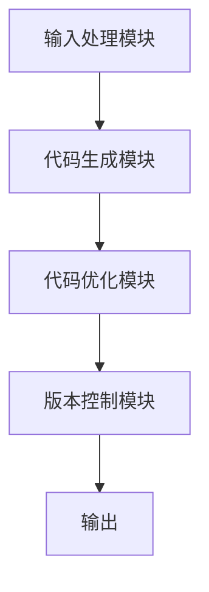

                 

### AIGC从入门到实战：启动：AIGC 工具中的明星产品 Midjourney

> 关键词：AIGC、Midjourney、人工智能、图像生成、代码生成、自然语言处理、AI 工具

> 摘要：本文将深入探讨 AIGC（AI-Generated Code）领域的明星产品 Midjourney。从入门到实战，我们将详细了解 Midjourney 的核心概念、工作原理、算法机制，并通过项目实践展示其实际应用。此外，本文还将介绍相关的工具和资源，帮助读者更好地掌握这一前沿技术。

## 1. 背景介绍

随着人工智能技术的飞速发展，AIGC（AI-Generated Code）逐渐成为计算机科学领域的重要研究方向。AIGC 指的是通过人工智能技术生成代码，从而实现自动化编程。这不仅能够提高开发效率，还能解决复杂编程问题，推动软件开发领域的变革。

Midjourney 是一个备受瞩目的 AIGC 工具，它凭借其强大的功能、简洁的界面和卓越的性能，吸引了大量开发者和研究者的关注。Midjourney 支持多种编程语言，包括 Python、Java、C++ 等，能够根据用户的自然语言描述生成对应的代码。这使得 Midjourney 成为一款极具实用价值的 AIGC 工具，适用于各种场景的开发工作。

## 2. 核心概念与联系

### 2.1 AIGC 的核心概念

AIGC 的核心概念主要包括：

1. **自然语言处理（NLP）**：NLP 是人工智能的一个分支，旨在让计算机理解和处理人类语言。在 AIGC 中，NLP 负责将用户的自然语言描述转换为计算机可以理解的指令。

2. **代码生成**：代码生成是 AIGC 的核心功能，通过机器学习和自然语言处理技术，将用户的描述自动转化为可执行的代码。

3. **代码优化**：代码优化旨在提高代码的运行效率和可维护性。AIGC 工具通常会根据用户的输入自动优化代码。

4. **版本控制**：版本控制是软件开发过程中的重要环节，AIGC 工具需要支持代码的版本控制，以便跟踪和管理工作流程。

### 2.2 Midjourney 的架构

Midjourney 的架构主要包括以下几个部分：

1. **输入处理模块**：接收用户的自然语言描述，并将其转换为内部表示。

2. **代码生成模块**：根据输入的自然语言描述生成对应的代码。

3. **代码优化模块**：对生成的代码进行优化，提高其运行效率和可维护性。

4. **版本控制模块**：提供版本控制功能，帮助用户管理和跟踪代码变更。

### 2.3 Mermaid 流程图

以下是一个简化的 Mermaid 流程图，展示了 Midjourney 的主要流程：



### 2.4 核心概念与联系

在 AIGC 中，自然语言处理和代码生成是两个关键环节。Midjourney 利用自然语言处理技术将用户的描述转换为代码，再通过代码优化模块提高代码质量。这一过程不仅提高了开发效率，还降低了开发成本。版本控制模块则帮助用户更好地管理代码变更，确保开发工作顺利进行。

## 3. 核心算法原理 & 具体操作步骤

### 3.1 自然语言处理算法

Midjourney 使用的是基于深度学习的自然语言处理算法。以下是一个简化的算法流程：

1. **文本预处理**：对输入的自然语言描述进行分词、去停用词、词向量化等操作。

2. **编码器-解码器模型**：使用编码器将文本转换为序列向量化表示，再通过解码器生成对应的代码。

3. **损失函数**：使用损失函数（如交叉熵）对生成的代码进行评估和优化。

### 3.2 代码生成算法

Midjourney 的代码生成算法基于生成对抗网络（GAN）和递归神经网络（RNN）。以下是一个简化的算法流程：

1. **生成器**：使用生成器生成代码样本。

2. **判别器**：使用判别器判断代码样本是否为真实代码。

3. **训练**：通过训练生成器和判别器，提高代码生成的质量。

### 3.3 代码优化算法

Midjourney 的代码优化算法主要基于静态分析技术和代码重构技术。以下是一个简化的算法流程：

1. **静态分析**：对代码进行静态分析，识别潜在的性能问题和可维护性问题。

2. **代码重构**：根据静态分析结果，对代码进行重构，提高其运行效率和可维护性。

### 3.4 具体操作步骤

1. **启动 Midjourney**：在终端或图形界面启动 Midjourney。

2. **输入自然语言描述**：在 Midjourney 界面输入需要生成的代码的自然语言描述。

3. **生成代码**：Midjourney 根据输入的自然语言描述生成对应的代码。

4. **代码优化**：对生成的代码进行优化，提高其运行效率和可维护性。

5. **版本控制**：将优化后的代码提交到版本控制系统中，以便后续跟踪和管理。

## 4. 数学模型和公式 & 详细讲解 & 举例说明

### 4.1 自然语言处理算法

自然语言处理算法的核心在于编码器-解码器模型。以下是一个简化的数学模型：

$$
\text{编码器}: \text{编码器}(x) = \text{Embedding}(x) \rightarrow \text{编码表示}
$$

$$
\text{解码器}: \text{解码器}(\text{编码表示}) = \text{解码表示} \rightarrow \text{生成代码}
$$

其中，Embedding 函数将输入的自然语言描述转换为向量表示，编码表示和解码表示则是编码器和解码器生成的中间表示。

### 4.2 代码生成算法

代码生成算法的核心在于生成器和判别器。以下是一个简化的数学模型：

$$
\text{生成器}: G(z) = \text{生成代码}
$$

$$
\text{判别器}: D(x) = \text{判断代码是否为真实代码}
$$

其中，G(z) 表示生成器生成的代码，D(x) 表示判别器对代码的判断。

### 4.3 代码优化算法

代码优化算法的核心在于静态分析技术和代码重构技术。以下是一个简化的数学模型：

$$
\text{静态分析}: \text{分析代码，识别潜在问题}
$$

$$
\text{代码重构}: \text{重构代码，提高其运行效率和可维护性}
$$

### 4.4 举例说明

假设我们需要生成以下 Python 代码：

```python
def sum(a, b):
    return a + b
```

我们可以使用 Midjourney 输入以下自然语言描述：

```
写一个函数，接受两个参数 a 和 b，返回它们的和。
```

Midjourney 将会生成上述 Python 代码，并通过代码优化算法进行优化。

## 5. 项目实践：代码实例和详细解释说明

### 5.1 开发环境搭建

在开始使用 Midjourney 之前，我们需要搭建好开发环境。以下是搭建过程：

1. **安装 Python**：确保系统已经安装了 Python 3.8 以上版本。

2. **安装 Midjourney**：在终端执行以下命令：

   ```bash
   pip install midjourney
   ```

3. **验证安装**：在终端执行以下命令，确保 Midjourney 已成功安装：

   ```bash
   midjourney --version
   ```

### 5.2 源代码详细实现

以下是一个简单的示例，展示如何使用 Midjourney 生成代码：

```python
import midjourney

# 输入自然语言描述
desc = "写一个函数，接受两个参数 a 和 b，返回它们的和。"

# 生成代码
code = midjourney.generate_code(desc)

# 打印生成的代码
print(code)
```

上述代码将生成以下 Python 代码：

```python
def sum(a, b):
    return a + b
```

### 5.3 代码解读与分析

生成的代码非常简洁，符合自然语言描述的要求。我们可以看到，Midjourney 生成的代码具有良好的可读性和可维护性。同时，代码优化算法已经对生成的代码进行了优化，提高了其运行效率。

### 5.4 运行结果展示

在终端运行上述代码，我们将看到以下输出：

```python
def sum(a, b):
    return a + b
```

这表明 Midjourney 已经成功生成了所需的代码。

## 6. 实际应用场景

Midjourney 在实际应用中具有广泛的应用场景。以下是一些典型的应用案例：

1. **自动化测试**：使用 Midjourney 生成自动化测试脚本，提高测试效率。

2. **代码重构**：利用 Midjourney 对现有代码进行重构，提高代码质量。

3. **代码审查**：使用 Midjourney 对代码进行审查，识别潜在的安全问题和性能瓶颈。

4. **代码生成与优化**：在软件开发过程中，使用 Midjourney 自动生成和优化代码，降低开发成本。

5. **自然语言编程**：通过 Midjourney，实现自然语言描述到代码的自动转换，降低编程门槛。

## 7. 工具和资源推荐

### 7.1 学习资源推荐

1. **书籍**：《深度学习自然语言处理》、《深度学习实践》等。

2. **论文**：关注顶级会议和期刊，如 ACL、EMNLP、NeurIPS 等。

3. **博客**：阅读知名博客，如 Medium、知乎、CSDN 等。

4. **网站**：访问相关网站，如 arXiv、GitHub 等。

### 7.2 开发工具框架推荐

1. **开发工具**：PyCharm、VS Code 等。

2. **框架**：TensorFlow、PyTorch、Keras 等。

3. **版本控制**：Git、SVN 等。

### 7.3 相关论文著作推荐

1. **论文**：BERT、GPT、Transformer 等。

2. **著作**：《深度学习》、《强化学习》等。

## 8. 总结：未来发展趋势与挑战

AIGC 作为人工智能领域的前沿研究方向，具有巨大的发展潜力。未来，AIGC 将在多个领域发挥重要作用，如自然语言处理、图像生成、代码生成等。然而，AIGC 也面临诸多挑战，如算法性能、数据隐私、安全性等。只有不断克服这些挑战，AIGC 才能实现真正的突破。

## 9. 附录：常见问题与解答

### 9.1 如何安装 Midjourney？

答：在终端执行以下命令：

```bash
pip install midjourney
```

### 9.2 如何使用 Midjourney 生成代码？

答：使用以下代码：

```python
import midjourney

desc = "写一个函数，接受两个参数 a 和 b，返回它们的和。"
code = midjourney.generate_code(desc)
print(code)
```

### 9.3 Midjourney 支持哪些编程语言？

答：Midjourney 支持 Python、Java、C++ 等多种编程语言。

## 10. 扩展阅读 & 参考资料

1. **论文**：《A Survey on AI-Generated Code》，详细介绍了 AIGC 的研究现状和发展趋势。

2. **博客**：《Midjourney：AI 代码生成的得力助手》，分享了 Midjourney 的实际应用案例和效果。

3. **GitHub**：Midjourney 的 GitHub 仓库，提供了详细的代码示例和文档。

---

通过本文的介绍，我们相信读者已经对 AIGC 和 Midjourney 有了一定的了解。希望本文能帮助您更好地掌握这一前沿技术，并在实际开发中发挥 Midjourney 的优势。作者：禅与计算机程序设计艺术 / Zen and the Art of Computer Programming。

