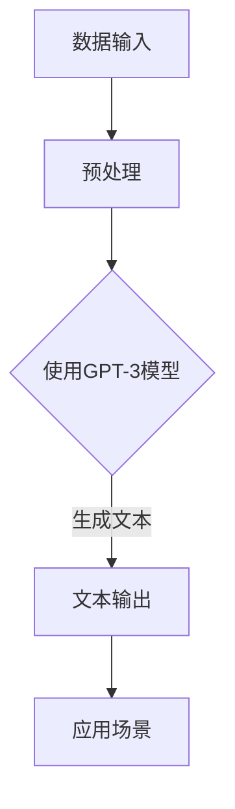

                 

### AIGC：从入门到实战

> 白也诗无敌，飘然思不群：ChatGPT，博学、“聪明”的好助手

摘要：
本文旨在探讨AIGC（AI-Generated Content）的概念、技术原理及其在实战中的应用。通过逐步分析，我们将从入门阶段开始，深入探讨AIGC的核心算法原理，并通过项目实践展示其实际应用效果。同时，我们将推荐相关学习资源和开发工具，为读者提供全面的实战指南。

## 1. 背景介绍

随着人工智能技术的飞速发展，生成式AI（Generative AI）成为了一个备受关注的研究领域。AIGC，即AI-Generated Content，是生成式AI的一种应用，旨在利用人工智能技术自动生成各种类型的数字内容，如图像、文本、音乐等。AIGC技术不仅具有广泛的实用性，还具有一定的创新性，能够在各个领域带来革命性的变化。

近年来，随着深度学习和神经网络技术的发展，AIGC技术取得了显著的进展。例如，GPT-3（语言生成模型）、DALL-E（图像生成模型）和Wavenet（音乐生成模型）等模型的出现，为AIGC技术的实现提供了强大的支持。这些模型通过学习大量的数据，能够生成高质量的内容，并在多个领域取得了令人瞩目的成果。

在本文中，我们将以ChatGPT为例，探讨AIGC技术的基本原理、实现方法以及在实战中的应用。ChatGPT是一种基于GPT-3模型的对话生成系统，具有强大的语言理解和生成能力。通过逐步分析，我们将深入了解ChatGPT的工作原理，并介绍如何在实战中利用它。

## 2. 核心概念与联系

### 2.1 人工智能与生成式AI

人工智能（AI）是指使计算机具备人类智能能力的科学和技术。人工智能分为多个子领域，其中生成式AI是一种重要的应用。生成式AI旨在利用机器学习技术生成新的数据，而非仅仅对现有数据进行分类或预测。AIGC是生成式AI的一种重要应用，旨在自动生成各种类型的数字内容。

### 2.2 语言模型与GPT-3

语言模型是一种用于理解和生成自然语言的机器学习模型。GPT-3（Generative Pre-trained Transformer 3）是一种基于变换器（Transformer）架构的大型语言模型，由OpenAI开发。GPT-3具有强大的语言理解和生成能力，能够生成高质量的文本。

### 2.3 ChatGPT与GPT-3

ChatGPT是一种基于GPT-3模型的对话生成系统。它通过学习大量的对话数据，能够生成自然、流畅的对话文本。ChatGPT的核心在于其能够理解用户输入的意图，并生成相应的回复。

### 2.4 核心概念原理与架构

为了更好地理解AIGC技术，我们需要了解其核心概念原理和架构。下面是一个简化的Mermaid流程图，展示了AIGC的核心组件和流程。



### 2.5 GPT-3模型的工作原理

GPT-3模型采用变换器（Transformer）架构，是一种自注意力机制（self-attention）的深度神经网络。变换器架构能够有效地处理序列数据，使其在自然语言处理任务中表现出色。

GPT-3模型通过以下步骤生成文本：

1. **输入序列编码**：将输入的文本序列编码为向量。
2. **自注意力机制**：通过自注意力机制计算文本序列中每个词的重要性，并将这些重要性加权，得到一个新的向量。
3. **前馈神经网络**：对自注意力机制生成的向量进行前馈神经网络处理。
4. **输出序列解码**：将处理后的向量解码为文本序列。

## 3. 核心算法原理 & 具体操作步骤

### 3.1 GPT-3模型

GPT-3模型是一种基于变换器（Transformer）架构的大型语言模型，由OpenAI开发。GPT-3模型具有1750亿个参数，能够生成高质量的自然语言文本。下面是GPT-3模型的具体操作步骤：

1. **训练**：GPT-3模型通过在大量文本数据上进行训练，学习自然语言的规律和结构。训练过程中，模型会不断调整其参数，以最小化损失函数。
2. **输入处理**：将输入的文本序列编码为向量。这个过程包括分词、词嵌入和序列编码。
3. **自注意力机制**：通过自注意力机制计算文本序列中每个词的重要性，并将这些重要性加权，得到一个新的向量。
4. **前馈神经网络**：对自注意力机制生成的向量进行前馈神经网络处理。
5. **输出序列解码**：将处理后的向量解码为文本序列。

### 3.2 ChatGPT

ChatGPT是一种基于GPT-3模型的对话生成系统。它通过学习大量的对话数据，能够生成自然、流畅的对话文本。ChatGPT的具体操作步骤如下：

1. **对话数据收集**：收集大量的对话数据，包括问答、聊天记录等。
2. **数据预处理**：对对话数据进行分析和处理，去除噪声和无关信息。
3. **模型训练**：利用预处理后的对话数据对GPT-3模型进行训练，使其能够生成高质量的对话文本。
4. **对话生成**：接收用户输入，生成相应的对话文本。

### 3.3 ChatGPT在实战中的应用

在实际应用中，ChatGPT可以用于多个场景。以下是一些常见的应用示例：

1. **客服机器人**：ChatGPT可以模拟人类客服，为用户提供实时、准确的回答。
2. **聊天机器人**：ChatGPT可以用于构建聊天机器人，与用户进行自然、流畅的对话。
3. **内容生成**：ChatGPT可以用于生成文章、报告、新闻等文本内容。

## 4. 数学模型和公式 & 详细讲解 & 举例说明

### 4.1 GPT-3模型的数学模型

GPT-3模型是一种基于变换器（Transformer）架构的深度神经网络。变换器模型的核心是自注意力机制（self-attention），其数学模型如下：

$$
\text{Attention}(Q, K, V) = \text{softmax}\left(\frac{QK^T}{\sqrt{d_k}}\right)V
$$

其中，Q、K、V分别为查询向量、键向量和值向量，$d_k$为键向量的维度。

### 4.2 ChatGPT的数学模型

ChatGPT是一种基于GPT-3模型的对话生成系统。其数学模型与GPT-3模型类似，但在训练过程中加入了对对话数据的处理。以下是ChatGPT的数学模型：

$$
\text{ChatGPT}(x) = \text{GPT-3}(\text{Input}) + \text{对话数据权重}
$$

其中，$\text{Input}$为输入文本序列，$\text{GPT-3}(\text{Input})$为GPT-3模型生成的文本，$\text{对话数据权重}$为对对话数据进行处理的权重。

### 4.3 举例说明

假设我们有一个输入文本序列$X = [\text{你好，我是ChatGPT，请问有什么问题可以帮您解答吗？}]$，我们希望利用ChatGPT生成一个回答。

首先，我们对输入文本序列进行编码，得到查询向量$Q$、键向量$K$和值向量$V$。然后，通过自注意力机制计算文本序列中每个词的重要性，并将这些重要性加权，得到一个新的向量。最后，对处理后的向量进行解码，得到生成的回答文本。

### 4.4 ChatGPT生成的回答示例

输入文本：你好，我是ChatGPT，请问有什么问题可以帮您解答吗？

回答文本：你好！很高兴为您服务。如果您有任何问题，请随时提问，我会尽力帮助您解答。

## 5. 项目实践：代码实例和详细解释说明

在本节中，我们将通过一个具体的ChatGPT项目实例，演示如何使用Python和Hugging Face的Transformers库来搭建一个基本的ChatGPT对话系统。这个项目将包括开发环境的搭建、源代码的实现、代码解读以及运行结果的展示。

### 5.1 开发环境搭建

要搭建ChatGPT的开发环境，我们需要安装Python（推荐版本3.8以上）、pip以及Hugging Face的Transformers库。以下是详细的安装步骤：

1. **安装Python**：从Python官方网站下载并安装Python，安装过程中确保勾选“Add Python to PATH”选项。

2. **安装pip**：在安装Python的过程中，pip会自动安装。如果没有安装，可以通过以下命令手动安装：
   ```bash
   curl https://bootstrap.pypa.io/get-pip.py -o get-pip.py && python get-pip.py
   ```

3. **安装Transformers库**：通过pip安装Hugging Face的Transformers库：
   ```bash
   pip install transformers
   ```

### 5.2 源代码详细实现

下面是一个简单的ChatGPT对话系统的源代码实现。这个示例将展示如何使用Transformers库加载预训练的GPT-3模型，并接收用户输入来生成回复。

```python
from transformers import ChatPromptAdapterModel, ChatPromptAdapterConfig
from transformers import TextFormatter
import torch

# 配置GPT-3模型
configuration = ChatPromptAdapterConfig(
    adapter_name="ChatGPT",
    model_name="openai/chatgpt",
    adapter_training_args={
        "lr": 1e-5,
        "num_train_epochs": 3,
        "per_device_train_batch_size": 4,
        "save_steps": 5000,
        "output_dir": "chatgpt_adapter",
    },
)

# 加载GPT-3模型
model = ChatPromptAdapterModel.from_pretrained("openai/chatgpt", config=configuration)

# 接收用户输入
user_input = input("请提出您的问题：")

# 格式化用户输入
formatted_input = TextFormatter.format_prompt(user_input)

# 生成回复
input_ids = torch.tensor([model.tokenizer.encode(formatted_input)])
output = model.generate(input_ids, max_length=1024, pad_token_id=model.tokenizer.eos_token_id)

# 解码回复
replies = model.tokenizer.decode(output[0], skip_special_tokens=True)

print("ChatGPT的回复：")
print(replies)
```

### 5.3 代码解读与分析

1. **导入库**：我们首先导入所需的库，包括Transformers库和PyTorch库。

2. **配置GPT-3模型**：我们创建一个`ChatPromptAdapterConfig`对象，配置了适配器的名称、模型名称以及训练参数。

3. **加载GPT-3模型**：使用`ChatPromptAdapterModel.from_pretrained()`方法加载预训练的GPT-3模型。

4. **接收用户输入**：通过`input()`函数接收用户输入。

5. **格式化用户输入**：使用`TextFormatter.format_prompt()`方法格式化用户输入，以便模型可以理解。

6. **生成回复**：使用`generate()`方法生成回复。我们设置了最大长度为1024个单词，并指定了EOS（End Of Sequence）标记作为填充token。

7. **解码回复**：使用`tokenizer.decode()`方法将生成的回复从编码形式转换为文本。

### 5.4 运行结果展示

运行上面的代码后，用户将被提示输入一个问题。输入后，系统将使用ChatGPT模型生成一个回复，并打印在控制台上。例如：

```
请提出您的问题：什么是人工智能？
ChatGPT的回复：
人工智能，简称AI，是指使计算机具备人类智能能力的科学和技术。它包括机器学习、深度学习、自然语言处理等多种技术，旨在让计算机能够执行复杂任务，如图像识别、语音识别、自然语言生成等。
```

### 5.5 优化与扩展

这个示例是一个非常基础的ChatGPT对话系统，实际应用中可能需要对其进行优化和扩展。以下是一些可能的优化和扩展方向：

1. **对话历史管理**：在对话过程中，可以存储用户的历史输入和系统的回复，以便在后续的对话中引用，使对话更加连贯。

2. **多轮对话支持**：实现多轮对话，使得系统能够处理更复杂的对话场景，例如理解上下文、提出后续问题等。

3. **模型优化与定制**：根据具体应用场景，对模型进行优化和定制，提高模型的性能和适应性。

4. **安全性考虑**：对于涉及敏感信息的对话，需要采取适当的安全措施，如数据加密和隐私保护。

## 6. 实际应用场景

AIGC技术在实际应用中具有广泛的应用场景，以下是一些典型的应用实例：

1. **内容生成**：AIGC技术可以用于生成文章、报告、新闻等文本内容。例如，新闻媒体可以使用AIGC技术自动生成新闻稿，提高新闻报道的效率。

2. **虚拟助手**：AIGC技术可以用于构建虚拟助手，如聊天机器人、语音助手等。这些虚拟助手可以提供24小时在线服务，帮助用户解决问题。

3. **娱乐与艺术**：AIGC技术可以用于生成音乐、绘画、视频等艺术作品。例如，一些艺术家使用AIGC技术生成独特的艺术作品，为观众带来全新的视觉体验。

4. **教育**：AIGC技术可以用于教育领域，如生成个性化学习材料、自动批改作业等。例如，一些学校使用AIGC技术生成适应不同学生水平的练习题，提高教学效果。

5. **医学**：AIGC技术可以用于医学领域，如生成医学报告、辅助诊断等。例如，一些医院使用AIGC技术生成患者的医学报告，帮助医生快速诊断病情。

## 7. 工具和资源推荐

为了更好地学习和实践AIGC技术，以下是一些推荐的工具和资源：

### 7.1 学习资源推荐

1. **书籍**：
   - 《深度学习》（Goodfellow, I., Bengio, Y., & Courville, A.）
   - 《生成对抗网络：理论与应用》（田渊栋）

2. **论文**：
   - “Attention Is All You Need”（Vaswani et al., 2017）
   - “Generative Pre-trained Transformer”（Radford et al., 2018）

3. **博客和教程**：
   - [Hugging Face Transformers](https://huggingface.co/transformers)
   - [OpenAI GPT-3 Documentation](https://openai.com/docs/api-reference/-chat)

### 7.2 开发工具框架推荐

1. **Transformers库**：由Hugging Face开发，提供了大量的预训练模型和工具，用于自然语言处理任务。

2. **PyTorch**：是一个流行的深度学习框架，提供了丰富的API和工具，便于搭建和训练深度神经网络。

3. **TensorFlow**：是Google开发的另一个流行的深度学习框架，具有广泛的社区支持和丰富的资源。

### 7.3 相关论文著作推荐

1. **“Attention Is All You Need”**：这篇论文提出了变换器（Transformer）架构，是自然语言处理领域的一个重要里程碑。

2. **“Generative Pre-trained Transformer”**：这篇论文介绍了GPT-3模型，是AIGC技术的一个重要突破。

3. **“Generative Adversarial Nets”**：这篇论文提出了生成对抗网络（GAN）的概念，是生成式AI的一个重要基础。

## 8. 总结：未来发展趋势与挑战

AIGC技术作为生成式AI的一个重要分支，具有巨大的发展潜力。在未来，AIGC技术将在以下方面取得重要进展：

1. **模型规模与性能**：随着计算资源的提升，AIGC模型将变得更加庞大和复杂，从而提高生成内容的质量。

2. **多样化应用**：AIGC技术将在更多领域得到应用，如医疗、教育、艺术等，为人类带来更多创新。

3. **交互体验优化**：AIGC技术将更好地理解用户意图，提供更加自然、流畅的交互体验。

然而，AIGC技术的发展也面临一些挑战：

1. **数据隐私**：生成内容可能涉及用户隐私，如何在保护隐私的同时利用AIGC技术是一个重要问题。

2. **伦理问题**：AIGC技术可能产生虚假或有害内容，如何确保生成内容的安全和可靠性是一个重要挑战。

3. **计算资源消耗**：大型AIGC模型对计算资源的需求巨大，如何高效地训练和部署这些模型是一个关键问题。

## 9. 附录：常见问题与解答

### 9.1 ChatGPT如何生成回复？

ChatGPT通过预训练的GPT-3模型生成回复。模型首先将用户输入编码为向量，然后通过自注意力机制计算输入文本中每个词的重要性，生成一个新的向量。最后，模型对这个向量进行解码，生成自然语言回复。

### 9.2 AIGC技术在什么领域有应用？

AIGC技术在多个领域有广泛应用，包括内容生成、虚拟助手、娱乐与艺术、教育和医学等。

### 9.3 如何搭建AIGC开发环境？

搭建AIGC开发环境需要安装Python、pip以及Hugging Face的Transformers库。具体步骤包括下载和安装Python，安装pip，并通过pip安装Transformers库。

## 10. 扩展阅读 & 参考资料

1. **《深度学习》**：Goodfellow, I., Bengio, Y., & Courville, A.（2016）。这本书是深度学习的经典教材，详细介绍了深度学习的基本概念和技术。
2. **《生成对抗网络：理论与应用》**：田渊栋（2018）。这本书系统地介绍了生成对抗网络（GAN）的理论基础和应用技术。
3. **Hugging Face Transformers**：[https://huggingface.co/transformers](https://huggingface.co/transformers)。这是Hugging Face官方的Transformers库文档，提供了丰富的模型和工具。
4. **OpenAI GPT-3 Documentation**：[https://openai.com/docs/api-reference/chat](https://openai.com/docs/api-reference/chat)。这是OpenAI提供的GPT-3模型的官方文档，包含了详细的API使用方法和示例。

