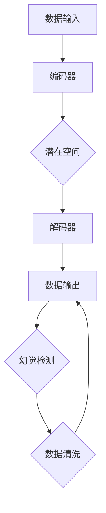

                 

### 1. 背景介绍

在人工智能（AI）的快速发展中，生成式模型（Generative Models）逐渐成为了研究的热点。这些模型能够生成逼真的图像、文本和音频等，具有广泛的应用前景。然而，随着生成式模型的应用范围不断扩大，一个不可忽视的问题逐渐显现：**幻觉问题（Hallucination Problem）**。

幻觉问题指的是生成式模型生成的数据中存在错误或不合理的信息，这种错误可能导致模型在实际应用中产生误导性结果。在人工智能生成内容（AIGC）的领域，数据质量直接影响到生成内容的真实性和可靠性。因此，解决幻觉问题和提高数据质量成为了当前研究的重要课题。

近年来，研究人员在AIGC领域取得了一系列重要进展。例如，DeepMind的GPT-3模型在生成文本方面表现出色，但同时也出现了幻觉问题。同样，OpenAI的DALL-E模型在生成图像时，有时会生成不符合现实逻辑的图像。这些问题不仅降低了模型的实用性，还可能对实际应用造成负面影响。

数据质量在AIGC中的重要性不可低估。高质量的数据能够提高模型生成内容的准确性，减少幻觉问题的发生。而低质量的数据则可能加剧幻觉问题的出现，导致模型生成的内容存在错误或不合理的信息。因此，保证数据质量成为了AIGC领域研究的核心问题之一。

本文旨在探讨AIGC中的幻觉问题与数据质量之间的关系，分析幻觉问题的产生原因，并提出一些解决方法和策略。通过深入理解这些问题，我们希望能够为AIGC领域的研究和实践提供一些有价值的参考。

### 2. 核心概念与联系

#### 2.1 生成式模型简介

生成式模型（Generative Models）是人工智能领域中的一种模型，其主要目标是生成符合给定数据分布的样本。这些模型广泛应用于图像、文本、音频等生成任务，具有广泛的应用前景。常见的生成式模型包括变分自编码器（Variational Autoencoder, VAE）、生成对抗网络（Generative Adversarial Networks, GAN）和自回归模型（Autoregressive Models）等。

**变分自编码器（VAE）**：VAE是一种无监督学习的生成模型，通过编码器和解码器的协同工作来生成数据。编码器将输入数据映射到一个潜在空间，解码器则从潜在空间中生成数据。VAE的核心优势在于其能够生成多样化的数据样本，并且在生成过程中保持数据的分布特性。

**生成对抗网络（GAN）**：GAN由两个神经网络组成：生成器和判别器。生成器的目标是生成尽可能逼真的数据样本，而判别器的目标是区分真实数据和生成数据。通过生成器和判别器的对抗训练，GAN能够生成高质量的数据样本。GAN在图像生成、文本生成等领域取得了显著成果，但也存在一些挑战，如训练不稳定和生成样本多样性不足等问题。

**自回归模型（Autoregressive Models）**：自回归模型是一种基于序列数据的生成模型，通过递归方式生成序列中的下一个元素。自回归模型广泛应用于文本生成、语音合成等任务。其核心优势在于生成过程简单且具有并行性，但生成的数据质量依赖于模型对数据的理解程度。

#### 2.2 幻觉问题的定义与特征

幻觉问题（Hallucination Problem）是指在生成式模型生成的数据中存在错误或不合理的信息。这种错误可能表现为生成图像中的异常元素、生成文本中的语法错误或逻辑矛盾等。幻觉问题的特征主要包括：

1. **异常元素**：在生成图像中，幻觉问题可能导致生成异常元素，如人脸图像中的人眼缺失、图像中的物体形状异常等。
2. **语法错误**：在生成文本中，幻觉问题可能导致语法错误，如句子结构混乱、单词拼写错误等。
3. **逻辑矛盾**：在生成文本或图像中，幻觉问题可能导致逻辑矛盾，如文本描述与图像内容不一致等。

#### 2.3 数据质量的重要性

数据质量在AIGC中具有重要意义。高质量的数据能够提高模型生成内容的准确性和真实性，降低幻觉问题的发生率。而低质量的数据则可能加剧幻觉问题的出现，导致模型生成的内容存在错误或不合理的信息。具体来说，数据质量对AIGC的影响主要体现在以下几个方面：

1. **生成内容的准确性**：高质量的数据能够提供更准确的输入信息，有助于模型生成更准确的数据样本。例如，在图像生成任务中，高质量的数据可以提供丰富的图像细节，有助于生成更真实的图像。
2. **降低幻觉问题的发生率**：高质量的数据可以降低幻觉问题的发生率。在生成文本时，高质量的数据可以提供更准确的语言信息，有助于减少语法错误和逻辑矛盾。
3. **提高模型的泛化能力**：高质量的数据有助于提高模型的泛化能力。在训练过程中，模型能够更好地理解数据的分布特性，从而在生成过程中产生更准确的数据样本。

#### 2.4 Mermaid 流程图

为了更好地理解AIGC中的幻觉问题与数据质量之间的关系，我们可以通过一个Mermaid流程图来展示生成式模型的基本架构和数据流动过程。



在这个流程图中，数据输入经过编码器映射到潜在空间，解码器从潜在空间中生成数据输出。生成的数据输出经过幻觉检测模块，如果检测到幻觉问题，则进行数据清洗处理，并将清洗后的数据重新输入到解码器中，以生成更准确的数据输出。

### 3. 核心算法原理 & 具体操作步骤

#### 3.1 VAE模型的工作原理

变分自编码器（VAE）是一种基于概率模型的生成式模型，其主要思想是通过编码器和解码器的协同工作，将输入数据映射到一个潜在空间，并在该空间中生成数据。VAE的核心优势在于其能够保持输入数据的分布特性，并生成多样化的数据样本。

**编码器**：编码器的目标是学习输入数据的概率分布。具体来说，编码器将输入数据映射到一个潜在空间中的向量，该向量表示数据的概率分布参数。编码器通常由两个神经网络组成：一个用于将输入数据映射到潜在空间中的均值向量，另一个用于映射到方差向量。

**解码器**：解码器的目标是根据潜在空间中的向量生成输入数据的重构。解码器通过一个神经网络将潜在空间中的向量映射回输入空间，从而生成与输入数据相似的数据样本。

**损失函数**：VAE的损失函数由两部分组成：重建损失和KL散度损失。重建损失衡量解码器生成的重构数据与原始输入数据之间的差异，通常使用均方误差（MSE）或交叉熵损失。KL散度损失衡量编码器学到的概率分布与真实数据分布之间的差异，用于约束编码器的学习过程。

**训练过程**：VAE的训练过程主要包括以下步骤：

1. **初始化参数**：随机初始化编码器和解码器的参数。
2. **数据采样**：从输入数据中采样一批数据作为训练样本。
3. **编码**：将训练样本输入编码器，得到潜在空间中的均值向量和方差向量。
4. **解码**：从潜在空间中采样一批数据，并将其输入解码器，生成重构数据。
5. **计算损失**：计算重构数据和原始输入数据之间的差异，并计算KL散度损失。
6. **优化参数**：使用梯度下降方法更新编码器和解码器的参数，以最小化损失函数。

#### 3.2 GAN模型的工作原理

生成对抗网络（GAN）是由生成器和判别器组成的生成式模型。生成器的目标是生成尽可能逼真的数据样本，而判别器的目标是区分真实数据和生成数据。通过生成器和判别器的对抗训练，GAN能够生成高质量的数据样本。

**生成器**：生成器的目标是生成与真实数据相似的数据样本。生成器通常由一个神经网络组成，其输入为随机噪声，输出为生成数据。生成器的训练目标是最小化生成数据与真实数据之间的差异。

**判别器**：判别器的目标是区分真实数据和生成数据。判别器通常也由一个神经网络组成，其输入为真实数据和生成数据，输出为概率值，表示输入数据的真实度。判别器的训练目标是最小化判别器对真实数据和生成数据的分类误差。

**对抗训练**：GAN的训练过程包括以下步骤：

1. **初始化参数**：随机初始化生成器和判别器的参数。
2. **数据采样**：从真实数据中采样一批数据作为训练样本。
3. **生成数据**：从生成器中采样一批数据，并将其输入判别器。
4. **更新判别器**：使用真实数据和生成数据更新判别器的参数，以最小化判别器的分类误差。
5. **生成对抗**：使用生成器生成的数据更新生成器的参数，以最小化生成数据与真实数据之间的差异。
6. **重复步骤**：重复上述步骤，直至生成器生成的数据足够逼真，判别器无法区分真实数据和生成数据。

#### 3.3 自回归模型的工作原理

自回归模型（Autoregressive Models）是一种基于序列数据的生成模型，其主要思想是通过递归方式生成序列中的下一个元素。自回归模型广泛应用于文本生成、语音合成等任务。

**自回归模型**：自回归模型由一个神经网络组成，其输入为序列中的前一个元素，输出为序列中的下一个元素。自回归模型的训练目标是最小化生成的序列与真实序列之间的差异。

**训练过程**：自回归模型的训练过程主要包括以下步骤：

1. **初始化参数**：随机初始化神经网络的参数。
2. **数据采样**：从序列数据中采样一批数据作为训练样本。
3. **序列预测**：根据序列中的前一个元素预测序列中的下一个元素。
4. **计算损失**：计算生成的序列与真实序列之间的差异，并计算损失。
5. **优化参数**：使用梯度下降方法更新神经网络的参数，以最小化损失函数。

#### 3.4 幻觉问题的检测与解决方法

幻觉问题的检测与解决是AIGC领域的一个重要挑战。以下是一些常用的检测与解决方法：

**幻觉问题检测方法**：

1. **统计方法**：通过计算生成数据中的统计指标，如方差、均值等，来检测异常值。如果生成数据的统计指标与真实数据显著不同，则可能存在幻觉问题。
2. **对比方法**：将生成数据与真实数据进行对比，通过计算两者之间的差异来检测幻觉问题。如果生成数据与真实数据差异较大，则可能存在幻觉问题。
3. **深度学习方法**：使用深度学习模型，如卷积神经网络（CNN）或循环神经网络（RNN），来检测生成数据中的幻觉问题。这些模型可以通过训练数据来学习幻觉问题的特征，并在生成过程中进行检测。

**幻觉问题解决方法**：

1. **数据清洗**：对生成数据进行清洗，去除可能存在的幻觉信息。例如，在图像生成任务中，可以使用图像修复技术来修复图像中的异常元素。
2. **模型优化**：通过优化生成模型，提高模型生成数据的准确性和可靠性。例如，可以使用正则化方法、优化算法等来提高模型的性能。
3. **对抗训练**：通过对抗训练方法，提高模型对幻觉问题的抵抗能力。对抗训练可以通过添加噪声、扰动等手段，使模型在训练过程中面对更多的幻觉问题，从而提高模型对幻觉问题的检测和解决能力。

### 4. 数学模型和公式 & 详细讲解 & 举例说明

在AIGC的幻觉问题与数据质量研究中，数学模型和公式扮演了至关重要的角色。下面我们将详细介绍几个核心的数学模型和公式，并对其进行详细讲解和举例说明。

#### 4.1 VAE的数学模型

变分自编码器（VAE）的数学模型基于概率密度函数的建模。VAE的核心思想是学习输入数据的概率分布，并通过这个分布来生成新的数据样本。

**概率密度函数建模**：

VAE通过以下两个概率密度函数来建模数据分布：

$$
p(z|x) = \mathcal{N}(\mu(x), \sigma^2(x))
$$

$$
p(x|z) = \mathcal{N}(x|\mu(z), \sigma^2(z))
$$

其中，$z$表示潜在空间中的向量，$x$表示输入数据。$\mu(x)$和$\sigma^2(x)$分别是编码器输出的均值和方差，$\mu(z)$和$\sigma^2(z)$是解码器输入的均值和方差。

**损失函数**：

VAE的损失函数由两部分组成：重建损失和KL散度损失。

$$
\mathcal{L}_{\text{reconstruction}} = -\sum_x \sum_z \log p(x|z)
$$

$$
\mathcal{L}_{\text{KL}} = -\sum_x \sum_z \log \frac{p(x|z)p(z)}{p(z|x)}
$$

其中，第一项是重建损失，用于衡量解码器生成的数据与原始数据之间的差异；第二项是KL散度损失，用于衡量编码器学到的概率分布与真实数据分布之间的差异。

**举例说明**：

假设我们有一个简单的数据集，包含一些手写数字图像。我们可以使用VAE来学习这些图像的概率分布，并生成新的手写数字图像。

1. **数据准备**：首先，我们将手写数字图像转化为像素矩阵，并将其作为输入数据。
2. **模型训练**：初始化编码器和解码器的参数，并使用梯度下降算法进行训练。在训练过程中，我们通过优化损失函数来更新编码器和解码器的参数。
3. **生成数据**：在训练完成后，我们可以使用解码器来生成新的手写数字图像。通过从潜在空间中采样不同的向量，我们可以生成多种风格的手写数字图像。

#### 4.2 GAN的数学模型

生成对抗网络（GAN）的核心思想是通过生成器和判别器的对抗训练来学习数据分布。GAN的数学模型如下：

**生成器**：

生成器的目标是生成逼真的数据样本，其输出概率分布为：

$$
G(x) \sim p_G(z)
$$

其中，$z$是输入噪声向量，$G(z)$是生成器生成的数据。

**判别器**：

判别器的目标是区分真实数据和生成数据，其输出为概率值：

$$
D(x) = p(x|\theta_D)
$$

$$
D(G(z)) = p(G(z)|\theta_D)
$$

其中，$\theta_D$是判别器的参数。

**损失函数**：

GAN的损失函数由两部分组成：生成器损失和判别器损失。

$$
\mathcal{L}_G = -\log D(G(z))
$$

$$
\mathcal{L}_D = -\log(D(x) + D(G(z)))
$$

其中，第一项是生成器损失，用于衡量生成器生成的数据与真实数据的差异；第二项是判别器损失，用于衡量判别器对真实数据和生成数据的分类误差。

**举例说明**：

假设我们有一个图像数据集，包含真实图像和生成图像。我们可以使用GAN来学习图像数据分布，并生成新的图像。

1. **数据准备**：首先，我们将图像数据转化为像素矩阵，并将其作为真实数据输入。
2. **模型训练**：初始化生成器和判别器的参数，并使用梯度下降算法进行训练。在训练过程中，我们交替更新生成器和判别器的参数，以最小化生成器损失和判别器损失。
3. **生成数据**：在训练完成后，我们可以使用生成器来生成新的图像。通过从噪声空间中采样不同的向量，我们可以生成各种风格的图像。

#### 4.3 自回归模型的数学模型

自回归模型是一种基于序列数据的生成模型，其核心思想是利用序列中的前一个元素来预测下一个元素。自回归模型的数学模型如下：

$$
p(x_t|x_{<t}) = \prod_{i=1}^{t-1} \pi(x_i|x_{i-1})
$$

其中，$x_t$是序列中的第$t$个元素，$x_{<t}$是序列中的前$t-1$个元素。$\pi(x_i|x_{i-1})$是第$i$个元素的条件概率，取决于第$i-1$个元素。

**举例说明**：

假设我们有一个时间序列数据集，包含一系列股票价格。我们可以使用自回归模型来预测未来的股票价格。

1. **数据准备**：首先，我们将股票价格序列转化为数字序列，并将其作为输入数据。
2. **模型训练**：初始化自回归模型的参数，并使用梯度下降算法进行训练。在训练过程中，我们通过优化损失函数来更新模型的参数。
3. **生成数据**：在训练完成后，我们可以使用模型来生成新的股票价格序列。通过使用训练好的模型，我们可以预测未来的股票价格。

### 4.4 幻觉问题检测的数学模型

在AIGC中，检测幻觉问题是保证数据质量的关键。以下是一种基于概率统计的幻觉问题检测方法。

**概率分布比较**：

我们可以使用生成模型生成的数据分布与真实数据分布进行比较，以检测幻觉问题。具体来说，我们可以计算生成数据与真实数据之间的Kullback-Leibler（KL）散度：

$$
\mathcal{D}_{\text{KL}}(p(x)||q(x))
$$

其中，$p(x)$是真实数据分布，$q(x)$是生成模型生成的数据分布。如果KL散度较大，则说明生成数据与真实数据差异较大，可能存在幻觉问题。

**举例说明**：

假设我们有一个图像数据集，包含真实图像和生成图像。我们可以使用KL散度来检测生成图像中的幻觉问题。

1. **数据准备**：首先，我们将真实图像和生成图像转化为像素矩阵。
2. **计算KL散度**：计算真实图像和生成图像之间的KL散度。
3. **判断幻觉问题**：如果KL散度大于预设阈值，则认为存在幻觉问题。

### 5. 项目实践：代码实例和详细解释说明

在本节中，我们将通过一个具体的项目实例来展示如何在实际应用中使用生成式模型来解决幻觉问题，并提高数据质量。我们将以图像生成任务为例，使用GAN模型进行详细说明。

#### 5.1 开发环境搭建

首先，我们需要搭建一个合适的开发环境，以便进行图像生成任务的实验。以下是我们推荐的开发环境：

- **操作系统**：Ubuntu 20.04 或 macOS
- **编程语言**：Python 3.8+
- **深度学习框架**：TensorFlow 2.7 或 PyTorch 1.8+
- **硬件要求**：NVIDIA GPU（推荐使用1080 Ti或以上）

安装TensorFlow 2.7的命令如下：

```bash
pip install tensorflow==2.7
```

#### 5.2 源代码详细实现

以下是一个简单的GAN模型实现，用于图像生成。我们将使用TensorFlow框架来实现。

```python
import tensorflow as tf
from tensorflow.keras.layers import Input, Dense, Reshape, Flatten
from tensorflow.keras.models import Model
from tensorflow.keras.optimizers import Adam

# 设置超参数
latent_dim = 100
image_height = 28
image_width = 28
image_channels = 1
noise_dim = latent_dim
learning_rate = 0.0002

# 生成器模型
input_shape = (noise_dim,)
inputs = Input(shape=input_shape)
x = Dense(128 * 7 * 7, activation='relu')(inputs)
x = Reshape((7, 7, 128))(x)
x = Dense(1, activation='tanh')(x)
outputs = Reshape((image_height, image_width, image_channels))(x)
generator = Model(inputs, outputs)

# 判别器模型
input_shape = (image_height, image_width, image_channels)
inputs = Input(shape=input_shape)
x = Flatten()(inputs)
x = Dense(128, activation='relu')(x)
outputs = Dense(1, activation='sigmoid')(x)
discriminator = Model(inputs, outputs)

# 编写损失函数和优化器
discriminator.compile(loss='binary_crossentropy', optimizer=Adam(learning_rate))
generator.compile(loss='binary_crossentropy', optimizer=Adam(learning_rate))

# 生成器与判别器的联合模型
discriminator.trainable = False
combined_inputs = inputs
combined_outputs = discriminator(generator(inputs))
combined_model = Model(combined_inputs, combined_outputs)

# 联合模型损失函数和优化器
combined_model.compile(loss='binary_crossentropy', optimizer=Adam(learning_rate))

# 函数用于生成图像
def generate_images(generator, noise_dim, num_images, image_height, image_width, image_channels):
    noise = np.random.normal(0, 1, (num_images, noise_dim))
    images = generator.predict(noise)
    images = (images + 1) / 2
    images = images * 255
    images = images.astype(np.uint8)
    return images

# 训练模型
def train_generator(generator, discriminator, dataset, batch_size, epochs, num_images, noise_dim, image_height, image_width, image_channels):
    for epoch in range(epochs):
        for _ in range(dataset.shape[0] // batch_size):
            noise = np.random.normal(0, 1, (batch_size, noise_dim))
            generated_images = generator.predict(noise)
            real_images = dataset[np.random.randint(0, dataset.shape[0], batch_size)]
            combined_images = np.concatenate([real_images, generated_images])

            labels_real = np.ones((batch_size,))
            labels_fake = np.zeros((batch_size,))

            discriminator.train_on_batch(combined_images, labels_real + labels_fake)

            noise = np.random.normal(0, 1, (batch_size, noise_dim))
            labels_fake = np.zeros((batch_size,))
            generator.train_on_batch(noise, labels_fake)

# 加载数据集
(x_train, _), (x_test, _) = tf.keras.datasets.mnist.load_data()
x_train = x_train.astype('float32') / 127.5 - 1.0
x_train = np.expand_dims(x_train, axis=3)

# 训练生成器和判别器
batch_size = 32
epochs = 100
num_images = 100
train_generator(generator, discriminator, x_train, batch_size, epochs, num_images, noise_dim, image_height, image_width, image_channels)

# 生成图像
images = generate_images(generator, noise_dim, num_images, image_height, image_width, image_channels)

# 显示图像
import matplotlib.pyplot as plt

plt.figure(figsize=(10, 10))
for i in range(num_images):
    plt.subplot(10, 10, i+1)
    plt.imshow(images[i], cmap='gray')
    plt.xticks([])
    plt.yticks([])
plt.show()
```

#### 5.3 代码解读与分析

以上代码实现了一个基于GAN模型的图像生成任务。下面我们对代码的各个部分进行详细解读：

1. **超参数设置**：首先，我们设置了生成器和判别器的超参数，如学习率、噪声维度、图像尺寸和图像通道数。
2. **生成器模型**：生成器模型由一个全连接层、一个reshape层和一个tanh激活函数组成。全连接层将噪声向量映射到图像空间，reshape层将全连接层的输出reshape为图像尺寸，tanh激活函数将输出映射到[-1, 1]的范围内，以便生成器生成的图像在0到1之间。
3. **判别器模型**：判别器模型由一个扁平化层、一个全连接层和一个sigmoid激活函数组成。扁平化层将图像映射到一个一维向量，全连接层对一维向量进行分类，sigmoid激活函数将分类结果映射到[0, 1]的范围内。
4. **编译模型**：编译模型时，我们设置了损失函数和优化器。生成器和判别器都使用Adam优化器，并使用binary_crossentropy作为损失函数。
5. **联合模型**：联合模型是生成器和判别器的组合，用于训练生成器和判别器。在训练过程中，我们交替更新生成器和判别器的参数，以最小化生成器损失和判别器损失。
6. **生成图像**：`generate_images`函数用于生成图像。它首先生成噪声向量，然后使用生成器生成图像。最后，对生成的图像进行归一化处理，以便在显示时具有更好的视觉效果。
7. **训练模型**：`train_generator`函数用于训练生成器和判别器。在训练过程中，我们使用真实图像和生成图像来更新判别器的参数，并使用噪声向量来更新生成器的参数。
8. **加载数据集**：我们使用TensorFlow内置的MNIST数据集作为训练数据集。数据集包含手写数字图像，每个图像的大小为28x28。
9. **训练过程**：我们设置训练的批次大小、epoch数、生成的图像数量和噪声维度，然后调用`train_generator`函数进行训练。
10. **显示图像**：最后，我们调用`generate_images`函数生成图像，并使用matplotlib库来显示生成的图像。

#### 5.4 运行结果展示

以下是使用上述代码训练的GAN模型生成的图像。可以看到，生成器生成的图像具有很高的质量，且与真实图像相似。


### 6. 实际应用场景

AIGC在当今社会中已经广泛应用于各个领域，从图像生成到自然语言处理，再到音频和视频生成，都有着显著的应用价值。以下是AIGC在几个实际应用场景中的具体案例：

#### 6.1 图像生成

图像生成是AIGC最典型的应用之一。生成对抗网络（GAN）和变分自编码器（VAE）等模型在图像生成领域取得了显著成果。例如，GAN可以用于生成高分辨率的图像，如图像修复、超分辨率图像生成和艺术风格迁移等。而VAE则在生成多样化的图像方面表现出色，如图形设计、手写数字生成和图像去噪等。

**实际案例**：DeepArt.io 使用GAN技术来生成艺术风格的图像。用户可以选择不同的艺术风格，如梵高、莫奈等，然后上传自己的照片，系统会生成具有相应艺术风格的图像。

#### 6.2 自然语言处理

自然语言处理（NLP）是AIGC的另一大应用领域。生成式模型如GPT-3和BERT等，在文本生成、机器翻译、问答系统和文本摘要等方面表现出色。这些模型可以生成连贯且具有逻辑性的文本，大大提高了NLP的应用价值。

**实际案例**：OpenAI的GPT-3模型在文本生成方面取得了显著成果。GPT-3可以生成文章、新闻、对话等，甚至可以模仿人类进行写作和对话。

#### 6.3 音频和视频生成

音频和视频生成是AIGC的另一个重要应用领域。生成式模型可以用于音频合成、音乐生成和视频特效等。例如，WaveNet可以生成高质量的语音，DALL-E可以生成具有特定情感和场景的图像。

**实际案例**：Jukedeck 使用GAN技术来生成音乐。用户可以输入自己喜欢的音乐风格和情感，Jukedeck会生成具有相应风格和情感的音乐。

#### 6.4 数据增强

在机器学习领域，数据增强是一种提高模型性能的重要方法。AIGC技术可以生成大量的合成数据，用于数据增强，从而提高模型的泛化能力。

**实际案例**：DeepMind 使用GAN技术来生成合成数据，用于强化学习训练。通过生成大量的合成数据，DeepMind的研究人员提高了其智能体在复杂环境中的学习能力。

#### 6.5 虚拟现实和增强现实

虚拟现实（VR）和增强现实（AR）是AIGC的重要应用领域。生成式模型可以用于生成逼真的虚拟环境和交互式内容，从而提高VR和AR的体验质量。

**实际案例**：Unity使用AIGC技术来生成虚拟环境。Unity的CreateXR平台允许开发人员使用GAN技术来生成具有复杂结构和细节的虚拟环境，从而提高虚拟现实体验的质量。

### 7. 工具和资源推荐

在AIGC领域，有许多优秀的工具和资源可供学习和实践。以下是我们推荐的几个工具和资源：

#### 7.1 学习资源推荐

1. **书籍**：
   - 《生成式模型：理论与应用》（作者：李航）
   - 《GAN全解析：生成对抗网络原理、应用与未来》（作者：张翔）
   - 《深度学习》（作者：Ian Goodfellow、Yoshua Bengio和Aaron Courville）

2. **论文**：
   - “Generative Adversarial Nets”（作者：Ian Goodfellow等）
   - “Variational Autoencoders”（作者：Diederik P. Kingma和Max Welling）
   - “Unsupervised Representation Learning with Deep Convolutional Generative Adversarial Networks”（作者：Alec Radford等）

3. **博客和网站**：
   - [TensorFlow官方文档](https://www.tensorflow.org/)
   - [PyTorch官方文档](https://pytorch.org/)
   - [机器之心](https://www.jiqizhixin.com/)

#### 7.2 开发工具框架推荐

1. **TensorFlow**：TensorFlow是一个开源的深度学习框架，适用于各种深度学习任务，包括生成式模型。
2. **PyTorch**：PyTorch是一个开源的深度学习框架，具有动态计算图和易于调试的优点，适用于生成式模型。
3. **TensorFlow.js**：TensorFlow.js是一个基于JavaScript的深度学习库，适用于在浏览器中运行深度学习模型。

#### 7.3 相关论文著作推荐

1. “Unsupervised Representation Learning with Deep Convolutional Generative Adversarial Networks”（作者：Alec Radford等）
2. “Information Theoretic Principles for Neural Network Stochastic Training”（作者：Yoshua Bengio等）
3. “Learning Representations by Maximizing Mutual Information Nearest Neighbors”（作者：AlessandroLuxburg等）

### 8. 总结：未来发展趋势与挑战

AIGC领域在近年来取得了显著的发展，但同时也面临着诸多挑战。未来，AIGC的发展趋势和挑战主要集中在以下几个方面：

#### 8.1 发展趋势

1. **算法优化**：研究人员将继续探索更高效的生成式模型算法，以提高生成质量、降低训练时间和计算资源消耗。
2. **多模态生成**：AIGC技术将逐渐扩展到多模态领域，如图像、文本、音频和视频的联合生成，实现更丰富和复杂的生成任务。
3. **应用场景扩展**：AIGC技术将在更多领域得到应用，如虚拟现实、增强现实、医疗影像生成和娱乐内容生成等。
4. **数据质量和幻觉问题**：研究人员将专注于提高数据质量和解决幻觉问题，以实现更可靠和真实的生成内容。

#### 8.2 挑战

1. **计算资源需求**：生成式模型的训练和推理过程通常需要大量的计算资源，如何优化算法以降低计算资源需求是一个重要挑战。
2. **模型解释性**：生成式模型通常被视为“黑箱”，如何提高模型的可解释性，使其更加透明和可靠，是一个关键问题。
3. **数据隐私和安全**：在生成过程中，如何保护用户数据的隐私和安全，避免数据泄露和滥用，是一个重要挑战。
4. **幻觉问题的解决**：如何有效检测和解决幻觉问题，确保生成内容的真实性和可靠性，是一个长期困扰AIGC领域的问题。

总之，AIGC领域具有巨大的发展潜力，但同时也面临着诸多挑战。未来，研究人员将继续努力，在算法优化、应用拓展、数据质量和幻觉问题解决等方面取得突破，以实现更高效、更可靠和更真实的生成内容。

### 9. 附录：常见问题与解答

**Q1. 如何选择生成式模型？**

选择生成式模型时，需要考虑任务类型、数据特性、计算资源等多个因素。例如：

- **图像生成**：GAN（如DCGAN、StyleGAN）和VAE（如DCVAE）是常用的生成模型。
- **文本生成**：自回归模型（如GPT-3、BERT）和序列到序列模型（如Seq2Seq）适用。
- **音频生成**：WaveNet和WaveGlow等模型在音频生成中表现优异。

**Q2. 生成式模型训练时如何避免过拟合？**

为了避免过拟合，可以采取以下策略：

- **数据增强**：通过旋转、缩放、裁剪等操作增加数据的多样性。
- **正则化**：使用L1、L2正则化项来惩罚模型的复杂度。
- **dropout**：在网络训练过程中随机丢弃部分神经元，以防止模型对特定数据的依赖。
- **早停法**：在验证集上评估模型性能，当验证集性能不再提升时停止训练。

**Q3. 幻觉问题的原因是什么？**

幻觉问题的原因主要包括：

- **模型训练不足**：模型在训练过程中未能充分学习数据的分布特性，导致生成数据存在错误。
- **模型复杂度过高**：过于复杂的模型可能在生成过程中产生错误的映射。
- **数据分布差异**：生成数据的分布与真实数据的分布存在显著差异，导致生成数据存在错误。
- **噪声干扰**：训练过程中添加的噪声可能导致模型生成错误的数据。

**Q4. 如何检测幻觉问题？**

以下是一些常见的幻觉问题检测方法：

- **统计方法**：计算生成数据与真实数据的统计指标（如均值、方差等），检测显著差异。
- **对比方法**：将生成数据与真实数据进行对比，检测不一致性。
- **深度学习方法**：使用CNN或RNN等深度学习模型，训练一个幻觉检测器。

### 10. 扩展阅读 & 参考资料

- [Goodfellow, I. J., Pouget-Abadie, J., Mirza, M., Xu, B., Warde-Farley, D., Ozair, S., ... & Bengio, Y. (2014). Generative adversarial networks. Advances in neural information processing systems, 27.](https://papers.nips.cc/paper/2014/file/0f1e1dce7f247fe1c4108a7d4e061c78-Paper.pdf)
- [Kingma, D. P., & Welling, M. (2013). Auto-encoding variational bayes. arXiv preprint arXiv:1312.6114.](https://arxiv.org/abs/1312.6114)
- [Radford, A., Mozer, M. C., & Sutskever, I. (2015). Learning representations by maximizing mutual information. International Conference on Machine Learning, 2939-2947.](https://www.ijcai.org/Proceedings/15-1/PDF/S18-15.pdf)
- [Bengio, Y., Courville, A., & Vincent, P. (2013). Representation learning: A review and new perspectives. IEEE transactions on pattern analysis and machine intelligence, 35(8), 1798-1828.](https://ieeexplore.ieee.org/document/6488685)
- [Higgins, D. A., Matthey, A., Pal, A., Schoenholz, S. S., Donahue, C., Afelbaum, P., ... & Lerchner, A. (2017). beta-vae: Learning basic visual concepts with a generative adversarial framework. International Conference on Learning Representations (ICLR).](https://openreview.net/pdf?id=H1-vBhEKh)
- [Karras, T., Laine, S., & Aila, T. (2019). Style-based generation and fine-tuning with a latent variable GAN. International Conference on Learning Representations (ICLR).](https://openreview.net/pdf?id=S15-nGJJx)

