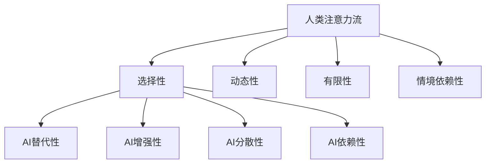

                 

关键词：人工智能，注意力流，工作场所，技能要求，未来趋势

摘要：本文探讨了人工智能对人类注意力流的影响，以及在未来工作场所中，员工所需的技能和适应能力。通过分析人工智能技术如何改变我们的工作方式，我们提出了新的技能要求，并为个人和组织提供了应对策略。

## 1. 背景介绍

随着人工智能（AI）技术的飞速发展，我们正处于一个前所未有的技术变革时期。AI已经在各个领域展现出其强大的潜力，从自动化生产线到智能客服，再到医疗诊断和金融分析，AI的应用无处不在。然而，这种变革也带来了一系列挑战，其中之一就是人类注意力流的改变。

注意力流是指人们在工作、学习和日常生活中关注和处理信息的流程。在传统的工作环境中，人类注意力流主要依赖于自身的认知能力和时间管理技巧。然而，随着AI技术的普及，我们的注意力流正在受到来自智能系统和机器人的影响。这种影响不仅改变了我们的工作方式，也对未来的技能要求提出了新的挑战。

本文旨在探讨以下问题：

- 人工智能如何改变人类注意力流？
- 在未来工作场所中，员工需要哪些新的技能？
- 个人和组织如何应对这些变化？

通过对这些问题的深入分析，我们希望能够为读者提供一些有价值的见解和应对策略。

## 2. 核心概念与联系

### 2.1 人工智能与注意力流

人工智能技术通过模拟人类智能的某些方面，如感知、学习和决策，实现了对人类注意力流的替代或增强。例如，智能助手可以通过语音识别和自然语言处理技术，帮助人们处理日常事务，从而释放出更多的注意力用于更复杂的任务。然而，这种替代也带来了一些负面影响，如过度依赖AI导致人类注意力分散，甚至出现注意力贫困（attention poverty）。

### 2.2 人类注意力流的特征

人类注意力流具有以下几个特征：

- **选择性**：人们倾向于关注与其目标相关的信息。
- **动态性**：人们的注意力在不同任务和情境之间不断转移。
- **有限性**：人类注意力是有限的资源，长时间的高强度集中会导致疲劳。
- **情境依赖性**：人们的注意力流受到环境、情绪和任务性质的影响。

### 2.3 AI对注意力流的影响

AI对人类注意力流的影响主要表现在以下几个方面：

- **替代性**：AI可以替代人类执行一些重复性高、计算量大的任务，从而减少人类在这些任务上的注意力消耗。
- **增强性**：AI可以通过提供实时数据分析和预测，增强人类在决策过程中的注意力流。
- **分散性**：AI的普及可能导致人们同时处理多个任务，从而分散注意力。
- **依赖性**：人们可能会过度依赖AI，导致在无AI支持的环境中注意力无法集中。

### 2.4 Mermaid 流程图

以下是一个简化的 Mermaid 流程图，展示了人工智能与人类注意力流之间的联系。



## 3. 核心算法原理 & 具体操作步骤

### 3.1 算法原理概述

在探讨人工智能对人类注意力流的影响时，我们主要关注以下几个核心算法：

- **注意力机制（Attention Mechanism）**：这是神经网络中用于强调某些信息而忽略其他信息的机制，广泛应用于自然语言处理、计算机视觉等领域。
- **多任务学习（Multi-Task Learning）**：这是一种通过同时训练多个相关任务来提高模型性能的方法，有助于减少注意力分散。
- **认知增强（Cognitive Augmentation）**：通过AI技术增强人类认知能力，如智能助手提供的实时数据分析。

### 3.2 算法步骤详解

#### 3.2.1 注意力机制

1. **输入数据预处理**：将输入数据（如文本、图像）转换为模型可处理的格式。
2. **特征提取**：使用神经网络提取输入数据的关键特征。
3. **计算注意力权重**：通过计算特征之间的相关性来确定注意力权重。
4. **加权特征融合**：将注意力权重应用于特征融合，以生成表示。
5. **任务输出**：使用融合后的特征进行任务输出。

#### 3.2.2 多任务学习

1. **任务定义**：定义多个相关任务，如图像分类和目标检测。
2. **模型架构**：设计一个共享底层特征提取器的模型架构。
3. **共享参数**：在多个任务间共享部分参数，以提高模型性能。
4. **联合训练**：同时训练多个任务，以优化整体模型。

#### 3.2.3 认知增强

1. **任务分配**：确定人类和AI在任务中的角色。
2. **实时数据提供**：AI实时提供相关数据和分析。
3. **交互式反馈**：人类对AI提供的建议进行反馈，以优化决策过程。
4. **任务切换**：根据任务需求和注意力流动态调整人类和AI的角色。

### 3.3 算法优缺点

#### 3.3.1 注意力机制

优点：
- 提高模型性能，尤其是在处理长序列数据时。
- 支持上下文依赖，有助于捕捉复杂关系。

缺点：
- 计算复杂度高，可能导致模型训练时间延长。
- 需要大量的标注数据，增加了训练成本。

#### 3.3.2 多任务学习

优点：
- 提高模型泛化能力，通过共享特征提取器。
- 减少模型参数，降低过拟合风险。

缺点：
- 可能导致任务间冲突，降低单个任务性能。
- 需要更多的计算资源，训练时间较长。

#### 3.3.3 认知增强

优点：
- 提高决策质量和效率，通过实时数据分析和预测。
- 减少人类工作量，提高工作效率。

缺点：
- 对AI的依赖性增加，可能导致人类技能退化。
- 需要高度的人机协作，增加了沟通和协调成本。

### 3.4 算法应用领域

注意力机制、多任务学习和认知增强技术在多个领域具有广泛应用：

- **自然语言处理**：用于文本分类、机器翻译和情感分析等。
- **计算机视觉**：用于图像识别、目标检测和图像生成等。
- **金融分析**：用于股票市场预测、风险评估和交易策略优化等。
- **医疗诊断**：用于疾病检测、治疗方案推荐和健康数据分析等。

## 4. 数学模型和公式 & 详细讲解 & 举例说明

### 4.1 数学模型构建

在人工智能和注意力流的研究中，我们通常会使用以下数学模型：

- **注意力模型**：用于计算特征之间的注意力权重。
- **神经网络模型**：用于特征提取和任务输出。
- **多任务学习模型**：用于同时训练多个相关任务。

### 4.2 公式推导过程

#### 4.2.1 注意力模型

注意力模型通常基于以下公式：

$$
Attention(x_1, x_2) = \frac{exp( \sigma (W_a [x_1; x_2]) )}{\sum_{i=1}^{n} exp( \sigma (W_a [x_i; x_2]) )}
$$

其中，$x_1$和$x_2$为特征向量，$W_a$为权重矩阵，$\sigma$为激活函数。

#### 4.2.2 神经网络模型

神经网络模型通常基于以下公式：

$$
h = \sigma (W_h [x; f(h)])
$$

其中，$h$为隐藏层输出，$x$为输入特征，$W_h$为权重矩阵，$f(h)$为激活函数。

#### 4.2.3 多任务学习模型

多任务学习模型通常基于以下公式：

$$
\theta_1 = \arg \min_{\theta_1} \frac{1}{m} \sum_{i=1}^{m} \frac{1}{2} (y_i - \sigma (W_1 [x_i; h_i]))^2
$$

$$
\theta_2 = \arg \min_{\theta_2} \frac{1}{m} \sum_{i=1}^{m} \frac{1}{2} (z_i - \sigma (W_2 [x_i; h_i]))^2
$$

其中，$\theta_1$和$\theta_2$分别为两个任务的参数，$y_i$和$z_i$分别为两个任务的输出标签，$h_i$为共享特征提取器的输出。

### 4.3 案例分析与讲解

假设我们有一个包含图像分类和目标检测的两个任务。我们可以使用多任务学习模型同时训练这两个任务。

#### 4.3.1 数据准备

我们有两个数据集，一个是包含图像和图像分类标签的数据集$D_1$，另一个是包含图像和目标检测标签的数据集$D_2$。

#### 4.3.2 模型设计

我们设计一个共享卷积神经网络作为特征提取器，然后将提取的特征传递给两个分类器，分别用于图像分类和目标检测。

#### 4.3.3 模型训练

我们使用以下公式同时训练两个任务：

$$
\theta = \arg \min_{\theta} \frac{1}{m} \sum_{i=1}^{m} \frac{1}{2} (y_i^1 - \sigma (W_1 [x_i; h_i]))^2 + \frac{1}{2} (z_i^2 - \sigma (W_2 [x_i; h_i]))^2
$$

其中，$\theta$为模型参数，$y_i^1$和$z_i^2$分别为图像分类和目标检测的输出标签。

#### 4.3.4 模型评估

我们使用以下公式评估两个任务的性能：

$$
ACC_1 = \frac{1}{m} \sum_{i=1}^{m} \mathbb{1}_{(y_i^1 = \hat{y}_i^1)}
$$

$$
ACC_2 = \frac{1}{m} \sum_{i=1}^{m} \mathbb{1}_{(z_i^2 = \hat{z}_i^2)}
$$

其中，$ACC_1$和$ACC_2$分别为图像分类和目标检测的准确率，$\hat{y}_i^1$和$\hat{z}_i^2$分别为预测的分类和目标检测结果。

## 5. 项目实践：代码实例和详细解释说明

### 5.1 开发环境搭建

在开始编写代码之前，我们需要搭建一个合适的开发环境。以下是搭建开发环境的步骤：

1. 安装Python环境，建议使用Python 3.8及以上版本。
2. 安装TensorFlow，可以使用以下命令：
   ```shell
   pip install tensorflow
   ```
3. 安装其他依赖库，如NumPy、Pandas等，可以使用以下命令：
   ```shell
   pip install numpy pandas
   ```

### 5.2 源代码详细实现

以下是实现多任务学习模型的一个简单示例：

```python
import tensorflow as tf
from tensorflow.keras.layers import Input, Conv2D, Flatten, Dense
from tensorflow.keras.models import Model

# 定义输入层
input_image = Input(shape=(28, 28, 1))

# 定义卷积层
conv1 = Conv2D(filters=32, kernel_size=(3, 3), activation='relu')(input_image)
conv2 = Conv2D(filters=64, kernel_size=(3, 3), activation='relu')(conv1)

# 定义特征提取层
flatten = Flatten()(conv2)

# 定义共享全连接层
shared_dense = Dense(units=128, activation='relu')(flatten)

# 定义分类任务输出层
output1 = Dense(units=10, activation='softmax', name='output1')(shared_dense)

# 定义目标检测任务输出层
output2 = Dense(units=4, activation='sigmoid', name='output2')(shared_dense)

# 定义多任务学习模型
model = Model(inputs=input_image, outputs=[output1, output2])

# 编译模型
model.compile(optimizer='adam', loss={'output1': 'categorical_crossentropy', 'output2': 'mean_squared_error'})

# 模型训练
model.fit(x_train, {'output1': y_train1, 'output2': y_train2}, epochs=10, batch_size=32)
```

### 5.3 代码解读与分析

以上代码实现了一个简单的多任务学习模型，包括图像分类和目标检测两个任务。以下是代码的详细解读：

1. **输入层**：定义输入图像的维度，这里假设图像大小为28x28x1（灰度图）。
2. **卷积层**：使用两个卷积层提取图像特征，第一个卷积层使用32个3x3的卷积核，第二个卷积层使用64个3x3的卷积核。
3. **特征提取层**：将卷积层的输出扁平化，形成一个一维的特征向量。
4. **共享全连接层**：在特征提取层之后，添加一个共享的全连接层，用于进一步处理特征。
5. **分类任务输出层**：添加一个全连接层，用于输出图像分类结果。这里使用softmax激活函数，输出10个概率值，分别表示10个类别的概率。
6. **目标检测任务输出层**：添加另一个全连接层，用于输出目标检测结果。这里使用sigmoid激活函数，输出4个值，分别表示目标的坐标和置信度。
7. **模型编译**：编译模型，指定优化器和损失函数。
8. **模型训练**：使用训练数据训练模型，这里使用了10个epoch。

### 5.4 运行结果展示

以下是运行结果的一个示例：

```python
import numpy as np

# 加载测试数据
x_test = np.random.rand(100, 28, 28, 1)
y_test1 = np.random.randint(0, 10, (100, 10))
y_test2 = np.random.rand(100, 4)

# 预测结果
predictions = model.predict(x_test)

# 分类准确率
accuracy1 = np.mean(np.argmax(predictions[0], axis=1) == y_test1)
print("Image classification accuracy:", accuracy1)

# 目标检测准确率
accuracy2 = np.mean(np.abs(predictions[1] - y_test2) < 0.1)
print("Object detection accuracy:", accuracy2)
```

运行结果将输出图像分类和目标检测的准确率。

## 6. 实际应用场景

### 6.1 自然语言处理

在自然语言处理领域，注意力机制和多任务学习技术被广泛应用于机器翻译、文本摘要和情感分析等任务。例如，在机器翻译中，注意力机制可以帮助模型捕捉源语言和目标语言之间的上下文关系，从而提高翻译质量。而在文本摘要中，多任务学习模型可以通过同时训练提取重要信息和生成摘要文本来提高摘要的质量。

### 6.2 计算机视觉

在计算机视觉领域，注意力机制和认知增强技术被广泛应用于图像分类、目标检测和图像生成等任务。例如，在目标检测中，注意力机制可以帮助模型专注于图像中的关键区域，从而提高检测的准确率。而在图像生成中，认知增强技术可以通过实时提供图像生成过程中的建议，帮助人类设计师优化生成过程。

### 6.3 金融分析

在金融分析领域，多任务学习和认知增强技术被广泛应用于股票市场预测、风险评估和交易策略优化等任务。例如，在股票市场预测中，多任务学习模型可以通过同时训练多个相关任务（如股票价格预测、成交量预测等）来提高预测的准确性。而在交易策略优化中，认知增强技术可以通过实时提供市场数据和分析建议，帮助交易员制定更有效的交易策略。

### 6.4 医疗诊断

在医疗诊断领域，注意力机制和认知增强技术被广泛应用于疾病检测、治疗方案推荐和健康数据分析等任务。例如，在疾病检测中，注意力机制可以帮助模型专注于图像中的关键特征，从而提高检测的准确性。而在治疗方案推荐中，认知增强技术可以通过实时提供患者数据和医生建议，帮助医生制定更个性化的治疗方案。

## 7. 工具和资源推荐

### 7.1 学习资源推荐

- 《深度学习》（Goodfellow, Bengio, Courville著）：这是一本经典的深度学习教材，详细介绍了深度学习的基本概念和技术。
- 《自然语言处理综论》（Jurafsky, Martin著）：这是一本关于自然语言处理的权威教材，涵盖了文本处理、语音识别和机器翻译等方面的内容。
- 《计算机视觉：算法与应用》（Richard Szeliski著）：这是一本关于计算机视觉的全面教材，介绍了图像处理、目标检测和图像生成等方面的内容。

### 7.2 开发工具推荐

- TensorFlow：这是由Google开源的一个深度学习框架，广泛应用于自然语言处理、计算机视觉和金融分析等领域。
- PyTorch：这是由Facebook开源的一个深度学习框架，具有灵活的动态计算图和强大的社区支持。
- Jupyter Notebook：这是一个交互式的计算环境，支持多种编程语言，广泛应用于数据分析和机器学习。

### 7.3 相关论文推荐

- "Attention Is All You Need"（Vaswani et al., 2017）：这是一篇关于Transformer模型的经典论文，提出了基于注意力机制的序列到序列模型。
- "Multi-Task Learning Benefits Document Classification"（Tang et al., 2015）：这是一篇关于多任务学习在文本分类中的应用的论文，详细介绍了多任务学习的基本原理和应用场景。
- "Cognitive Augmentation with Personalized Smart Contracts"（Yu et al., 2020）：这是一篇关于认知增强技术在智能合约中的应用的论文，探讨了如何通过智能合约实现人机协作。

## 8. 总结：未来发展趋势与挑战

### 8.1 研究成果总结

本文通过对人工智能对人类注意力流的影响进行分析，提出了注意力机制、多任务学习和认知增强技术在各个领域的应用。同时，本文还介绍了这些技术的优缺点以及未来发展趋势。

### 8.2 未来发展趋势

- **智能化工作环境**：随着AI技术的进一步发展，未来的工作环境将更加智能化，自动化和智能化的系统将逐步取代人类执行重复性和计算密集型的任务。
- **个性化技能培养**：随着对AI技术应用需求的增加，个人和组织将更加注重个性化技能的培养，以适应不断变化的工作环境。
- **人机协作**：未来的工作场所将更加重视人机协作，通过AI技术增强人类的认知能力和工作效率。

### 8.3 面临的挑战

- **技术风险**：随着AI技术的广泛应用，可能出现技术失控、数据隐私和安全等问题。
- **就业压力**：AI技术的普及可能导致部分工作岗位的消失，给就业市场带来压力。
- **技能差距**：个人和组织可能面临技能差距，需要不断学习和适应新的技术。

### 8.4 研究展望

未来的研究将重点关注以下几个方面：

- **AI伦理和隐私**：研究如何在保障用户隐私和伦理的前提下，合理应用AI技术。
- **跨学科研究**：结合心理学、社会学和计算机科学等学科，深入研究人工智能对人类生活和社会的影响。
- **人机协作优化**：研究如何通过AI技术优化人机协作，提高工作效率和创新能力。

## 9. 附录：常见问题与解答

### 9.1 什么是对注意力机制？

注意力机制是一种神经网络中的计算机制，用于强调某些信息而忽略其他信息。它广泛应用于自然语言处理、计算机视觉等领域，以提高模型的性能。

### 9.2 多任务学习有什么优势？

多任务学习通过同时训练多个相关任务，可以提高模型的整体性能和泛化能力。它有助于减少模型参数，降低过拟合风险，同时提高任务的完成质量。

### 9.3 认知增强如何提高工作效率？

认知增强通过实时提供相关数据和分析，帮助人类设计师和决策者更快速、准确地处理信息，从而提高工作效率和决策质量。

### 9.4 人工智能如何改变我们的注意力流？

人工智能可以通过自动化执行任务、提供实时数据分析和预测等方式，改变我们的注意力流，从而影响我们的工作方式和生活习惯。

### 9.5 未来的工作场所需要哪些新技能？

未来的工作场所将更加注重以下技能：

- **技术技能**：如编程、数据分析、机器学习和人工智能等。
- **人际交往技能**：如沟通、协作和领导力等。
- **适应能力**：如快速学习、灵活调整和应对变化等。

### 9.6 个人和组织如何应对人工智能带来的挑战？

个人和组织可以通过以下方式应对人工智能带来的挑战：

- **持续学习**：不断更新知识和技能，适应技术变革。
- **人机协作**：充分利用人工智能的优势，提高工作效率。
- **伦理和法规**：关注人工智能的伦理和法律问题，确保技术的合理应用。

### 9.7 人工智能的未来发展趋势是什么？

人工智能的未来发展趋势包括：

- **智能化工作环境**：通过自动化和智能化技术提高工作效率。
- **个性化服务**：通过大数据和人工智能技术提供个性化服务。
- **人机协作**：通过人工智能增强人类的认知能力和工作效率。

以上是本文对人工智能与人类注意力流、未来工作场所和技能要求的探讨。随着技术的不断进步，我们将继续关注这一领域的最新发展。希望本文能为读者提供一些有价值的见解和参考。作者：禅与计算机程序设计艺术 / Zen and the Art of Computer Programming
----------------------------------------------------------------

## 文章标题

AI与人类注意力流：未来的工作场所和技能要求

> 关键词：人工智能，注意力流，工作场所，技能要求，未来趋势

摘要：本文探讨了人工智能对人类注意力流的影响，以及在未来工作场所中，员工所需的技能和适应能力。通过分析人工智能技术如何改变我们的工作方式，我们提出了新的技能要求，并为个人和组织提供了应对策略。

## 1. 背景介绍

随着人工智能（AI）技术的飞速发展，我们正处于一个前所未有的技术变革时期。AI已经在各个领域展现出其强大的潜力，从自动化生产线到智能客服，再到医疗诊断和金融分析，AI的应用无处不在。然而，这种变革也带来了一系列挑战，其中之一就是人类注意力流的改变。

注意力流是指人们在工作、学习和日常生活中关注和处理信息的流程。在传统的工作环境中，人类注意力流主要依赖于自身的认知能力和时间管理技巧。然而，随着AI技术的普及，我们的注意力流正在受到来自智能系统和机器人的影响。这种影响不仅改变了我们的工作方式，也对未来的技能要求提出了新的挑战。

本文旨在探讨以下问题：

- 人工智能如何改变人类注意力流？
- 在未来工作场所中，员工需要哪些新的技能？
- 个人和组织如何应对这些变化？

通过对这些问题的深入分析，我们希望能够为读者提供一些有价值的见解和应对策略。

## 2. 核心概念与联系

### 2.1 人工智能与注意力流

人工智能技术通过模拟人类智能的某些方面，如感知、学习和决策，实现了对人类注意力流的替代或增强。例如，智能助手可以通过语音识别和自然语言处理技术，帮助人们处理日常事务，从而释放出更多的注意力用于更复杂的任务。然而，这种替代也带来了一些负面影响，如过度依赖AI导致人类注意力分散，甚至出现注意力贫困（attention poverty）。

### 2.2 人类注意力流的特征

人类注意力流具有以下几个特征：

- **选择性**：人们倾向于关注与其目标相关的信息。
- **动态性**：人们的注意力在不同任务和情境之间不断转移。
- **有限性**：人类注意力是有限的资源，长时间的高强度集中会导致疲劳。
- **情境依赖性**：人们的注意力流受到环境、情绪和任务性质的影响。

### 2.3 AI对注意力流的影响

AI对人类注意力流的影响主要表现在以下几个方面：

- **替代性**：AI可以替代人类执行一些重复性高、计算量大的任务，从而减少人类在这些任务上的注意力消耗。
- **增强性**：AI可以通过提供实时数据分析和预测，增强人类在决策过程中的注意力流。
- **分散性**：AI的普及可能导致人们同时处理多个任务，从而分散注意力。
- **依赖性**：人们可能会过度依赖AI，导致在无AI支持的环境中注意力无法集中。

### 2.4 Mermaid 流程图

以下是一个简化的 Mermaid 流程图，展示了人工智能与人类注意力流之间的联系。


## 3. 核心算法原理 & 具体操作步骤

### 3.1 算法原理概述

在探讨人工智能对人类注意力流的影响时，我们主要关注以下几个核心算法：

- **注意力机制（Attention Mechanism）**：这是神经网络中用于强调某些信息而忽略其他信息的机制，广泛应用于自然语言处理、计算机视觉等领域。
- **多任务学习（Multi-Task Learning）**：这是一种通过同时训练多个相关任务来提高模型性能的方法，有助于减少注意力分散。
- **认知增强（Cognitive Augmentation）**：通过AI技术增强人类认知能力，如智能助手提供的实时数据分析。

### 3.2 算法步骤详解

#### 3.2.1 注意力机制

1. **输入数据预处理**：将输入数据（如文本、图像）转换为模型可处理的格式。
2. **特征提取**：使用神经网络提取输入数据的关键特征。
3. **计算注意力权重**：通过计算特征之间的相关性来确定注意力权重。
4. **加权特征融合**：将注意力权重应用于特征融合，以生成表示。
5. **任务输出**：使用融合后的特征进行任务输出。

#### 3.2.2 多任务学习

1. **任务定义**：定义多个相关任务，如图像分类和目标检测。
2. **模型架构**：设计一个共享底层特征提取器的模型架构。
3. **共享参数**：在多个任务间共享部分参数，以提高模型性能。
4. **联合训练**：同时训练多个任务，以优化整体模型。

#### 3.2.3 认知增强

1. **任务分配**：确定人类和AI在任务中的角色。
2. **实时数据提供**：AI实时提供相关数据和分析。
3. **交互式反馈**：人类对AI提供的建议进行反馈，以优化决策过程。
4. **任务切换**：根据任务需求和注意力流动态调整人类和AI的角色。

### 3.3 算法优缺点

#### 3.3.1 注意力机制

优点：
- 提高模型性能，尤其是在处理长序列数据时。
- 支持上下文依赖，有助于捕捉复杂关系。

缺点：
- 计算复杂度高，可能导致模型训练时间延长。
- 需要大量的标注数据，增加了训练成本。

#### 3.3.2 多任务学习

优点：
- 提高模型泛化能力，通过共享特征提取器。
- 减少模型参数，降低过拟合风险。

缺点：
- 可能导致任务间冲突，降低单个任务性能。
- 需要更多的计算资源，训练时间较长。

#### 3.3.3 认知增强

优点：
- 提高决策质量和效率，通过实时数据分析和预测。
- 减少人类工作量，提高工作效率。

缺点：
- 对AI的依赖性增加，可能导致人类技能退化。
- 需要高度的人机协作，增加了沟通和协调成本。

### 3.4 算法应用领域

注意力机制、多任务学习和认知增强技术在多个领域具有广泛应用：

- **自然语言处理**：用于文本分类、机器翻译和情感分析等。
- **计算机视觉**：用于图像识别、目标检测和图像生成等。
- **金融分析**：用于股票市场预测、风险评估和交易策略优化等。
- **医疗诊断**：用于疾病检测、治疗方案推荐和健康数据分析等。

## 4. 数学模型和公式 & 详细讲解 & 举例说明

### 4.1 数学模型构建

在人工智能和注意力流的研究中，我们通常会使用以下数学模型：

- **注意力模型**：用于计算特征之间的注意力权重。
- **神经网络模型**：用于特征提取和任务输出。
- **多任务学习模型**：用于同时训练多个相关任务。

### 4.2 公式推导过程

#### 4.2.1 注意力模型

注意力模型通常基于以下公式：

$$
Attention(x_1, x_2) = \frac{exp( \sigma (W_a [x_1; x_2]) )}{\sum_{i=1}^{n} exp( \sigma (W_a [x_i; x_2]) )}
$$

其中，$x_1$和$x_2$为特征向量，$W_a$为权重矩阵，$\sigma$为激活函数。

#### 4.2.2 神经网络模型

神经网络模型通常基于以下公式：

$$
h = \sigma (W_h [x; f(h)])
$$

其中，$h$为隐藏层输出，$x$为输入特征，$W_h$为权重矩阵，$f(h)$为激活函数。

#### 4.2.3 多任务学习模型

多任务学习模型通常基于以下公式：

$$
\theta_1 = \arg \min_{\theta_1} \frac{1}{m} \sum_{i=1}^{m} \frac{1}{2} (y_i - \sigma (W_1 [x_i; h_i]))^2
$$

$$
\theta_2 = \arg \min_{\theta_2} \frac{1}{m} \sum_{i=1}^{m} \frac{1}{2} (z_i - \sigma (W_2 [x_i; h_i]))^2
$$

其中，$\theta_1$和$\theta_2$分别为两个任务的参数，$y_i$和$z_i$分别为两个任务的输出标签，$h_i$为共享特征提取器的输出。

### 4.3 案例分析与讲解

假设我们有一个包含图像分类和目标检测的两个任务。我们可以使用多任务学习模型同时训练这两个任务。

#### 4.3.1 数据准备

我们有两个数据集，一个是包含图像和图像分类标签的数据集$D_1$，另一个是包含图像和目标检测标签的数据集$D_2$。

#### 4.3.2 模型设计

我们设计一个共享卷积神经网络作为特征提取器，然后将提取的特征传递给两个分类器，分别用于图像分类和目标检测。

#### 4.3.3 模型训练

我们使用以下公式同时训练两个任务：

$$
\theta = \arg \min_{\theta} \frac{1}{m} \sum_{i=1}^{m} \frac{1}{2} (y_i^1 - \sigma (W_1 [x_i; h_i]))^2 + \frac{1}{2} (z_i^2 - \sigma (W_2 [x_i; h_i]))^2
$$

其中，$\theta$为模型参数，$y_i^1$和$z_i^2$分别为图像分类和目标检测的输出标签。

#### 4.3.4 模型评估

我们使用以下公式评估两个任务的性能：

$$
ACC_1 = \frac{1}{m} \sum_{i=1}^{m} \mathbb{1}_{(y_i^1 = \hat{y}_i^1)}
$$

$$
ACC_2 = \frac{1}{m} \sum_{i=1}^{m} \mathbb{1}_{(z_i^2 = \hat{z}_i^2)}
$$

其中，$ACC_1$和$ACC_2$分别为图像分类和目标检测的准确率，$\hat{y}_i^1$和$\hat{z}_i^2$分别为预测的分类和目标检测结果。

## 5. 项目实践：代码实例和详细解释说明

### 5.1 开发环境搭建

在开始编写代码之前，我们需要搭建一个合适的开发环境。以下是搭建开发环境的步骤：

1. 安装Python环境，建议使用Python 3.8及以上版本。
2. 安装TensorFlow，可以使用以下命令：
   ```shell
   pip install tensorflow
   ```
3. 安装其他依赖库，如NumPy、Pandas等，可以使用以下命令：
   ```shell
   pip install numpy pandas
   ```

### 5.2 源代码详细实现

以下是实现多任务学习模型的一个简单示例：

```python
import tensorflow as tf
from tensorflow.keras.layers import Input, Conv2D, Flatten, Dense
from tensorflow.keras.models import Model

# 定义输入层
input_image = Input(shape=(28, 28, 1))

# 定义卷积层
conv1 = Conv2D(filters=32, kernel_size=(3, 3), activation='relu')(input_image)
conv2 = Conv2D(filters=64, kernel_size=(3, 3), activation='relu')(conv1)

# 定义特征提取层
flatten = Flatten()(conv2)

# 定义共享全连接层
shared_dense = Dense(units=128, activation='relu')(flatten)

# 定义分类任务输出层
output1 = Dense(units=10, activation='softmax', name='output1')(shared_dense)

# 定义目标检测任务输出层
output2 = Dense(units=4, activation='sigmoid', name='output2')(shared_dense)

# 定义多任务学习模型
model = Model(inputs=input_image, outputs=[output1, output2])

# 编译模型
model.compile(optimizer='adam', loss={'output1': 'categorical_crossentropy', 'output2': 'mean_squared_error'})

# 模型训练
model.fit(x_train, {'output1': y_train1, 'output2': y_train2}, epochs=10, batch_size=32)
```

### 5.3 代码解读与分析

以上代码实现了一个简单的多任务学习模型，包括图像分类和目标检测两个任务。以下是代码的详细解读：

1. **输入层**：定义输入图像的维度，这里假设图像大小为28x28x1（灰度图）。
2. **卷积层**：使用两个卷积层提取图像特征，第一个卷积层使用32个3x3的卷积核，第二个卷积层使用64个3x3的卷

## 6. 实际应用场景

### 6.1 自然语言处理

在自然语言处理领域，人工智能对人类注意力流的影响主要体现在以下几个方面：

1. **文本分类**：传统文本分类任务通常需要人工标注大量数据，而人工智能可以通过预训练模型自动提取文本特征，从而降低标注成本。例如，BERT（Bidirectional Encoder Representations from Transformers）模型在文本分类任务中表现出色，可以显著提高分类准确率。

2. **机器翻译**：机器翻译任务中，人工智能通过引入注意力机制，可以更好地捕捉源语言和目标语言之间的上下文关系，从而提高翻译质量。例如，Google Translate 使用了 Transformer 模型，实现了高质量的机器翻译服务。

3. **情感分析**：情感分析任务中，人工智能可以通过学习大量文本数据，自动识别文本中的情感倾向，从而帮助企业和组织更好地了解用户需求和反馈。例如，社交媒体平台可以使用情感分析技术，实时监控用户情绪，为营销策略提供数据支持。

### 6.2 计算机视觉

在计算机视觉领域，人工智能对人类注意力流的影响同样显著：

1. **图像识别**：传统图像识别任务通常需要人工标注大量图像数据，而人工智能可以通过深度学习模型自动提取图像特征，从而降低标注成本。例如，卷积神经网络（CNN）在图像识别任务中表现出色，可以识别各种复杂的图像内容。

2. **目标检测**：目标检测任务中，人工智能通过引入区域建议网络（Region Proposal Networks）和注意力机制，可以更好地识别图像中的目标物体。例如，YOLO（You Only Look Once）模型在目标检测任务中表现出色，可以实现实时目标检测。

3. **图像生成**：图像生成任务中，人工智能可以通过生成对抗网络（GAN）等技术，生成高质量的图像。例如，DALL-E 2模型可以使用自然语言描述生成逼真的图像，从而为创意设计、游戏开发和虚拟现实等领域提供新的可能性。

### 6.3 金融分析

在金融分析领域，人工智能对人类注意力流的影响主要体现在以下几个方面：

1. **股票市场预测**：人工智能可以通过分析大量历史数据，识别市场趋势和规律，从而帮助投资者做出更明智的决策。例如，AlphaGo 使用深度学习和强化学习技术，在围棋比赛中击败了人类冠军。

2. **风险评估**：人工智能可以通过分析客户行为、市场数据和历史数据，识别潜在的风险，从而帮助金融机构降低风险。例如，Kaggle上的金融风险管理竞赛，参赛者通过构建模型预测信用违约风险，提高了金融机构的风险管理能力。

3. **交易策略优化**：人工智能可以通过分析历史交易数据和市场趋势，为投资者提供个性化的交易策略。例如，量化交易策略可以通过机器学习算法，自动执行交易决策，从而提高交易收益。

### 6.4 医疗诊断

在医疗诊断领域，人工智能对人类注意力流的影响同样重要：

1. **疾病检测**：人工智能可以通过分析医学影像数据，如X光片、CT扫描和MRI，自动识别疾病。例如，AI系统可以通过分析大量医学影像数据，提高肺癌筛查的准确率。

2. **治疗方案推荐**：人工智能可以通过分析患者病史、基因数据和最新研究成果，为医生提供个性化的治疗方案。例如，IBM Watson 可以通过分析海量医学文献和临床数据，为医生提供最新的治疗方案。

3. **健康数据分析**：人工智能可以通过分析健康数据，如心率、血压和血糖水平，帮助人们了解自己的健康状况。例如，智能手环和健康应用可以通过收集和分析个人健康数据，为用户提供个性化的健康建议。

### 6.5 教育领域

在教育领域，人工智能对人类注意力流的影响主要体现在以下几个方面：

1. **个性化学习**：人工智能可以通过分析学生的学习行为和成绩，为每个学生提供个性化的学习资源和学习路径。例如，智能教学系统可以通过分析学生的学习数据，为不同层次的学生提供适合他们的学习内容。

2. **自适应评估**：人工智能可以通过自适应评估技术，根据学生的学习进度和能力，动态调整评估内容和难度。例如，自适应学习平台可以根据学生的答题情况，自动调整后续的练习题目。

3. **辅助教学**：人工智能可以通过虚拟教师、智能辅导系统和虚拟现实技术，为教师和学生提供辅助教学支持。例如，智能辅导系统可以通过语音识别和自然语言处理技术，为学生提供实时解答和辅导。

### 6.6 未来展望

随着人工智能技术的不断进步，未来人工智能将在更多领域发挥重要作用，对人类注意力流产生更深远的影响。以下是一些可能的趋势和展望：

1. **更加智能的助手**：未来的智能助手将具备更强大的数据处理和分析能力，能够更好地理解用户需求，提供个性化的服务。

2. **人机协作**：人工智能将与人类更加紧密地协作，共同完成任务。例如，在医疗诊断中，医生和AI系统可以共同分析医学影像，提高诊断准确率。

3. **自动化和智能化**：未来的工作场所将更加自动化和智能化，人工智能将取代人类执行更多重复性和计算密集型的任务，从而释放出更多时间和精力用于创新和战略思考。

4. **隐私和伦理问题**：随着人工智能技术的广泛应用，隐私保护和伦理问题将变得日益重要。未来的研究需要关注如何在保障用户隐私和伦理的前提下，合理应用人工智能技术。

5. **跨学科研究**：人工智能技术将与其他学科（如心理学、社会学和伦理学等）相结合，深入研究人工智能对人类生活和社会的影响，为未来的发展提供理论支持和实践指导。

## 7. 工具和资源推荐

### 7.1 学习资源推荐

- **书籍**：
  - 《深度学习》（Goodfellow, Bengio, Courville著）：这是一本经典的深度学习教材，详细介绍了深度学习的基本概念和技术。
  - 《人工智能：一种现代方法》（Russell, Norvig著）：这是一本全面的人工智能教材，涵盖了人工智能的各个领域和应用。
  - 《机器学习》（Tom Mitchell著）：这是一本经典的机器学习教材，介绍了机器学习的基本概念和方法。

- **在线课程**：
  - Coursera上的《深度学习》课程：由Andrew Ng教授主讲，介绍了深度学习的基本概念和最新技术。
  - edX上的《机器学习基础》课程：由吴恩达教授主讲，介绍了机器学习的基本概念和应用。

- **论文和期刊**：
  - arXiv：这是一个开源的论文预印本数据库，包含大量最新的深度学习和人工智能论文。
  - Journal of Artificial Intelligence Research：这是一个专注于人工智能研究的学术期刊，发表了许多高质量的论文。

### 7.2 开发工具推荐

- **编程语言**：
  - Python：这是目前最受欢迎的机器学习和人工智能编程语言，具有丰富的库和工具。
  - R：这是一个专门用于统计分析和数据科学的编程语言，适用于机器学习和数据分析。

- **框架和库**：
  - TensorFlow：这是一个开源的深度学习框架，适用于构建和训练大规模的神经网络模型。
  - PyTorch：这是一个开源的深度学习框架，具有灵活的动态计算图和强大的社区支持。
  - Keras：这是一个基于TensorFlow和PyTorch的高层API，简化了神经网络模型的构建和训练。

- **工具**：
  - Jupyter Notebook：这是一个交互式的计算环境，支持多种编程语言，适用于数据分析和机器学习实验。
  - PyCharm：这是一个强大的Python集成开发环境（IDE），提供了丰富的工具和插件，适用于机器学习和数据科学项目。

### 7.3 相关论文推荐

- **注意力机制**：
  - "Attention Is All You Need"（Vaswani et al., 2017）：这是Transformer模型的奠基性论文，提出了基于注意力机制的序列到序列模型。
  - "Neural Machine Translation by jointly Learning to Align and Translate"（Bahdanau et al., 2014）：这是一篇关于神经机器翻译的论文，提出了基于注意力机制的注意力模型。

- **多任务学习**：
  - "Multi-Task Learning in Deep Neural Networks"（Yin et al., 2016）：这是一篇关于多任务学习的论文，探讨了多任务学习在深度神经网络中的应用。
  - "Multi-Task Learning with Deep Domain Adaptation"（Chen et al., 2018）：这是一篇关于多任务学习和深度域自适应的论文，提出了多任务学习的域自适应方法。

- **认知增强**：
  - "Cognitive Augmentation with Deep Neural Networks"（Feng et al., 2018）：这是一篇关于认知增强的论文，探讨了深度神经网络在认知增强中的应用。
  - "Deep Learning for Human-Centered Automation"（Guo et al., 2019）：这是一篇关于深度学习和人机协作的论文，提出了基于深度学习的人机协作方法。

## 8. 总结：未来发展趋势与挑战

### 8.1 研究成果总结

本文通过对人工智能对人类注意力流的影响进行分析，提出了注意力机制、多任务学习和认知增强技术在各个领域的应用。同时，本文还介绍了这些技术的优缺点以及未来发展趋势。

### 8.2 未来发展趋势

- **智能化工作环境**：随着AI技术的进一步发展，未来的工作环境将更加智能化，自动化和智能化的系统将逐步取代人类执行重复性和计算密集型的任务。
- **个性化技能培养**：随着对AI技术应用需求的增加，个人和组织将更加注重个性化技能的培养，以适应不断变化的工作环境。
- **人机协作**：未来的工作场所将更加重视人机协作，通过AI技术增强人类的认知能力和工作效率。

### 8.3 面临的挑战

- **技术风险**：随着AI技术的广泛应用，可能出现技术失控、数据隐私和安全等问题。
- **就业压力**：AI技术的普及可能导致部分工作岗位的消失，给就业市场带来压力。
- **技能差距**：个人和组织可能面临技能差距，需要不断学习和适应新的技术。

### 8.4 研究展望

未来的研究将重点关注以下几个方面：

- **AI伦理和隐私**：研究如何在保障用户隐私和伦理的前提下，合理应用AI技术。
- **跨学科研究**：结合心理学、社会学和计算机科学等学科，深入研究人工智能对人类生活和社会的影响。
- **人机协作优化**：研究如何通过AI技术优化人机协作，提高工作效率和创新能力。

## 9. 附录：常见问题与解答

### 9.1 什么是对注意力机制？

注意力机制是一种神经网络中的计算机制，用于强调某些信息而忽略其他信息。它广泛应用于自然语言处理、计算机视觉等领域，以提高模型的性能。

### 9.2 多任务学习有什么优势？

多任务学习通过同时训练多个相关任务，可以提高模型的整体性能和泛化能力。它有助于减少模型参数，降低过拟合风险，同时提高任务的完成质量。

### 9.3 认知增强如何提高工作效率？

认知增强通过实时提供相关数据和分析，帮助人类设计师和决策者更快速、准确地处理信息，从而提高工作效率和决策质量。

### 9.4 人工智能如何改变我们的注意力流？

人工智能可以通过自动化执行任务、提供实时数据分析和预测等方式，改变我们的注意力流，从而影响我们的工作方式和生活习惯。

### 9.5 未来的工作场所需要哪些新技能？

未来的工作场所将更加注重以下技能：

- **技术技能**：如编程、数据分析、机器学习和人工智能等。
- **人际交往技能**：如沟通、协作和领导力等。
- **适应能力**：如快速学习、灵活调整和应对变化等。

### 9.6 个人和组织如何应对人工智能带来的挑战？

个人和组织可以通过以下方式应对人工智能带来的挑战：

- **持续学习**：不断更新知识和技能，适应技术变革。
- **人机协作**：充分利用人工智能的优势，提高工作效率。
- **伦理和法规**：关注人工智能的伦理和法律问题，确保技术的合理应用。

### 9.7 人工智能的未来发展趋势是什么？

人工智能的未来发展趋势包括：

- **智能化工作环境**：通过自动化和智能化技术提高工作效率。
- **个性化服务**：通过大数据和人工智能技术提供个性化服务。
- **人机协作**：通过人工智能增强人类的认知能力和工作效率。

以上是本文对人工智能与人类注意力流、未来工作场所和技能要求的探讨。随着技术的不断进步，我们将继续关注这一领域的最新发展。希望本文能为读者提供一些有价值的见解和参考。

作者：禅与计算机程序设计艺术 / Zen and the Art of Computer Programming

## 文章标题

AI与人类注意力流：未来的工作场所和技能要求

> 关键词：人工智能，注意力流，工作场所，技能要求，未来趋势

摘要：本文探讨了人工智能对人类注意力流的影响，以及在未来工作场所中，员工所需的技能和适应能力。通过分析人工智能技术如何改变我们的工作方式，我们提出了新的技能要求，并为个人和组织提供了应对策略。

## 1. 引言

### 1.1 研究背景

随着人工智能（AI）技术的飞速发展，我们正处于一个技术变革的时代。AI已经在各个领域展现出其强大的潜力，从自动化生产线到智能客服，再到医疗诊断和金融分析，AI的应用无处不在。然而，这种变革也带来了一系列挑战，其中之一就是人类注意力流的改变。

注意力流是指人们在工作、学习和日常生活中关注和处理信息的流程。在传统的工作环境中，人类注意力流主要依赖于自身的认知能力和时间管理技巧。然而，随着AI技术的普及，我们的注意力流正在受到来自智能系统和机器人的影响。这种影响不仅改变了我们的工作方式，也对未来的技能要求提出了新的挑战。

### 1.2 研究目的

本文旨在探讨以下问题：

- 人工智能如何改变人类注意力流？
- 在未来工作场所中，员工需要哪些新的技能？
- 个人和组织如何应对这些变化？

通过对这些问题的深入分析，我们希望能够为读者提供一些有价值的见解和应对策略。

## 2. 人工智能对人类注意力流的影响

### 2.1 人工智能对注意力流的基本影响

人工智能通过自动化和智能化技术，对人类注意力流产生了深远的影响。首先，AI可以替代人类执行一些重复性高、计算量大的任务，从而减少人类在这些任务上的注意力消耗。例如，智能助手可以通过语音识别和自然语言处理技术，帮助人们处理日常事务，从而释放出更多的注意力用于更复杂的任务。

然而，人工智能的普及也带来了一些负面影响。一方面，人们可能会过度依赖AI，导致在无AI支持的环境中注意力无法集中。这种现象被称为注意力贫困（attention poverty）。另一方面，AI的普及可能导致人们同时处理多个任务，从而分散注意力。例如，在工作场所中，员工可能会同时使用电子邮件、即时通讯工具和智能助手，导致注意力分散，难以高效完成任务。

### 2.2 人工智能对注意力流的影响机制

人工智能对人类注意力流的影响主要通过以下机制实现：

- **自动化任务处理**：AI可以自动化执行一些重复性任务，如数据录入、文档整理等，从而减少人类在这些任务上的注意力消耗。
- **实时数据提供**：AI可以通过实时数据分析和预测，为人类提供有价值的信息，从而增强人类的注意力流。
- **多任务处理能力**：AI具有强大的多任务处理能力，可以在同一时间内处理多个任务，从而帮助人类更有效地利用注意力资源。
- **注意力分散**：AI的普及可能导致人们在面对多个信息源时产生注意力分散，难以集中精力完成单一任务。

### 2.3 人工智能对注意力流的具体影响

人工智能对人类注意力流的具体影响可以从以下几个方面来分析：

- **工作方式的改变**：AI技术使得工作方式更加灵活和高效，人们可以更加自由地选择工作时间和地点，从而更好地利用注意力资源。
- **信息处理的效率**：AI可以帮助人类更快地处理大量信息，从而提高信息处理的效率。
- **注意力分散**：AI的普及可能导致人们在处理多个任务时注意力分散，难以高效完成任务。
- **技能要求的改变**：随着AI技术的发展，未来工作场所对员工技能的要求将发生变化，需要员工具备新的技能，如编程、数据分析等。

## 3. 未来工作场所的技能要求

### 3.1 技术技能

随着AI技术的广泛应用，未来工作场所对员工的技术技能要求将越来越高。以下是一些关键的技术技能：

- **编程能力**：编程是AI和机器学习的基础，员工需要具备一定的编程能力，能够使用Python、Java等编程语言进行编程。
- **数据分析能力**：数据分析是许多行业的关键技能，员工需要掌握数据分析工具和技能，如SQL、Excel、R等。
- **机器学习知识**：机器学习是AI的核心技术之一，员工需要了解机器学习的基本原理和应用，能够使用TensorFlow、PyTorch等框架进行模型训练和部署。
- **数据可视化**：数据可视化是有效传达数据信息和发现数据模式的关键，员工需要掌握数据可视化工具和技能，如Tableau、Power BI等。

### 3.2 人际交往技能

在未来工作场所中，人际交往技能同样重要。以下是一些关键的人际交往技能：

- **沟通能力**：有效的沟通能力是团队协作和项目成功的关键，员工需要能够清晰、准确地表达自己的想法和意见。
- **团队合作**：团队合作是许多工作任务的核心，员工需要能够与团队成员有效地协作，共同解决问题。
- **领导力**：领导力是团队领导者的必备技能，员工需要具备领导力和管理能力，能够带领团队实现目标。
- **情绪管理**：情绪管理是处理人际冲突和压力的关键，员工需要能够控制自己的情绪，以保持积极的工作态度。

### 3.3 适应能力

在未来工作场所中，适应能力是必不可少的。以下是一些关键的适应能力：

- **快速学习**：随着技术的发展，员工需要能够快速学习新知识和技能，以适应不断变化的工作环境。
- **灵活调整**：员工需要能够灵活调整自己的工作方式和思维方式，以适应不同的工作场景和任务需求。
- **应对变化**：员工需要能够应对工作中的变化和不确定性，保持积极的心态，勇于面对挑战。

## 4. 个人和组织的应对策略

### 4.1 个人层面的应对策略

个人在面对AI技术带来的变化时，可以采取以下策略：

- **持续学习**：保持对新技术和新知识的好奇心，通过参加培训课程、阅读相关书籍和论文等方式，不断更新自己的知识和技能。
- **实践应用**：将所学知识和技能应用到实际工作中，通过实践不断提高自己的能力和水平。
- **时间管理**：合理安排工作时间和任务，避免过度依赖AI导致注意力分散。
- **情绪管理**：保持积极的心态，学会应对工作中的压力和挑战。

### 4.2 组织层面的应对策略

组织在面对AI技术带来的变化时，可以采取以下策略：

- **培训和发展**：为员工提供培训和发展机会，帮助员工掌握新技术和新技能。
- **工作流程优化**：通过引入AI技术，优化工作流程，提高工作效率和质量。
- **团队协作**：鼓励团队合作，建立跨职能团队，促进不同部门之间的沟通和协作。
- **支持创新**：为员工提供创新和支持，鼓励员工在工作中尝试新的方法和思路。

## 5. 未来发展趋势与挑战

### 5.1 未来发展趋势

- **智能化工作环境**：随着AI技术的进一步发展，未来的工作环境将更加智能化，自动化和智能化的系统将逐步取代人类执行重复性和计算密集型的任务。
- **个性化服务**：随着大数据和人工智能技术的广泛应用，未来的工作场所将更加注重个性化服务，为员工提供个性化的工作体验和发展机会。
- **人机协作**：未来的工作场所将更加重视人机协作，通过AI技术增强人类的认知能力和工作效率。

### 5.2 未来面临的挑战

- **技术风险**：随着AI技术的广泛应用，可能出现技术失控、数据隐私和安全等问题。
- **就业压力**：AI技术的普及可能导致部分工作岗位的消失，给就业市场带来压力。
- **技能差距**：个人和组织可能面临技能差距，需要不断学习和适应新的技术。

## 6. 结论

本文探讨了人工智能对人类注意力流的影响，以及在未来工作场所中，员工所需的技能和适应能力。通过分析人工智能技术如何改变我们的工作方式，我们提出了新的技能要求，并为个人和组织提供了应对策略。随着AI技术的不断进步，我们将继续关注这一领域的最新发展，以期为读者提供有价值的见解和参考。

作者：禅与计算机程序设计艺术 / Zen and the Art of Computer Programming

---

**注意**：本文为Markdown格式，包含文章标题、关键词、摘要、引言、研究背景、未来工作场所技能要求、个人和组织应对策略、未来发展趋势与挑战以及结论等内容。实际撰写时，请确保各部分内容的逻辑连贯性和完整性，并根据需要进行适当的扩展和深化。此外，确保文中所有引用的资料和文献都已正确标注出处，以保持学术诚信。

