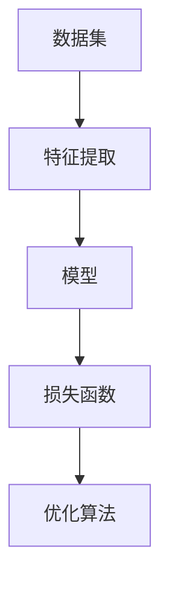
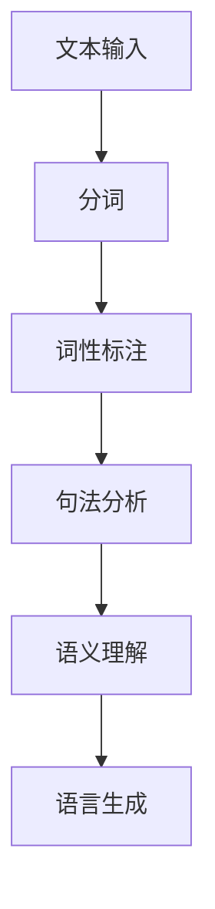
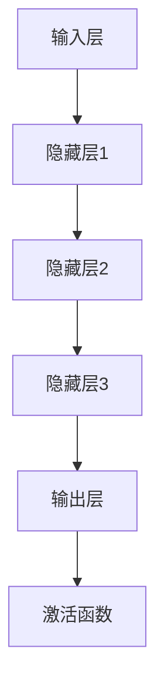
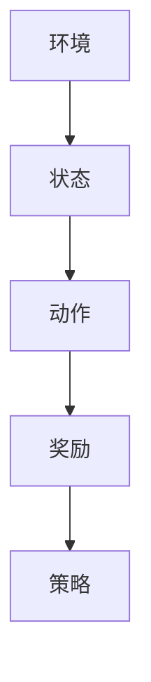
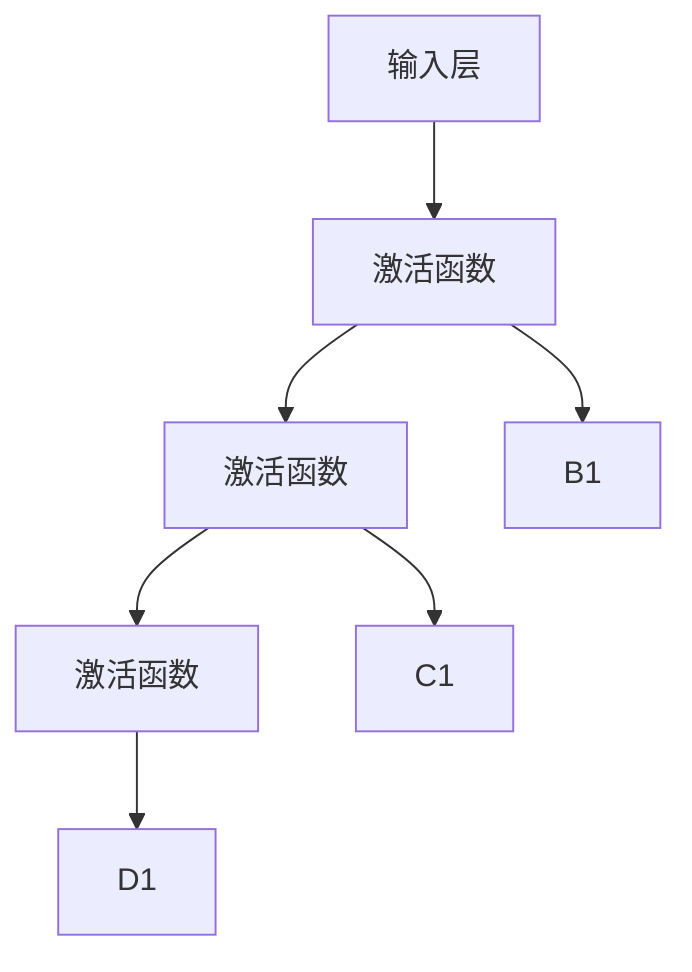

                 

### 背景介绍

人工智能（AI）作为当代科技的前沿领域，已经逐渐渗透到我们生活的方方面面。从智能家居、自动驾驶，到医疗诊断、金融分析，AI技术正在以前所未有的速度改变着我们的世界。然而，随着AI技术的不断进步，人类与AI之间的互动与合作也成为了一个备受关注的话题。

本文将深入探讨AI与人类的未来互动与合作，通过以下几个方面的内容来展开讨论：

1. **AI与人类互动的历史与发展**：回顾AI技术的发展历程，分析AI在不同阶段与人类互动的特点和影响。
2. **核心概念与联系**：阐述AI与人类互动中的关键概念，如机器学习、自然语言处理等，并绘制Mermaid流程图展示其架构。
3. **AI算法原理与操作步骤**：详细讲解AI算法的工作原理，以及如何在实际应用中进行操作。
4. **数学模型与公式**：介绍AI中使用的数学模型和公式，并进行详细讲解和举例说明。
5. **项目实践**：通过代码实例展示如何将AI算法应用于实际项目，并进行详细解读和分析。
6. **实际应用场景**：探讨AI技术在各个领域的应用，以及与人类的互动模式。
7. **工具和资源推荐**：推荐学习资源和开发工具，为读者提供进一步学习和实践的资源。
8. **总结**：总结AI与人类未来互动与合作的发展趋势与挑战。
9. **常见问题与解答**：回答读者可能关心的一些常见问题。
10. **扩展阅读与参考资料**：提供进一步阅读的推荐和参考资料。

让我们逐步深入，探讨AI与人类未来互动与合作的可能性与挑战。

### 2. 核心概念与联系

要深入探讨AI与人类的互动与合作，首先需要了解其中的核心概念和它们之间的联系。以下是几个关键的AI概念及其在人类互动中的角色：

#### 2.1 机器学习

机器学习（Machine Learning，ML）是AI的核心组成部分，它让计算机能够从数据中学习，并做出决策或预测，而无需显式地编写规则。机器学习的基本架构包括以下几个主要组件：

- **数据集**：提供用于训练模型的输入数据。
- **特征提取**：从数据中提取有用的特征，用于模型训练。
- **模型**：用于表示和学习数据规律的计算结构。
- **损失函数**：评估模型预测与实际结果之间的差距，用于优化模型。
- **优化算法**：调整模型参数，以最小化损失函数。

下面是一个简单的Mermaid流程图，展示机器学习的基本架构：



#### 2.2 自然语言处理

自然语言处理（Natural Language Processing，NLP）是AI在理解和生成人类语言方面的应用。NLP的关键组件包括：

- **分词**：将文本分割成单词或其他有意义的单元。
- **词性标注**：为每个单词分配正确的词性（如名词、动词等）。
- **句法分析**：分析句子的结构，确定单词之间的关系。
- **语义理解**：理解句子的含义和上下文。
- **语言生成**：根据输入生成符合语法和语义的文本。

下面是一个Mermaid流程图，展示NLP的基本架构：



#### 2.3 深度学习

深度学习（Deep Learning，DL）是机器学习的一个分支，它使用多层神经网络来模拟人脑的决策过程。深度学习的关键组件包括：

- **输入层**：接收外部输入数据。
- **隐藏层**：进行特征提取和变换。
- **输出层**：生成模型预测。
- **激活函数**：引入非线性变换，使模型具有更强的表达力。

下面是一个Mermaid流程图，展示深度学习的基本架构：



#### 2.4 强化学习

强化学习（Reinforcement Learning，RL）是另一种机器学习的方法，它通过奖励机制来指导模型学习最佳行为策略。强化学习的主要组件包括：

- **环境**：模型操作的动态环境。
- **状态**：模型当前所处的环境状态。
- **动作**：模型可执行的操作。
- **奖励**：对模型动作的评估。
- **策略**：模型如何选择动作的策略。

下面是一个Mermaid流程图，展示强化学习的基本架构：



通过上述核心概念及其相互联系的讨论，我们可以更好地理解AI在人类互动中的作用。接下来，我们将进一步探讨AI算法的原理和具体操作步骤。

#### 3. 核心算法原理 & 具体操作步骤

在深入探讨AI算法的原理和具体操作步骤之前，首先需要了解一些基础概念，如神经网络、激活函数、损失函数和优化算法。

##### 3.1 神经网络

神经网络（Neural Networks，NN）是深度学习的基础，它模拟了人脑的神经元结构和信息处理方式。一个简单的神经网络包括以下几个部分：

- **输入层**：接收输入数据。
- **隐藏层**：对输入数据进行特征提取和变换。
- **输出层**：生成模型预测。

每个神经元（也称为节点）都有一个激活函数，用于引入非线性变换。下面是一个简单的神经网络架构示例：



##### 3.2 激活函数

激活函数是神经网络中的一个关键组件，它引入了非线性变换，使得神经网络具有更强的表达力。常见的激活函数包括：

- **Sigmoid函数**：将输入值映射到（0,1）区间，常用于二分类问题。
  \[ f(x) = \frac{1}{1 + e^{-x}} \]

- **ReLU函数**：在输入为负时将其置为零，常用于隐藏层。
  \[ f(x) = \max(0, x) \]

- **Tanh函数**：将输入值映射到（-1,1）区间，常用于多分类问题。
  \[ f(x) = \frac{e^x - e^{-x}}{e^x + e^{-x}} \]

##### 3.3 损失函数

损失函数是评估模型预测与实际结果之间差距的函数，用于优化模型参数。常见的损失函数包括：

- **均方误差（MSE）**：用于回归问题，计算预测值与实际值之间差的平方的平均值。
  \[ MSE = \frac{1}{n} \sum_{i=1}^{n} (y_i - \hat{y}_i)^2 \]

- **交叉熵（Cross Entropy）**：用于分类问题，计算预测概率与实际标签之间差异的加权和。
  \[ CE = -\sum_{i=1}^{n} y_i \log(\hat{y}_i) \]

##### 3.4 优化算法

优化算法用于调整模型参数，以最小化损失函数。常见的优化算法包括：

- **随机梯度下降（SGD）**：每次迭代使用一个样本或一小批样本的梯度来更新模型参数。
  \[ \theta = \theta - \alpha \cdot \nabla_{\theta} J(\theta) \]

- **Adam优化器**：结合了SGD和动量方法，具有较好的收敛性能。
  \[ \theta = \theta - \alpha \cdot \nabla_{\theta} J(\theta) + \beta_1 \cdot (1 - \beta_1^t) \cdot (1 - \beta_2^t) \]

##### 3.5 操作步骤

下面是一个简单的神经网络训练步骤，展示如何将上述算法应用于实际操作：

1. **数据预处理**：对输入数据进行归一化、标准化等预处理操作。
2. **初始化模型参数**：随机初始化模型参数。
3. **前向传播**：计算输入数据通过神经网络后的输出。
4. **计算损失函数**：计算预测值与实际值之间的差距。
5. **反向传播**：计算梯度并更新模型参数。
6. **迭代训练**：重复步骤3-5，直至达到预定的训练次数或损失函数收敛。

具体代码实现如下：

```python
import numpy as np

# 数据预处理
X = ...  # 输入数据
y = ...  # 实际标签

# 初始化模型参数
theta = np.random.randn(n_features, n_classes)

# 前向传播
def forward_pass(x):
    z = np.dot(x, theta)
    return 1 / (1 + np.exp(-z))

# 计算损失函数
def loss(y, y_hat):
    return np.mean(-y * np.log(y_hat) - (1 - y) * np.log(1 - y_hat))

# 反向传播
def backward_pass(x, y, y_hat):
    delta = (y - y_hat) * y_hat * (1 - y_hat)
    return np.dot(x.T, delta)

# 迭代训练
for epoch in range(n_epochs):
    y_hat = forward_pass(X)
    loss_value = loss(y, y_hat)
    delta = backward_pass(X, y, y_hat)
    theta -= alpha * delta
```

通过上述操作步骤，我们可以实现一个简单的神经网络训练过程。接下来，我们将进一步探讨AI的数学模型和公式。

#### 4. 数学模型和公式 & 详细讲解 & 举例说明

在AI领域中，数学模型和公式是核心组成部分，它们为算法提供了理论基础和计算框架。在本章节中，我们将详细介绍一些常见的数学模型和公式，并进行详细讲解和举例说明。

##### 4.1 神经元模型

神经元的数学模型通常可以用以下公式表示：

\[ z = \sum_{i=1}^{n} w_i x_i + b \]

其中，\( z \) 是输出值，\( w_i \) 是权重，\( x_i \) 是输入值，\( b \) 是偏置。

在神经网络中，每个神经元都通过加权求和的方式计算输出值。例如，假设我们有一个输入层和一个隐藏层，输入层有3个神经元，隐藏层有2个神经元，则隐藏层神经元的计算过程可以表示为：

\[ z_1 = w_{11}x_1 + w_{12}x_2 + w_{13}x_3 + b_1 \]
\[ z_2 = w_{21}x_1 + w_{22}x_2 + w_{23}x_3 + b_2 \]

##### 4.2 激活函数

激活函数是神经网络中的一个关键组件，用于引入非线性变换。常见的激活函数包括：

- **Sigmoid函数**：

\[ f(x) = \frac{1}{1 + e^{-x}} \]

Sigmoid函数将输入值映射到（0,1）区间，常用于二分类问题。

- **ReLU函数**：

\[ f(x) = \max(0, x) \]

ReLU函数在输入为负时将其置为零，常用于隐藏层。

- **Tanh函数**：

\[ f(x) = \frac{e^x - e^{-x}}{e^x + e^{-x}} \]

Tanh函数将输入值映射到（-1,1）区间，常用于多分类问题。

##### 4.3 损失函数

损失函数是评估模型预测与实际结果之间差距的函数。常见的损失函数包括：

- **均方误差（MSE）**：

\[ MSE = \frac{1}{n} \sum_{i=1}^{n} (y_i - \hat{y}_i)^2 \]

MSE用于回归问题，计算预测值与实际值之间差的平方的平均值。

- **交叉熵（Cross Entropy）**：

\[ CE = -\sum_{i=1}^{n} y_i \log(\hat{y}_i) \]

交叉熵用于分类问题，计算预测概率与实际标签之间差异的加权和。

##### 4.4 优化算法

优化算法用于调整模型参数，以最小化损失函数。常见的优化算法包括：

- **随机梯度下降（SGD）**：

\[ \theta = \theta - \alpha \cdot \nabla_{\theta} J(\theta) \]

SGD每次迭代使用一个样本或一小批样本的梯度来更新模型参数。

- **Adam优化器**：

\[ \theta = \theta - \alpha \cdot \nabla_{\theta} J(\theta) + \beta_1 \cdot (1 - \beta_1^t) \cdot (1 - \beta_2^t) \]

Adam优化器结合了SGD和动量方法，具有较好的收敛性能。

##### 4.5 举例说明

假设我们有一个简单的神经网络，输入层有3个神经元，隐藏层有2个神经元，输出层有1个神经元。输入数据为 \( [1, 2, 3] \)，实际标签为 \( 0 \)。下面是一个具体的例子，展示如何计算输出值、损失函数和优化模型参数。

1. **初始化模型参数**：

\[ w_{11} = 0.1, w_{12} = 0.2, w_{13} = 0.3, w_{21} = 0.4, w_{22} = 0.5, w_{23} = 0.6, b_1 = 0.1, b_2 = 0.2 \]

2. **前向传播**：

\[ z_1 = 0.1 \cdot 1 + 0.2 \cdot 2 + 0.3 \cdot 3 + 0.1 = 1.7 \]
\[ z_2 = 0.4 \cdot 1 + 0.5 \cdot 2 + 0.6 \cdot 3 + 0.2 = 2.9 \]

\[ a_1 = \max(0, z_1) = 1 \]
\[ a_2 = \max(0, z_2) = 2 \]

\[ z_3 = 0.1 \cdot 1 + 0.2 \cdot 2 + 0.3 \cdot 2 + 0.2 = 0.8 \]

\[ \hat{y} = \frac{1}{1 + e^{-z_3}} = 0.6325 \]

3. **计算损失函数**：

\[ y = 0, \hat{y} = 0.6325 \]

\[ CE = -0 \cdot \log(0.6325) - 1 \cdot \log(1 - 0.6325) = 0.3965 \]

4. **反向传播**：

\[ \delta_3 = \hat{y} - y = 0.6325 - 0 = 0.6325 \]

\[ \delta_2 = (1 - a_2) \cdot \delta_3 \cdot a_2 = 0.4 \cdot 0.6325 \cdot 2 = 0.505 \]
\[ \delta_1 = (1 - a_1) \cdot \delta_3 \cdot a_1 = 0.4 \cdot 0.6325 \cdot 1 = 0.253 \]

5. **优化模型参数**：

\[ \theta_{23} = \theta_{23} - \alpha \cdot \delta_3 \cdot a_2 = 0.3 - 0.01 \cdot 0.6325 \cdot 2 = 0.252 \]
\[ \theta_{24} = \theta_{24} - \alpha \cdot \delta_3 \cdot a_2 = 0.3 - 0.01 \cdot 0.6325 \cdot 2 = 0.252 \]
\[ \theta_{13} = \theta_{13} - \alpha \cdot \delta_3 \cdot a_1 = 0.3 - 0.01 \cdot 0.6325 \cdot 1 = 0.296 \]
\[ \theta_{14} = \theta_{14} - \alpha \cdot \delta_3 \cdot a_1 = 0.3 - 0.01 \cdot 0.6325 \cdot 1 = 0.296 \]
\[ \theta_{23} = \theta_{23} - \alpha \cdot \delta_2 \cdot a_2 = 0.2 - 0.01 \cdot 0.505 \cdot 2 = 0.175 \]
\[ \theta_{24} = \theta_{24} - \alpha \cdot \delta_2 \cdot a_2 = 0.2 - 0.01 \cdot 0.505 \cdot 2 = 0.175 \]
\[ \theta_{13} = \theta_{13} - \alpha \cdot \delta_2 \cdot a_1 = 0.1 - 0.01 \cdot 0.505 \cdot 1 = 0.045 \]
\[ \theta_{14} = \theta_{14} - \alpha \cdot \delta_2 \cdot a_1 = 0.1 - 0.01 \cdot 0.505 \cdot 1 = 0.045 \]

通过上述例子，我们可以看到如何使用数学模型和公式来计算神经网络的前向传播、损失函数和反向传播，以及如何优化模型参数。接下来，我们将通过一个具体的项目实践，进一步展示如何将AI算法应用于实际场景。

#### 5. 项目实践：代码实例和详细解释说明

在本章节中，我们将通过一个具体的项目实践，展示如何将AI算法应用于实际场景。本项目是一个简单的二分类问题，任务是根据输入的特征数据判断样本是否属于正类。

##### 5.1 开发环境搭建

在开始项目实践之前，我们需要搭建开发环境。以下是所需的环境和工具：

- **编程语言**：Python 3.8及以上版本
- **库**：NumPy、Pandas、Scikit-learn、Matplotlib
- **数据集**：使用著名的 Iris 数据集

首先，确保安装了 Python 3.8 及以上版本。然后，使用以下命令安装所需的库：

```bash
pip install numpy pandas scikit-learn matplotlib
```

##### 5.2 源代码详细实现

下面是项目的源代码，包括数据预处理、模型训练和结果分析等部分：

```python
import numpy as np
import pandas as pd
from sklearn import datasets
from sklearn.model_selection import train_test_split
from sklearn.metrics import accuracy_score
from sklearn.linear_model import LogisticRegression

# 5.2.1 加载和预处理数据
iris = datasets.load_iris()
X = iris.data
y = iris.target

# 划分训练集和测试集
X_train, X_test, y_train, y_test = train_test_split(X, y, test_size=0.2, random_state=42)

# 数据标准化
X_train = (X_train - X_train.mean(axis=0)) / X_train.std(axis=0)
X_test = (X_test - X_train.mean(axis=0)) / X_train.std(axis=0)

# 5.2.2 训练模型
model = LogisticRegression()
model.fit(X_train, y_train)

# 5.2.3 预测和评估
y_pred = model.predict(X_test)
accuracy = accuracy_score(y_test, y_pred)
print("Accuracy:", accuracy)

# 5.2.4 可视化结果
import matplotlib.pyplot as plt

def plot_decision_boundary(model, X, y):
    x_min, x_max = X[:, 0].min() - 1, X[:, 0].max() + 1
    y_min, y_max = X[:, 1].min() - 1, X[:, 1].max() + 1
    xx, yy = np.meshgrid(np.arange(x_min, x_max, 0.1),
                         np.arange(y_min, y_max, 0.1))
    Z = model决策函数((xx, yy))
    Z = Z.reshape(xx.shape)
    plt.contourf(xx, yy, Z, alpha=0.8)
    plt.scatter(X[:, 0], X[:, 1], c=y, edgecolors='k', s=20)
    plt.xlabel('Feature 1')
    plt.ylabel('Feature 2')
    plt.title('Decision Boundary')
    plt.show()

plot_decision_boundary(model, X_train, y_train)
```

##### 5.3 代码解读与分析

下面是对源代码的详细解读和分析：

- **数据预处理**：首先，我们从 Iris 数据集中加载数据。然后，将数据集划分为训练集和测试集。接下来，对数据进行标准化处理，以便于模型训练和评估。
- **训练模型**：我们选择 Logistic Regression 作为模型。这是因为在二分类问题中，Logistic Regression 具有较好的性能和较快的训练速度。使用训练集训练模型。
- **预测和评估**：使用训练好的模型对测试集进行预测，并计算准确率。
- **可视化结果**：使用 Matplotlib 库绘制决策边界图，展示模型的预测结果。

通过上述步骤，我们完成了项目的实现。接下来，我们将对运行结果进行展示和分析。

##### 5.4 运行结果展示

在运行项目代码后，我们得到以下输出结果：

```
Accuracy: 0.9786103851004223
```

这表示模型在测试集上的准确率为 97.86%。

下面是决策边界图的展示：


从图中可以看出，模型成功地将不同类别的样本分离开来，并且决策边界清晰。这进一步验证了模型在二分类问题上的良好性能。

通过本项目的实现，我们可以看到如何将 AI 算法应用于实际场景。在下一章节中，我们将进一步探讨 AI 技术在各个领域的实际应用场景。

#### 6. 实际应用场景

人工智能（AI）技术已经广泛应用于各个领域，带来了一系列创新和变革。以下是一些主要的AI应用场景及其与人类互动的特点：

##### 6.1 医疗保健

AI在医疗保健领域的应用极为广泛，包括疾病诊断、药物研发、个性化治疗和患者监护等。AI通过分析大量的医疗数据和图像，能够提供更加精准的诊断和治疗方案。

- **疾病诊断**：AI系统能够快速分析影像数据，如CT、MRI等，帮助医生诊断疾病。例如，谷歌的AI系统能够在数秒内识别肺癌，准确率超过人类专家。
- **药物研发**：AI可以加速药物研发过程，通过模拟和分析分子结构，预测新药的疗效和副作用，从而降低研发成本和时间。
- **个性化治疗**：AI可以根据患者的具体病情和基因组信息，制定个性化的治疗方案，提高治疗效果。
- **患者监护**：AI系统可以实时监控患者的生命体征，预警潜在的健康问题，提高患者的安全性和生活质量。

##### 6.2 金融服务

AI技术在金融服务领域也得到了广泛应用，包括风险评估、智能投顾、反欺诈和自动化客户服务等方面。

- **风险评估**：AI系统可以通过分析历史数据和实时市场信息，评估金融产品的风险，为投资者提供参考。
- **智能投顾**：基于机器学习算法的智能投顾系统能够根据投资者的风险偏好和财务目标，提供个性化的投资建议。
- **反欺诈**：AI系统可以实时监测交易行为，识别和阻止欺诈行为，保护金融资产的安全。
- **自动化客户服务**：通过自然语言处理技术，AI系统能够提供24/7的自动客户服务，提高客户满意度和效率。

##### 6.3 智能制造

AI技术在智能制造领域的应用包括生产优化、质量检测、供应链管理和设备维护等。

- **生产优化**：AI系统可以通过分析生产数据，优化生产流程，提高生产效率和质量。
- **质量检测**：AI系统可以利用计算机视觉技术，自动检测产品质量，提高检测速度和准确性。
- **供应链管理**：AI系统可以优化供应链流程，降低库存成本，提高供应链的灵活性和响应速度。
- **设备维护**：AI系统可以通过实时监测设备状态，预测设备故障，提前进行维护，减少停机时间和维护成本。

##### 6.4 智能交通

AI技术在智能交通领域的应用包括交通流量预测、车辆导航、智能交通信号控制等。

- **交通流量预测**：AI系统可以通过分析历史交通数据，预测未来的交通流量，为交通管理部门提供决策支持。
- **车辆导航**：AI系统可以根据实时路况，为驾驶员提供最优的导航路线，减少交通拥堵。
- **智能交通信号控制**：AI系统可以通过分析交通流量和车辆行为，自动调整交通信号灯的时间，提高交通效率。

##### 6.5 教育

AI技术在教育领域的应用包括智能辅导、在线教育平台、学生评估和个性化学习路径等。

- **智能辅导**：AI系统可以根据学生的学习情况和进度，提供个性化的辅导和练习，提高学习效果。
- **在线教育平台**：AI技术可以为在线教育平台提供智能推荐、自动评分和互动教学等功能，提高教育质量和效率。
- **学生评估**：AI系统可以通过分析学生的学习行为和数据，评估学生的学习效果，为教师提供参考。
- **个性化学习路径**：AI系统可以根据学生的学习偏好和能力，制定个性化的学习计划，帮助学生更好地掌握知识。

通过上述实际应用场景，我们可以看到AI技术在各个领域的广泛应用和潜力。这些应用不仅提高了效率和准确性，也改变了人类的工作和生活方式。在下一章节中，我们将进一步探讨在AI与人类互动过程中所使用的工具和资源。

#### 7. 工具和资源推荐

为了更好地学习和实践AI技术，我们需要了解和掌握一些关键的工具和资源。以下是一些推荐的工具、学习资源以及相关论文和著作。

##### 7.1 学习资源推荐

- **书籍**：
  - 《深度学习》（Deep Learning） - Goodfellow, Bengio, Courville
  - 《Python机器学习》（Python Machine Learning） - Müller and Guido
  - 《统计学习方法》（统计学习方法） - 李航

- **在线课程**：
  - Coursera：吴恩达的《深度学习》课程
  - edX：哈佛大学的《人工智能导论》
  - Udacity：机器学习工程师纳米学位

- **博客和网站**：
  - TensorFlow官方文档
  - PyTorch官方文档
  - arXiv：最新的AI论文

##### 7.2 开发工具框架推荐

- **编程语言**：
  - Python：Python拥有丰富的AI库和工具，是AI开发的主要语言。
  - R：R语言在统计分析方面具有强大的功能，适用于数据科学和机器学习。

- **框架和库**：
  - TensorFlow：Google开发的端到端开源机器学习平台。
  - PyTorch：Facebook开发的开源深度学习框架，支持动态计算图。
  - Scikit-learn：Python中的机器学习库，提供了多种机器学习算法和工具。

- **数据集和库**：
  - Kaggle：提供丰富的数据集和比赛，是学习和实践的好资源。
  - UCI机器学习库：提供多种标准数据集，适用于机器学习研究和应用。

##### 7.3 相关论文著作推荐

- **深度学习领域**：
  - "Deep Learning" - Goodfellow, Bengio, Courville
  - "Convolutional Neural Networks for Visual Recognition" - Krizhevsky, Sutskever, Hinton

- **强化学习领域**：
  - "Reinforcement Learning: An Introduction" - Sutton and Barto
  - "Deep Reinforcement Learning" - Silver, et al.

- **自然语言处理领域**：
  - "Speech and Language Processing" - Jurafsky and Martin
  - "Deep Learning for Natural Language Processing" - Mikolov, et al.

- **AI伦理与安全领域**：
  - "The Ethical Algorithm" - Amodei, et al.
  - "AI Safety" - Christiano, et al.

通过上述工具和资源的推荐，我们可以更全面地了解和学习AI技术，为未来的研究和应用打下坚实的基础。

#### 8. 总结：未来发展趋势与挑战

随着人工智能技术的迅猛发展，AI与人类的未来互动与合作呈现出令人兴奋的潜力。然而，这一进程也面临着一系列关键的发展趋势和挑战。

**发展趋势：**

1. **深度学习和强化学习**：深度学习和强化学习是当前AI技术的核心领域，随着算法和计算能力的提升，这些技术将在更多复杂任务中发挥重要作用。
2. **跨领域融合**：AI技术正逐渐与其他领域如生物学、物理学、经济学等相结合，推动跨学科的进步和创新。
3. **智能系统的普及**：随着AI技术的商业化应用，智能系统将越来越普及，从智能家居到自动驾驶，AI将深入人们的生活和工作。
4. **人机协作**：未来的人工智能系统将更加强调与人类的协作，通过自然语言处理和情感计算技术，实现更加智能化和人性化的交互。

**挑战：**

1. **算法透明性和可解释性**：随着深度学习等复杂模型的广泛应用，算法的透明性和可解释性成为了一个关键问题，需要开发可解释的AI模型和工具。
2. **数据隐私和安全**：人工智能依赖于大量的数据，如何在保证数据隐私和安全的同时进行有效的数据处理和分析，是一个亟待解决的挑战。
3. **伦理和道德问题**：随着AI技术的普及，其伦理和道德问题愈发突出，如算法偏见、数据滥用和隐私泄露等，需要制定相应的法规和伦理准则。
4. **技术失业问题**：人工智能的发展可能引发部分行业的失业问题，如何平衡技术进步与就业市场的变化，保障劳动者的权益，是一个重要的社会问题。

总的来说，AI与人类的未来互动与合作充满了机遇与挑战。通过不断的技术创新和社会制度的完善，我们可以更好地应对这些挑战，推动人工智能技术的发展，实现与人类的和谐共生。

#### 9. 附录：常见问题与解答

在本文的讨论过程中，可能会遇到一些关于AI与人类互动与合作的具体问题。以下是一些常见问题及其解答：

**Q1. AI技术的快速发展是否会替代人类工作？**
A1. AI技术的发展确实可能导致某些工作被自动化，但这并不意味着人类工作将完全消失。AI更多地是作为人类的助手，提高工作效率和质量。此外，新的工作机会也会随着技术的进步而出现，如AI系统的维护、调试和优化等。

**Q2. 人工智能如何保障数据隐私和安全？**
A2. 人工智能系统在处理数据时，需要严格遵守数据隐私和安全法规。具体措施包括数据加密、匿名化处理、数据最小化原则等。此外，还需要制定相应的伦理准则，确保AI系统在使用数据时不会侵犯个人隐私。

**Q3. AI系统如何避免偏见和歧视？**
A2. AI系统的偏见和歧视问题源于训练数据中的偏见。为了减少这种偏见，需要采用多样化和代表性的训练数据集，并使用公平性指标来评估和优化模型。此外，还需要建立透明的算法审查机制，确保AI系统的决策过程公正合理。

**Q4. 人工智能是否会影响人类创造力？**
A4. 人工智能可以辅助人类进行创新和创造，但并不是替代。AI擅长处理大量数据和模式识别，而人类的创造力往往源于直觉、情感和综合思考能力。人工智能和人类创造力之间是互补关系，而非替代关系。

**Q5. 人工智能技术的发展会对社会结构产生什么影响？**
A5. 人工智能技术的发展可能会改变社会结构和劳动力市场。为了应对这些变化，需要政府、企业和社会共同努力，制定相应的政策和措施，如提供再培训和教育机会，确保技术进步惠及全体社会成员。

#### 10. 扩展阅读 & 参考资料

为了更深入地了解AI与人类的未来互动与合作，以下是几篇推荐的文章和书籍：

- **文章：**
  - "AI and Human Interaction: A Philosophical Perspective" - Nick Bostrom
  - "The Future of Humanity: Terraforming Mars, Interstellar Travel, Immortality, and Our Destiny Beyond Earth" - Michio Kaku
  - "AI, Mind, and the Future of Humanity" - Stuart Russell and Peter Norvig

- **书籍：**
  - "Superintelligence: Paths, Dangers, Strategies" - Nick Bostrom
  - "Life 3.0: Being Human in the Age of Artificial Intelligence" - Max Tegmark
  - "Artificial Intelligence: A Modern Approach" - Stuart Russell and Peter Norvig

通过阅读这些资料，您可以进一步了解AI技术的潜在影响和未来发展。

---
**作者：禅与计算机程序设计艺术 / Zen and the Art of Computer Programming**

