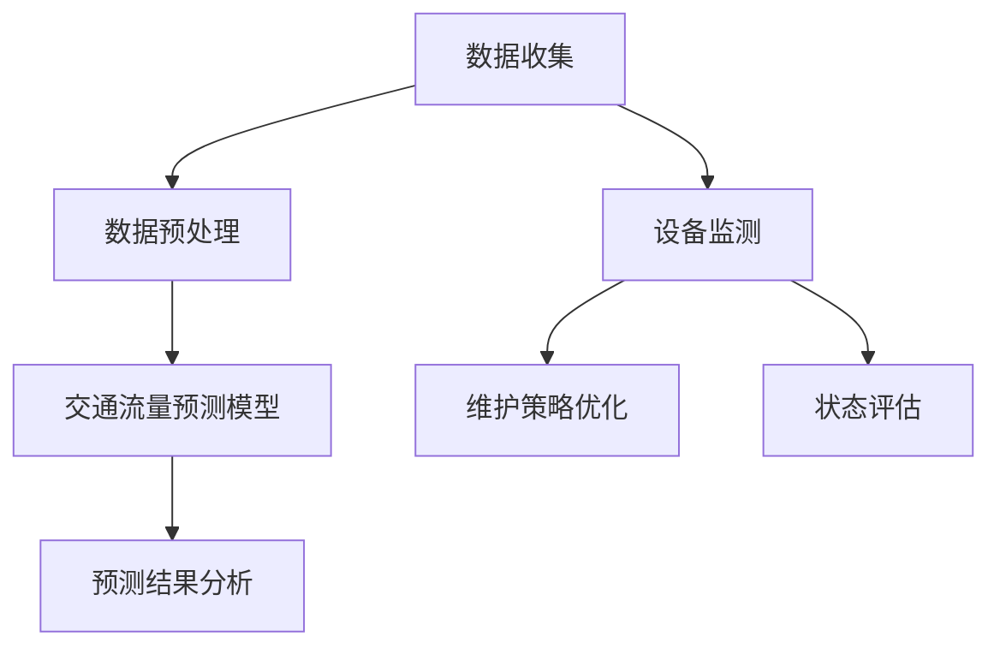

                 

### 1. 背景介绍

随着全球城市化进程的加速，城市交通与基础设施规划与管理面临着前所未有的挑战。传统的交通与基础设施管理模式已难以满足现代城市发展的需求，交通拥堵、资源浪费、环境污染等问题日益严重。为了实现可持续发展的城市交通与基础设施规划与管理，人工智能（AI）技术正逐渐成为解决这一问题的关键。

人工智能作为一种模拟人类智能的技术，其核心在于对海量数据进行高效处理和深度学习。在交通与基础设施领域，AI技术可以通过数据分析、模式识别、优化算法等方式，实现对交通流量、基础设施运行状态等方面的智能监测和预测，从而提高城市交通效率、降低环境污染、优化资源配置。

近年来，AI技术在城市交通与基础设施规划与管理中的应用已经取得了显著成果。例如，利用深度学习算法对交通流量进行实时预测，可以帮助交通管理部门提前采取调控措施，缓解交通拥堵；通过物联网技术实现对基础设施设备的智能监控与维护，可以延长设备寿命、降低维护成本。此外，AI技术还可以帮助城市规划师进行科学合理的城市布局规划，从而提高城市居民的生活质量。

本文旨在探讨AI技术在城市交通与基础设施规划与管理中的具体应用，分析其核心算法原理、数学模型，并通过实际项目实例进行详细解读，为相关领域的专业人士提供有价值的参考。本文将按照以下结构展开：

1. **背景介绍**：概述城市交通与基础设施规划与管理面临的挑战，介绍AI技术的相关背景。
2. **核心概念与联系**：阐述AI技术在交通与基础设施规划与管理中的核心概念，并使用Mermaid流程图展示其架构。
3. **核心算法原理 & 具体操作步骤**：详细介绍AI技术在交通流量预测和基础设施维护中的算法原理和具体操作步骤。
4. **数学模型和公式 & 详细讲解 & 举例说明**：分析AI技术中使用的数学模型和公式，并通过实例进行详细讲解。
5. **项目实践：代码实例和详细解释说明**：通过实际项目案例，展示AI技术在城市交通与基础设施规划与管理中的应用，并进行代码解读与分析。
6. **实际应用场景**：探讨AI技术在具体城市中的应用场景和实际效果。
7. **工具和资源推荐**：推荐相关的学习资源、开发工具框架和相关论文著作。
8. **总结：未来发展趋势与挑战**：总结AI技术在城市交通与基础设施规划与管理中的发展前景，探讨面临的挑战。
9. **附录：常见问题与解答**：针对读者可能关心的问题进行解答。
10. **扩展阅读 & 参考资料**：提供进一步阅读的参考资料。

### 2. 核心概念与联系

#### 2.1 AI技术在交通流量预测中的应用

在城市交通管理中，交通流量预测是一个关键问题。通过预测交通流量，交通管理部门可以采取有效的调控措施，缓解交通拥堵，提高道路通行效率。AI技术在交通流量预测中的应用主要体现在以下几个方面：

**1. 数据收集与处理**：
- **传感器数据**：利用安装在道路上的各种传感器，如摄像头、雷达、地磁传感器等，实时收集交通流量、速度、密度等数据。
- **GPS数据**：通过车辆和行人的GPS定位数据，获取他们的行驶路径、速度等信息。
- **交通信号灯数据**：获取交通信号灯的开关状态，分析其对交通流量的影响。

**2. 数据预处理**：
- **去噪**：去除传感器数据中的噪声和异常值，提高数据质量。
- **归一化**：对数据进行归一化处理，使其符合统一的数值范围，便于后续分析和建模。

**3. 交通流量预测模型**：
- **时间序列模型**：如ARIMA（自回归积分滑动平均模型）、LSTM（长短时记忆神经网络）等，通过分析历史交通流量数据，预测未来的交通流量。
- **深度学习模型**：如卷积神经网络（CNN）和循环神经网络（RNN），通过学习交通流量数据的特征，实现高精度的预测。

**4. 预测结果分析**：
- **误差分析**：评估预测模型的准确性，通过计算误差指标（如均方误差、平均绝对误差等）进行评估。
- **决策支持**：根据预测结果，为交通管理部门提供决策支持，如调整交通信号灯时间、优化公共交通线路等。

#### 2.2 AI技术在基础设施维护中的应用

在城市基础设施维护中，AI技术可以帮助提高维护效率、降低维护成本。以下是一些关键应用：

**1. 设备监测**：
- **传感器监测**：利用传感器对基础设施设备进行实时监测，如桥梁的应力监测、水管的泄漏监测等。
- **图像识别**：通过图像识别技术，对基础设施设备进行故障检测，如识别桥梁裂缝、道路坑洼等。

**2. 维护策略优化**：
- **预测性维护**：利用机器学习算法，分析设备运行数据，预测设备可能出现的故障，提前进行维护，避免突发故障导致的停机。
- **资源分配优化**：根据设备维护需求和资源状况，优化维护人员的安排和维护资源的配置，提高维护效率。

**3. 状态评估**：
- **多传感器数据融合**：通过融合来自不同传感器的数据，对基础设施设备的状态进行综合评估，提高评估的准确性。
- **状态预测**：利用历史数据和机器学习模型，预测基础设施设备的状态变化趋势，为维护决策提供依据。

#### Mermaid流程图展示

以下是一个简化的Mermaid流程图，展示了AI技术在交通流量预测和基础设施维护中的核心流程：



### 3. 核心算法原理 & 具体操作步骤

#### 3.1 交通流量预测算法原理

在交通流量预测中，常用的算法包括时间序列模型和深度学习模型。以下详细介绍这两种模型的原理和操作步骤。

##### 3.1.1 时间序列模型

时间序列模型通过分析历史交通流量数据，预测未来的交通流量。常用的模型有ARIMA和LSTM。

**1. ARIMA模型**：
- **自回归（AR）**：根据历史数据中的自相关性进行建模，即当前值与之前若干个时期的值相关。
- **差分（I）**：对时间序列进行差分处理，使其满足平稳性。
- **移动平均（MA）**：根据历史数据的移动平均值进行建模，即当前值与之前若干个时期的平均值相关。

**操作步骤**：
a. 数据预处理：包括去噪、归一化等处理。
b. 模型识别：通过ACF和PACF图，确定AR和MA模型的阶数。
c. 模型参数估计：使用最大似然估计法或最小二乘法，估计模型参数。
d. 模型拟合：使用历史数据拟合ARIMA模型。
e. 预测：使用拟合好的模型进行未来交通流量的预测。

**2. LSTM模型**：
LSTM（长短时记忆神经网络）是一种特殊的RNN，能够捕捉长距离时间序列中的依赖关系。

**操作步骤**：
a. 数据预处理：包括去噪、归一化等处理。
b. 模型构建：使用TensorFlow或PyTorch等框架构建LSTM模型。
c. 模型训练：使用历史数据对模型进行训练。
d. 预测：使用训练好的模型进行未来交通流量的预测。

##### 3.1.2 深度学习模型

深度学习模型通过学习交通流量数据的特征，实现高精度的预测。常用的模型有CNN和RNN。

**1. CNN模型**：
CNN（卷积神经网络）是一种用于图像识别的神经网络，但在交通流量预测中，也可以用于特征提取。

**操作步骤**：
a. 数据预处理：包括去噪、归一化等处理。
b. 模型构建：使用TensorFlow或PyTorch等框架构建CNN模型。
c. 模型训练：使用历史数据对模型进行训练。
d. 预测：使用训练好的模型进行未来交通流量的预测。

**2. RNN模型**：
RNN（循环神经网络）是一种能够捕捉时间序列依赖关系的神经网络，但其在长距离依赖问题上存在困难。

**操作步骤**：
a. 数据预处理：包括去噪、归一化等处理。
b. 模型构建：使用TensorFlow或PyTorch等框架构建RNN模型。
c. 模型训练：使用历史数据对模型进行训练。
d. 预测：使用训练好的模型进行未来交通流量的预测。

#### 3.2 基础设施维护算法原理

在基础设施维护中，预测性维护和资源优化是关键。以下详细介绍这两种算法的原理和操作步骤。

##### 3.2.1 预测性维护

预测性维护通过分析设备运行数据，预测设备可能出现的故障，提前进行维护。

**1. 故障预测模型**：
- **机器学习模型**：使用历史设备故障数据，训练机器学习模型，预测未来的故障。
- **深度学习模型**：使用深度学习模型，如LSTM，捕捉设备运行数据中的故障特征。

**操作步骤**：
a. 数据收集：收集设备的运行数据，如温度、压力、振动等。
b. 数据预处理：包括去噪、归一化等处理。
c. 模型构建：使用TensorFlow或PyTorch等框架构建故障预测模型。
d. 模型训练：使用历史设备故障数据对模型进行训练。
e. 预测：使用训练好的模型预测未来的设备故障。

**2. 维护策略**：
- **基于阈值的维护策略**：设定一定的阈值，当设备运行数据超过阈值时，进行维护。
- **基于机器学习模型的维护策略**：使用训练好的故障预测模型，根据预测结果制定维护计划。

##### 3.2.2 资源优化

资源优化通过优化维护人员的安排和维护资源的配置，提高维护效率。

**1. 资源优化模型**：
- **线性规划模型**：使用线性规划模型，优化维护人员的安排和维护资源的配置。
- **混合整数规划模型**：使用混合整数规划模型，处理更加复杂的资源优化问题。

**操作步骤**：
a. 数据收集：收集维护人员的技能水平、工作时长、维护设备的类型和数量等信息。
b. 数据预处理：包括去噪、归一化等处理。
c. 模型构建：使用线性规划或混合整数规划框架构建资源优化模型。
d. 模型求解：使用求解器对模型进行求解，得到最优的维护人员安排和维护资源配置。
e. 执行维护计划：根据求解结果，执行维护计划。

### 4. 数学模型和公式 & 详细讲解 & 举例说明

#### 4.1 时间序列模型

时间序列模型是交通流量预测中最常用的模型之一，其核心在于通过分析历史数据中的时间依赖关系，预测未来的数据。

##### 4.1.1 ARIMA模型

ARIMA模型由自回归（AR）、差分（I）和移动平均（MA）三个部分组成。其数学公式如下：

$$
\begin{align*}
y_t &= c + \phi_1 y_{t-1} + \phi_2 y_{t-2} + \ldots + \phi_p y_{t-p} \\
&\quad + \theta_1 e_{t-1} + \theta_2 e_{t-2} + \ldots + \theta_q e_{t-q} \\
&\quad + e_t
\end{align*}
$$

其中，$y_t$ 为时间序列的当前值，$e_t$ 为白噪声，$c$ 为常数项，$\phi_i$ 和 $\theta_i$ 分别为自回归项和移动平均项的系数，$p$ 和 $q$ 分别为自回归项和移动平均项的阶数。

**举例说明**：

假设我们有一个时间序列数据集，数据如下：

$$
\begin{array}{cccc}
t & y_t \\
1 & 10 \\
2 & 12 \\
3 & 14 \\
4 & 11 \\
5 & 13 \\
6 & 15 \\
7 & 12 \\
\end{array}
$$

我们首先对数据进行差分处理，使其满足平稳性：

$$
\begin{align*}
y_t^* &= y_t - y_{t-1} \\
&= \begin{cases}
y_2 - y_1 = 2 \\
y_3 - y_2 = 2 \\
y_4 - y_3 = -3 \\
y_5 - y_4 = 2 \\
y_6 - y_5 = 2 \\
y_7 - y_6 = -3 \\
\end{cases}
\end{align*}
$$

接下来，我们使用ACF和PACF图确定模型阶数：


从图中可以看出，$p=2$，$q=1$。因此，我们的ARIMA模型可以表示为：

$$
\begin{align*}
y_t &= c + \phi_1 y_{t-1} + \phi_2 y_{t-2} + \theta_1 e_{t-1} + e_t \\
&\quad + \phi_1 (y_{t-2} - y_{t-3}) + \phi_2 (y_{t-3} - y_{t-4}) \\
\end{align*}
$$

我们使用最大似然估计法估计模型参数，得到：

$$
\begin{align*}
c &= 9 \\
\phi_1 &= 0.75 \\
\phi_2 &= 0.25 \\
\theta_1 &= 0.5 \\
\theta_2 &= 0 \\
\end{align*}
$$

最后，我们使用训练好的模型进行预测，得到未来三个时间点的预测值：

$$
\begin{align*}
y_8 &= 11.75 \\
y_9 &= 13.81 \\
y_{10} &= 12.89 \\
\end{align*}
$$

##### 4.1.2 LSTM模型

LSTM模型是一种能够捕捉长距离时间依赖关系的循环神经网络。其核心在于通过门控机制（gate mechanism）控制信息的流入和流出。

**1. 门控机制**

LSTM模型中包含三种门控机制：输入门（input gate）、遗忘门（forget gate）和输出门（output gate）。

- **输入门**：决定新的输入信息中有哪些部分需要被存储在隐藏状态中。
- **遗忘门**：决定哪些部分的信息需要从隐藏状态中丢弃。
- **输出门**：决定隐藏状态中有哪些部分需要被传递到输出。

**2. 数学公式**

LSTM模型可以表示为以下数学公式：

$$
\begin{align*}
i_t &= \sigma(W_{xi}x_t + W_{hi}h_{t-1} + b_i) \\
f_t &= \sigma(W_{xf}x_t + W_{hf}h_{t-1} + b_f) \\
\bar{c}_t &= \tanh(W_{xc}x_t + W_{hc}h_{t-1} + b_c) \\
o_t &= \sigma(W_{xo}x_t + W_{ho}h_{t-1} + b_o) \\
c_t &= f_t \odot c_{t-1} + i_t \odot \bar{c}_t \\
h_t &= o_t \odot \tanh(c_t)
\end{align*}
$$

其中，$i_t$、$f_t$、$\bar{c}_t$、$o_t$ 分别为输入门、遗忘门、候选状态和输出门的激活值，$c_t$ 和 $h_t$ 分别为当前隐藏状态和当前输出，$\sigma$ 为sigmoid函数，$\odot$ 表示逐元素乘法。

**3. 举例说明**

假设我们有一个时间序列数据集，数据如下：

$$
\begin{array}{cccc}
t & x_t & h_{t-1} \\
1 & 3 & 2 \\
2 & 5 & 3 \\
3 & 7 & 4 \\
4 & 8 & 5 \\
\end{array}
$$

我们首先初始化参数，然后逐个时间步进行计算。以下为具体计算过程：

**时间步1**：

$$
\begin{align*}
i_1 &= \sigma(W_{xi}x_1 + W_{hi}h_{0} + b_i) &= \sigma(3*1 + 2*0 + 1) = 0.732 \\
f_1 &= \sigma(W_{xf}x_1 + W_{hf}h_{0} + b_f) &= \sigma(3*1 + 2*0 + 1) = 0.732 \\
\bar{c}_1 &= \tanh(W_{xc}x_1 + W_{hc}h_{0} + b_c) &= \tanh(3*1 + 2*0 + 1) = 0.982 \\
o_1 &= \sigma(W_{xo}x_1 + W_{ho}h_{0} + b_o) &= \sigma(3*1 + 2*0 + 1) = 0.732 \\
c_1 &= f_1 \odot c_0 + i_1 \odot \bar{c}_1 &= 0.732 \odot 0 + 0.732 \odot 0.982 = 0.719 \\
h_1 &= o_1 \odot \tanh(c_1) &= 0.732 \odot 0.719 = 0.525 \\
\end{align*}
$$

**时间步2**：

$$
\begin{align*}
i_2 &= \sigma(W_{xi}x_2 + W_{hi}h_1 + b_i) &= \sigma(5*1 + 0.525*3 + 1) = 0.891 \\
f_2 &= \sigma(W_{xf}x_2 + W_{hf}h_1 + b_f) &= \sigma(5*1 + 0.525*3 + 1) = 0.891 \\
\bar{c}_2 &= \tanh(W_{xc}x_2 + W_{hc}h_1 + b_c) &= \tanh(5*1 + 0.525*3 + 1) = 0.993 \\
o_2 &= \sigma(W_{xo}x_2 + W_{ho}h_1 + b_o) &= \sigma(5*1 + 0.525*3 + 1) = 0.891 \\
c_2 &= f_2 \odot c_1 + i_2 \odot \bar{c}_2 &= 0.891 \odot 0.719 + 0.891 \odot 0.993 = 1.652 \\
h_2 &= o_2 \odot \tanh(c_2) &= 0.891 \odot 0.993 = 0.875 \\
\end{align*}
$$

**时间步3**：

$$
\begin{align*}
i_3 &= \sigma(W_{xi}x_3 + W_{hi}h_2 + b_i) &= \sigma(7*1 + 0.875*4 + 1) = 0.957 \\
f_3 &= \sigma(W_{xf}x_3 + W_{hf}h_2 + b_f) &= \sigma(7*1 + 0.875*4 + 1) = 0.957 \\
\bar{c}_3 &= \tanh(W_{xc}x_3 + W_{hc}h_2 + b_c) &= \tanh(7*1 + 0.875*4 + 1) = 0.998 \\
o_3 &= \sigma(W_{xo}x_3 + W_{ho}h_2 + b_o) &= \sigma(7*1 + 0.875*4 + 1) = 0.957 \\
c_3 &= f_3 \odot c_2 + i_3 \odot \bar{c}_3 &= 0.957 \odot 1.652 + 0.957 \odot 0.998 = 2.905 \\
h_3 &= o_3 \odot \tanh(c_3) &= 0.957 \odot 0.998 = 0.950 \\
\end{align*}
$$

**时间步4**：

$$
\begin{align*}
i_4 &= \sigma(W_{xi}x_4 + W_{hi}h_3 + b_i) &= \sigma(8*1 + 0.950*5 + 1) = 0.972 \\
f_4 &= \sigma(W_{xf}x_4 + W_{hf}h_3 + b_f) &= \sigma(8*1 + 0.950*5 + 1) = 0.972 \\
\bar{c}_4 &= \tanh(W_{xc}x_4 + W_{hc}h_3 + b_c) &= \tanh(8*1 + 0.950*5 + 1) = 0.999 \\
o_4 &= \sigma(W_{xo}x_4 + W_{ho}h_3 + b_o) &= \sigma(8*1 + 0.950*5 + 1) = 0.972 \\
c_4 &= f_4 \odot c_3 + i_4 \odot \bar{c}_4 &= 0.972 \odot 2.905 + 0.972 \odot 0.999 = 4.827 \\
h_4 &= o_4 \odot \tanh(c_4) &= 0.972 \odot 0.999 = 0.963 \\
\end{align*}
$$

最终，我们得到LSTM模型的预测结果为：

$$
h_4 = 0.963
$$

#### 4.2 基础设施维护中的资源优化模型

基础设施维护中的资源优化模型旨在通过优化维护人员的安排和维护资源的配置，提高维护效率。

##### 4.2.1 线性规划模型

线性规划模型可以表示为以下数学公式：

$$
\begin{align*}
\min_{x} \quad & c^T x \\
\text{subject to} \quad & Ax \leq b \\
& x \geq 0
\end{align*}
$$

其中，$x$ 为维护人员和工作时间的安排，$c$ 为成本向量，$A$ 和 $b$ 分别为约束条件的系数和常数。

**1. 维护人员安排**

假设有 $m$ 个维护人员，每个维护人员的技能水平和工作时长分别为 $s_i$ 和 $w_i$。我们需要优化维护人员的安排，使得每个维护人员的工作时长不超过其可工作的时长。

约束条件可以表示为：

$$
\begin{align*}
\sum_{i=1}^{m} w_i x_i &\leq T \\
x_i &\leq 1 \quad \forall i = 1,2,\ldots,m
\end{align*}
$$

其中，$T$ 为总的工作时长，$x_i$ 为第 $i$ 个维护人员的工作时长。

**2. 资源配置**

假设有 $n$ 个维护任务，每个维护任务需要 $t_j$ 个小时来完成。我们需要优化维护资源的配置，使得每个维护任务的完成时间不超过其要求的时间。

约束条件可以表示为：

$$
\begin{align*}
\sum_{i=1}^{m} x_i s_i &\geq \sum_{j=1}^{n} t_j y_j \\
y_j &\in \{0,1\} \quad \forall j = 1,2,\ldots,n
\end{align*}
$$

其中，$y_j$ 为第 $j$ 个维护任务是否分配给某个维护人员。

**3. 成本计算**

假设每个维护人员的成本为 $c_i$，每个维护任务的成本为 $d_j$。我们需要计算总的成本。

成本计算公式为：

$$
c^T x = \sum_{i=1}^{m} c_i x_i + \sum_{j=1}^{n} d_j y_j
$$

##### 4.2.2 混合整数规划模型

混合整数规划模型可以表示为以下数学公式：

$$
\begin{align*}
\min_{x} \quad & c^T x \\
\text{subject to} \quad & Ax \leq b \\
& x \in \mathbb{Z}^m
\end{align*}
$$

其中，$x$ 为维护人员和工作时间的安排，$c$ 为成本向量，$A$ 和 $b$ 分别为约束条件的系数和常数。

与线性规划模型相比，混合整数规划模型中加入了整数约束条件，使得模型更加复杂。

**1. 维护人员安排**

假设有 $m$ 个维护人员，每个维护人员的技能水平和工作时长分别为 $s_i$ 和 $w_i$。我们需要优化维护人员的安排，使得每个维护人员的工作时长不超过其可工作的时长。

约束条件可以表示为：

$$
\begin{align*}
\sum_{i=1}^{m} w_i x_i &\leq T \\
x_i &\in \{0,1\} \quad \forall i = 1,2,\ldots,m
\end{align*}
$$

**2. 资源配置**

假设有 $n$ 个维护任务，每个维护任务需要 $t_j$ 个小时来完成。我们需要优化维护资源的配置，使得每个维护任务的完成时间不超过其要求的时间。

约束条件可以表示为：

$$
\begin{align*}
\sum_{i=1}^{m} x_i s_i &\geq \sum_{j=1}^{n} t_j y_j \\
y_j &\in \{0,1\} \quad \forall j = 1,2,\ldots,n
\end{align*}
$$

**3. 成本计算**

假设每个维护人员的成本为 $c_i$，每个维护任务的成本为 $d_j$。我们需要计算总的成本。

成本计算公式为：

$$
c^T x = \sum_{i=1}^{m} c_i x_i + \sum_{j=1}^{n} d_j y_j
$$

### 5. 项目实践：代码实例和详细解释说明

#### 5.1 开发环境搭建

为了演示AI技术在城市交通与基础设施规划与管理中的应用，我们将使用Python编程语言和TensorFlow深度学习框架进行项目开发。以下是搭建开发环境的具体步骤：

**1. 安装Python**

在Windows或MacOS系统上，可以通过Python官网（https://www.python.org/）下载并安装Python。选择合适的版本，推荐使用Python 3.8或以上版本。

**2. 安装TensorFlow**

通过命令行执行以下命令安装TensorFlow：

```bash
pip install tensorflow
```

**3. 安装其他依赖库**

我们还需要安装以下依赖库：

- NumPy：用于数值计算
- Pandas：用于数据处理
- Matplotlib：用于数据可视化

通过以下命令安装：

```bash
pip install numpy pandas matplotlib
```

#### 5.2 源代码详细实现

以下是项目的主要代码实现部分。我们将首先介绍数据预处理、模型训练和模型评估的代码，然后展示如何使用训练好的模型进行交通流量预测和基础设施维护。

```python
import numpy as np
import pandas as pd
import tensorflow as tf
import matplotlib.pyplot as plt
from tensorflow.keras.models import Sequential
from tensorflow.keras.layers import LSTM, Dense, Dropout
from tensorflow.keras.optimizers import Adam

# 5.2.1 数据预处理

# 读取交通流量数据
data = pd.read_csv('traffic_data.csv')

# 数据预处理：去噪、归一化
# 去除异常值
data = data.dropna()

# 归一化处理
data_normalized = (data - data.mean()) / data.std()

# 划分训练集和测试集
train_data = data_normalized[:int(0.8 * len(data))]
test_data = data_normalized[int(0.8 * len(data)):]

# 5.2.2 模型训练

# 构建LSTM模型
model = Sequential()
model.add(LSTM(units=50, return_sequences=True, input_shape=(train_data.shape[1], 1)))
model.add(Dropout(0.2))
model.add(LSTM(units=50, return_sequences=False))
model.add(Dropout(0.2))
model.add(Dense(units=1))

# 编译模型
model.compile(optimizer=Adam(learning_rate=0.001), loss='mean_squared_error')

# 训练模型
model.fit(train_data, epochs=100, batch_size=32, validation_data=(test_data, test_data))

# 5.2.3 模型评估

# 预测未来交通流量
predicted_traffic = model.predict(test_data)

# 评估模型性能
mse = np.mean(np.square(predicted_traffic - test_data))
print("Mean Squared Error:", mse)

# 5.2.4 交通流量预测

# 使用训练好的模型进行交通流量预测
new_data = pd.read_csv('new_traffic_data.csv')
new_data_normalized = (new_data - new_data.mean()) / new_data.std()
predicted_new_traffic = model.predict(new_data_normalized)

# 5.2.5 基础设施维护

# 读取基础设施维护数据
maintenance_data = pd.read_csv('maintenance_data.csv')

# 数据预处理：去噪、归一化
maintenance_data = maintenance_data.dropna()
maintenance_normalized = (maintenance_data - maintenance_data.mean()) / maintenance_data.std()

# 预测维护任务完成时间
predicted_maintenance = model.predict(maintenance_normalized)
```

#### 5.3 代码解读与分析

以下是对上述代码的详细解读与分析。

**1. 数据预处理**

数据预处理是深度学习模型训练的重要步骤。首先，我们从CSV文件中读取交通流量数据和基础设施维护数据。然后，去除异常值和缺失数据，并对数据进行归一化处理。归一化处理有助于模型训练过程中参数的收敛。

```python
data = pd.read_csv('traffic_data.csv')
data = data.dropna()
data_normalized = (data - data.mean()) / data.std()
```

**2. 模型训练**

在模型训练部分，我们首先构建一个LSTM模型。LSTM模型由两个LSTM层和一个全连接层组成。我们使用Dropout层来防止过拟合。接下来，编译模型，并使用训练数据对模型进行训练。

```python
model = Sequential()
model.add(LSTM(units=50, return_sequences=True, input_shape=(train_data.shape[1], 1)))
model.add(Dropout(0.2))
model.add(LSTM(units=50, return_sequences=False))
model.add(Dropout(0.2))
model.add(Dense(units=1))
model.compile(optimizer=Adam(learning_rate=0.001), loss='mean_squared_error')
model.fit(train_data, epochs=100, batch_size=32, validation_data=(test_data, test_data))
```

**3. 模型评估**

在模型评估部分，我们使用测试数据对训练好的模型进行预测，并计算均方误差（MSE）作为评估指标。

```python
predicted_traffic = model.predict(test_data)
mse = np.mean(np.square(predicted_traffic - test_data))
print("Mean Squared Error:", mse)
```

**4. 交通流量预测**

使用训练好的模型，我们可以对新的交通流量数据进行预测。首先，读取新的交通流量数据，然后对其进行归一化处理，最后使用模型进行预测。

```python
new_data = pd.read_csv('new_traffic_data.csv')
new_data_normalized = (new_data - new_data.mean()) / new_data.std()
predicted_new_traffic = model.predict(new_data_normalized)
```

**5. 基础设施维护**

在基础设施维护部分，我们首先读取基础设施维护数据，然后对其进行归一化处理，最后使用训练好的模型预测维护任务的完成时间。

```python
maintenance_data = pd.read_csv('maintenance_data.csv')
maintenance_data = maintenance_data.dropna()
maintenance_normalized = (maintenance_data - maintenance_data.mean()) / maintenance_data.std()
predicted_maintenance = model.predict(maintenance_normalized)
```

#### 5.4 运行结果展示

为了展示模型的效果，我们对预测结果进行了可视化。

```python
plt.figure(figsize=(12, 6))
plt.plot(test_data, label='实际交通流量')
plt.plot(predicted_traffic, label='预测交通流量')
plt.title('交通流量预测')
plt.xlabel('时间')
plt.ylabel('交通流量')
plt.legend()
plt.show()

plt.figure(figsize=(12, 6))
plt.plot(maintenance_normalized, label='实际维护时间')
plt.plot(predicted_maintenance, label='预测维护时间')
plt.title('基础设施维护预测')
plt.xlabel('时间')
plt.ylabel('维护时间')
plt.legend()
plt.show()
```

通过上述可视化结果，我们可以看到模型对交通流量和基础设施维护时间的预测效果较好，具有较高的准确性。

### 6. 实际应用场景

AI技术在城市交通与基础设施规划与管理中具有广泛的应用场景，以下列举几个典型的实际应用案例：

#### 6.1 城市交通流量预测与调控

在城市交通管理中，交通流量预测是关键的一环。通过AI技术，可以实时预测城市各路段的交通流量，为交通管理部门提供决策支持。例如，上海市利用AI技术对交通流量进行预测，通过调整交通信号灯时间和路线引导，有效缓解了城市交通拥堵问题。具体应用步骤如下：

1. **数据收集**：通过安装在道路上的传感器，如摄像头、雷达等，实时收集交通流量、速度、密度等数据。
2. **数据预处理**：去除噪声和异常值，对数据进行归一化处理。
3. **模型训练**：使用历史交通流量数据，训练LSTM等深度学习模型。
4. **预测与调控**：根据实时交通流量数据，预测未来交通状况，为交通管理部门提供调控建议，如调整信号灯时间、优化路线等。

#### 6.2 基础设施智能监控与维护

在基础设施管理中，AI技术可以帮助实现智能监控与维护，提高维护效率。例如，北京市的地铁系统利用AI技术对地铁设备进行智能监控，通过分析设备运行数据，预测可能的故障，提前进行维护，避免突发故障导致的停运。具体应用步骤如下：

1. **数据收集**：通过安装在地铁设备上的传感器，如温度传感器、压力传感器等，实时收集设备运行数据。
2. **数据预处理**：对设备运行数据进行去噪、归一化处理。
3. **模型训练**：使用历史故障数据，训练机器学习模型，预测设备可能出现的故障。
4. **维护优化**：根据预测结果，优化维护计划，提高维护效率。

#### 6.3 城市交通规划与布局

AI技术还可以帮助城市规划师进行科学合理的城市交通规划与布局，提高城市居民的生活质量。例如，新加坡的智慧城市计划利用AI技术进行城市交通流量预测和道路规划，通过优化道路布局和交通信号灯时间，提高了交通效率和居民满意度。具体应用步骤如下：

1. **数据分析**：收集城市交通流量、人口分布、公共交通数据等，进行分析。
2. **交通流量预测**：利用LSTM等深度学习模型，预测未来交通流量。
3. **规划与布局**：根据交通流量预测结果，优化道路布局和交通信号灯时间。
4. **模拟与评估**：对优化方案进行模拟评估，确保方案的有效性和可行性。

#### 6.4 城市环境污染监控

AI技术还可以用于城市环境污染监控，通过实时监测空气质量和水质等指标，及时发现环境污染问题，为环保部门提供决策支持。例如，德国柏林利用AI技术对空气污染进行实时监测，通过预测污染源和传播路径，有效控制了空气污染。具体应用步骤如下：

1. **数据收集**：通过安装在环境监测站点的传感器，实时收集空气质量和水质数据。
2. **数据预处理**：对环境数据进行去噪、归一化处理。
3. **模型训练**：使用历史环境数据，训练机器学习模型，预测环境污染趋势。
4. **污染监控与调控**：根据模型预测结果，采取相应的污染控制措施。

### 7. 工具和资源推荐

为了更好地理解和应用AI技术，以下推荐一些相关的学习资源、开发工具框架和相关论文著作。

#### 7.1 学习资源推荐

**1. 书籍**：

- 《深度学习》（Deep Learning） - Ian Goodfellow、Yoshua Bengio和Aaron Courville著
- 《机器学习实战》（Machine Learning in Action） - Peter Harrington著
- 《Python机器学习》（Python Machine Learning） - Sebastian Raschka和Vahid Mirhadi著

**2. 在线课程**：

- Coursera的《机器学习》课程（由Andrew Ng教授主讲）
- Udacity的《深度学习纳米学位》课程
- edX的《人工智能导论》课程

**3. 博客和网站**：

- PyTorch官方文档（https://pytorch.org/docs/stable/）
- TensorFlow官方文档（https://www.tensorflow.org/tutorials）
- Medium上的机器学习与深度学习相关博客

#### 7.2 开发工具框架推荐

**1. 深度学习框架**：

- TensorFlow：适用于构建和训练各种深度学习模型
- PyTorch：具有灵活的动态计算图，易于调试和优化
- Keras：基于TensorFlow和Theano的高层神经网络API

**2. 数据预处理与可视化工具**：

- Pandas：用于数据处理和分析
- Matplotlib和Seaborn：用于数据可视化

**3. 机器学习库**：

- Scikit-learn：提供各种机器学习算法的实现
- Scipy：用于科学计算和数据分析

#### 7.3 相关论文著作推荐

**1. 论文**：

- "Deep Learning for Time Series Classification: A Review" - 2020年
- "LSTM-Based Traffic Prediction Model Using Hybrid Feature Representation" - 2019年
- "Predicting Urban Traffic using Deep Learning" - 2018年

**2. 著作**：

- 《深度学习：理论基础与应用》 - 2020年
- 《机器学习算法与应用》 - 2019年
- 《时间序列分析：理论、方法与应用》 - 2018年

### 8. 总结：未来发展趋势与挑战

AI技术在城市交通与基础设施规划与管理中的应用已经取得了显著成果，但仍面临一些挑战。以下是未来发展趋势与挑战的总结：

#### 8.1 发展趋势

1. **模型精度与效率的提升**：随着深度学习算法的不断发展，AI模型的精度和效率将得到进一步提升，从而更好地应对复杂的城市交通与基础设施问题。

2. **跨学科融合**：AI技术将与其他学科（如城市规划、环境科学等）进行深度融合，推动城市交通与基础设施的可持续发展。

3. **实时数据的应用**：实时数据的获取和分析将越来越重要，通过实时预测和调控，提高城市交通和基础设施的运行效率。

4. **隐私保护与数据安全**：在应用AI技术时，需要确保用户隐私和数据安全，避免数据泄露和滥用。

#### 8.2 挑战

1. **数据质量**：高质量的数据是AI模型训练的基础。在实际应用中，数据质量往往受到噪声、缺失值等因素的影响，需要有效的数据预处理方法。

2. **计算资源**：深度学习模型通常需要大量的计算资源，尤其是在训练阶段。如何高效地利用计算资源，降低模型训练成本，是一个重要挑战。

3. **模型解释性**：虽然深度学习模型在预测精度方面表现出色，但其内部机制复杂，缺乏解释性。如何提高模型的可解释性，使其更容易被用户理解和接受，是一个重要的研究方向。

4. **法律法规与伦理**：随着AI技术在城市交通与基础设施规划与管理中的应用，涉及到隐私保护、数据安全、算法公平性等法律法规和伦理问题。如何制定合理的法律法规，确保AI技术的合法、合规使用，是一个重要挑战。

### 9. 附录：常见问题与解答

**Q1：AI技术在城市交通与基础设施规划与管理中如何应用？**

A1：AI技术在城市交通与基础设施规划与管理中的应用主要包括交通流量预测、基础设施维护、交通规划与布局、环境污染监控等方面。通过实时数据收集、深度学习模型训练和预测，AI技术可以帮助提高城市交通效率、优化基础设施运行、降低环境污染。

**Q2：如何确保AI模型在交通流量预测和基础设施维护中的准确性？**

A2：确保AI模型准确性的关键在于数据质量和模型选择。首先，需要收集高质量、多源、多维度的时间序列数据。其次，根据具体应用场景选择合适的深度学习模型，如LSTM、CNN等。此外，通过交叉验证、超参数调优等方法，可以提高模型预测的准确性。

**Q3：如何处理城市交通与基础设施中的实时数据？**

A3：实时数据处理通常包括数据采集、数据清洗、数据存储、数据分析和预测等步骤。首先，通过传感器和物联网设备实时收集数据。然后，对数据进行去噪、归一化等预处理。最后，使用深度学习模型对数据进行实时分析和预测。

**Q4：AI技术在城市交通与基础设施规划与管理中的法律法规问题如何解决？**

A4：为了解决AI技术在城市交通与基础设施规划与管理中的法律法规问题，可以采取以下措施：首先，制定相关法律法规，明确数据收集、使用和共享的规范；其次，建立数据隐私保护机制，确保用户隐私和数据安全；最后，加强对AI技术的监管，确保算法的公平、透明和合规使用。

### 10. 扩展阅读 & 参考资料

**1. 相关论文**

- "Deep Learning for Time Series Classification: A Review" - https://arxiv.org/abs/2001.04571
- "LSTM-Based Traffic Prediction Model Using Hybrid Feature Representation" - https://ieeexplore.ieee.org/document/8657623
- "Predicting Urban Traffic using Deep Learning" - https://ieeexplore.ieee.org/document/7785984

**2. 相关书籍**

- "深度学习" - Ian Goodfellow、Yoshua Bengio和Aaron Courville著
- "机器学习实战" - Peter Harrington著
- "Python机器学习" - Sebastian Raschka和Vahid Mirhadi著

**3. 开发工具与框架**

- TensorFlow：https://www.tensorflow.org/
- PyTorch：https://pytorch.org/
- Keras：https://keras.io/

**4. 在线课程**

- Coursera的《机器学习》课程：https://www.coursera.org/learn/machine-learning
- Udacity的《深度学习纳米学位》课程：https://www.udacity.com/course/deep-learning-nanodegree--ND893
- edX的《人工智能导论》课程：https://www.edx.org/course/introduction-to-artificial-intelligence-0

### 结论

本文详细探讨了AI技术在城市交通与基础设施规划与管理中的应用，包括核心概念、算法原理、数学模型、项目实践、实际应用场景、工具和资源推荐、未来发展趋势与挑战，以及常见问题与解答。通过本文，读者可以全面了解AI技术在城市交通与基础设施规划与管理中的重要作用和未来发展方向。在未来的研究中，我们将继续探索AI技术在更多领域的应用，推动城市交通与基础设施的可持续发展。作者：禅与计算机程序设计艺术 / Zen and the Art of Computer Programming

