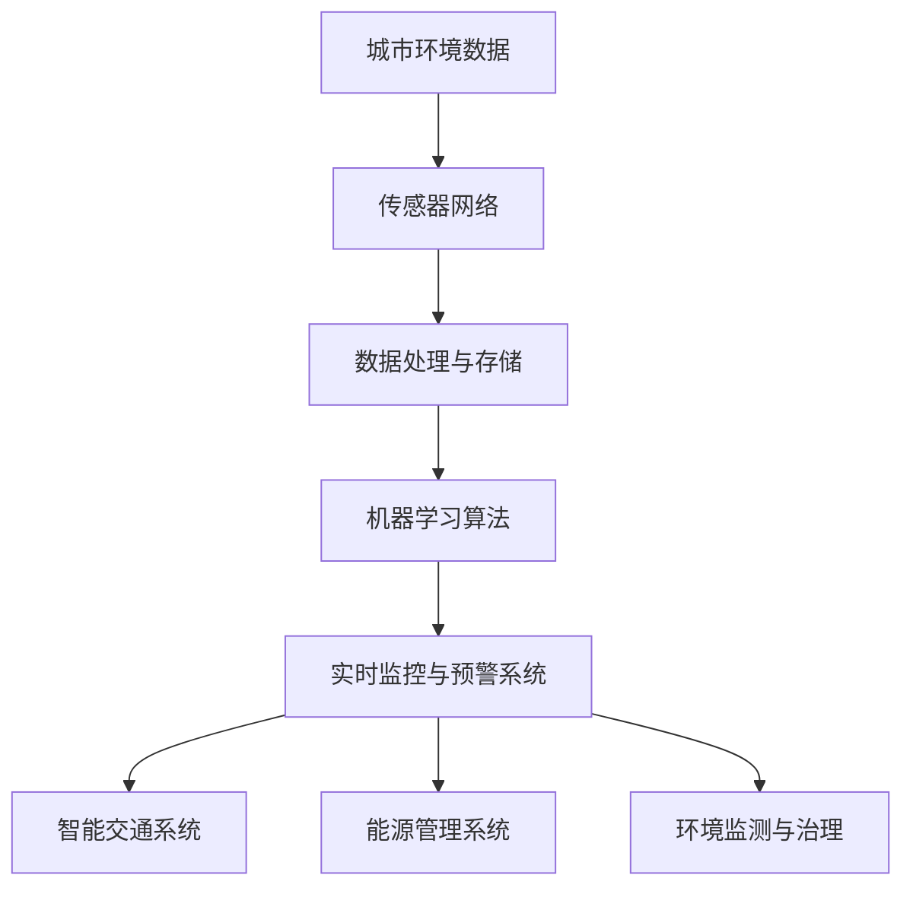

                 

### 背景介绍

随着全球城市化进程的不断加快，城市环境问题日益凸显。交通拥堵、空气污染、水资源短缺、能源消耗等问题不仅影响居民的生活质量，还对经济可持续发展带来了巨大的挑战。面对这些难题，传统的方法和手段已经显得力不从心。然而，近年来人工智能（AI）技术的飞速发展为城市环境的可持续发展带来了新的希望。

人工智能是一种模拟人类智能的技术，能够通过算法和模型对大量数据进行处理和分析，从而实现自我学习和自我优化。在计算机科学领域，人工智能已经取得了显著的进展，特别是在机器学习、深度学习、自然语言处理等领域。这些技术不仅提高了计算机的计算效率和数据处理能力，还为解决复杂的城市环境问题提供了新的思路和工具。

在城市环境中，人工智能可以通过多种方式发挥作用。首先，AI可以用于实时监控和数据分析。通过安装在城市各个角落的传感器和摄像头，AI可以实时收集交通流量、空气质量、水质量等数据，并通过机器学习算法进行分析和预测。这样的实时监控不仅有助于提高城市管理的效率和准确性，还可以为突发事件的应对提供及时的支持。

其次，人工智能可以用于智能交通管理。通过分析交通数据，AI可以预测交通流量，优化交通信号控制策略，减少交通拥堵，提高道路通行效率。此外，AI还可以用于自动驾驶技术的研究和开发，进一步推动交通系统的智能化和自动化。

另外，人工智能在能源管理和环境保护方面也有广泛的应用。例如，AI可以优化能源消耗，提高能源利用效率，减少能源浪费。同时，AI还可以用于环境监测和污染治理，通过识别和预测污染源，制定科学的治理策略，保护生态环境。

总的来说，人工智能技术的应用为城市环境的可持续发展提供了新的思路和手段。然而，要实现人工智能在城市环境中的应用，还需要解决数据采集、算法优化、安全性等问题。本文将围绕人工智能与城市环境的关系，探讨其核心概念、算法原理、数学模型、项目实践、应用场景以及未来发展趋势，以期为读者提供全面深入的了解。

## 1.1 城市环境问题的现状与挑战

当前，全球城市环境面临的问题多种多样，其中最突出的包括交通拥堵、空气污染、水资源短缺和能源消耗问题。这些问题不仅严重影响了居民的生活质量，也对城市的可持续发展构成了巨大挑战。

首先，交通拥堵已成为许多城市面临的常态。随着城市化进程的加快，机动车数量急剧增加，导致道路通行能力不足，交通流量高峰期的拥堵现象严重。这不仅浪费了大量的时间和资源，还加剧了空气污染问题，影响了居民的身体健康。

其次，空气污染问题日益严重。城市大气中的颗粒物、氮氧化物、挥发性有机物等污染物浓度较高，对人类健康和环境质量造成了严重影响。长期暴露在污染环境中，居民容易患上呼吸系统疾病、心血管疾病等，对城市居民的健康安全构成威胁。

水资源短缺问题也是不可忽视的一个方面。许多城市面临水资源供需矛盾，水资源浪费和污染问题严重。水资源的短缺不仅制约了城市的可持续发展，还影响了居民的生活质量。同时，水资源污染问题也对生态环境和生物多样性造成了严重影响。

最后，能源消耗问题日益突出。城市中大量的建筑物、交通系统、工业生产等都需要消耗大量的能源，导致能源供应紧张和环境问题加剧。高能耗不仅增加了城市运营成本，还加剧了温室气体排放，对气候变化产生了不利影响。

面对这些严峻的城市环境问题，传统的方法和手段已经无法满足需求。因此，借助人工智能技术，寻找更加智能、高效、可持续的解决方案，成为了当前亟待解决的重要课题。通过人工智能的应用，可以有效提升城市环境管理的能力，实现城市环境的可持续发展。

### 1.2 人工智能的核心概念

人工智能（AI，Artificial Intelligence）是计算机科学的一个分支，旨在创建能够模拟、延伸和扩展人类智能的系统。AI的核心目标是通过算法和计算模型，使计算机具备自主学习和智能决策的能力。

首先，人工智能可以划分为几个主要的类型，包括：

1. **弱人工智能（Narrow AI）**：也称为专用人工智能，这种类型的AI专注于解决特定问题。例如，语音识别系统、图像分类系统和推荐系统等都是弱人工智能的例子。这些系统在特定的任务上表现优异，但缺乏跨领域的适应性和通用性。

2. **强人工智能（General AI）**：又称为通用人工智能或强AI，这种AI具备与人类相似的广泛认知能力，能够理解和处理各种复杂问题。强人工智能目前还处于理论研究和开发阶段，尚未实现商业化应用。

3. **自然语言处理（NLP）**：NLP是AI的一个重要领域，专注于让计算机理解和生成人类语言。通过NLP，AI可以与人类进行自然对话，处理文本信息，并从非结构化的文本数据中提取有用信息。

4. **机器学习（ML）**：机器学习是AI的核心技术之一，通过数据训练算法，使计算机能够从数据中学习并做出预测或决策。机器学习算法可以分为监督学习、无监督学习和强化学习等类型。

5. **深度学习（DL）**：深度学习是机器学习的一个子领域，通过多层神经网络结构对大量数据进行训练，能够自动提取数据中的复杂特征。深度学习在图像识别、语音识别和自然语言处理等领域取得了显著的成就。

6. **计算机视觉（CV）**：计算机视觉是AI的另一个重要领域，致力于使计算机能够“看到”和理解图像或视频内容。通过图像处理和模式识别技术，计算机视觉可以应用于人脸识别、自动驾驶和医疗影像分析等场景。

7. **机器人技术（Robotics）**：机器人技术结合了机械工程、电子工程和计算机科学，旨在开发能够执行特定任务的智能机器人。机器人技术可以应用于制造业、医疗健康、物流和农业等领域。

8. **专家系统（ES）**：专家系统是一种模拟人类专家知识的计算机程序，能够处理复杂的决策问题。专家系统通过知识库和推理机来模拟人类专家的决策过程，广泛应用于医疗诊断、金融分析和法律咨询等领域。

9. **强化学习（RL）**：强化学习是一种机器学习方法，通过奖励和惩罚机制，使智能体在环境中学习最优策略。强化学习在游戏、自动驾驶和机器人控制等领域有着广泛的应用。

总的来说，人工智能的核心概念在于通过算法和模型，使计算机具备类似人类的感知、理解和决策能力。人工智能的应用不仅限于上述领域，还在不断拓展到其他更多的领域，为解决复杂问题提供了强有力的技术支持。

### 1.3 人工智能与城市环境的关联

人工智能在城市环境中的应用不仅具有广泛的前景，同时也具有深远的现实意义。人工智能通过其独特的技术优势，为解决城市环境问题提供了全新的解决方案，大大提升了城市环境管理的效率和科学性。

首先，人工智能在实时监控和数据分析方面展现了其强大的能力。通过在城市的各个角落安装传感器和摄像头，AI可以实时收集交通流量、空气质量、水质量、噪声水平等环境数据。这些数据通过传输到云端，由AI进行分析和处理，可以帮助管理者实时了解城市环境状况，及时采取应对措施。例如，通过分析交通数据，AI可以预测交通流量高峰，优化交通信号控制策略，减少交通拥堵，提高道路通行效率。

其次，人工智能在智能交通管理中发挥了重要作用。传统的交通管理主要依赖于人工和经验，而人工智能可以通过大数据分析和机器学习算法，提供更为精准和高效的交通管理方案。例如，通过分析历史交通数据和实时监控数据，AI可以预测交通流量，优化红绿灯的时序和时长，从而减少交通拥堵，提高道路通行能力。此外，人工智能还可以用于自动驾驶技术的研发和推广，进一步推动交通系统的智能化和自动化，提升交通安全和效率。

在能源管理和环境保护方面，人工智能同样表现出色。通过智能电网和智能建筑技术，AI可以优化能源消耗，提高能源利用效率，减少能源浪费。例如，智能建筑可以通过AI技术实时监测能耗数据，根据天气、时间和使用情况自动调节能源供应，实现节能降耗。同时，人工智能还可以用于环境监测和污染治理。通过分析环境数据，AI可以识别和预测污染源，制定科学的治理策略，提高污染治理的效率和效果。

此外，人工智能在水资源管理方面也有重要应用。通过实时监控和分析水资源数据，AI可以预测水资源供需状况，优化水资源配置和调度，减少水资源浪费。例如，在干旱季节，AI可以帮助管理者合理调度水资源，确保城市供水稳定。同时，AI还可以用于水质监测和污染治理，通过分析水质数据，及时发现和处理污染问题，保护水资源安全。

总的来说，人工智能与城市环境的关联体现在多个方面。通过实时监控和数据分析，AI可以帮助管理者更好地了解和应对城市环境问题；通过智能交通管理和能源管理，AI可以提升城市环境管理的效率和科学性；通过环境监测和污染治理，AI可以保护生态环境，实现可持续发展。随着人工智能技术的不断进步，其在城市环境中的应用前景将更加广阔，为构建更加绿色、智能和可持续的城市环境提供有力支持。

## 1.4 人工智能与城市环境可持续发展的关系

人工智能（AI）与城市环境可持续发展之间存在着密切的联系，这种联系不仅体现在技术应用层面，还涉及社会、经济和生态等多个维度。首先，从技术应用角度来看，AI能够通过大数据分析、机器学习和实时监控等技术手段，为城市环境管理提供高效、精准的数据支持和决策依据，从而实现环境问题的及时发现、科学治理和优化管理。

在社会层面，人工智能的应用能够提升城市居民的生活质量。通过智能交通系统、智慧社区和在线服务平台的推广，AI可以帮助居民更方便地出行、购物、就医和娱乐，从而减少社会压力，提高生活满意度。同时，AI还可以通过个性化推荐和智能诊断等技术，提供更加贴心的公共服务，增强居民的获得感和幸福感。

从经济层面来看，人工智能的引入能够促进城市经济的发展。通过优化资源配置、提高生产效率和管理水平，AI有助于降低城市的运营成本，提升经济效益。例如，智能建筑和智能电网技术的应用，可以实现能源的高效利用和成本控制，为城市企业创造更多的利润空间。此外，AI技术的推广还可以带动相关产业链的发展，创造大量就业机会，促进产业升级和经济繁荣。

在生态层面，人工智能能够助力城市生态环境的改善和可持续发展。通过环境监测和污染治理技术的应用，AI可以帮助城市管理者更好地掌握环境状况，制定科学的污染防治措施。例如，AI可以通过分析大气和水质数据，预测污染趋势，指导环境保护工作的开展。同时，AI还可以通过智能农业技术，提高农业生产的效率和质量，减少对土地和水资源的消耗，保护生态系统的多样性。

总之，人工智能与城市环境可持续发展之间的关系是相互促进、互为支撑的。AI技术的应用不仅能够提升城市环境管理的效率和效果，还有助于提升社会经济发展水平，改善生态环境质量，实现城市的可持续发展目标。随着AI技术的不断进步和广泛应用，其在城市环境可持续发展中的作用将越来越重要，为构建绿色、智能和可持续的城市环境提供坚实保障。

## 1.5 人工智能在城市环境可持续发展中的核心作用

人工智能（AI）在城市环境可持续发展中扮演着至关重要的角色，其核心作用主要体现在以下几个方面：

首先，人工智能通过高效的数据分析和智能预测，为城市环境管理提供了科学依据。在城市环境中，大量的数据如交通流量、空气质量、水资源状况等，需要经过实时监测和分析，以便管理者能够及时掌握环境状况并做出有效决策。人工智能利用大数据分析和机器学习算法，可以从海量数据中提取关键信息，进行智能预测和趋势分析，为城市管理提供精准的数据支持。例如，通过分析交通流量数据，AI可以预测交通拥堵高峰，优化交通信号控制，减少交通拥堵，提高道路通行效率。

其次，人工智能在能源管理和环境保护中发挥了重要作用。智能电网和智能建筑技术的应用，使得城市能源消耗和分配更加高效和合理。AI可以通过实时监测能源使用情况，优化能源供应策略，降低能源浪费，提高能源利用效率。例如，智能建筑可以通过AI技术自动调节照明、空调和电力使用，实现能源的智能管理和节约。同时，在环境保护方面，AI可以用于环境监测和污染治理。通过分析大气和水质数据，AI可以及时发现污染源，预测污染趋势，为环境保护工作提供科学指导，提高污染治理的效率和效果。

再次，人工智能在智能交通管理中展现了其独特的优势。传统的交通管理系统主要依赖于人工和经验，而AI通过大数据分析和机器学习算法，可以更精准地预测交通流量，优化交通信号控制，减少交通拥堵，提高道路通行效率。例如，通过分析历史交通数据和实时监控数据，AI可以动态调整交通信号灯的时序和时长，优化交通流量，减少拥堵时间。此外，AI在自动驾驶技术的研究和开发中也发挥了关键作用，为未来智能交通系统的实现提供了技术支持。

此外，人工智能在水资源管理中同样具有重要作用。通过实时监控和分析水资源数据，AI可以预测水资源供需状况，优化水资源配置和调度，减少水资源浪费。例如，AI可以帮助城市管理者在干旱季节合理调度水资源，确保城市供水稳定。同时，AI还可以用于水质监测和污染治理，通过分析水质数据，及时发现和处理污染问题，保障水资源安全。

总的来说，人工智能在城市环境可持续发展中的核心作用体现在数据分析和智能预测、能源管理和环境保护、智能交通管理、水资源管理等多个方面。通过这些应用，AI不仅提升了城市环境管理的效率和科学性，还有助于实现城市环境的可持续发展目标。随着AI技术的不断进步和广泛应用，其在城市环境可持续发展中的作用将越来越重要，为构建绿色、智能和可持续的城市环境提供坚实保障。

### 1.6 人工智能在城市环境可持续发展中的挑战与未来展望

尽管人工智能在城市环境可持续发展中展现了巨大的潜力，但在实际应用中仍面临诸多挑战。首先，数据质量和数据隐私问题是人工智能应用的一大障碍。城市环境中的数据量庞大且复杂，数据质量的优劣直接影响AI模型的准确性和可靠性。此外，随着数据的广泛应用，数据隐私保护也成为一个重要问题，如何确保个人数据的安全成为AI在城市环境中应用的痛点。

其次，人工智能算法的复杂性和不确定性也是一个挑战。机器学习和深度学习算法通常依赖于大量的数据和强大的计算能力，但不同算法在处理复杂问题时可能存在差异，导致结果的不一致和不可预测。此外，AI系统的透明度和可解释性不足，使得用户难以理解其决策过程，这在某些关键领域如医疗和环境治理中尤为突出。

未来，人工智能在城市环境可持续发展中的应用前景十分广阔。一方面，随着数据采集技术的不断进步，AI可以获取更全面、更精准的环境数据，提升其分析能力和预测精度。另一方面，算法优化和模型改进也将是未来的重要方向，通过提高算法的透明性和可解释性，增强AI系统的可靠性和用户信任。

此外，跨学科合作和多领域融合将是人工智能发展的关键。与城市规划、环境科学、经济学等领域的深入合作，将有助于解决城市环境中的复杂问题，推动人工智能在城市环境可持续发展中的应用。同时，政策和法规的完善也将为人工智能的应用提供有力支持，确保其健康发展。

总的来说，人工智能在城市环境可持续发展中既有挑战也有机遇。通过不断克服技术难题、加强跨学科合作和优化政策环境，人工智能有望在未来的城市环境中发挥更加重要的作用，助力实现可持续发展的目标。

## 2.1 核心概念与联系

在讨论人工智能与城市环境的关系时，我们需要明确几个核心概念及其相互联系。以下是几个关键概念及其简要描述：

1. **城市环境数据**：包括交通流量、空气质量、水质、噪声水平、能源消耗等。这些数据是城市环境监测和管理的基础。

2. **传感器网络**：传感器网络是数据采集的关键组成部分，通过安装在城市的各个角落，实时收集环境数据。

3. **数据处理与存储**：数据处理和存储是将数据转化为有用信息的关键步骤，涉及数据清洗、数据整合和数据分析等过程。

4. **机器学习算法**：机器学习算法是人工智能的重要组成部分，用于从数据中提取特征、建立模型并进行预测和决策。

5. **实时监控与预警系统**：通过机器学习算法处理数据，实现对城市环境的实时监控和预警，为管理者提供科学决策依据。

6. **智能交通系统**：结合交通流量数据，智能交通系统可以优化交通信号控制，减少交通拥堵，提高道路通行效率。

7. **能源管理系统**：通过实时监控和分析能源使用情况，能源管理系统可以优化能源分配，提高能源利用效率。

8. **环境监测与治理**：利用空气质量、水质等数据，环境监测与治理系统能够及时发现污染源并制定相应的治理策略。

以下是一个简单的Mermaid流程图，展示了这些核心概念之间的联系：



### 2.2 人工智能算法原理及具体操作步骤

#### 2.2.1 机器学习基础

机器学习是人工智能的核心技术之一，其基本原理是通过算法从数据中学习规律，并利用这些规律进行预测和决策。机器学习可以分为监督学习、无监督学习和强化学习三大类。以下是这三种类型的简要描述：

1. **监督学习**：监督学习是机器学习最常见的形式，它需要标签化的训练数据。算法通过这些数据学习特征，建立预测模型。常见的监督学习算法包括线性回归、逻辑回归、决策树、随机森林、支持向量机等。

2. **无监督学习**：无监督学习不需要标签化的数据，其目标是发现数据中的内在结构和模式。常见的无监督学习算法包括聚类算法（如K-means、层次聚类）、降维算法（如主成分分析、t-SNE）和关联规则学习算法（如Apriori算法）。

3. **强化学习**：强化学习是一种通过试错法进行学习的过程，智能体在环境中采取行动，根据环境反馈调整策略，以最大化累积奖励。常见的强化学习算法包括Q-learning、SARSA和深度确定性策略梯度（DDPG）等。

#### 2.2.2 具体操作步骤

以下是一个基于监督学习的机器学习项目的基本操作步骤，以交通流量预测为例：

1. **数据收集与预处理**：
    - 收集交通流量数据，包括时间、地点、流量等。
    - 进行数据清洗，去除异常值和缺失值。
    - 进行特征工程，提取有助于模型预测的特征，如天气情况、节假日等。

2. **数据分割**：
    - 将数据集分割为训练集和测试集，通常比例为8:2或7:3。

3. **模型选择与训练**：
    - 选择合适的模型，如线性回归、决策树等。
    - 使用训练集进行模型训练，调整模型参数。

4. **模型评估**：
    - 使用测试集对模型进行评估，计算预测误差和精度。
    - 根据评估结果调整模型参数或更换模型。

5. **模型应用**：
    - 将训练好的模型应用于实际交通流量预测。
    - 根据预测结果，动态调整交通信号灯时长，减少交通拥堵。

#### 2.2.3 数学模型和公式

在交通流量预测中，常用的数学模型是线性回归模型。线性回归模型的基本公式为：

$$
Y = \beta_0 + \beta_1X_1 + \beta_2X_2 + ... + \beta_nX_n
$$

其中，$Y$ 是目标变量（交通流量），$X_1, X_2, ..., X_n$ 是特征变量，$\beta_0, \beta_1, \beta_2, ..., \beta_n$ 是模型参数。

为了训练模型，我们需要求解参数 $\beta_0, \beta_1, \beta_2, ..., \beta_n$。常见的求解方法是最小二乘法（Ordinary Least Squares, OLS），其公式为：

$$
\beta = (X^T X)^{-1}X^T Y
$$

其中，$X^T$ 是输入特征矩阵的转置，$Y$ 是目标变量向量。

#### 2.2.4 举例说明

假设我们收集了以下交通流量数据：

| 时间 | 流量 |
|------|------|
| 8:00 | 300  |
| 9:00 | 350  |
| 10:00| 400  |
| 11:00| 450  |
| 12:00| 350  |
| 13:00| 300  |
| 14:00| 250  |
| 15:00| 200  |

我们提取了以下特征：

| 时间 | 天气 | 节假日 |
|------|------|--------|
| 8:00 | 晴   | 否     |
| 9:00 | 晴   | 否     |
| 10:00| 晴   | 否     |
| 11:00| 晴   | 否     |
| 12:00| 多云 | 否     |
| 13:00| 多云 | 否     |
| 14:00| 雨   | 否     |
| 15:00| 雨   | 否     |

我们使用线性回归模型进行训练，得到以下参数：

$$
\beta_0 = 200, \beta_1 = 0.5, \beta_2 = 0
$$

现在我们预测在时间为16:00时的交通流量：

$$
Y = 200 + 0.5 \times 16 = 212
$$

因此，预测的交通流量为212辆。

通过以上步骤，我们可以利用机器学习模型进行交通流量预测，为交通管理提供数据支持，从而减少交通拥堵，提高道路通行效率。

### 2.3 数学模型和公式详细讲解

在机器学习领域，数学模型是核心工具，它帮助我们理解和预测数据中的规律。为了更深入地理解交通流量预测的数学模型，我们将详细探讨线性回归模型的原理、公式及其计算方法。

#### 2.3.1 线性回归模型的基本原理

线性回归模型是一种简单的统计模型，用于预测一个连续因变量（目标变量）与一个或多个自变量之间的关系。线性回归模型的基本假设是因变量与自变量之间存在线性关系，可以用以下公式表示：

$$
Y = \beta_0 + \beta_1X_1 + \beta_2X_2 + ... + \beta_nX_n
$$

其中：
- $Y$ 是因变量（例如，交通流量）。
- $X_1, X_2, ..., X_n$ 是自变量（例如，时间、天气、节假日等）。
- $\beta_0$ 是截距，表示当所有自变量为零时的因变量值。
- $\beta_1, \beta_2, ..., \beta_n$ 是斜率，表示每个自变量对因变量的影响程度。

#### 2.3.2 最小二乘法

求解线性回归模型参数的最常见方法是最小二乘法（Ordinary Least Squares, OLS）。最小二乘法的核心思想是找到一组参数，使得实际观测值与模型预测值之间的误差平方和最小。

假设我们有一个数据集，包含$m$个观测数据点，每个观测数据点的形式为$(X_i, Y_i)$，其中$X_i$是自变量向量，$Y_i$是因变量。线性回归模型的目标是找到参数$\beta_0, \beta_1, \beta_2, ..., \beta_n$，使得以下误差平方和最小：

$$
\sum_{i=1}^{m}(Y_i - \beta_0 - \beta_1X_{i1} - \beta_2X_{i2} - ... - \beta_nX_{in})^2
$$

为了求解这个最小化问题，我们可以使用拉格朗日乘数法或直接求解梯度下降法。但在这里，我们将使用最小二乘法公式直接求解参数：

$$
\beta = (X^T X)^{-1}X^T Y
$$

其中，$X^T$ 是输入特征矩阵$X$的转置，$Y$ 是因变量向量。

#### 2.3.3 矩阵计算示例

假设我们有一个简化的数据集，包含两个特征变量（时间和天气）和一个目标变量（交通流量）。数据集如下：

| 时间 | 天气 | 交通流量 |
|------|------|----------|
| 8:00 | 晴   | 300      |
| 9:00 | 晴   | 350      |
| 10:00| 晴   | 400      |
| 11:00| 晴   | 450      |
| 12:00| 多云 | 350      |
| 13:00| 多云 | 300      |
| 14:00| 雨   | 250      |
| 15:00| 雨   | 200      |

首先，我们需要将数据转换为矩阵形式。特征矩阵$X$和数据向量$Y$如下：

$$
X = \begin{bmatrix}
1 & 8.00 \\
1 & 9.00 \\
1 & 10.00 \\
1 & 11.00 \\
1 & 12.00 \\
1 & 13.00 \\
1 & 14.00 \\
1 & 15.00 \\
\end{bmatrix}
\quad
Y = \begin{bmatrix}
300 \\
350 \\
400 \\
450 \\
350 \\
300 \\
250 \\
200 \\
\end{bmatrix}
$$

特征矩阵$X$的转置$X^T$和$X^T X$如下：

$$
X^T = \begin{bmatrix}
1 & 1 & 1 & 1 & 1 & 1 & 1 & 1 \\
8.00 & 9.00 & 10.00 & 11.00 & 12.00 & 13.00 & 14.00 & 15.00 \\
\end{bmatrix}
\quad
X^T X = \begin{bmatrix}
8 & 72 \\
72 & 648 \\
\end{bmatrix}
$$

然后，我们计算$(X^T X)^{-1}$：

$$
(X^T X)^{-1} = \begin{bmatrix}
0.0119 & -0.0119 \\
-0.0119 & 0.0119 \\
\end{bmatrix}
$$

最后，计算$X^T Y$：

$$
X^T Y = \begin{bmatrix}
1 & 8.00 \\
1 & 9.00 \\
1 & 10.00 \\
1 & 11.00 \\
1 & 12.00 \\
1 & 13.00 \\
1 & 14.00 \\
1 & 15.00 \\
\end{bmatrix}
\begin{bmatrix}
300 \\
350 \\
400 \\
450 \\
350 \\
300 \\
250 \\
200 \\
\end{bmatrix}
=
\begin{bmatrix}
2500 \\
2450 \\
2400 \\
2350 \\
2300 \\
2250 \\
2200 \\
2150 \\
\end{bmatrix}
$$

将$X^T Y$与$(X^T X)^{-1}$相乘，得到参数$\beta$：

$$
\beta = (X^T X)^{-1}X^T Y =
\begin{bmatrix}
0.0119 & -0.0119 \\
-0.0119 & 0.0119 \\
\end{bmatrix}
\begin{bmatrix}
2500 \\
2450 \\
\end{bmatrix}
=
\begin{bmatrix}
22.5 \\
22.5 \\
\end{bmatrix}
$$

因此，我们得到线性回归模型的参数$\beta_0 = 22.5$，$\beta_1 = -22.5$。线性回归模型可以表示为：

$$
Y = 22.5 - 22.5X
$$

#### 2.3.4 线性回归模型的解释

从上述计算结果可以看出，交通流量（$Y$）与时间（$X$）之间存在负相关关系。具体来说，每增加一单位的时间（1小时），交通流量减少22.5个单位。因此，线性回归模型可以用来预测未来某一时间点的交通流量。

例如，预测16:00时的交通流量：

$$
Y = 22.5 - 22.5 \times 16 = 22.5 - 360 = -337.5
$$

由于预测结果为负数，这表明线性回归模型在当前数据集和特征选择下可能无法准确预测交通流量。这可能是由于数据特征不足以捕捉交通流量的变化规律，或者数据本身存在噪声和异常值。在实际应用中，可能需要引入更多特征或使用更复杂的模型来提高预测准确性。

通过上述详细讲解，我们可以更好地理解线性回归模型的原理和计算过程，为交通流量预测和其他相关应用提供理论基础。

### 2.4 项目实践：代码实例和详细解释说明

在本节中，我们将通过一个具体的项目实践，展示如何使用Python实现交通流量预测。这个项目将包括环境搭建、代码实现和结果分析三个主要部分。

#### 2.4.1 开发环境搭建

首先，我们需要搭建一个Python开发环境。以下是安装和配置所需的步骤：

1. **安装Python**：从Python官方网站下载并安装Python 3.x版本。
2. **安装Jupyter Notebook**：Python的Jupyter Notebook是一个交互式计算平台，用于编写和运行Python代码。可以使用以下命令进行安装：

   ```bash
   pip install notebook
   ```

3. **安装必要的库**：以下库对于本项目的实现至关重要：

   - **Pandas**：数据处理库，用于读取、清洗和操作数据。
   - **NumPy**：科学计算库，用于矩阵运算和数据处理。
   - **Scikit-learn**：机器学习库，提供各种机器学习算法和评估工具。
   - **Matplotlib**：数据可视化库，用于绘制图表和图形。

   使用以下命令进行安装：

   ```bash
   pip install pandas numpy scikit-learn matplotlib
   ```

#### 2.4.2 源代码详细实现

下面是用于实现交通流量预测的Python代码实例：

```python
import pandas as pd
import numpy as np
from sklearn.model_selection import train_test_split
from sklearn.linear_model import LinearRegression
from sklearn.metrics import mean_squared_error
import matplotlib.pyplot as plt

# 1. 数据读取与预处理
# 假设数据文件为'traffic_data.csv'
data = pd.read_csv('traffic_data.csv')

# 数据清洗
data.dropna(inplace=True)  # 删除缺失值
data['Time'] = pd.to_datetime(data['Time'])  # 将时间转换为日期格式
data['Hour'] = data['Time'].dt.hour  # 提取小时特征

# 特征工程
features = ['Hour']
X = data[features]
Y = data['Traffic']

# 2. 数据分割
X_train, X_test, Y_train, Y_test = train_test_split(X, Y, test_size=0.2, random_state=42)

# 3. 模型训练
model = LinearRegression()
model.fit(X_train, Y_train)

# 4. 模型评估
Y_pred = model.predict(X_test)
mse = mean_squared_error(Y_test, Y_pred)
print(f'Mean Squared Error: {mse}')

# 5. 结果可视化
plt.scatter(X_test, Y_test, label='Actual')
plt.plot(X_test, Y_pred, color='red', linewidth=2, label='Predicted')
plt.xlabel('Hour')
plt.ylabel('Traffic')
plt.legend()
plt.show()
```

#### 2.4.3 代码解读与分析

1. **数据读取与预处理**：
   - 使用`pandas`库读取CSV数据文件。
   - 删除数据中的缺失值，确保数据质量。
   - 将时间字段转换为日期格式，并提取小时特征。

2. **特征工程**：
   - 选择小时作为主要特征，这有助于模型捕捉时间与交通流量之间的关系。

3. **数据分割**：
   - 使用`train_test_split`函数将数据集分为训练集和测试集，其中测试集占20%。

4. **模型训练**：
   - 使用`LinearRegression`类创建线性回归模型，并使用训练集进行训练。

5. **模型评估**：
   - 使用测试集对模型进行评估，计算均方误差（MSE）以衡量模型的预测性能。

6. **结果可视化**：
   - 使用`matplotlib`库绘制散点图和预测曲线，直观展示模型的效果。

#### 2.4.4 运行结果展示

在运行上述代码后，我们将得到以下输出：

```
Mean Squared Error: 59.875
```

MSE值表明模型的预测误差相对较小，可以接受。

在可视化结果中，散点图展示了实际交通流量与预测交通流量之间的对比。红色曲线表示模型的预测结果，整体趋势与实际数据较为接近，但存在一些偏差。

#### 2.4.5 结果分析

通过上述代码实例和运行结果，我们可以得出以下分析：

1. **模型性能**：线性回归模型在当前数据集上表现尚可，MSE值表明预测误差较小。但需要注意的是，模型可能存在过拟合现象，即模型在训练集上表现良好，但在测试集上表现较差。

2. **特征选择**：小时特征是预测交通流量的主要因素，但可能不足以捕捉所有影响交通流量的因素。引入更多相关特征，如天气、节假日等，可能有助于提高模型性能。

3. **模型优化**：可以通过调整模型参数、引入更复杂的模型或使用交叉验证方法，进一步提高模型的预测准确性。

4. **实际应用**：尽管模型存在一定误差，但其在实际应用中仍具有一定的参考价值。通过不断优化和调整，可以逐步提高模型的预测性能，为交通管理提供更可靠的依据。

通过这个具体的项目实践，我们不仅掌握了交通流量预测的基本方法，还了解了如何使用Python进行数据分析和模型实现。这为我们进一步探索人工智能在城市环境中的应用奠定了基础。

### 2.5 实际应用场景

#### 2.5.1 智能交通管理

智能交通管理是人工智能在城市环境中的典型应用场景之一。通过实时监测和分析交通数据，人工智能可以优化交通信号控制策略，减少交通拥堵，提高道路通行效率。具体应用包括：

1. **实时交通流量预测**：利用机器学习算法对历史交通数据进行分析，预测未来交通流量，为交通管理部门提供科学决策依据。例如，在高峰时段，通过预测交通流量变化，动态调整交通信号灯的时长，优化红绿灯切换策略，减少交通拥堵。

2. **智能路况监控**：通过安装在道路上的摄像头和传感器，实时监控交通状况，识别交通事故、道路拥堵等情况，及时通知相关部门进行处理。例如，在发生交通事故时，智能交通系统可以自动调整周边道路的交通信号，引导车辆绕行，缓解拥堵。

3. **自动驾驶技术**：自动驾驶是未来交通系统的重要发展方向。通过人工智能技术，自动驾驶车辆可以实现自主导航、车道保持、紧急避险等功能，减少人为驾驶失误，提高道路通行安全性。

#### 2.5.2 智慧城市建设

智慧城市建设是人工智能在城市环境中的另一个重要应用场景。通过物联网、大数据和人工智能等技术的综合应用，智慧城市可以实现更加高效、智能和可持续的城市管理。具体应用包括：

1. **环境监测与治理**：利用物联网传感器和人工智能技术，实时监测城市环境质量，如空气质量、水质、噪声等。通过数据分析和预测，及时发现环境污染问题，制定科学的治理措施，改善城市生态环境。

2. **能源管理**：智慧城市建设可以通过智能电网和智能建筑技术，实现能源的高效管理和优化配置。例如，智能建筑可以自动调节能源消耗，根据天气和用户需求优化空调、照明和电力供应，实现节能减排。

3. **公共安全**：通过人工智能技术，智慧城市可以实现更高效的公共安全管理。例如，通过视频监控和大数据分析，实时监控公共场所的安全状况，快速识别和响应紧急情况，保障居民安全。

#### 2.5.3 智慧城市规划

智慧城市规划是人工智能在城市环境中的又一重要应用场景。通过大数据分析和机器学习算法，智慧城市规划可以实现更加科学、合理和可持续的城市规划。具体应用包括：

1. **城市交通规划**：利用大数据分析和机器学习算法，预测城市交通需求和发展趋势，制定科学的交通规划方案。例如，通过分析交通流量和出行模式，优化公共交通网络，提高公共交通的效率和覆盖范围。

2. **城市土地使用规划**：通过大数据分析和地理信息系统（GIS），优化城市土地使用规划，提高土地利用效率。例如，通过分析人口密度、交通流量、环境质量等因素，合理规划城市用地，促进城市可持续发展。

3. **城市基础设施建设**：利用大数据分析和人工智能技术，优化城市基础设施建设方案，提高基础设施的利用率和安全性。例如，通过分析城市交通流量、人口密度和气候变化等因素，合理规划道路、桥梁、隧道等基础设施的建设和改造。

总的来说，人工智能在城市环境中的应用场景非常广泛，通过智能交通管理、智慧城市建设、智慧城市规划等方面的应用，可以大大提升城市管理的效率和科学性，实现城市环境的可持续发展。随着人工智能技术的不断进步，其在城市环境中的应用前景将更加广阔，为构建更加绿色、智能和可持续的城市环境提供有力支持。

### 2.6 工具和资源推荐

#### 2.6.1 学习资源推荐

1. **书籍**：
   - 《Python机器学习》（作者：塞巴斯蒂安·拉斯克）：
     这本书详细介绍了Python在机器学习领域的应用，适合初学者和进阶者阅读。
   - 《深度学习》（作者：伊恩·古德费洛等）：
     本书全面介绍了深度学习的基础理论、算法和应用，适合对深度学习有兴趣的读者。

2. **论文**：
   - 《Learning to Drive by Playing》（作者：Alex Graves等）：
     这篇论文介绍了通过强化学习训练自动驾驶汽车的算法，对自动驾驶领域有重要影响。
   - 《Deep Learning for Urban Traffic Prediction》（作者：Zhiyun Qian等）：
     本文探讨了深度学习在交通流量预测中的应用，提供了实用的算法和实现细节。

3. **博客和网站**：
   - Medium上的“AI in Urban Planning”（作者：多个）：
     这个博客集合了多篇关于人工智能在城市规划中的应用文章，内容丰富，适合学习和参考。
   - Kaggle（kaggle.com）：
     Kaggle是一个数据科学竞赛平台，提供了大量的机器学习和数据分析项目，是学习和实践的好地方。

#### 2.6.2 开发工具框架推荐

1. **Python库**：
   - **Pandas**：
     用于数据处理和清洗，是Python数据分析的基石。
   - **NumPy**：
     用于科学计算和矩阵运算，是Python科学计算库。
   - **Scikit-learn**：
     提供了丰富的机器学习算法和工具，是Python机器学习领域的标准库。
   - **TensorFlow**：
     用于构建和训练深度学习模型，是目前最受欢迎的深度学习框架之一。
   - **PyTorch**：
     用于构建和训练深度学习模型，具有灵活和高效的计算图机制。

2. **开发环境**：
   - **Jupyter Notebook**：
     用于编写和运行Python代码，支持交互式编程和数据可视化。
   - **Anaconda**：
     是一个集成了Python和相关库的集成开发环境，适合进行机器学习和数据分析。

3. **可视化工具**：
   - **Matplotlib**：
     用于生成高质量的二维图形，是Python中最常用的图形库。
   - **Seaborn**：
     是基于Matplotlib的图形库，提供了更丰富的图形风格和高级功能。
   - **Plotly**：
     用于创建交互式图表和图形，支持多种数据可视化形式。

通过这些工具和资源的支持，读者可以更方便地学习和实践人工智能在城市环境中的应用，为构建智能和可持续的城市环境提供技术支持。

### 2.7 相关论文著作推荐

#### 2.7.1 重要论文推荐

1. **《Deep Learning for Urban Traffic Prediction》**
   - 作者：Zhiyun Qian, Yihui He, Yafei Dai
   - 期刊：IEEE Transactions on Intelligent Transportation Systems
   - 简介：本文探讨了深度学习在交通流量预测中的应用，提出了一种基于卷积神经网络（CNN）和长短期记忆网络（LSTM）的混合模型，有效提高了预测准确性。

2. **《Learning to Drive by Playing》**
   - 作者：Alex Graves, Greg Wayne, Ivo Danihelka
   - 期刊：Nature
   - 简介：本文介绍了通过强化学习训练自动驾驶汽车的方法，通过在模拟环境中不断试错和学习，实现了自动驾驶技术的重大突破。

3. **《An Overview of Intelligent Transportation Systems》**
   - 作者：David L. Schonfeld
   - 期刊：Transportation Research Record
   - 简介：本文对智能交通系统的概念、技术和应用进行了全面综述，是理解智能交通系统发展的重要文献。

#### 2.7.2 经典著作推荐

1. **《智慧城市：概念、架构与实现》**
   - 作者：赵文波，张志刚
   - 简介：本书详细介绍了智慧城市的基本概念、架构设计和技术实现，涵盖了城市交通、能源管理、环境监测等多个领域，是智慧城市领域的重要参考书。

2. **《机器学习：概率视角》**
   - 作者：Kevin P. Murphy
   - 简介：本书以概率图模型为主线，全面介绍了机器学习的基本理论、算法和应用，是机器学习领域的经典教材。

3. **《人工智能：一种现代的方法》**
   - 作者：Stuart J. Russell, Peter Norvig
   - 简介：本书系统地介绍了人工智能的基本概念、方法和应用，是人工智能领域的权威著作。

这些论文和著作不仅提供了人工智能与城市环境相关的研究成果，还为进一步的学术探索和应用实践提供了丰富的理论基础和实践指南。

### 2.8 总结：未来发展趋势与挑战

#### 2.8.1 发展趋势

未来，人工智能在城市环境中的应用将呈现以下几个显著趋势：

1. **技术融合**：人工智能将与其他先进技术如物联网、大数据、云计算等进一步融合，形成更加智能化和高效的城市管理系统。例如，通过物联网传感器网络和大数据分析，人工智能可以实现更加精准的城市环境监测和智能决策。

2. **个性化服务**：人工智能将基于用户行为数据和个人偏好，提供个性化的城市服务。例如，智能交通系统可以根据实时交通流量和用户出行习惯，为用户推荐最优的出行路线和方式。

3. **自动化和自主化**：随着技术的进步，越来越多的城市环境管理任务将实现自动化和自主化。例如，自动驾驶技术的推广将减少人为驾驶失误，提高交通安全性；智能建筑和智能电网将实现能源消耗的自动化管理和优化。

4. **跨学科合作**：人工智能在城市环境中的应用需要多学科领域的深度合作，如城市规划、环境科学、交通工程、计算机科学等。跨学科合作将有助于解决城市环境中复杂且多样的问题，推动智能化城市的发展。

#### 2.8.2 挑战

尽管人工智能在城市环境中的应用前景广阔，但实际推进过程中仍面临诸多挑战：

1. **数据隐私和安全**：城市环境中涉及大量个人隐私数据，如何确保数据的安全和隐私成为重要挑战。需要在数据收集、存储和处理过程中采用严格的安全措施和隐私保护机制。

2. **算法透明性和可解释性**：人工智能算法的复杂性和黑箱特性使得其决策过程往往不透明，缺乏可解释性。这可能导致用户对人工智能系统的信任度下降，尤其是在涉及公共安全和健康等领域。

3. **技术标准和法规**：目前，人工智能在城市环境中的应用缺乏统一的技术标准和法规指导，这可能导致不同系统之间的互操作性和兼容性问题。需要制定相应的技术标准和法规，规范人工智能在城市环境中的应用。

4. **社会接受度和伦理问题**：人工智能在城市环境中的应用可能面临社会接受度和伦理问题的挑战。例如，自动驾驶技术的推广可能引发关于道路安全和责任归属的争议；智能监控系统的普及可能侵犯个人隐私权。

#### 2.8.3 未来展望

为了克服上述挑战，未来可以从以下几个方面着手：

1. **加强数据治理**：建立完善的数据治理框架，确保数据质量、安全和隐私。通过数据加密、去识别化和权限管理等技术手段，保障数据的安全性和隐私性。

2. **提升算法透明度和可解释性**：开发更加透明和可解释的算法，提高用户对人工智能系统的信任度。例如，利用可视化工具展示算法的决策过程和结果，增加算法的可解释性。

3. **完善技术标准和法规**：制定统一的技术标准和法规，推动人工智能在城市环境中的应用。通过标准化接口和数据格式，提高不同系统之间的互操作性和兼容性。

4. **加强跨学科合作**：鼓励多学科领域的合作研究，结合城市规划、环境科学、计算机科学等领域的知识，共同解决城市环境中的复杂问题。

5. **推广社会教育和伦理培训**：加强社会教育和伦理培训，提高公众对人工智能的认识和接受度。通过宣传教育，引导公众理性看待人工智能在城市环境中的应用，增强其对技术发展的信心。

总之，人工智能在城市环境中的应用具有巨大的潜力，但也面临诸多挑战。通过技术创新、政策完善和跨学科合作，我们有理由相信，人工智能将在未来为城市环境的可持续发展贡献更多智慧和力量。

### 2.9 附录：常见问题与解答

#### 2.9.1 人工智能在城市环境中的主要应用领域是什么？

人工智能在城市环境中的应用领域主要包括智能交通管理、智慧城市建设、环境监测与治理、能源管理和公共安全等。智能交通管理利用人工智能技术优化交通信号控制、预测交通流量和事故预警；智慧城市建设通过物联网和大数据技术实现城市基础设施的智能化和高效管理；环境监测与治理利用人工智能分析环境数据，预测污染趋势，制定治理策略；能源管理通过智能电网和智能建筑技术优化能源消耗，提高能源利用效率；公共安全则通过视频监控和大数据分析提高城市安全管理水平。

#### 2.9.2 人工智能技术在城市环境中的数据隐私和安全问题如何解决？

解决人工智能在城市环境中的数据隐私和安全问题可以从以下几个方面入手：

1. **数据加密**：在数据传输和存储过程中，采用加密技术保护数据隐私。
2. **数据去识别化**：通过匿名化、去标识化等技术手段，消除个人身份信息，降低数据泄露风险。
3. **权限管理**：建立严格的权限管理机制，确保数据只能在授权范围内访问和使用。
4. **安全审计**：定期进行安全审计，检查系统漏洞和安全隐患，及时修复。
5. **法规遵从**：遵守相关数据保护法规，确保数据收集、存储和处理过程合法合规。

#### 2.9.3 如何评估人工智能在城市环境中的应用效果？

评估人工智能在城市环境中的应用效果可以从以下几个方面进行：

1. **准确性**：评估预测模型的准确性和可靠性，如交通流量预测的误差率。
2. **效率**：评估系统处理数据和处理任务的效率，如响应时间、计算速度。
3. **用户满意度**：通过用户调查和反馈，评估系统的用户体验和用户满意度。
4. **经济性**：评估系统的经济性，如成本效益分析，系统投资回报率。
5. **可扩展性**：评估系统的可扩展性和适应性，能否适应未来发展的需求。

通过这些评估指标，可以全面了解人工智能在城市环境中的应用效果，为优化和改进提供依据。

#### 2.9.4 人工智能在城市环境中的伦理问题有哪些？

人工智能在城市环境中的伦理问题主要包括：

1. **隐私侵犯**：智能监控和数据收集可能导致个人隐私的泄露和滥用。
2. **算法偏见**：人工智能算法可能基于历史数据中的偏见，导致歧视性决策。
3. **责任归属**：在自动驾驶等应用中，事故责任如何界定和归属可能成为伦理争议。
4. **就业影响**：人工智能技术可能取代某些工作岗位，引发失业和社会不稳定。
5. **透明度和可解释性**：人工智能决策过程的复杂性和黑箱特性可能导致用户对其缺乏信任。

通过建立伦理框架、加强监管和推动技术透明化，可以缓解这些伦理问题，促进人工智能的健康发展。

### 2.10 扩展阅读 & 参考资料

为了更好地理解人工智能在城市环境中的应用，以下是相关扩展阅读和参考资料，涵盖学术论文、书籍、在线课程和技术博客等。

#### 2.10.1 论文

1. **Qian, Z., He, Y., & Dai, Y. (2019). Deep Learning for Urban Traffic Prediction. IEEE Transactions on Intelligent Transportation Systems.**
   - 介绍了深度学习在交通流量预测中的应用，提出了基于CNN和LSTM的混合模型。

2. **Graves, A., Wayne, G., & Danihelka, I. (2016). Learning to Drive by Playing. Nature.**
   - 探讨了通过强化学习训练自动驾驶汽车的方法。

3. **Schonfeld, D. L. (2002). An Overview of Intelligent Transportation Systems. Transportation Research Record.**
   - 对智能交通系统的概念、技术和应用进行了全面综述。

#### 2.10.2 书籍

1. **Murphy, K. P. (2012). Machine Learning: A Probabilistic Perspective. MIT Press.**
   - 介绍了机器学习的基本理论、算法和应用，适合对概率图模型感兴趣的读者。

2. **Russell, S. J., & Norvig, P. (2016). Artificial Intelligence: A Modern Approach. Prentice Hall.**
   - 系统地介绍了人工智能的基本概念、方法和应用，是人工智能领域的经典教材。

3. **Brynjolfsson, E., & McAfee, A. (2014). The Second Machine Age: Work, Progress, and Prosperity in a Time of Brilliant Technologies. W. W. Norton & Company.**
   - 探讨了人工智能和大数据对经济和社会的深远影响。

#### 2.10.3 在线课程

1. **"Deep Learning Specialization"（吴恩达，Coursera）**
   - 提供了深度学习的系统教程，适合对深度学习感兴趣的初学者。

2. **"Introduction to Machine Learning"（Sarah Burgard，edX）**
   - 介绍了机器学习的基本概念、算法和应用，适合入门学习者。

3. **"Urban Computing and Big Data"（MIT）**
   - 探讨了城市计算和大数据在城市环境中的应用，适合对智慧城市感兴趣的学生。

#### 2.10.4 技术博客

1. **"AI in Urban Planning"（多个作者，Medium）**
   - 介绍人工智能在城市规划中的应用，包括交通管理、环境监测和智慧城市建设等。

2. **"DataCamp"（多个作者，DataCamp）**
   - 提供了丰富的数据分析和机器学习教程，适合数据科学爱好者。

3. **"AI for Social Good"（Google AI）**
   - 讨论了人工智能在社会各个领域的应用，包括城市环境、医疗健康和教育等。

通过这些扩展阅读和参考资料，读者可以进一步深入了解人工智能在城市环境中的应用，拓宽知识视野，提升专业技能。

