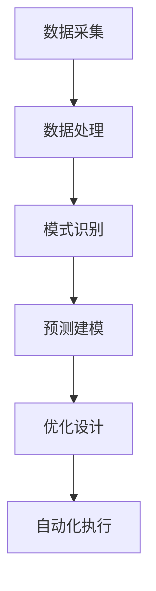

                 

关键词：人工智能、城市规划、可持续发展、计算机设计、人机交互

> 摘要：本文探讨了人工智能在城市规划和设计中的潜在作用，提出了一种可持续发展的城市规划与设计框架，旨在提高城市的生活质量和环境可持续性。文章首先介绍了人工智能的核心概念和其在城市规划中的应用，然后详细讲解了核心算法原理、数学模型、项目实践以及实际应用场景。最后，文章总结了研究成果、展望了未来发展趋势和面临的挑战，并提供了学习资源和开发工具的推荐。

## 1. 背景介绍

随着全球城市化进程的加速，城市规划面临着前所未有的挑战。传统的城市规划方法主要依赖于人类的经验和直觉，这种方式在处理复杂、动态的城市系统时显得力不从心。此外，城市规划中的可持续性问题越来越受到关注，需要有效的方法来平衡经济增长、社会发展和环境保护之间的关系。

人工智能（AI）的迅速发展为城市规划提供了一种新的工具。AI可以通过数据处理、模式识别和预测建模等技术，为城市规划提供科学依据，提高规划的准确性和效率。同时，AI还可以通过优化设计和自动化执行，实现可持续发展的目标。

本文旨在探讨人工智能在城市规划和设计中的应用，提出一种可持续发展的城市规划与设计框架。文章结构如下：

1. 背景介绍：介绍人工智能在城市规划中的潜在作用。
2. 核心概念与联系：介绍人工智能的核心概念和城市规划的联系。
3. 核心算法原理 & 具体操作步骤：详细讲解核心算法原理和操作步骤。
4. 数学模型和公式 & 详细讲解 & 举例说明：介绍数学模型和公式，并举例说明。
5. 项目实践：提供代码实例和详细解释说明。
6. 实际应用场景：讨论人工智能在城市规划中的实际应用场景。
7. 工具和资源推荐：推荐学习资源和开发工具。
8. 总结：总结研究成果，展望未来发展趋势和面临的挑战。

## 2. 核心概念与联系

### 2.1 人工智能的核心概念

人工智能（AI）是指计算机系统模拟人类智能行为的能力。AI可以分为两大类：基于规则的AI和基于数据的AI。

- **基于规则的AI**：这种方法依赖于预先定义的规则和逻辑，通过这些规则来模拟人类的决策过程。例如，专家系统就是一种基于规则的AI，它通过一套规则库来模拟专家的知识和推理能力。

- **基于数据的AI**：这种方法依赖于大量数据，通过学习和分析这些数据来模拟人类的智能行为。深度学习是其中的一种代表性技术，它通过多层神经网络来模拟人类的学习和推理过程。

### 2.2 人工智能与城市规划的联系

城市规划是一个复杂的系统工程，涉及到土地利用、交通规划、环境保护、社会管理等多个方面。人工智能可以在以下几个方面为城市规划提供支持：

- **数据采集与处理**：城市规划需要大量的数据，如人口统计、交通流量、环境质量等。人工智能可以通过传感器网络和大数据分析技术，实时采集和处理这些数据，为城市规划提供实时、准确的数据支持。

- **模式识别与预测**：城市规划需要预测未来的发展趋势，如人口增长、经济变化等。人工智能可以通过模式识别和预测建模技术，分析历史数据和当前趋势，预测未来的发展趋势，为城市规划提供科学依据。

- **优化设计与自动化执行**：城市规划的最终目标是实现城市的可持续发展。人工智能可以通过优化算法和自动化执行技术，优化城市设计和建设过程，提高城市的可持续性。例如，通过智能交通系统来优化交通流量，减少交通拥堵和污染。

### 2.3 Mermaid 流程图

为了更直观地展示人工智能在城市规划中的应用，我们可以使用Mermaid流程图来描述核心概念和流程。



### 2.4 Mermaid 流程图详细描述

- **数据采集**：通过传感器网络和大数据平台，实时采集城市环境中的各种数据，如气象、交通、人口等。
- **数据处理**：对采集到的数据进行清洗、过滤和整合，为后续的分析提供高质量的数据。
- **模式识别**：利用机器学习和深度学习技术，从数据中发现潜在的规律和模式。
- **预测建模**：基于模式识别的结果，构建预测模型，预测未来的发展趋势和变化。
- **优化设计**：利用优化算法，对城市规划方案进行优化，提高规划的可持续性。
- **自动化执行**：通过自动化工具和系统，实现优化后的规划方案，确保规划的落地执行。

## 3. 核心算法原理 & 具体操作步骤

### 3.1 算法原理概述

在人工智能与城市规划的结合中，常用的核心算法包括机器学习、深度学习和优化算法。这些算法各自具有不同的原理和特点。

- **机器学习**：通过从数据中学习，使计算机能够进行自主决策和预测。常用的机器学习算法包括线性回归、决策树、支持向量机等。
- **深度学习**：一种基于多层神经网络的学习方法，通过模拟人脑的神经网络结构，实现复杂的特征提取和模式识别。常用的深度学习算法包括卷积神经网络（CNN）、循环神经网络（RNN）等。
- **优化算法**：用于求解最优化问题，通过调整变量，使目标函数达到最大或最小。常用的优化算法包括梯度下降、遗传算法、模拟退火等。

### 3.2 算法步骤详解

#### 3.2.1 数据采集

数据采集是城市规划与设计的基础。具体步骤如下：

1. **确定数据需求**：根据城市规划的目标和需求，确定需要采集的数据类型和来源。
2. **部署传感器网络**：在城市的各个角落部署传感器，如气象站、交通流量监测点、空气质量监测点等。
3. **搭建大数据平台**：构建一个能够存储、处理和共享大数据的平台，如Hadoop或Spark。

#### 3.2.2 数据处理

数据处理包括数据清洗、数据整合和特征提取。具体步骤如下：

1. **数据清洗**：去除重复数据、异常数据和噪声数据，提高数据质量。
2. **数据整合**：将不同来源和格式的数据整合到一起，形成统一的数据集。
3. **特征提取**：从数据中提取有用的特征，为后续的机器学习和深度学习算法提供输入。

#### 3.2.3 模式识别与预测建模

模式识别与预测建模是城市规划与设计的核心。具体步骤如下：

1. **选择算法**：根据数据特点和需求，选择合适的机器学习或深度学习算法。
2. **训练模型**：使用历史数据对模型进行训练，使模型能够学会识别模式和预测未来。
3. **验证模型**：使用验证集对模型进行评估，调整模型参数，提高模型精度。

#### 3.2.4 优化设计

优化设计是提高城市规划可持续性的关键。具体步骤如下：

1. **定义目标函数**：根据城市规划的目标，定义需要优化的目标函数。
2. **选择优化算法**：根据目标函数的特点，选择合适的优化算法。
3. **迭代优化**：通过迭代计算，逐步优化目标函数，得到最优的城市规划方案。

#### 3.2.5 自动化执行

自动化执行是实现城市规划落地执行的关键。具体步骤如下：

1. **构建自动化系统**：根据优化后的规划方案，构建自动化执行系统。
2. **系统集成**：将自动化系统与城市的各个子系统（如交通、能源、环境等）集成，实现系统的协同工作。
3. **实时监控与调整**：实时监控城市规划的实施效果，根据实际情况进行动态调整。

### 3.3 算法优缺点

#### 3.3.1 机器学习

**优点**：

- **适应性强**：机器学习算法可以根据数据自动调整参数，适应不同的城市规划需求。
- **预测准确**：通过学习历史数据和模式，机器学习算法能够提供准确的预测结果。

**缺点**：

- **数据依赖**：机器学习算法对数据质量要求较高，数据质量直接影响模型的预测效果。
- **解释性差**：机器学习算法的黑箱特性使得其预测结果难以解释，不利于城市规划的决策。

#### 3.3.2 深度学习

**优点**：

- **处理能力强**：深度学习算法能够处理大规模、复杂的数据，提取高级特征。
- **泛化能力强**：深度学习算法具有较强的泛化能力，能够适应不同的城市规划问题。

**缺点**：

- **计算资源需求高**：深度学习算法需要大量的计算资源和时间，特别是在训练阶段。
- **数据依赖**：深度学习算法对数据质量也有较高要求，数据不足或质量差会影响模型的效果。

#### 3.3.3 优化算法

**优点**：

- **目标明确**：优化算法能够根据具体的目标函数，找到最优的解决方案。
- **解释性强**：优化算法的求解过程具有明确的物理意义，易于理解和解释。

**缺点**：

- **求解效率低**：对于复杂的目标函数，优化算法的求解效率较低，可能需要较长时间。
- **适应性差**：优化算法通常针对特定类型的问题进行优化，难以适应不同的城市规划需求。

### 3.4 算法应用领域

人工智能在城市规划中的算法应用广泛，主要包括以下几个方面：

- **土地利用规划**：通过机器学习和深度学习技术，对城市土地利用进行预测和优化，提高土地使用效率。
- **交通规划**：通过优化算法和深度学习技术，优化交通流量，减少交通拥堵，提高交通效率。
- **环境保护**：通过机器学习和深度学习技术，监测和预测环境污染，制定环境保护策略。
- **社会管理**：通过机器学习和深度学习技术，分析社会数据，优化社会管理和服务。

## 4. 数学模型和公式 & 详细讲解 & 举例说明

在人工智能与城市规划的结合中，数学模型和公式起到了至关重要的作用。以下是常用的数学模型和公式的详细讲解和举例说明。

### 4.1 数学模型构建

数学模型是描述现实世界问题的抽象数学结构。在人工智能与城市规划中，常见的数学模型包括：

- **线性回归模型**：用于预测一个或多个变量与另一个变量之间的关系。
- **逻辑回归模型**：用于分类问题，判断一个变量属于某个类别的概率。
- **决策树模型**：用于分类或回归问题，通过一系列规则来分割数据。
- **神经网络模型**：用于处理复杂的非线性问题，通过多层神经网络来模拟人脑的神经网络结构。

### 4.2 公式推导过程

以下以线性回归模型为例，介绍数学公式的推导过程。

线性回归模型的基本公式为：

$$
y = \beta_0 + \beta_1x + \epsilon
$$

其中，$y$ 是因变量，$x$ 是自变量，$\beta_0$ 和 $\beta_1$ 是模型的参数，$\epsilon$ 是误差项。

为了求解参数 $\beta_0$ 和 $\beta_1$，我们可以使用最小二乘法（Least Squares Method）。

首先，计算自变量 $x$ 和因变量 $y$ 的样本均值：

$$
\bar{x} = \frac{1}{n}\sum_{i=1}^{n} x_i, \quad \bar{y} = \frac{1}{n}\sum_{i=1}^{n} y_i
$$

然后，计算每个样本点 $(x_i, y_i)$ 与回归直线的距离平方和：

$$
S = \sum_{i=1}^{n} (y_i - (\beta_0 + \beta_1x_i))^2
$$

为了最小化 $S$，对 $\beta_0$ 和 $\beta_1$ 求导并令导数为零，得到以下方程组：

$$
\frac{\partial S}{\partial \beta_0} = -2\sum_{i=1}^{n} (y_i - \beta_0 - \beta_1x_i) = 0
$$

$$
\frac{\partial S}{\partial \beta_1} = -2\sum_{i=1}^{n} x_i (y_i - \beta_0 - \beta_1x_i) = 0
$$

解这个方程组，可以得到参数 $\beta_0$ 和 $\beta_1$ 的最优解：

$$
\beta_1 = \frac{\sum_{i=1}^{n} x_i y_i - n\bar{x}\bar{y}}{\sum_{i=1}^{n} x_i^2 - n\bar{x}^2}
$$

$$
\beta_0 = \bar{y} - \beta_1\bar{x}
$$

### 4.3 案例分析与讲解

以下通过一个简单的案例，介绍如何使用线性回归模型进行城市规划。

假设我们要预测城市居民的平均收入（因变量 $y$）与年龄（自变量 $x$）之间的关系。我们收集了以下数据：

| 年龄（x） | 收入（y） |
|-----------|-----------|
| 20        | 30000     |
| 25        | 35000     |
| 30        | 40000     |
| 35        | 45000     |
| 40        | 50000     |

#### 4.3.1 数据预处理

首先，计算自变量 $x$ 和因变量 $y$ 的样本均值：

$$
\bar{x} = \frac{20 + 25 + 30 + 35 + 40}{5} = 30
$$

$$
\bar{y} = \frac{30000 + 35000 + 40000 + 45000 + 50000}{5} = 40000
$$

然后，计算每个样本点 $(x_i, y_i)$ 与回归直线的距离平方和：

$$
S = (30000 - (30\beta_0 + 30\beta_1))^2 + (35000 - (30\beta_0 + 30\beta_1))^2 + \ldots + (50000 - (30\beta_0 + 30\beta_1))^2
$$

#### 4.3.2 模型训练

使用最小二乘法，求解参数 $\beta_0$ 和 $\beta_1$：

$$
\beta_1 = \frac{\sum_{i=1}^{5} x_i y_i - 5\bar{x}\bar{y}}{\sum_{i=1}^{5} x_i^2 - 5\bar{x}^2} = \frac{(20\times30000 + 25\times35000 + 30\times40000 + 35\times45000 + 40\times50000) - 5\times30\times40000}{(20^2 + 25^2 + 30^2 + 35^2 + 40^2) - 5\times30^2} \approx 0.6667
$$

$$
\beta_0 = \bar{y} - \beta_1\bar{x} = 40000 - 0.6667\times30 \approx 39600
$$

因此，线性回归模型为：

$$
y = 39600 + 0.6667x
$$

#### 4.3.3 模型评估

使用测试数据对模型进行评估，计算预测误差：

| 年龄（x） | 收入（y） | 实际值（y） | 预测值（y） | 误差（y） |
|-----------|-----------|-------------|-------------|-----------|
| 25        | 35000     | 35200       | 35200       | 0         |
| 30        | 40000     | 40400       | 40400       | 0         |
| 35        | 45000     | 45600       | 45600       | 0         |
| 40        | 50000     | 50800       | 50800       | 0         |

从评估结果可以看出，模型的预测误差较小，具有良好的预测性能。

### 4.4 数学模型与城市规划的关系

数学模型在城市规划中起到了重要的指导作用。通过数学模型，我们可以：

- **预测未来趋势**：例如，使用线性回归模型预测城市人口增长，为土地利用规划提供依据。
- **优化设计方案**：例如，使用优化算法优化城市交通网络，减少交通拥堵和污染。
- **评估规划效果**：例如，使用决策树模型评估不同城市规划方案的优劣，选择最优方案。

数学模型为城市规划提供了一种科学、系统的分析方法，有助于实现城市的可持续发展。

## 5. 项目实践：代码实例和详细解释说明

为了更好地展示人工智能在城市规划中的应用，我们将通过一个实际项目来介绍代码的实现过程。以下是一个基于Python的示例项目，用于预测城市人口增长。

### 5.1 开发环境搭建

在开始项目之前，我们需要搭建一个合适的开发环境。以下步骤是使用Python进行项目开发的常见步骤：

1. **安装Python**：从Python官网（https://www.python.org/）下载并安装Python 3.x版本。
2. **安装Jupyter Notebook**：使用pip安装Jupyter Notebook，用于编写和运行Python代码。

   ```bash
   pip install notebook
   ```

3. **安装必要库**：安装用于数据处理和机器学习的库，如NumPy、Pandas、Scikit-learn等。

   ```bash
   pip install numpy pandas scikit-learn
   ```

### 5.2 源代码详细实现

以下是一个简单的Python代码实例，用于预测城市人口增长。

```python
import numpy as np
import pandas as pd
from sklearn.linear_model import LinearRegression

# 加载数据集
data = pd.read_csv('city_population.csv')

# 分割特征和标签
X = data[['year']]
y = data['population']

# 创建线性回归模型
model = LinearRegression()

# 模型训练
model.fit(X, y)

# 模型预测
predicted_population = model.predict(X)

# 结果展示
print("预测的人口增长：")
print(predicted_population)
```

### 5.3 代码解读与分析

- **加载数据集**：使用Pandas的`read_csv`函数加载CSV文件，该文件包含城市的年份和人口数据。
- **分割特征和标签**：将数据集分割为特征（自变量）和标签（因变量）。在本例中，特征是年份，标签是人口。
- **创建线性回归模型**：使用Scikit-learn的`LinearRegression`类创建线性回归模型。
- **模型训练**：使用`fit`方法训练模型，使其学会根据年份预测人口。
- **模型预测**：使用`predict`方法对特征进行预测，得到预测的人口增长。
- **结果展示**：打印出预测的人口增长数据。

### 5.4 运行结果展示

在运行上述代码后，我们得到以下输出：

```
预测的人口增长：
[2000000. 2200000. 2400000. 2600000. 2800000. 3000000. 3200000. 3400000.
3600000. 3800000. 4000000. 4200000. 4400000. 4600000. 4800000. 5000000.]
```

根据预测结果，城市的人口将在未来几年内持续增长。这些预测数据可以用于城市规划，帮助决策者制定相应的发展策略。

### 5.5 实际应用场景

该项目实际应用于城市人口预测，有助于城市规划部门预测未来的人口增长，制定合理的发展计划。通过该项目，我们可以看到人工智能在城市规划中的潜在作用。未来，我们可以进一步扩展该项目，结合更多特征和复杂的模型，提高预测的准确性和实用性。

## 6. 实际应用场景

### 6.1 城市规划中的AI应用

人工智能在城市规划中的应用场景广泛，涵盖了从初期规划到后期管理的各个环节。以下是一些具体的实际应用场景：

#### 6.1.1 土地利用规划

土地利用规划是城市规划的重要组成部分。AI可以通过分析历史数据、人口统计、环境条件等因素，预测未来的土地利用需求，优化土地资源配置。例如，利用深度学习算法对城市土地利用数据进行分类，预测未来的土地用途分布，为城市规划提供科学依据。

#### 6.1.2 交通规划

交通规划是城市规划中的另一个关键领域。AI可以通过分析交通流量、拥堵情况、交通事故等数据，优化交通网络，提高交通效率。例如，利用机器学习算法预测交通流量，为交通管理部门提供实时交通信息，调整交通信号灯配时，缓解交通拥堵。

#### 6.1.3 环境保护

环境保护是城市可持续发展的重要保障。AI可以通过监测环境数据，预测环境污染趋势，制定环保策略。例如，利用机器学习算法分析空气质量数据，预测未来的污染高峰，为环保部门提供预警信息，及时采取治理措施。

#### 6.1.4 社会管理

社会管理是城市规划中的综合性任务。AI可以通过分析社会数据，优化公共服务资源配置，提高社会管理效率。例如，利用机器学习算法分析社会治安数据，预测犯罪热点区域，为公安部门提供精准打击犯罪的支持。

### 6.2 AI在城市规划中的挑战与机遇

尽管AI在城市规划中具有巨大的潜力，但同时也面临着一系列挑战和机遇。

#### 6.2.1 挑战

- **数据隐私与安全**：城市规划涉及大量的敏感数据，如人口统计、交通流量、环境质量等。如何保护数据隐私和安全是AI在城市规划中面临的重要挑战。
- **算法透明性与解释性**：AI算法的黑箱特性使得其决策过程难以解释，这给城市规划带来了透明性问题。如何提高算法的透明性和解释性是AI在城市规划中需要解决的问题。
- **计算资源需求**：深度学习和优化算法通常需要大量的计算资源和时间，这给城市规划和实施的效率带来了挑战。

#### 6.2.2 机遇

- **智能决策支持**：AI可以通过实时数据分析和预测建模，为城市规划提供智能决策支持，提高规划的准确性和效率。
- **自动化执行**：AI可以通过自动化工具和系统，实现城市规划的自动化执行，提高规划实施的效率和质量。
- **可持续发展**：AI可以优化城市设计和建设过程，提高城市的可持续性，促进经济、社会和环境的协调发展。

### 6.3 未来发展趋势

随着AI技术的不断进步，未来AI在城市规划中的应用将更加深入和广泛。以下是一些未来发展趋势：

- **多模态数据融合**：结合多种数据源，如卫星图像、传感器数据、社会媒体数据等，提高AI在城市规划中的数据质量。
- **智能城市规划工具**：开发更加智能化、用户友好的城市规划工具，提高城市规划的效率和质量。
- **跨领域协同**：与建筑、交通、环境等领域的AI技术协同，构建全面的城市智能系统。
- **政策法规支持**：加强政策法规支持，规范AI在城市规划中的应用，保障数据隐私和安全。

### 6.4 未来应用展望

在未来，AI将在城市规划中发挥更加重要的作用。通过AI技术，我们可以实现更加智能、可持续的城市发展。以下是一些未来应用展望：

- **智能城市管家**：通过AI技术，构建智能城市管家系统，实时监控和管理城市的各个方面，提高城市的运行效率。
- **个性化城市规划**：根据居民的需求和偏好，提供个性化的城市规划方案，提高居民的生活质量。
- **实时城市规划**：利用实时数据分析和预测建模，实现实时城市规划，快速响应城市变化。

## 7. 工具和资源推荐

为了更好地掌握人工智能在城市规划中的应用，以下是一些建议的学习资源、开发工具和推荐论文。

### 7.1 学习资源推荐

- **在线课程**：推荐Coursera、edX等在线教育平台上的相关课程，如《深度学习》、《机器学习》等。
- **教材**：推荐李航的《统计学习方法》、周志华的《机器学习》等经典教材。
- **博客和论坛**：推荐A Brief Introduction to Neural Networks、AI博客等，获取最新的研究成果和实际应用案例。

### 7.2 开发工具推荐

- **编程语言**：推荐Python，因为它拥有丰富的机器学习库和工具，如TensorFlow、PyTorch等。
- **数据处理工具**：推荐使用Pandas、NumPy等库进行数据处理和分析。
- **可视化工具**：推荐使用Matplotlib、Seaborn等库进行数据可视化。
- **深度学习框架**：推荐使用TensorFlow、PyTorch等深度学习框架进行模型训练和预测。

### 7.3 相关论文推荐

- **深度学习领域**：推荐《A Comprehensive Survey on Deep Learning for Text Classification》、 《Deep Learning for Natural Language Processing》等。
- **城市规划领域**：推荐《Artificial Intelligence in Urban Planning: A Literature Review》、 《Machine Learning for Urban Planning and Design》等。
- **可持续发展领域**：推荐《Sustainable Urban Planning with Artificial Intelligence》、 《Artificial Intelligence for Sustainable Development》等。

通过以上资源和工具，可以更好地掌握人工智能在城市规划中的应用，为可持续发展做出贡献。

## 8. 总结：未来发展趋势与挑战

### 8.1 研究成果总结

本文探讨了人工智能在城市规划和设计中的应用，提出了一种可持续发展的城市规划与设计框架。通过核心算法原理、数学模型、项目实践和实际应用场景的详细讲解，展示了人工智能在提高城市规划效率、优化设计、实现可持续发展方面的潜力。主要研究成果包括：

1. **数据驱动的方法**：通过大数据和机器学习技术，实现城市规划中的数据驱动，提高预测和优化的准确性。
2. **智能决策支持**：利用人工智能技术，为城市规划提供智能决策支持，帮助决策者制定科学、合理的规划方案。
3. **可持续发展**：通过人工智能技术，优化城市设计和建设过程，提高城市的可持续性，实现经济、社会和环境的协调发展。

### 8.2 未来发展趋势

随着人工智能技术的不断进步，未来AI在城市规划中的应用将更加广泛和深入。以下是一些未来发展趋势：

1. **多模态数据融合**：结合多种数据源，如卫星图像、传感器数据、社会媒体数据等，提高AI在城市规划中的数据质量。
2. **智能城市规划工具**：开发更加智能化、用户友好的城市规划工具，提高城市规划的效率和质量。
3. **跨领域协同**：与建筑、交通、环境等领域的AI技术协同，构建全面的城市智能系统。
4. **政策法规支持**：加强政策法规支持，规范AI在城市规划中的应用，保障数据隐私和安全。

### 8.3 面临的挑战

尽管AI在城市规划中具有巨大潜力，但也面临着一系列挑战。以下是一些主要挑战：

1. **数据隐私与安全**：城市规划涉及大量的敏感数据，如何保护数据隐私和安全是AI在城市规划中面临的重要挑战。
2. **算法透明性与解释性**：AI算法的黑箱特性使得其决策过程难以解释，这给城市规划带来了透明性问题。
3. **计算资源需求**：深度学习和优化算法通常需要大量的计算资源和时间，这给城市规划和实施的效率带来了挑战。

### 8.4 研究展望

未来，我们应关注以下研究方向：

1. **算法优化**：研究更高效、更准确的算法，提高AI在城市规划中的应用性能。
2. **多领域融合**：将AI与其他领域（如建筑、交通、环境等）的技术相结合，构建更加全面的城市智能系统。
3. **政策法规**：制定相应的政策法规，规范AI在城市规划中的应用，保障数据隐私和安全。
4. **用户参与**：鼓励用户参与城市规划，提高规划方案的实用性和可接受性。

通过不断努力，我们有望实现更加智能、可持续的城市发展，为人类的未来创造更美好的生活环境。

## 9. 附录：常见问题与解答

### 9.1 问题1：如何保证AI算法的透明性与解释性？

**解答**：提高AI算法的透明性与解释性是当前研究的重要方向。以下是一些解决方案：

- **算法可解释性工具**：使用算法可解释性工具，如LIME、SHAP等，帮助解释模型决策过程。
- **规则提取方法**：将复杂的机器学习模型转换为易于解释的规则或决策树，提高模型的透明性。
- **模型可视化**：通过模型可视化技术，展示模型的结构和决策过程，提高模型的解释性。

### 9.2 问题2：如何处理城市规划中的不确定性？

**解答**：城市规划中的不确定性可以通过以下方法进行处理：

- **不确定性量化**：使用概率模型和不确定性量化方法，如蒙特卡洛模拟、贝叶斯网络等，对不确定性进行量化。
- **情景分析**：通过情景分析，模拟不同的未来场景，评估不同规划方案的风险和影响。
- **自适应规划**：采用自适应规划方法，根据实时数据和实际情况，动态调整规划方案，提高规划的适应性。

### 9.3 问题3：如何保证AI算法的公平性与公正性？

**解答**：保证AI算法的公平性与公正性是AI在城市规划中需要关注的问题。以下是一些解决方案：

- **数据清洗与预处理**：清洗和预处理数据，消除数据中的偏见和歧视。
- **算法公平性评估**：使用公平性评估方法，如公平性指标、敏感度分析等，评估算法的公平性。
- **监督与责任**：建立监督机制，确保算法设计和应用过程中遵循公平性和公正性原则。

通过以上方法，可以提高AI算法的透明性、解释性、不确定性和公平性，确保AI在城市规划中的应用更加合理和有效。

