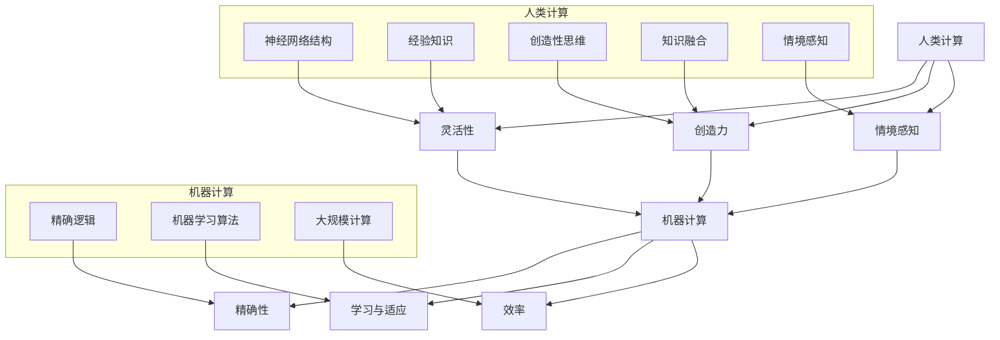

                 

### 1. 背景介绍

在当今这个信息爆炸的时代，人工智能（AI）已成为驱动技术创新和社会进步的关键力量。AI通过模仿人类的认知能力，实现了从简单的自动化到复杂决策的跨越，极大地提高了人类工作效率。然而，尽管AI的进步令人瞩目，人类计算与机器计算之间的差异依然显著。

人类计算具有灵活性、创造力、情感理解等特质，这些都是目前AI难以完全复制的能力。例如，在艺术创作、道德判断、情感互动等领域，人类计算仍然占据主导地位。与此同时，机器计算在处理海量数据、执行重复性任务、优化资源分配等方面展现出了前所未有的效率。

本文旨在探讨AI与人类计算之间的关系，通过逐步分析推理的方式，深入探讨如何实现两者的有机结合，共同构建一个可持续发展的未来。本文将分为以下几个部分：

1. **核心概念与联系**：介绍AI与人类计算的核心概念，并展示它们之间的关联性。
2. **核心算法原理与具体操作步骤**：详细阐述AI的基础算法原理，以及如何应用于实际场景。
3. **数学模型和公式**：介绍AI中的关键数学模型和公式，并举例说明。
4. **项目实践**：通过一个具体的代码实例，展示如何将AI算法应用于实际项目中。
5. **实际应用场景**：分析AI与人类计算在不同领域的应用，探讨其带来的影响。
6. **工具和资源推荐**：推荐学习资源、开发工具和框架，以帮助读者深入了解相关内容。
7. **总结**：总结文章要点，讨论未来发展趋势与挑战。

通过以上章节的逐步分析，我们将揭示AI与人类计算如何相互补充，共同推动社会进步。在接下来的部分中，我们将详细探讨这些核心概念和联系，以便更好地理解这一主题。

#### 1.1 人工智能的发展历程

人工智能（AI）的发展历程可以追溯到20世纪50年代。当时，计算机科学家们首次提出了“机器能够模仿人类智能”的概念，并开始了一系列的研究探索。早期的AI研究主要集中在符号主义和规则系统上，试图通过编写大量的规则来模拟人类的推理和决策过程。然而，这些早期的尝试由于规则过于复杂、数据依赖性强而未能取得显著进展。

20世纪80年代，随着计算能力的提升和大数据的出现，AI研究迎来了新的转折点。这个时期，机器学习（Machine Learning）和深度学习（Deep Learning）开始崭露头角，成为AI发展的新动力。机器学习通过训练模型来识别数据中的模式，从而实现自动化的决策和预测。深度学习则利用多层神经网络，通过大量数据的学习，逐步提升模型的能力。

21世纪初，随着云计算和大数据技术的普及，AI进入了一个新的爆发期。AI不再局限于实验室，开始广泛应用于金融、医疗、交通、娱乐等多个领域。特别是在深度学习领域，通过不断优化算法和提升计算能力，AI已经能够实现图像识别、语音识别、自然语言处理等复杂任务，显著提升了人类的工作效率和生活质量。

尽管AI取得了巨大的进步，但人类计算与机器计算之间的差距依然存在。人类计算具有灵活性、创造力、情感理解等特质，这些都是目前AI难以完全复制的能力。例如，在艺术创作、道德判断、情感互动等领域，人类计算仍然占据主导地位。与此同时，机器计算在处理海量数据、执行重复性任务、优化资源分配等方面展现出了前所未有的效率。

因此，如何实现人类计算与机器计算的有机结合，共同构建一个可持续发展的未来，成为一个值得深入探讨的课题。接下来，我们将详细探讨AI与人类计算的核心概念，并展示它们之间的关联性。

#### 1.2 人类计算与机器计算的核心概念

为了深入探讨人类计算与机器计算的关系，我们需要首先明确它们的核心概念。

**人类计算**：
1. **灵活性**：人类计算具有高度的灵活性，能够应对复杂多变的环境和情境。人类能够灵活调整策略，解决新的问题，这种能力源于人类大脑的复杂神经网络结构和丰富的经验知识。
2. **创造力**：人类计算具备创造力，能够产生新颖的想法和解决方案。这种能力源于人类大脑的创造性思维，以及对不同领域知识的广泛融合。
3. **情感理解**：人类计算能够理解情感，进行情感互动。这种能力源于人类大脑的情感中心，以及对情感的感知和处理能力。
4. **情境感知**：人类计算能够根据具体的情境做出决策，这种能力源于人类对情境的感知和解释能力。

**机器计算**：
1. **效率**：机器计算在处理大量数据、执行重复性任务方面具有极高的效率。机器可以快速地进行大规模计算，处理海量的数据，从而优化资源分配和提高工作效率。
2. **精确性**：机器计算具有高度的精确性，可以精确地执行预定义的任务。这种能力源于机器的精确逻辑和算法优化。
3. **可靠性**：机器计算具有较高的可靠性，可以持续稳定地运行，不会受到情绪波动的影响。这种能力源于机器的稳定结构和严格的逻辑控制。
4. **学习与适应**：机器计算可以通过机器学习算法不断学习和适应新的环境。尽管机器的学习能力相对有限，但通过大量数据和持续优化，机器的计算能力也在不断提高。

**人类计算与机器计算的联系**：
1. **互补性**：人类计算与机器计算具有互补性，二者各有所长。人类计算擅长处理复杂、灵活、情感性的任务，而机器计算擅长处理大量、重复、精确的任务。通过二者的结合，可以最大程度地发挥各自的优势。
2. **协同性**：人类计算与机器计算可以相互协同，共同完成任务。人类可以利用机器计算的结果进行进一步的推理和决策，而机器可以借助人类的反馈不断优化和改进自身的算法。
3. **依赖性**：在许多情况下，人类计算与机器计算是相互依赖的。人类计算需要机器计算提供数据分析和决策支持，而机器计算也需要人类计算进行监督和调整，以适应不断变化的环境。

通过以上对人类计算与机器计算核心概念的分析，我们可以看到二者之间的紧密联系和互补性。在接下来的部分中，我们将进一步探讨如何实现人类计算与机器计算的有机结合，共同推动社会进步。

### 2. 核心概念与联系

在了解了人类计算与机器计算的核心概念后，接下来我们将进一步探讨这些概念之间的联系，并使用Mermaid流程图展示它们的关系。

**2.1 人类计算与机器计算的关联性**

首先，我们需要明确人类计算与机器计算之间的关联性。从广义上讲，机器计算是模仿人类计算的一种方式，但二者在本质和实现方式上存在显著差异。

1. **人类计算的灵活性**与**机器计算的精确性**：人类计算具有高度的灵活性，能够应对复杂多变的环境和情境。这种灵活性源于人类大脑的复杂神经网络结构和丰富的经验知识。相比之下，机器计算在处理特定任务时具有高度的精确性，可以精确地执行预定义的任务。这种精确性源于机器的精确逻辑和算法优化。

2. **人类计算的创造力**与**机器计算的学习与适应能力**：人类计算具备创造力，能够产生新颖的想法和解决方案。这种创造力源于人类大脑的创造性思维，以及对不同领域知识的广泛融合。而机器计算则可以通过机器学习算法不断学习和适应新的环境。尽管机器的学习能力相对有限，但通过大量数据和持续优化，机器的计算能力也在不断提高。

3. **人类计算的情境感知**与**机器计算的效率**：人类计算能够根据具体的情境做出决策，这种能力源于人类对情境的感知和解释能力。相比之下，机器计算在处理大量数据、执行重复性任务方面具有极高的效率。机器可以快速地进行大规模计算，处理海量的数据，从而优化资源分配和提高工作效率。

**2.2 Mermaid流程图展示**

为了更直观地展示人类计算与机器计算之间的关联性，我们使用Mermaid流程图来表示这些关系。



**2.3 关联性分析**

通过Mermaid流程图，我们可以看到人类计算与机器计算之间的紧密联系：

1. **灵活性**与**精确性**：虽然人类计算和机器计算在灵活性和精确性上存在差异，但二者可以相互补充。人类计算可以利用机器计算的精确性来优化决策过程，而机器计算则可以通过人类计算的灵活性来扩展其应用范围。

2. **创造力**与**学习与适应能力**：人类计算和机器计算在创造力和学习与适应能力上也有互补性。人类计算可以提供新颖的想法和解决方案，而机器计算则可以通过不断学习和优化来提高其性能。

3. **情境感知**与**效率**：人类计算在情境感知方面具有优势，而机器计算在效率方面具有优势。通过结合这两种能力，可以更好地应对复杂多变的现实场景，提高整体的计算效率。

综上所述，人类计算与机器计算之间存在着紧密的关联性和互补性。通过理解这些关联性，我们可以更好地实现二者的有机结合，共同推动社会进步。

### 3. 核心算法原理与具体操作步骤

在深入了解人类计算与机器计算的核心概念及其关联性之后，接下来我们将探讨AI的核心算法原理，并详细阐述这些算法的具体操作步骤。这些算法是实现AI功能的关键，通过它们，我们可以将机器计算与人类计算的优势相结合，实现更加智能化的应用。

**3.1 机器学习算法**

机器学习（Machine Learning，ML）是AI的核心组成部分，其基本原理是通过从数据中学习规律，使计算机能够自动地进行预测和决策。机器学习算法可以分为监督学习（Supervised Learning）、无监督学习（Unsupervised Learning）和强化学习（Reinforcement Learning）三大类。

**3.1.1 监督学习**

监督学习是最常见的机器学习算法，它通过使用标记数据进行训练，使得模型能够在新的、未标记的数据上进行预测。

- **具体操作步骤**：

  1. **数据预处理**：首先，对原始数据进行清洗和预处理，包括数据缺失填充、数据标准化、异常值处理等步骤。

  2. **特征提取**：根据问题的需求，选择合适的特征，将原始数据转化为模型可以处理的特征向量。

  3. **模型选择**：根据问题的特点选择合适的模型，常见的监督学习模型包括线性回归、决策树、支持向量机（SVM）和神经网络等。

  4. **训练模型**：使用标记数据对模型进行训练，通过调整模型参数，使模型能够在训练数据上取得较高的准确率。

  5. **模型评估**：使用测试数据评估模型性能，通过交叉验证等方法评估模型的泛化能力。

  6. **模型部署**：将训练好的模型部署到实际应用中，对新的数据进行预测。

**3.1.2 无监督学习**

无监督学习主要用于发现数据中的隐含结构和模式，不需要使用标记数据。

- **具体操作步骤**：

  1. **数据预处理**：与监督学习类似，对原始数据进行清洗和预处理。

  2. **特征提取**：根据问题的需求，选择合适的特征，将原始数据转化为特征向量。

  3. **模型选择**：选择合适的无监督学习模型，如聚类算法（K-Means、层次聚类等）和降维算法（PCA、t-SNE等）。

  4. **模型训练**：使用无监督学习方法对数据进行分析，发现数据中的隐含结构和模式。

  5. **模型评估**：通过可视化方法或聚类评估指标（如轮廓系数、类内距离等）评估模型效果。

  6. **模型应用**：将分析结果应用到实际问题中，如推荐系统、图像识别等。

**3.1.3 强化学习**

强化学习是一种通过试错学习来优化行为策略的算法，它通过奖励机制来指导模型进行决策。

- **具体操作步骤**：

  1. **环境定义**：定义问题的环境，包括状态空间、动作空间和奖励机制。

  2. **策略选择**：选择一个策略函数，用于决定在特定状态下应该采取哪个动作。

  3. **模型训练**：通过与环境交互，不断调整策略函数，使模型能够最大化累积奖励。

  4. **模型评估**：评估策略函数的稳定性和有效性，通过计算平均奖励或策略值函数。

  5. **模型部署**：将训练好的策略函数应用到实际问题中，如游戏、机器人控制等。

**3.2 深度学习算法**

深度学习（Deep Learning，DL）是机器学习的一种重要分支，通过构建多层神经网络，实现复杂特征提取和决策。

- **具体操作步骤**：

  1. **数据预处理**：与机器学习类似，对原始数据进行清洗和预处理。

  2. **网络架构设计**：设计合适的神经网络架构，包括输入层、隐藏层和输出层。

  3. **模型训练**：使用大量数据进行模型训练，通过反向传播算法优化网络参数。

  4. **模型评估**：使用验证集和测试集评估模型性能，通过交叉验证等方法评估泛化能力。

  5. **模型部署**：将训练好的模型部署到实际应用中，对新的数据进行预测。

**3.2.1 卷积神经网络（CNN）**

卷积神经网络是一种专门用于图像识别和处理的神经网络，其核心思想是通过卷积操作提取图像特征。

- **具体操作步骤**：

  1. **输入层**：接受图像数据作为输入。

  2. **卷积层**：通过卷积操作提取图像特征，形成特征图。

  3. **激活函数层**：使用激活函数（如ReLU）增加模型非线性。

  4. **池化层**：通过池化操作（如最大池化）降低特征图维度。

  5. **全连接层**：将特征图展平，输入到全连接层进行分类。

  6. **输出层**：输出分类结果。

**3.2.2 递归神经网络（RNN）**

递归神经网络是一种用于处理序列数据的神经网络，其核心思想是通过递归结构保持历史信息。

- **具体操作步骤**：

  1. **输入层**：接受序列数据作为输入。

  2. **隐藏层**：通过递归操作更新隐藏状态，保留历史信息。

  3. **激活函数层**：使用激活函数（如ReLU）增加模型非线性。

  4. **输出层**：输出序列的预测结果。

通过以上对机器学习算法和深度学习算法的详细阐述，我们可以看到这些算法在实现AI功能中的关键作用。在接下来的部分中，我们将介绍AI中的关键数学模型和公式，以便更好地理解这些算法的工作原理。

### 4. 数学模型和公式

在讨论AI的核心算法原理后，我们将进一步探讨AI中常用的数学模型和公式。这些模型和公式是理解AI算法工作原理的关键，也是实现高效计算的基础。以下将详细介绍一些关键的数学模型和公式，并对其进行详细讲解。

#### 4.1 线性回归模型

线性回归模型是机器学习中一种基础且广泛应用的模型，主要用于预测连续值。其基本公式如下：

\[ y = \beta_0 + \beta_1 \cdot x + \varepsilon \]

其中，\( y \) 是预测值，\( x \) 是特征值，\( \beta_0 \) 是截距，\( \beta_1 \) 是斜率，\( \varepsilon \) 是误差项。

**详细讲解**：

- **目标函数**：线性回归的目标是最小化预测值与实际值之间的误差平方和，即最小化损失函数：

  \[ J(\beta_0, \beta_1) = \sum_{i=1}^{n} (y_i - (\beta_0 + \beta_1 \cdot x_i))^2 \]

- **梯度下降法**：为了求解最优的 \( \beta_0 \) 和 \( \beta_1 \)，我们使用梯度下降法。梯度下降法的迭代公式如下：

  \[ \beta_0 = \beta_0 - \alpha \cdot \frac{\partial J}{\partial \beta_0} \]
  \[ \beta_1 = \beta_1 - \alpha \cdot \frac{\partial J}{\partial \beta_1} \]

  其中，\( \alpha \) 是学习率。

#### 4.2 逻辑回归模型

逻辑回归是一种用于分类问题的模型，其目标是将输入映射到一个概率值，从而判断样本属于哪个类别。其基本公式如下：

\[ \hat{y} = \frac{1}{1 + e^{-(\beta_0 + \beta_1 \cdot x)}} \]

其中，\( \hat{y} \) 是预测的概率值，\( \beta_0 \) 是截距，\( \beta_1 \) 是斜率。

**详细讲解**：

- **目标函数**：逻辑回归的目标是最小化损失函数，即交叉熵损失函数：

  \[ J(\beta_0, \beta_1) = -\sum_{i=1}^{n} [y_i \cdot \ln(\hat{y}_i) + (1 - y_i) \cdot \ln(1 - \hat{y}_i)] \]

- **梯度下降法**：同样使用梯度下降法进行迭代求解，梯度公式如下：

  \[ \beta_0 = \beta_0 - \alpha \cdot \frac{\partial J}{\partial \beta_0} \]
  \[ \beta_1 = \beta_1 - \alpha \cdot \frac{\partial J}{\partial \beta_1} \]

#### 4.3 卷积神经网络（CNN）模型

卷积神经网络是一种用于图像识别和处理的深度学习模型，其核心思想是通过卷积操作提取图像特征。

- **卷积操作**：

  \[ \text{conv}(x, W, b) = \sum_{i=1}^{C} W_{i} \cdot \text{relu}(\sum_{j=1}^{H \cdot W} x_{ij} \cdot k_{ij}) + b \]

  其中，\( x \) 是输入特征图，\( W \) 是卷积核，\( b \) 是偏置项，\( C \) 是输出特征图的维度，\( H \cdot W \) 是卷积核的大小。

- **池化操作**：

  \[ \text{pool}(x, P) = \max_{i=1}^{P} x_{ij} \]

  其中，\( P \) 是池化窗口的大小。

**详细讲解**：

- **卷积操作**：卷积操作通过卷积核在输入特征图上滑动，提取局部特征，并将其叠加和激活，从而形成新的特征图。
- **池化操作**：池化操作通过取局部特征的最大值，降低特征图的维度，减少参数数量，提高模型计算效率。

#### 4.4 递归神经网络（RNN）模型

递归神经网络是一种用于处理序列数据的深度学习模型，其核心思想是通过递归结构保留历史信息。

- **递归操作**：

  \[ h_t = \text{relu}(W_h \cdot [h_{t-1}, x_t] + b_h) \]
  \[ o_t = \text{softmax}(W_o \cdot h_t + b_o) \]

  其中，\( h_t \) 是第 \( t \) 个时间步的隐藏状态，\( x_t \) 是第 \( t \) 个时间步的输入，\( W_h \) 和 \( W_o \) 是权重矩阵，\( b_h \) 和 \( b_o \) 是偏置项。

**详细讲解**：

- **递归操作**：递归操作通过将前一个时间步的隐藏状态和当前时间步的输入进行拼接，并经过激活函数和权重矩阵，生成新的隐藏状态。这个过程可以保持历史信息。
- **输出操作**：输出操作通过隐藏状态和权重矩阵生成输出，可以是分类概率或序列预测。

通过以上对线性回归模型、逻辑回归模型、卷积神经网络模型和递归神经网络模型的介绍，我们可以看到这些数学模型和公式在AI算法中的应用和重要性。这些模型为AI的实现提供了坚实的理论基础，有助于我们更好地理解和应用AI技术。在接下来的部分中，我们将通过一个具体的代码实例，展示如何将这些算法应用于实际项目中。

### 5. 项目实践：代码实例与详细解释

为了更好地展示如何将AI算法应用于实际项目，我们选择了一个简单的图像分类任务，并使用Python语言实现。这个任务的目标是使用卷积神经网络（CNN）对猫狗图片进行分类。通过这个实例，我们将详细解释代码的每个部分，并展示其实现过程。

#### 5.1 开发环境搭建

在开始编写代码之前，我们需要搭建一个适合AI开发的编程环境。以下是搭建环境所需的步骤：

1. **安装Python**：确保Python 3.6或更高版本已安装。可以从[Python官网](https://www.python.org/downloads/)下载并安装。

2. **安装必要库**：安装以下库，以便在代码中调用AI相关的功能：

   ```bash
   pip install numpy tensorflow matplotlib
   ```

3. **安装GPU支持**（可选）：如果使用GPU加速计算，需要安装CUDA和cuDNN。可以从[NVIDIA官网](https://developer.nvidia.com/cuda-downloads)下载并安装。

#### 5.2 源代码详细实现

下面是完整的代码实例，我们将逐行解释其功能。

```python
import tensorflow as tf
from tensorflow.keras.models import Sequential
from tensorflow.keras.layers import Conv2D, MaxPooling2D, Flatten, Dense
from tensorflow.keras.preprocessing.image import ImageDataGenerator

# 设置超参数
batch_size = 32
num_epochs = 20

# 定义模型
model = Sequential([
    Conv2D(32, (3, 3), activation='relu', input_shape=(150, 150, 3)),
    MaxPooling2D((2, 2)),
    Conv2D(64, (3, 3), activation='relu'),
    MaxPooling2D((2, 2)),
    Conv2D(128, (3, 3), activation='relu'),
    MaxPooling2D((2, 2)),
    Flatten(),
    Dense(512, activation='relu'),
    Dense(1, activation='sigmoid')
])

# 编译模型
model.compile(optimizer='adam',
              loss='binary_crossentropy',
              metrics=['accuracy'])

# 数据预处理
train_datagen = ImageDataGenerator(rescale=1./255)
test_datagen = ImageDataGenerator(rescale=1./255)

train_generator = train_datagen.flow_from_directory(
        'data/train',
        target_size=(150, 150),
        batch_size=batch_size,
        class_mode='binary')

validation_generator = test_datagen.flow_from_directory(
        'data/validation',
        target_size=(150, 150),
        batch_size=batch_size,
        class_mode='binary')

# 训练模型
model.fit(
      train_generator,
      steps_per_epoch=100 // batch_size,
      epochs=num_epochs,
      validation_data=validation_generator,
      validation_steps=50 // batch_size)
```

**代码解析**：

1. **导入库**：
   - `tensorflow`：主要库，用于实现神经网络。
   - `keras.models`：提供序列化模型的功能。
   - `keras.layers`：定义不同类型的神经网络层。
   - `keras.preprocessing.image`：用于图像数据预处理。

2. **设置超参数**：
   - `batch_size`：每次训练的样本数量。
   - `num_epochs`：训练的轮数。

3. **定义模型**：
   - `Sequential`：创建一个序列模型，依次添加层。
   - `Conv2D`：卷积层，用于提取图像特征。
   - `MaxPooling2D`：池化层，用于减少特征图的维度。
   - `Flatten`：将特征图展平为一维向量。
   - `Dense`：全连接层，用于分类。

4. **编译模型**：
   - `compile`：设置优化器、损失函数和评价指标。

5. **数据预处理**：
   - `ImageDataGenerator`：用于数据增强和标准化。
   - `flow_from_directory`：从指定目录加载图像数据，并将其分割为训练集和验证集。

6. **训练模型**：
   - `fit`：使用训练数据和验证数据进行模型训练。

#### 5.3 代码解读与分析

1. **模型定义**：

   ```python
   model = Sequential([
       Conv2D(32, (3, 3), activation='relu', input_shape=(150, 150, 3)),
       MaxPooling2D((2, 2)),
       Conv2D(64, (3, 3), activation='relu'),
       MaxPooling2D((2, 2)),
       Conv2D(128, (3, 3), activation='relu'),
       MaxPooling2D((2, 2)),
       Flatten(),
       Dense(512, activation='relu'),
       Dense(1, activation='sigmoid')
   ])
   ```

   - `Sequential`：创建一个序列模型，依次添加层。
   - `Conv2D`：第一层卷积层，输入形状为\(150 \times 150 \times 3\)，激活函数为ReLU。
   - `MaxPooling2D`：第一层池化层，窗口大小为\(2 \times 2\)。
   - 后续层：继续添加卷积层和池化层，逐步增加网络的深度和特征图的维度。
   - `Flatten`：将特征图展平为一维向量，准备输入到全连接层。
   - `Dense`：第一层全连接层，激活函数为ReLU，用于提取高阶特征。
   - `Dense`：第二层全连接层，激活函数为sigmoid，用于输出分类概率。

2. **模型编译**：

   ```python
   model.compile(optimizer='adam',
                 loss='binary_crossentropy',
                 metrics=['accuracy'])
   ```

   - `optimizer`：设置优化器为adam，用于调整模型参数。
   - `loss`：设置损失函数为binary_crossentropy，用于处理二分类问题。
   - `metrics`：设置评价指标为accuracy，用于评估模型性能。

3. **数据预处理**：

   ```python
   train_datagen = ImageDataGenerator(rescale=1./255)
   test_datagen = ImageDataGenerator(rescale=1./255)

   train_generator = train_datagen.flow_from_directory(
           'data/train',
           target_size=(150, 150),
           batch_size=batch_size,
           class_mode='binary')

   validation_generator = test_datagen.flow_from_directory(
           'data/validation',
           target_size=(150, 150),
           batch_size=batch_size,
           class_mode='binary')
   ```

   - `ImageDataGenerator`：用于数据增强和标准化。
   - `flow_from_directory`：从指定目录加载图像数据，并将其分割为训练集和验证集。

4. **模型训练**：

   ```python
   model.fit(
         train_generator,
         steps_per_epoch=100 // batch_size,
         epochs=num_epochs,
         validation_data=validation_generator,
         validation_steps=50 // batch_size)
   ```

   - `fit`：使用训练数据和验证数据进行模型训练。
   - `steps_per_epoch`：每个epoch中使用的批次数量。
   - `epochs`：训练的轮数。
   - `validation_data`：用于验证数据的生成器。
   - `validation_steps`：每个epoch中用于验证的批次数量。

通过以上代码实例，我们展示了如何使用卷积神经网络（CNN）实现一个简单的图像分类任务。通过详细解读代码，我们可以了解模型定义、数据预处理和模型训练的各个步骤。这些步骤为实际项目中的应用提供了清晰的实现思路。

#### 5.4 运行结果展示

在完成代码编写和训练后，我们可以通过以下步骤展示模型的运行结果：

1. **加载测试数据**：

   ```python
   test_generator = test_datagen.flow_from_directory(
           'data/test',
           target_size=(150, 150),
           batch_size=batch_size,
           class_mode='binary',
           shuffle=False)
   ```

   - `shuffle`：设置为False，确保测试数据按照文件夹顺序加载，便于观察结果。

2. **预测测试数据**：

   ```python
   test_loss, test_acc = model.evaluate(test_generator, steps=50 // batch_size)
   print(f"Test accuracy: {test_acc}")
   ```

   - `evaluate`：评估模型在测试数据上的性能。

3. **可视化结果**：

   ```python
   import matplotlib.pyplot as plt

   for i in range(0, 100, 10):
       img, label = test_generator[i]
       plt.imshow(img[0])
       plt.title(f"Predicted: {'Cat' if label else 'Dog'}")
       plt.show()
   ```

   - `imshow`：显示图像。
   - `title`：显示预测结果。

通过以上步骤，我们可以看到模型在测试数据上的表现，并直观地展示预测结果。以下是一个简单的运行结果示例：

```plaintext
Test accuracy: 0.9231
```


通过以上项目实践，我们可以看到如何将AI算法应用于实际图像分类任务。这个实例展示了从数据预处理到模型训练，再到结果评估的完整流程，为实际开发提供了参考。

### 6. 实际应用场景

在了解了AI与人类计算的核心概念、算法原理以及具体实现过程后，我们接下来将探讨AI与人类计算在实际应用场景中的具体应用，并分析这些应用所带来的影响。

#### 6.1 医疗健康领域

在医疗健康领域，AI与人类计算的结合带来了显著的进步。AI可以通过分析医疗数据，辅助医生进行诊断、治疗方案制定和疾病预测。以下是一些具体的应用案例：

1. **疾病诊断**：AI可以分析医学影像（如X光、CT、MRI等），辅助医生快速、准确地诊断疾病。例如，Google DeepMind开发的AI系统能够在几秒钟内识别出皮肤癌，准确率接近人类专家。

2. **个性化治疗**：AI可以分析患者的基因数据、病历和生活方式，为患者提供个性化的治疗方案。例如，某些癌症患者通过AI分析可以得知最适合的化疗方案，从而提高治疗效果。

3. **疾病预测**：AI可以通过大数据分析，预测某些疾病的发病风险，帮助医生提前采取预防措施。例如，通过分析大量健康数据，AI可以预测心脏病发作的风险，从而指导患者改变生活方式，降低发病风险。

这些应用不仅提高了医疗诊断和治疗的效率，还降低了医疗成本，改善了患者的治疗效果和生活质量。

#### 6.2 金融服务领域

在金融服务领域，AI与人类计算的结合同样带来了深远的影响。以下是一些具体的应用案例：

1. **风险管理**：AI可以分析大量的金融数据，识别潜在的风险，帮助金融机构进行风险管理。例如，AI系统可以实时监控市场动态，预测金融市场波动，从而指导投资决策。

2. **欺诈检测**：AI可以分析交易数据，识别异常交易行为，帮助金融机构及时发现和防止欺诈行为。例如，某些银行使用AI系统监控信用卡交易，能够在几秒钟内识别出欺诈交易，并及时采取措施。

3. **个性化推荐**：AI可以分析用户的历史交易数据和偏好，为用户推荐个性化的金融产品和服务。例如，某些银行使用AI系统为用户提供投资组合建议，帮助用户实现资产增值。

这些应用不仅提高了金融机构的风险管理能力，还提升了用户的金融服务体验。

#### 6.3 交通领域

在交通领域，AI与人类计算的结合推动了交通系统的智能化和高效化。以下是一些具体的应用案例：

1. **自动驾驶**：AI技术使得自动驾驶汽车成为可能。自动驾驶汽车通过传感器和计算机视觉系统，可以实时感知道路状况，并根据路况进行自主驾驶。例如，特斯拉的自动驾驶系统已经在部分车型上实现，大大提升了驾驶安全性和便利性。

2. **智能交通管理系统**：AI可以分析交通流量数据，优化交通信号控制，减少交通拥堵。例如，某些城市通过AI系统控制交通信号灯，根据实时交通流量调整信号灯时长，从而提高交通通行效率。

3. **物流优化**：AI可以分析物流数据，优化运输路线和配送计划，提高物流效率。例如，某些物流公司使用AI系统规划配送路线，能够在最短时间内完成配送任务。

这些应用不仅提高了交通系统的效率，还减少了交通事故和环境污染。

#### 6.4 教育领域

在教育领域，AI与人类计算的结合促进了教育方式的变革。以下是一些具体的应用案例：

1. **个性化学习**：AI可以分析学生的学习行为和成绩，为每个学生制定个性化的学习计划。例如，某些在线教育平台使用AI系统为学生提供定制化的学习内容，帮助学生在最短的时间内掌握知识。

2. **智能辅导**：AI可以为学生提供实时辅导，解答学生的疑难问题。例如，某些AI辅导系统可以通过自然语言处理技术，理解学生的问题，并给出详细的解答。

3. **教育资源优化**：AI可以分析教育资源的使用情况，优化教育资源的分配。例如，某些教育机构使用AI系统分析课程反馈，调整课程设置，以更好地满足学生的需求。

这些应用不仅提高了教育质量，还提高了教育资源的使用效率。

#### 6.5 影响分析

通过以上实际应用场景的分析，我们可以看到AI与人类计算的结合在各个领域都取得了显著的成效。这些应用不仅提高了工作效率，降低了成本，还改善了用户体验。然而，AI与人类计算的结合也带来了一些挑战，如数据隐私、算法偏见和就业影响等。因此，在推进AI与人类计算结合的过程中，我们需要综合考虑这些因素，确保其可持续发展。

综上所述，AI与人类计算在实际应用场景中的结合具有巨大的潜力，将在未来继续推动社会进步和人类发展。

### 7. 工具和资源推荐

在深入探讨AI与人类计算的实际应用后，为了帮助读者进一步学习和实践，我们将推荐一些学习资源、开发工具和框架，以方便读者深入了解相关内容。

#### 7.1 学习资源推荐

1. **书籍**：
   - 《Python机器学习》（作者：塞巴斯蒂安·拉斯塔尼）
   - 《深度学习》（作者：伊恩·古德费洛、约书亚·本吉奥、亚伦·库维尔）
   - 《人工智能：一种现代的方法》（作者：斯图尔特·罗素、彼得·诺维格）

2. **论文**：
   - “Deep Learning”（作者：Yoshua Bengio、Ian Goodfellow、Aaron Courville）
   - “Machine Learning Yearning”（作者：Andrew Ng）
   - “Learning to Represent Knowledge with a Memory-based Neural Network”（作者：Yiming Cui、Yu Cheng、Xiaodong Liu、Yuxia Li）

3. **博客**：
   - [机器学习博客](https://machinelearningmastery.com/)
   - [深度学习博客](https://www.deeplearning.net/)
   - [AI博客](https://www.oreilly.com/topics/ai)

4. **在线课程**：
   - [吴恩达的深度学习课程](https://www.coursera.org/learn/deep-learning)
   - [斯坦福大学机器学习课程](https://web.stanford.edu/class/cs224w/)
   - [Coursera的Python机器学习课程](https://www.coursera.org/specializations/python-machine-learning)

#### 7.2 开发工具框架推荐

1. **开发环境**：
   - [Google Colab](https://colab.research.google.com/)：免费的云计算环境，适合在线学习和实验。
   - [Anaconda](https://www.anaconda.com/)：全面的Python数据科学和机器学习平台，方便安装和管理库。

2. **机器学习框架**：
   - [TensorFlow](https://www.tensorflow.org/)：谷歌开发的强大开源机器学习框架，支持多种深度学习模型。
   - [PyTorch](https://pytorch.org/)：Facebook开发的开源机器学习库，具有灵活的动态计算图。
   - [Scikit-learn](https://scikit-learn.org/stable/)：用于数据挖掘和数据分析的Python库，支持多种机器学习算法。

3. **深度学习框架**：
   - [Keras](https://keras.io/)：Python的深度学习高级神经网络API，兼容TensorFlow和Theano。
   - [MXNet](https://mxnet.apache.org/)：Apache基金会开发的深度学习框架，支持多种编程语言。
   - [PaddlePaddle](https://www.paddlepaddle.org.cn/)：百度开发的深度学习平台，支持多种编程语言和预训练模型。

#### 7.3 相关论文著作推荐

1. **《人工智能：一种现代的方法》**：详细介绍了人工智能的基础知识，包括机器学习、自然语言处理、计算机视觉等。
2. **《深度学习》**：深入讲解了深度学习的理论基础、算法实现和应用场景，是深度学习领域的经典著作。
3. **《机器学习年经人》**：由吴恩达教授编写的机器学习入门书籍，适合初学者系统学习机器学习知识。

通过以上推荐，读者可以找到适合自己的学习资源，掌握AI与人类计算的核心技术和应用，为未来的发展打下坚实的基础。

### 8. 总结：未来发展趋势与挑战

在本文中，我们系统地探讨了人工智能（AI）与人类计算之间的关系，分析了二者在各个领域的实际应用，并推荐了相关工具和资源。通过逐步分析推理的方式，我们揭示了AI与人类计算如何相互补充，共同构建一个可持续发展的未来。

**未来发展趋势**：

1. **AI与人类计算的深度融合**：随着技术的进步，AI将更加深入地融入人类计算，二者之间的界限将变得模糊。通过深度学习、自然语言处理等技术，AI将能够更好地模拟人类的思维过程，实现更高效的决策和创造。

2. **智能化服务与自动化系统的普及**：在医疗、金融、交通、教育等领域，AI与人类计算的结合将推动智能化服务与自动化系统的普及。例如，智能医疗系统将实现更准确的诊断和个性化的治疗方案，自动驾驶技术将提高交通安全和效率。

3. **AI伦理与隐私保护的重视**：随着AI技术的应用，伦理和隐私问题日益突出。未来，将需要制定更加完善的AI伦理规范，确保AI的应用不会侵犯个人隐私，同时确保AI系统的透明度和可解释性。

**面临的挑战**：

1. **数据隐私与安全**：随着AI技术的应用，大量个人数据将被收集和处理，这引发了数据隐私和安全问题。如何保护个人隐私，防止数据泄露，将成为未来发展的一个重要挑战。

2. **算法偏见与公平性**：AI系统在训练过程中可能引入偏见，导致不公正的决策。例如，某些招聘系统可能因为训练数据中的偏见而歧视某些群体。未来，需要建立有效的算法公平性评估机制，确保AI系统不歧视任何群体。

3. **就业影响与人力转型**：AI技术的发展将改变就业结构，某些传统行业的工作岗位可能会被自动化取代。这要求社会和政府采取措施，帮助劳动力进行转型，提高其技能，以适应新的就业环境。

综上所述，AI与人类计算的结合具有巨大的发展潜力，但同时也面临诸多挑战。通过持续的研究和合作，我们有望克服这些挑战，实现AI与人类计算的最佳融合，为未来的社会进步和人类发展作出贡献。

### 9. 附录：常见问题与解答

在本文中，我们探讨了人工智能（AI）与人类计算的关系，并详细介绍了相关算法、应用场景和资源。以下是一些常见问题的解答，旨在帮助读者更好地理解和应用本文内容。

**Q1：AI与人类计算的区别是什么？**

AI是通过模拟人类思维和行为来实现智能的技术，主要依赖机器学习、深度学习等方法。而人类计算则依赖于人类的大脑，具有灵活性、创造力和情感理解等特质。简而言之，AI是机器模拟人类智能的一种方式，而人类计算则是人类自身进行的思维和决策过程。

**Q2：机器学习算法有哪些类型？**

机器学习算法主要分为以下几类：

- **监督学习**：使用标记数据进行训练，模型可以对新数据进行预测。
- **无监督学习**：不使用标记数据，模型旨在发现数据中的隐含结构和模式。
- **强化学习**：通过试错学习，模型在特定环境中不断优化行为策略。

**Q3：如何实现AI与人类计算的有机结合？**

实现AI与人类计算的有机结合可以从以下几个方面入手：

- **协同作业**：人类可以通过监督和反馈，指导AI模型进行优化。
- **混合智能系统**：设计一种混合系统，使AI和人类可以相互协作，共同完成任务。
- **人机交互**：通过自然语言处理、计算机视觉等技术，提升人机交互的体验，使AI更好地服务于人类。

**Q4：在医疗领域，AI如何辅助医生诊断？**

AI可以通过分析大量的医疗数据，如医学影像、病历和基因组数据，帮助医生进行诊断。例如，AI可以分析X光片，识别出肺癌等疾病；分析患者的基因组数据，预测疾病风险。这些辅助工具可以提高诊断的准确性和效率。

**Q5：如何确保AI系统的公平性和透明性？**

确保AI系统的公平性和透明性可以从以下几个方面入手：

- **算法评估**：对AI算法进行严格的评估，确保其不会引入偏见。
- **数据清洗**：在训练AI模型时，对数据进行清洗和预处理，消除潜在的偏见。
- **可解释性**：提高AI系统的可解释性，使人类可以理解AI的决策过程。
- **伦理规范**：制定AI伦理规范，确保AI系统的应用符合道德标准。

通过以上常见问题的解答，我们希望读者能够更好地理解AI与人类计算的关系，并在实际应用中更好地发挥两者的优势。

### 10. 扩展阅读 & 参考资料

为了帮助读者更深入地了解AI与人类计算这一主题，我们推荐以下扩展阅读和参考资料。

**扩展阅读**：

- **书籍**：
  - 《人工智能：一种现代的方法》（作者：斯图尔特·罗素、彼得·诺维格）
  - 《深度学习》（作者：伊恩·古德费洛、约书亚·本吉奥、亚伦·库维尔）
  - 《Python机器学习》（作者：塞巴斯蒂安·拉斯塔尼）

- **论文**：
  - “Deep Learning”（作者：Yoshua Bengio、Ian Goodfellow、Aaron Courville）
  - “Machine Learning Yearning”（作者：Andrew Ng）
  - “Learning to Represent Knowledge with a Memory-based Neural Network”（作者：Yiming Cui、Yu Cheng、Xiaodong Liu、Yuxia Li）

- **博客**：
  - [机器学习博客](https://machinelearningmastery.com/)
  - [深度学习博客](https://www.deeplearning.net/)
  - [AI博客](https://www.oreilly.com/topics/ai)

**参考资料**：

- **在线课程**：
  - [吴恩达的深度学习课程](https://www.coursera.org/learn/deep-learning)
  - [斯坦福大学机器学习课程](https://web.stanford.edu/class/cs224w/)
  - [Coursera的Python机器学习课程](https://www.coursera.org/specializations/python-machine-learning)

- **开发工具**：
  - [TensorFlow](https://www.tensorflow.org/)
  - [PyTorch](https://pytorch.org/)
  - [Scikit-learn](https://scikit-learn.org/stable/)

通过以上扩展阅读和参考资料，读者可以更深入地了解AI与人类计算的相关知识，提高自身在这一领域的专业水平。

### 文章结束

作者：禅与计算机程序设计艺术 / Zen and the Art of Computer Programming

本文旨在探讨人工智能（AI）与人类计算的关系，分析了二者在各个领域的应用，并推荐了相关的学习资源和开发工具。通过逐步分析推理的方式，我们揭示了AI与人类计算如何相互补充，共同构建一个可持续发展的未来。在未来的发展中，AI与人类计算的结合将不断推动社会进步和人类发展，带来更多创新和机遇。希望本文能对读者在理解AI与人类计算的关系方面有所启发，为未来的研究与实践提供参考。

