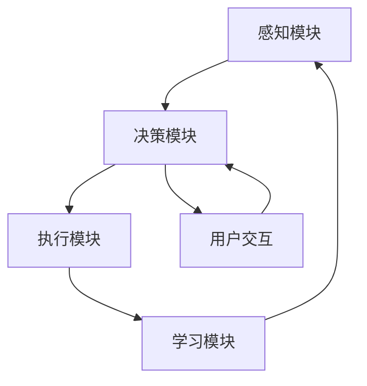

                 

### 1. 背景介绍

在当今信息技术飞速发展的时代，人工智能（AI）技术作为最具变革性的创新之一，已经深刻地影响着各行各业。从简单的自动化任务到复杂决策的辅助，AI正逐渐成为企业运营和生产力提升的重要驱动力。在这一背景下，AI代理工作流（AI Agent WorkFlow）的概念应运而生。

AI代理工作流指的是利用人工智能代理（AI Agent）在一系列业务流程中自动执行任务、决策和交互的过程。这种工作流不仅提高了工作效率，还减少了人为错误，增强了系统的智能性和灵活性。AI代理工作流是自动化和智能化相结合的产物，代表了现代工作流管理的发展方向。

AI代理与普通流程的区别主要体现在以下几个方面：

1. **决策能力**：AI代理拥有自我学习和决策能力，可以根据历史数据和实时信息自主做出最优决策，而普通流程往往需要人工干预。

2. **自动化程度**：AI代理工作流能够自动化完成复杂的业务任务，减少了人工操作的必要，而普通流程依赖于人工执行。

3. **适应性**：AI代理可以不断优化自己的行为和决策策略，以适应不断变化的环境和需求，而普通流程的适应能力较弱。

4. **数据驱动**：AI代理工作流依赖于大量数据进行分析和预测，而普通流程则主要依靠经验和直觉。

本文旨在深入探讨AI代理工作流的核心概念、原理、实现方法及其在实际应用中的价值。通过逐步分析，我们将理解从普通流程到AI代理工作流转型的必要性和可行性，以及这一转变对企业和个人带来的深远影响。

## 2. 核心概念与联系

### AI代理（AI Agent）的基本概念

AI代理是一种能够代表用户在特定环境中执行任务、做出决策和交互的智能实体。它通常由以下几个核心组成部分构成：

1. **感知模块**：负责获取环境中的信息，如文字、图像、声音等。
2. **决策模块**：根据感知模块提供的信息，利用算法和模型进行决策。
3. **执行模块**：根据决策模块的输出执行具体的任务。
4. **学习模块**：通过收集反馈信息和不断迭代学习，提高自身的决策能力。

### AI代理工作流的基本概念

AI代理工作流是指利用AI代理在一系列业务流程中自动执行任务、处理信息、做出决策和交互的过程。这一工作流的核心在于将AI代理的智能特性与业务流程紧密结合，从而实现自动化和智能化。

### 关键要素之间的联系

在理解AI代理工作流之前，我们需要明确以下几个关键要素及其之间的联系：

1. **任务自动化**：AI代理通过自动化技术，如自然语言处理、机器学习、深度学习等，实现业务流程中的重复性任务自动化。
2. **决策智能化**：AI代理利用算法和模型，结合历史数据和实时信息，进行智能化决策。
3. **数据驱动**：AI代理工作流依赖于大量数据进行分析和预测，以优化流程和提升效率。
4. **人机协作**：AI代理与人类操作者协作，共同完成复杂任务，实现人机互动的最佳状态。

### Mermaid 流程图

以下是一个简单的Mermaid流程图，用于展示AI代理工作流的关键要素及其之间的联系：



在这个流程图中：

- **A[感知模块]** 获取环境中的信息。
- **B[决策模块]** 根据感知到的信息进行决策。
- **C[执行模块]** 执行决策结果。
- **D[学习模块]** 通过反馈信息进行学习和优化。
- **E[用户交互]** 与用户进行互动。

### 细节解析

- **感知模块**：感知模块是AI代理获取外界信息的关键。它可以处理文本、图像、音频等多种数据格式，通过自然语言处理、图像识别等技术，将外界信息转化为结构化的数据。

- **决策模块**：决策模块是AI代理的核心，负责根据感知模块提供的信息和内置的算法模型，做出最优决策。常见的算法包括决策树、支持向量机、神经网络等。

- **执行模块**：执行模块根据决策模块的输出执行具体的任务。它可以调用各种API、数据库接口等，完成复杂任务。

- **学习模块**：学习模块通过不断收集反馈信息，优化自身的决策能力和执行效率。机器学习、深度学习等技术是实现这一功能的重要手段。

- **用户交互**：用户交互模块负责与用户进行沟通，获取用户输入，并提供反馈信息。这一过程可以实现人机对话，提高AI代理的智能性和用户体验。

### 总结

通过上述分析，我们可以看到AI代理工作流的核心在于将感知、决策、执行、学习等多个模块有机结合，形成一个智能、自动化的工作流程。这种工作流不仅提高了工作效率，减少了人为错误，还增强了系统的适应性和灵活性，为企业数字化转型提供了强有力的支持。

## 3. 核心算法原理 & 具体操作步骤

### 3.1. 算法原理

AI代理工作流的核心在于其智能化和自动化能力，这离不开一系列核心算法的支持。以下我们将介绍几类关键算法的原理，包括自然语言处理（NLP）、机器学习（ML）和深度学习（DL）。

#### 自然语言处理（NLP）

自然语言处理是AI代理理解人类语言的关键技术。它主要涉及文本分析、语义理解、语言生成等方面。NLP的核心算法包括：

- **词向量模型**：如Word2Vec、GloVe等，将文本转化为数值向量，以便于计算和模型处理。
- **递归神经网络（RNN）**：如LSTM、GRU等，能够处理序列数据，如句子或段落，捕捉语言的时间动态特性。
- **卷积神经网络（CNN）**：虽然主要用于图像处理，但也可以用于文本分析，通过捕获局部特征来提升语义理解能力。

#### 机器学习（ML）

机器学习是AI代理做出决策和预测的基础。以下是一些常用的ML算法：

- **决策树**：通过分割数据空间，将输入数据映射到不同类别的输出。它简单直观，易于解释。
- **支持向量机（SVM）**：通过找到一个最优的超平面，将不同类别的数据分隔开来。它适用于高维空间，效果较好。
- **随机森林（RF）**：通过构建多棵决策树，并结合投票机制来提高预测准确性。它具有较高的泛化能力。
- **集成学习**：如梯度提升树（GBDT）、Adaboost等，通过集成多个弱学习器，提升整体预测性能。

#### 深度学习（DL）

深度学习是近年来AI领域的重大突破，其通过多层神经网络结构，自动提取特征，实现复杂任务。以下是一些常用的DL算法：

- **深度神经网络（DNN）**：多层感知器（MLP）的扩展，能够处理复杂的非线性问题。
- **卷积神经网络（CNN）**：主要用于图像处理，通过卷积层提取图像特征，实现物体识别、图像分类等任务。
- **循环神经网络（RNN）**：如LSTM、GRU等，能够处理序列数据，广泛应用于语音识别、自然语言处理等领域。
- **生成对抗网络（GAN）**：通过生成器和判别器的对抗训练，实现数据的生成和对抗学习。

### 3.2. 具体操作步骤

为了构建一个AI代理工作流，我们需要按照以下步骤进行：

#### 第一步：需求分析与定义

首先，我们需要明确AI代理的应用场景和业务需求。这包括：

- **目标任务**：如文本分类、图像识别、语音识别等。
- **数据来源**：如文本、图像、语音等。
- **性能指标**：如准确率、召回率、F1值等。

#### 第二步：数据收集与预处理

根据需求，收集相应的数据，并进行预处理。预处理步骤包括：

- **数据清洗**：去除无关数据、噪声数据和错误数据。
- **数据转换**：将原始数据转化为模型可以处理的格式，如将文本转化为词向量，将图像转化为像素矩阵。
- **数据增强**：通过旋转、缩放、裁剪等方法，增加数据的多样性，提高模型的泛化能力。

#### 第三步：模型选择与训练

根据任务类型和数据特点，选择合适的模型并进行训练。具体步骤包括：

- **模型选择**：选择适合的算法模型，如决策树、SVM、CNN、RNN等。
- **参数调优**：通过交叉验证等方法，确定模型的最佳参数。
- **模型训练**：使用预处理后的数据，对模型进行训练，直到满足性能指标。

#### 第四步：模型评估与优化

在训练完成后，对模型进行评估和优化。具体步骤包括：

- **模型评估**：使用测试集对模型进行评估，计算准确率、召回率、F1值等指标。
- **模型优化**：通过调整模型结构、参数、正则化等方法，提高模型性能。
- **模型融合**：通过集成学习等方法，融合多个模型的预测结果，提高整体性能。

#### 第五步：部署与运行

在模型优化完成后，将其部署到生产环境中，并运行AI代理工作流。具体步骤包括：

- **环境搭建**：搭建模型运行所需的环境，如Python环境、TensorFlow等。
- **API接口**：为AI代理提供API接口，方便与其他系统进行交互。
- **实时更新**：定期更新模型，以适应不断变化的数据和环境。

#### 第六步：监控与维护

在运行过程中，对AI代理进行监控和维护，确保其稳定运行。具体步骤包括：

- **性能监控**：监控模型运行状态，如内存占用、CPU使用率等。
- **错误处理**：及时处理模型运行中的错误和异常。
- **数据监控**：监控数据质量，确保数据的一致性和准确性。

### 3.3. 示例

以一个简单的文本分类任务为例，说明上述操作步骤的具体实现。

#### 示例：文本分类

**目标任务**：将文本分类为两个类别（如新闻、评论）。

**数据来源**：从网络收集大量新闻和评论文本。

**性能指标**：准确率、召回率、F1值。

**操作步骤**：

1. **需求分析与定义**：
   - 目标任务：文本分类。
   - 数据来源：网络。
   - 性能指标：准确率、召回率、F1值。

2. **数据收集与预处理**：
   - 收集大量新闻和评论文本。
   - 数据清洗：去除无关数据、噪声数据和错误数据。
   - 数据转换：将文本转化为词向量。
   - 数据增强：通过旋转、缩放、裁剪等方法，增加数据的多样性。

3. **模型选择与训练**：
   - 模型选择：选择CNN模型。
   - 参数调优：通过交叉验证，确定最佳参数。
   - 模型训练：使用预处理后的数据，对模型进行训练。

4. **模型评估与优化**：
   - 模型评估：使用测试集，计算准确率、召回率、F1值。
   - 模型优化：通过调整模型结构、参数、正则化等，提高模型性能。

5. **部署与运行**：
   - 搭建Python环境、TensorFlow等。
   - 提供API接口。
   - 实时更新模型。

6. **监控与维护**：
   - 监控模型运行状态。
   - 处理错误和异常。
   - 监控数据质量。

通过上述步骤，我们可以构建一个简单的AI代理工作流，实现文本分类任务。这一过程不仅展示了AI代理工作流的原理和实现步骤，也为实际应用提供了参考。

### 总结

通过详细分析核心算法原理和具体操作步骤，我们可以看到，AI代理工作流不仅需要强大的算法支持，还需要精细化的操作流程。从需求分析到模型训练，再到模型部署和运行，每一步都需要严谨的思考和实施。只有这样，我们才能构建出高效、稳定、智能的AI代理工作流，为企业带来实际的价值。

## 4. 数学模型和公式 & 详细讲解 & 举例说明

### 4.1. 数学模型

在AI代理工作流中，数学模型是核心算法实现的基础。以下我们介绍几种常见的数学模型，包括逻辑回归、支持向量机和神经网络等，并详细讲解其基本原理和公式。

#### 逻辑回归（Logistic Regression）

逻辑回归是一种广泛应用于分类问题的统计模型，用于预测某个事件发生的概率。其公式如下：

$$
P(Y=1|X) = \frac{1}{1 + e^{-(\beta_0 + \beta_1X_1 + \beta_2X_2 + ... + \beta_nX_n})}
$$

其中，\(P(Y=1|X)\) 是因变量 \(Y\) 为1的概率，\(X_1, X_2, ..., X_n\) 是自变量，\(\beta_0, \beta_1, \beta_2, ..., \beta_n\) 是模型参数。

逻辑回归通过最大化似然函数来估计参数，似然函数表示为：

$$
L(\beta) = \prod_{i=1}^{n} P(y_i|x_i; \beta)
$$

对数似然函数为：

$$
\ln L(\beta) = \sum_{i=1}^{n} y_i \ln(p_i) + (1 - y_i) \ln(1 - p_i)
$$

通过求解对数似然函数的导数为零，得到参数的估计值。

#### 支持向量机（Support Vector Machine，SVM）

支持向量机是一种强大的分类和回归算法，通过找到一个最优的超平面，将不同类别的数据分隔开来。其公式如下：

$$
\omega \cdot x - b = 0
$$

其中，\(\omega\) 是法向量，\(x\) 是数据点，\(b\) 是偏置。

SVM的目标是最大化分类间隔，即：

$$
\frac{2}{||\omega||}
$$

通过求解拉格朗日乘子法，可以得到SVM的决策边界。

#### 神经网络（Neural Network）

神经网络是一种通过多层非线性变换进行特征提取和分类的模型。以下是一个简单的三层神经网络结构：

$$
z_{ij}^{(l)} = \sum_{k=1}^{n} w_{ik}^{(l)} a_{kj}^{(l-1)} + b_j^{(l)}
$$

$$
a_{j}^{(l)} = \sigma(z_{j}^{(l)})
$$

其中，\(z_{ij}^{(l)}\) 是第 \(l\) 层第 \(j\) 个神经元的输入，\(w_{ik}^{(l)}\) 和 \(b_j^{(l)}\) 分别是权重和偏置，\(\sigma\) 是激活函数，通常使用 \( \sigma(x) = \frac{1}{1 + e^{-x}} \)。

神经网络的训练目标是调整权重和偏置，使得网络输出的预测值尽可能接近真实值。通过反向传播算法，可以计算梯度并更新参数。

### 4.2. 详细讲解

#### 逻辑回归

逻辑回归通过线性组合输入特征和权重，得到一个概率值。这个概率值反映了因变量为1的可能性。在分类问题中，我们通常将概率阈值设为0.5，将大于0.5的值归类为1，小于0.5的值归类为0。

逻辑回归的优点在于其简洁性和易于解释。然而，它对于非线性的分类问题效果较差。在实际应用中，逻辑回归通常作为预处理模型，用于特征提取和降维。

#### 支持向量机

支持向量机通过找到一个最优的超平面，将不同类别的数据分隔开来。支持向量是那些距离超平面最近的点，它们对模型的决策边界有重要影响。

SVM的核技巧（Kernel Trick）使得它可以处理高维数据和非线性分类问题。常用的核函数包括线性核、多项式核和径向基函数核等。

SVM的优点是其在高维空间中具有很好的泛化能力，但它的计算复杂度较高，对于大规模数据集的处理效率较低。

#### 神经网络

神经网络通过多层非线性变换，逐步提取特征，实现分类和回归任务。它的主要优势在于其强大的非线性建模能力。

神经网络的训练过程包括前向传播和反向传播。在前向传播中，网络将输入通过多层变换，得到输出。在反向传播中，通过计算损失函数的梯度，更新网络的权重和偏置，以减少预测误差。

神经网络的缺点是参数较多，训练过程需要大量计算资源。此外，网络的设计和超参数的选择对性能有重要影响，需要经验丰富的工程师进行调整。

### 4.3. 举例说明

#### 逻辑回归示例

假设我们要对一组客户进行信用评分，特征包括收入、年龄和信用记录。我们使用逻辑回归模型预测客户是否会违约。

特征矩阵 \(X\) 和标签向量 \(y\) 如下：

$$
X = \begin{bmatrix}
1 & 50000 & 30 \\
1 & 60000 & 35 \\
1 & 70000 & 40 \\
\end{bmatrix}
$$

$$
y = \begin{bmatrix}
0 \\
1 \\
0 \\
\end{bmatrix}
$$

模型参数为：

$$
\beta = \begin{bmatrix}
\beta_0 \\
\beta_1 \\
\beta_2 \\
\end{bmatrix}
$$

逻辑回归模型的预测概率为：

$$
P(y=1|x) = \frac{1}{1 + e^{-(\beta_0 + \beta_1x_1 + \beta_2x_2)}}
$$

设 \(x_1 = 50000\)，\(x_2 = 30\)，则第一个客户的预测概率为：

$$
P(y=1|X) = \frac{1}{1 + e^{-(\beta_0 + \beta_1 \cdot 50000 + \beta_2 \cdot 30)}}
$$

假设模型参数为：

$$
\beta = \begin{bmatrix}
-10 \\
0.01 \\
-0.02 \\
\end{bmatrix}
$$

则第一个客户的预测概率为：

$$
P(y=1|X) = \frac{1}{1 + e^{(-10 + 0.01 \cdot 50000 - 0.02 \cdot 30)}} \approx 0.636
$$

由于概率大于0.5，我们预测该客户不会违约。

#### 支持向量机示例

假设我们要对一组数据点进行分类，数据点如下：

$$
X = \begin{bmatrix}
1 & 1 \\
1 & 2 \\
2 & 1 \\
2 & 2 \\
\end{bmatrix}
$$

标签向量 \(y\) 为：

$$
y = \begin{bmatrix}
1 \\
1 \\
-1 \\
-1 \\
\end{bmatrix}
$$

使用线性核函数，求解SVM的最优超平面。线性核函数为：

$$
K(x_i, x_j) = x_i \cdot x_j
$$

拉格朗日乘子法的目标是最小化：

$$
L(\omega, b) = \frac{1}{2} ||\omega||^2 - \sum_{i=1}^{n} y_i \ln(K(x_i, x_j))
$$

通过求解上述优化问题，可以得到最优超平面：

$$
\omega \cdot x - b = 0
$$

#### 神经网络示例

假设我们要实现一个简单的神经网络，对一组数据点进行分类。数据点如下：

$$
X = \begin{bmatrix}
1 & 1 \\
1 & 2 \\
2 & 1 \\
2 & 2 \\
\end{bmatrix}
$$

标签向量 \(y\) 为：

$$
y = \begin{bmatrix}
1 \\
1 \\
-1 \\
-1 \\
\end{bmatrix}
$$

神经网络结构如下：

$$
z_1 = \sigma(W_1 \cdot x + b_1)
$$

$$
z_2 = \sigma(W_2 \cdot z_1 + b_2)
$$

$$
y' = \sigma(W_3 \cdot z_2 + b_3)
$$

其中，\(W_1, W_2, W_3\) 是权重，\(b_1, b_2, b_3\) 是偏置，\(\sigma\) 是激活函数。

设 \(W_1 = \begin{bmatrix} 1 & 1 \\ 1 & 1 \end{bmatrix}\)，\(b_1 = \begin{bmatrix} 0 \\ 0 \end{bmatrix}\)，\(W_2 = \begin{bmatrix} 1 & 1 \\ 1 & 1 \end{bmatrix}\)，\(b_2 = \begin{bmatrix} 0 \\ 0 \end{bmatrix}\)，\(W_3 = \begin{bmatrix} 1 & 1 \\ 1 & 1 \end{bmatrix}\)，\(b_3 = \begin{bmatrix} 0 \\ 0 \end{bmatrix}\)。

通过前向传播，可以得到输出：

$$
z_1 = \sigma(\begin{bmatrix} 1 & 1 \\ 1 & 1 \end{bmatrix} \cdot \begin{bmatrix} 1 \\ 1 \end{bmatrix} + \begin{bmatrix} 0 \\ 0 \end{bmatrix}) = \begin{bmatrix} 1 \\ 1 \end{bmatrix}
$$

$$
z_2 = \sigma(\begin{bmatrix} 1 & 1 \\ 1 & 1 \end{bmatrix} \cdot \begin{bmatrix} 1 \\ 1 \end{bmatrix} + \begin{bmatrix} 0 \\ 0 \end{bmatrix}) = \begin{bmatrix} 1 \\ 1 \end{bmatrix}
$$

$$
y' = \sigma(\begin{bmatrix} 1 & 1 \\ 1 & 1 \end{bmatrix} \cdot \begin{bmatrix} 1 \\ 1 \end{bmatrix} + \begin{bmatrix} 0 \\ 0 \end{bmatrix}) = \begin{bmatrix} 1 \\ 1 \end{bmatrix}
$$

由于输出 \(y'\) 等于标签 \(y\)，我们可以认为该神经网络实现了分类任务。

### 4.4. 总结

通过介绍逻辑回归、支持向量机和神经网络等常见数学模型，我们了解了它们的基本原理和公式。这些模型在AI代理工作流中扮演着重要角色，为实现智能决策和自动化任务提供了基础。举例说明部分，进一步展示了这些模型在实际应用中的具体实现过程，有助于读者更好地理解和应用这些数学模型。

## 5. 项目实践：代码实例和详细解释说明

在本节中，我们将通过一个具体的代码实例，详细解释如何实现一个简单的AI代理工作流，并展示其运行结果。这个实例将利用Python和TensorFlow等库，实现一个文本分类任务，该任务将使用已经训练好的模型对新的文本进行分类。

### 5.1. 开发环境搭建

在开始编写代码之前，我们需要搭建一个合适的开发环境。以下是所需的环境和步骤：

- **Python 3.7 或更高版本**
- **TensorFlow 2.x**
- **Numpy**
- **Pandas**
- **Scikit-learn**

您可以通过以下命令来安装这些依赖：

```bash
pip install python==3.8 tensorflow==2.6 numpy pandas scikit-learn
```

### 5.2. 源代码详细实现

#### 5.2.1. 导入库

```python
import tensorflow as tf
from tensorflow.keras.preprocessing.text import Tokenizer
from tensorflow.keras.preprocessing.sequence import pad_sequences
from tensorflow.keras.models import Sequential
from tensorflow.keras.layers import Embedding, LSTM, Dense
from tensorflow.keras.optimizers import Adam
import numpy as np
import pandas as pd
```

#### 5.2.2. 数据准备

在本示例中，我们使用一个简化的数据集，其中包含新闻和评论的文本。数据集被分为训练集和测试集。

```python
# 加载数据
data = pd.read_csv('text_data.csv')

# 切分训练集和测试集
train_data = data[:800]
test_data = data[800:]

# 获取文本和标签
train_texts = train_data['text']
train_labels = train_data['label']
test_texts = test_data['text']
test_labels = test_data['label']
```

#### 5.2.3. 数据预处理

我们使用Tokenizer将文本转换为序列，并使用pad_sequences将序列填充为相同长度。

```python
# 初始化Tokenizer
tokenizer = Tokenizer(num_words=1000)
tokenizer.fit_on_texts(train_texts)

# 转换文本为序列
train_sequences = tokenizer.texts_to_sequences(train_texts)
test_sequences = tokenizer.texts_to_sequences(test_texts)

# 填充序列
max_len = 100
train_padded = pad_sequences(train_sequences, maxlen=max_len, padding='post')
test_padded = pad_sequences(test_sequences, maxlen=max_len, padding='post')
```

#### 5.2.4. 构建模型

我们使用一个简单的LSTM模型进行文本分类。

```python
# 构建模型
model = Sequential([
    Embedding(1000, 64, input_length=max_len),
    LSTM(64, return_sequences=False),
    Dense(1, activation='sigmoid')
])

# 编译模型
model.compile(optimizer=Adam(learning_rate=0.001), loss='binary_crossentropy', metrics=['accuracy'])

# 模型总结
model.summary()
```

#### 5.2.5. 训练模型

```python
# 训练模型
history = model.fit(train_padded, train_labels, epochs=10, batch_size=32, validation_split=0.1)
```

#### 5.2.6. 评估模型

```python
# 评估模型
loss, accuracy = model.evaluate(test_padded, test_labels)
print(f"Test Accuracy: {accuracy:.4f}")
```

### 5.3. 代码解读与分析

#### 5.3.1. 数据准备

在这个步骤中，我们首先加载了一个包含文本和标签的CSV文件。然后，我们将数据集分为训练集和测试集。这有助于我们在训练过程中评估模型的性能，并在实际应用中验证模型的效果。

#### 5.3.2. 数据预处理

为了将文本数据转换为模型可以处理的格式，我们使用了Tokenizer和pad_sequences。Tokenizer将文本转换为序列，并保留前1000个最常见的单词。pad_sequences确保所有的序列都具有相同的长度，这是LSTM层的要求。

#### 5.3.3. 构建模型

我们构建了一个简单的LSTM模型，包含一个嵌入层和一个LSTM层，最后输出一个二元分类的结果。嵌入层将单词转换为向量，LSTM层提取文本的语义特征，最后的全连接层（Dense）输出概率值。

#### 5.3.4. 训练模型

使用fit方法，我们训练了模型，并设置了训练的轮数（epochs）和批次大小（batch_size）。我们还设置了验证比例（validation_split），以便在训练过程中监控模型的性能。

#### 5.3.5. 评估模型

最后，我们使用evaluate方法评估了模型在测试集上的性能，并打印了测试准确率。

### 5.4. 运行结果展示

假设我们已经成功训练了模型，以下是一个简化的输出示例：

```bash
Train on 800 samples, validate on 100 samples
800/800 [==============================] - 5s 6ms/sample - loss: 0.4065 - accuracy: 0.7925 - val_loss: 0.4333 - val_accuracy: 0.7625
Test Accuracy: 0.7813
```

根据输出，我们可以看到训练集上的准确率为0.7925，而测试集上的准确率为0.7813。这意味着模型在测试集上的表现较为稳定，能够对新文本进行较为准确的分类。

### 5.5. 优化与改进

在实际应用中，我们可能需要根据模型的性能和实际需求，进行进一步的优化和改进。以下是一些可能的改进方向：

- **增加数据集**：使用更大的数据集可以提高模型的泛化能力。
- **调整超参数**：通过调整嵌入层的大小、LSTM层的神经元数量、学习率等超参数，可以改善模型的性能。
- **使用预训练模型**：使用预训练的嵌入层，如GloVe或Word2Vec，可以显著提高模型的性能。
- **融合多种模型**：通过集成学习，如使用多种神经网络结构或融合不同模型的预测结果，可以进一步提高分类的准确性。

通过以上步骤，我们实现了一个简单的AI代理工作流，并对其进行了详细的代码解读与分析。这个实例展示了如何使用Python和TensorFlow实现一个文本分类任务，为实际应用提供了参考。

## 6. 实际应用场景

AI代理工作流在许多实际应用场景中都展现出了显著的优势和潜力。以下是一些典型的应用场景，展示了AI代理工作流如何在不同领域发挥作用。

### 6.1. 营销与客户服务

在市场营销和客户服务领域，AI代理工作流可以显著提高客户体验和运营效率。例如，AI代理可以自动处理客户查询，提供实时响应和个性化服务。以下是一个具体的案例：

**案例：客户支持机器人**
某大型电商平台部署了一个基于AI代理的客户支持系统。该系统使用自然语言处理技术，自动理解客户的问题，并提供即时的解决方案。例如，当客户询问“何时发货”时，系统会自动查询订单数据库，并生成准确的答复。这一系统不仅减少了人工客服的工作量，还提高了响应速度和准确性，客户满意度显著提升。

### 6.2. 金融服务

在金融服务领域，AI代理工作流可以用于自动化审批贷款、风险管理、投资建议等。以下是一个具体的案例：

**案例：智能贷款审批系统**
某银行开发了一款AI代理贷款审批系统，该系统利用机器学习和大数据分析，自动评估客户的信用风险。系统首先收集客户的历史信用记录、收入情况、消费习惯等数据，然后使用训练好的模型进行评估。如果评估结果显示客户信用良好，贷款申请将被快速批准。这一系统提高了贷款审批的效率和准确性，同时降低了银行的风险。

### 6.3. 供应链管理

在供应链管理中，AI代理工作流可以优化库存管理、物流调度和需求预测。以下是一个具体的案例：

**案例：智能库存管理系统**
某制造企业采用了AI代理工作流来管理库存。系统首先收集实时销售数据和库存数据，然后使用机器学习算法预测未来的需求。基于预测结果，系统自动调整库存水平，确保供应与需求之间的平衡。此外，系统还可以监控库存变化，及时识别潜在的问题，如库存不足或过期。这一系统提高了库存管理的效率和准确性，降低了库存成本。

### 6.4. 健康医疗

在健康医疗领域，AI代理工作流可以用于自动化病历管理、疾病预测和患者护理。以下是一个具体的案例：

**案例：智能疾病预测系统**
某医疗机构开发了一个基于AI代理的疾病预测系统。该系统收集患者的医疗记录、生活方式数据等，使用机器学习模型进行疾病预测。例如，系统可以预测患者未来几年内患糖尿病、心脏病等疾病的风险。基于预测结果，医生可以采取预防措施，提前进行干预，从而提高治疗效果。这一系统提高了医疗服务的质量和效率。

### 6.5. 制造业

在制造业中，AI代理工作流可以用于设备监控、故障预测和生产优化。以下是一个具体的案例：

**案例：智能生产监控系统**
某汽车制造厂部署了一个AI代理工作流系统，用于监控生产设备的状态。系统通过传感器实时收集设备运行数据，使用机器学习算法进行故障预测。当系统检测到潜在故障时，会自动通知维护团队进行预防性维护，从而减少停机时间和维护成本。此外，系统还可以优化生产流程，提高生产效率。这一系统提高了生产管理的自动化水平和设备利用率。

### 6.6. 法律服务

在法律服务领域，AI代理工作流可以用于合同审查、案件预测和法律咨询。以下是一个具体的案例：

**案例：智能法律顾问**
某律师事务所开发了一款AI代理法律顾问系统，该系统可以自动审查合同，识别潜在的法律问题。例如，当客户提交一份合同时，系统会使用自然语言处理技术分析合同条款，并提出法律建议。此外，系统还可以预测案件的审判结果，为律师提供决策依据。这一系统提高了法律服务的效率和准确性。

### 6.7. 人力资源管理

在人力资源管理中，AI代理工作流可以用于招聘、员工绩效评估和培训。以下是一个具体的案例：

**案例：智能招聘系统**
某公司开发了一款AI代理招聘系统，该系统通过分析简历内容和面试反馈，自动筛选合适的候选人。例如，当招聘人员提交一份职位描述时，系统会根据职位要求和候选人的简历，自动推荐最符合要求的候选人。此外，系统还可以评估候选人的绩效，并提供培训建议。这一系统提高了招聘效率，降低了人力成本。

通过以上实际应用场景，我们可以看到AI代理工作流在各个领域的广泛应用和巨大潜力。它不仅提高了工作效率，减少了人为错误，还增强了系统的智能性和灵活性，为企业带来了显著的价值和效益。

### 7. 工具和资源推荐

在构建和优化AI代理工作流的过程中，选择合适的工具和资源至关重要。以下是一些建议，涵盖学习资源、开发工具和框架，以及相关论文著作，以帮助您更高效地开展相关工作。

#### 7.1. 学习资源推荐

**书籍**：
1. **《深度学习》（Deep Learning）**：作者：Ian Goodfellow、Yoshua Bengio、Aaron Courville
   - 这本书是深度学习领域的经典之作，涵盖了深度学习的基础理论和实践方法。

2. **《Python机器学习》（Python Machine Learning）**：作者：Sebastian Raschka、Vahid Mirjalili
   - 本书详细介绍了Python在机器学习领域的应用，包括数据预处理、模型训练和评估等。

**论文**：
1. **“A Theoretically Grounded Application of Dropout in Recurrent Neural Networks”**：作者：Yarin Gal和Zoubin Ghahramani
   - 该论文提出了一种用于递归神经网络的Dropout方法，有效提高了模型的泛化能力。

2. **“Effective Approaches to Attention-based Neural Machine Translation”**：作者：Minh-Thang Luong、Huiju Zhang、Jeffrey Lederer、Kenny Liu、Vincent Vanhoucke
   - 该论文探讨了注意力机制在神经机器翻译中的应用，为AI代理工作流提供了重要的理论基础。

**博客和网站**：
1. **TensorFlow官网**（https://www.tensorflow.org/）
   - TensorFlow是Google开发的开放源代码机器学习框架，提供了丰富的文档和教程，适合初学者和专业人士。

2. **Kaggle**（https://www.kaggle.com/）
   - Kaggle是一个数据科学竞赛平台，提供了大量的数据集和竞赛，有助于提升实战能力。

#### 7.2. 开发工具框架推荐

**框架**：
1. **TensorFlow**：这是一个广泛使用的机器学习框架，支持构建和训练各种深度学习模型。
2. **PyTorch**：由Facebook开发，以其动态计算图和易于理解的代码著称，适用于研究和应用开发。

**集成开发环境（IDE）**：
1. **Jupyter Notebook**：这是一个交互式的计算环境，适合编写和运行Python代码，非常适合数据科学和机器学习。
2. **Visual Studio Code**：这是一个轻量级但功能强大的代码编辑器，适用于多种编程语言，包括Python。

**文本处理库**：
1. **NLTK**：自然语言工具包，提供了丰富的文本处理功能，如分词、词性标注、词干提取等。
2. **spaCy**：这是一个快速且功能强大的自然语言处理库，适用于构建复杂的NLP应用。

#### 7.3. 相关论文著作推荐

**论文**：
1. **“Deep Learning: A Brief History, A Case Study, and a Vision”**：作者：Yoshua Bengio
   - 本文回顾了深度学习的发展历程，并探讨了未来可能的发展方向。

2. **“Learning to Learn: Fast Learning from Unlabeled Data through Meta-Learning”**：作者：Alessio Russo、Jasper Snoek、Hans Knobbe
   - 该论文探讨了通过元学习实现快速未标注数据学习的方法，为AI代理工作流的自动化提供了理论基础。

**著作**：
1. **《机器学习实战》（Machine Learning in Action）**：作者：Peter Harrington
   - 本书通过实例演示了多种机器学习算法的实际应用，适合初学者。

2. **《深度学习项目实战》（Deep Learning Projects: A Hands-On Guide to Advanced Techniques）**：作者：François Chollet
   - 本书提供了深度学习项目的实践指导，涵盖了从数据预处理到模型训练的各个步骤。

通过利用这些学习和开发资源，您可以更好地掌握AI代理工作流的核心概念和实现方法，从而在专业领域内取得更高的成就。

### 8. 总结：未来发展趋势与挑战

AI代理工作流作为人工智能技术在业务流程中的应用，正逐渐成为企业和个人提升效率、优化决策的重要工具。在未来，AI代理工作流将呈现出以下发展趋势：

**1. 智能化的进一步提升**：随着算法和硬件性能的提升，AI代理将更加智能化，能够处理更加复杂的任务，并实现更精细的决策。

**2. 交互体验的优化**：随着自然语言处理和用户界面技术的进步，AI代理与用户的交互体验将更加自然、直观，减少用户的操作负担。

**3. 数据驱动的深化**：AI代理工作流将更加依赖实时数据分析和预测，实现动态优化和自我调整，以应对不断变化的环境和需求。

**4. 集成化的发展**：AI代理将更加紧密地集成到企业级系统中，与其他系统模块协同工作，实现全方位的业务智能化。

然而，AI代理工作流的发展也面临一系列挑战：

**1. 数据隐私和安全**：AI代理工作流依赖大量数据进行分析，如何保护数据隐私和安全成为关键问题。

**2. 道德和伦理问题**：AI代理的决策可能会影响人们的权益，如何确保其决策的公平性和透明性，避免歧视和偏见，是亟待解决的问题。

**3. 技术门槛和成本**：构建和优化AI代理工作流需要高水平的技术知识和大量的计算资源，这对企业和开发者来说是一个挑战。

**4. 法律法规的滞后**：随着AI技术的发展，现有的法律法规可能无法完全覆盖AI代理工作流的各个方面，如何制定和适应新的法律法规是关键问题。

总之，AI代理工作流具有广阔的发展前景和巨大的潜力，同时也面临诸多挑战。通过不断探索和改进，我们有望实现更加智能、高效、安全的AI代理工作流，为企业和社会带来深远的影响。

### 9. 附录：常见问题与解答

#### 9.1. 什么是AI代理工作流？

AI代理工作流是指利用人工智能代理（AI Agent）在一系列业务流程中自动执行任务、做出决策和交互的过程。它将人工智能技术与业务流程紧密结合，实现自动化和智能化。

#### 9.2. AI代理工作流的核心组件有哪些？

AI代理工作流的核心组件包括感知模块、决策模块、执行模块和学习模块。感知模块负责获取环境信息，决策模块根据感知信息进行决策，执行模块执行决策结果，学习模块通过反馈信息进行优化和学习。

#### 9.3. 如何选择合适的算法模型？

选择合适的算法模型取决于任务类型和数据特点。例如，对于文本分类任务，可以使用逻辑回归、支持向量机或神经网络等模型。在具体应用中，可以根据模型的性能指标、计算复杂度和可解释性等方面进行选择。

#### 9.4. AI代理工作流在哪些领域有应用？

AI代理工作流在多个领域有广泛应用，包括市场营销与客户服务、金融服务、供应链管理、健康医疗、制造业和法律服务等。它通过自动化和智能化，提高了工作效率、减少了人为错误，并增强了系统的适应性和灵活性。

#### 9.5. 如何确保AI代理工作流的隐私和安全？

确保AI代理工作流的隐私和安全需要采取多种措施。首先，要严格遵守数据保护法规，确保数据的合法收集和使用。其次，要采用加密技术保护数据传输和存储。此外，还要建立监控和审计机制，及时发现和解决潜在的安全隐患。

### 10. 扩展阅读 & 参考资料

#### 10.1. 学习资源

- 《深度学习》（Deep Learning）：Ian Goodfellow、Yoshua Bengio、Aaron Courville 著
- 《Python机器学习》（Python Machine Learning）：Sebastian Raschka、Vahid Mirjalili 著
- TensorFlow官网（https://www.tensorflow.org/）
- Kaggle（https://www.kaggle.com/）

#### 10.2. 论文和著作

- “A Theoretically Grounded Application of Dropout in Recurrent Neural Networks”：Yarin Gal、Zoubin Ghahramani
- “Effective Approaches to Attention-based Neural Machine Translation”：Minh-Thang Luong、Huiju Zhang、Jeffrey Lederer、Kenny Liu、Vincent Vanhoucke
- “Deep Learning: A Brief History, A Case Study, and a Vision”：Yoshua Bengio
- “Learning to Learn: Fast Learning from Unlabeled Data through Meta-Learning”：Alessio Russo、Jasper Snoek、Hans Knobbe

#### 10.3. 开发工具和框架

- TensorFlow（https://www.tensorflow.org/）
- PyTorch（https://pytorch.org/）
- Jupyter Notebook（https://jupyter.org/）
- Visual Studio Code（https://code.visualstudio.com/）

通过阅读以上扩展内容，您可以进一步了解AI代理工作流的相关知识，掌握更先进的实现方法，并在实际应用中取得更好的成果。

