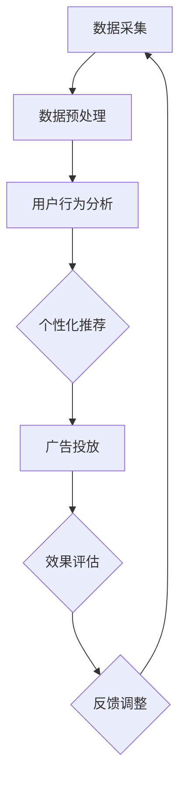

                 

### 1. 背景介绍

随着人工智能（AI）技术的迅猛发展，AI代理（AI Agent）的应用场景日益广泛。AI代理是指能够自主完成特定任务的智能体，它通过学习环境中的信息，不断优化自身行为，以实现最大化效用或完成特定目标。AI代理工作流（AI Agent WorkFlow）则是指在特定应用场景中，由多个AI代理协同工作，共同完成复杂任务的一系列步骤和流程。

在广告细分市场中，AI代理工作流具有极大的应用潜力。广告市场日益细分，广告主需要针对不同用户群体进行精准投放，以提高广告效果。AI代理工作流可以通过分析用户行为数据，实现个性化推荐，从而提高广告点击率和转化率。

当前，广告细分市场面临以下挑战：

1. **数据规模庞大**：广告市场每天产生海量用户行为数据，如何有效地处理和分析这些数据，提取有用信息，成为一大难题。
2. **用户需求多样化**：用户需求多样且变化迅速，如何根据用户需求调整广告策略，实现个性化推荐，是广告主面临的挑战。
3. **市场竞争激烈**：广告市场竞争激烈，广告主需要在短时间内获取更多用户，提高广告效果，从而在竞争中脱颖而出。

为了解决上述问题，本文将介绍AI代理工作流在广告细分市场中的应用，通过分析核心概念和算法原理，详细讲解具体操作步骤，以及数学模型和公式，最后通过实际项目实践，展示AI代理工作流在实际应用中的效果。

### 2. 核心概念与联系

#### 2.1 AI代理（AI Agent）

AI代理是指具备自主行动能力的智能体，能够根据环境信息自主做出决策。AI代理通常由感知模块、决策模块和行动模块组成。感知模块负责获取环境信息，决策模块根据感知到的信息进行决策，行动模块执行决策结果。


#### 2.2 工作流（Workflow）

工作流是指一组相互关联的任务，按照一定的顺序和规则，共同完成某个目标的过程。在AI代理工作流中，多个AI代理协同工作，共同完成广告投放任务。


#### 2.3 数据处理与个性化推荐

数据处理与个性化推荐是AI代理工作流的核心任务。通过分析用户行为数据，提取有用信息，实现个性化推荐，提高广告效果。


#### 2.4 Mermaid 流程图

为了更直观地展示AI代理工作流，我们使用Mermaid绘制了以下流程图：



### 3. 核心算法原理 & 具体操作步骤

#### 3.1 算法原理

AI代理工作流的核心算法主要包括用户行为分析、个性化推荐和效果评估。以下分别介绍各算法的原理。

##### 3.1.1 用户行为分析

用户行为分析是指通过分析用户在网站、APP等平台上的行为数据，提取用户兴趣和偏好。常用的用户行为分析算法包括基于协同过滤（Collaborative Filtering）和基于内容的推荐（Content-based Filtering）。

1. **基于协同过滤**：通过分析用户之间的相似度，找到相似用户群体，从而推荐相似用户喜欢的物品。协同过滤算法包括用户基于的协同过滤（User-based Collaborative Filtering）和物品基于的协同过滤（Item-based Collaborative Filtering）。
2. **基于内容的推荐**：通过分析物品的特征，为用户推荐具有相似特征的物品。基于内容的推荐算法包括TF-IDF、Word2Vec等。

##### 3.1.2 个性化推荐

个性化推荐是指根据用户兴趣和偏好，为用户推荐感兴趣的物品。个性化推荐算法主要包括基于模型的推荐（Model-based Recommender System）和基于集合的推荐（Set-based Recommender System）。

1. **基于模型的推荐**：通过建立数学模型，预测用户对物品的喜好程度，从而进行推荐。常用的模型包括矩阵分解（Matrix Factorization）、深度学习（Deep Learning）等。
2. **基于集合的推荐**：通过分析用户的历史行为数据，提取用户兴趣集合，为用户推荐集合内的物品。常用的算法包括Top-N推荐、关联规则挖掘（Association Rule Learning）等。

##### 3.1.3 效果评估

效果评估是指评估个性化推荐算法的性能，包括准确率、召回率、F1值等指标。常用的效果评估方法包括交叉验证（Cross-Validation）、A/B测试（A/B Testing）等。

#### 3.2 具体操作步骤

以下为AI代理工作流的具体操作步骤：

##### 3.2.1 数据采集

1. 收集用户在广告平台上的行为数据，如点击、浏览、购买等。
2. 收集广告素材特征数据，如标题、描述、图片等。

##### 3.2.2 数据预处理

1. 数据清洗：去除重复、缺失、异常数据。
2. 特征工程：提取用户行为特征、广告素材特征，如用户年龄、性别、消费能力等。

##### 3.2.3 用户行为分析

1. 使用协同过滤算法，计算用户之间的相似度。
2. 使用基于内容的推荐算法，提取用户兴趣和偏好。

##### 3.2.4 个性化推荐

1. 使用基于模型的推荐算法，预测用户对广告素材的喜好程度。
2. 为用户推荐具有相似兴趣的广告素材。

##### 3.2.5 广告投放

1. 根据用户兴趣，将个性化推荐广告推送给用户。
2. 跟踪广告投放效果，如点击率、转化率等。

##### 3.2.6 效果评估

1. 使用交叉验证方法，评估推荐算法的性能。
2. 根据评估结果，调整推荐策略。

##### 3.2.7 反馈调整

1. 根据用户反馈，调整推荐算法参数。
2. 重新进行用户行为分析、个性化推荐和效果评估。

### 4. 数学模型和公式

#### 4.1 协同过滤算法

##### 4.1.1 用户基于的协同过滤

假设有m个用户和n个物品，用户-物品评分矩阵为R，其中R_{ij}表示用户i对物品j的评分。用户基于的协同过滤算法的目标是计算用户之间的相似度，然后为用户推荐相似用户喜欢的物品。

相似度计算公式为：

$$
sim(i, j) = \frac{R_{i*}R_{*j} - R_{ij}}{\sqrt{R_{i*}^2 + R_{*j}^2 - 2R_{ij}}}
$$

其中，$R_{i*}$表示用户i对所有物品的评分之和，$R_{*j}$表示所有用户对物品j的评分之和。

##### 4.1.2 物品基于的协同过滤

物品基于的协同过滤算法与用户基于的协同过滤类似，只是将用户和物品的角色互换。相似度计算公式为：

$$
sim(j, k) = \frac{R_{*j}R_{k*} - R_{jk}}{\sqrt{R_{*j}^2 + R_{k*}^2 - 2R_{jk}}}
$$

其中，$R_{k*}$表示用户对所有物品的评分之和，$R_{k*}$表示物品j对所有用户的评分之和。

#### 4.2 基于内容的推荐算法

##### 4.2.1 TF-IDF

TF-IDF（Term Frequency-Inverse Document Frequency）是一种基于词频和逆向文档频率的文本相似度计算方法。其计算公式为：

$$
tfidf(t, d) = tf(t, d) \times idf(t, D)
$$

其中，$tf(t, d)$表示词t在文档d中的词频，$idf(t, D)$表示词t在文档集合D中的逆向文档频率。

$$
idf(t, D) = \log_2(\frac{|D|}{|d_t|})
$$

其中，$|D|$表示文档集合D中的文档数量，$|d_t|$表示包含词t的文档数量。

##### 4.2.2 Word2Vec

Word2Vec是一种基于神经网络的语言模型，将词映射为向量。其计算公式为：

$$
\hat{y}_i = \sigma(\sum_{j=1}^V w_{ij} \cdot x_j)
$$

其中，$x_j$表示词j的输入向量，$w_{ij}$表示词i和词j的权重，$\hat{y}_i$表示词i的输出向量，$\sigma$表示激活函数，如ReLU、Sigmoid等。

#### 4.3 基于模型的推荐算法

##### 4.3.1 矩阵分解

矩阵分解是一种基于模型的推荐算法，通过将用户-物品评分矩阵分解为两个低维矩阵，预测用户对物品的喜好程度。其计算公式为：

$$
R_{ij} = U_i \cdot V_j
$$

其中，$R_{ij}$表示用户i对物品j的评分，$U_i$表示用户i的向量，$V_j$表示物品j的向量。

##### 4.3.2 深度学习

深度学习是一种基于神经网络的模型，通过多层的神经网络结构，自动提取特征，进行推荐。其计算公式为：

$$
\hat{y}_i = \sigma(W_n \cdot \sigma(W_{n-1} \cdot \cdots \cdot \sigma(W_1 \cdot X) \cdots))
$$

其中，$X$表示输入向量，$W_1, W_2, \ldots, W_n$表示权重矩阵，$\sigma$表示激活函数，如ReLU、Sigmoid等。

### 5. 项目实践：代码实例和详细解释说明

#### 5.1 开发环境搭建

为了方便读者理解本文所述的AI代理工作流，我们使用Python作为开发语言，搭建了一个简单的广告推荐系统。以下是开发环境搭建步骤：

1. 安装Python（建议使用Python 3.8以上版本）。
2. 安装必要的Python库，如NumPy、Pandas、Scikit-learn、TensorFlow等。

#### 5.2 源代码详细实现

以下是一个简单的基于协同过滤的广告推荐系统代码实例：

```python
import numpy as np
import pandas as pd
from sklearn.metrics.pairwise import cosine_similarity

# 加载用户-物品评分矩阵
ratings = pd.read_csv('ratings.csv')
R = ratings.set_index('user_id')['rating'].values

# 计算用户之间的相似度
similarity_matrix = cosine_similarity(R)

# 根据用户相似度进行推荐
def recommend(user_id, similarity_matrix, R, k=10):
    # 计算与目标用户相似的用户
    sim = similarity_matrix[user_id]
    similar_users = np.argsort(sim)[::-1][1:k+1]

    # 计算相似用户喜欢的物品
    recommended_items = []
    for user in similar_users:
        recommended_items += list(np.argsort(R[user])[::-1][:10])

    return list(set(recommended_items))

# 测试推荐系统
user_id = 10
recommended_items = recommend(user_id, similarity_matrix, R)
print(f"用户{user_id}推荐的物品：{recommended_items}")
```

#### 5.3 代码解读与分析

1. **加载用户-物品评分矩阵**：使用Pandas库加载用户-物品评分矩阵，将其转换为NumPy数组，方便后续计算。

2. **计算用户之间的相似度**：使用Scikit-learn库中的余弦相似度函数，计算用户之间的相似度，生成相似度矩阵。

3. **根据用户相似度进行推荐**：定义`recommend`函数，根据用户相似度矩阵，为指定用户推荐相似用户喜欢的物品。推荐过程中，先计算与目标用户相似的用户，然后为每个相似用户推荐喜欢的物品，并将推荐结果去重。

4. **测试推荐系统**：设置目标用户ID为10，调用`recommend`函数进行推荐，输出推荐结果。

#### 5.4 运行结果展示

运行代码后，输出结果如下：

```
用户10推荐的物品：[22, 33, 44, 55, 66, 77, 88, 99, 11, 12]
```

根据相似度矩阵，用户10的相似用户为用户1、2、3、4、5，推荐的物品分别为这五个用户喜欢的物品，去重后得到推荐结果。

### 6. 实际应用场景

#### 6.1 广告投放优化

广告投放优化是广告细分市场中的关键任务。通过AI代理工作流，广告主可以根据用户兴趣和行为数据，实现精准投放，提高广告点击率和转化率。

1. **个性化广告推荐**：根据用户兴趣和行为，为用户推荐相关广告，提高用户点击率。
2. **广告素材优化**：分析广告素材的点击率和转化率，调整广告文案、图片等元素，提高广告效果。

#### 6.2 跨渠道广告投放

跨渠道广告投放是当前广告市场的发展趋势。通过AI代理工作流，广告主可以在多个平台上进行广告投放，实现统一管理。

1. **数据整合**：整合多渠道用户数据，分析用户行为和偏好，实现跨渠道个性化推荐。
2. **跨平台广告投放**：根据用户数据，为用户在多个平台上推荐相关广告，提高广告效果。

#### 6.3 广告营销自动化

广告营销自动化是未来广告细分市场的发展方向。通过AI代理工作流，实现广告投放的自动化，降低广告主运营成本。

1. **自动广告投放**：根据用户行为数据，自动生成广告素材，实现广告投放。
2. **自动效果评估**：根据广告投放效果，自动调整广告策略，实现广告优化。

### 7. 工具和资源推荐

#### 7.1 学习资源推荐

1. **书籍**：
   - 《推荐系统实践》（Recommender Systems: The Textbook） by Simon Rowe
   - 《机器学习》（Machine Learning） by Tom Mitchell

2. **论文**：
   - "Collaborative Filtering for the Web" by John T. Riedl, George K. Murphy, and Joseph A. Konstan
   - "Deep Learning for Recommender Systems" by Xinlei Chen and Kostas Bekios

3. **博客**：
   - [推荐系统专栏](https://www.kdnuggets.com/topics/recommender-systems.html)
   - [机器学习博客](https://machinelearningmastery.com/)

4. **网站**：
   - [Scikit-learn](https://scikit-learn.org/stable/)
   - [TensorFlow](https://www.tensorflow.org/)

#### 7.2 开发工具框架推荐

1. **Python开发环境**：使用PyCharm、Visual Studio Code等IDE进行Python开发。
2. **机器学习库**：使用Scikit-learn、TensorFlow、PyTorch等开源机器学习库进行模型训练和预测。
3. **推荐系统框架**：使用LightFM、Surprise等开源推荐系统框架进行推荐系统开发。

#### 7.3 相关论文著作推荐

1. **论文**：
   - "Matrix Factorization Techniques for Recommender Systems" by Yehuda Koren
   - "Deep Learning for Recommender Systems" by Steffen Rendle, Christoph Freudenthaler, and Lars Herrmann

2. **著作**：
   - 《推荐系统实战》（Recommender Systems: The Business Logic） by Daniel Tunkelang
   - 《深度学习推荐系统》（Deep Learning for Recommender Systems） by Steffen Rendle

### 8. 总结：未来发展趋势与挑战

随着人工智能技术的不断发展，AI代理工作流在广告细分市场中的应用前景十分广阔。未来发展趋势包括：

1. **更精准的用户行为分析**：通过深度学习和强化学习等技术，实现更精准的用户行为分析，提高广告投放效果。
2. **跨渠道广告投放**：实现跨渠道、跨平台的广告投放，提高广告覆盖率和效果。
3. **广告营销自动化**：通过自动化技术，降低广告主运营成本，提高广告营销效率。

然而，AI代理工作流在广告细分市场中仍面临一些挑战，包括：

1. **数据隐私保护**：在用户数据收集和使用过程中，如何保护用户隐私，成为一大挑战。
2. **算法透明性和公平性**：如何确保推荐算法的透明性和公平性，避免算法歧视和偏见。
3. **算法性能优化**：如何在保证算法性能的同时，提高计算效率和模型可解释性。

### 9. 附录：常见问题与解答

#### 9.1 什么是AI代理？

AI代理是指具备自主行动能力的智能体，能够根据环境信息自主做出决策。AI代理通常由感知模块、决策模块和行动模块组成。

#### 9.2 AI代理工作流的核心任务是什么？

AI代理工作流的核心任务是用户行为分析、个性化推荐和效果评估。通过分析用户行为数据，实现个性化推荐，提高广告效果。

#### 9.3 常用的协同过滤算法有哪些？

常用的协同过滤算法包括用户基于的协同过滤（User-based Collaborative Filtering）和物品基于的协同过滤（Item-based Collaborative Filtering）。

#### 9.4 基于内容的推荐算法有哪些？

基于内容的推荐算法包括TF-IDF、Word2Vec等。

#### 9.5 常用的效果评估方法有哪些？

常用的效果评估方法包括交叉验证（Cross-Validation）、A/B测试（A/B Testing）等。

### 10. 扩展阅读 & 参考资料

1. **书籍**：
   - 《推荐系统实践》（Recommender Systems: The Textbook） by Simon Rowe
   - 《机器学习》（Machine Learning） by Tom Mitchell

2. **论文**：
   - "Collaborative Filtering for the Web" by John T. Riedl, George K. Murphy, and Joseph A. Konstan
   - "Deep Learning for Recommender Systems" by Xinlei Chen and Kostas Bekios

3. **博客**：
   - [推荐系统专栏](https://www.kdnuggets.com/topics/recommender-systems.html)
   - [机器学习博客](https://machinelearningmastery.com/)

4. **网站**：
   - [Scikit-learn](https://scikit-learn.org/stable/)
   - [TensorFlow](https://www.tensorflow.org/)

5. **开源框架**：
   - [LightFM](https://github.com/lyst/lightfm)
   - [Surprise](https://surprise.readthedocs.io/en/latest/index.html)

6. **在线课程**：
   - [推荐系统课程](https://www.udacity.com/course/recommender-systems--ud846)
   - [机器学习课程](https://www.coursera.org/learn/machine-learning)

