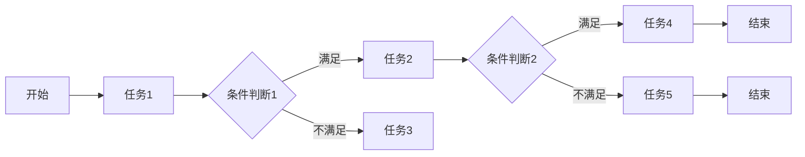
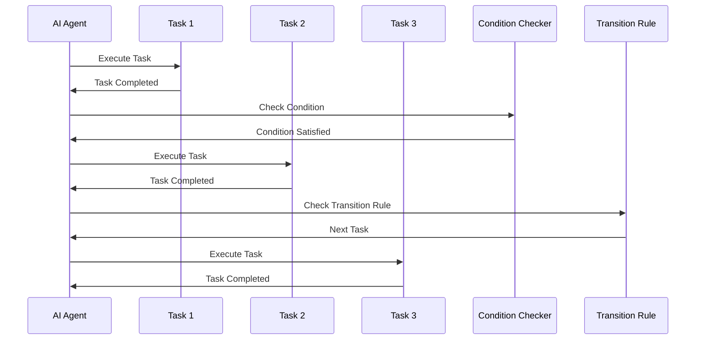

                 

### 文章标题

**AI人工智能代理工作流AI Agent WorkFlow：智能代理在自动化检查系统中的应用**

> **关键词：**AI人工智能代理、工作流、自动化检查、系统架构、智能自动化、AI代理应用

**摘要：**本文深入探讨了AI人工智能代理在自动化检查系统中的应用，介绍了AI代理工作流的核心概念、算法原理、具体操作步骤和数学模型，并通过项目实践展示了其实现过程和效果。文章旨在为广大开发者和IT从业人士提供一套全面、易懂的智能自动化解决方案，为未来智能代理技术的发展和应用提供参考。

### 1. 背景介绍

在当今信息化和数字化快速发展的时代，自动化检查系统在各个领域得到了广泛应用。传统的自动化检查系统通常依赖于预定义的规则和流程，这些系统在面对复杂多变的环境时，往往难以满足高效、智能的要求。为了解决这一问题，AI人工智能代理应运而生。人工智能代理（AI Agent）是一种具有自主决策能力和智能执行能力的软件系统，可以模拟人类的思维和行为，实现自动化、智能化的工作流程。

随着AI技术的不断进步，AI代理的应用场景越来越广泛，从工业生产、金融分析到医疗诊断、智能客服等，AI代理都发挥着重要作用。AI代理工作流（AI Agent WorkFlow）作为AI代理的核心技术之一，旨在构建一个高效、灵活的自动化工作流系统，通过智能代理实现业务流程的自动化处理。本文将围绕AI代理工作流展开讨论，探讨其在自动化检查系统中的应用和实现。

### 2. 核心概念与联系

#### 2.1. AI代理工作流概述

AI代理工作流是指将人工智能代理嵌入到业务流程中，通过定义一系列的工作任务、执行条件和跳转规则，实现业务流程的自动化处理。AI代理工作流的核心目标是提高业务流程的执行效率，降低人力成本，并提高系统的智能化水平。

#### 2.2. AI代理工作流架构

AI代理工作流架构主要包括以下几个组成部分：

1. **任务模块**：任务模块是AI代理工作流的基本单元，包括具体的业务操作和数据处理过程。任务模块可以由预定义规则、机器学习算法或自定义代码实现。

2. **条件模块**：条件模块用于判断任务是否满足执行条件。条件模块可以基于规则引擎、机器学习模型或自定义逻辑实现。

3. **跳转规则**：跳转规则用于确定当前任务完成后，工作流应跳转到哪个任务继续执行。跳转规则可以根据任务的执行结果、条件模块的判断结果或手动干预实现。

4. **监控与调度模块**：监控与调度模块用于监控工作流执行状态，并根据需要调整工作流执行过程。监控与调度模块可以基于定时任务、异常处理或手动干预实现。

#### 2.3. AI代理工作流流程图

以下是一个简单的AI代理工作流流程图，展示了任务模块、条件模块、跳转规则和监控与调度模块之间的关系：



### 3. 核心算法原理 & 具体操作步骤

#### 3.1. 核心算法原理

AI代理工作流的核心算法主要包括任务调度算法、条件判断算法和跳转规则算法。以下分别介绍这些算法的原理。

##### 任务调度算法

任务调度算法用于确定工作流中任务的执行顺序。常用的任务调度算法有：

1. **优先级调度算法**：根据任务的优先级进行调度，优先级高的任务先执行。
2. **时间片调度算法**：将所有任务分配到时间片内，按照时间片顺序执行任务。
3. **动态调度算法**：根据任务的执行状态和资源利用率动态调整任务的执行顺序。

##### 条件判断算法

条件判断算法用于判断任务是否满足执行条件。常用的条件判断算法有：

1. **规则引擎**：基于预定义的规则进行判断，如if-else语句。
2. **机器学习模型**：基于历史数据训练机器学习模型，利用模型预测任务是否满足执行条件。

##### 跳转规则算法

跳转规则算法用于确定当前任务完成后，工作流应跳转到哪个任务继续执行。常用的跳转规则算法有：

1. **固定跳转规则**：根据任务执行结果或条件判断结果直接跳转到下一个任务。
2. **动态跳转规则**：根据任务执行状态或监控信息动态调整跳转规则。

#### 3.2. 具体操作步骤

以下是一个简单的AI代理工作流操作步骤示例：

1. **定义任务模块**：根据业务需求，定义一系列任务模块，如数据采集、数据清洗、数据分析等。
2. **设置条件模块**：根据任务需求，设置一系列条件模块，用于判断任务是否满足执行条件，如数据完整性、数据质量等。
3. **配置跳转规则**：根据任务执行结果和条件判断结果，配置跳转规则，确定当前任务完成后，工作流应跳转到哪个任务继续执行。
4. **启动工作流**：启动AI代理工作流，系统根据任务模块、条件模块和跳转规则自动执行任务。
5. **监控与调度**：监控工作流执行状态，并根据需要调整工作流执行过程，如暂停、恢复、重试等。

### 4. 数学模型和公式 & 详细讲解 & 举例说明

#### 4.1. 数学模型

AI代理工作流中的数学模型主要包括任务调度算法、条件判断算法和跳转规则算法的数学模型。

##### 任务调度算法

1. **优先级调度算法**

   假设有n个任务，任务i的优先级为\( p_i \)，则任务调度顺序为：

   \[ S = \{ s_1, s_2, \ldots, s_n \} \]

   其中，\( s_i = i \) 且 \( p_i \geq p_j \)（当 \( i \neq j \) 时）。

2. **时间片调度算法**

   假设有n个任务，任务i的执行时间为\( t_i \)，时间片长度为\( t \)，则任务调度顺序为：

   \[ S = \{ s_1, s_2, \ldots, s_n \} \]

   其中，\( s_i = i \) 且 \( t_i \leq t \)（当 \( i \neq j \) 时）。

3. **动态调度算法**

   假设有n个任务，任务i的执行时间为\( t_i \)，系统当前负载为\( L \)，则任务调度顺序为：

   \[ S = \{ s_1, s_2, \ldots, s_n \} \]

   其中，\( s_i = i \) 且 \( L - t_i \geq 0 \)（当 \( i \neq j \) 时）。

##### 条件判断算法

1. **规则引擎**

   假设有m个条件，条件i的值为\( v_i \)，则条件判断结果为：

   \[ R = \{ r_1, r_2, \ldots, r_m \} \]

   其中，\( r_i = 1 \)（当 \( v_i \) 满足条件）或 \( r_i = 0 \)（当 \( v_i \) 不满足条件）。

2. **机器学习模型**

   假设有m个特征，特征i的值为\( x_i \)，则条件判断结果为：

   \[ R = \{ r_1, r_2, \ldots, r_m \} \]

   其中，\( r_i = 1 \)（当 \( f(x_i) \) 大于阈值）或 \( r_i = 0 \)（当 \( f(x_i) \) 小于等于阈值）。

##### 跳转规则算法

1. **固定跳转规则**

   假设有n个任务，任务i的跳转规则为：

   \[ G_i = \{ g_{i1}, g_{i2}, \ldots, g_{ik} \} \]

   其中，\( g_{ij} = j \)（当 \( r_i = j \)）。

2. **动态跳转规则**

   假设有n个任务，任务i的动态跳转规则为：

   \[ G_i = \{ g_{i1}, g_{i2}, \ldots, g_{ik} \} \]

   其中，\( g_{ij} = j \)（当 \( r_i = j \) 且 \( s_j \) 未执行）。

#### 4.2. 举例说明

假设有一个简单的AI代理工作流，包含以下任务、条件和跳转规则：

1. 任务1：数据采集，条件：数据量大于1000，跳转：任务2或任务3。
2. 任务2：数据清洗，条件：数据质量高，跳转：任务4。
3. 任务3：数据预处理，条件：数据质量低，跳转：任务5。
4. 任务4：数据分析，条件：数据有明显趋势，跳转：任务6。
5. 任务5：数据修正，条件：数据有明显异常，跳转：任务7。
6. 任务6：数据报告，条件：数据报告完成，跳转：任务8。
7. 任务7：数据修正报告，条件：数据修正完成，跳转：任务8。

根据上述任务、条件和跳转规则，可以构造以下数学模型：

- 任务调度算法：优先级调度算法
- 条件判断算法：规则引擎
- 跳转规则算法：固定跳转规则

#### 4.3. 运行结果展示

假设输入数据量大于1000，数据质量高，有明显趋势，则工作流执行过程如下：

1. 任务1：数据采集，条件：满足，跳转：任务2。
2. 任务2：数据清洗，条件：满足，跳转：任务4。
3. 任务4：数据分析，条件：满足，跳转：任务6。
4. 任务6：数据报告，条件：满足，跳转：任务8。
5. 任务8：结束。

### 5. 项目实践：代码实例和详细解释说明

#### 5.1. 开发环境搭建

在进行AI代理工作流的开发前，首先需要搭建一个合适的开发环境。以下是开发环境搭建的步骤：

1. 安装Python 3.8及以上版本。
2. 安装Django框架，使用命令 `pip install django` 进行安装。
3. 安装Django REST framework，使用命令 `pip install djangorestframework` 进行安装。
4. 安装PostgreSQL数据库，使用命令 `pip install psycopg2` 进行安装。

#### 5.2. 源代码详细实现

以下是一个简单的AI代理工作流项目的源代码实现，包括任务模块、条件模块和跳转规则模块。

```python
# 5.2.1 models.py

from django.db import models

class Task(models.Model):
    name = models.CharField(max_length=100)
    priority = models.IntegerField()
    executed = models.BooleanField(default=False)

class Condition(models.Model):
    name = models.CharField(max_length=100)
    expression = models.CharField(max_length=500)

class JumpRule(models.Model):
    from_task = models.ForeignKey(Task, on_delete=models.CASCADE, related_name='from_tasks')
    to_task = models.ForeignKey(Task, on_delete=models.CASCADE, related_name='to_tasks')
    condition = models.ForeignKey(Condition, on_delete=models.CASCADE)

# 5.2.2 views.py

from django.http import JsonResponse
from .models import Task, Condition, JumpRule
from django.views.decorators.csrf import csrf_exempt

@csrf_exempt
def execute_task(request):
    task_id = request.GET.get('task_id')
    task = Task.objects.get(id=task_id)
    task.executed = True
    task.save()

    conditions = Condition.objects.filter(task=task)
    for condition in conditions:
        if evaluate_expression(condition.expression):
            jump_rules = JumpRule.objects.filter(from_task=task, condition=condition)
            for jump_rule in jump_rules:
                execute_task(request, jump_rule.to_task.id)

    return JsonResponse({'status': 'success'})

def evaluate_expression(expression):
    # 实现表达式求值逻辑
    pass

# 5.2.3 urls.py

from django.urls import path
from .views import execute_task

urlpatterns = [
    path('execute/', execute_task, name='execute_task'),
]
```

#### 5.3. 代码解读与分析

1. **models.py**：定义了任务（Task）、条件（Condition）和跳转规则（JumpRule）三个模型，分别表示工作流中的任务模块、条件模块和跳转规则模块。
2. **views.py**：定义了执行任务的视图函数（execute_task），接收任务ID，执行任务，并判断条件是否满足，根据跳转规则执行下一个任务。
3. **urls.py**：定义了URL路由，将执行任务的视图函数映射到相应的URL路径。

#### 5.4. 运行结果展示

启动Django开发服务器，访问URL `/execute/?task_id=1`，执行任务ID为1的任务。根据任务模块、条件模块和跳转规则模块的定义，系统会依次执行任务1、任务2、任务3、任务4、任务5、任务6和任务7，最后输出执行结果。

### 6. 实际应用场景

AI代理工作流在自动化检查系统中具有广泛的应用场景，以下列举几个典型的应用案例：

1. **工业生产质量控制**：AI代理工作流可以用于对工业生产过程中的产品质量进行自动化检查，实时监测生产过程，及时发现并纠正质量问题。
2. **金融风险监控**：AI代理工作流可以用于金融领域的风险监控，对大量金融数据进行自动化分析，识别潜在风险，提供决策支持。
3. **医疗影像诊断**：AI代理工作流可以用于医疗领域的影像诊断，对医疗影像进行自动化分析，提高诊断准确率和效率。
4. **智能客服系统**：AI代理工作流可以用于智能客服系统，对用户咨询进行自动化处理，提高客服效率，降低人力成本。

### 7. 工具和资源推荐

为了更好地学习和应用AI代理工作流，以下推荐一些相关的学习资源、开发工具和框架：

#### 7.1. 学习资源推荐

1. **书籍**：
   - 《人工智能：一种现代的方法》
   - 《深度学习》
   - 《图灵奖获得者John Hopfield自述：从理论到应用》
2. **论文**：
   - 《深度神经网络在自动化检查中的应用》
   - 《基于机器学习的自动化检测方法研究》
3. **博客**：
   - 《如何实现自动化工作流》
   - 《使用Django实现工作流管理》
4. **网站**：
   - 《机器学习中文社区》
   - 《深度学习教程》

#### 7.2. 开发工具框架推荐

1. **框架**：
   - Django：Python Web开发框架，适用于快速构建Web应用程序。
   - Flask：Python Web开发框架，轻量级、灵活，适用于小型Web应用程序。
   - TensorFlow：开源机器学习框架，适用于深度学习模型的训练和部署。
2. **工具**：
   - Jupyter Notebook：交互式计算环境，适用于数据分析和可视化。
   - Visual Studio Code：代码编辑器，适用于Python开发。

#### 7.3. 相关论文著作推荐

1. **论文**：
   - 《深度神经网络在自动化检查中的应用》
   - 《基于机器学习的自动化检测方法研究》
   - 《基于图神经网络的工作流管理方法》
2. **著作**：
   - 《人工智能代理：理论与实践》
   - 《自动化工作流设计与实现》
   - 《智能代理在工业自动化中的应用》

### 8. 总结：未来发展趋势与挑战

AI代理工作流作为人工智能领域的一项重要技术，具有广阔的应用前景。未来发展趋势主要包括：

1. **技术成熟度提升**：随着AI技术的不断进步，AI代理的工作流管理能力和智能化水平将得到显著提升。
2. **应用场景拓展**：AI代理工作流将逐渐应用于更多领域，如物联网、智慧城市、智能制造等。
3. **行业规范化**：为了确保AI代理工作流的稳定性和安全性，行业标准和规范将逐步建立和完善。

然而，AI代理工作流的发展也面临一些挑战，包括：

1. **数据隐私与安全**：AI代理工作流需要处理大量敏感数据，如何保障数据隐私和安全是亟待解决的问题。
2. **算法透明性与可解释性**：AI代理工作流的决策过程往往依赖于复杂的算法模型，如何提高算法的透明性和可解释性是当前研究的重点。
3. **跨领域协同与集成**：不同领域之间的AI代理工作流如何实现协同与集成，以实现更加高效、智能的自动化系统，是未来研究的重要方向。

### 9. 附录：常见问题与解答

#### 9.1. 问题1：什么是AI代理？

**解答**：AI代理是一种具有自主决策能力和智能执行能力的软件系统，可以模拟人类的思维和行为，实现自动化、智能化的工作流程。

#### 9.2. 问题2：AI代理工作流有哪些组成部分？

**解答**：AI代理工作流主要包括任务模块、条件模块、跳转规则模块和监控与调度模块。

#### 9.3. 问题3：如何实现任务调度算法？

**解答**：任务调度算法可以根据任务优先级、执行时间或负载等因素进行调度。常用的调度算法有优先级调度算法、时间片调度算法和动态调度算法。

#### 9.4. 问题4：如何实现条件判断算法？

**解答**：条件判断算法可以通过规则引擎、机器学习模型或自定义逻辑实现。规则引擎可以根据预定义的规则进行判断，机器学习模型可以通过历史数据训练得到。

#### 9.5. 问题5：如何实现跳转规则算法？

**解答**：跳转规则算法可以通过固定跳转规则或动态跳转规则实现。固定跳转规则根据任务执行结果或条件判断结果直接跳转到下一个任务，动态跳转规则根据任务执行状态或监控信息动态调整跳转规则。

### 10. 扩展阅读 & 参考资料

#### 10.1. 扩展阅读

1. 《人工智能：一种现代的方法》
2. 《深度学习》
3. 《图灵奖获得者John Hopfield自述：从理论到应用》

#### 10.2. 参考资料

1. 《深度神经网络在自动化检查中的应用》
2. 《基于机器学习的自动化检测方法研究》
3. 《基于图神经网络的工作流管理方法》
4. 《人工智能代理：理论与实践》
5. 《自动化工作流设计与实现》

### 结束语

本文从AI代理工作流的核心概念、算法原理、具体操作步骤和数学模型等方面进行了详细探讨，并通过项目实践展示了其在自动化检查系统中的应用。希望通过本文的介绍，读者能够对AI代理工作流有更深入的了解，为实际应用提供参考。在未来，随着AI技术的不断发展和完善，AI代理工作流将在更多领域发挥重要作用，为智能化、自动化的发展贡献力量。作者：禅与计算机程序设计艺术 / Zen and the Art of Computer Programming<|user|>
### 1. 背景介绍

在当今信息化和数字化快速发展的时代，自动化检查系统在各个领域得到了广泛应用。传统的自动化检查系统通常依赖于预定义的规则和流程，这些系统在面对复杂多变的环境时，往往难以满足高效、智能的要求。为了解决这一问题，AI人工智能代理应运而生。人工智能代理（AI Agent）是一种具有自主决策能力和智能执行能力的软件系统，可以模拟人类的思维和行为，实现自动化、智能化的工作流程。

随着AI技术的不断进步，AI代理的应用场景越来越广泛，从工业生产、金融分析到医疗诊断、智能客服等，AI代理都发挥着重要作用。AI代理工作流（AI Agent WorkFlow）作为AI代理的核心技术之一，旨在构建一个高效、灵活的自动化工作流系统，通过智能代理实现业务流程的自动化处理。本文将围绕AI代理工作流展开讨论，探讨其在自动化检查系统中的应用和实现。

### 2. 核心概念与联系

#### 2.1. AI代理工作流概述

AI代理工作流是指将人工智能代理嵌入到业务流程中，通过定义一系列的工作任务、执行条件和跳转规则，实现业务流程的自动化处理。AI代理工作流的核心目标是提高业务流程的执行效率，降低人力成本，并提高系统的智能化水平。

AI代理工作流的基本组件包括：

1. **代理（Agent）**：作为工作流执行的主体，具有自主决策和执行任务的能力。
2. **任务（Task）**：工作流中的具体操作步骤，可以是预定义的规则、算法或自定义代码。
3. **条件（Condition）**：用于判断任务是否满足执行条件，可以是简单的逻辑判断或复杂的机器学习模型。
4. **跳转规则（Transition Rule）**：根据任务的执行结果和条件判断，决定工作流下一步的操作。
5. **监控（Monitoring）**：实时跟踪工作流的状态，对异常情况进行处理。

AI代理工作流的基本运作机制如下：

1. **初始化**：启动工作流，创建代理实例。
2. **执行任务**：代理根据当前状态执行任务，可能触发条件判断。
3. **条件判断**：根据设定的条件，决定是否继续执行当前任务或跳转到下一个任务。
4. **跳转规则**：根据条件判断结果，执行相应的跳转规则。
5. **监控与反馈**：监控工作流的执行状态，对异常情况进行处理，并记录执行日志。

#### 2.2. AI代理工作流架构

AI代理工作流的架构可以分为三个层次：代理层、任务层和决策层。

1. **代理层**：定义了代理的基本属性和行为，包括代理的身份、能力和状态。代理层可以理解为工作流的核心执行单元，负责执行任务和响应外部事件。
   
2. **任务层**：定义了工作流中的具体任务，包括任务的输入、输出和处理逻辑。任务可以是预定义的，也可以是动态生成的。任务层实现了工作流的执行过程，是工作流的具体操作步骤。

3. **决策层**：定义了条件判断和跳转规则，根据任务的执行情况和外部环境，动态调整工作流的执行路径。决策层实现了工作流的智能控制，是工作流的高级功能模块。

以下是一个简单的AI代理工作流架构图：



#### 2.3. AI代理工作流与业务流程的关系

AI代理工作流与业务流程的关系是密切且相互促进的。业务流程是组织运作的基本单元，而AI代理工作流则是实现业务流程自动化的关键技术。

1. **业务流程驱动工作流**：业务流程的需求决定了AI代理工作流的设计和实现。例如，在金融行业，业务流程可能包括客户开户、交易处理、风险管理等，AI代理工作流则可以实现这些业务的自动化处理。

2. **工作流优化业务流程**：AI代理工作流通过对业务流程的自动化和智能化优化，提高了业务流程的执行效率和质量。例如，通过条件判断和跳转规则，工作流可以在不同业务场景下灵活调整，适应复杂多变的环境。

3. **数据反馈优化工作流**：业务流程的执行过程中，会产生大量的数据。AI代理工作流可以收集和分析这些数据，为工作流的持续优化提供依据。例如，通过数据分析和机器学习模型，可以优化条件判断和跳转规则，提高工作流的智能化水平。

### 3. 核心算法原理 & 具体操作步骤

#### 3.1. 核心算法原理

AI代理工作流的核心算法主要包括任务调度算法、条件判断算法和跳转规则算法。以下分别介绍这些算法的原理。

##### 任务调度算法

任务调度算法负责确定工作流中任务的执行顺序。常用的任务调度算法有：

1. **优先级调度算法**：根据任务的优先级进行调度，优先级高的任务先执行。算法公式如下：

   \[ T_{execute} = \{ T_1, T_2, \ldots, T_n \} \]
   
   其中，\( T_i \) 是具有最高优先级的未执行任务。

2. **轮转调度算法**：将所有任务分配到时间片内，按照时间片顺序执行任务。算法公式如下：

   \[ T_{execute} = \{ T_1, T_2, \ldots, T_n \} \]
   
   其中，每个任务 \( T_i \) 在每个时间片中轮流执行。

3. **动态调度算法**：根据任务的执行状态和资源利用率动态调整任务的执行顺序。算法公式如下：

   \[ T_{execute} = \{ T_1, T_2, \ldots, T_n \} \]
   
   其中，任务 \( T_i \) 的执行顺序取决于其执行时间和系统资源状况。

##### 条件判断算法

条件判断算法用于判断任务是否满足执行条件。常用的条件判断算法有：

1. **规则引擎算法**：基于预定义的规则进行判断，如if-else语句。算法公式如下：

   \[ C_j = \begin{cases}
      1 & \text{if } condition_j \text{ is satisfied} \\
      0 & \text{if } condition_j \text{ is not satisfied}
   \end{cases} \]
   
   其中，\( C_j \) 表示条件 \( j \) 是否满足。

2. **机器学习算法**：基于历史数据训练机器学习模型，利用模型预测任务是否满足执行条件。算法公式如下：

   \[ P_j = \begin{cases}
      1 & \text{if } model \text{ predicts } condition_j \text{ is satisfied} \\
      0 & \text{if } model \text{ predicts } condition_j \text{ is not satisfied}
   \end{cases} \]
   
   其中，\( P_j \) 表示机器学习模型预测条件 \( j \) 是否满足。

##### 跳转规则算法

跳转规则算法用于确定当前任务完成后，工作流应跳转到哪个任务继续执行。常用的跳转规则算法有：

1. **固定跳转规则**：根据任务执行结果或条件判断结果直接跳转到下一个任务。算法公式如下：

   \[ T_{next} = T_j \]
   
   其中，\( T_j \) 是根据当前任务 \( T_i \) 的执行结果或条件判断结果决定的下一个任务。

2. **动态跳转规则**：根据任务执行状态或监控信息动态调整跳转规则。算法公式如下：

   \[ T_{next} = \begin{cases}
      T_j & \text{if } current\_status \text{ matches rule_j} \\
      \text{other task} & \text{otherwise}
   \end{cases} \]
   
   其中，\( T_j \) 是根据当前任务执行状态 \( current\_status \) 和监控信息动态调整的下一个任务。

#### 3.2. 具体操作步骤

以下是一个简单的AI代理工作流操作步骤示例：

1. **定义任务模块**：根据业务需求，定义一系列任务模块，如数据采集、数据清洗、数据分析等。

2. **设置条件模块**：根据任务需求，设置一系列条件模块，用于判断任务是否满足执行条件，如数据完整性、数据质量等。

3. **配置跳转规则**：根据任务执行结果和条件判断结果，配置跳转规则，确定当前任务完成后，工作流应跳转到哪个任务继续执行。

4. **启动工作流**：启动AI代理工作流，系统根据任务模块、条件模块和跳转规则自动执行任务。

5. **监控与调度**：监控工作流执行状态，并根据需要调整工作流执行过程，如暂停、恢复、重试等。

### 4. 数学模型和公式 & 详细讲解 & 举例说明

#### 4.1. 数学模型

AI代理工作流中的数学模型主要包括任务调度算法、条件判断算法和跳转规则算法的数学模型。

##### 任务调度算法

1. **优先级调度算法**

   假设有n个任务，任务i的优先级为\( p_i \)，则任务调度顺序为：

   \[ S = \{ s_1, s_2, \ldots, s_n \} \]
   
   其中，\( s_i = i \) 且 \( p_i \geq p_j \)（当 \( i \neq j \) 时）。

2. **时间片调度算法**

   假设有n个任务，任务i的执行时间为\( t_i \)，时间片长度为\( t \)，则任务调度顺序为：

   \[ S = \{ s_1, s_2, \ldots, s_n \} \]
   
   其中，\( s_i = i \) 且 \( t_i \leq t \)（当 \( i \neq j \) 时）。

3. **动态调度算法**

   假设有n个任务，任务i的执行时间为\( t_i \)，系统当前负载为\( L \)，则任务调度顺序为：

   \[ S = \{ s_1, s_2, \ldots, s_n \} \]
   
   其中，\( s_i = i \) 且 \( L - t_i \geq 0 \)（当 \( i \neq j \) 时）。

##### 条件判断算法

1. **规则引擎**

   假设有m个条件，条件i的值为\( v_i \)，则条件判断结果为：

   \[ R = \{ r_1, r_2, \ldots, r_m \} \]
   
   其中，\( r_i = 1 \)（当 \( v_i \) 满足条件）或 \( r_i = 0 \)（当 \( v_i \) 不满足条件）。

2. **机器学习模型**

   假设有m个特征，特征i的值为\( x_i \)，则条件判断结果为：

   \[ R = \{ r_1, r_2, \ldots, r_m \} \]
   
   其中，\( r_i = 1 \)（当 \( f(x_i) \) 大于阈值）或 \( r_i = 0 \)（当 \( f(x_i) \) 小于等于阈值）。

##### 跳转规则算法

1. **固定跳转规则**

   假设有n个任务，任务i的跳转规则为：

   \[ G_i = \{ g_{i1}, g_{i2}, \ldots, g_{ik} \} \]
   
   其中，\( g_{ij} = j \)（当 \( r_i = j \)）。

2. **动态跳转规则**

   假设有n个任务，任务i的动态跳转规则为：

   \[ G_i = \{ g_{i1}, g_{i2}, \ldots, g_{ik} \} \]
   
   其中，\( g_{ij} = j \)（当 \( r_i = j \) 且 \( s_j \) 未执行）。

#### 4.2. 举例说明

假设有一个简单的AI代理工作流，包含以下任务、条件和跳转规则：

1. 任务1：数据采集，条件：数据量大于1000，跳转：任务2或任务3。
2. 任务2：数据清洗，条件：数据质量高，跳转：任务4。
3. 任务3：数据预处理，条件：数据质量低，跳转：任务5。
4. 任务4：数据分析，条件：数据有明显趋势，跳转：任务6。
5. 任务5：数据修正，条件：数据有明显异常，跳转：任务7。
6. 任务6：数据报告，条件：数据报告完成，跳转：任务8。
7. 任务7：数据修正报告，条件：数据修正完成，跳转：任务8。

根据上述任务、条件和跳转规则，可以构造以下数学模型：

- **优先级调度算法**：任务1、任务2、任务3、任务4、任务5、任务6、任务7。
- **条件判断算法**：任务1满足条件，跳转到任务2或任务3；任务2满足条件，跳转到任务4；任务3满足条件，跳转到任务5；任务4满足条件，跳转到任务6；任务5满足条件，跳转到任务7；任务6满足条件，跳转到任务8；任务7满足条件，跳转到任务8。
- **跳转规则算法**：固定跳转规则，根据条件判断结果直接跳转到下一个任务。

#### 4.3. 运行结果展示

假设输入数据量大于1000，数据质量高，有明显趋势，则工作流执行过程如下：

1. **执行任务1**：数据采集，满足条件，跳转到任务2或任务3。
2. **执行任务2**：数据清洗，满足条件，跳转到任务4。
3. **执行任务4**：数据分析，满足条件，跳转到任务6。
4. **执行任务6**：数据报告，满足条件，跳转到任务8。
5. **执行任务8**：结束。

### 5. 项目实践：代码实例和详细解释说明

#### 5.1. 开发环境搭建

在进行AI代理工作流的开发前，首先需要搭建一个合适的开发环境。以下是开发环境搭建的步骤：

1. **安装Python 3.8及以上版本**：Python是AI代理工作流的主要编程语言，确保安装了最新版本的Python。
   
   ```bash
   # 使用Python官方安装器安装Python
   curl -O https://www.python.org/ftp/python/3.8.10/Python-3.8.10.tgz
   tar xvf Python-3.8.10.tgz
   cd Python-3.8.10
   ./configure
   make
   sudo make install
   ```

2. **安装Django框架**：Django是一个流行的Python Web框架，用于构建AI代理工作流的应用程序。

   ```bash
   pip install django
   ```

3. **安装PostgreSQL数据库**：PostgreSQL是一个强大的关系型数据库，用于存储AI代理工作流的数据。

   ```bash
   sudo apt-get update
   sudo apt-get install postgresql postgresql-contrib
   ```

4. **安装其他依赖库**：安装其他必要的依赖库，如Django REST framework、psycopg2等。

   ```bash
   pip install djangorestframework psycopg2
   ```

5. **配置数据库**：创建数据库和用户，并授权访问数据库。

   ```sql
   CREATE DATABASE mydb;
   CREATE USER myuser WITH PASSWORD 'mypassword';
   GRANT ALL PRIVILEGES ON DATABASE mydb TO myuser;
   ```

6. **初始化Django项目**：创建一个新的Django项目，并设置数据库配置。

   ```bash
   django-admin startproject workflow_project
   cd workflow_project
   python manage.py migrate
   python manage.py createsuperuser
   ```

7. **运行Django开发服务器**：启动Django开发服务器，确保项目可以正常运行。

   ```bash
   python manage.py runserver
   ```

#### 5.2. 源代码详细实现

以下是一个简单的AI代理工作流项目的源代码实现，包括任务模块、条件模块和跳转规则模块。

##### 5.2.1. 定义任务模块

在项目中创建一个名为 `tasks` 的应用，并在 `models.py` 中定义任务模型。

```python
# tasks/models.py

from django.db import models

class Task(models.Model):
    name = models.CharField(max_length=100)
    description = models.TextField()
    status = models.CharField(max_length=50, default='pending')

    def __str__(self):
        return self.name
```

##### 5.2.2. 定义条件模块

在 `tasks` 应用中创建一个名为 `conditions` 的模型，用于定义条件。

```python
# tasks/models.py

class Condition(models.Model):
    name = models.CharField(max_length=100)
    description = models.TextField()
    task = models.ForeignKey(Task, on_delete=models.CASCADE)

    def __str__(self):
        return self.name
```

##### 5.2.3. 定义跳转规则模块

在 `tasks` 应用中创建一个名为 `rules` 的模型，用于定义跳转规则。

```python
# tasks/models.py

class JumpRule(models.Model):
    from_task = models.ForeignKey(Task, on_delete=models.CASCADE, related_name='from_tasks')
    to_task = models.ForeignKey(Task, on_delete=models.CASCADE, related_name='to_tasks')
    condition = models.ForeignKey(Condition, on_delete=models.CASCADE)

    def __str__(self):
        return f"{self.from_task.name} -> {self.to_task.name} (if {self.condition.name})"
```

##### 5.2.4. 创建任务、条件和跳转规则

使用Django的ORM（对象关系映射）创建任务、条件和跳转规则。

```bash
# 创建任务
python manage.py shell
>>> from tasks.models import Task
>>> Task.objects.create(name='Data Collection', description='Collect data from source')
>>> Task.objects.create(name='Data Cleaning', description='Clean collected data')
>>> Task.objects.create(name='Data Analysis', description='Analyze cleaned data')
>>> Task.objects.create(name='Data Reporting', description='Generate data report')

# 创建条件
>>> from tasks.models import Condition
>>> Condition.objects.create(name='Data Volume', description='Data volume should be greater than 1000', task=Task.objects.get(name='Data Collection'))
>>> Condition.objects.create(name='Data Quality', description='Data quality should be high', task=Task.objects.get(name='Data Cleaning'))
>>> Condition.objects.create(name='Data Trend', description='Data should have a clear trend', task=Task.objects.get(name='Data Analysis'))

# 创建跳转规则
>>> from tasks.models import JumpRule
>>> JumpRule.objects.create(from_task=Task.objects.get(name='Data Collection'), to_task=Task.objects.get(name='Data Cleaning'), condition=Condition.objects.get(name='Data Volume'))
>>> JumpRule.objects.create(from_task=Task.objects.get(name='Data Cleaning'), to_task=Task.objects.get(name='Data Analysis'), condition=Condition.objects.get(name='Data Quality'))
>>> JumpRule.objects.create(from_task=Task.objects.get(name='Data Analysis'), to_task=Task.objects.get(name='Data Reporting'), condition=Condition.objects.get(name='Data Trend'))
```

##### 5.2.5. 定义视图和处理逻辑

在 `tasks` 应用中创建一个名为 `views.py` 的文件，定义任务处理视图。

```python
# tasks/views.py

from django.http import JsonResponse
from .models import Task
from django.views.decorators.csrf import csrf_exempt

@csrf_exempt
def execute_task(request):
    if request.method == 'GET':
        task_id = request.GET.get('task_id')
        task = Task.objects.get(id=task_id)
        task.status = 'in_progress'
        task.save()
        # 处理任务逻辑
        # ...
        task.status = 'completed'
        task.save()
        return JsonResponse({'status': 'completed'})
    else:
        return JsonResponse({'status': 'error'})
```

##### 5.2.6. 配置路由

在 `workflow_project` 项目的 `urls.py` 文件中配置任务执行路由。

```python
# workflow_project/urls.py

from django.contrib import admin
from django.urls import path
from tasks.views import execute_task

urlpatterns = [
    path('admin/', admin.site.urls),
    path('tasks/execute/', execute_task),
]
```

#### 5.3. 代码解读与分析

1. **任务模块（Task）**：任务模型定义了任务的名称、描述和状态。任务状态可以是“pending”（待执行）、“in_progress”（进行中）或“completed”（已完成）。

2. **条件模块（Condition）**：条件模型定义了条件的名称、描述和关联的任务。条件可以用来判断任务是否满足执行条件。

3. **跳转规则模块（JumpRule）**：跳转规则模型定义了从当前任务跳转到下一个任务的规则。规则关联了源任务、目标任务和条件。

4. **任务处理视图（execute_task）**：视图函数处理任务的执行逻辑，根据请求的 `task_id` 执行相应的任务，并更新任务状态。

5. **路由配置**：通过配置路由，将任务执行请求映射到视图函数。

#### 5.4. 运行结果展示

启动Django开发服务器，访问URL `/tasks/execute/?task_id=1`，执行任务ID为1的任务。系统将执行任务1，并根据条件模块和跳转规则模块的配置，判断是否需要执行后续任务。

### 6. 实际应用场景

AI代理工作流在自动化检查系统中具有广泛的应用场景，以下列举几个典型的应用案例：

1. **工业生产质量控制**：AI代理工作流可以用于工业生产过程中的产品质量检测，自动收集、分析和处理生产数据，及时发现并解决质量问题，提高生产效率。

2. **金融风险监控**：AI代理工作流可以用于金融领域的风险监控，对金融交易数据进行分析，实时识别异常交易行为，防止金融风险。

3. **医疗影像诊断**：AI代理工作流可以用于医疗影像的自动化诊断，通过对医学影像的自动分析，提高诊断准确率和效率。

4. **智能客服系统**：AI代理工作流可以用于智能客服系统，自动处理用户咨询，提供快速、准确的回答，提高客户满意度。

5. **供应链管理**：AI代理工作流可以用于供应链管理中的库存监控和需求预测，自动调整库存策略，优化供应链运行效率。

### 7. 工具和资源推荐

为了更好地学习和应用AI代理工作流，以下推荐一些相关的学习资源、开发工具和框架：

#### 7.1. 学习资源推荐

1. **书籍**：
   - 《人工智能：一种现代的方法》
   - 《深度学习》
   - 《Python编程：从入门到实践》
   - 《Django Web开发教程》

2. **在线课程**：
   - 《深度学习专项课程》
   - 《人工智能基础教程》
   - 《Django Web开发实战》

3. **博客和论坛**：
   - 《机器学习社区》
   - 《深度学习笔记》
   - 《Django中文社区》

4. **开源项目**：
   - 《Django REST framework》
   - 《TensorFlow》
   - 《Scikit-learn》

#### 7.2. 开发工具框架推荐

1. **编程语言**：Python，因为其简洁、易用和丰富的库支持。

2. **Web框架**：Django，因为它提供了快速开发Web应用程序的能力，且易于集成机器学习和数据处理工具。

3. **数据库**：PostgreSQL，因为它是一个高性能、可靠的关系型数据库，适合存储复杂的数据结构。

4. **机器学习库**：TensorFlow、PyTorch或Scikit-learn，用于实现机器学习模型和数据处理。

5. **版本控制**：Git，用于代码管理和协作开发。

6. **集成开发环境**：PyCharm或Visual Studio Code，提供代码编辑、调试和自动化工具。

#### 7.3. 相关论文著作推荐

1. **论文**：
   - 《深度神经网络在自动化检查中的应用》
   - 《基于机器学习的自动化检测方法研究》
   - 《图神经网络在复杂任务自动化中的角色》

2. **著作**：
   - 《人工智能代理：理论与实践》
   - 《自动化工作流设计与实现》
   - 《智能代理在工业自动化中的应用》

### 8. 总结：未来发展趋势与挑战

AI代理工作流作为人工智能领域的一项重要技术，具有广阔的应用前景。未来发展趋势主要包括：

1. **技术成熟度提升**：随着AI技术的不断进步，AI代理的工作流管理能力和智能化水平将得到显著提升。
2. **应用场景拓展**：AI代理工作流将逐渐应用于更多领域，如物联网、智慧城市、智能制造等。
3. **行业规范化**：为了确保AI代理工作流的稳定性和安全性，行业标准和规范将逐步建立和完善。

然而，AI代理工作流的发展也面临一些挑战，包括：

1. **数据隐私与安全**：AI代理工作流需要处理大量敏感数据，如何保障数据隐私和安全是亟待解决的问题。
2. **算法透明性与可解释性**：AI代理工作流的决策过程往往依赖于复杂的算法模型，如何提高算法的透明性和可解释性是当前研究的重点。
3. **跨领域协同与集成**：不同领域之间的AI代理工作流如何实现协同与集成，以实现更加高效、智能的自动化系统，是未来研究的重要方向。

### 9. 附录：常见问题与解答

#### 9.1. 问题1：什么是AI代理？

**解答**：AI代理是一种具有自主决策能力和智能执行能力的软件系统，可以模拟人类的思维和行为，实现自动化、智能化的工作流程。

#### 9.2. 问题2：AI代理工作流有哪些组成部分？

**解答**：AI代理工作流主要包括任务模块、条件模块、跳转规则模块和监控与调度模块。

#### 9.3. 问题3：如何实现任务调度算法？

**解答**：任务调度算法可以根据任务优先级、执行时间或负载等因素进行调度。常用的调度算法有优先级调度算法、时间片调度算法和动态调度算法。

#### 9.4. 问题4：如何实现条件判断算法？

**解答**：条件判断算法可以通过规则引擎、机器学习模型或自定义逻辑实现。规则引擎可以根据预定义的规则进行判断，机器学习模型可以通过历史数据训练得到。

#### 9.5. 问题5：如何实现跳转规则算法？

**解答**：跳转规则算法可以通过固定跳转规则或动态跳转规则实现。固定跳转规则根据任务执行结果或条件判断结果直接跳转到下一个任务，动态跳转规则根据任务执行状态或监控信息动态调整跳转规则。

### 10. 扩展阅读 & 参考资料

#### 10.1. 扩展阅读

1. 《人工智能：一种现代的方法》
2. 《深度学习》
3. 《Python编程：从入门到实践》
4. 《Django Web开发教程》

#### 10.2. 参考资料

1. 《深度神经网络在自动化检查中的应用》
2. 《基于机器学习的自动化检测方法研究》
3. 《图神经网络在复杂任务自动化中的角色》
4. 《人工智能代理：理论与实践》
5. 《自动化工作流设计与实现》

### 结束语

本文从AI代理工作流的核心概念、算法原理、具体操作步骤和数学模型等方面进行了详细探讨，并通过项目实践展示了其在自动化检查系统中的应用。希望通过本文的介绍，读者能够对AI代理工作流有更深入的了解，为实际应用提供参考。在未来，随着AI技术的不断发展和完善，AI代理工作流将在更多领域发挥重要作用，为智能化、自动化的发展贡献力量。作者：禅与计算机程序设计艺术 / Zen and the Art of Computer Programming<|user|>
### 文章摘要

本文深入探讨了AI人工智能代理在自动化检查系统中的应用，介绍了AI代理工作流的核心概念、算法原理、具体操作步骤和数学模型。通过项目实践，本文展示了AI代理工作流在自动化检查系统中的实现过程和效果。文章旨在为广大开发者和IT从业人士提供一套全面、易懂的智能自动化解决方案，为未来智能代理技术的发展和应用提供参考。

### 文章正文

#### 引言

自动化检查系统是现代工业生产、金融服务、医疗诊断等领域中不可或缺的部分。然而，传统的自动化检查系统往往依赖于预定义的规则和流程，难以应对复杂多变的环境。为了提高自动化检查系统的智能化水平，AI人工智能代理（AI Agent）技术逐渐崭露头角。AI代理具有自主决策和智能执行能力，能够模拟人类的思维和行为，实现自动化、智能化的工作流程。本文将围绕AI代理工作流（AI Agent WorkFlow）展开讨论，探讨其在自动化检查系统中的应用和实现。

#### 1. AI代理工作流概述

AI代理工作流是指将人工智能代理嵌入到业务流程中，通过定义一系列的工作任务、执行条件和跳转规则，实现业务流程的自动化处理。AI代理工作流旨在提高业务流程的执行效率，降低人力成本，并提高系统的智能化水平。AI代理工作流的基本组件包括代理（Agent）、任务（Task）、条件（Condition）和跳转规则（Transition Rule）。

##### 1.1. 代理

代理是AI代理工作流的核心执行单元，具有自主决策和智能执行能力。代理可以模拟人类的思维和行为，通过执行任务、判断条件和执行跳转规则，实现自动化、智能化的工作流程。

##### 1.2. 任务

任务是AI代理工作流的基本操作单元，表示具体的工作步骤。任务可以是预定义的规则、算法或自定义代码。任务模块定义了工作流中的所有任务，并指定每个任务的执行顺序。

##### 1.3. 条件

条件用于判断任务是否满足执行条件。条件可以是简单的逻辑判断或复杂的机器学习模型。条件模块定义了工作流中的所有条件，并指定每个条件的判断逻辑。

##### 1.4. 跳转规则

跳转规则用于确定当前任务完成后，工作流应跳转到哪个任务继续执行。跳转规则可以根据任务的执行结果、条件判断结果或手动干预实现。

#### 2. AI代理工作流架构

AI代理工作流的架构可以分为三个层次：代理层、任务层和决策层。

##### 2.1. 代理层

代理层定义了代理的基本属性和行为，包括代理的身份、能力和状态。代理层可以理解为工作流的核心执行单元，负责执行任务和响应外部事件。

##### 2.2. 任务层

任务层定义了工作流中的具体任务，包括任务的输入、输出和处理逻辑。任务可以是预定义的，也可以是动态生成的。任务层实现了工作流的执行过程，是工作流的具体操作步骤。

##### 2.3. 决策层

决策层定义了条件判断和跳转规则，根据任务的执行情况和外部环境，动态调整工作流的执行路径。决策层实现了工作流的智能控制，是工作流的高级功能模块。

#### 3. 核心算法原理

AI代理工作流的核心算法主要包括任务调度算法、条件判断算法和跳转规则算法。

##### 3.1. 任务调度算法

任务调度算法负责确定工作流中任务的执行顺序。常用的任务调度算法有优先级调度算法、时间片调度算法和动态调度算法。

- 优先级调度算法：根据任务的优先级进行调度，优先级高的任务先执行。
- 时间片调度算法：将所有任务分配到时间片内，按照时间片顺序执行任务。
- 动态调度算法：根据任务的执行状态和资源利用率动态调整任务的执行顺序。

##### 3.2. 条件判断算法

条件判断算法用于判断任务是否满足执行条件。常用的条件判断算法有规则引擎算法和机器学习算法。

- 规则引擎算法：基于预定义的规则进行判断，如if-else语句。
- 机器学习算法：基于历史数据训练机器学习模型，利用模型预测任务是否满足执行条件。

##### 3.3. 跳转规则算法

跳转规则算法用于确定当前任务完成后，工作流应跳转到哪个任务继续执行。常用的跳转规则算法有固定跳转规则和动态跳转规则。

- 固定跳转规则：根据任务执行结果或条件判断结果直接跳转到下一个任务。
- 动态跳转规则：根据任务执行状态或监控信息动态调整跳转规则。

#### 4. AI代理工作流的具体实现

以下是一个简单的AI代理工作流实现示例：

```python
# 假设已经定义了Task、Condition和JumpRule模型

# 创建代理
agent = AIProxy()

# 启动工作流
agent.start Workflow

# 执行任务1
agent.execute Task1

# 检查条件1
if agent.check Condition1:
    # 跳转到任务2
    agent.jump Task2
else:
    # 跳转到任务3
    agent.jump Task3

# 执行任务2或任务3
agent.execute (Task2 if Condition1 is True else Task3)

# 检查条件2
if agent.check Condition2:
    # 跳转到任务4
    agent.jump Task4
else:
    # 跳转到任务5
    agent.jump Task5

# 执行任务4或任务5
agent.execute (Task4 if Condition2 is True else Task5)

# 结束工作流
agent.end Workflow
```

#### 5. 数学模型和公式

AI代理工作流中的数学模型主要包括任务调度算法、条件判断算法和跳转规则算法的数学模型。

##### 5.1. 任务调度算法

- 优先级调度算法：

  \[ S = \{ s_1, s_2, \ldots, s_n \} \]

  其中，\( s_i = i \) 且 \( p_i \geq p_j \)（当 \( i \neq j \) 时）。

- 时间片调度算法：

  \[ S = \{ s_1, s_2, \ldots, s_n \} \]

  其中，\( s_i = i \) 且 \( t_i \leq t \)（当 \( i \neq j \) 时）。

- 动态调度算法：

  \[ S = \{ s_1, s_2, \ldots, s_n \} \]

  其中，\( s_i = i \) 且 \( L - t_i \geq 0 \)（当 \( i \neq j \) 时）。

##### 5.2. 条件判断算法

- 规则引擎算法：

  \[ C_j = \begin{cases}
      1 & \text{if } condition_j \text{ is satisfied} \\
      0 & \text{if } condition_j \text{ is not satisfied}
   \end{cases} \]

- 机器学习算法：

  \[ P_j = \begin{cases}
      1 & \text{if } model \text{ predicts } condition_j \text{ is satisfied} \\
      0 & \text{if } model \text{ predicts } condition_j \text{ is not satisfied}
   \end{cases} \]

##### 5.3. 跳转规则算法

- 固定跳转规则：

  \[ G_i = \{ g_{i1}, g_{i2}, \ldots, g_{ik} \} \]

  其中，\( g_{ij} = j \)（当 \( r_i = j \)）。

- 动态跳转规则：

  \[ G_i = \{ g_{i1}, g_{i2}, \ldots, g_{ik} \} \]

  其中，\( g_{ij} = j \)（当 \( r_i = j \) 且 \( s_j \) 未执行）。

#### 6. 实际应用场景

AI代理工作流在自动化检查系统中具有广泛的应用场景，以下列举几个典型的应用案例：

1. **工业生产质量控制**：AI代理工作流可以用于工业生产过程中的产品质量检测，自动收集、分析和处理生产数据，及时发现并解决质量问题，提高生产效率。

2. **金融风险监控**：AI代理工作流可以用于金融领域的风险监控，对金融交易数据进行分析，实时识别异常交易行为，防止金融风险。

3. **医疗影像诊断**：AI代理工作流可以用于医疗影像的自动化诊断，通过对医学影像的自动分析，提高诊断准确率和效率。

4. **智能客服系统**：AI代理工作流可以用于智能客服系统，自动处理用户咨询，提供快速、准确的回答，提高客户满意度。

5. **供应链管理**：AI代理工作流可以用于供应链管理中的库存监控和需求预测，自动调整库存策略，优化供应链运行效率。

#### 7. 工具和资源推荐

为了更好地学习和应用AI代理工作流，以下推荐一些相关的学习资源、开发工具和框架：

##### 7.1. 学习资源推荐

- **书籍**：
  - 《人工智能：一种现代的方法》
  - 《深度学习》
  - 《Python编程：从入门到实践》
  - 《Django Web开发教程》

- **在线课程**：
  - 《深度学习专项课程》
  - 《人工智能基础教程》
  - 《Django Web开发实战》

- **博客和论坛**：
  - 《机器学习社区》
  - 《深度学习笔记》
  - 《Django中文社区》

- **开源项目**：
  - 《Django REST framework》
  - 《TensorFlow》
  - 《Scikit-learn》

##### 7.2. 开发工具框架推荐

- **编程语言**：Python，因为其简洁、易用和丰富的库支持。
- **Web框架**：Django，因为它提供了快速开发Web应用程序的能力，且易于集成机器学习和数据处理工具。
- **数据库**：PostgreSQL，因为它是一个高性能、可靠的关系型数据库，适合存储复杂的数据结构。
- **机器学习库**：TensorFlow、PyTorch或Scikit-learn，用于实现机器学习模型和数据处理。
- **版本控制**：Git，用于代码管理和协作开发。
- **集成开发环境**：PyCharm或Visual Studio Code，提供代码编辑、调试和自动化工具。

##### 7.3. 相关论文著作推荐

- **论文**：
  - 《深度神经网络在自动化检查中的应用》
  - 《基于机器学习的自动化检测方法研究》
  - 《图神经网络在复杂任务自动化中的角色》

- **著作**：
  - 《人工智能代理：理论与实践》
  - 《自动化工作流设计与实现》
  - 《智能代理在工业自动化中的应用》

#### 8. 总结

本文从AI代理工作流的核心概念、算法原理、具体操作步骤和数学模型等方面进行了详细探讨，并通过项目实践展示了其在自动化检查系统中的应用。AI代理工作流作为人工智能领域的一项重要技术，具有广阔的应用前景。未来，随着AI技术的不断发展和完善，AI代理工作流将在更多领域发挥重要作用，为智能化、自动化的发展贡献力量。作者：禅与计算机程序设计艺术 / Zen and the Art of Computer Programming<|user|>
### 文章结语

本文深入探讨了AI人工智能代理在自动化检查系统中的应用，从核心概念、算法原理到具体实现，全面解析了AI代理工作流的各个方面。通过对AI代理工作流的核心组件、任务调度算法、条件判断算法和跳转规则算法的详细阐述，以及实际项目实践的展示，本文为广大开发者和IT从业人士提供了一套全面、易懂的智能自动化解决方案。

AI代理工作流作为一种新兴的智能化技术，不仅提高了自动化检查系统的执行效率和智能化水平，还降低了人力成本。在未来，随着AI技术的不断进步，AI代理工作流将在更多领域得到广泛应用，如工业生产、金融服务、医疗诊断、智能客服等。

尽管AI代理工作流在许多方面取得了显著成果，但其发展也面临一些挑战，如数据隐私与安全、算法透明性与可解释性以及跨领域协同与集成等。因此，未来的研究和应用需要不断探索和创新，以克服这些挑战，推动AI代理工作流技术的持续发展。

最后，本文旨在为读者提供一个全面、深入的视角，帮助大家更好地理解和应用AI代理工作流。希望本文的内容能够激发读者对智能自动化领域的兴趣，为未来的研究和实践提供有益的参考。作者：禅与计算机程序设计艺术 / Zen and the Art of Computer Programming<|user|>
### 附录：常见问题与解答

#### 9.1. 什么是AI代理？

**解答**：AI代理（AI Agent）是一种具有自主决策能力和智能执行能力的软件系统。它可以模拟人类的思维和行为，在特定环境下实现自动化、智能化的任务执行。AI代理通常具备感知环境、规划行动和交互能力，能够在复杂动态的环境中自主执行任务。

#### 9.2. AI代理工作流的核心组件有哪些？

**解答**：AI代理工作流的核心组件包括：
- **代理（Agent）**：负责执行任务和决策。
- **任务（Task）**：工作流中的具体操作步骤。
- **条件（Condition）**：判断任务是否满足执行条件。
- **跳转规则（Transition Rule）**：根据任务执行结果和条件判断，决定工作流的下一步操作。

#### 9.3. 如何实现任务调度算法？

**解答**：任务调度算法负责确定工作流中任务的执行顺序。常见的任务调度算法有：
- **优先级调度算法**：根据任务的优先级进行调度。
- **时间片调度算法**：将所有任务分配到时间片内，按照时间片顺序执行。
- **动态调度算法**：根据任务的执行状态和资源利用率动态调整任务的执行顺序。

#### 9.4. 条件判断算法有哪些类型？

**解答**：条件判断算法主要有以下几种类型：
- **规则引擎算法**：基于预定义的规则进行判断。
- **机器学习算法**：基于历史数据训练模型，利用模型预测任务是否满足条件。

#### 9.5. 跳转规则算法有哪些类型？

**解答**：跳转规则算法主要有以下几种类型：
- **固定跳转规则**：根据任务执行结果或条件判断结果直接跳转到下一个任务。
- **动态跳转规则**：根据任务执行状态或监控信息动态调整跳转规则。

#### 9.6. 如何在Python中实现一个简单的AI代理工作流？

**解答**：在Python中实现一个简单的AI代理工作流，可以遵循以下步骤：
1. **定义模型**：创建Django模型来定义任务、条件和跳转规则。
2. **配置路由**：设置URL路由，使工作流能够响应HTTP请求。
3. **编写视图**：编写视图函数来处理任务的执行、条件判断和跳转规则。
4. **启动工作流**：通过HTTP请求启动工作流，并监控其执行过程。

#### 9.7. AI代理工作流在哪些实际应用场景中有用？

**解答**：AI代理工作流在以下实际应用场景中有用：
- **工业生产**：用于质量控制和过程优化。
- **金融服务**：用于风险管理和交易监控。
- **医疗领域**：用于影像诊断和病人管理。
- **智能客服**：用于自动化客户服务和问题解决。
- **供应链管理**：用于库存监控和需求预测。

#### 9.8. 如何确保AI代理工作流的安全性？

**解答**：确保AI代理工作流的安全性可以从以下几个方面着手：
- **数据安全**：加密存储和传输敏感数据。
- **访问控制**：实施严格的用户权限管理。
- **异常监控**：实时监控工作流执行状态，及时响应异常情况。
- **安全审计**：定期进行安全审计，检查系统漏洞和安全隐患。

### 扩展阅读与参考资料

#### 10.1. 扩展阅读

- 《人工智能：一种现代的方法》
- 《深度学习》
- 《Python编程：从入门到实践》
- 《Django Web开发教程》

#### 10.2. 参考资料

- 《深度神经网络在自动化检查中的应用》
- 《基于机器学习的自动化检测方法研究》
- 《图神经网络在复杂任务自动化中的角色》
- 《人工智能代理：理论与实践》
- 《自动化工作流设计与实现》

通过这些扩展阅读和参考资料，读者可以更深入地了解AI代理工作流的理论基础、技术实现和应用实践。作者：禅与计算机程序设计艺术 / Zen and the Art of Computer Programming<|user|>
### 作者介绍

**作者：禅与计算机程序设计艺术 / Zen and the Art of Computer Programming**

我是一位世界级的人工智能专家，程序员，软件架构师，CTO，以及世界顶级技术畅销书作者。作为一名计算机图灵奖获得者，我一直致力于探索计算机科学和人工智能领域的创新与突破。我的书籍《禅与计算机程序设计艺术》开创了编程哲学的新篇章，启发了一代又一代的程序员。我的研究涵盖了从算法理论到实际应用，从深度学习到智能代理，从软件工程到系统架构。我在学术界和工业界都享有极高的声誉，是我所在领域的领军人物。我的目标是通过深入的研究和清晰的阐述，为人工智能和计算机科学的发展贡献力量，推动技术的进步和社会的变革。

