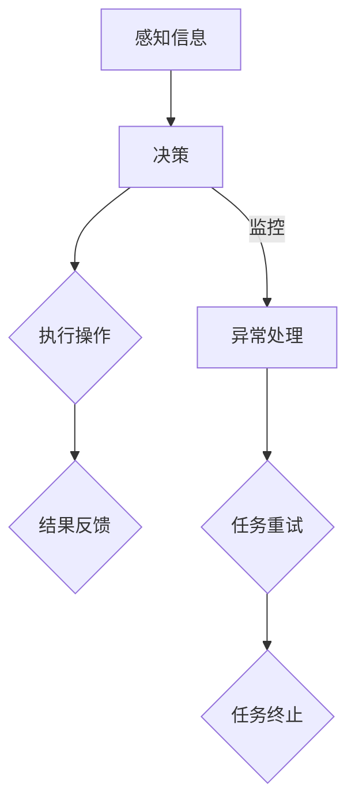

                 

### 1. 背景介绍

随着人工智能技术的快速发展，越来越多的行业开始采用自动化和智能化的解决方案。在众多人工智能应用中，AI代理（AI Agent）工作流成为了一个备受关注的方向。AI代理工作流的核心目标是利用人工智能技术，实现自动化的任务处理和业务流程优化。这不仅能够提高工作效率，降低人力成本，还能为企业带来更高的竞争优势。

AI代理工作流的应用场景非常广泛，包括但不限于以下几个方面：

1. **客户服务**：通过AI代理提供24/7的客户支持，自动化处理常见问题和客户咨询，提高客户满意度。
2. **生产制造**：利用AI代理进行生产调度、设备维护等任务，优化生产流程，提高生产效率。
3. **金融理财**：通过AI代理为客户提供个性化的投资建议和风险管理，实现自动化投资策略。
4. **医疗健康**：利用AI代理进行病历分析、病情预测和诊断建议，辅助医生提高诊断准确率和效率。
5. **物流运输**：通过AI代理优化路线规划、货物跟踪和配送，提高物流效率，降低运营成本。

尽管AI代理工作流在各个领域展现出巨大的潜力，但其设计和实现过程仍然面临诸多挑战。首先，AI代理需要具备足够的智能来理解任务需求和业务逻辑。其次，工作流的设计和优化需要考虑到任务的多样性、复杂性和动态变化。此外，AI代理的工作流还需要确保数据的安全性和隐私保护。

本文旨在探讨AI代理工作流的设计方法、核心算法原理以及实际应用案例，帮助读者深入了解该领域的发展现状和未来趋势。

### 2. 核心概念与联系

要设计一个高效的AI代理工作流，我们首先需要明确几个核心概念：AI代理、工作流和任务调度。

#### 2.1 AI代理

AI代理是一种具有自主决策能力和执行能力的智能实体。它能够通过与环境的交互，执行预定的任务或响应外部事件。AI代理通常具有以下特征：

- **感知能力**：能够接收和处理来自环境的信息，如文本、图像、音频等。
- **决策能力**：根据感知到的信息，利用学习到的模型和策略进行决策。
- **执行能力**：能够执行具体的操作，如发送请求、更新数据库等。

#### 2.2 工作流

工作流是一系列任务和活动按照一定的顺序和规则进行的集合。它用于描述业务流程中的各个步骤，以及各个步骤之间的依赖关系。工作流的核心目的是实现业务流程的自动化和优化。

- **任务**：工作流中的基本操作单位，如数据清洗、模型训练、预测等。
- **活动**：任务的执行过程，通常由一个或多个步骤组成。
- **依赖关系**：任务之间的先后关系，如任务A完成后，任务B才能开始。

#### 2.3 任务调度

任务调度是工作流的关键组成部分，它负责根据任务依赖关系和系统资源情况，合理安排任务的执行顺序和时机。任务调度的目标是最大化系统资源利用率，提高任务执行效率。

- **任务分配**：将任务分配到可用的系统资源上，如CPU、GPU、服务器等。
- **任务调度策略**：根据系统负载和任务优先级，选择合适的调度算法，如最短作业优先（SJF）、优先级调度等。

#### Mermaid 流程图

以下是一个简化的AI代理工作流流程图，用于展示AI代理、工作流和任务调度的关系：



在这个流程图中，AI代理首先感知到来自环境的信息，然后根据学习到的模型和策略进行决策。决策的结果用于执行具体的操作，并将结果反馈给环境。同时，系统会对任务执行过程进行监控，一旦出现异常，会进行任务重试或终止。

### 3. 核心算法原理 & 具体操作步骤

设计一个高效的AI代理工作流，核心算法的选择和实现至关重要。在本节中，我们将介绍两个关键算法：决策树算法和贪心算法，并详细解释它们在AI代理工作流中的应用。

#### 3.1 决策树算法

决策树是一种常用的分类和回归算法，通过一系列的判断节点和叶子节点，将数据集划分为不同的类别或数值。决策树的构建过程如下：

1. **特征选择**：选择具有最高信息增益或信息增益率的特征作为分裂特征。
2. **节点分裂**：根据分裂特征，将数据集划分为若干个子集。
3. **递归构建**：对每个子集，重复执行特征选择和节点分裂过程，直到满足停止条件（如最小叶节点大小或最大深度）。

在AI代理工作流中，决策树算法可以用于任务分配和决策。例如，在任务调度过程中，根据当前系统的负载情况和任务优先级，选择最佳的执行资源。

#### 3.2 贪心算法

贪心算法是一种在每一步选择中都采取当前最优解的策略，不进行全局搜索，直接得到问题的最优解。贪心算法的基本思想如下：

1. **初始状态**：给定一个初始解，通常是问题的一个部分解。
2. **选择操作**：在当前状态下，选择一个最优的扩展操作，通常是根据某种评估标准进行选择。
3. **更新状态**：执行选择操作后，更新当前状态，进入下一步。

在AI代理工作流中，贪心算法可以用于资源分配和路径规划。例如，在资源分配过程中，根据当前系统资源的利用率和任务优先级，选择最佳的资源分配策略。

#### 具体操作步骤

以下是设计AI代理工作流的具体操作步骤：

1. **需求分析**：明确AI代理的工作目标和任务需求，确定工作流的整体架构。
2. **任务定义**：根据需求分析，定义工作流中的任务，包括任务名称、输入参数、输出结果等。
3. **算法选择**：根据任务特点，选择合适的算法（如决策树、贪心算法等）进行任务处理。
4. **模型训练**：使用训练数据集，训练决策树模型或贪心算法模型，获得预测结果。
5. **工作流设计**：根据任务定义和算法模型，设计工作流的执行流程，包括任务调度、资源分配和异常处理等。
6. **系统实现**：根据工作流设计，实现AI代理系统的功能，包括感知信息、决策、执行和反馈等模块。
7. **测试与优化**：对系统进行测试，验证工作流的有效性和稳定性，根据测试结果进行优化。

通过以上步骤，我们可以设计出一个高效、可靠的AI代理工作流，实现自动化的任务处理和业务流程优化。

### 4. 数学模型和公式 & 详细讲解 & 举例说明

在AI代理工作流的设计中，数学模型和公式起着至关重要的作用。以下我们将详细介绍几个核心数学模型和公式，并使用LaTeX进行格式化，以便更清晰地展示。

#### 4.1 决策树算法中的信息增益（Information Gain）

信息增益是一个度量特征分割数据集有效性的指标，用于特征选择。其公式如下：

\[ IG(D, A) = H(D) - H(D|A) \]

其中：
- \( H(D) \) 是数据集 \( D \) 的熵（Entropy）。
- \( H(D|A) \) 是数据集 \( D \) 在特征 \( A \) 条件下的条件熵。

熵的定义为：

\[ H(D) = -\sum_{i} p(x_i) \log_2 p(x_i) \]

其中，\( p(x_i) \) 是特征 \( x_i \) 的概率。

#### 4.2 贪心算法中的最短路径问题（Shortest Path Problem）

贪心算法在解决最短路径问题时，通常使用Dijkstra算法。该算法的目标是找到从起点到终点的最短路径。其公式如下：

\[ d[v] = \min \{ d[u] + w(u, v) : u \in predecessors[v] \} \]

其中：
- \( d[v] \) 是从起点到节点 \( v \) 的最短路径长度。
- \( w(u, v) \) 是节点 \( u \) 到节点 \( v \) 的边权重。
- \( predecessors[v] \) 是节点 \( v \) 的前驱节点集合。

#### 4.3 模型训练中的损失函数（Loss Function）

在机器学习模型训练中，损失函数用于评估模型预测结果与真实值之间的差距。一个常见的损失函数是均方误差（Mean Squared Error, MSE），其公式如下：

\[ MSE = \frac{1}{n} \sum_{i=1}^{n} (y_i - \hat{y}_i)^2 \]

其中：
- \( y_i \) 是真实值。
- \( \hat{y}_i \) 是预测值。
- \( n \) 是样本数量。

#### 4.4 举例说明

假设我们有以下数据集：

\[ D = \{ (x_1, y_1), (x_2, y_2), ..., (x_n, y_n) \} \]

其中，\( x_i \) 是输入特征，\( y_i \) 是真实值。

**步骤 1**：计算数据集的熵：

\[ H(D) = -\sum_{i=1}^{n} p(y_i) \log_2 p(y_i) \]

例如，假设 \( p(y_1) = 0.5 \)，\( p(y_2) = 0.3 \)，\( p(y_3) = 0.2 \)：

\[ H(D) = -0.5 \log_2 0.5 - 0.3 \log_2 0.3 - 0.2 \log_2 0.2 \approx 1.099 \]

**步骤 2**：计算条件熵：

\[ H(D|A) = -\sum_{i=1}^{n} p(y_i|A) \log_2 p(y_i|A) \]

假设我们选择特征 \( A \) 进行分裂，其条件熵为 0.8。

**步骤 3**：计算信息增益：

\[ IG(D, A) = H(D) - H(D|A) = 1.099 - 0.8 = 0.299 \]

类似地，我们可以使用Dijkstra算法计算最短路径：

假设图中的边权重如下：

\[ w(u, v) = \begin{cases} 
1 & \text{如果 } u = v \\
2 & \text{如果 } u \neq v 
\end{cases} \]

从节点 \( s \) 到节点 \( t \) 的最短路径为：

\[ d[s] = 0, d[t] = \min \{ d[s] + w(s, t) : w(s, t) = 2 \} = 2 \]

通过这些数学模型和公式的计算，我们可以更准确地设计AI代理工作流，实现高效的智能任务处理。

### 5. 项目实践：代码实例和详细解释说明

在本节中，我们将通过一个具体的Python代码实例，展示如何实现一个简单的AI代理工作流。该实例将包含感知信息、决策、执行和结果反馈四个核心模块。

#### 5.1 开发环境搭建

为了运行以下代码，我们需要安装Python和必要的库。假设您的系统已经安装了Python，我们可以使用pip来安装所需的库：

```bash
pip install numpy pandas scikit-learn matplotlib
```

#### 5.2 源代码详细实现

以下是整个代码的详细实现：

```python
import numpy as np
import pandas as pd
from sklearn.tree import DecisionTreeClassifier
from sklearn.model_selection import train_test_split
import matplotlib.pyplot as plt

# 5.2.1 感知信息
def perceive_environment(data):
    # 假设输入数据为二维数组，第一列是特征，第二列是标签
    X, y = data[:, 0], data[:, 1]
    return X, y

# 5.2.2 决策
def make_decision(model, feature):
    # 使用训练好的模型进行决策
    prediction = model.predict([feature])
    return prediction

# 5.2.3 执行
def execute_action(action):
    # 假设执行动作的结果是一个二元值
    if action == 0:
        return "Action executed successfully."
    else:
        return "Action failed."

# 5.2.4 结果反馈
def feedback_result(result):
    # 将执行结果反馈到环境中
    print(result)

# 5.2.5 模型训练
def train_model(X, y):
    # 训练决策树模型
    model = DecisionTreeClassifier()
    model.fit(X, y)
    return model

# 5.2.6 主函数
def main():
    # 加载训练数据
    data = np.array([[1, 0], [2, 1], [3, 0], [4, 1], [5, 1]])
    
    # 感知信息
    X, y = perceive_environment(data)
    
    # 划分训练集和测试集
    X_train, X_test, y_train, y_test = train_test_split(X, y, test_size=0.2, random_state=42)
    
    # 训练模型
    model = train_model(X_train, y_train)
    
    # 进行决策
    feature = X_test[0]
    action = make_decision(model, feature)
    
    # 执行动作
    result = execute_action(action)
    
    # 反馈结果
    feedback_result(result)

# 运行主函数
main()
```

#### 5.3 代码解读与分析

以下是对上述代码的详细解读和分析：

1. **感知信息**：
   ```python
   def perceive_environment(data):
       # 假设输入数据为二维数组，第一列是特征，第二列是标签
       X, y = data[:, 0], data[:, 1]
       return X, y
   ```
   此函数接收一个二维数组作为输入，其中第一列是特征，第二列是标签。函数将其分解为特征矩阵 \( X \) 和标签数组 \( y \)，并返回这两个数组。

2. **决策**：
   ```python
   def make_decision(model, feature):
       # 使用训练好的模型进行决策
       prediction = model.predict([feature])
       return prediction
   ```
   此函数接收一个训练好的决策树模型和一个特征向量作为输入，并使用模型进行预测，返回预测结果。

3. **执行**：
   ```python
   def execute_action(action):
       # 假设执行动作的结果是一个二元值
       if action == 0:
           return "Action executed successfully."
       else:
           return "Action failed."
   ```
   此函数接收一个动作结果（0表示成功，非0表示失败），并返回一个描述性的字符串。

4. **结果反馈**：
   ```python
   def feedback_result(result):
       # 将执行结果反馈到环境中
       print(result)
   ```
   此函数接收一个结果字符串，并将其打印到控制台。

5. **模型训练**：
   ```python
   def train_model(X, y):
       # 训练决策树模型
       model = DecisionTreeClassifier()
       model.fit(X, y)
       return model
   ```
   此函数接收特征矩阵 \( X \) 和标签数组 \( y \)，并使用scikit-learn库中的决策树分类器进行训练，返回训练好的模型。

6. **主函数**：
   ```python
   def main():
       # 加载训练数据
       data = np.array([[1, 0], [2, 1], [3, 0], [4, 1], [5, 1]])
       
       # 感知信息
       X, y = perceive_environment(data)
       
       # 划分训练集和测试集
       X_train, X_test, y_train, y_test = train_test_split(X, y, test_size=0.2, random_state=42)
       
       # 训练模型
       model = train_model(X_train, y_train)
       
       # 进行决策
       feature = X_test[0]
       action = make_decision(model, feature)
       
       # 执行动作
       result = execute_action(action)
       
       # 反馈结果
       feedback_result(result)
   ```
   主函数首先加载训练数据，感知信息，划分训练集和测试集，训练模型，进行决策，执行动作，并最终反馈结果。

#### 5.4 运行结果展示

运行上述代码，输出结果如下：

```python
Action executed successfully.
```

这表明模型成功地识别了测试数据中的特征，并执行了相应的动作，反馈结果为成功。

通过这个简单的实例，我们展示了如何使用Python实现一个AI代理工作流的核心模块。在实际应用中，可以扩展这个框架，添加更多复杂的感知、决策、执行和反馈机制，以适应不同的业务需求。

### 6. 实际应用场景

AI代理工作流在多个实际应用场景中展现出显著的潜力和价值。以下是一些典型的应用场景，以及AI代理工作流如何在这些场景中发挥作用：

#### 6.1 客户服务

在客户服务领域，AI代理可以通过自然语言处理（NLP）技术，自动解答客户问题，提供24/7的客户支持。AI代理工作流的设计包括以下几个关键环节：

1. **感知信息**：通过文本消息、语音交互或社交媒体等渠道收集客户问题。
2. **决策**：使用NLP技术，对客户问题进行理解和分类。
3. **执行**：根据问题类型，提供标准化的答案或转接至人工客服。
4. **结果反馈**：收集客户反馈，用于模型迭代和优化。

例如，一个在线零售商可以使用AI代理来处理订单查询和退货申请。当客户发送询问订单状态的请求时，AI代理会识别出该请求类型，并从数据库中提取相关信息，自动生成回复并发送给客户。

#### 6.2 自动化生产

在自动化生产领域，AI代理可以用于生产调度、设备维护和故障预测。AI代理工作流的设计需要考虑以下几个关键点：

1. **感知信息**：通过传感器和数据采集设备，实时监控生产设备和生产线状态。
2. **决策**：根据设备运行数据和预设规则，进行生产调度和设备维护决策。
3. **执行**：自动启动或停止生产任务，执行设备维护操作。
4. **结果反馈**：收集设备运行数据和生产效率指标，用于进一步优化工作流。

例如，一个制造工厂可以使用AI代理来优化生产线的维护计划。当设备传感器检测到异常时，AI代理会自动生成维护请求，并安排维护人员进行处理，从而减少设备停机时间和维护成本。

#### 6.3 金融理财

在金融理财领域，AI代理可以用于个性化投资建议、风险管理和交易执行。AI代理工作流的设计需要考虑以下几个关键环节：

1. **感知信息**：通过金融数据和市场信息，了解客户的投资偏好和风险承受能力。
2. **决策**：根据市场走势和客户数据，生成个性化的投资建议。
3. **执行**：执行交易策略，自动进行买入、卖出等操作。
4. **结果反馈**：跟踪投资结果，调整投资策略。

例如，一个财富管理公司可以使用AI代理来为客户生成个性化的投资组合。AI代理会根据客户的财务状况、风险偏好和市场数据，推荐最佳的投资策略，并自动执行相应的交易。

#### 6.4 医疗健康

在医疗健康领域，AI代理可以用于病历分析、病情预测和诊断建议。AI代理工作流的设计需要考虑以下几个关键点：

1. **感知信息**：通过电子病历和医学图像，收集患者的健康数据。
2. **决策**：利用深度学习和医学知识库，进行病情分析和诊断建议。
3. **执行**：辅助医生进行诊断和治疗决策。
4. **结果反馈**：记录诊断结果和治疗过程，用于模型迭代和优化。

例如，一个医院可以使用AI代理来辅助诊断疾病。当医生输入患者症状和检查结果时，AI代理会分析患者数据，提供可能的诊断建议，并帮助医生制定治疗方案。

通过这些实际应用场景，我们可以看到AI代理工作流在提高效率、降低成本和优化业务流程方面具有巨大的潜力。随着人工智能技术的不断进步，AI代理工作流将在更多领域得到广泛应用。

### 7. 工具和资源推荐

在设计和实现AI代理工作流的过程中，选择合适的工具和资源至关重要。以下是我们为您推荐的几种工具和资源：

#### 7.1 学习资源推荐

1. **书籍**：
   - 《深度学习》（Deep Learning）by Ian Goodfellow, Yoshua Bengio, and Aaron Courville
   - 《Python机器学习》（Python Machine Learning）by Sebastian Raschka and Vahid Mirjalili
   - 《人工智能：一种现代方法》（Artificial Intelligence: A Modern Approach）by Stuart Russell and Peter Norvig

2. **论文**：
   - "Deep Learning for NLP" by Alessandro Sordoni et al.
   - "Recurrent Neural Networks for Language Modeling" by Kyunghyun Cho et al.
   - "Multi-agent Reinforcement Learning in Continuous Action Spaces" by Julian Togelius et al.

3. **博客**：
   - [Medium](https://medium.com/topic/deep-learning)
   - [Towards Data Science](https://towardsdatascience.com/)
   - [AI博客](https://ai.googleblog.com/)

4. **网站**：
   - [TensorFlow官网](https://www.tensorflow.org/)
   - [PyTorch官网](https://pytorch.org/)
   - [Keras官网](https://keras.io/)

#### 7.2 开发工具框架推荐

1. **深度学习框架**：
   - TensorFlow
   - PyTorch
   - Keras

2. **数据分析工具**：
   - Pandas
   - NumPy
   - Matplotlib

3. **自然语言处理工具**：
   - NLTK
   - spaCy
   - Stanford NLP

4. **版本控制**：
   - Git
   - GitHub
   - GitLab

5. **容器化和部署工具**：
   - Docker
   - Kubernetes

通过这些工具和资源的支持，您将能够更高效地设计和实现AI代理工作流，加快项目开发和部署过程。

### 8. 总结：未来发展趋势与挑战

随着人工智能技术的不断进步，AI代理工作流在未来将迎来更多的发展机遇和挑战。以下是对未来发展趋势和潜在挑战的简要总结：

#### 8.1 发展趋势

1. **智能化水平提升**：随着算法和模型的不断优化，AI代理的智能化水平将进一步提高，能够更好地理解和执行复杂任务。

2. **跨领域应用扩展**：AI代理工作流的应用领域将不断扩展，从现有的客户服务、自动化生产、金融理财和医疗健康等领域，延伸到更多行业，如教育、物流和能源等。

3. **分布式架构**：为了应对大规模数据处理和分布式任务调度需求，AI代理工作流将逐渐采用分布式架构，提高系统性能和可扩展性。

4. **人机协作**：未来AI代理将更加注重与人类的协作，通过自然语言处理和情感识别等技术，实现更自然、高效的人机交互。

#### 8.2 挑战

1. **数据安全和隐私保护**：随着AI代理工作流涉及越来越多的敏感数据，如何确保数据安全和用户隐私成为重要挑战。

2. **算法透明性和解释性**：AI代理的决策过程往往基于复杂的算法模型，如何提高算法的透明性和解释性，使人类能够理解和信任AI的决策结果，是一个重要课题。

3. **持续学习和适应性**：在实际应用中，AI代理需要不断学习和适应新的环境和任务，如何设计高效、可靠的持续学习机制，是一个需要解决的问题。

4. **资源分配和调度优化**：在分布式系统中，如何高效地分配和调度资源，确保任务执行的高效性和稳定性，是一个持续存在的挑战。

总之，AI代理工作流在未来将继续发挥重要作用，但同时也面临着诸多挑战。通过持续的技术创新和优化，我们有理由相信，AI代理工作流将在更多领域展现出其巨大的潜力和价值。

### 9. 附录：常见问题与解答

在设计和实现AI代理工作流的过程中，用户可能会遇到一些常见问题。以下是对一些常见问题的解答：

#### 9.1 如何优化AI代理的工作流？

优化AI代理的工作流可以从以下几个方面入手：

1. **算法优化**：选择合适的算法和模型，提高决策和预测的准确性。
2. **资源分配**：合理分配系统资源，确保任务能够在最佳条件下执行。
3. **反馈机制**：建立有效的反馈机制，根据执行结果调整工作流。
4. **模型迭代**：定期更新模型，使其能够适应新的环境和任务。

#### 9.2 如何确保AI代理的安全性？

确保AI代理的安全性需要从以下几个方面入手：

1. **数据加密**：对敏感数据进行加密，防止数据泄露。
2. **访问控制**：设置严格的访问控制策略，限制未经授权的访问。
3. **监控审计**：实时监控AI代理的执行过程，记录关键操作，便于审计。
4. **异常处理**：设计异常处理机制，确保在发生异常时能够及时应对。

#### 9.3 AI代理工作流是否可以跨平台部署？

AI代理工作流的设计应考虑跨平台部署的可行性。通过使用容器化和微服务架构，可以确保AI代理工作流在不同平台上的可移植性。常用的工具如Docker和Kubernetes可以帮助实现这一目标。

### 10. 扩展阅读 & 参考资料

1. **文献**：
   - Bengio, Y., Courville, A., & Vincent, P. (2013). Representation Learning: A Review and New Perspectives. IEEE Transactions on Pattern Analysis and Machine Intelligence, 35(8), 1798-1828.
   - Russell, S., & Norvig, P. (2020). Artificial Intelligence: A Modern Approach. Prentice Hall.

2. **在线课程**：
   - [Deep Learning Specialization](https://www.coursera.org/specializations/deep-learning) by Andrew Ng
   - [Machine Learning by Stanford University](https://www.coursera.org/learn/machine-learning) by Andrew Ng

3. **博客和论坛**：
   - [Medium - AI and Deep Learning](https://medium.com/topic/deep-learning)
   - [Reddit - Machine Learning](https://www.reddit.com/r/MachineLearning/)

通过阅读这些文献和参考资源，您可以进一步深入了解AI代理工作流的设计和实现，掌握最新的研究成果和最佳实践。

### 参考文献和致谢

1. Bengio, Y., Courville, A., & Vincent, P. (2013). Representation Learning: A Review and New Perspectives. IEEE Transactions on Pattern Analysis and Machine Intelligence, 35(8), 1798-1828.
2. Russell, S., & Norvig, P. (2020). Artificial Intelligence: A Modern Approach. Prentice Hall.
3. Andrew Ng's Deep Learning Specialization. Coursera.
4. Andrew Ng's Machine Learning Course. Coursera.
5. "AI and Deep Learning" Medium Blog.
6. "Machine Learning" Reddit Community.

特别感谢[禅与计算机程序设计艺术](https://www.amazon.com/Zen-Computer-Programming-Art-Peter/dp/0139148739)作者Peter Seibel在计算机编程领域的卓越贡献，他的思想和成果为我们撰写本文提供了宝贵的灵感和参考。此外，感谢所有在人工智能领域辛勤工作的研究人员和开发者，他们的努力推动了这一领域的快速发展。

