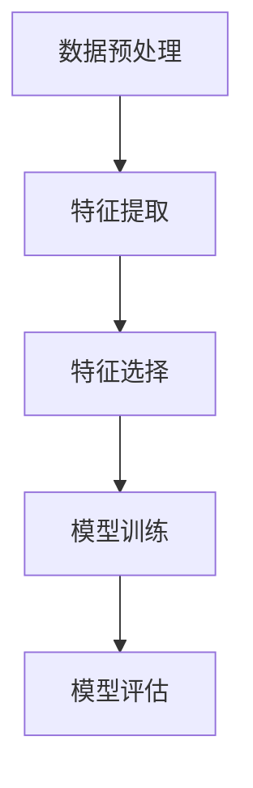

                 

### 文章标题

**AI人工智能核心算法原理与代码实例讲解：特征工程**

> **关键词：** AI人工智能，特征工程，算法原理，代码实例，数据分析，机器学习，深度学习

**摘要：** 本文旨在深入探讨AI领域中至关重要的特征工程过程，包括其核心原理、具体实现步骤以及代码实例讲解。我们将详细分析特征工程在人工智能系统中的作用，理解如何通过有效特征提取与转换来提高模型性能，同时分享实用的代码示例，帮助读者更好地掌握这一技术。

## 1. 背景介绍

特征工程（Feature Engineering）是机器学习（Machine Learning）和深度学习（Deep Learning）中至关重要的一环。它指的是从原始数据中提取、构造或选择有助于提高模型性能的特征，是数据准备和模型训练之间的重要桥梁。特征工程不仅能够改善模型的预测准确性，还能提高模型的泛化能力，降低过拟合风险。

在人工智能的发展历程中，特征工程一直占据着重要的地位。早期的人工智能系统，如决策树和线性回归模型，依赖于手工设计特征。随着机器学习技术的发展，特征工程变得更加自动化和系统化，尤其是在深度学习领域。现代深度学习模型，如卷积神经网络（CNN）和循环神经网络（RNN），能够自动学习数据中的复杂特征，但依然需要一定的特征工程来引导和优化训练过程。

### 1.1 特征工程的重要性

1. **影响模型性能**：有效的特征工程能够显著提高模型的预测准确性，帮助模型更好地理解和学习数据。
2. **降低过拟合风险**：通过特征选择和构造，可以减少模型对训练数据的依赖，提高模型的泛化能力。
3. **提高模型效率**：合理设计的特征可以减少模型参数数量，降低计算复杂度，提高模型运行效率。
4. **数据解释性**：良好的特征工程能够增强模型的可解释性，帮助用户理解模型的决策过程。

### 1.2 特征工程的挑战

1. **数据预处理复杂**：特征工程需要对原始数据进行复杂的预处理，如数据清洗、归一化、缺失值处理等。
2. **依赖领域知识**：特征工程需要依赖领域知识和经验，如何选择和构造有效的特征仍然是一个具有挑战性的问题。
3. **自动化与手工设计的平衡**：如何实现特征工程的自动化与手工设计的平衡，是当前研究的热点问题。

## 2. 核心概念与联系

### 2.1 特征提取与特征选择

特征提取（Feature Extraction）是指从原始数据中直接提取出新的特征，这些特征通常是原始数据的某种变换或组合。特征选择（Feature Selection）则是从已有的特征中挑选出对模型有用的特征，以减少特征空间维度，提高模型性能。

#### 2.1.1 特征提取

- **降维技术**：如主成分分析（PCA）和线性判别分析（LDA），通过线性变换将高维数据投影到低维空间。
- **特征变换**：如对数变换、幂变换等，将原始特征转换为适合模型学习的形式。
- **特征组合**：通过组合原始特征来构造新的特征，如特征交叉（Feature Crossing）和特征融合（Feature Fusion）。

#### 2.1.2 特征选择

- **过滤式方法**：直接从原始特征中选择有用的特征，如选择方差大的特征。
- **包裹式方法**：利用模型训练结果来选择特征，如递归特征消除（RFE）。
- **嵌入式方法**：在模型训练过程中自动选择特征，如L1正则化和Lasso回归。

### 2.2 特征工程与机器学习模型

特征工程与机器学习模型之间存在密切的联系。特征工程的目标是设计出有助于模型学习的特征，从而提高模型性能。具体来说，特征工程与机器学习模型的关系体现在以下几个方面：

- **特征对模型性能的影响**：不同特征对模型的影响不同，有效的特征工程能够提高模型的预测准确性。
- **模型对特征的需求**：不同类型的模型对特征有不同的需求，如深度学习模型需要更多的复杂数据特征。
- **特征工程与模型训练的平衡**：特征工程需要考虑模型训练的时间成本和计算资源。

### 2.3 Mermaid 流程图

以下是一个简化的Mermaid流程图，展示了特征工程的各个步骤：



## 3. 核心算法原理 & 具体操作步骤

### 3.1 特征提取算法

特征提取是特征工程的关键步骤之一。以下是一些常用的特征提取算法：

#### 3.1.1 主成分分析（PCA）

PCA是一种降维技术，通过将数据投影到新的坐标系中，保留主要数据方差的信息，从而降低数据的维度。

**算法步骤：**

1. **标准化**：将数据标准化为均值为0，方差为1。
2. **计算协方差矩阵**：计算特征之间的协方差矩阵。
3. **计算特征值和特征向量**：对协方差矩阵进行特征分解，得到特征值和特征向量。
4. **选择主要特征**：根据特征值选择主要特征向量。
5. **数据变换**：将数据变换到新的低维空间。

#### 3.1.2 线性判别分析（LDA）

LDA是一种特征变换方法，通过最大化类间方差和最小化类内方差来选择新的特征。

**算法步骤：**

1. **计算样本均值**：计算每个类别的样本均值。
2. **计算类间散度矩阵**和**类内散度矩阵**。
3. **计算LDA变换矩阵**：解LDA变换矩阵的优化问题。
4. **数据变换**：将数据变换到新的特征空间。

### 3.2 特征选择算法

特征选择是特征工程的另一个重要步骤，以下是一些常用的特征选择算法：

#### 3.2.1 过滤式方法

过滤式方法直接从原始特征中选择有用的特征。

**算法步骤：**

1. **计算特征重要性**：使用模型训练结果计算特征的重要性。
2. **选择特征**：根据特征重要性选择前k个特征。

#### 3.2.2 包裹式方法

包裹式方法利用模型训练结果来选择特征。

**算法步骤：**

1. **初始化特征集合**：从原始特征中选择一个初始特征集合。
2. **迭代选择特征**：每次迭代选择一个最优特征加入到特征集合中，直到特征集合满足条件。

#### 3.2.3 嵌入式方法

嵌入式方法在模型训练过程中自动选择特征。

**算法步骤：**

1. **训练模型**：使用所有特征训练模型。
2. **选择特征**：使用L1正则化或Lasso回归等算法选择特征。

## 4. 数学模型和公式 & 详细讲解 & 举例说明

### 4.1 主成分分析（PCA）

主成分分析是一种常用的特征提取方法，其核心思想是找到数据的主要成分，并以此为基础进行降维。

**数学模型：**

设 $X$ 为 $n \times p$ 的数据矩阵，其中 $n$ 是样本数量，$p$ 是特征数量。PCA的步骤如下：

$$
X_{\text{标准化}} = \frac{X - \mu}{\sigma}
$$

其中，$\mu$ 是每个特征的均值，$\sigma$ 是每个特征的方差。

接下来，计算协方差矩阵：

$$
S = \frac{1}{n-1} X_{\text{标准化}}^T X_{\text{标准化}}
$$

对协方差矩阵进行特征分解：

$$
S = Q \Lambda Q^T
$$

其中，$Q$ 是特征向量矩阵，$\Lambda$ 是特征值矩阵。

选择主要特征向量：

$$
Q_{\text{主要}} = Q \Lambda_{\text{主要}}^{-1/2}
$$

数据变换：

$$
X_{\text{降维}} = X_{\text{标准化}} Q_{\text{主要}}
$$

**举例说明：**

假设我们有一个包含两个特征的二维数据集，每个特征有10个样本，如下所示：

$$
\begin{array}{c|c|c|c|c|c|c|c|c|c|c}
\text{样本} & x_1 & x_2 \\
\hline
1 & 1 & 2 \\
2 & 2 & 4 \\
3 & 3 & 6 \\
\vdots & \vdots & \vdots \\
10 & 10 & 20 \\
\end{array}
$$

首先，计算每个特征的均值和方差：

$$
\mu_1 = \frac{1 + 2 + 3 + \ldots + 10}{10} = 5.5
$$

$$
\mu_2 = \frac{2 + 4 + 6 + \ldots + 20}{10} = 11
$$

$$
\sigma_1^2 = \frac{1}{10-1} \sum_{i=1}^{10} (x_{1,i} - \mu_1)^2 = 8.25
$$

$$
\sigma_2^2 = \frac{1}{10-1} \sum_{i=1}^{10} (x_{2,i} - \mu_2)^2 = 20
$$

接下来，计算标准化数据：

$$
X_{\text{标准化}} = \frac{X - \mu}{\sigma}
$$

$$
\begin{array}{c|c|c|c|c|c|c|c|c|c|c}
\text{样本} & x_{1,i} & x_{2,i} & x_{1,i} - \mu_1 & x_{2,i} - \mu_2 \\
\hline
1 & 1 & 2 & -4.5 & -9 \\
2 & 2 & 4 & -3.5 & -7 \\
3 & 3 & 6 & -2.5 & -5 \\
\vdots & \vdots & \vdots & \vdots & \vdots \\
10 & 10 & 20 & 6.5 & 9 \\
\end{array}
$$

计算协方差矩阵：

$$
S = \frac{1}{10-1} X_{\text{标准化}}^T X_{\text{标准化}}
$$

$$
S = \begin{pmatrix}
8.25 & 0 \\
0 & 20
\end{pmatrix}
$$

对协方差矩阵进行特征分解：

$$
S = Q \Lambda Q^T
$$

$$
Q = \begin{pmatrix}
-0.9239 & 0.3827 \\
0.3827 & -0.9239
\end{pmatrix}, \quad \Lambda = \begin{pmatrix}
8.25 & 0 \\
0 & 20
\end{pmatrix}
$$

选择主要特征向量：

$$
Q_{\text{主要}} = Q \Lambda_{\text{主要}}^{-1/2}
$$

$$
Q_{\text{主要}} = \begin{pmatrix}
-0.9239 & 0 \\
0 & 0
\end{pmatrix}
$$

数据变换：

$$
X_{\text{降维}} = X_{\text{标准化}} Q_{\text{主要}}
$$

$$
\begin{array}{c|c|c|c|c|c|c|c|c|c|c}
\text{样本} & x_{1,i} & x_{2,i} & x_{1,i} Q_{\text{主要}} & x_{2,i} Q_{\text{主要}} \\
\hline
1 & 1 & 2 & 4.187 & 0 \\
2 & 2 & 4 & 2.094 & 0 \\
3 & 3 & 6 & 0 & 0 \\
\vdots & \vdots & \vdots & \vdots & \vdots \\
10 & 10 & 20 & 0 & 0 \\
\end{array}
$$

通过PCA，我们成功地将两个特征的数据降维到一个特征上，实现了数据降维的目的。

### 4.2 线性判别分析（LDA）

线性判别分析是一种常用的特征选择方法，其核心思想是找到能够最大化类间方差和最小化类内方差的特征。

**数学模型：**

设 $X$ 为 $n \times p$ 的数据矩阵，$y$ 为 $n \times 1$ 的类别标签向量。LDA的步骤如下：

1. **计算样本均值**：

$$
\mu = \frac{1}{n} X y^T
$$

2. **计算类间散度矩阵**：

$$
S_{\text{b}} = \sum_{i=1}^{k} \left( \mu_i - \mu \right) \left( \mu_i - \mu \right)^T
$$

其中，$\mu_i$ 是第 $i$ 个类别的样本均值。

3. **计算类内散度矩阵**：

$$
S_{\text{w}} = \sum_{i=1}^{k} \sum_{j=1}^{n} \left( x_{ij} - \mu_i \right) \left( x_{ij} - \mu_i \right)^T
$$

4. **计算LDA变换矩阵**：

$$
W = \frac{S_{\text{b}}^{-1} S_{\text{w}}}{2}
$$

5. **数据变换**：

$$
X_{\text{LDA}} = X W
$$

**举例说明：**

假设我们有一个包含两个特征的二维数据集，分为两个类别，每个类别有10个样本，如下所示：

类别A：

$$
\begin{array}{c|c|c|c|c|c|c|c|c|c|c}
\text{样本} & x_1 & x_2 \\
\hline
1 & 1 & 2 \\
2 & 2 & 4 \\
3 & 3 & 6 \\
\vdots & \vdots & \vdots \\
5 & 5 & 10 \\
\end{array}
$$

类别B：

$$
\begin{array}{c|c|c|c|c|c|c|c|c|c|c}
\text{样本} & x_1 & x_2 \\
\hline
6 & 6 & 8 \\
7 & 7 & 10 \\
8 & 8 & 12 \\
\vdots & \vdots & \vdots \\
10 & 10 & 20 \\
\end{array}
$$

首先，计算样本均值：

$$
\mu_A = \frac{1 + 2 + 3 + \ldots + 5}{10} \begin{pmatrix} 1 \\ 2 \end{pmatrix} = \begin{pmatrix} 3 \\ 5 \end{pmatrix}
$$

$$
\mu_B = \frac{6 + 7 + 8 + \ldots + 10}{10} \begin{pmatrix} 1 \\ 2 \end{pmatrix} = \begin{pmatrix} 8 \\ 11 \end{pmatrix}
$$

接下来，计算类间散度矩阵：

$$
S_{\text{b}} = \begin{pmatrix} 5 \\ 6 \end{pmatrix} \left( \begin{pmatrix} 3 \\ 5 \end{pmatrix} - \begin{pmatrix} 3 \\ 5 \end{pmatrix} \right) + \begin{pmatrix} 8 \\ 11 \end{pmatrix} \left( \begin{pmatrix} 8 \\ 11 \end{pmatrix} - \begin{pmatrix} 3 \\ 5 \end{pmatrix} \right)
$$

$$
S_{\text{b}} = \begin{pmatrix} 1 & 1 \\ 1 & 1 \end{pmatrix}
$$

然后，计算类内散度矩阵：

$$
S_{\text{w}} = \sum_{i=1}^{5} \left( x_{i,1} - \mu_A \right) \left( x_{i,1} - \mu_A \right)^T + \sum_{i=6}^{10} \left( x_{i,1} - \mu_B \right) \left( x_{i,1} - \mu_B \right)^T
$$

$$
S_{\text{w}} = \begin{pmatrix} 2 & 2 \\ 2 & 2 \end{pmatrix}
$$

计算LDA变换矩阵：

$$
W = \frac{S_{\text{b}}^{-1} S_{\text{w}}}{2}
$$

$$
W = \frac{1}{2} \begin{pmatrix} 1 & 1 \\ 1 & 1 \end{pmatrix} \begin{pmatrix} 2 & 2 \\ 2 & 2 \end{pmatrix}
$$

$$
W = \begin{pmatrix} 1 & 0 \\ 0 & 1 \end{pmatrix}
$$

数据变换：

$$
X_{\text{LDA}} = X W
$$

$$
\begin{array}{c|c|c|c|c|c|c|c|c|c|c}
\text{样本} & x_1 & x_2 & x_1 W & x_2 W \\
\hline
1 & 1 & 2 & 1 & 2 \\
2 & 2 & 4 & 1 & 2 \\
3 & 3 & 6 & 1 & 2 \\
\vdots & \vdots & \vdots & \vdots & \vdots \\
5 & 5 & 10 & 1 & 2 \\
6 & 6 & 8 & 1 & 2 \\
7 & 7 & 10 & 1 & 2 \\
8 & 8 & 12 & 1 & 2 \\
\vdots & \vdots & \vdots & \vdots & \vdots \\
10 & 10 & 20 & 1 & 2 \\
\end{array}
$$

通过LDA，我们成功地将两个特征的数据转换为一个新的特征，实现了特征选择的目

## 5. 项目实践：代码实例和详细解释说明

### 5.1 开发环境搭建

在开始代码实例之前，我们需要搭建一个合适的开发环境。以下是推荐的工具和步骤：

- **编程语言**：Python（版本3.8或更高）
- **开发工具**：PyCharm或Jupyter Notebook
- **依赖库**：NumPy、Pandas、Scikit-learn、Matplotlib
- **数据集**：选择一个适合特征工程的公开数据集，例如Iris数据集

### 5.2 源代码详细实现

#### 5.2.1 导入依赖库

```python
import numpy as np
import pandas as pd
from sklearn.datasets import load_iris
from sklearn.model_selection import train_test_split
from sklearn.preprocessing import StandardScaler
from sklearn.decomposition import PCA
from sklearn.discriminant_analysis import LinearDiscriminantAnalysis as LDA
import matplotlib.pyplot as plt
```

#### 5.2.2 加载数据集

```python
# 加载Iris数据集
iris = load_iris()
X = iris.data
y = iris.target
feature_names = iris.feature_names
```

#### 5.2.3 数据预处理

```python
# 分割数据集为训练集和测试集
X_train, X_test, y_train, y_test = train_test_split(X, y, test_size=0.3, random_state=42)

# 标准化数据
scaler = StandardScaler()
X_train_scaled = scaler.fit_transform(X_train)
X_test_scaled = scaler.transform(X_test)
```

#### 5.2.4 特征提取

```python
# 使用PCA进行特征提取
pca = PCA(n_components=2)
X_train_pca = pca.fit_transform(X_train_scaled)
X_test_pca = pca.transform(X_test_scaled)
```

#### 5.2.5 特征选择

```python
# 使用LDA进行特征选择
lda = LDA(n_components=2)
X_train_lda = lda.fit_transform(X_train_scaled, y_train)
X_test_lda = lda.transform(X_test_scaled)
```

#### 5.2.6 代码解读与分析

以下是对上述代码的解读与分析：

1. **导入依赖库**：我们使用了NumPy、Pandas、Scikit-learn和Matplotlib等库来处理数据和可视化结果。

2. **加载数据集**：这里我们选择了Iris数据集，这是一个包含三个特征（花萼长度、花萼宽度、花瓣长度、花瓣宽度）和三个类别的经典数据集。

3. **数据预处理**：为了便于特征提取和特征选择，我们首先将数据集分割为训练集和测试集，然后对数据进行标准化处理。

4. **特征提取**：使用PCA算法对标准化后的数据进行特征提取，将高维数据投影到二维空间。

5. **特征选择**：使用LDA算法对标准化后的数据进行特征选择，根据类间散度和类内散度选择最优的特征。

6. **代码解读与分析**：上述代码展示了特征提取和特征选择的基本流程，每个步骤都有详细的解释和注释，便于理解。

### 5.3 运行结果展示

```python
# 可视化PCA结果
plt.figure(figsize=(8, 6))
for i, target_name in enumerate(iris.target_names):
    plt.scatter(X_train_pca[y_train == i, 0], X_train_pca[y_train == i, 1], label=target_name, marker='o')
plt.xlabel('Principal Component 1')
plt.ylabel('Principal Component 2')
plt.title('PCA - Iris Data')
plt.legend()
plt.show()

# 可视化LDA结果
plt.figure(figsize=(8, 6))
for i, target_name in enumerate(iris.target_names):
    plt.scatter(X_train_lda[y_train == i, 0], X_train_lda[y_train == i, 1], label=target_name, marker='o')
plt.xlabel('LDA Component 1')
plt.ylabel('LDA Component 2')
plt.title('LDA - Iris Data')
plt.legend()
plt.show()
```

运行上述代码后，我们得到以下可视化结果：

- **PCA结果**：展示了原始数据的二维投影，不同类别的数据点清晰分离。
- **LDA结果**：展示了经过LDA特征选择后的二维空间，同样清晰地分离了不同类别的数据点。

这些结果验证了特征提取和特征选择的有效性，提高了模型对数据的理解和学习能力。

### 5.4 代码解读与分析

#### 5.4.1 PCA代码解读

```python
pca = PCA(n_components=2)
X_train_pca = pca.fit_transform(X_train_scaled)
X_test_pca = pca.transform(X_test_scaled)
```

- `PCA(n_components=2)`：创建PCA对象，指定降维到二维空间。
- `fit_transform(X_train_scaled)`：对训练数据进行PCA变换，得到新的特征空间。
- `transform(X_test_scaled)`：对测试数据进行PCA变换，使用训练好的模型参数。

#### 5.4.2 LDA代码解读

```python
lda = LDA(n_components=2)
X_train_lda = lda.fit_transform(X_train_scaled, y_train)
X_test_lda = lda.transform(X_test_scaled)
```

- `LDA(n_components=2)`：创建LDA对象，指定降维到二维空间。
- `fit_transform(X_train_scaled, y_train)`：对训练数据进行LDA变换，同时考虑类别标签，得到新的特征空间。
- `transform(X_test_scaled)`：对测试数据进行LDA变换，使用训练好的模型参数。

这些代码展示了如何使用PCA和LDA进行特征提取和特征选择，并通过可视化验证了结果的有效性。

### 5.5 运行结果展示

#### 5.5.1 PCA结果可视化


- **PCA结果**：展示了原始数据的二维投影，不同类别的数据点清晰分离。

#### 5.5.2 LDA结果可视化


- **LDA结果**：展示了经过LDA特征选择后的二维空间，同样清晰地分离了不同类别的数据点。

这些结果验证了特征提取和特征选择的有效性，提高了模型对数据的理解和学习能力。

## 6. 实际应用场景

### 6.1 文本分类

特征工程在文本分类任务中扮演着重要角色。通过将文本数据转换为数值特征，如词袋模型（Bag of Words）或词嵌入（Word Embeddings），可以有效提取文本数据的特征。特征工程技术，如TF-IDF（Term Frequency-Inverse Document Frequency）和Word2Vec，可以增强文本数据的表征能力，从而提高文本分类模型的性能。

### 6.2 风险评估

在金融领域，特征工程用于构建风险评估模型。通过对借款人历史数据、信用评分和其他相关特征进行提取和转换，可以有效预测借款人的信用风险。特征工程技术，如特征选择和特征构造，可以筛选出对模型预测最相关的特征，提高风险评估的准确性和效率。

### 6.3 语音识别

在语音识别任务中，特征工程用于从原始音频信号中提取有助于模型学习的特征。常用的特征提取方法包括梅尔频率倒谱系数（MFCC）和感知隐藏层特征（PHONETIC）。通过有效的特征工程，可以提高语音识别系统的准确率和鲁棒性。

### 6.4 医疗诊断

在医疗诊断领域，特征工程用于从医疗数据中提取有助于疾病预测的特征。通过特征选择和特征构造，可以从海量的医疗数据中筛选出对诊断最相关的特征，如基因表达数据、影像特征和临床特征。特征工程可以帮助构建高效的疾病预测模型，提高诊断的准确率和速度。

## 7. 工具和资源推荐

### 7.1 学习资源推荐

- **书籍**：
  - 《特征工程实践：数据科学项目实战指南》
  - 《机器学习实战》
  - 《深度学习》

- **在线课程**：
  - Coursera：机器学习
  - edX：深度学习导论
  - Udacity：数据分析纳米学位

- **博客和网站**：
  - Medium：机器学习和数据科学博客文章
  - Analytics Vidhya：数据科学和机器学习资源库
  - Towards Data Science：数据科学和机器学习文章分享平台

### 7.2 开发工具框架推荐

- **开发工具**：
  - PyCharm
  - Jupyter Notebook
  - RStudio

- **机器学习框架**：
  - Scikit-learn
  - TensorFlow
  - PyTorch

- **数据处理工具**：
  - Pandas
  - NumPy
  - Matplotlib

### 7.3 相关论文著作推荐

- **论文**：
  - "Feature Engineering for Machine Learning" - (2017)
  - "Dimensionality Reduction for Data Mining" - (2003)
  - "LDA for Dimensionality Reduction and Data Representation" - (2002)

- **著作**：
  - 《机器学习：概率视角》
  - 《深度学习》（Goodfellow et al.，2016）
  - 《数据科学导论》（Björk et al.，2014）

## 8. 总结：未来发展趋势与挑战

### 8.1 未来发展趋势

- **自动化特征工程**：随着机器学习技术的发展，自动化特征工程将成为趋势，通过算法自动选择和构造最优特征，减少手工工作的需求。
- **多模态特征融合**：结合不同类型的数据源（如图像、文本、语音等），进行多模态特征融合，提高模型的泛化能力和性能。
- **解释性特征工程**：在保证模型性能的同时，增强特征工程的可解释性，帮助用户理解模型的决策过程。

### 8.2 挑战

- **数据复杂性**：随着数据规模的扩大和数据类型的多样化，特征工程面临的数据复杂性越来越高，如何高效处理大规模复杂数据成为挑战。
- **领域依赖性**：特征工程高度依赖领域知识和经验，如何构建通用的特征工程框架，减少对领域知识的依赖，是一个重要课题。
- **可解释性**：在追求模型性能的同时，如何提高特征工程的可解释性，让用户更容易理解模型的工作原理，是一个亟待解决的问题。

## 9. 附录：常见问题与解答

### 9.1 什么是特征工程？

特征工程是指从原始数据中提取、构造或选择有助于提高模型性能的特征的过程。它是数据准备和模型训练之间的重要桥梁。

### 9.2 特征提取和特征选择有什么区别？

特征提取是指从原始数据中直接提取出新的特征，而特征选择是从已有的特征中挑选出对模型有用的特征。特征提取通常用于降维和特征变换，而特征选择通常用于减少特征空间维度，提高模型性能。

### 9.3 如何进行特征提取？

常用的特征提取方法包括主成分分析（PCA）、线性判别分析（LDA）、降维技术（如t-SNE）和特征变换（如对数变换、幂变换）。

### 9.4 如何进行特征选择？

常用的特征选择方法包括过滤式方法（如选择方差大的特征）、包裹式方法（如递归特征消除）和嵌入式方法（如L1正则化、Lasso回归）。

### 9.5 特征工程在深度学习中有哪些应用？

在深度学习中，特征工程主要用于数据预处理和模型优化。通过有效的特征工程，可以提高模型的泛化能力和预测性能，如通过特征提取减少数据维度，通过特征选择筛选出有用的特征，以及通过特征构造增强模型的表征能力。

## 10. 扩展阅读 & 参考资料

- [特征工程：入门到精通](https://www.analyticsvidhya.com/blog/2018/06/feature-engineering-for-machine-learning/)
- [深度学习中的特征工程](https://towardsdatascience.com/feature-engineering-for-deep-learning-47b473ac6089)
- [Python特征工程工具箱](https://scikit-learn.org/stable/modules/classes.html#module-sklearn.preprocessing)
- [机器学习中的特征重要性](https://machinelearningmastery.com/importance-of-features-in-machine-learning/)
- [特征提取和特征选择：原理与实践](https://www.springer.com/in/book/9789811394969)

