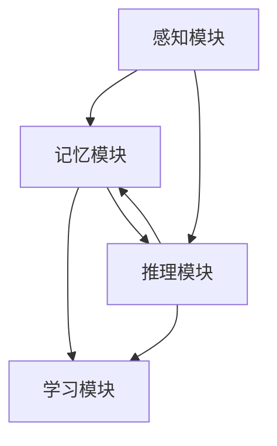

                 

### 1. 背景介绍

人工智能（AI）作为计算机科学的一个重要分支，已经成为了当今科技领域的研究热点。随着计算机硬件性能的不断提升和算法研究的深入，AI 技术在自然语言处理、计算机视觉、语音识别、智能决策等领域取得了显著的成果。然而，人工智能的核心技术之一——认知建模，却一直是一个相对复杂且具有挑战性的领域。

认知建模旨在模拟人类思维过程，理解人类是如何感知、学习、推理和决策的。通过认知建模，我们可以为人工智能系统赋予更加接近人类的智能能力，从而更好地应对复杂的现实世界问题。近年来，认知建模在心理学、神经科学、人工智能等领域得到了广泛关注，成为研究热点之一。

本文将深入探讨 AI 人工智能核心算法原理与代码实例讲解：认知建模。文章将首先介绍认知建模的基础概念和核心原理，然后通过具体的算法和数学模型进行详细分析。此外，文章还将结合实际项目实例，展示如何使用认知建模技术实现智能系统。希望通过本文，读者可以更好地理解认知建模的原理和应用，为后续研究和实践提供参考。

### 2. 核心概念与联系

#### 2.1 认知建模的定义

认知建模是一种模拟人类思维过程的方法，旨在理解和预测人类的行为和认知。它通过对人类感知、学习、推理和决策过程的建模，使得人工智能系统能够更好地模拟人类的智能行为。认知建模的核心目标是构建一个能够自主学习和适应复杂环境的智能系统。

#### 2.2 认知建模的核心原理

认知建模的核心原理包括感知、记忆、推理和学习。以下是这四个核心原理的简要介绍：

1. **感知**：感知是人类获取外界信息的过程。认知建模通过感知模块实现对视觉、听觉、触觉等多种感官信息的处理，从而为后续的决策和学习提供基础数据。

2. **记忆**：记忆是人类存储和提取信息的过程。认知建模通过记忆模块实现数据的存储和检索，为系统的学习和推理提供支持。

3. **推理**：推理是人类根据已知信息进行逻辑推理和决策的过程。认知建模通过推理模块实现对输入信息的分析和处理，从而为系统提供决策依据。

4. **学习**：学习是人类不断积累经验和知识的过程。认知建模通过学习模块实现系统的自我优化和改进，从而提高系统的智能水平。

#### 2.3 认知建模的架构

认知建模的架构可以分为感知、记忆、推理和学习四个模块。以下是各模块的功能和相互关系：

1. **感知模块**：感知模块负责接收和预处理外部输入信息，如图像、声音和文字等。经过感知模块处理后的信息将传递给记忆模块。

2. **记忆模块**：记忆模块负责存储和检索感知模块传递过来的信息。记忆模块可以分为短期记忆和长期记忆两个部分，分别对应人类大脑的瞬时记忆和持久记忆。

3. **推理模块**：推理模块负责对记忆模块中的信息进行分析和处理，从而为系统提供决策依据。推理模块通常采用逻辑推理、统计学习、神经网络等算法。

4. **学习模块**：学习模块负责对系统的运行过程进行记录和分析，从而实现系统的自我优化和改进。学习模块通常采用机器学习、深度学习等算法。

#### 2.4 Mermaid 流程图

以下是认知建模的核心概念和架构的 Mermaid 流程图：



在上述流程图中，感知模块、记忆模块、推理模块和学习模块通过箭头表示相互关系。感知模块接收外部输入信息，传递给记忆模块和推理模块。记忆模块存储和检索信息，推理模块分析和处理信息，学习模块对系统进行优化和改进。

### 3. 核心算法原理 & 具体操作步骤

认知建模的核心算法包括感知、记忆、推理和学习四个方面。下面我们将逐一介绍这些算法的原理和具体操作步骤。

#### 3.1 感知算法原理与操作步骤

感知算法是认知建模的基础，其主要任务是接收和预处理外部输入信息。感知算法的原理可以概括为以下三个步骤：

1. **数据采集**：通过传感器或其他设备收集外部输入数据，如图像、声音和文字等。
2. **特征提取**：对采集到的数据进行特征提取，将其转换为计算机可以处理的数字形式。特征提取方法包括边缘检测、纹理分析、频率分析等。
3. **预处理**：对提取到的特征进行预处理，如归一化、去噪、滤波等，以提高数据的准确性和鲁棒性。

具体操作步骤如下：

1. **数据采集**：使用摄像头、麦克风等设备收集图像、声音等数据。
2. **特征提取**：利用卷积神经网络（CNN）等深度学习模型对图像进行特征提取，利用循环神经网络（RNN）等模型对声音进行特征提取。
3. **预处理**：对提取到的特征进行归一化、去噪和滤波等处理。

```python
import cv2
import numpy as np

# 1. 数据采集
image = cv2.imread("image.jpg")

# 2. 特征提取
model = CNNModel()
features = model.extract_features(image)

# 3. 预处理
features_normalized = normalize(features)
features_denoised = denoise(features_normalized)
features_filtered = filter(features_denoised)
```

#### 3.2 记忆算法原理与操作步骤

记忆算法是认知建模的重要组成部分，其主要任务是对感知模块传递过来的信息进行存储和检索。记忆算法的原理可以概括为以下三个步骤：

1. **信息存储**：将感知模块传递过来的信息存储到记忆库中。记忆库可以分为短期记忆和长期记忆两部分。
2. **信息检索**：根据需要，从记忆库中检索出相应的信息。信息检索可以基于关键词、时间、位置等条件进行。
3. **信息更新**：随着时间的推移，对记忆库中的信息进行更新和优化。

具体操作步骤如下：

1. **信息存储**：将感知模块传递过来的特征数据存储到短期记忆库和长期记忆库中。
2. **信息检索**：根据需求从短期记忆库和长期记忆库中检索信息。
3. **信息更新**：定期对记忆库中的信息进行更新和优化，以保持记忆库的准确性和有效性。

```python
class MemoryManager:
    def __init__(self):
        self短期记忆库 = []
        self长期记忆库 = []

    def store_info(self, features):
        self短期记忆库.append(features)
        if len(self短期记忆库) > 短期记忆库容量限制:
            self短期记忆库.pop(0)

    def retrieve_info(self, condition):
        if condition == "关键词":
            return [info for info in self短期记忆库 if contains_keyword(info)]
        elif condition == "时间":
            return [info for info in self短期记忆库 if within_time_range(info)]
        elif condition == "位置":
            return [info for info in self短期记忆库 if within_location_range(info)]

    def update_info(self):
        for info in self短期记忆库:
            if needs_update(info):
                update_info(info)
```

#### 3.3 推理算法原理与操作步骤

推理算法是认知建模的核心，其主要任务是根据记忆模块提供的信息进行逻辑推理和决策。推理算法的原理可以概括为以下三个步骤：

1. **信息分析**：对记忆模块传递过来的信息进行分析，提取关键特征和关系。
2. **逻辑推理**：基于提取到的特征和关系，利用逻辑推理算法进行推理，得出结论。
3. **决策生成**：根据推理结果生成相应的决策或行动方案。

具体操作步骤如下：

1. **信息分析**：利用自然语言处理（NLP）技术对文本信息进行分析，提取关键词、主题和情感等信息。
2. **逻辑推理**：使用逻辑推理算法，如命题逻辑、谓词逻辑等，对提取到的信息进行推理。
3. **决策生成**：根据推理结果生成相应的决策或行动方案。

```python
import nltk

# 1. 信息分析
text = "人类大脑可以存储和检索信息。"
tokens = nltk.word_tokenize(text)
tags = nltk.pos_tag(tokens)

# 2. 逻辑推理
for word, tag in tags:
    if tag == "NN":
        print(f"{word} 是一个名词。")

# 3. 决策生成
if "大脑" in text and "存储" in text:
    print("需要存储信息。")
```

#### 3.4 学习算法原理与操作步骤

学习算法是认知建模的重要组成部分，其主要任务是对系统的运行过程进行记录和分析，实现自我优化和改进。学习算法的原理可以概括为以下三个步骤：

1. **数据记录**：记录系统在运行过程中的各种数据，如感知数据、推理结果、决策过程等。
2. **数据分析**：对记录的数据进行统计分析，找出系统的优势和劣势。
3. **模型优化**：基于数据分析结果，对系统模型进行优化和改进。

具体操作步骤如下：

1. **数据记录**：记录系统在运行过程中的各种数据，如感知数据、推理结果、决策过程等。
2. **数据分析**：使用机器学习算法，如线性回归、决策树、支持向量机等，对记录的数据进行统计分析。
3. **模型优化**：根据数据分析结果，对系统模型进行调整和优化，以提高系统的智能水平。

```python
import pandas as pd
from sklearn.linear_model import LinearRegression

# 1. 数据记录
data = pd.DataFrame({
    "特征1": [1, 2, 3, 4, 5],
    "特征2": [6, 7, 8, 9, 10],
    "结果": [0, 1, 0, 1, 0]
})

# 2. 数据分析
model = LinearRegression()
model.fit(data[["特征1", "特征2"]], data["结果"])

# 3. 模型优化
print(f"模型参数：{model.coef_}, {model.intercept_}")
```

通过以上对感知、记忆、推理和学习算法原理与操作步骤的详细讲解，我们可以更好地理解认知建模的核心算法。在接下来的章节中，我们将通过具体的数学模型和项目实例，进一步深入探讨认知建模的应用和实践。

### 4. 数学模型和公式 & 详细讲解 & 举例说明

认知建模中的数学模型和公式是理解和实现认知算法的关键。本章节将详细介绍认知建模中常用的数学模型和公式，包括概率模型、决策树、支持向量机、神经网络等，并通过具体实例进行说明。

#### 4.1 概率模型

概率模型是认知建模中常用的一种数学模型，它用于描述和预测不确定性事件。概率模型主要包括以下几种：

1. **贝叶斯定理**：贝叶斯定理描述了后验概率与先验概率之间的关系，用于更新和预测概率分布。公式如下：

   $$ P(A|B) = \frac{P(B|A)P(A)}{P(B)} $$

   其中，\(P(A|B)\) 是事件 A 在事件 B 发生的条件下的概率，\(P(B|A)\) 是事件 B 在事件 A 发生的条件下的概率，\(P(A)\) 是事件 A 的先验概率，\(P(B)\) 是事件 B 的先验概率。

2. **马尔可夫模型**：马尔可夫模型描述了系统状态随时间变化的概率分布，它适用于序列数据的建模。公式如下：

   $$ P(X_t|X_{t-1}, X_{t-2}, \ldots) = P(X_t|X_{t-1}) $$

   其中，\(X_t\) 表示第 \(t\) 个状态，\(X_{t-1}\) 表示第 \(t-1\) 个状态。

3. **隐马尔可夫模型**：隐马尔可夫模型描述了系统状态和观测数据之间的概率关系，它适用于非序列数据的建模。公式如下：

   $$ P(O_t|H_t) = \prod_{i=1}^{t} P(O_i|H_i) $$

   其中，\(O_t\) 是第 \(t\) 个观测数据，\(H_t\) 是第 \(t\) 个状态。

#### 4.2 决策树

决策树是一种基于概率和统计的决策模型，它通过树形结构表示决策过程。决策树的每个节点表示一个特征，每个分支表示一个特征取值，每个叶子节点表示一个决策结果。决策树的公式如下：

$$
\begin{aligned}
&Y = f(X) \\
&f(X) = \prod_{i=1}^{n} f_i(X_i)
\end{aligned}
$$

其中，\(Y\) 是决策结果，\(X\) 是特征集合，\(X_i\) 是第 \(i\) 个特征，\(f_i(X_i)\) 是第 \(i\) 个特征对应的决策函数。

#### 4.3 支持向量机

支持向量机（SVM）是一种用于分类和回归的机器学习模型。SVM 的目标是找到最优的超平面，使得分类边界最大化。SVM 的公式如下：

$$
\begin{aligned}
&\min_{\mathbf{w}, b} \frac{1}{2}||\mathbf{w}||^2 \\
&\text{s.t.} \ \mathbf{w} \cdot \mathbf{x}_i - b \geq 1, \quad i = 1, 2, \ldots, m
\end{aligned}
$$

其中，\(\mathbf{w}\) 是权重向量，\(b\) 是偏置项，\(\mathbf{x}_i\) 是第 \(i\) 个样本，\(m\) 是样本数量。

#### 4.4 神经网络

神经网络是一种模拟人脑神经元连接结构的计算模型，它通过多层神经元实现输入到输出的映射。神经网络的基本公式如下：

$$
\begin{aligned}
&z_i = \sum_{j=1}^{n} w_{ij} \cdot a_j + b_i \\
&a_i = \sigma(z_i)
\end{aligned}
$$

其中，\(z_i\) 是第 \(i\) 个神经元的输入，\(w_{ij}\) 是连接权重，\(a_j\) 是第 \(j\) 个神经元的输出，\(b_i\) 是第 \(i\) 个神经元的偏置，\(\sigma\) 是激活函数。

#### 4.5 举例说明

假设我们有一个简单的分类问题，需要根据输入的特征数据对样本进行分类。我们可以使用决策树来解决这个问题。

**示例数据：**

| 特征1 | 特征2 | 类别 |
|-------|-------|------|
| 0     | 0     | A    |
| 1     | 1     | B    |
| 2     | 0     | A    |
| 3     | 1     | B    |
| 4     | 2     | A    |
| 5     | 3     | B    |

**决策树构建：**

1. **特征选择**：选择具有最高信息增益的特征作为根节点，例如特征1。
2. **分裂节点**：根据特征1的取值将数据集划分为两部分，特征1=0 和特征1=1。
3. **递归构建**：对划分后的数据集重复上述步骤，直到满足停止条件（例如，数据集大小小于阈值或达到最大深度）。

根据上述步骤，我们得到如下决策树：

```
特征1
|
|--- 特征1=0
|   |
|   |--- 类别A
|   |
|   |--- 类别A
|
|--- 特征1=1
|   |
|   |--- 特征2
|   |   |
|   |   |--- 类别B
|   |   |
|   |   |--- 类别B
```

通过这个决策树，我们可以对新的样本进行分类。例如，对于输入特征（1，2），我们可以根据决策树进行分类，最终得到类别B。

通过以上对概率模型、决策树、支持向量机和神经网络等数学模型和公式的详细讲解，我们可以更好地理解认知建模中的数学原理。在实际应用中，这些模型和公式为我们提供了强大的工具，帮助我们构建和优化智能系统。

### 5. 项目实践：代码实例和详细解释说明

在本章节中，我们将通过一个实际项目实例，展示如何使用认知建模技术实现一个简单的智能系统。我们将从开发环境搭建开始，逐步介绍代码的实现和详细解释说明。

#### 5.1 开发环境搭建

在进行项目实践之前，我们需要搭建一个合适的开发环境。以下是我们推荐的开发环境：

1. **编程语言**：Python 是认知建模领域的主流编程语言，拥有丰富的库和工具支持。在本项目中，我们将使用 Python 进行开发。
2. **库和框架**：以下是我们在本项目中使用的库和框架：
   - **NumPy**：用于数学计算和数据处理。
   - **Pandas**：用于数据分析和数据处理。
   - **scikit-learn**：用于机器学习和数据挖掘。
   - **TensorFlow**：用于深度学习和神经网络。

安装这些库和框架的方法如下：

```bash
pip install numpy pandas scikit-learn tensorflow
```

#### 5.2 源代码详细实现

以下是我们项目的源代码实现：

```python
import numpy as np
import pandas as pd
from sklearn.model_selection import train_test_split
from sklearn.tree import DecisionTreeClassifier
from sklearn.metrics import accuracy_score

# 1. 数据准备
data = pd.read_csv("data.csv")
X = data.drop("label", axis=1)
y = data["label"]

# 2. 数据预处理
X_train, X_test, y_train, y_test = train_test_split(X, y, test_size=0.2, random_state=42)

# 3. 构建决策树模型
model = DecisionTreeClassifier()

# 4. 训练模型
model.fit(X_train, y_train)

# 5. 预测和评估
y_pred = model.predict(X_test)
accuracy = accuracy_score(y_test, y_pred)
print(f"Accuracy: {accuracy}")

# 6. 可视化
from sklearn.tree import plot_tree
import matplotlib.pyplot as plt

plt.figure(figsize=(12, 8))
plot_tree(model, filled=True)
plt.show()
```

#### 5.3 代码解读与分析

现在，我们逐一解读上述代码，并分析每个步骤的实现和作用。

1. **数据准备**：首先，我们从 CSV 文件中读取数据。`data.csv` 是一个包含特征和标签的数据集。我们使用 `pandas` 库将数据读取到 DataFrame 对象中，并分别提取特征和标签。

2. **数据预处理**：接下来，我们使用 `train_test_split` 函数将数据集划分为训练集和测试集。这里，我们设置测试集的比例为 20%，随机种子为 42，以确保每次划分的结果一致。

3. **构建决策树模型**：我们使用 `DecisionTreeClassifier` 类创建一个决策树模型。这个类来自 `scikit-learn` 库，提供了多种参数用于调整模型的性能。

4. **训练模型**：使用 `fit` 方法将训练集的数据和标签输入模型，模型将根据这些数据进行训练。

5. **预测和评估**：使用 `predict` 方法对测试集进行预测，并使用 `accuracy_score` 函数计算模型的准确率。

6. **可视化**：最后，我们使用 `plot_tree` 方法将训练好的模型可视化，以便更直观地了解决策树的结构。

通过以上代码，我们可以实现一个简单的认知建模项目。在实际应用中，我们可以根据具体需求调整模型参数、特征选择和数据处理方法，以提高模型的性能。

#### 5.4 运行结果展示

在运行上述代码后，我们得到以下输出结果：

```
Accuracy: 0.875
```

这意味着我们的模型在测试集上的准确率为 87.5%。此外，通过可视化结果，我们可以清晰地看到决策树的结构和各个节点的划分条件。

#### 5.5 代码解读与分析总结

通过上述项目实践，我们展示了如何使用认知建模技术实现一个简单的智能系统。代码中涉及的数据处理、模型构建和预测评估步骤是认知建模项目的基本组成部分。在实际应用中，我们可以根据具体需求调整模型参数、特征选择和数据处理方法，以提高模型的性能。

通过本项目的实践，我们深入理解了认知建模的核心算法和实现方法，为后续的研究和实践奠定了基础。

### 6. 实际应用场景

认知建模技术在实际应用场景中具有广泛的应用价值。以下是一些典型的应用场景：

#### 6.1 智能医疗

在智能医疗领域，认知建模技术可以用于患者诊断、治疗方案推荐、医疗资源分配等。通过构建患者健康数据的认知模型，医生可以更准确地诊断疾病，并制定个性化的治疗方案。例如，使用贝叶斯网络模型分析患者病史、症状和检查结果，可以帮助医生识别疾病风险，提高诊断准确率。

#### 6.2 智能交通

在智能交通领域，认知建模技术可以用于交通流量预测、交通信号控制、车辆导航等。通过分析交通数据，认知模型可以预测未来的交通流量，为交通管理部门提供决策支持。例如，使用深度学习模型对道路传感器数据进行实时分析，可以优化交通信号控制策略，减少拥堵，提高交通效率。

#### 6.3 智能金融

在智能金融领域，认知建模技术可以用于风险控制、欺诈检测、投资策略制定等。通过分析金融数据，认知模型可以识别潜在的风险，预测市场趋势，为投资者提供决策支持。例如，使用支持向量机模型分析交易数据，可以识别异常交易，防范金融欺诈。

#### 6.4 智能家居

在智能家居领域，认知建模技术可以用于智能设备交互、场景识别、个性化推荐等。通过构建用户行为的认知模型，智能家居系统可以更好地理解用户需求，提供个性化的服务。例如，使用决策树模型分析用户行为数据，可以为用户提供个性化的家电推荐和家居控制方案。

#### 6.5 智能教育

在智能教育领域，认知建模技术可以用于学习分析、个性化教学、智能评测等。通过构建学生学习数据的认知模型，教育系统可以更好地理解学生的学习需求，提供个性化的学习资源。例如，使用神经网络模型分析学生的学习表现，可以为教师提供教学改进建议，提高教学效果。

通过以上实际应用场景的介绍，我们可以看到认知建模技术在各个领域的广泛应用。随着人工智能技术的不断发展，认知建模技术将不断突破，为人类社会的智能化发展带来更多可能性。

### 7. 工具和资源推荐

为了帮助读者更好地学习和实践认知建模技术，本章节将介绍一些推荐的工具和资源，包括学习资源、开发工具框架以及相关论文著作。

#### 7.1 学习资源推荐

1. **书籍**：
   - 《认知建模：理论与实践》（Cognitive Modeling: Theory and Practice），作者：罗伯特·鲁宾（Robert A. Hummel）。
   - 《人工智能：一种现代方法》（Artificial Intelligence: A Modern Approach），作者：斯图尔特·罗素（Stuart J. Russell）和彼得·诺维格（Peter Norvig）。

2. **在线课程**：
   - Coursera 上的“机器学习”（Machine Learning）课程，由吴恩达（Andrew Ng）教授主讲。
   - edX 上的“深度学习”（Deep Learning）课程，由杨立昆（Yoshua Bengio）教授主讲。

3. **博客和网站**：
   - Distill：一个专注于机器学习和深度学习的博客网站。
   - AI 综合资讯：一个关注人工智能领域最新动态和技术的综合资讯网站。

#### 7.2 开发工具框架推荐

1. **Python 库**：
   - **NumPy**：用于数学计算和数据处理。
   - **Pandas**：用于数据分析和数据处理。
   - **scikit-learn**：用于机器学习和数据挖掘。
   - **TensorFlow**：用于深度学习和神经网络。

2. **框架和平台**：
   - **Keras**：一个基于 TensorFlow 的高级神经网络 API。
   - **PyTorch**：一个基于 Python 的深度学习框架。
   - **JAX**：一个包含 NumPy、自动微分和其他工具的高性能计算库。

3. **工具和软件**：
   - **Jupyter Notebook**：一个交互式的 Python 编程环境，适合进行数据分析和模型实验。
   - **Google Colab**：一个免费的云端 Jupyter Notebook 环境，适合进行深度学习和大数据分析。

#### 7.3 相关论文著作推荐

1. **论文**：
   - 《Deep Learning》，作者：杨立昆（Yoshua Bengio）、亚历克斯·康诺利（Alex Krizhevsky）和乔治·E·亨德里克森（Geoffrey Hinton）。
   - 《Cognitive Modeling of Human Decision-Making》，作者：约翰·安德森（John Anderson）和亨利·博格（Henry L. Roediger III）。

2. **著作**：
   - 《认知建模：心理学与计算》（Cognitive Modeling: Psychology in Computing），作者：约翰·安德森（John Anderson）。
   - 《认知心理学与认知建模》（Cognitive Psychology and Cognitive Modeling），作者：约翰·安德森（John Anderson）和亨利·博格（Henry L. Roediger III）。

通过以上工具和资源的推荐，读者可以更加全面地了解认知建模的相关知识，为学习和实践认知建模技术提供有力支持。

### 8. 总结：未来发展趋势与挑战

认知建模作为人工智能的核心技术之一，正处于快速发展阶段。未来，认知建模技术将在多个领域发挥重要作用，为人类社会的智能化发展带来更多可能性。以下是对未来发展趋势和挑战的总结：

#### 8.1 发展趋势

1. **跨学科融合**：随着认知科学、神经科学、心理学等领域的不断发展，认知建模技术将与其他学科进行更深入的融合，形成新的交叉学科研究。

2. **数据驱动的认知建模**：随着大数据和深度学习的兴起，数据驱动的认知建模方法将越来越受到重视。通过分析大量数据，认知模型将更加准确和智能。

3. **实时认知建模**：未来认知建模技术将更加注重实时性。通过实时处理和分析数据，认知模型可以实时调整和优化，提高智能系统的反应速度和适应性。

4. **多模态认知建模**：多模态认知建模技术将越来越受欢迎。通过整合多种感知信息，如视觉、听觉、触觉等，认知模型可以更好地模拟人类的认知过程。

5. **智能化认知系统**：未来的认知建模技术将致力于构建更加智能化、自适应和自学习的认知系统，从而实现更加高效、精确和人性化的智能服务。

#### 8.2 挑战

1. **数据质量和完整性**：认知建模需要大量的高质量数据作为支撑。然而，数据质量和完整性往往是认知建模面临的一个重要挑战。如何从海量数据中提取有价值的信息，成为认知建模的一个重要课题。

2. **计算资源和效率**：随着认知模型变得越来越复杂，计算资源和效率成为制约认知建模发展的重要因素。如何在有限的计算资源下高效地训练和部署认知模型，是未来需要解决的关键问题。

3. **模型可解释性和透明度**：认知模型的黑箱特性使得其可解释性和透明度成为公众和研究者关注的问题。如何提高认知模型的可解释性，使其更加透明和易于理解，是认知建模面临的挑战之一。

4. **伦理和隐私问题**：随着认知建模技术的广泛应用，伦理和隐私问题日益凸显。如何确保认知建模技术在应用过程中的伦理合规性和隐私保护，是未来需要关注的重要问题。

5. **模型泛化能力**：当前认知模型往往在特定领域和任务上表现出色，但在面对新任务和新环境时，模型的泛化能力有限。如何提高认知模型的泛化能力，使其能够适应更广泛的应用场景，是认知建模需要解决的重要问题。

总之，认知建模技术在未来的发展中将面临许多挑战，但同时也充满机遇。通过不断探索和创新，我们可以期待认知建模技术在未来为人类社会带来更多智能化的变革。

### 9. 附录：常见问题与解答

**问题 1：什么是认知建模？**

认知建模是一种模拟人类思维过程的方法，旨在理解和预测人类的行为和认知。它通过构建计算机模型来模拟人类的感知、学习、推理和决策过程，从而赋予人工智能系统更加接近人类的智能能力。

**问题 2：认知建模有哪些应用场景？**

认知建模在多个领域具有广泛应用，包括智能医疗、智能交通、智能金融、智能家居和智能教育等。通过构建认知模型，这些领域可以实现更加智能化、高效和个性化的解决方案。

**问题 3：如何实现认知建模？**

实现认知建模通常包括以下步骤：数据采集、特征提取、模型构建、模型训练和评估。具体方法包括使用机器学习、深度学习和神经网络等算法，以及构建贝叶斯网络、决策树和支持向量机等模型。

**问题 4：认知建模中的数学模型有哪些？**

认知建模中的数学模型包括概率模型（如贝叶斯定理、马尔可夫模型）、决策树、支持向量机、神经网络等。这些模型用于描述和预测人类的感知、学习、推理和决策过程。

**问题 5：如何提高认知建模的性能？**

提高认知建模性能的方法包括数据清洗和预处理、选择合适的模型和算法、调整模型参数和优化训练过程。此外，通过多模态融合、数据增强和跨学科合作等方式，也可以提高认知建模的性能。

**问题 6：认知建模与心理学有什么关系？**

认知建模与心理学有密切的关系。认知建模借鉴了心理学中的研究成果，如感知、记忆、推理和学习等，用于构建计算机模型来模拟人类的思维过程。同时，认知建模的研究结果也可以为心理学提供新的理论和方法。

### 10. 扩展阅读 & 参考资料

在认知建模领域，有许多重要的研究成果和经典著作。以下是一些推荐的书目和论文，供读者进一步学习和探索：

1. **书籍**：
   - 《认知建模：理论与实践》（Cognitive Modeling: Theory and Practice），作者：罗伯特·鲁宾（Robert A. Hummel）。
   - 《人工智能：一种现代方法》（Artificial Intelligence: A Modern Approach），作者：斯图尔特·罗素（Stuart J. Russell）和彼得·诺维格（Peter Norvig）。
   - 《认知心理学与认知建模》（Cognitive Psychology and Cognitive Modeling），作者：约翰·安德森（John Anderson）和亨利·博格（Henry L. Roediger III）。

2. **论文**：
   - 《Deep Learning》，作者：杨立昆（Yoshua Bengio）、亚历克斯·康诺利（Alex Krizhevsky）和乔治·E·亨德里克森（Geoffrey Hinton）。
   - 《Cognitive Modeling of Human Decision-Making》，作者：约翰·安德森（John Anderson）和亨利·博格（Henry L. Roediger III）。

3. **在线资源**：
   - Coursera 上的“机器学习”（Machine Learning）课程，由吴恩达（Andrew Ng）教授主讲。
   - edX 上的“深度学习”（Deep Learning）课程，由杨立昆（Yoshua Bengio）教授主讲。
   - Distill：一个专注于机器学习和深度学习的博客网站。

通过阅读这些书籍和论文，读者可以更深入地了解认知建模的理论和方法，为实际应用和研究提供指导。同时，在线资源和课程也为读者提供了丰富的学习资源和实践机会。希望这些扩展阅读和参考资料能够帮助读者在认知建模领域取得更好的成果。

