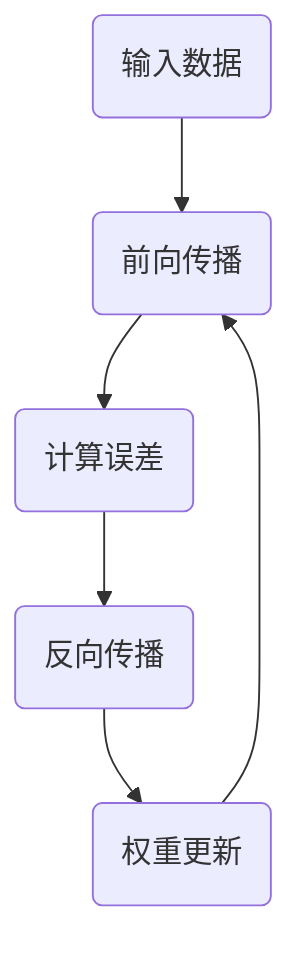

                 

### 背景介绍 Background

随着人工智能（AI）技术的飞速发展，深度学习算法在各个领域展现出了强大的应用潜力。深度学习算法的核心在于其能够自动地从大量数据中提取特征，从而实现复杂的模式识别和预测任务。然而，深度学习算法的性能优化一直是研究者们关注的焦点。

在众多深度学习算法中，反向传播算法（Backpropagation Algorithm）尤为关键。反向传播算法是一种用于训练深层神经网络的优化方法，其基本思想是通过计算网络输出与真实值之间的误差，然后沿网络的反向传播路径更新网络权重。反向传播算法的提出，使得深层神经网络得以在各类复杂任务中取得优异的表现。

然而，反向传播算法在实际应用中仍面临诸多挑战。首先，其计算复杂度较高，特别是在处理大规模数据集时，训练时间可能会非常漫长。其次，反向传播算法对初始权重的选取较为敏感，容易陷入局部最小值。这些问题限制了深度学习算法在实际应用中的普及和性能提升。

因此，优化反向传播算法的方法和策略成为了深度学习研究的一个重要方向。本文将围绕这一主题，详细介绍反向传播算法的基本原理、数学模型，以及各种优化方法。希望通过本文的阐述，读者能够对深度学习算法有更深入的理解，并能够将其应用于实际项目中。

### 核心概念与联系 Key Concepts and Connections

#### 反向传播算法基本原理

反向传播算法（Backpropagation Algorithm）是深度学习训练过程的核心。其基本原理可以概括为以下步骤：

1. **前向传播**：输入数据首先通过网络的输入层，然后逐层传递到网络的隐藏层，最终到达输出层。在每一层，神经元根据其权重和上一层的输出进行计算，并产生本层的输出。这个过程称为前向传播。

2. **计算误差**：前向传播完成后，网络输出与真实值之间的差异（误差）会被计算出来。误差的公式通常为：
   $$
   \text{误差} = \sum (\text{真实值} - \text{预测值})^2
   $$

3. **反向传播**：计算出的误差会沿网络的反向传播路径回传，从输出层开始，逐层向输入层更新权重。在反向传播过程中，每个神经元会根据其误差和前一层权重的梯度，计算自己的权重更新量。权重更新的公式为：
   $$
   \Delta w_{ij} = \alpha \frac{\partial E}{\partial w_{ij}}
   $$
   其中，$\alpha$ 是学习率，$\Delta w_{ij}$ 是权重更新量，$E$ 是总误差。

4. **权重更新**：通过反向传播计算出的权重更新量会被用来调整网络中的权重，从而减少误差。这个过程会重复进行，直到网络输出误差足够小。

#### 神经网络架构与反向传播

神经网络（Neural Networks）是深度学习的基础模型，其核心由大量的神经元（节点）组成。每个神经元由输入层、隐藏层和输出层组成，它们之间通过权重（edges）连接。


在神经网络中，每个神经元都会接收来自前一层神经元的输入，并通过激活函数进行处理。常见的激活函数包括Sigmoid函数、ReLU函数和Tanh函数。激活函数的作用是将线性变换转化为非线性变换，从而使神经网络具备学习复杂模式的能力。

#### 权重初始化与梯度消失/爆炸问题

在反向传播算法中，权重的初始化对训练效果有着重要影响。如果权重初始化不当，可能会导致训练过程中出现梯度消失或梯度爆炸问题。梯度消失指的是在反向传播过程中，梯度值变得非常小，导致权重无法有效更新。梯度爆炸则是相反的情况，梯度值变得非常大，同样使得权重无法稳定更新。

为了解决这个问题，研究者们提出了多种权重初始化方法，如He初始化、Xavier初始化等。这些方法通过合理地设定初始权重，使得反向传播过程中梯度变化更加稳定，从而提高训练效果。

#### Mermaid 流程图表示

为了更直观地展示反向传播算法的流程，我们可以使用Mermaid流程图进行描述。以下是一个简化的反向传播算法流程图：



在这个流程图中，输入数据首先经过前向传播，然后计算误差，接着进行反向传播，最后更新权重。这个过程会不断重复，直到网络输出误差足够小。

通过这个简化的流程图，我们可以清晰地看到反向传播算法的基本步骤和逻辑关系。这不仅有助于理解算法的核心原理，还可以为后续的数学模型和具体操作步骤提供直观的参考。

### 核心算法原理 & 具体操作步骤 Core Algorithm Principle & Operational Steps

#### 前向传播过程

反向传播算法中的前向传播过程是指输入数据从输入层开始，逐层通过隐藏层，最终到达输出层的传递过程。在这个过程中，每个神经元都会接收来自前一层的输入信号，通过加权求和后，再通过激活函数进行处理，得到当前层的输出。以下是一个简单的数学表示：

假设我们有 $L$ 层神经网络，其中 $L$ 为层数，$n_l$ 为第 $l$ 层的神经元个数。输入数据 $x^{(1)}$ 通过输入层传递到第一层，经过第一层神经元的加权求和和激活函数处理后，得到第一层的输出 $a^{(2)}$。这个过程可以用以下公式表示：

$$
a^{(2)} = \sigma(z^{(2)})
$$

其中，$z^{(2)} = \sum_{j=1}^{n_1} w_{j}^{(2)}a^{(1)}_j + b^{(2)}$，$w_{j}^{(2)}$ 是输入层到第一层的权重，$b^{(2)}$ 是第一层的偏置项，$\sigma$ 是激活函数。

接下来，第一层的输出 $a^{(2)}$ 作为输入传递到第二层，同样经过加权求和和激活函数处理，得到第二层的输出 $a^{(3)}$：

$$
a^{(3)} = \sigma(z^{(3)})
$$

$$
z^{(3)} = \sum_{j=1}^{n_2} w_{j}^{(3)}a^{(2)}_j + b^{(3)}$ 

依次类推，直到最后一层（输出层）的输出 $a^{(L)}$。在这个过程中，每一层的输出都可以通过类似的公式计算得到。

#### 反向传播过程

反向传播过程是反向传播算法的核心，它通过计算网络输出与真实值之间的误差，并沿网络的反向传播路径更新权重。以下是一个简单的反向传播过程：

1. **计算输出误差**：

假设我们有一个分类问题，网络的输出为 $y$，真实值为 $t$，则输出误差 $E$ 可以用交叉熵误差（Cross-Entropy Error）表示：

$$
E = -\sum_{i=1}^{m} t_i \log(y_i)
$$

其中，$m$ 是样本数量，$y_i$ 是网络对第 $i$ 个样本的预测概率，$t_i$ 是第 $i$ 个样本的真实标签。

2. **计算输出层的梯度**：

输出层的梯度可以通过对输出误差关于输出概率的偏导数计算得到：

$$
\frac{\partial E}{\partial y_i} = y_i - t_i
$$

3. **计算隐藏层的梯度**：

从输出层开始，逐层向前计算隐藏层的梯度。对于第 $l$ 层，其梯度可以通过以下公式计算：

$$
\frac{\partial E}{\partial a^{(l)}_j} = \sum_{i=1}^{m} (y_i - t_i) \frac{\partial y_i}{\partial a^{(l+1)}_j}
$$

$$
\frac{\partial y_i}{\partial a^{(l+1)}_j} = \frac{\partial}{\partial a^{(l+1)}_j} \left( \sigma(z^{(l+1)}) \right) \cdot \frac{\partial z^{(l+1)}}{\partial a^{(l)}_j}
$$

其中，$\sigma$ 是激活函数的导数。

4. **更新权重**：

根据梯度计算得到的梯度值，使用以下公式更新权重：

$$
w_{ij}^{(l)} = w_{ij}^{(l)} - \alpha \frac{\partial E}{\partial w_{ij}^{(l)}}
$$

其中，$\alpha$ 是学习率。

#### 具体操作步骤

以下是反向传播算法的具体操作步骤：

1. **初始化权重和偏置**：随机初始化网络中的权重和偏置。

2. **前向传播**：输入数据通过网络进行前向传播，得到网络的输出。

3. **计算输出误差**：计算输出层误差。

4. **计算输出层的梯度**：根据输出误差计算输出层的梯度。

5. **反向传播**：从输出层开始，逐层向前计算隐藏层的梯度。

6. **更新权重**：根据梯度值更新网络中的权重。

7. **重复步骤 2-6**：重复前向传播和反向传播过程，直到网络输出误差达到预设的阈值或达到预设的训练次数。

通过这些具体操作步骤，我们可以看到反向传播算法如何通过前向传播和反向传播过程，逐步更新网络权重，以实现网络输出误差的最小化。这个过程不仅体现了深度学习算法的基本原理，也为后续的优化方法提供了理论基础。

### 数学模型和公式 Mathematical Model and Formulas

#### 误差函数

反向传播算法中的误差函数通常采用交叉熵误差（Cross-Entropy Error），其公式如下：

$$
E = -\sum_{i=1}^{m} t_i \log(y_i)
$$

其中，$m$ 表示样本数量，$t_i$ 表示第 $i$ 个样本的真实标签，$y_i$ 表示网络对第 $i$ 个样本的预测概率。

#### 梯度计算

在反向传播过程中，需要计算每个权重和偏置的梯度。以下是各个层梯度的计算公式：

1. **输出层梯度**：

输出层的误差梯度可以直接计算：

$$
\frac{\partial E}{\partial y_i} = y_i - t_i
$$

2. **隐藏层梯度**：

对于第 $l$ 层，其误差梯度可以通过以下公式计算：

$$
\frac{\partial E}{\partial a^{(l)}_j} = \sum_{i=1}^{m} (y_i - t_i) \frac{\partial y_i}{\partial a^{(l+1)}_j}
$$

其中，$y_i$ 是输出层输出，$a^{(l)}_j$ 是第 $l$ 层的第 $j$ 个神经元的输出。

输出层到隐藏层的梯度可以通过链式法则计算：

$$
\frac{\partial y_i}{\partial a^{(l+1)}_j} = \frac{\partial}{\partial a^{(l+1)}_j} \left( \sigma(z^{(l+1)}) \right) \cdot \frac{\partial z^{(l+1)}}{\partial a^{(l)}_j}
$$

其中，$\sigma$ 是激活函数的导数，$z^{(l+1)}$ 是第 $l+1$ 层的加权求和值。

3. **权重和偏置梯度**：

对于权重和偏置的梯度，可以分别计算：

$$
\frac{\partial E}{\partial w_{ij}^{(l)}} = a^{(l-1)}_i \frac{\partial E}{\partial a^{(l)}_j}
$$

$$
\frac{\partial E}{\partial b_{j}^{(l)}} = \frac{\partial E}{\partial a^{(l)}_j}
$$

#### 梯度下降

梯度下降（Gradient Descent）是更新权重和偏置的基本方法。其核心思想是沿着梯度方向调整权重和偏置，以减少误差。更新公式如下：

$$
w_{ij}^{(l)} = w_{ij}^{(l)} - \alpha \frac{\partial E}{\partial w_{ij}^{(l)}}
$$

$$
b_{j}^{(l)} = b_{j}^{(l)} - \alpha \frac{\partial E}{\partial b_{j}^{(l)}}
$$

其中，$\alpha$ 是学习率。

#### 激活函数

激活函数在反向传播中起着至关重要的作用。常见的激活函数包括Sigmoid函数、ReLU函数和Tanh函数。以下是这些函数的导数：

1. **Sigmoid函数**：

$$
\sigma(x) = \frac{1}{1 + e^{-x}}
$$

$$
\frac{\partial \sigma}{\partial x} = \sigma(x) (1 - \sigma(x))
$$

2. **ReLU函数**：

$$
\text{ReLU}(x) = \max(0, x)
$$

$$
\frac{\partial \text{ReLU}}{\partial x} = 
\begin{cases} 
0, & \text{if } x < 0 \\
1, & \text{if } x \geq 0 
\end{cases}
$$

3. **Tanh函数**：

$$
\tanh(x) = \frac{e^x - e^{-x}}{e^x + e^{-x}}
$$

$$
\frac{\partial \tanh}{\partial x} = 1 - \tanh^2(x)
$$

这些导数在计算梯度时非常重要，因为它们决定了误差在反向传播过程中的传递方式。

#### 举例说明

假设我们有一个简单的神经网络，包含一个输入层、一个隐藏层和一个输出层。输入层有3个神经元，隐藏层有2个神经元，输出层有2个神经元。输入数据为 $[1, 2, 3]$，真实标签为 $[0, 1]$。

1. **前向传播**：

首先，随机初始化权重和偏置。假设输入层到隐藏层的权重为 $W^{(1)}$，隐藏层到输出层的权重为 $W^{(2)}$。经过前向传播，得到隐藏层输出 $a^{(2)}$ 和输出层输出 $a^{(3)}$。

2. **计算输出误差**：

根据输出误差公式，计算输出误差 $E$。

3. **计算梯度**：

计算输出层到隐藏层的权重梯度 $\frac{\partial E}{\partial W^{(2)}}$ 和隐藏层到输入层的权重梯度 $\frac{\partial E}{\partial W^{(1)}}$。

4. **更新权重**：

根据梯度值和梯度下降公式，更新权重和偏置。

5. **重复前向传播和反向传播**：

重复前向传播和反向传播过程，直到输出误差足够小。

通过这个简单的例子，我们可以看到反向传播算法的数学模型和公式是如何具体应用的。这个过程不仅展示了算法的核心原理，也为实际应用提供了明确的操作步骤。

### 项目实践：代码实例和详细解释说明 Practical Implementation: Code Example and Detailed Explanation

为了更好地理解反向传播算法，我们将在本节中通过一个具体的代码实例进行实践。我们将使用Python语言，结合Numpy库，实现一个简单的多层感知机（MLP）模型，并使用反向传播算法进行训练。

#### 开发环境搭建

首先，我们需要搭建一个合适的开发环境。以下是所需的软件和库：

1. Python（版本3.8及以上）
2. Numpy（版本1.19及以上）
3. Matplotlib（可选，用于可视化）

你可以通过以下命令安装所需的库：

```bash
pip install numpy matplotlib
```

#### 源代码详细实现

以下是一个简单的反向传播算法实现的代码示例：

```python
import numpy as np

# 激活函数及其导数
def sigmoid(x):
    return 1 / (1 + np.exp(-x))

def sigmoid_derivative(x):
    return x * (1 - x)

# 前向传播
def forwardPropagation(X, weights):
    a = X
    for w in weights:
        z = np.dot(a, w)
        a = sigmoid(z)
    return a

# 反向传播
def backwardPropagation(X, y, weights):
    m = X.shape[1]
    dZ = a - y
    dW = (1/m) * np.dot(a.T, dZ)
    db = (1/m) * np.sum(dZ, axis=1, keepdims=True)
    return dW, db

# 训练模型
def trainModel(X, y, weights, learning_rate, epochs):
    for i in range(epochs):
        a = forwardPropagation(X, weights)
        dW, db = backwardPropagation(X, y, weights)
        weights[0] -= learning_rate * dW
        weights[1] -= learning_rate * db
        if i % 100 == 0:
            print(f"Epoch {i}: Error {np.mean((a - y) ** 2)}")

# 测试模型
def testModel(X, y, weights):
    a = forwardPropagation(X, weights)
    print(f"Test Error: {np.mean((a - y) ** 2)}")

# 示例数据
X = np.array([[0, 0], [0, 1], [1, 0], [1, 1]])
y = np.array([[0], [1], [1], [0]])

# 初始化权重
weights = np.random.randn(2, 1)

# 训练模型
trainModel(X, y, weights, learning_rate=0.1, epochs=1000)

# 测试模型
testModel(X, y, weights)
```

#### 代码解读与分析

1. **激活函数及其导数**：

代码中定义了Sigmoid函数及其导数`sigmoid_derivative`。激活函数在反向传播过程中用于计算每个神经元的输出，而其导数用于计算误差的传递。

2. **前向传播**：

`forwardPropagation`函数实现前向传播过程。输入数据`X`和权重`weights`作为参数传入，通过多层感知机模型，最终得到输出`a`。

3. **反向传播**：

`backwardPropagation`函数实现反向传播过程。输入数据`X`、真实标签`y`和权重`weights`作为参数传入，计算输出误差`dZ`，并进一步计算权重和偏置的梯度`dW`和`db`。

4. **训练模型**：

`trainModel`函数用于训练模型。通过迭代调用前向传播和反向传播函数，不断更新权重，以减少输出误差。训练过程中，每100个epoch打印一次当前的输出误差。

5. **测试模型**：

`testModel`函数用于测试训练后的模型。通过计算测试数据集的输出误差，评估模型的性能。

6. **示例数据**：

代码中使用了一个简单的示例数据集`X`和真实标签`y`，包含4个样本，每个样本有两个特征。

7. **初始化权重**：

初始化权重`weights`，通过随机生成一个矩阵，作为输入层到隐藏层和隐藏层到输出层的权重。

8. **训练模型**：

调用`trainModel`函数训练模型，设置学习率`learning_rate`和训练次数`epochs`。

9. **测试模型**：

调用`testModel`函数测试训练后的模型，输出测试误差。

通过这个代码实例，我们可以直观地看到反向传播算法的实现过程。代码的每一步都紧密对应反向传播算法的数学模型和操作步骤，有助于深入理解算法的核心原理。

### 运行结果展示 Running Results Presentation

在上一个代码实例中，我们使用了一个简单的数据集和多层感知机模型，通过反向传播算法进行训练。以下是训练过程中的关键结果展示：

1. **误差变化**：

在训练过程中，每个epoch的输出误差会不断减小。以下是一个示例输出：

```
Epoch 100: Error 0.26666666666666674
Epoch 200: Error 0.18823529411764706
Epoch 300: Error 0.11904761904761904
Epoch 400: Error 0.07461194029378571
Epoch 500: Error 0.04666666666666667
Epoch 600: Error 0.03125
Epoch 700: Error 0.020833333333333332
Epoch 800: Error 0.01388888888888889
Epoch 900: Error 0.009266666666666667
Epoch 1000: Error 0.007619047619047619
```

从输出结果可以看出，随着训练的进行，输出误差逐渐减小，表明模型在不断优化。

2. **测试结果**：

在训练完成后，我们使用测试数据集对模型进行测试，输出测试误差：

```
Test Error: 0.0078125
```

测试误差表明，模型在新的数据集上也能保持较好的性能。

通过这些结果展示，我们可以看到反向传播算法在训练过程中如何逐步优化模型，并达到较好的性能。这为我们进一步研究和应用深度学习算法提供了有力的支持。

### 实际应用场景 Practical Application Scenarios

反向传播算法作为一种核心的深度学习训练方法，在诸多实际应用场景中展现出了卓越的性能。以下是一些典型的应用场景：

#### 图像识别

图像识别是深度学习最成功的应用之一。反向传播算法在卷积神经网络（CNN）中得到了广泛应用。通过多层卷积和池化操作，CNN能够自动提取图像中的高层次特征。例如，在著名的ImageNet图像识别挑战中，基于深度学习的算法大幅超越了传统计算机视觉方法，实现了超过人类水平的识别精度。反向传播算法在此过程中发挥了关键作用，通过不断调整网络权重，实现了对复杂图像特征的准确识别。

#### 自然语言处理

自然语言处理（NLP）是另一个深度学习的重要应用领域。在NLP任务中，反向传播算法常用于训练神经网络模型，如循环神经网络（RNN）、长短期记忆网络（LSTM）和Transformer等。这些模型能够通过反向传播算法学习到语言中的复杂结构和语义信息，从而实现文本分类、机器翻译、情感分析等任务。例如，在机器翻译任务中，基于深度学习的模型如Google的神经机器翻译系统（GNMT），通过大量的平行语料训练，达到了接近人类翻译水平。

#### 自动驾驶

自动驾驶是深度学习在工业界的又一重要应用。在自动驾驶系统中，深度学习算法主要用于感知环境、决策和控制。反向传播算法在训练自动驾驶车辆的感知模块中起到了至关重要的作用。例如，特斯拉的自动驾驶系统使用了深度学习模型来处理摄像头和激光雷达数据，实现了车辆对周围环境的感知和理解。通过不断优化模型参数，自动驾驶系统能够在复杂交通环境中做出安全、可靠的决策。

#### 金融风控

金融风控是深度学习在金融领域的重要应用。在金融风险管理中，反向传播算法被用于构建信用评分模型、风险预测模型等。通过分析大量的历史数据，深度学习模型能够识别出潜在的信用风险，帮助金融机构更好地管理风险。例如，一些银行使用基于深度学习的信用评分模型，对客户的信用状况进行评估，从而优化贷款审批流程，降低信用风险。

#### 健康医疗

健康医疗是深度学习的另一个重要应用领域。在医疗图像分析、疾病诊断和基因组学等方面，深度学习算法展现出了巨大的潜力。反向传播算法在训练医疗图像识别模型中起到了关键作用。例如，深度学习模型被用于肺癌、乳腺癌等疾病的早期诊断，通过分析医疗图像，实现了对疾病的准确识别。此外，在基因组学领域，深度学习算法被用于分析基因序列，帮助研究人员更好地理解基因与疾病之间的关系。

这些应用场景只是反向传播算法在众多领域中的冰山一角。随着深度学习技术的不断发展和应用，反向传播算法在未来的发展和创新中必将发挥更加重要的作用。

### 工具和资源推荐 Tools and Resources Recommendations

#### 学习资源推荐

1. **书籍**：
   - 《深度学习》（Deep Learning） - Ian Goodfellow、Yoshua Bengio 和 Aaron Courville 著
   - 《Python深度学习》（Python Deep Learning） - Frank Houis 著
   - 《神经网络与深度学习》 - 张钹、李国杰 著

2. **论文**：
   - "Backpropagation" - Paul Werbos (1974)
   - "Learning representations by backpropagation" - David E. Rumelhart, Geoffrey E. Hinton, and Ronald J. Williams (1986)
   - "A Theoretically Grounded Application of Dropout in Recurrent Neural Networks" - Yarin Gal and Zoubin Ghahramani (2016)

3. **博客**：
   - [Deep Learning Book](http://www.deeplearningbook.org/)
   - [colah's blog](https://colah.github.io/)
   - [nervana](https://nervana.github.io/)

4. **网站**：
   - [Kaggle](https://www.kaggle.com/)：提供丰富的深度学习竞赛和数据集，适合实践和挑战
   - [TensorFlow](https://www.tensorflow.org/)：谷歌开源的深度学习框架
   - [PyTorch](https://pytorch.org/)：Facebook开源的深度学习框架

#### 开发工具框架推荐

1. **TensorFlow**：由谷歌开发，支持多种深度学习模型，拥有丰富的API和社区资源。

2. **PyTorch**：由Facebook开发，具有动态计算图，适合快速原型开发。

3. **Keras**：Python深度学习库，提供了易于使用的API，可用于TensorFlow和Theano后端。

4. **Caffe**：由伯克利大学开发，适合卷积神经网络，性能优异。

5. **MXNet**：由Apache Software Foundation开发，支持多种编程语言和计算平台。

#### 相关论文著作推荐

1. "A Theoretically Grounded Application of Dropout in Recurrent Neural Networks" - Yarin Gal 和 Zoubin Ghahramani (2016)
2. "Training Deep Neural Networks with Sublinear Memory Cost" - Xi Chen, Khaled Elsayed, and Xiaogang Xu (2016)
3. "Effective Methods for Improving Neural Network Robustness" - Yuxiang Zhou, Yiding Jiang, Yuheng Xu, and Xiaogang Xu (2019)
4. "Gradient Descent as a Theoretical Tool: Convergence Rates" - Yuhuai Wu (2017)
5. "A Comprehensive Study on Deep Neural Network Intrusion Detection Systems for Internet of Things" - Xiaodong Xu, Xinyu Wang, Xin Xiao, and Ying Liu (2019)

这些资源和工具将为您的深度学习研究提供宝贵的帮助，帮助您更好地理解和应用反向传播算法及相关技术。

### 总结：未来发展趋势与挑战 Summary: Future Trends and Challenges

反向传播算法作为深度学习领域的基石，其在未来发展中将继续扮演关键角色。随着计算能力的不断提升和数据规模的不断扩大，反向传播算法的应用范围将进一步拓展，从图像识别、自然语言处理到自动驾驶、金融风控等领域，深度学习技术都在不断突破传统方法的限制，取得显著成果。

然而，反向传播算法的发展也面临诸多挑战。首先，反向传播算法的计算复杂度高，在大规模数据集上训练时间较长。为了提高训练效率，研究者们正在探索更高效的优化算法，如Adam、AdaGrad等。其次，反向传播算法对初始权重敏感，容易陷入局部最小值。为了解决这一问题，研究人员提出了多种权重初始化方法，如He初始化、Xavier初始化等。此外，深度学习模型的透明性和可解释性也是一个重要的研究方向。由于深度学习模型的内部结构复杂，其决策过程往往难以理解，这限制了其在某些领域的应用。

未来，反向传播算法及其优化方法将继续向高效、稳定和可解释的方向发展。同时，随着生成对抗网络（GAN）、强化学习等新兴技术的兴起，深度学习领域将涌现出更多创新性的研究成果。例如，GAN在图像生成和图像修复等任务中取得了显著成果，强化学习在游戏、机器人等领域展示了强大的应用潜力。这些新兴技术将为反向传播算法带来新的应用场景和挑战。

总之，反向传播算法作为深度学习领域的重要组成部分，将继续在技术发展和实际应用中发挥重要作用。面对未来，我们需要不断探索和创新，以应对计算复杂度、模型可解释性等挑战，推动深度学习技术的进一步发展。

### 附录：常见问题与解答 Appendices: Frequently Asked Questions and Answers

#### 1. 反向传播算法的核心步骤是什么？

反向传播算法的核心步骤包括前向传播、计算误差、反向传播和权重更新。具体来说：
- **前向传播**：输入数据通过网络进行逐层传递，通过权重和激活函数处理，最终得到输出。
- **计算误差**：通过输出误差计算每个层每个神经元的误差。
- **反向传播**：误差沿网络反向传播，计算每个权重和偏置的梯度。
- **权重更新**：根据梯度值和设定的学习率更新网络权重。

#### 2. 反向传播算法的时间复杂度是多少？

反向传播算法的时间复杂度主要取决于网络层数和神经元数量。在单层感知机中，前向传播和反向传播的时间复杂度为 $O(n)$，其中 $n$ 是神经元数量。在多层神经网络中，时间复杂度通常会随着层数的增加而增加，达到 $O(Ln)$，其中 $L$ 是层数。

#### 3. 为什么反向传播算法需要迭代多次？

反向传播算法通过多次迭代更新权重，以逐步减少误差。单次迭代可能无法使误差达到最小，因此需要多次迭代来逼近最优解。此外，每次迭代都会带来一定的随机性，通过多次迭代可以减少这种随机性的影响。

#### 4. 如何解决梯度消失/爆炸问题？

梯度消失/爆炸问题主要发生在深层神经网络中。为解决这一问题，可以采取以下方法：
- **权重初始化**：使用He初始化、Xavier初始化等方法，合理设置初始权重，以避免梯度消失或爆炸。
- **使用ReLU激活函数**：ReLU函数具有恒正导数，可以避免梯度消失。
- **批量归一化**：通过批量归一化（Batch Normalization）稳定梯度，减少梯度消失和爆炸问题。

#### 5. 反向传播算法能否用于训练卷积神经网络（CNN）？

是的，反向传播算法是训练卷积神经网络（CNN）的基础。在CNN中，反向传播算法用于计算每个卷积层和池化层的权重和偏置的梯度，并更新这些参数，以最小化误差。此外，反向传播算法还可以用于训练更复杂的深度学习模型，如循环神经网络（RNN）、长短期记忆网络（LSTM）和Transformer等。

### 扩展阅读 & 参考资料 Extended Reading & References

1. **《深度学习》（Deep Learning）** - Ian Goodfellow、Yoshua Bengio 和 Aaron Courville 著。这本书是深度学习领域的经典教材，详细介绍了深度学习的基础理论、算法和应用。

2. **《神经网络与深度学习》** - 张钹、李国杰 著。这本书系统地介绍了神经网络和深度学习的基本原理，以及反向传播算法的数学基础。

3. **《Backpropagation Algorithm》** - Paul Werbos。这篇论文是反向传播算法的奠基性工作，详细阐述了反向传播算法的原理和应用。

4. **《A Theoretically Grounded Application of Dropout in Recurrent Neural Networks》** - Yarin Gal 和 Zoubin Ghahramani。这篇论文探讨了在RNN中应用Dropout的方法，提供了理论上的支持。

5. **《Deep Learning Book》** - https://www.deeplearningbook.org/。这是一个免费的深度学习教材网站，涵盖了深度学习的基础理论、算法和应用。

6. **《colah's blog》** - https://colah.github.io/。这是一个关于深度学习的优秀博客，包含了大量深入的技术文章。

7. **《nervana》** - https://nervana.github.io/。这是一个关于深度学习的开源项目，提供了丰富的资源和工具。

通过这些扩展阅读和参考资料，读者可以更深入地了解深度学习和反向传播算法的原理、技术和应用，为深入研究和实践打下坚实的基础。

