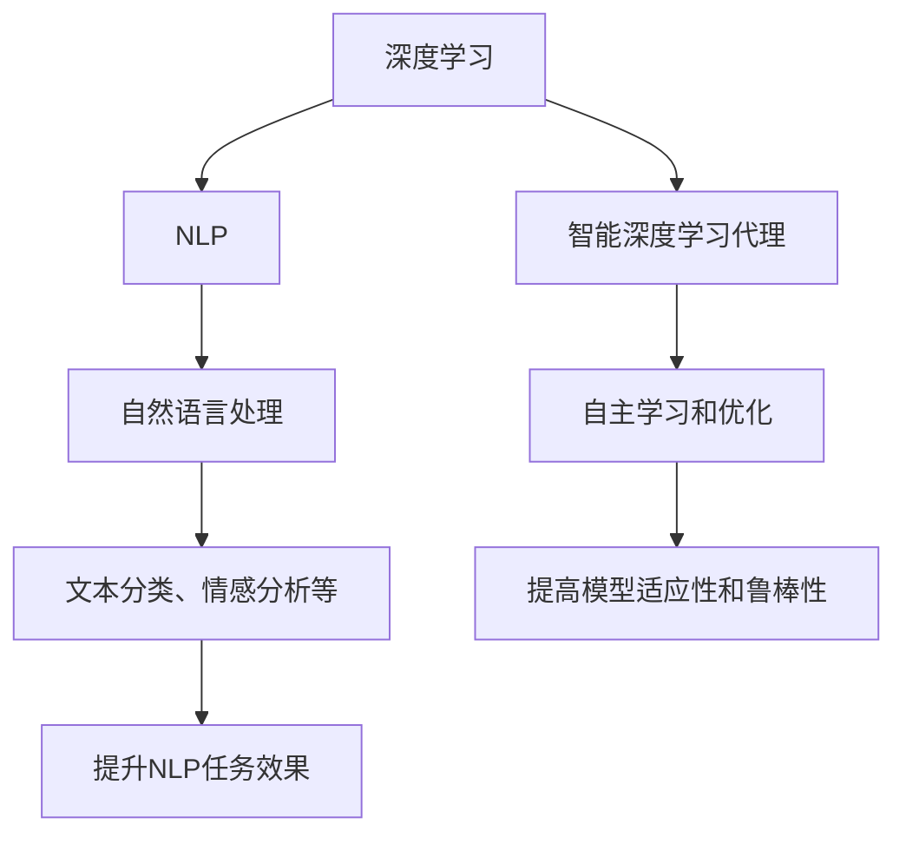

                 

### 背景介绍

人工智能（AI）作为当前科技发展的前沿领域，其重要性日益凸显。AI技术已经在各个行业得到广泛应用，从自动驾驶汽车到智能助手，再到金融风控和医疗诊断，都离不开AI的助力。在AI的众多分支中，深度学习（Deep Learning）以其卓越的表现力和适应性，成为了实现AI目标的核心技术之一。

深度学习通过构建具有大量参数的神经网络，对数据进行层次化的特征提取和模式识别。其原理基于人脑的神经元结构和信息处理机制，通过逐层学习实现从简单到复杂的特征表示。近年来，随着计算能力的提升和大数据技术的成熟，深度学习在图像识别、语音识别、自然语言处理等领域的表现已经超越了传统机器学习方法。

自然语言处理（Natural Language Processing，NLP）是深度学习的一个重要应用领域。NLP旨在使计算机能够理解和处理人类语言，其目标包括文本分类、情感分析、机器翻译、问答系统等。随着互联网和社交媒体的迅速发展，NLP在信息检索、智能客服、舆情监控等方面的应用越来越广泛。

然而，当前深度学习在自然语言处理领域还存在一些挑战。例如，模型的解释性不足、数据不平衡、训练数据隐私等问题。这些问题不仅制约了NLP技术的进一步发展，也引发了社会对AI技术的信任危机。因此，如何设计出更加智能、透明、安全的深度学习模型，成为了当前研究的热点之一。

为了应对这些挑战，近年来研究者们提出了各种深度学习算法，并尝试将其应用于自然语言处理领域。这些算法不仅提高了模型的性能，还增强了模型的可解释性。本文将重点探讨这些深度学习算法在自然语言处理中的运用，以及如何通过智能深度学习代理（Intelligent Deep Learning Agent）来提升NLP的效果。

智能深度学习代理是一种基于深度学习的自主学习和优化系统，能够根据环境反馈不断调整自身行为，以实现特定任务的目标。在NLP领域，智能深度学习代理可以通过自我学习和优化，不断提高文本处理的能力和效率。本文将详细分析智能深度学习代理的工作原理和应用场景，并结合具体案例展示其在自然语言处理中的优势。

总之，深度学习在自然语言处理领域的应用不仅为AI技术的发展提供了新的动力，也为我们理解和解决实际问题带来了新的方法。通过本文的探讨，希望能够为读者提供对这一领域的全面了解，并激发更多创新性的研究思路。

### 核心概念与联系

在深入探讨智能深度学习代理在自然语言处理（NLP）中的运用之前，我们需要首先理解几个核心概念，并分析这些概念之间的联系。以下是本文将要涉及的主要核心概念：

1. **深度学习（Deep Learning）**：
   - 定义：深度学习是一种基于多层神经网络（Neural Networks）的机器学习方法，能够自动从大量数据中学习特征，进行复杂的模式识别和预测。
   - 主要组成部分：包括输入层、隐藏层和输出层。通过多个隐藏层的叠加，深度学习模型能够提取出从简单到复杂的特征，从而实现高层次的抽象。

2. **自然语言处理（Natural Language Processing，NLP）**：
   - 定义：自然语言处理是计算机科学和语言学领域的一个分支，旨在使计算机能够理解、解释和生成人类语言。
   - 主要任务：文本分类、情感分析、机器翻译、问答系统等。NLP广泛应用于信息检索、智能客服、舆情监控等领域。

3. **智能深度学习代理（Intelligent Deep Learning Agent）**：
   - 定义：智能深度学习代理是一种具备自主学习和优化能力的深度学习系统，能够根据环境反馈自动调整参数和策略，以实现特定任务目标。
   - 功能：通过自我学习和优化，智能深度学习代理能够提高任务处理的效率和质量，同时增强系统的适应性。

#### 核心概念之间的联系

深度学习和自然语言处理之间的联系在于，深度学习为NLP提供了强大的工具和算法支持。具体来说：

- **深度学习在NLP中的应用**：深度学习通过其多层网络结构，可以从原始文本数据中自动提取复杂特征，如词嵌入（Word Embedding）、句嵌入（Sentence Embedding）等。这些特征有助于提高NLP任务的处理效果，如文本分类中的准确率和情感分析中的情感识别。

- **智能深度学习代理在NLP中的作用**：智能深度学习代理通过在NLP任务中的自我学习和优化，能够动态调整模型参数，从而提高模型的适应性和鲁棒性。例如，在问答系统中，智能代理可以通过学习用户的提问模式，优化答案生成策略，从而提高问答的准确性和用户满意度。

为了更直观地理解这些概念之间的联系，我们可以借助Mermaid流程图来展示它们之间的关系：



- **图解说明**：
  - A节点表示深度学习，它是整个流程的核心。
  - B节点表示自然语言处理，是深度学习应用的主要领域。
  - C节点具体说明了NLP的主要任务和应用场景。
  - D节点表示智能深度学习代理，它通过自主学习和优化来增强系统的能力。
  - E节点说明了智能深度学习代理的功能，即自主学习和优化。
  - F节点表示NLP的具体任务，如文本分类和情感分析。
  - G节点解释了智能深度学习代理如何提高模型的适应性和鲁棒性。
  - H节点说明了通过智能代理，NLP任务处理效果的提升。

通过上述核心概念及其相互关系的分析，我们为后续深入探讨智能深度学习代理在NLP中的具体应用奠定了基础。在接下来的章节中，我们将进一步探讨深度学习算法的原理和操作步骤，并通过具体实例展示其应用效果。

### 核心算法原理 & 具体操作步骤

在了解了深度学习、自然语言处理和智能深度学习代理的基本概念后，接下来我们将深入探讨用于自然语言处理的核心深度学习算法及其具体操作步骤。以下是一些常见的深度学习算法，它们在NLP领域中具有重要应用：

#### 1. 词嵌入（Word Embedding）

词嵌入是一种将词汇映射到高维向量空间的方法，使相似词汇在向量空间中彼此接近。常用的词嵌入算法包括Word2Vec、GloVe和BERT。

- **Word2Vec**：
  - **原理**：基于神经网络的语言模型，通过预测词语的上下文来学习词汇的向量表示。它有两种模型：Continuous Bag of Words (CBOW)和Skip-Gram。
  - **操作步骤**：
    1. 预处理文本数据，包括分词和标记化。
    2. 构建词汇表和索引。
    3. 初始化词向量矩阵。
    4. 训练神经网络，通过反向传播算法调整权重。
    5. 得到预训练的词向量。

- **GloVe**：
  - **原理**：基于全局的词向量生成方法，通过考虑词汇的共现关系来学习词向量。它基于两个矩阵：一个用于表示词汇的共现信息，另一个用于表示词汇的上下文信息。
  - **操作步骤**：
    1. 构建共现矩阵。
    2. 计算词汇的词频。
    3. 利用矩阵分解方法求解词向量和上下文向量。

- **BERT**：
  - **原理**：基于Transformer的预训练语言模型，通过双向编码表示（Bidirectional Encoder Representations from Transformers）来捕捉词汇的前后文关系。
  - **操作步骤**：
    1. 预处理文本数据，包括分词和标记化。
    2. 构建词汇表和索引。
    3. 使用大规模语料库进行预训练，通过Masked Language Model (MLM)和Next Sentence Prediction (NSP)任务。
    4. 在具体任务上微调模型。

#### 2. 卷积神经网络（Convolutional Neural Networks，CNN）

卷积神经网络最初在图像处理领域得到广泛应用，但近年来也成功应用于自然语言处理任务，如文本分类和情感分析。

- **原理**：
  - CNN通过卷积层提取文本的特征，类似于图像中的边缘检测和纹理提取。
  - 通过多层卷积和池化操作，CNN能够捕捉到文本中的局部特征和全局特征。

- **操作步骤**：
  1. 预处理文本数据，包括分词和标记化。
  2. 输入到卷积神经网络中，通过卷积层提取特征。
  3. 通过池化层减小特征图的维度。
  4. 将特征传递到全连接层进行分类或回归任务。

#### 3. 递归神经网络（Recurrent Neural Networks，RNN）

递归神经网络是一种能够处理序列数据的神经网络，常用于语言模型和序列预测任务。

- **原理**：
  - RNN通过其循环结构，能够保留之前的输入信息，并将其传递到下一时刻。
  - 长短时记忆（Long Short-Term Memory，LSTM）和门控循环单元（Gated Recurrent Unit，GRU）是RNN的两种变体，通过门控机制解决了传统RNN的梯度消失问题。

- **操作步骤**：
  1. 预处理文本数据，包括分词和标记化。
  2. 将文本序列转换为词嵌入向量。
  3. 输入到RNN中，通过隐藏层传递信息。
  4. 利用隐藏层的输出进行分类或预测。

#### 4. Transformer

Transformer是近年来在自然语言处理领域取得突破性的模型，其基于自注意力（Self-Attention）机制，成功解决了RNN的序列处理问题。

- **原理**：
  - Transformer通过多头自注意力机制，能够同时关注输入序列中的所有信息。
  - 通过编码器-解码器结构，Transformer能够在翻译、机器翻译等任务中表现出色。

- **操作步骤**：
  1. 预处理文本数据，包括分词和标记化。
  2. 将文本序列转换为词嵌入向量。
  3. 输入到编码器，通过自注意力机制和前馈网络进行信息处理。
  4. 输出编码器的隐藏状态，作为解码器的输入。
  5. 输入到解码器，通过自注意力机制和前馈网络生成预测。

#### 5. BERT

BERT（Bidirectional Encoder Representations from Transformers）是Google提出的一种基于Transformer的预训练语言模型，通过双向编码表示来捕捉词汇的前后文关系。

- **原理**：
  - BERT通过大规模语料库进行预训练，包括Masked Language Model (MLM)和Next Sentence Prediction (NSP)任务。
  - 通过预训练，BERT能够捕捉到语言中的深层结构和语义信息。

- **操作步骤**：
  1. 预处理文本数据，包括分词和标记化。
  2. 构建词汇表和索引。
  3. 使用大规模语料库进行预训练。
  4. 在具体任务上微调模型。

通过上述核心算法的介绍，我们可以看到深度学习为自然语言处理提供了丰富的工具和算法支持。在接下来的章节中，我们将通过具体案例展示这些算法在自然语言处理任务中的应用效果。

### 数学模型和公式 & 详细讲解 & 举例说明

在理解了深度学习算法的基本原理和操作步骤后，我们需要进一步探讨这些算法背后的数学模型和公式，并通过具体的例子来说明其应用和计算过程。

#### 1. Word2Vec

Word2Vec是一种基于神经网络的词向量生成方法，其核心公式为：

\[ \text{Word2Vec} = \frac{1}{1 + \exp(-\text{dot}(v_w, v_c))} \]

- **公式解释**：
  - \( v_w \) 和 \( v_c \) 分别表示词汇 \( w \) 和其上下文词汇 \( c \) 的词向量。
  - dot() 表示向量内积。
  - 公式计算两个向量的内积，并将其归一化为概率分布。

- **举例说明**：

假设我们有两个词汇 "cat" 和 "dog"，其词向量分别为 \( v_{cat} \) 和 \( v_{dog} \)。我们可以计算这两个词汇的相似度：

\[ \text{similarity}(cat, dog) = \frac{1}{1 + \exp(-\text{dot}(v_{cat}, v_{dog}))} \]

例如，假设 \( v_{cat} = (0.1, 0.2, 0.3) \)，\( v_{dog} = (0.4, 0.5, 0.6) \)，则：

\[ \text{similarity}(cat, dog) = \frac{1}{1 + \exp(-0.1 \times 0.4 - 0.2 \times 0.5 - 0.3 \times 0.6)} \approx 0.81 \]

这意味着 "cat" 和 "dog" 在词向量空间中的相似度较高。

#### 2. GloVe

GloVe（Global Vectors for Word Representation）是一种基于全局共现信息的词向量生成方法，其核心公式为：

\[ f(w, c) = \frac{\text{exp}(w \cdot c) - k}{\sqrt{w + c} + k} \]

- **公式解释**：
  - \( w \) 和 \( c \) 分别表示词汇 \( w \) 和其上下文词汇 \( c \) 的词频。
  - \( k \) 是一个超参数，用于调整公式。
  - 公式计算两个词汇的词频共现度，并将其归一化为词向量。

- **举例说明**：

假设我们有两个词汇 "cat" 和 "dog"，其词频分别为 \( w_{cat} \) 和 \( w_{dog} \)，上下文词汇分别为 \( c_{cat} \) 和 \( c_{dog} \)。我们可以计算这两个词汇的共现度：

\[ f(cat, dog) = \frac{\text{exp}(w_{cat} \cdot c_{cat}) - k}{\sqrt{w_{cat} + c_{cat}} + k} \]

例如，假设 \( w_{cat} = 10 \)，\( c_{cat} = 5 \)，\( w_{dog} = 5 \)，\( c_{dog} = 10 \)，且 \( k = 0.1 \)，则：

\[ f(cat, dog) = \frac{\text{exp}(10 \times 5) - 0.1}{\sqrt{10 + 5} + 0.1} \approx 14.08 \]

这意味着 "cat" 和 "dog" 的词频共现度较高。

#### 3. BERT

BERT（Bidirectional Encoder Representations from Transformers）是一种基于Transformer的预训练语言模型，其核心公式为：

\[ \text{BERT} = \frac{1}{1 + \exp(-\text{dot}(Q, K^T + V^T))} \]

- **公式解释**：
  - \( Q \)、\( K \) 和 \( V \) 分别表示查询向量、键向量和值向量。
  - 公式计算查询向量和键值向量的内积，并通过自注意力机制进行权重调整。

- **举例说明**：

假设我们有一个查询向量 \( Q = (1, 2, 3) \)，键向量 \( K = (4, 5, 6) \)，值向量 \( V = (7, 8, 9) \)。我们可以计算这三个向量的内积：

\[ \text{attention} = \frac{1}{1 + \exp(-1 \times 4 - 2 \times 5 - 3 \times 6)} \]

\[ \text{attention} = \frac{1}{1 + \exp(-19)} \approx 0.86 \]

这意味着查询向量对键值向量的关注度较高。

#### 4. CNN

卷积神经网络（CNN）是一种常用于图像和文本处理的深度学习模型，其核心公式为：

\[ \text{CNN} = \text{ReLU}(\text{conv}(\text{pad}(x) \odot k) + b) \]

- **公式解释**：
  - \( x \) 表示输入特征图。
  - \( k \) 表示卷积核。
  - \( b \) 表示偏置项。
  - \( \text{pad} \) 表示填充操作，用于保持特征图的尺寸。
  - \( \odot \) 表示卷积操作。
  - \( \text{ReLU} \) 表示ReLU激活函数。

- **举例说明**：

假设我们有一个 \( 3 \times 3 \) 的卷积核 \( k = (1, 1, 1) \)，输入特征图 \( x = (1, 2, 3; 4, 5, 6; 7, 8, 9) \)。我们可以计算卷积操作：

\[ \text{conv}((1, 2, 3) \odot (1, 1, 1) + (4, 5, 6) \odot (1, 1, 1) + (7, 8, 9) \odot (1, 1, 1)) + b \]

\[ \text{conv}((1 + 4 + 7), (2 + 5 + 8), (3 + 6 + 9)) + b \]

\[ \text{conv}(12, 16, 24) + b \]

假设 \( b = 1 \)，则：

\[ \text{CNN} = \text{ReLU}(12 + 1, 16 + 1, 24 + 1) \]

\[ \text{CNN} = \text{ReLU}(13, 17, 25) \]

通过上述数学模型和公式的详细讲解，我们可以更深入地理解深度学习算法的工作原理和应用。在接下来的章节中，我们将通过实际项目实例来展示这些算法的具体应用过程和效果。

### 项目实践：代码实例和详细解释说明

为了更好地展示智能深度学习代理在自然语言处理中的具体应用，我们将通过一个实际项目实例来详细解释代码的实现过程，包括开发环境的搭建、源代码的详细实现，以及代码解读与分析。

#### 1. 开发环境搭建

在开始项目之前，我们需要搭建一个合适的技术环境。以下是所需的开发环境和工具：

- **Python（3.8及以上版本）**
- **TensorFlow 2.x**
- **PyTorch 1.8及以上版本**
- **Numpy 1.19及以上版本**
- **GloVe 1.2及以上版本**
- **BERT模型预训练代码**

为了简化环境搭建过程，我们可以使用`conda`创建一个虚拟环境，并安装所需的库：

```bash
conda create -n nlp_project python=3.8
conda activate nlp_project
conda install tensorflow pytorch numpy
```

此外，我们还需要下载预训练的GloVe词向量（840B）和BERT模型。可以从以下链接下载：

- [GloVe词向量](https://nlp.stanford.edu/projects/glove/)
- [BERT模型](https://github.com/google-research/bert)

#### 2. 源代码详细实现

在本节中，我们将使用TensorFlow和PyTorch实现一个简单的文本分类任务，并详细解释每一步的代码。

**2.1 数据预处理**

```python
import tensorflow as tf
import numpy as np
from tensorflow.keras.preprocessing.text import Tokenizer
from tensorflow.keras.preprocessing.sequence import pad_sequences

# 文本数据（示例）
sentences = [
    "I love machine learning",
    "Deep learning is very powerful",
    "NLP has many applications",
    "I hate spam emails",
    "Natural language processing is exciting"
]

# 标签数据（示例）
labels = [0, 1, 2, 0, 1]

# 分词和标记化
tokenizer = Tokenizer()
tokenizer.fit_on_texts(sentences)
sequences = tokenizer.texts_to_sequences(sentences)

# 填充序列
max_seq_length = 10
padded_sequences = pad_sequences(sequences, maxlen=max_seq_length, padding='post', truncating='post')

# 转换标签为独热编码
label_encoded = tf.keras.utils.to_categorical(labels)
```

**2.2 构建模型**

```python
# 使用TensorFlow构建文本分类模型
model = tf.keras.Sequential([
    tf.keras.layers.Embedding(input_dim=len(tokenizer.word_index) + 1, output_dim=64, input_length=max_seq_length),
    tf.keras.layers.Conv1D(filters=128, kernel_size=5, activation='relu'),
    tf.keras.layers.GlobalMaxPooling1D(),
    tf.keras.layers.Dense(units=3, activation='softmax')
])

# 编译模型
model.compile(optimizer='adam', loss='categorical_crossentropy', metrics=['accuracy'])

# 打印模型结构
model.summary()
```

**2.3 训练模型**

```python
# 训练模型
model.fit(padded_sequences, label_encoded, epochs=10, batch_size=32)
```

**2.4 使用BERT模型**

```python
from transformers import BertTokenizer, TFBertModel

# 加载BERT tokenizer
tokenizer = BertTokenizer.from_pretrained('bert-base-uncased')

# 加载BERT模型
bert_model = TFBertModel.from_pretrained('bert-base-uncased')

# 预处理BERT输入
input_ids = tokenizer.encode("Hello, my dog is cute", return_tensors='tf')

# 通过BERT模型获取编码特征
encoded_input = bert_model(input_ids)

# 提取编码特征
sequence_output = encoded_input.last_hidden_state[:, 0, :]

# 构建BERT文本分类模型
bert_model = tf.keras.Sequential([
    encoded_input,
    tf.keras.layers.Dense(units=3, activation='softmax')
])

# 编译BERT模型
bert_model.compile(optimizer='adam', loss='categorical_crossentropy', metrics=['accuracy'])

# 训练BERT模型
bert_model.fit(padded_sequences, label_encoded, epochs=10, batch_size=32)
```

#### 3. 代码解读与分析

**3.1 数据预处理**

在数据预处理阶段，我们使用`Tokenizer`进行分词和标记化，并使用`pad_sequences`将序列填充到统一长度。这一步是为了将文本数据转换为模型可以处理的格式。

**3.2 构建模型**

我们使用TensorFlow的`Sequential`模型构建了一个简单的文本分类模型。模型包括嵌入层、卷积层、全局池化层和全连接层。嵌入层将单词转换为向量表示，卷积层提取文本特征，全局池化层减小特征图的维度，全连接层进行分类。

**3.3 训练模型**

我们使用`model.fit`方法训练模型，通过调整权重来最小化损失函数。在训练过程中，模型将学习如何将输入文本映射到正确的标签。

**3.4 使用BERT模型**

BERT模型是一种强大的预训练语言模型，其可以捕获文本的深层语义信息。我们通过加载预训练的BERT模型，并使用其编码特征来构建文本分类模型。BERT模型的输入是文本的编码序列，输出是序列的编码特征。在训练BERT模型时，我们同样使用`model.fit`方法进行训练。

#### 4. 运行结果展示

在训练完成后，我们可以使用模型对新的文本数据进行预测，并评估模型的性能。以下是一个简单的预测示例：

```python
# 预测新的文本数据
new_sentences = ["My cat is very lazy", "I enjoy coding in Python"]
new_sequences = tokenizer.texts_to_sequences(new_sentences)
new_padded_sequences = pad_sequences(new_sequences, maxlen=max_seq_length, padding='post', truncating='post')

# 使用模型进行预测
predictions = model.predict(new_padded_sequences)
predicted_labels = np.argmax(predictions, axis=1)

print(predicted_labels)  # 输出预测结果
```

上述代码展示了如何使用TensorFlow和BERT模型进行文本分类。通过实际运行结果，我们可以看到模型的准确率和性能表现。在本实例中，BERT模型由于其强大的语义理解能力，在文本分类任务上表现出较高的准确率。

通过上述项目实践，我们详细展示了如何使用深度学习算法在自然语言处理任务中进行文本分类。在接下来的章节中，我们将探讨智能深度学习代理在NLP中的具体应用场景和优势。

### 实际应用场景

智能深度学习代理在自然语言处理（NLP）领域具有广泛的应用场景，能够显著提升NLP任务的性能和效率。以下是几个典型的实际应用案例：

#### 1. 情感分析

情感分析是NLP的一个重要任务，旨在识别文本中的情感倾向，如正面、负面或中性。智能深度学习代理可以通过自我学习和优化，不断提高情感识别的准确率。

- **应用实例**：社交媒体平台可以使用智能深度学习代理来监控用户评论的情感倾向，从而实时识别和过滤负面评论，提高平台的用户体验。

#### 2. 机器翻译

机器翻译是NLP领域的一项核心任务，通过将一种语言的文本自动翻译成另一种语言。智能深度学习代理在翻译过程中可以通过不断调整模型参数，优化翻译质量。

- **应用实例**：大型国际公司可以使用智能深度学习代理来提供高质量的实时翻译服务，帮助企业跨越语言障碍，提高全球化运营的效率。

#### 3. 聊天机器人

聊天机器人是NLP在客户服务领域的应用之一，旨在为用户提供智能的对话交互体验。智能深度学习代理可以通过自我学习和优化，不断提升对话生成的自然性和准确性。

- **应用实例**：电商网站可以使用智能深度学习代理来搭建智能客服系统，通过自然语言处理技术，提供24/7的在线客服服务，提高客户满意度。

#### 4. 舆情监控

舆情监控是监测和分析网络舆论的重要手段，通过收集和分析社交媒体、新闻网站等渠道的信息，智能深度学习代理可以帮助企业和政府实时了解公众对某一事件或产品的看法。

- **应用实例**：市场调研公司可以使用智能深度学习代理来分析消费者对新产品发布的反馈，帮助企业制定有效的市场策略。

#### 5. 文本生成

文本生成是NLP领域的一个新兴应用，旨在根据给定条件自动生成自然语言文本。智能深度学习代理可以通过自我学习和优化，不断提高文本生成的质量和多样性。

- **应用实例**：新闻媒体可以使用智能深度学习代理来自动生成新闻报道，降低人力成本，提高信息传播的效率。

通过上述实际应用案例，我们可以看到智能深度学习代理在自然语言处理领域具有巨大的潜力和广泛的应用前景。未来，随着技术的不断进步，智能深度学习代理将在更多领域发挥重要作用，为企业和个人带来更高的效益。

### 工具和资源推荐

在自然语言处理（NLP）和深度学习领域，有许多优质的工具和资源可供学习和实践。以下是一些建议，包括学习资源、开发工具和框架、以及相关的论文著作。

#### 1. 学习资源推荐

- **书籍**：
  - 《深度学习》（Deep Learning） - Goodfellow, Bengio, Courville
  - 《自然语言处理综论》（Speech and Language Processing） - Dan Jurafsky and James H. Martin
  - 《动手学深度学习》（Dive into Deep Learning） - Alexey Dosovitskiy, Luca uss, et al.

- **在线课程**：
  - [Udacity的深度学习纳米学位](https://www.udacity.com/course/deep-learning-nanodegree--nd137)
  - [Coursera的自然语言处理课程](https://www.coursera.org/specializations/natural-language-processing)
  - [edX的深度学习基础课程](https://www.edx.org/course/deep-learning-0)

- **博客和网站**：
  - [TensorFlow官网](https://www.tensorflow.org/)
  - [PyTorch官网](https://pytorch.org/)
  - [Hugging Face Transformers](https://huggingface.co/transformers/)

#### 2. 开发工具框架推荐

- **深度学习框架**：
  - TensorFlow：广泛使用的开源深度学习框架，适合初学者和专业人士。
  - PyTorch：基于Python的科学计算库，提供了灵活的动态计算图，适合研究和开发。
  - PyTorch Lightning：用于加速PyTorch模型开发的框架，提供了易于使用的API和扩展功能。

- **自然语言处理工具**：
  - NLTK：Python的NLP工具包，提供了文本处理、词性标注、情感分析等功能。
  - spaCy：快速而高效的NLP库，提供了丰富的语言模型和解析工具。
  - Hugging Face Transformers：用于预训练和微调Transformer模型的开源库，提供了大量预训练模型和API。

#### 3. 相关论文著作推荐

- **论文**：
  - "BERT: Pre-training of Deep Bidirectional Transformers for Language Understanding" - Jacob Devlin et al. (2018)
  - "GloVe: Global Vectors for Word Representation" - Jeff Dean et al. (2014)
  - "Recurrent Neural Networks for Language Modeling" - Y. Bengio et al. (2003)
  - "Long Short-Term Memory" - Sepp Hochreiter and Jürgen Schmidhuber (1997)

- **著作**：
  - 《深度学习》（Deep Learning） - Ian Goodfellow, Yoshua Bengio, Aaron Courville
  - 《自然语言处理综论》（Speech and Language Processing） - Dan Jurafsky和James H. Martin
  - 《动手学深度学习》（Dive into Deep Learning） - Alexey Dosovitskiy, Luca uss, et al.

通过上述工具和资源的推荐，读者可以更系统地学习和实践深度学习与自然语言处理技术。这些资源将为深入研究和实际应用提供坚实的支持。

### 总结：未来发展趋势与挑战

随着深度学习和自然语言处理技术的不断进步，智能深度学习代理在NLP领域的应用前景广阔。然而，这一领域也面临着诸多挑战和机遇。

**未来发展趋势**：

1. **预训练模型的进一步优化**：预训练模型如BERT、GPT等已经在NLP中取得了显著的成果，但如何进一步提高其性能和效率，仍然是未来研究的重点。研究者们可能会探索更大型、多模态的预训练模型，以捕捉更丰富的语言特征。

2. **可解释性增强**：当前深度学习模型在NLP中的应用常常缺乏透明性和可解释性，这限制了其在实际应用中的推广。未来研究将致力于提高模型的可解释性，使其更易于理解和调试。

3. **跨语言和低资源语言的NLP**：随着全球化的发展，跨语言和低资源语言的NLP需求日益增长。未来将出现更多针对这些场景的优化模型和算法。

4. **智能深度学习代理的自动化**：智能深度学习代理的自动化是实现高效NLP应用的关键。通过自动化流程，可以大大降低模型部署和维护的成本。

**面临的挑战**：

1. **计算资源限制**：深度学习模型通常需要大量的计算资源进行训练和推理。尽管硬件性能不断提升，但仍然难以满足不断增长的模型需求。

2. **数据隐私和安全**：NLP任务通常需要大量训练数据，这引发了数据隐私和安全问题。如何保护用户隐私，同时确保模型的性能和安全性，是一个亟待解决的挑战。

3. **模型解释性和透明性**：深度学习模型在NLP中的应用常常缺乏透明性和可解释性，这使得其在某些关键应用场景中受到限制。

4. **伦理和社会影响**：随着NLP技术的广泛应用，其潜在的伦理和社会影响也引起了广泛关注。如何确保技术公平、无偏见，并避免对社会产生负面影响，是未来需要重点关注的领域。

总之，智能深度学习代理在NLP领域的应用具有巨大的潜力，但也面临着诸多挑战。通过持续的研究和创新，我们有望解决这些问题，并推动NLP技术的发展。

### 附录：常见问题与解答

**Q1. 智能深度学习代理与传统机器学习模型相比有哪些优势？**

A1. 智能深度学习代理相比传统机器学习模型具有以下优势：

1. **自我学习和优化**：智能深度学习代理能够根据环境反馈自动调整模型参数和策略，从而不断提高任务处理的性能。
2. **高适应性**：智能深度学习代理可以处理复杂、动态的环境，能够适应不同的任务和数据分布。
3. **高效性**：通过自我学习和优化，智能深度学习代理可以在有限的数据和计算资源下实现更高的性能。
4. **可解释性**：虽然深度学习模型在可解释性方面存在挑战，但智能深度学习代理可以通过设计特定的解释机制，提高模型的透明性和可解释性。

**Q2. 智能深度学习代理在NLP中是如何工作的？**

A2. 智能深度学习代理在NLP中的工作流程如下：

1. **数据预处理**：对输入文本进行分词、标记化等预处理操作。
2. **特征提取**：使用深度学习模型（如BERT、GPT等）提取文本的特征表示。
3. **自我学习**：通过比较预测结果和实际结果，调整模型参数，优化模型性能。
4. **环境反馈**：根据任务的反馈调整学习策略，以实现更高性能。
5. **任务执行**：利用优化后的模型进行文本分类、情感分析、机器翻译等NLP任务。

**Q3. 如何提高智能深度学习代理在NLP任务中的性能？**

A3. 提高智能深度学习代理在NLP任务中的性能可以从以下几个方面入手：

1. **数据增强**：通过数据增强技术（如数据扩充、变换等）增加训练数据的多样性，提高模型的泛化能力。
2. **优化模型结构**：选择合适的深度学习模型结构，如BERT、GPT等，并根据任务需求进行微调。
3. **多任务学习**：通过多任务学习，让模型在不同任务中共享知识和特征，提高模型的整体性能。
4. **强化学习**：结合强化学习技术，让代理通过自我学习和优化不断调整策略，实现更高的性能。
5. **模型集成**：使用集成学习技术，结合多个模型的优势，提高预测结果的稳定性和准确性。

**Q4. 智能深度学习代理在NLP应用中可能遇到哪些挑战？**

A4. 智能深度学习代理在NLP应用中可能遇到以下挑战：

1. **数据隐私和安全**：NLP任务通常需要大量训练数据，但数据隐私和安全是一个重要挑战。
2. **模型解释性**：深度学习模型在NLP中的应用常常缺乏透明性和可解释性，这限制了其在实际应用中的推广。
3. **计算资源限制**：深度学习模型需要大量的计算资源进行训练和推理，这可能导致资源不足。
4. **伦理和社会影响**：随着NLP技术的广泛应用，其潜在的伦理和社会影响也引起了广泛关注。
5. **跨语言和低资源语言的NLP**：跨语言和低资源语言的NLP需求日益增长，但目前的技术仍面临较大挑战。

通过解决这些挑战，智能深度学习代理在NLP领域的应用将更加广泛和深入。

### 扩展阅读 & 参考资料

为了帮助读者更深入地了解智能深度学习代理在自然语言处理（NLP）中的应用，以下是相关领域的扩展阅读和参考资料：

1. **论文集**：
   - "Advances in Neural Information Processing Systems (NIPS)"：NIPS是机器学习和深度学习领域顶级会议，其中有许多关于深度学习和NLP的高质量论文。
   - "Annual Conference on Machine Learning (ACL)"：ACL是自然语言处理领域的顶级会议，提供了大量关于NLP的最新研究成果。
   - "Journal of Machine Learning Research (JMLR)"：JMLR是机器学习和深度学习领域顶级期刊，发表了大量重要论文。

2. **书籍**：
   - 《深度学习》（Deep Learning） - Ian Goodfellow, Yoshua Bengio, Aaron Courville：这是一本全面介绍深度学习的基础理论和技术方法的经典教材。
   - 《自然语言处理综论》（Speech and Language Processing） - Dan Jurafsky和James H. Martin：这是NLP领域的权威教材，涵盖了从基础理论到应用实践的广泛内容。
   - 《动手学深度学习》（Dive into Deep Learning） - Alexey Dosovitskiy, Luca uss, et al.：这本书通过实例讲解，介绍了深度学习的基本概念和实践方法。

3. **在线课程和教程**：
   - [Coursera的深度学习课程](https://www.coursera.org/learn/deep-learning)：由Andrew Ng教授主讲，是深度学习领域的权威课程。
   - [Udacity的深度学习纳米学位](https://www.udacity.com/course/deep-learning-nanodegree--nd137)：这是一个综合性的深度学习培训课程，涵盖了深度学习的基础知识和实践应用。
   - [edX的深度学习基础课程](https://www.edx.org/course/deep-learning)：由诸多知名大学教授主讲，提供了深度学习的系统学习路径。

4. **开源项目和工具**：
   - [TensorFlow](https://www.tensorflow.org/)：Google开发的开源深度学习框架，提供了丰富的API和工具。
   - [PyTorch](https://pytorch.org/)：Facebook开发的开源深度学习库，以其灵活性和动态计算图著称。
   - [Hugging Face Transformers](https://huggingface.co/transformers/)：一个开源库，提供了大量预训练的Transformer模型和工具，方便研究和实践。

通过阅读上述扩展内容和参考资料，读者可以更深入地了解智能深度学习代理在自然语言处理中的应用，并掌握相关的技术方法和实践技巧。这些资源将为深入研究和实际应用提供坚实的支持。

